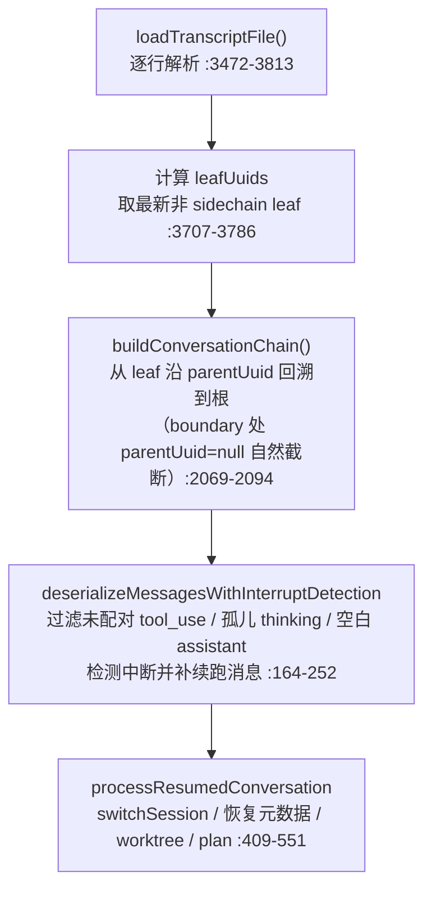

# Claude Code 会话存储与恢复：transcript 落盘、resume / fork / continue 与崩溃容错

## 文档定位

本文基于 `cc-haha` 源码，完整回答：**Claude Code 的会话（session）是如何持久化、如何恢复、崩溃后如何自愈的？**

`utils/sessionStorage.ts` 是源码中第三大的单文件（5105 行），承担 transcript 落盘、会话元数据、resume / continue / fork、snip 重放、崩溃容错等全部会话存储职责。它回答的是记忆架构文档里"transcript = 日志层"那半边的故事：

- transcript 的物理形态是什么（第 1 节）；
- 写入管道如何保证 append-only 与行级完整（第 2 节）；
- 没有独立索引文件，元数据如何组织与"保鲜"（第 3 节）；
- `--resume` / `--continue` / fork 各自做什么（第 4、5 节）；
- snip / tool result 替换状态如何在 resume 时重放（第 6 节）；
- 崩溃与半行 JSON 如何容错（第 7 节）；
- subagent 会话如何分开存储（第 8 节）；
- 若干值得知道的边界机制（第 9 节）。

源码根目录：

```text
/Users/songxijun/workspace/otherProject/cc-haha
```

边界说明：`src/services/sessionTranscript/sessionTranscript.ts` 与 `src/types/messageQueueTypes.ts` 为 generated stub，本文不涉及；CLI 入口在 `src/main.tsx`（参数定义 :988，continue 分支 :3121-3140，resume 分支 :3375 起）。相关阅读：同目录 `compaction-defense-strategy.md`（压缩防御）、`10_memory_patterns_basics/ClaudeCode长短期记忆架构设计文档.md` 9.1 节（transcript 定位）。

## 一页总览

| 问题 | 核心结论 |
| ---- | ---- |
| transcript 存在哪 | `~/.claude/projects/<sanitizePath(cwd)>/<sessionId>.jsonl`，UUID 命名 |
| 写入方式 | **append-only**：永不改写旧行，批量写队列每 100ms flush |
| 有没有索引文件 | 没有。所有元数据都是 jsonl 内的专用行，读取按 last-wins |
| resume 怎么重建 | 逐行解析 -> 找最新 leaf -> 沿 `parentUuid` 回溯成链 -> 修复中断 |
| compact 后旧消息去哪了 | **仍在磁盘上**。靠 boundary 的 `parentUuid: null` 截断链实现"逻辑删除" |
| fork 是什么 | 不复制不截断：源消息按 UUID 去重规则重写入新 sessionId 的 jsonl，源文件不动 |
| 崩溃容错 | 解析失败的行直接跳过；未配对 tool_use / 孤儿 assistant 被过滤；写队列串行化保证行级完整 |
| subagent 会话 | 分开存储：`<sessionId>/subagents/agent-<agentId>.jsonl` |

---

## 1. transcript 的物理形态

### 1.1 目录与命名

```text
~/.claude/projects/<sanitizePath(cwd)>/
├── <sessionId>.jsonl                    # 主 transcript，sessionId 为 UUID
└── <sessionId>/                         # 会话附属目录
    ├── subagents/
    │   ├── agent-<agentId>.jsonl        # subagent transcript
    │   ├── agent-<agentId>.meta.json    # subagent 元数据（agentType 等）
    │   └── <subdir>/                    # workflow 分组（可选）
    ├── remote-agents/
    │   └── remote-agent-<taskId>.meta.json
    └── tool-results/                    # 超大工具结果落盘
        └── <toolUseId>.txt|.json
```

路径解析见 `getProjectsDir()` / `getProjectDir()`（sessionStorage.ts:198, 436-438）、`getTranscriptPath()`（:202-205）；resume 时若设置了 `sessionProjectDir`（跨目录 resume）优先用它（:220-221）。

### 1.2 每行的 schema：消息行 + 元数据行

每行是一个独立 JSON 对象（`Entry` 联合类型，`src/types/logs.ts:297-317`），分两类：

**消息行**（`type: 'user' | 'assistant' | 'attachment' | 'system'`）：`isTranscriptMessage()` 是"什么算消息"的唯一判据（sessionStorage.ts:139-146，明确排除 `progress`）。system 行还有 subtype：`compact_boundary`、`microcompact_boundary`、`api_error`、`turn_duration` 等。每行附带审计字段：`parentUuid`、`logicalParentUuid`、`cwd`、`sessionId`、`gitBranch`、`version`、`userType`、`timestamp`、`promptId`、`agentId`、`teamName`（`insertMessageChain` 组装，:1039-1064）。

**元数据行**（各自带 sessionId 或 leafUuid/messageId 键）：`summary`、`custom-title`、`ai-title`、`last-prompt`、`task-summary`、`tag`、`agent-name`、`agent-color`、`mode`、`worktree-state`、`content-replacement`、`file-history-snapshot`、`attribution-snapshot`、`queue-operation`、`speculation-accept` 等（logs.ts:55-295）。没有独立索引文件，全部混在同一个 jsonl 里，读取时按"最后一次出现为准"（last-wins，`loadTranscriptFile` 各 Map 的 set 逻辑，:3658-3698）。

### 1.3 parentUuid 链：一切恢复的基础

- **compact boundary 写 `parentUuid: null`**（:1040-1041）--从 leaf 回溯时自然停在 boundary，但保留 `logicalParentUuid` 供跨边界追溯；
- tool_result 的 parent 指向其对应 assistant 的 uuid（`sourceToolAssistantUUID`，:1030-1037）；
- progress 不参与链（`isChainParticipant`，:154-156）；
- 环检测在 `buildConversationChain`（:2077-2085），悬空 parent 视为 fork/边界正常终止（`walkChainBeforeParse` 注释，:3413-3432）。

---

## 2. 写入管道：append-only 与行级完整

### 2.1 增量追加，批量 flush

写路径：`useLogMessages`（hooks/useLogMessages.ts:17）按**增量切片**调用 `recordTranscript()`（:1408-1449）-> `insertMessageChain()`（:993-1083）-> `appendEntry()`（:1128-1265）-> `enqueueWrite` 进入**按文件分组的写队列**；`drainWriteQueue()`（:645-686）每 **100ms**（`FLUSH_INTERVAL_MS`，:567）批量 `appendFile`，单批上限 100MB（:568）。CCR/远程模式下 flush 间隔降为 10ms（:530, 1350）。

没有 temp-file + rename 式的原子写；行级完整靠 **append-only + 单写队列串行化**保证：同一文件的所有写入都排队串行执行，不存在并发交错。

### 2.2 懒物化：不产生"空会话文件"

只有第一条 user/assistant 消息才真正创建文件（`materializeSessionFile()`，:976-991）；此前元数据先缓存在内存 `pendingEntries`（:552, 1139-1142）。避免到处留下只有标题没有对话的空文件。

### 2.3 UUID 去重：compact / fork 不重写

`appendEntry` 用 memoized `getSessionMessages`（:3842-3848）查已有 UUID 集合，重复即跳过（:1242-1243）。这一条规则同时支撑了两件事：

- compact 后 `messagesToKeep` 落盘时不会重复写；
- fork 把源会话消息复制进新文件时按正常路径走（见第 5 节）。

唯一的例外：fork-inherited 的 subagent sidechain 消息与主会话共享 UUID，写入时**绕过主文件去重**（`appendEntry` 的 isAgentSidechain bypass，:1230-1243）。

### 2.4 user 消息提前落盘

QueryEngine 在**进入查询循环之前**就把 user 消息写盘（QueryEngine.ts:429-458）--kill-mid-request 后这条消息仍在 transcript 里，resume 不会丢掉用户刚输入的内容。注释里说明了教训：早期只靠 queue-operation 行的 transcript 无法 resume。

### 2.5 写前过滤与权限

`isLoggableMessage()` / `cleanMessagesForLogging()`（:4351-4366, 4450）在写前过滤 progress、敏感 attachment（外部用户默认过滤，hook_additional_context 需环境变量开关）；REPL 包装对外部用户做脱敏重写（`transformMessagesForExternalTranscript`，:4396-4448）。文件权限 0o600、目录 0o700（:634-643）。`shouldSkipPersistence()`（:960-970）在 test / cleanupPeriodDays=0 / --no-session-persistence 时整体禁写。

---

## 3. 会话元数据：没有索引文件的索引

### 3.1 标题的三层来源

1. **用户标题**：`/rename` -> `saveCustomTitle()` 写 `custom-title` 行（:2617-2638）；
2. **AI 标题（走模型）**：`generateSessionTitle()`（sessionTitle.ts:79-140）用 **Haiku** side query + JSON schema prompt 生成 3-7 词标题，落盘为独立的 `ai-title` 行（:2667-2673）；
3. **兜底 first prompt**：`extractFirstPrompt`（:1725-1812）取第一条有效用户消息，跳过 isMeta、isCompactSummary、内置斜杠命令、XML 标签开头消息。

读取优先级：customTitle > aiTitle > firstPrompt（`readLiteMetadata`，:4771-4775）。

### 3.2 元数据"保鲜"：64KB tail 窗口

resume 列表只读每个文件**头尾各 64KB**（`LITE_READ_BUF_SIZE = 65536`，sessionStoragePortable.ts:17）来提取标题等元数据。长会话里早期写入的 custom-title / tag / mode 可能被"挤出"tail 窗口，因此 `reAppendSessionMetadata()`（:721-839）在 **compact 前**和**会话退出 cleanup**（:449-462）时把这些元数据重新 append 到文件尾，保证它们始终留在 tail 窗口内。append-only 设计在这里反哺了读取性能。

### 3.3 三级渐进加载

列出历史会话不开大文件：

```text
getSessionFilesLite()      纯 stat，不读文件内容（:4975-5016）
  -> enrichLogs()          只读头尾各 64KB 提取 firstPrompt / customTitle / gitBranch（:4739-4813, 5077-5105）
    -> loadFullLog()       用户选中后全量解析（:2949-3056）
```

resume picker 用 `loadSameRepoMessageLogsProgressive()`（跨 worktree，:4086-4108），首屏 enrich 50 条（:4577）。另有 `last-prompt` 每轮更新缓存（:1074-1081）、`task-summary` 每 min(5 步, 2min) 由 fork 线程写一次供 `claude ps` 使用（:2681-2688）。

---

## 4. resume / continue：从 jsonl 到内存 messages

### 4.1 入口分发（src/main.tsx）

| 命令 | 行为 |
| ---- | ---- |
| `claude --continue` / `-c` | `loadConversationForResume(undefined)`：取最近会话；跳过仍在活跃写自己 transcript 的 --bg/daemon 会话（conversationRecovery.ts:487-512） |
| `claude --resume <id>` | 直接按 sessionId 加载（`getLastSessionLog`，:3869） |
| `claude --resume <标题>` | 先按 custom title 精确匹配（`searchSessionsByCustomTitle`，:3065-3106），不中则当搜索词进 picker |
| `claude --resume`（无参） | 交互 picker（screens/ResumeConversation.tsx:127-158） |
| `--fork-session` 配合 resume/continue | fork 语义，见第 5 节 |

### 4.2 重建五步（conversationRecovery.ts:456-597）



细节：

1. **只加载消息行**：summary/title/snapshot 等元数据进各自 Map，不进 messages；
2. **compact boundary**：boundary 行 parentUuid 为 null，回溯自然停在 boundary；boundary 之后的 `isCompactSummary` user 消息是普通行、正常加载；
3. **大文件优化**：超过 5MB（`SKIP_PRECOMPACT_THRESHOLD`，sessionStoragePortable.ts:480）时在 **fd 级别直接丢弃最后一个 boundary 之前的字节**，再用 `scanPreBoundaryMetadata()`（:3157-3224）字节级扫回前段丢失的会话级元数据；`walkChainBeforeParse`（:3226-3466）在 JSON 解析前按字节剔除死分支，源码注释称解析耗时降低 80%~93%；
4. **部分 compact 的链拼接**：`applyPreservedSegmentRelinks()`（:1839-1956）处理带 preservedSegment 的局部压缩的链接与 token usage 清零；
5. **中断检测**：`:272-333` 识别"turn 进行到一半被 kill"的情形，补一条合成 user 消息 "Continue from where you left off."（:210-224）；末尾是 user 时补 assistant 哨兵（NO_RESPONSE_REQUESTED，:231-245）；skill 状态从 `invoked_skills` attachment 恢复（:382-403）。

### 4.3 副作用不重放：file-history-snapshot

resume 恢复的是**对话状态**，不是重新执行工具：

- `file-history-snapshot` 行按链内消息顺序重放为快照数组（`buildFileHistorySnapshotChain`，:2248-2272）；
- `fileHistoryRestoreStateFromLog()` 重建回退状态（fileHistory.ts:888-918），`copyFileHistoryForResume()` 把 `~/.claude/file-history/<旧sessionId>/` 备份迁到新 sessionId（:922 起）--rewind / 回退依赖这些快照，**没有找到 resume 时用 git diff 对比还原的代码**；
- TodoWrite 状态从 transcript 最后一次 tool_use 重建（sessionRestore.ts:77-93）；plan 文件 `copyPlanForResume`（conversationRecovery.ts:546）。

### 4.4 接管与一致性

非 fork resume：`switchSession(sid)` **复用原 sessionId**、`adoptResumedSessionFile()`（:1530-1534）直接把 sessionFile 指针指向被 resume 的文件并补写元数据、必要时 `restoreWorktreeForResume()` cd 回 worktree。恢复后 `checkResumeConsistency()`（:2224-2243）用 turn_duration checkpoint 校验重建条数，打点 `tengu_resume_consistency_delta`。

---

## 5. fork：不复制、不截断、UUID 相同的双文件

fork 的语义容易误解，实际做法（`--resume/--continue --fork-session`，sessionRestore.ts:435-462）：

1. 保留启动时新生成的 sessionId，**不** `switchSession`（源会话 id 不被采用）；
2. 源会话消息作为内存 messages 交给 REPL，`useLogMessages` -> `recordTranscript` 把它们**重新写入新 sessionId 的 jsonl**（消息 UUID 与源文件相同，在新文件里重建 parent 链）；
3. 源文件保持不动--同一对话从此存在两个（或多个）jsonl，共享消息 UUID。这正是 `trackSessionBranchingAnalytics`（:2526-2557）统计的会话分叉；
4. fork 需补种 `content-replacement` 记录到新 sessionId（:452-462）；不继承 worktree（:469-471）；ccshare resume 强制 `forkSession: true`（main.tsx:3616）。

为什么可行：第 2.3 节的 UUID 去重是**按文件**的（memoized 缓存 per session file），跨文件重写同一 UUID 不冲突；而 subagent sidechain 的 bypass（:1230-1243）专门处理 fork 继承父消息的场景。

---

## 6. 视图级压缩状态的 resume 重放

压缩防御文档讲过"恢复一致"原则，这里是其具体实现。

### 6.1 snip 重放：applySnipRemovals

问题（函数 doc，:1958-1980）：snip 删除的是**中段区间**消息，jsonl 是 append-only，被删消息仍在磁盘上，parentUuid 链会**穿过**它们--不处理则 resume 恢复出完整未 snip 的历史，直接 prompt-too-long。

解法（`applySnipRemovals`，:1982-2039，在 `loadTranscriptFile` 末尾调用）：

1. `removedUuids` 记录在 **compact boundary 行的 `snipMetadata` 字段**上（执行时写入；:1984-1992 用结构性探测兼容旧格式）；
2. 重放两步：收集全部 removedUuids 并从消息 Map 删除，同时缓存每个被删项自己的 parentUuid（:2000-2008）；对 parentUuid 悬空的幸存消息，沿 deletedParent **反向穿链**找到第一个未删祖先并 relink（带路径压缩，:2014-2027）；
3. 打点 `tengu_snip_resume_filtered`。

### 6.2 tool result 替换状态重建

两套机制（toolResultStorage.ts）：

1. **落盘文件**：`<persisted-output>` 替换文本本身存着文件路径，resume 复用同一 sessionId（非 fork）时路径天然有效，无需重关联；
2. **决策重放**：`reconstructContentReplacementState()`（:960-998）读 transcript 中的 `content-replacement` 行（可能含父级 inheritedReplacements）：所有出现过的 tool_use_id 全部标记为 seen（**冻结、不再替换**，保证 prompt cache）；有 record 的 ID 恢复其 replacement 字符串。写侧 `applyToolResultBudget` 通过回调把 newlyReplaced 写成 `content-replacement` 行（:924-936；sessionStorage.ts:1113-1126）。

---

## 7. 崩溃容错

| 故障形态 | 容错机制 | 证据 |
| ---- | ---- | ---- |
| 尾部半行 JSON | `parseJSONL` 解析失败的行直接跳过（json.ts:155-180），续扫下一行 | 自然丢弃，无需修复 |
| 中断的 assistant（未配对 tool_use） | `filterUnresolvedToolUses` 过滤 | conversationRecovery.ts:186-202 |
| 孤儿 thinking-only / 空白 assistant | deserialize 阶段过滤 | 同上 |
| turn 中断 | 检测后补 "Continue from where you left off." | :210-224 |
| 并行 tool_use 的 DAG 漏块 | `recoverOrphanedParallelToolResults()` 按 message.id 分组把孤儿兄弟块拼回链 | :2118-2206 |
| 流式失败产生的孤儿消息 | tombstone：`removeTranscriptMessage` -> `removeMessageByUuid`，快路径只读尾部 64KB、ftruncate + 定位重写；>50MB 放弃（`MAX_TOMBSTONE_REWRITE_BYTES`，:123） | :871-951 |
| 退出时机 | `registerCleanup` 先 `flush()` 再 `reAppendSessionMetadata()` | :449-462 |
| 一致性监控 | `checkResumeConsistency` 对比 turn_duration checkpoint 的 messageCount | :2224-2243 |

注意：tombstone 是**唯一**的物理删行路径；compact / snip / microcompact 全都不删行（`applySnipRemovals` doc :1963-1964 明确 "The JSONL is append-only, so removed messages stay on disk"）。

---

## 8. subagent 会话：分开存储与路由

- **独立文件**：`getAgentTranscriptPath()` -> `<projectDir>/<sessionId>/subagents/agent-<agentId>.jsonl`（:247-258）；workflow 可加子目录（:234-245）；
- **写路由**：`recordSidechainTranscript()`（:1451-1462）-> `appendEntry` 中 isAgentSidechain 的消息路由到 agent 文件，且绕过主文件 UUID 去重（:1224-1243）；
- **sidecar 元数据**：`agent-<id>.meta.json`（agentType / worktreePath / description，:260-303）供 fork-resume 时正确路由 subagent 类型；远程 agent 在 `remote-agents/`（:305-399）；
- **读取**：`getAgentTranscript()` 按 agentId + isSidechain 过滤建链（:4190-4236）；`loadAllSubagentTranscriptsFromDisk()` glob 整个 subagents 目录（:4325-4347）；
- **排除出 resume 列表**：enrichLog 过滤 isSidechain / teamName（:5056-5067）。

---

## 9. 边界机制拾遗

- **summary 行**：`type:'summary', leafUuid, summary` 供 resume 列表显示（:3658-3659）；写入方在本 build 中被裁剪（仅存类型与读取），推测在 ant-internal 模块；
- **queue-operation 行**：messageQueueManager 的 add/remove 审计日志（:1464-1466），`loadTranscriptFile` **不消费**该类型，resume 不重放消息队列；
- **attribution-snapshot / marble-origami**（context collapse 的 commit/snapshot，:1541-1581）与 `microcompact_boundary`（messages.ts:4552-4573）走同一 jsonl；
- **读取上限**：单文件读取上限 50MB（`MAX_TRANSCRIPT_READ_BYTES`，:229）；
- **CCR 远程会话**：`hydrateRemoteSession()` / `hydrateFromCCRv2InternalEvents()`（:1587-1723）把远端事件整写回本地 jsonl，使远程会话在本地拥有同构 transcript；
- **`/insights` 类全 leaf 分析**：`loadAllLogsFromSessionFile()`（:4598）加载单文件全部对话链。

---

## 10. 总结

```text
会话存储 = append-only jsonl（消息行 + 元数据行混存，last-wins）
         + parentUuid 链（一切恢复的骨架；boundary 用 null 截断实现逻辑删除）
         + 单写队列串行化（行级完整）+ UUID 按文件去重（compact/fork 复用）
恢复     = 逐行解析 -> leaf 回溯建链 -> 中断修复 -> 快照/替换状态重放
fork     = 新 sessionId 重写消息（UUID 相同），源文件不动
容错     = 跳过坏行 + 过滤孤儿块 + tombstone 唯一物理删行 + 一致性打点
```

一句话设计思想：

> transcript 是唯一事实源（single source of truth）：写入端只追加、从不改写；一切"删除"（compact、snip、microcompact）都是视图层概念，靠 parentUuid 截断与 resume 重放实现；恢复端不信任文件是完好的（半行、孤儿块、中断 turn 都有对策），但信任 UUID 与 parent 链是自洽的。

## 关键源码文件

| 文件 | 职责 |
| ---- | ---- |
| `src/utils/sessionStorage.ts` | 全部会话存储：路径、写队列、解析、恢复、元数据、tombstone |
| `src/utils/sessionStoragePortable.ts` | lite 读取（64KB 头尾）、大文件 fd 级跳过阈值 |
| `src/utils/conversationRecovery.ts` | resume 重建流程：建链、中断检测、副作用恢复 |
| `src/utils/sessionRestore.ts` | resume 后处理：switchSession / adopt / worktree / fork 分支 |
| `src/utils/json.ts` | parseJSONL：坏行跳过 |
| `src/utils/toolResultStorage.ts` | tool-results/ 落盘与 content-replacement 决策重放 |
| `src/utils/fileHistory.ts` | file-history-snapshot 重建与迁移（rewind 依据） |
| `src/utils/sessionTitle.ts` | Haiku 生成 AI 标题 |
| `src/main.tsx` | CLI 入口：-c / -r / --fork-session 分发 |
| `src/types/logs.ts` | Entry 联合类型的完整定义（所有行类型） |
