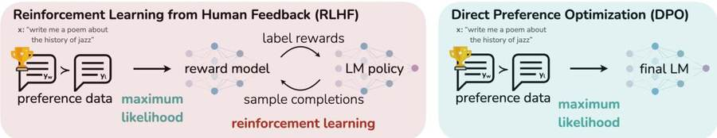
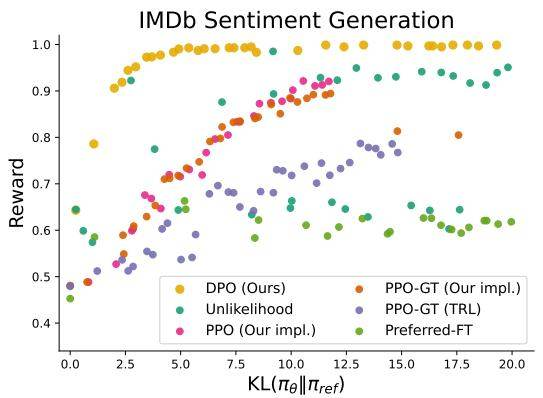
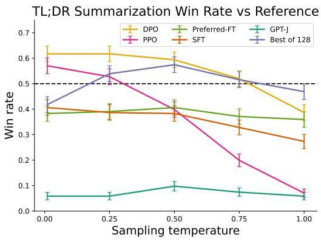
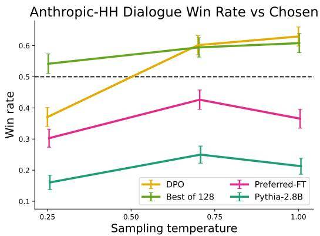
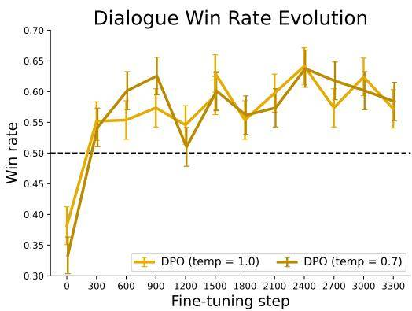
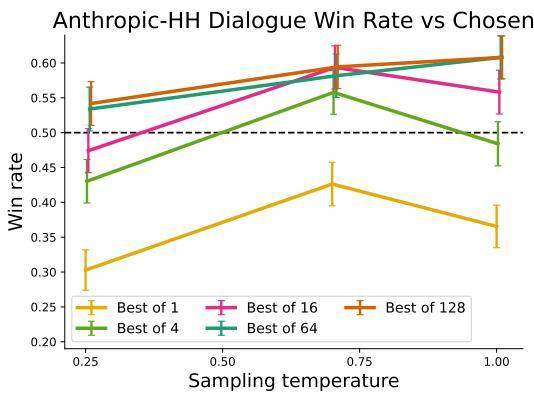
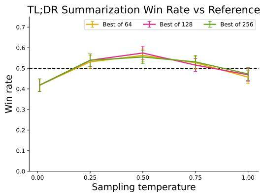

# Direct Preference Optimization (DPO，直接偏好优化): Your Language Model is Secretly a Reward Model

Rafael Rafailov∗†

Archit Sharma∗†

Eric Mitchell∗†

Stefano Ermon†‡

Christopher D. Manning†

Chelsea Finn†

†Stanford University ‡CZ Biohub {rafailov,architsh,eric.mitchell}@cs.stanford.edu

## 摘要

虽然大规模无监督语言模型（LM）学习广泛的世界知识和一些推理技能，但由于其训练的完全无监督性质，实现对其行为的精确控制是困难的。获得这种可操纵性的现有方法收集模型生成相对质量的人类标签，并对无监督 LM 进行 fine-tune 以符合这些偏好，通常通过人类反馈（RLHF）进行 reinforcement learning（强化学习）。然而，RLHF 是一个复杂且通常不稳定的过程，首先拟合反映 human preferences（人类偏好） 的 reward model（奖励模型），然后使用 reinforcement learning（强化学习） 对大型无监督 LM 进行 fine-tune，以最大化估计的奖励，而不会偏离原始模型太远。在本文中，我们引入了 RLHF reward model（奖励模型） 的新参数化，它能够以封闭形式提取相应的 optimal policy（最优策略），使我们能够仅用简单的分类损失来解决标准 RLHF 问题。由此产生的算法，我们称之为 Direct Preference Optimization (DPO，直接偏好优化)，稳定、高性能且计算量轻，无需在 fine-tune 或执行重要的超参数调整期间从 LM 进行采样。我们的实验表明，DPO 可以 fine-tune LM 以符合 human preferences（人类偏好），并且比现有方法更好。值得注意的是，使用 DPO 进行 fine-tune 在控制生成情感的能力方面超过了基于 PPO 的 RLHF，并且匹配或提高了摘要和单轮对话中的响应质量，同时大大简化了实施和训练。

## 1 引言

在非常大的数据集上训练的大型无监督语言模型（LM）获得了令人惊讶的能力 [11, 7, 42, 8]。然而，这些模型是根据人类生成的数据进行训练的，这些数据具有各种目标、优先级和技能。其中一些目标和技能可能不适合模仿；例如，虽然我们可能希望人工智能编码助手理解常见的编程错误以便纠正它们，但是，在生成代码时，我们希望我们的模型偏向于其训练数据中存在的（可能罕见的）高质量编码能力。同样，我们可能希望我们的语言模型能够意识到 50% 的人相信的常见误解，但我们当然不希望模型在 50% 的查询中声称这种误解是正确的！换句话说，从广泛的知识和能力中选择模型所需的响应和行为对于构建安全、高性能和可控的人工智能系统至关重要 [28]。虽然现有方法通常使用 reinforcement learning (RL，强化学习) 来引导 LM 匹配 human preferences（人类偏好），但我们将证明现有方法使用的基于 RL 的目标可以通过简单的 binary cross-entropy（二元交叉熵） 目标进行精确优化，从而大大简化 preference learning（偏好学习） 流程。


图 1：DPO 针对 human preferences（人类偏好） 进行优化，同时避免 reinforcement learning（强化学习）。现有的利用人类反馈 fine-tune 语言模型的方法首先将 reward model（奖励模型） 拟合到提示数据集和人类对响应对的偏好，然后使用 reinforcement learning（强化学习） 找到最大化 learned reward（学习到的奖励） 的 policy（策略）。相比之下，DPO 通过简单的分类目标直接优化最能满足偏好的 policy（策略），拟合隐式 reward model（奖励模型），该模型可以以封闭形式提取相应的 optimal policy（最优策略）。

在较高层面上，现有方法使用精选的 human preference set 将所需的行为灌输到语言模型中，这些偏好集代表了人类认为安全和有帮助的行为类型。这个 preference learning（偏好学习） 阶段发生在对大型文本数据集进行大规模无监督预训练的初始阶段之后。

虽然 preference learning（偏好学习） 最直接的方法是对人类高质量反应演示进行 SFT，但最成功的一类方法是根据人类（或人工智能）反馈进行 reinforcement learning（强化学习）（RLHF/RLAIF； [12, 2]）。 RLHF 方法将 reward model（奖励模型） 与 preference dataset（偏好数据集） 相匹配，然后使用 RL 来优化 language model policy（语言模型策略），以生成分配高奖励的响应，而不会偏离原始模型太远。虽然 RLHF 生成的模型具有令人印象深刻的会话和编码能力，但 RLHF 流程比监督学习复杂得多，涉及训练多个 LM 并在训练循环中从 LM policy（策略） 中采样，从而产生大量计算成本。

在本文中，我们展示了如何直接优化语言模型以遵循 human preferences（人类偏好），而无需明确的 reward modeling（奖励建模） 或 reinforcement learning（强化学习）。我们提出了 Direct Preference Optimization (DPO，直接偏好优化)，这是一种隐式优化与现有 RLHF 算法相同目标的算法（具有 KL 散度约束的 reward maximization（奖励最大化）），但易于实现且易于训练。直观上，DPO 更新增加了 preferred response（偏好响应） 与 dispreferred response（非偏好响应） 的相对对数概率，但它包含了动态的、每个示例的重要性权重，可以防止我们发现在朴素概率比目标下发生模型退化。与现有算法一样，DPO 依赖于理论 preference model（偏好模型）（例如 Bradley-Terry 模型； [5]）衡量给定 reward function（奖励函数） 与经验 preference data（偏好数据） 的一致性程度。然而，虽然现有方法使用 preference model（偏好模型） 来定义 preference loss（偏好损失） 来训练 reward model（奖励模型），然后训练优化学习 reward model（奖励模型） 的 policy（策略），但 DPO 使用变量的变化将 preference loss（偏好损失） 直接定义为 policy（策略） 的函数。给定人类对模型响应的 preference dataset（偏好数据集），DPO 可以使用简单的 binary cross-entropy（二元交叉熵） 目标来优化 policy（策略），从而生成适合 preference data（偏好数据） 的隐式 reward function（奖励函数） 的 optimal policy（最优策略）。

我们的主要贡献是 Direct Preference Optimization (DPO，直接偏好优化)，这是一种简单的无 reinforcement learning（强化学习） 算法，用于根据偏好训练语言模型。我们的实验表明，DPO 至少与现有方法（包括基于 PPO 的 RLHF）一样有效，可以使用最多 6B 个参数的语言模型从情绪调节、摘要和对话等任务中的偏好进行学习。

## 2 相关工作

规模不断扩大的自监督语言模型学习零样本完成一些任务 [33] 或带有少量提示 [6, 27, 11]。然而，通过对指令数据集和人工撰写的补全的数据进行 fine-tune，可以显着提高它们在下游任务上的性能以及与用户意图的一致性 [25, 38, 13, 41]。这种“指令调整”过程使 LLM 能够推广到指令调整集之外的指令，并普遍提高其可用性 [13]。尽管指令调整取得了成功，但人类对响应质量的相对判断通常比专家演示更容易收集，因此后续工作利用 human preferences（人类偏好） 的数据集对 LLM 进行了 fine-tune，提高了翻译熟练程度 [20], 总结 [40, 51]、讲故事 [51]，并遵循指令 [28, 34]。这些方法首先优化神经网络 reward function（奖励函数），以便与 preference model（偏好模型） 下的 preference dataset（偏好数据集） 兼容，例如

Bradley-Terry模型 [5]，然后使用 reinforcement learning（强化学习） 算法 fine-tune 语言模型以最大化给定的奖励，通常是 REINFORCE [47]，Proximal Policy Optimization (PPO，近端策略优化; [39])，或变体 [34]。密切相关的工作线利用 LLM 根据人类反馈进行 fine-tune，为目标属性（例如安全性或无害性）生成额外的综合 preference data（偏好数据） [2]，仅以文本标题的形式使用人类的弱监督来进行 LLM 的注释。这些方法代表了两项工作的融合：一项工作是通过针对各种目标的 reinforcement learning（强化学习） 来训练语言模型 [35, 29, 48] 以及关于 learning from human preferences（从人类偏好中学习） 的一般方法的另一项工作 [12, 21]。尽管使用相对 human preferences（人类偏好） 很有吸引力，但通过 reinforcement learning（强化学习） 对大型语言模型进行 fine-tune 仍然是一个重大的实际挑战。这项工作提供了一种理论上合理的方法，可以在没有 reinforcement learning（强化学习） 的情况下优化相对偏好。

在语言背景之外，在强盗学习和 reinforcement learning（强化学习） 环境中都研究了 learning policies from preferences（从偏好中学习策略），并提出了几种方法。使用偏好或行为排名而不是奖励的情境强盗学习被称为情境决斗强盗（CDB； [50, 14]）。在没有绝对回报的情况下，CDB 的理论分析用冯·诺依曼获胜者替代了 optimal policy（最优策略） 的概念，该 policy（策略） 相对于任何其他 policy（策略） 的预期获胜率至少为 50% [14]。然而，在 CDB 设置中，偏好标签是在线给出的，而在 learning from human preferences（从人类偏好中学习） 时，我们通常从固定批次的离线偏好注释的动作对中学习 [49]。类似地，基于偏好的 reinforcement learning（强化学习） (PbRL) 从未知“评分”函数生成的二元偏好中学习，而不是从奖励中学习 [9, 37]。 PbRL 存在各种算法，包括可以重用 off-policy preference data（离策略偏好数据） 的方法，但通常涉及首先显式估计潜在评分函数（即 reward model（奖励模型）），然后对其进行优化 [16, 9, 12, 36, 21]。相反，我们提出了一种单阶段 policy learning（策略学习） 方法，可以直接优化 policy（策略） 以满足偏好。

## 3 预备知识

我们回顾了 Ziegler 等人的 RLHF 流程。（以及后来 [40, 1, 28]）。它通常包括三个阶段：1）Supervised Fine-Tuning (SFT，监督微调)； 2) 偏好采样和奖励学习，3) reinforcement learning（强化学习） 优化。

SFT: RLHF 通常首先 fine-tune 预训 LM,为感兴趣的下游任务(对话、总结等)对高质量数据进行监督学习,以获得模型 $\bar { \pi } ^ { \mathrm { S F I } }$

reward modeling（奖励建模） 阶段：在第二阶段，SFT 模型会提示 x 来生成答案对 $( y _ { 1 } , y _ { 2 } ) \sim \pi ^ { \mathrm { { S F T } } } ( y \mid x )$ 然后将这些结果呈现给 human labelers（人工标注者），他们表达对一个答案的偏好，表示为 $y _ { w } \ \succ \ y _ { l } \ | \ x$ 在哪里 $y _ { w }$ yl 表示首选和 dispreferred completion（非偏好补全） $( y _ { 1 } , y _ { 2 } )$ 分别。假设偏好是由某种潜在 reward model（奖励模型） 生成的 $r ^ { \ast } ( y , x )$，我们无权访问。有多种方法可用于对偏好进行建模，例如 Bradley-Terry (BT) [5] 模型是一种流行的选择（尽管更通用的 Plackett-Luce 排名模型 [32, 23] 如果我们可以访问几个排名答案，它们也与框架兼容）。 BT 模型规定 human preferences（人类偏好） 分布 $p ^ { * }$ 可以写成：

$$
p ^ { * } ( y _ { 1 } \succ y _ { 2 } \mid x ) = \frac { \exp { ( r ^ { * } ( x , y _ { 1 } ) ) } } { \exp { ( r ^ { * } ( x , y _ { 1 } ) ) } + \exp { ( r ^ { * } ( x , y _ { 2 } ) ) } } .\tag{1}
$$

假设访问静态比较数据集 $\mathcal { D } = \left\{ x ^ { ( i ) } , y _ { w } ^ { ( i ) } , y _ { l } ^ { ( i ) } \right\} _ { i = 1 } ^ { N }$ 采样自 $p ^ { * }$，我们可以参数化 reward model（奖励模型） $r _ { \phi } ( x , y )$ 并通过 maximum likelihood（最大似然） 估计参数。将问题构建为二元分类，我们得到 negative log-likelihood（负对数似然） 损失：

$$
\mathcal { L } _ { R } ( r _ { \phi } , \mathcal { D } ) = - \mathbb { E } _ { ( x , y _ { w } , y _ { l } ) \sim \mathcal { D } } \left[\log \sigma ( r _ { \phi } ( x , y _ { w } ) - r _ { \phi } ( x , y _ { l } ) ) \right]\tag{2}
$$

在哪里 $\sigma$ 是逻辑函数。在 LM 的背景下，网络 $r _ { \phi } ( x , y )$ 通常从 SFT 模型初始化 $\pi ^ { \mathrm { S F T } } ( y \mid x )$ 在最终 Transformer 层之上添加一个线性层，为奖励值生成单个标量预测 [51]。为了确保 reward function（奖励函数） 具有较低的方差，先前的工作对奖励进行标准化，使得 $\mathbb { E } _ { x , y \sim \mathcal { D } } \left[r _ { \phi } ( x , y ) \right] = 0$ 对于所有 x。

RL fine-tuning 阶段：在 RL 阶段，学习到的 reward function（奖励函数） 用于向语言模型提供反馈。继之前的作品之后 [17, 18]，优化公式为

$$
\operatorname* { m a x } _ { \pi _ { \theta } } \mathbb { E } _ { x \sim \mathcal { D } , y \sim \pi _ { \theta } ( y \mid x ) } \big [r _ { \phi } ( x , y ) \big] - \beta \mathbb { D } _ { \mathbf { K L } } \big [\pi _ { \theta } ( y \mid x ) \mid \mid \pi _ { \mathrm { r e f } } ( y \mid x ) \big] ,\tag{3}
$$

其中 β 是控制与基本 reference policy（参考策略） 的偏差的参数 $\pi _ { \mathrm { r e f } } .$，即初始 SFT 模型 $\pi ^ { \mathrm { S F I } }$。在实践中，language model policy（语言模型策略） πθ 也被初始化为 $\pi ^ { \mathrm { { \scriptsize { S F I } } } }$。增加的约束很重要，因为它可以防止模型偏离 reward model（奖励模型） 准确的分布太远，并保持生成多样性并防止模式崩溃为单一高奖励答案。由于语言生成的离散性，该目标是不可微分的，通常通过 reinforcement learning（强化学习） 进行优化。标准方法 [51, 40, 1, 28] 已经构建了 reward function（奖励函数） $r ( x , y ) = r _ { \phi } ( x , y ) - \beta ( \log \pi _ { \theta } ( y \mid x ) - \log \pi _ { \mathrm { r e f } } ( y \mid x ) )$，并最大限度地利用 PPO [39].

## 4 Direct Preference Optimization（DPO，直接偏好优化）

受 fine-tuning（微调）语言模型这类大规模问题中应用 reinforcement learning（强化学习）算法的挑战启发，我们的目标是推导一种直接利用偏好进行 policy optimization（策略优化）的简单方法。不同于以往先学习 reward（奖励）再通过 $\mathrm { R L }$ 对其进行优化的 RLHF 方法，我们的方法采用一种特定的 reward model parameterization（奖励模型参数化），使得无需 RL 训练循环也能以 closed form（闭式形式）提取对应的 optimal policy（最优策略）。正如下面将详细说明的，我们的核心洞见是利用 reward function（奖励函数）到 optimal policy（最优策略）的解析映射，从而把定义在 reward function（奖励函数）上的 loss function（损失函数）转换为定义在 policy（策略）上的 loss function（损失函数）。这种 change-of-variables（变量替换）方法避免了拟合一个显式、独立的 reward model（奖励模型），同时仍然可以在 Bradley-Terry model（Bradley-Terry 模型）等现有 human preferences（人类偏好）模型下进行优化。本质上，policy network（策略网络）同时表示 language model（语言模型）和 implicit reward（隐式奖励）。

Deriving the DPO objective（推导 DPO 目标）。我们从与先前工作相同的 RL 目标出发，即公式 3，在一般 reward function（奖励函数） $r$ 下进行推导。沿用先前工作 [31, 30, 19, 15]，可以直接证明，公式 3 中 KL-constrained reward maximization（KL 约束的奖励最大化）目标的最优解具有如下形式：

$$
\pi _ { r } ( y \mid x ) = \frac { 1 } { Z ( x ) } \pi _ { \mathrm { r e f } } ( y \mid x ) \exp \left( \frac { 1 } { \beta } r ( x , y ) \right) ,\tag{4}
$$

其中 $\begin{array} { r } { Z ( x ) = \sum _ { y } \pi _ { \mathrm { r e f } } ( y \mid x ) \exp \left( \frac { 1 } { \beta } r ( x , y ) \right) } \end{array}$ 是 partition function（配分函数）。完整推导见附录 A.1。即使我们使用 ground-truth reward function（真实奖励函数） $r ^ { * }$ 的 MLE estimate（最大似然估计） $r _ { \phi }$，估计 partition function（配分函数） $Z ( x ) [ 1 \dot { 9 } , 1 5 ]$ 仍然代价很高，因此这种表示在实践中不易使用。不过，我们可以重排公式 4，用对应的 optimal policy（最优策略） $\pi _ { r } .$、reference policy（参考策略） $\pi _ { \mathrm { r e f } } .$ 和未知的 partition function（配分函数） $Z ( \cdot )$ 来表示 reward function（奖励函数）。具体地，我们先对公式 4 两边取对数，再经过一些代数变换，得到：

$$
r ( x , y ) = \beta \log \frac { \pi _ { r } ( y \mid x ) } { \pi _ { \mathrm { r e f } } ( y \mid x ) } + \beta \log Z ( x ) .\tag{5}
$$

我们可以把这种 reparameterization（重新参数化）应用到 ground-truth reward（真实奖励） $r ^ { * }$ 及其对应的 optimal model（最优模型） $\pi ^ { * }$。幸运的是，Bradley-Terry model（Bradley-Terry 模型）只依赖两个 completion（补全）之间的 reward difference（奖励差），即 $\operatorname { i . e . , } p ^ { * } ( y _ { 1 } \succ y _ { 2 } \mid x ) ^ { * } = \sigma ( r ^ { * } ( x , \mathcal { Y } _ { 1 } ) - r ^ { * } ( x , y _ { 2 } ) )$。将公式 5 中 $r ^ { * } ( x , y )$ 的 reparameterization（重新参数化）代入公式 1 的 preference model（偏好模型）后，partition function（配分函数）会相互抵消，因此 human preference probability（人类偏好概率）可以只用 optimal policy（最优策略） $\pi ^ { * }$ 和 reference policy（参考策略） $\pi _ { \mathrm { r e f } }$ 表示。因此，在 Bradley-Terry model（Bradley-Terry 模型）下，最优 RLHF policy（策略） $\pi ^ { * }$ 满足如下 preference model（偏好模型）：

$$
p ^ { * } ( y _ { 1 } \succ y _ { 2 } \mid x ) = { \frac { 1 } { 1 + \exp \left( \beta \log { \frac { \pi ^ { * } ( y _ { 2 } | x ) } { \pi _ { \mathrm { r e f } } ( y _ { 2 } | x ) } } - \beta \log { \frac { \pi ^ { * } ( y _ { 1 } | x ) } { \pi _ { \mathrm { r e f } } ( y _ { 1 } | x ) } } \right) } }\tag{6}
$$

推导见附录 A.2。虽然公式 6 使用的是 Bradley-Terry model（Bradley-Terry 模型），但对于更一般的 Plackett-Luce model（Plackett-Luce 模型）[32, 23]，也可以用类似方式推出相应表达式，见附录 ${ \bf A } . 3 .$

现在，我们已经把 human preference data（人类偏好数据）的概率表示为 optimal policy（最优策略）的函数，而不是 reward model（奖励模型）的函数，因此可以为 parameterized policy（参数化策略） $\pi _ { \theta }$ 构造 maximum likelihood（最大似然）目标。类似于 reward modeling（奖励建模）方法（即公式 2），我们的 policy objective（策略目标）变为：

$$
\begin{array} { r } { \mathcal { L } _ { \mathrm { D P O } } ( \pi _ { \theta } ; \pi _ { \mathrm { r e f } } ) = - \mathbb { E } _ { ( x , y _ { w } , y _ { l } ) \sim \mathcal { D } } \left[\log \sigma \left( \beta \log \frac { \pi _ { \theta } ( y _ { w } \mid x ) } { \pi _ { \mathrm { r e f } } ( y _ { w } \mid x ) } - \beta \log \frac { \pi _ { \theta } ( y _ { l } \mid x ) } { \pi _ { \mathrm { r e f } } ( y _ { l } \mid x ) } \right) \right] . } \end{array}\tag{7}
$$

这样，我们就用另一种 parameterization（参数化）来拟合 implicit reward（隐式奖励），而该 implicit reward（隐式奖励）的 optimal policy（最优策略）正是 $\pi _ { \theta }$。此外，由于我们的过程等价于拟合一个重新参数化的 Bradley-Terry model（Bradley-Terry 模型），因此它具备某些理论性质，例如在 preference data distribution（偏好数据分布）满足适当假设时的一致性 [4]。第 5 节将进一步讨论 DPO 相对于其他工作的理论性质。

What does the DPO update do?（DPO 更新在做什么？）为了从机制上理解 $\mathrm { D P O }$，分析 loss function（损失函数） $\mathcal { L } _ { \mathrm { D P O } }$ 的 gradient（梯度）很有用。它相对于参数 $\theta$ 的 gradient（梯度）可以写为：

$$
\begin{array} { r l } & { \nabla _ { \theta } \mathcal { L } _ { \mathrm { D P O } } ( \pi _ { \theta } ; \pi _ { \mathrm { r e f } } ) = } \\ & { - \beta \mathbb { E } _ { ( x , y _ { w } , y _ { l } ) \sim \mathcal { D } } \bigg [\underbrace { \sigma \big ( \hat { r } _ { \theta } ( x , y _ { l } ) - \hat { r } _ { \theta } ( x , y _ { w } ) \big ) } _ { \mathrm { h i g h e r w e i g h t w e n e n t ~ e x i m a t e ~ i s ~ w r o n g } } \bigg [\underbrace { \nabla _ { \theta } \log \pi ( y _ { w } \mid x ) } _ { \mathrm { i n c r e a s c ~ i h k e l i h o o d ~ o f } y _ { w } } - \underbrace { \nabla _ { \theta } \log \pi ( y _ { l } \mid x ) } _ { \mathrm { d e c r e a s e ~ l i k e l i h o o d ~ o f } y _ { l } } \bigg] \bigg] , } \end{array}
$$

其中 $\begin{array} { r } { \hat { r } _ { \theta } ( x , y ) = \beta \log \frac { \pi _ { \theta } ( y | x ) } { \pi _ { \mathrm { r e f } } ( y | x ) } } \end{array}$ 是由 language model（语言模型） $\pi _ { \theta }$ 和 reference model（参考模型） $\pi _ { \mathrm { r e f } }$ 隐式定义的 reward（奖励）（详见第 5 节）。直观地说，loss function（损失函数） $\mathcal { L } _ { \mathrm { D P O } }$ 的 gradient（梯度）会提高 preferred completions（偏好补全） $y _ { w }$ 的 likelihood（似然），并降低 dispreferred completions（非偏好补全） $y _ { l } .$ 的 likelihood（似然）。重要的是，每个样本的权重取决于 implicit reward model（隐式奖励模型） ${ \hat { r } } _ { \theta }$ 对 dispreferred completions（非偏好补全）打分比 preferred completions（偏好补全）高多少，并由 $\beta$ 缩放。换言之，这个权重反映了 implicit reward model（隐式奖励模型）在 completion（补全）排序上“错得有多严重”，同时考虑 KL constraint（KL 约束）的强度。我们的实验表明这种加权很重要，因为去掉该加权系数的朴素版本会导致 language model（语言模型）退化（附录表 3）。

DPO outline（DPO 流程概述）。一般 DPO pipeline（流程）如下：1）对每个 prompt（提示） $x$，采样 completions（补全） $y _ { 1 } , y _ { 2 } \sim \pi _ { \mathrm { r e f } } ( \cdot \mid x )$，并用 human preferences（人类偏好）进行标注，从而构造离线 preference dataset（偏好数据集） $\mathcal { D } = \{ x ^ { ( i ) } , y _ { w } ^ { ( i ) } , y _ { l } ) ^ { ( i ) } \} _ { i = 1 } ^ { N }$；2）在给定 $\pi _ { \mathrm { r e f } }$、$\mathcal { D }$ 和所需 $\beta .$ 的情况下，优化 language model（语言模型） $\pi _ { \theta }$ 以最小化 $\mathcal { L } _ { \mathrm { D P O } }$。实践中，人们通常希望复用公开可得的 preference datasets（偏好数据集），而不是自行生成样本并收集 human preferences（人类偏好）。由于这些 preference datasets（偏好数据集）通常是用 $\pi ^ { \mathrm { { S F T } } }$ 采样得到的，只要可用，我们就初始化 $\pi _ { \mathrm { r e f } } \ = \ \pi ^ { \mathrm { S F T } }$。然而，当 $\pi ^ { \mathrm { S F T } }$ 不可用时，我们通过最大化 preferred completions（偏好补全） $( x , y _ { w } )$ 的 likelihood（似然）来初始化 $\pi _ { \mathrm { r e f } }$，即 $\begin{array} { r } { \mathrm { i s } , \pi _ { \mathrm { r e f } } = \arg \operatorname* { m a x } _ { \pi } \mathbb { E } _ { x , y _ { w } \sim \mathcal { D } } \left[ \log \pi ( y _ { w } \mid x ) \right] } \end{array}$。这一过程有助于缓解不可得的真实 reference distribution（参考分布）与 DPO 所用 $\pi _ { \mathrm { r e f } }$ 之间的 distribution shift（分布偏移）。实现和超参数的更多细节见附录 B。

## 5 DPO 的理论分析

在本节中，我们对 DPO 方法进行进一步解释，提供理论支持，并将 DPO 的优点与用于 RLHF 的 Actor Critic 算法（例如 PPO [39]).

## 5.1 Your Language Model Is Secretly a Reward Model

DPO 能够绕过拟合显式奖励和执行 RL，以使用单个 maximum likelihood（最大似然） 目标来学习 policy（策略）。注意优化目标方程。 5 相当于带有奖励参数化的 Bradley-Terry 模型 $\begin{array} { r } { r ^ { * } ( x , y ) = \beta \log \frac { \pi _ { \theta } ^ { * } ( y | x ) } { \pi _ { \mathrm { r e f } } ( y | x ) } } \end{array}$ 然后我们优化参数模型 πθ，相当于等式 1 中的 reward model（奖励模型） 优化。 2. 变量变化情况下。在本节中，我们将构建这种重新参数化背后的理论，证明它不会限制学习 reward model（奖励模型） 的类别，并且允许精确恢复 optimal policy（最优策略）。我们首先定义 reward function（奖励函数） 之间的等价关系。

定义1. 我们说两个 reward function（奖励函数） $r ( x , y )$ 和 $r ^ { \prime } ( x , y )$ 是等价的 $i f f$ $r ( x , y ) - r ^ { \prime } ( x , y ) = f ( x )$ 对于某些功能 ${ \dot { f } } .$

很容易看出，这确实是一个等价关系，它将 reward function（奖励函数） 集划分为类别。我们可以陈述以下两个引理：

引理 1. 在 Plackett-Luce，特别是 Bradley-Terry 偏好框架下，来自同一类别的两个 reward function（奖励函数） 导致相同的偏好分布。

引理 2. 来自同一等价类的两个 reward function（奖励函数） 在约束 RL 问题下得出相同的 optimal policy（最优策略）。

证明很简单，我们将其放在附录 A.5 中。第一个引理是 Plackett-Luce 系列模型中众所周知的规格不足问题 [32]。由于这种规格不足，我们通常必须施加额外的可识别性约束，以实现对等式 1 的 MLE 估计的任何保证。 2 [4]。第二个引理指出，同一类别的所有 reward function（奖励函数） 都会产生相同的 optimal policy（最优策略），因此对于我们的最终目标，我们只对从最优类别恢复任意 reward function（奖励函数） 感兴趣。我们在附录 A.6 中证明了以下定理：

定理 1. 在温和的假设下，所有与 Plackett-Luce（特别是 Bradley-Terry）模型一致的奖励类别都可以用重新参数化来表示 $\begin{array} { r } { r ( x , y ) = \beta \log \frac { \pi ( y | x ) } { \pi _ { r e f } ( y | x ) } } \end{array}$ 对于某些型号 $\pi ( y \mid x )$ 和给定的参考模型 $\pi _ { r e f } ( y \mid x )$

证明草图。考虑任何 reward function（奖励函数） $r ( x , y )$，从而得出相应的最优模型 $\pi _ { r } ( y \mid x )$，由方程式指定。 4. 我们将证明 r 等价类的 reward function（奖励函数） 可以使用上面给出的重新参数化来表示。我们定义投影 $f$ 作为

$$
f ( r ; \pi _ { \mathrm { r e f } } , \beta ) ( x , y ) = r ( x , y ) - \beta \log \sum _ { y } \pi _ { \mathrm { r e f } } ( y \mid x ) \exp \left( { \frac { 1 } { \beta } } r ( x , y ) \right)\tag{8}
$$

算子 f 只是用 partition function（配分函数） 的对数对 reward function（奖励函数） 进行归一化 $\pi _ { r }$。由于添加的归一化项只是前缀的函数 $x , f ( r ; \pi _ { \mathrm { r e f } } , \beta ) ( x , y )$ 是以下等价类中的 reward function（奖励函数） $r ( x , y )$。最后，将 r 替换为方程的 RHS。 5（这适用于任何 reward function（奖励函数）），我们有 $\begin{array} { r } { f ( r ; \pi _ { \mathrm { r e f } } , \beta ) ( x , y ) = \beta \log \frac { \pi _ { r } ( y | x ) } { \pi _ { \mathrm { r e f } } ( y | x ) } } \end{array}$。也就是说，投影 f 产生具有所需形式的 r 等价类的成员，并且我们不会因所提出的重新参数化而失去 reward model（奖励模型） 的任何通用性。 □

我们也可以将定理 1 视为精确指定 DPO 重新参数化选择的每个等价类中的 reward function（奖励函数），即满足以下条件的 reward function（奖励函数）：

$$
\sum _ { y } \underbrace { \pi _ { \mathrm { r e f } } ( y \mid x ) \exp \left( { \frac { 1 } { \beta } } r ( x , y ) \right) } _ { = \pi ( y \mid x ) , \mathrm { u s i n g T h m . 1 r e p a r a m . } } = 1 ,\tag{9}
$$

$\operatorname { i . e . , } \pi ( y \mid x )$ 是一个有效的分布（概率为正且总和为 1）。然而，以下等式： 4、我们可以看出， 9 是 reward function（奖励函数） 导出的 optimal policy（最优策略） 的 partition function（配分函数） $r ( x , y )$。 DPO 算法的关键见解是，我们可以对受约束的 Plackett-Luce（特别是 Bradley-Terry）preference model（偏好模型） 系列施加某些约束，这样我们就保留了可表示 reward model（奖励模型） 的类别，但在等式 1 中明确制定了 optimal policy（最优策略）。 4 对所有提示 x 进行分析处理。

## 5.2 Actor-Critic 算法的不稳定性

我们还可以使用我们的框架通过用于 RLHF 的标准 actor-critic algorithms（例如 PPO）来诊断不稳定性。我们遵循 RLHF 流程，重点关注第 3 节中概述的 RL fine-tune 步骤。我们可以将与控制的连接作为推理框架 [22] 对于 3 中概述的约束 RL 问题。我们假设一个参数化模型 $\pi _ { \theta } ( y \mid x )$ 并最小化 DKL $\left[\pi _ { \boldsymbol { \theta } } ( y | x ) \ | | \ \bar { \pi } ^ { * } ( y \mid x ) \right]$ 在哪里 $\pi ^ { * }$ 是方程中的 optimal policy（最优策略）。 7 由 reward function（奖励函数） 诱导 $r _ { \phi } ( y , x )$。通过一些代数，这可以得出优化目标：

$$
\underbrace { \operatorname* { m a x } \mathbb { E } _ { \pi _ { \theta } ( y | x ) } \bigg [\underbrace { r _ { \phi } ( x , y ) - \beta \log \sum _ { y } \pi _ { \mathrm { r e f } } ( y \mid x ) \exp \left( \frac { 1 } { \beta } r _ { \phi } ( x , y ) \right) } _ { f ( r _ { \phi } , \pi _ { \mathrm { r e f } } , \beta ) } - \underbrace { \beta \log \frac { \pi _ { \theta } ( y \mid x ) } { \pi _ { \mathrm { r e f } } ( y \mid x ) } } _ { \mathrm { K L } } \bigg] } _ { f ( r _ { \phi } , \pi _ { \mathrm { r e f } } , \beta ) }\tag{10}
$$

这与之前的工作中优化的目标相同 [51, 40, 1, 28] 使用 DPO 等价奖励作为奖励类别 $r _ { \phi }$。在这种情况下，我们可以将归一化项解释为 $f ( r _ { \phi } , \pi _ { \mathrm { r e f } } , \beta )$ 作为 reference policy（参考策略） 的软价值函数 $\pi _ { \mathrm { r e f } } .$ 虽然此项不会影响最优解，但如果没有它，目标的 policy gradient（策略梯度） 可能会具有较高的方差，从而导致学习不稳定。我们可以使用学习值函数来适应归一化项，但这也可能难以优化。或者，之前的工作使用人类完成基线（本质上是标准化项的单个样本蒙特卡罗估计）对奖励进行标准化。相比之下，DPO 重新参数化产生不需要任何基线的 reward function（奖励函数）。




图 2：左。预期奖励与 reference policy（参考策略） KL 的边界。 DPO 为所有 KL 值提供最高的预期奖励，证明了优化的质量。正确的。 TL;DR 摘要胜率与 human-written 摘要的比较，使用 GPT-4 作为评估器。 DPO 在汇总方面超过了 PPO 的最佳情况性能，同时对采样温度的变化更加稳健。

## 6 实验

在本节中，我们将根据经验评估 DPO 直接根据偏好训练 policy（策略） 的能力。首先，在控制良好的文本生成环境中，我们问：与常见的 preference learning（偏好学习） 算法（例如 PPO）相比，DPO 在最大化奖励和最小化 KL 散度与 reference policy（参考策略） 之间进行权衡的效率如何？接下来，我们评估 DPO 在更大模型和更困难的 RLHF 任务（包括摘要和对话）上的表现。我们发现，在几乎不调整超参数的情况下，DPO 往往表现得与 RLHF 和 PPO 等强基线一样好甚至更好，并且在学习的 reward function（奖励函数） 下返回 N 个采样轨迹中的最佳轨迹。在展示这些结果之前，我们描述实验设置；其他详细信息参见附录 C。

任务。我们的实验探索了三种不同的开放式文本生成任务。对于所有实验，算法都会从 preference dataset（偏好数据集） 中学习 policy（策略） $\mathcal { D } = \overline { { \{ x ^ { ( i ) } , y _ { w } ^ { ( i ) } , y _ { l } ^ { ( i ) } \} _ { i = 1 } ^ { N } } }$ 在受控情绪生成中，x 是 IMDb 数据集中的电影评论的前缀 [24]，并且该 policy（策略） 必须产生积极的情绪。为了执行受控评估，在本实验中，我们使用预先训练的情感分类器生成几代人的偏好对，其中 p(positive $x , y _ { w } ) > p ( { \mathrm { p o s i t i v e } } \mid x , y _ { l } )$。对于 SFT，我们对 GPT-2-large 进行 fine-tune，直到 IMDB 数据集的训练分割中的评论收敛（更多详细信息请参见 App C.1）。总而言之，x 是来自 Reddit 的论坛帖子；该 policy（策略） 必须生成帖子中要点的摘要。继之前的工作之后，我们使用 Reddit TL;DR 总结数据集 [43] 以及 Stiennon 等人收集的 human preferences（人类偏好）。我们使用一个 SFT 模型，该模型通过 TRLX 在人类编写的论坛帖子摘要2 上进行了 fine-tune [44] RLHF 框架。preference dataset（偏好数据集） 由 Stiennon 等人收集。来自不同但经过类似训练的 SFT 模型的样本。最后，在单轮对话中，x 是人类的查询，可以是从有关天体物理学的问题到关系建议请求的任何内容。policy（策略） 必须对用户的查询产生有吸引力且有用的响应；我们使用 Anthropic Helpful and Harmless 对话数据集 [1]，包含人类和自动助理之间的 170k 对话。每个转录本以一对由大型（尽管未知）语言模型生成的响应以及表示 preferred response（偏好响应） 的偏好标签结尾。在这种情况下，没有预训练的 SFT 模型可用；因此，我们仅在首选补全上对现成的语言模型进行 fine-tune，以形成 SFT 模型。

评估。我们的实验使用两种不同的评估方法。为了分析每种算法在优化约束 reward maximization（奖励最大化） 目标方面的有效性，在受控情绪生成设置中，我们通过其实现奖励的前沿和与 reference policy（参考策略） 的 KL 散度来评估每种算法；这个边界是可计算的，因为我们可以访问真实 reward function（奖励函数）（情感分类器）。然而，在现实世界中，真实 reward function（奖励函数） 是未知的；因此，我们根据 baseline policy（基线策略） 来评估算法的胜率，并分别使用 GPT-4 作为人工评估摘要质量和单轮对话设置中响应有用性的代理。为了进行总结，我们使用测试集中的参考摘要作为基线；对于对话，我们使用测试数据集中的 preferred response（偏好响应） 作为基线。虽然现有研究表明 LM 可以成为比现有指标更好的自动化评估器 [10]，我们进行了一项人体研究来证明我们在第 2 节中使用 GPT-4 进行评估的合理性。 6.4. 我们发现 GPT-4 判断与人类密切相关，人类与 GPT-4 的一致性通常类似于或高于人类注释者之间的一致性。




图 3：左。由 GPT-4 计算的 Anthropic-HH 一步对话的获胜率； DPO 是唯一比 Anthropic-HH 测试集中所选摘要有所改进的方法。正确的。训练过程中不同采样温度的胜率。在不同采样温度的训练过程中，DPO 对数据集标签的改进相当稳定。

方法。除了 DPO 之外，我们还评估了几种现有的训练语言模型的方法，以符合人类的偏好。最简单的是，我们用 GPT-J 探索零样本提示 [45] 在摘要任务和 Pythia-2.8B 的 2-shot 提示中 [3] 在对话任务中。此外，我们还评估了 SFT 模型以及 Preferred-FT，这是一个通过监督学习对所选完成进行 fine-tune 的模型 $y _ { w }$ 来自 SFT 模型（在受控情绪和摘要中）或通用 LM（在单轮对话中）。另一种伪监督方法是 Unlikelihood [46]，它只是优化 policy（策略） 以最大化分配给的概率 $y _ { w }$ 并最小化分配给的概率 $y _ { l } ;$ 我们使用一个可选系数 $\alpha \in [0 , 1]$ 加在“unlikelihood”项上。我们也考虑 PPO [39] 使用从 preference data（偏好数据） 和 PPO-GT 中学习的 reward function（奖励函数），PPO-GT 是一个从受控情绪设置中可用的真实 reward function（奖励函数） 学习的预言机。在我们的情感实验中，我们使用 PPO-GT 的两种实现，其中一种是现成版本 [44] 以及一个修改版本，可以标准化奖励并进一步调整超参数以提高性能（我们在使用 learned reward（学习到的奖励） 运行“正常”PPO 时也使用这些修改）。最后，我们考虑 Best of N 基线，从 SFT 模型（或对话中的 Preferred-FT）中采样 N 个响应，并根据从 preference dataset（偏好数据集） 中学习的 reward function（奖励函数） 返回最高得分的响应。这种高性能方法将 reward model（奖励模型） 的质量与 PPO 优化解耦，但即使对于适度的 N，在计算上也是不切实际的，因为它需要在测试时为每个查询采样 N 个完成。

## 6.1 DPO 优化 RLHF 目标的效果如何？

典型 RLHF 算法中使用的 KL 约束 reward maximization（奖励最大化） 目标可以平衡奖励的利用，同时限制 policy（策略） 偏离 reference policy（参考策略） 太远。因此，在比较算法时，我们必须同时考虑获得的奖励和 KL 差异；获得稍高的奖励但获得更高的 KL 并不一定是可取的。图 2 显示了情感设置中各种算法的奖励 KL 边界。我们为每个算法执行多次训练运行，在每次运行中使用不同的超参数来实现 policy conservativeness（策略保守性）（目标 $\mathrm { K L } \in \{ 3 , 6 , 9 , 1 2 \}$ 对于 PPO 来说， $\beta \in \{ 0 . 0 5 , 0 . 1 , 1 , 5 \}$ $\alpha \in \{ 0 . 0 5 , 0 . 1 , 0 . 5 , 1 \}$ 对于不太可能的情况，随机种子用于首选-FT）。本次扫荡共包括22 次运行。每执行 100 个训练步骤直至收敛，我们都会根据一组测试提示评估每个 policy（策略），计算真实 reward function（奖励函数） 下的平均奖励以及平均序列级别 $\mathrm { K L } ^ { 3 }$ 与 reference policy（参考策略） $\mathrm { K L } \left( \pi \mid \mid \pi _ { \mathrm { r e f } } \right)$。我们发现 DPO 产生了迄今为止最有效的前沿，实现了最高的奖励，同时仍然实现了较低的 KL。由于多种原因，这一结果尤其引人注目。首先，DPO 和 PPO 优化相同的目标，但 DPO 的效率明显更高；

DPO 的奖励/KL 权衡严格支配 PPO。其次，即使 PPO 可以获得 ground-truth reward（真实奖励）（PPO-GT），DPO 也取得了比 PPO 更好的前沿。

## 6.2 DPO 能否扩展到真实 preference dataset（偏好数据集）？

接下来，我们评估 DPO 在摘要和单轮对话方面的 fine-tune 性能。综上所述，ROUGE 等自动评估指标与 human preferences（人类偏好） 的相关性较差 [40]，并且之前的工作发现，使用 PPO 对 human preferences（人类偏好） 进行 fine-tune 以提供更有效的摘要。我们通过对 TL;DR 总结数据集的测试部分的完成情况进行采样来评估不同的方法，并根据测试集中的参考完成情况计算平均获胜率。所有方法的完成情况都是在 0.0 到 1.0 的温度范围内进行采样的，获胜率如图 2（右）所示。 DPO、PPO 和 Preferred-FT 都对相同的 GPT-J SFT 模型进行了 fine-tune4。我们发现，DPO 在 0.0 温度下的胜率约为 61%，超过了 PPO 在最佳采样温度 0.0 下 57% 的性能。与 N 个最佳基线相比，DPO 还实现了更高的最大胜率。我们注意到，我们没有有意义地调整 DPO 的 β 超参数，因此这些结果可能低估了 DPO 的潜力。此外，我们发现 DPO 对采样温度的鲁棒性比 PPO 强得多，而 PPO 的性能在高温下可能会下降到基本 GPT-J 模型的性能。 Preferred-FT 与 SFT 模型相比并没有显着改善。我们还在第 6.4 节中在人体评估中对 DPO 和 PPO 进行了正面比较，其中温度 0.25 下的 DPO 样本比温度 0 下的 PPO 样本的偏好高出 58%。

在单轮对话中，我们在 Anthropic HH 数据集的测试分割子集上评估不同的方法 [1] 一步实现人机交互。 GPT-4 评估使用测试中的 preferred completion（偏好补全） 情况作为参考来计算不同方法的获胜率。由于此任务没有标准的 SFT 模型，因此我们从预训练的 Pythia-2.8B 开始，使用 Preferred-FT 在所选补全上训练参考模型，使补全位于模型的分布范围内，然后使用 DPO 进行训练。我们还与 128 个 Preferred-FT 完成中的最佳结果（我们在该任务的 128 个完成中找到了最好的 N 个基线平台；参见附录图 4）和 Pythia-2.8B 基本模型的 2 次提示版本进行比较，发现 DPO 对于每种方法的最佳性能温度表现相同或更好。我们还评估了在来自知名来源 6 的 Anthropic HH 数据集 5 上使用 PPO 训练的 RLHF 模型，但无法找到比基本 Pythia-2.8B 模型性能更好的提示或采样温度。根据 TL;DR 的结果以及两种方法优化相同 reward function（奖励函数） 的事实，我们认为 Best of 128 是 PPO 级别性能的粗略代理。总体而言，DPO 是唯一一种计算高效的方法，它比 Anthropic HH 数据集中的 preferred completion（偏好补全） 方法有所改进，并提供与计算要求较高的 Best of 128 基线类似或更好的性能。最后，图 3 显示 DPO 相对较快地收敛到其最佳性能。

## 6.3 对新输入分布的泛化

为了进一步比较 PPO 和 DPO 在分布变化下的性能，我们通过 Reddit TL;DR 总结实验对不同分布、CNN/DailyMail 数据集测试拆分中的新闻文章中的 PPO 和 DPO policy（策略） 进行了评估 [26]，使用 TL;DR 中的最佳采样温度（0 和 0.25）。结果如表 1 所示。我们使用相同的 GPT-4，根据数据集中的真实摘要计算了 GPT-4 胜率。

<table><tr><td rowspan="2">Alg</td><td colspan="2">胜率与真实情况</td></tr><tr><td>温度 0</td><td>温度 0.25</td></tr><tr><td>DPO</td><td>0.36</td><td>0.31</td></tr><tr><td>PPO</td><td>0.26</td><td>0.23</td></tr></table>

表 1：分布外 CNN/DailyMail 输入文章的 GPT-4 胜率与真实摘要。

4 (C) 提示我们用于 Reddit TL;DR，但将“论坛帖子”替换为“新闻文章”。对于这个新的分配，DPO 的表现继续大幅优于 PPO policy（策略）。该实验提供了初步证据，表明 DPO policy（策略） 可以很好地推广到 PPO policy（策略），即使 DPO 不使用 PPO 使用的附加未标记 Reddit TL;DR 提示。

## 6.4 用人类判断验证 GPT-4 判断

我们利用 TL;DR 总结实验的结果和两种不同的 GPT-4 提示，进行了人体研究来验证 GPT-4 判断的可靠性。 GPT-4（S）（简单）提示只是询问哪个摘要更好 - 总结了帖子中的重要信息。 GPT-4（C）（简洁）提示还询问哪个摘要更简洁；我们评估这个提示是因为我们发现 GPT-4 比人类使用 GPT-4 (S) 提示更喜欢更长、更多重复的摘要。完整提示请参见附录 C.2。我们使用最高（DPO，温度 0.25）、最低（PPO，温度 1.0）和中等性能（SFT，温度 0.25）方法进行三种比较，目的是覆盖样本质量的多样性；所有三种方法都与贪婪采样的 PPO（其最佳性能温度）进行比较。我们发现，在这两种提示下，GPT-4 倾向于与人类达成一致的频率与人类彼此达成一致的频率相同，这表明 GPT-4 是人类评估的合理代理（由于人类评估者有限，我们仅收集多个人类判断来比较 DPO 和 PPO-1）。总体而言，GPT-4 (C) 提示通常提供更能代表人类的胜率；因此，我们使用这个提示来得出 6.2 节中的主要结果。有关人体研究的更多详细信息，包括向评估者提供的网络界面和人类志愿者列表，请参阅附录 D.3。

<table><tr><td></td><td>DPO</td><td>SFT</td><td>PPO-1</td></tr><tr><td>N 受访者</td><td>272</td><td>122</td><td>199</td></tr><tr><td>GPT-4(S)胜率</td><td>47</td><td>27</td><td>13</td></tr><tr><td>GPT-4 (C) 胜率</td><td>54</td><td>32</td><td>12</td></tr><tr><td>人类获胜%</td><td>58</td><td>43</td><td>17</td></tr><tr><td>GPT-4 (S)-H 同意</td><td>70</td><td>77</td><td>86</td></tr><tr><td>GPT-4 (C)-H 同意</td><td>67</td><td>79</td><td>85</td></tr><tr><td>H-H 同意</td><td>65</td><td>-</td><td>87</td></tr></table>

表 2：比较人类和 GPT-4 的胜率以及 TL;DR 总结样本的每次判断一致性。人类对 GPT-4 的认同程度与他们对彼此的认同程度一样。每个实验都会将所述方法的摘要与温度为 0 的 PPO 的摘要进行比较。

## 7 讨论

learning from preferences（从偏好中学习） 是一个强大的、可扩展的框架，用于训练有能力的、一致的语言模型。我们引入了 DPO，这是一种简单的训练范例，用于根据偏好训练语言模型，无需 reinforcement learning（强化学习）。 DPO 不是为了使用现成的 RL 算法而将 preference learning（偏好学习） 问题强制纳入标准 RL 设置中，而是确定 language model policy（语言模型策略） 和 reward function（奖励函数） 之间的映射，从而能够通过简单的交叉熵损失来训练语言模型直接满足 human preferences（人类偏好），而无需 reinforcement learning（强化学习） 或丧失通用性。由于几乎无需调整超参数，DPO 的性能与现有 RLHF 算法（包括基于 PPO 的算法）类似或更好；因此，DPO 有意义地减少了根据 human preferences（人类偏好） 训练更多语言模型的障碍。

局限性和未来的工作。我们的结果为未来的工作提出了几个重要问题。与从显式 reward function（奖励函数） 中学习相比，DPO policy（策略） 如何从分布中推广？我们的初步结果表明，DPO policy（策略） 可以与基于 PPO 的模型类似地推广，但需要更全面的研究。例如，使用 DPO policy（策略） 中的自我标记进行培训是否可以同样有效地利用未标记的提示？另一方面，奖励过度优化如何在 Direct Preference Optimization 设置中体现出来，图 3 右中性能的轻微下降是否就是一个例子？此外，虽然我们评估高达 6B 个参数的模型，但探索将 DPO 扩展到更大数量级的最先进模型是未来工作的一个令人兴奋的方向。在评估方面，我们发现 GPT-4 计算的胜率受到提示的影响；未来的工作可能会研究从自动化系统中得出高质量判断的最佳方法。最后，DPO 的许多可能应用超出了根据 human preferences（人类偏好） 训练语言模型的范围，包括以其他方式训练生成模型。

## 致谢

EM 衷心感谢 Knight-Hennessy 研究生奖学金的资助。 CF 和 CM 是 CIFAR 院士。这项工作得到了斯坦福学习加速器 (SAL) 和斯坦福以人为中心的人工智能研究所 (HAI) 未来学习种子资助计划的部分支持。斯坦福大学基础模型研究中心 (CRFM) 提供了本工作中实验所用的部分计算资源。这项工作得到了 ONR 拨款 N00014-20-1-2675 的部分支持。

## 参考文献

[1] Y. Bai, A. Jones, K. Ndousse, A. Askell, A. Chen, N. DasSarma, D. Drain, S. Fort, D. Ganguli, T. Henighan, N. Joseph, S. Kadavath, J. Kernion, T. Conerly, S. El-Showk, N. Elhage, Z. Hatfield-Dodds, D. Hernandez, T. Hume, S. Johnston, S. Kravec, L. Lovitt, N. Nanda, C. Olsson, D. Amodei, T. Brown, J. Clark, S. McCandlish, C. Olah, B. Mann, and J. Kaplan. Training a helpful and harmless assistant with reinforcement learning from human feedback, 2022.

[2] Y. Bai, S. Kadavath, S. Kundu, A. Askell, J. Kernion, A. Jones, A. Chen, A. Goldie, A. Mirhoseini, C. McKinnon, C. Chen, C. Olsson, C. Olah, D. Hernandez, D. Drain, D. Ganguli, D. Li, E. Tran-Johnson, E. Perez, J. Kerr, J. Mueller, J. Ladish, J. Landau, K. Ndousse, K. Lukosuite, L. Lovitt, M. Sellitto, N. Elhage, N. Schiefer, N. Mercado, N. DasSarma, R. Lasenby, R. Larson, S. Ringer, S. Johnston, S. Kravec, S. E. Showk, S. Fort, T. Lanham, T. Telleen-Lawton, T. Conerly, T. Henighan, T. Hume, S. R. Bowman, Z. Hatfield-Dodds, B. Mann, D. Amodei, N. Joseph, S. McCandlish, T. Brown, and J. Kaplan. Constitutional ai: Harmlessness from ai feedback, 2022.

[3] S. Biderman, H. Schoelkopf, Q. Anthony, H. Bradley, K. O’Brien, E. Hallahan, M. A. Khan, S. Purohit, U. S. Prashanth, E. Raff, A. Skowron, L. Sutawika, and O. van der Wal. Pythia: A suite for analyzing large language models across training and scaling, 2023.

[4] H. Bong and A. Rinaldo. Generalized results for the existence and consistency of the MLE in the Bradley-Terry-Luce model. International Conference on Machine Learning, 2022. arXiv:2110.11487.

[5] R. A. Bradley and M. E. Terry. Rank analysis of incomplete block designs: I. the method of paired comparisons. Biometrika, 39(3/4):324–345, 1952. doi: https://doi.org/10.2307/2334029.

[6] T. Brown, B. Mann, N. Ryder, M. Subbiah, J. D. Kaplan, P. Dhariwal, A. Neelakantan, P. Shyam, G. Sastry, A. Askell, S. Agarwal, A. Herbert-Voss, G. Krueger, T. Henighan, R. Child, A. Ramesh, D. Ziegler, J. Wu, C. Winter, C. Hesse, M. Chen, E. Sigler, M. Litwin, S. Gray, B. Chess, J. Clark, C. Berner, S. McCandlish, A. Radford, I. Sutskever, and D. Amodei. Language models are few-shot learners. In H. Larochelle, M. Ranzato, R. Hadsell, M. Balcan, and H. Lin, editors, Advances in Neural Information Processing Systems, volume 33, pages 1877– 1901. Curran Associates, Inc., 2020. URL https://proceedings.neurips.cc/paper\_ files/paper/2020/file/1457c0d6bfcb4967418bfb8ac142f64a-Paper.pdf.

[7] T. Brown, B. Mann, N. Ryder, M. Subbiah, J. D. Kaplan, P. Dhariwal, A. Neelakantan, P. Shyam, G. Sastry, A. Askell, et al. Language models are few-shot learners. Advances in neural information processing systems, 33:1877–1901, 2020.

[8] S. Bubeck, V. Chandrasekaran, R. Eldan, J. Gehrke, E. Horvitz, E. Kamar, P. Lee, Y. T. Lee, Y. Li, S. Lundberg, H. Nori, H. Palangi, M. T. Ribeiro, and Y. Zhang. Sparks of artificial general intelligence: Early experiments with GPT-4, 2023. arXiv preprint arXiv:2303.12712.

[9] R. Busa-Fekete, B. Szörényi, P. Weng, W. Cheng, and E. Hüllermeier. Preference-based reinforcement learning: evolutionary direct policy search using a preference-based racing algorithm. Machine Learning, 97(3):327–351, July 2014. doi: 10.1007/s10994-014-5458-8. URL https://doi.org/10.1007/s10994-014-5458-8.

[10] Y. Chen, R. Wang, H. Jiang, S. Shi, and R.-L. Xu. Exploring the use of large language models for reference-free text quality evaluation: A preliminary empirical study. ArXiv, abs/2304.00723, 2023.

[11] A. Chowdhery, S. Narang, J. Devlin, M. Bosma, G. Mishra, A. Roberts, P. Barham, H. W. Chung, C. Sutton, S. Gehrmann, et al. Palm: Scaling language modeling with pathways. arXiv preprint arXiv:2204.02311, 2022.

[12] P. F. Christiano, J. Leike, T. Brown, M. Martic, S. Legg, and D. Amodei. Deep reinforcement learning from human preferences. In I. Guyon, U. V. Luxburg, S. Bengio, H. Wallach, R. Fergus, S. Vishwanathan, and R. Garnett, editors, Advances in Neural Information Processing Systems, volume 30. Curran Associates, Inc., 2017. URL https://proceedings.neurips.cc/ paper\_files/paper/2017/file/d5e2c0adad503c91f91df240d0cd4e49-Paper.pdf.

[13] H. W. Chung, L. Hou, S. Longpre, B. Zoph, Y. Tay, W. Fedus, Y. Li, X. Wang, M. Dehghani, S. Brahma, A. Webson, S. S. Gu, Z. Dai, M. Suzgun, X. Chen, A. Chowdhery, A. Castro-Ros, M. Pellat, K. Robinson, D. Valter, S. Narang, G. Mishra, A. Yu, V. Zhao, Y. Huang, A. Dai, H. Yu, S. Petrov, E. H. Chi, J. Dean, J. Devlin, A. Roberts, D. Zhou, Q. V. Le, and J. Wei. Scaling instruction-finetuned language models, 2022.

[14] M. Dudík, K. Hofmann, R. E. Schapire, A. Slivkins, and M. Zoghi. Contextual dueling bandits. In P. Grünwald, E. Hazan, and S. Kale, editors, Proceedings of The 28th Conference on Learning Theory, volume 40 of Proceedings of Machine Learning Research, pages 563–587, Paris, France, 03–06 Jul 2015. PMLR. URL https://proceedings.mlr.press/v40/Dudik15.html.

[15] D. Go, T. Korbak, G. Kruszewski, J. Rozen, N. Ryu, and M. Dymetman. Aligning language models with preferences through f-divergence minimization. In Proceedings of the 40th International Conference on Machine Learning, ICML’23. JMLR.org, 2023.

[16] A. Jain, B. Wojcik, T. Joachims, and A. Saxena. Learning trajectory preferences for manipulators via iterative improvement. In C. Burges, L. Bottou, M. Welling, Z. Ghahramani, and K. Weinberger, editors, Advances in Neural Information Processing Systems, volume 26. Curran Associates, Inc., 2013. URL https://proceedings.neurips.cc/paper\_files/paper/ 2013/file/c058f544c737782deacefa532d9add4c-Paper.pdf.

[17] N. Jaques, S. Gu, D. Bahdanau, J. M. Hernández-Lobato, R. E. Turner, and D. Eck. Sequence tutor: Conservative fine-tuning of sequence generation models with kl-control. In International Conference on Machine Learning, pages 1645–1654. PMLR, 2017.

[18] N. Jaques, J. H. Shen, A. Ghandeharioun, C. Ferguson, A. Lapedriza, N. Jones, S. S. Gu, and R. Picard. Human-centric dialog training via offline reinforcement learning. arXiv preprint arXiv:2010.05848, 2020.

[19] T. Korbak, H. Elsahar, G. Kruszewski, and M. Dymetman. On reinforcement learning and distribution matching for fine-tuning language models with no catastrophic forgetting. In S. Koyejo, S. Mohamed, A. Agarwal, D. Belgrave, K. Cho, and A. Oh, editors, Advances in Neural Information Processing Systems, volume 35, pages 16203–16220. Curran Associates, Inc., 2022. URL https://proceedings.neurips.cc/paper\_files/paper/2022/file/ 67496dfa96afddab795530cc7c69b57a-Paper-Conference.pdf.

[20] J. Kreutzer, J. Uyheng, and S. Riezler. Reliability and learnability of human bandit feedback for sequence-to-sequence reinforcement learning. In Proceedings of the 56th Annual Meeting of the Association for Computational Linguistics (Volume 1: Long Papers), pages 1777–1788, Melbourne, Australia, July 2018. Association for Computational Linguistics. doi: 10.18653/v1/ P18-1165. URL https://aclanthology.org/P18-1165.

[21] A. Kupcsik, D. Hsu, and W. S. Lee. Learning Dynamic Robot-to-Human Object Handover from Human Feedback, pages 161–176. Springer International Publishing, 01 2018. ISBN 978-3-319-51531-1. doi: 10.1007/978-3-319-51532-8\_10.

[22] S. Levine. Reinforcement learning and control as probabilistic inference: Tutorial and review, 2018.

[23] R. D. Luce. Individual choice behavior: A theoretical analysis. Courier Corporation, 2012.

[24] A. L. Maas, R. E. Daly, P. T. Pham, D. Huang, A. Y. Ng, and C. Potts. Learning word vectors for sentiment analysis. In Proceedings of the 49th Annual Meeting of the Association for Computational Linguistics: Human Language Technologies, pages 142–150, Portland, Oregon, USA, June 2011. Association for Computational Linguistics. URL http://www.aclweb.org/ anthology/P11-1015.

[25] S. Mishra, D. Khashabi, C. Baral, and H. Hajishirzi. Cross-task generalization via natural language crowdsourcing instructions. In Proceedings of the 60th Annual Meeting of the Association for Computational Linguistics (Volume 1: Long Papers), pages 3470–3487, Dublin, Ireland, May 2022. Association for Computational Linguistics. doi: 10.18653/v1/2022.acl-long. 244. URL https://aclanthology.org/2022.acl-long.244.

[26] R. Nallapati, B. Zhou, C. dos Santos, Ç. Gulçehre, and B. Xiang. Abstractive text summarization using sequence-to-sequence RNNs and beyond. In Proceedings of the 20th SIGNLL Conference on Computational Natural Language Learning, pages 280–290, Berlin, Germany, Aug. 2016. Association for Computational Linguistics. doi: 10.18653/v1/K16-1028. URL https:// aclanthology.org/K16-1028.

[27] D. Narayanan, M. Shoeybi, J. Casper, P. LeGresley, M. Patwary, V. Korthikanti, D. Vainbrand, P. Kashinkunti, J. Bernauer, B. Catanzaro, A. Phanishayee, and M. Zaharia. Efficient large-scale language model training on gpu clusters using megatron-lm. In Proceedings of the International Conference for High Performance Computing, Networking, Storage and Analysis, SC ’21, New York, NY, USA, 2021. Association for Computing Machinery. ISBN 9781450384421. doi: 10.1145/3458817.3476209. URL https://doi.org/10.1145/3458817.3476209.

[28] L. Ouyang, J. Wu, X. Jiang, D. Almeida, C. Wainwright, P. Mishkin, C. Zhang, S. Agarwal, K. Slama, A. Ray, J. Schulman, J. Hilton, F. Kelton, L. Miller, M. Simens, A. Askell, P. Welinder, P. F. Christiano, J. Leike, and R. Lowe. Training language models to follow instructions with human feedback. In S. Koyejo, S. Mohamed, A. Agarwal, D. Belgrave, K. Cho, and A. Oh, editors, Advances in Neural Information Processing Systems, volume 35, pages 27730–27744. Curran Associates, Inc., 2022. URL https://proceedings.neurips.cc/paper\_files/ paper/2022/file/b1efde53be364a73914f58805a001731-Paper-Conference.pdf.

[29] R. Paulus, C. Xiong, and R. Socher. A deep reinforced model for abstractive summarization. In International Conference on Learning Representations, 2018. URL https://openreview. net/forum?id=HkAClQgA-.

[30] X. B. Peng, A. Kumar, G. Zhang, and S. Levine. Advantage-weighted regression: Simple and scalable off-policy reinforcement learning. arXiv preprint arXiv:1910.00177, 2019.

[31] J. Peters and S. Schaal. Reinforcement learning by reward-weighted regression for operational space control. In Proceedings of the 24th international conference on Machine learning, pages 745–750, 2007.

[32] R. L. Plackett. The analysis of permutations. Journal of the Royal Statistical Society. Series C (Applied Statistics), 24(2):193–202, 1975. doi: https://doi.org/10.2307/2346567.

[33] A. Radford, J. Wu, R. Child, D. Luan, D. Amodei, and I. Sutskever. Language models are unsupervised multitask learners, 2019. Ms., OpenAI.

[34] R. Ramamurthy, P. Ammanabrolu, K. Brantley, J. Hessel, R. Sifa, C. Bauckhage, H. Hajishirzi, and Y. Choi. Is reinforcement learning (not) for natural language processing: Benchmarks, baselines, and building blocks for natural language policy optimization. In The Eleventh International Conference on Learning Representations, 2023. URL https://openreview. net/forum?id=8aHzds2uUyB.

[35] M. Ranzato, S. Chopra, M. Auli, and W. Zaremba. Sequence level training with recurrent neural networks. CoRR, abs/1511.06732, 2015.

[36] D. Sadigh, A. D. Dragan, S. Sastry, and S. A. Seshia. Active preference-based learning of reward functions. In Robotics: Science and Systems (RSS), 2017.

[37] A. Saha, A. Pacchiano, and J. Lee. Dueling rl: Reinforcement learning with trajectory preferences. In F. Ruiz, J. Dy, and J.-W. van de Meent, editors, Proceedings of The 26th International Conference on Artificial Intelligence and Statistics, volume 206 of Proceedings of Machine Learning Research, pages 6263–6289. PMLR, 25–27 Apr 2023. URL https://proceedings.mlr.press/v206/saha23a.html.

[38] V. Sanh, A. Webson, C. Raffel, S. Bach, L. Sutawika, Z. Alyafeai, A. Chaffin, A. Stiegler, A. Raja, M. Dey, M. S. Bari, C. Xu, U. Thakker, S. S. Sharma, E. Szczechla, T. Kim, G. Chhablani, N. Nayak, D. Datta, J. Chang, M. T.-J. Jiang, H. Wang, M. Manica, S. Shen, Z. X. Yong, H. Pandey, R. Bawden, T. Wang, T. Neeraj, J. Rozen, A. Sharma, A. Santilli, T. Fevry, J. A. Fries, R. Teehan, T. L. Scao, S. Biderman, L. Gao, T. Wolf, and A. M. Rush. Multitask prompted training enables zero-shot task generalization. In International Conference on Learning Representations, 2022. URL https://openreview.net/forum?id=9Vrb9D0WI4.

[39] J. Schulman, F. Wolski, P. Dhariwal, A. Radford, and O. Klimov. Proximal policy optimization algorithms, 2017.

[40] N. Stiennon, L. Ouyang, J. Wu, D. M. Ziegler, R. Lowe, C. Voss, A. Radford, D. Amodei, and P. Christiano. Learning to summarize from human feedback, 2022.

[41] R. Thoppilan, D. D. Freitas, J. Hall, N. Shazeer, A. Kulshreshtha, H.-T. Cheng, A. Jin, T. Bos, L. Baker, Y. Du, Y. Li, H. Lee, H. S. Zheng, A. Ghafouri, M. Menegali, Y. Huang, M. Krikun, D. Lepikhin, J. Qin, D. Chen, Y. Xu, Z. Chen, A. Roberts, M. Bosma, V. Zhao, Y. Zhou, C.-C. Chang, I. Krivokon, W. Rusch, M. Pickett, P. Srinivasan, L. Man, K. Meier-Hellstern, M. R. Morris, T. Doshi, R. D. Santos, T. Duke, J. Soraker, B. Zevenbergen, V. Prabhakaran, M. Diaz, B. Hutchinson, K. Olson, A. Molina, E. Hoffman-John, J. Lee, L. Aroyo, R. Rajakumar, A. Butryna, M. Lamm, V. Kuzmina, J. Fenton, A. Cohen, R. Bernstein, R. Kurzweil, B. Aguera-Arcas, C. Cui, M. Croak, E. Chi, and Q. Le. Lamda: Language models for dialog applications, 2022.

[42] H. Touvron, T. Lavril, G. Izacard, X. Martinet, M.-A. Lachaux, T. Lacroix, B. Rozière, N. Goyal, E. Hambro, F. Azhar, et al. Llama: Open and efficient foundation language models. arXiv preprint arXiv:2302.13971, 2023.

[43] M. Völske, M. Potthast, S. Syed, and B. Stein. TL;DR: Mining Reddit to learn automatic summarization. In Proceedings of the Workshop on New Frontiers in Summarization, pages 59–63, Copenhagen, Denmark, Sept. 2017. Association for Computational Linguistics. doi: 10.18653/v1/W17-4508. URL https://aclanthology.org/W17-4508.

[44] L. von Werra, J. Tow, reciprocated, S. Matiana, A. Havrilla, cat state, L. Castricato, Alan, D. V. Phung, A. Thakur, A. Bukhtiyarov, aaronrmm, F. Milo, Daniel, D. King, D. Shin, E. Kim, J. Wei, M. Romero, N. Pochinkov, O. Sanseviero, R. Adithyan, S. Siu, T. Simonini, V. Blagojevic, X. Song, Z. Witten, alexandremuzio, and crumb. CarperAI/trlx: v0.6.0: LLaMa (Alpaca), Benchmark Util, T5 ILQL, Tests, Mar. 2023. URL https://doi.org/10.5281/zenodo. 7790115.

[45] B. Wang and A. Komatsuzaki. GPT-J-6B: A 6 Billion Parameter Autoregressive Language Model. https://github.com/kingoflolz/mesh-transformer-jax, May 2021.

[46] S. Welleck, I. Kulikov, S. Roller, E. Dinan, K. Cho, and J. Weston. Neural text generation with unlikelihood training. arXiv preprint arXiv:1908.04319, 2019.

[47] R. J. Williams. Simple statistical gradient-following algorithms for connectionist reinforcement learning. Mach. Learn., 8(3–4):229–256, may 1992. ISSN 0885-6125. doi: 10.1007/BF00992696. URL https://doi.org/10.1007/BF00992696.

[48] Y. Wu and B. Hu. Learning to extract coherent summary via deep reinforcement learning. In Proceedings of the Thirty-Second AAAI Conference on Artificial Intelligence and Thirtieth Innovative Applications of Artificial Intelligence Conference and Eighth AAAI Symposium on Educational Advances in Artificial Intelligence, AAAI’18/IAAI’18/EAAI’18. AAAI Press, 2018. ISBN 978-1-57735-800-8.

[49] X. Yan, C. Luo, C. L. A. Clarke, N. Craswell, E. M. Voorhees, and P. Castells. Human preferences as dueling bandits. In Proceedings of the 45th International ACM SIGIR Conference on Research and Development in Information Retrieval, SIGIR ’22, page 567–577, New York, NY, USA, 2022. Association for Computing Machinery. ISBN 9781450387323. doi: 10.1145/3477495.3531991. URL https://doi.org/10.1145/3477495.3531991.

[50] Y. Yue, J. Broder, R. Kleinberg, and T. Joachims. The k-armed dueling bandits problem. Journal of Computer and System Sciences, 78(5):1538–1556, 2012. ISSN 0022-0000. doi: https: //doi.org/10.1016/j.jcss.2011.12.028. URL https://www.sciencedirect.com/science/ article/pii/S0022000012000281. JCSS Special Issue: Cloud Computing 2011.

[51] D. M. Ziegler, N. Stiennon, J. Wu, T. B. Brown, A. Radford, D. Amodei, P. Christiano, and G. Irving. Fine-tuning language models from human preferences, 2020.

## 作者贡献

所有作者都为设计、分析和迭代实验、撰写和编辑论文以及总体管理项目进度做出了宝贵的贡献。

RR 在与 EM 的讨论中提出使用自回归 reward model（奖励模型）；导出 DPO 目标；证明了该算法的理论性质并编写了相关章节和附录。他还建议并帮助组织实验，并贡献了一些 PPO 和奖励学习基线。

AS 发起了使用加权回归方法替代 PPO 的讨论；启动项目相关组织，编写将 DPO 与加权回归和 Unlikelihood 联系起来的初步分析； DPO+ 基线实现的设计和迭代，DPO 的初步探索性实验；实质性实验组织和设计（数据集、基线、评估）；主导模型训练和评估，以控制情绪生成和总结； GPT-4 评估的设计迭代（特别是总结）；对摘要、前言/ 方法和实验有大量的写作贡献；编辑对其他部分的贡献。

EM 为有关学习自回归 reward function（奖励函数） 的早期讨论提供了意见；编写了 DPO 的第一个实现并运行了第一个 DPO 实验；训练论文实验中使用的大规模（摘要和对话）DPO 模型；进行了初步的 GPT-4 胜率评估并建立了相关基础设施；招募参与者、进行人体研究并分析结果；撰写摘要、引言、相关工作、讨论和大部分实验；并协助编辑论文的其余部分。

CF、CM 和 SE 监督研究，提出想法和实验，并协助撰写论文。

## A 数学推导

## A.1 推导 KL 约束 reward maximization（奖励最大化） 目标的最优解

在本附录中，我们将推导出方程。 4. 类似于等式。 3、我们优化以下目标：

$$
\displaystyle \operatorname* { m a x } _ { \pi } \mathbb { E } _ { x \sim \mathcal { D } , y \sim \pi } \big [r ( x , y ) \big] - \beta \mathbb { D } _ { \mathrm { K L } } \big [\pi ( y | x ) | | \pi _ { \mathrm { r e f } } ( y | x ) \big]\tag{11}
$$

在任何 reward function（奖励函数） 下 $r ( x , y )$ , 参考模型 $\pi _ { \mathrm { r e f } }$ 和一般非参数 policy class（策略类）。我们现在有：

$$
\begin{array} { r l } & { \underset { \pi } { \mathop { \operatorname* { m a x } } } \mathbb { E } _ { x \sim \mathcal { D } , y \sim \pi } \left[r ( x , y ) \right] - \beta \mathbb { D } _ { \mathsf { K L } } \big [\pi ( y | x ) \mid \mid \pi _ { \mathsf { r e f } } ( y | x ) \big] } \\ & { \quad \quad \quad \quad \quad \quad \quad = \underset { \pi } { \mathop { \operatorname* { m a x } } } \mathbb { E } _ { x \sim \mathcal { D } } \mathbb { E } _ { y \sim \pi ( y | x ) } \left[r ( x , y ) - \beta \log \frac { \pi ( y | x ) } { \pi _ { \mathsf { r e f } } ( y | x ) } \right] } \\ & { \quad \quad \quad \quad \quad = \underset { \pi } { \mathop { \operatorname* { m i n } } } \mathbb { E } _ { x \sim \mathcal { D } } \mathbb { E } _ { y \sim \pi ( y | x ) } \left[\log \frac { \pi ( y | x ) } { \pi _ { \mathsf { r e f } } ( y | x ) } - \frac { 1 } { \beta } r ( x , y ) \right] } \\ & { \quad \quad \quad \quad \quad = \underset { \pi } { \mathop { \operatorname* { m i n } } } \mathbb { E } _ { x \sim \mathcal { D } } \mathbb { E } _ { y \sim \pi ( y | x ) } \left[\log \frac { \pi ( y | x ) } { \frac { 1 } { Z ( x ) } \pi _ { \mathsf { r e f } } ( y | x ) \exp \big ( \frac { 1 } { \beta } r ( x , y ) \big ) } - \log Z ( x ) \right] } \end{array}\tag{12}
$$

我们有 partition function（配分函数）：

$$
Z ( x ) = \sum _ { y } \pi _ { \mathrm { r e f } } ( y | x ) \exp \left( { \frac { 1 } { \beta } } r ( x , y ) \right) .
$$

请注意，partition function（配分函数） 仅是 x 和 reference policy（参考策略） 的函数 $\pi _ { \mathrm { r e f } }$，但不依赖于 policy（策略） π。我们现在可以定义

$$
\pi ^ { * } ( y | x ) = \frac { 1 } { Z ( x ) } \pi _ { \mathrm { r e f } } ( y | x ) \exp \left( \frac { 1 } { \beta } r ( x , y ) \right) ,
$$

这是一个有效的概率分布 $\pi ^ { * } ( y | x ) \geq 0$ 对于所有 y 和 $\begin{array} { r } { \sum _ { \boldsymbol { u } } \pi ^ { * } ( \boldsymbol { y } | \boldsymbol { x } ) = 1 } \end{array}$。自从 $Z ( x )$ 不是 y 的函数，我们可以将方程 12 中的最终目标重新组织为：

$$
\operatorname* { m i n } _ { \pi } \mathbb { E } _ { x \sim \mathcal { D } } \left[\mathbb { E } _ { y \sim \pi ( y \mid x ) } \left[\log \frac { \pi ( y \mid x ) } { \pi ^ { * } ( y \mid x ) } \right] - \log Z ( x ) \right] =\tag{13}
$$

$$
\operatorname* { m i n } _ { \pi } \mathbb { E } _ { x \sim \mathcal { D } } \left[\mathbb { D } _ { \mathrm { K L } } ( \pi ( y | x ) \mid \mid \pi ^ { * } ( y | x ) ) - \log Z ( x ) \right]\tag{14}
$$

现在，自从 $Z ( x )$ 不依赖于 π，最小值是通过最小化第一个 KL 项的 policy（策略） 实现的。吉布斯不等式告诉我们，当且仅当两个分布相同时，KL 散度最小化为 0。于是我们就有了最优解：

$$
\pi ( y | x ) = \pi ^ { * } ( y | x ) = { \frac { 1 } { Z ( x ) } } \pi _ { \mathrm { r e f } } ( y | x ) \exp \left( { \frac { 1 } { \beta } } r ( x , y ) \right)\tag{15}
$$

为所有人 $x \in \mathcal { D }$。这样就完成了推导。

## A.2 在 Bradley-Terry 模型下推导 DPO 目标

在 Bradley-Terry preference model（偏好模型） 下导出 DPO 目标很简单，因为我们有

$$
p ^ { * } ( y _ { 1 } \succ y _ { 2 } | x ) = \frac { \exp { ( r ^ { * } ( x , y _ { 1 } ) ) } } { \exp { ( r ^ { * } ( x , y _ { 1 } ) ) } + \exp { ( r ^ { * } ( x , y _ { 2 } ) ) } }\tag{16}
$$

在第 4 节中，我们展示了我们可以通过相应的 optimal policy（最优策略） 来表达（不可用的）ground-truth reward（真实奖励）：

$$
r ^ { * } ( x , y ) = \beta \log \frac { \pi ^ { * } ( y | x ) } { \pi _ { \mathrm { r e f } } ( y | x ) } + \beta \log Z ( x )\tag{17}
$$

代入方程式17 代入等式。 16 我们得到：

$$
\begin{array} { r l } & { p ^ { * } ( y _ { 1 } \succ y _ { 2 } | x ) = \frac { \exp \big ( \beta \log \frac { \pi ^ { * } ( y _ { 1 } | x ) } { \pi _ { \mathrm { e f f } } ( y _ { 1 } | x ) } + \beta \log Z ( x ) \big ) } { \exp \Big ( \beta \log \frac { \pi ^ { * } ( y _ { 1 } | x ) } { \pi _ { \mathrm { e f f } } ( y _ { 1 } | x ) } + \beta \log Z ( x ) \Big ) + \exp \Big ( \beta \log \frac { \pi ^ { * } ( y _ { 2 } | x ) } { \pi _ { \mathrm { e f f } } ( y _ { 2 } | x ) } + \beta \log Z ( x ) \Big ) } } \\ & { \quad \quad \quad \quad \quad \quad \quad \quad \quad \quad \quad \quad \quad \quad \quad 1 } \\ & & { \quad \quad \quad \quad \quad \quad \quad \quad \quad \quad \quad \quad \quad \quad \quad \quad \quad \quad \quad \quad \quad \quad \quad \quad } \\ & & { \quad \quad \quad \quad \quad \quad \quad \quad \quad \quad \quad \quad \quad \quad \quad \quad \quad \quad \quad \quad \quad \quad \quad \quad } \\ & & { \quad \quad \quad \quad \quad \quad \quad \quad \quad \quad \quad \quad \quad \quad \quad \quad \quad \quad \quad \quad \pi \frac { \pi ^ { * } ( y _ { 1 } | x ) } { \pi _ { \mathrm { e f f } } ( y _ { 2 } | x ) } - \beta \log \frac { \pi ^ { * } ( y _ { 1 } | x ) } { \pi _ { \mathrm { e f f } } ( y _ { 1 } | x ) } \Big ) } \\ & { \quad \quad \quad \quad \quad \quad \quad \quad \quad \quad \quad \quad \quad \quad \quad \quad \quad \quad \quad \quad \quad \quad \quad \quad \quad \quad \quad \quad \quad \quad \quad \quad \quad \pi ^ { * } ( y _ { 2 } | x ) } \\ & { \quad \quad \quad \quad \quad \quad \quad \quad \quad \quad \quad \quad \quad \quad \quad \quad \quad \quad \quad \quad \quad \quad \quad \quad \quad \quad \quad \quad \quad \quad \quad \quad } \end{array}
$$

最后一行是公式 7 中每个实例的损失。

## A.3 在 Plackett-Luce 模型下推导 DPO 目标

Plackett-Luce模型 [32, 23] 是 Bradley-Terry 模型对排名的概括（而不仅仅是成对比较）。与 Bradley-Terry 模型类似，它规定，当出现一组可能的选择时，人们更喜欢概率与该选择的某些潜在 reward function（奖励函数） 的值成比例的选择。在我们的上下文中，当出现提示 x 和一组 K 个答案时 $y _ { 1 } , \ldots , y _ { K }$ 用户将输出一个排列 $\tau \colon [K] \to [K]$，给出他们对答案的排名。 Plackett-Luce 模型规定

$$
p ^ { * } ( \tau | y _ { 1 } , \dots , y _ { K } , x ) = \prod _ { k = 1 } ^ { K } \frac { \exp ( r ^ { * } ( x , y _ { \tau ( k ) } ) ) } { \sum _ { j = k } ^ { K } \exp ( r ^ { * } ( x , y _ { \tau ( j ) } ) ) }\tag{18}
$$

请注意，当 $K = 2$，方程 18 简化为 Bradley-Terry 模型。然而，对于一般的 Plackett-Luce 模型，我们仍然可以利用式（1）的结果。 5 并替换以其 optimal policy（最优策略） 参数化的 reward function（奖励函数）。与附录 A.2 类似，归一化常数 $Z ( x )$ 取消，我们剩下：

$$
p ^ { * } ( \tau | y _ { 1 } , \dots , y _ { K } , x ) = \prod _ { k = 1 } ^ { K } { \frac { \exp \left( \beta \log { \frac { \pi ^ { * } ( y _ { \tau ( k ) } | x ) } { \pi _ { \mathrm { r e f } } ( y _ { \tau ( k ) } | x ) } } \right) } { \sum _ { j = k } ^ { K } \exp \left( \beta \log { \frac { \pi ^ { * } ( y _ { \tau ( j ) } | x ) } { \pi _ { \mathrm { r e f } } ( y _ { \tau ( j ) } | x ) } } \right) } }\tag{19}
$$

与第 4 节的方法类似，如果我们可以访问数据集 $\begin{array} { r l } { \mathcal { D } } & { { } = } \end{array}$ $\{ \tau ^ { ( i ) } , y _ { 1 } ^ { ( i ) } , \ldots , y _ { K } ^ { ( i ) } , x ^ { ( i ) } \} _ { i = 1 } ^ { N }$ 根据提示和用户指定的排名，我们可以使用参数化模型并以 maximum likelihood（最大似然） 优化此目标：

$$
\mathcal { L } _ { \mathrm { D P O } } ( \pi _ { \theta } , \pi _ { \mathrm { r e f } } ) = - \mathbb { E } _ { \tau , y _ { 1 } , \dots , y _ { K } , x \sim \mathcal { D } } \left[\log \prod _ { k = 1 } ^ { K } \frac { \exp \left( \beta \log \frac { \pi _ { \theta } ( y _ { \tau ( k ) } | x ) } { \pi _ { \mathrm { r e f } } ( y _ { \tau ( k ) } | x ) } \right) } { \sum _ { j = k } ^ { K } \exp \left( \beta \log \frac { \pi _ { \theta } ( y _ { \tau ( j ) } | x ) } { \pi _ { \mathrm { r e f } } ( y _ { \tau ( j ) } | x ) } \right) } \right]\tag{20}
$$

## A.4 推导 DPO 目标的梯度

在本节中，我们推导 DPO 目标的梯度：

$$
\nabla _ { \theta } \mathcal { L } _ { \mathrm { D P O } } ( \pi _ { \theta } ; \pi _ { \mathrm { r e f } } ) = - \nabla _ { \theta } \mathbb { E } _ { ( x , y _ { w } , y _ { l } ) \sim \mathcal { D } } \left[\log \sigma \left( \beta \log \frac { \pi _ { \theta } ( y _ { l } | x ) } { \pi _ { \mathrm { r e f } } ( y _ { l } | x ) } - \beta \log \frac { \pi _ { \theta } ( y _ { w } | x ) } { \pi _ { \mathrm { r e f } } ( y _ { w } | x ) } \right) \right]\tag{21}
$$

我们可以将方程 21 的 RHS 重写为

$$
\nabla _ { \boldsymbol { \theta } } \mathcal { L } _ { \mathrm { D P O } } ( \pi _ { \boldsymbol { \theta } } ; \pi _ { \mathrm { r e f } } ) = - \mathbb { E } _ { ( \boldsymbol { x } , y _ { w } , y _ { l } ) \sim \mathcal { D } } \left[\frac { \sigma ^ { \prime } \left( u \right) } { \sigma \left( u \right) } \nabla _ { \boldsymbol { \theta } } \left( u \right) \right] ,\tag{22}
$$

在哪里 $\begin{array} { r } { u = \beta \log \frac { \pi _ { \theta } ( y _ { l } | x ) } { \pi _ { \mathrm { r e f } } ( y _ { l } | x ) } - \beta \log \frac { \pi _ { \theta } ( y _ { w } | x ) } { \pi _ { \mathrm { r e f } } ( y _ { w } | x ) } } \end{array}$

使用 sigmoid 函数的性质 $\sigma ^ { \prime } ( x ) = \sigma ( x ) ( 1 - \sigma ( x ) ) { \mathrm { ~ a n d ~ } } \sigma ( - x ) = 1 - \sigma ( x )$，我们得到最终的梯度

$$
\begin{array} { r l } & { \quad \nabla _ { \theta } \mathcal { L } _ { \mathrm { D P O } } ( \pi _ { \theta } ; \pi _ { \mathrm { r e f } } ) = } \\ & { - \mathbb { E } _ { ( x , y _ { w } , y _ { l } ) \sim \mathcal { D } } \bigg [\beta \sigma \left( \beta \log \frac { \pi _ { \theta } \left( y _ { w } \vert x \right) } { \pi _ { \mathrm { r e f } } \left( y _ { w } \vert x \right) } - \beta \log \frac { \pi _ { \theta } \left( y _ { l } \vert x \right) } { \pi _ { \mathrm { r e f } } \left( y _ { l } \vert x \right) } \right) \bigg [\nabla _ { \theta } \log \pi ( y _ { w } \mid x ) - \nabla _ { \theta } \log \pi ( y _ { l } \mid x ) \bigg] \bigg] , } \end{array}
$$

使用奖励替代后 $\begin{array} { r } { \hat { r } _ { \theta } ( x , y ) \ : = \ : \beta \log \frac { \pi _ { \theta } ( y | x ) } { \pi _ { \mathrm { r e f } } ( y | x ) } } \end{array}$ 我们从第 4 节中获得了梯度的最终形式。

## A.5 引理 1 和引理 2 的证明

在本节中，我们将证明第 5 节中的两个引理。

引理 1 重述。在 Plackett-Luce 偏好框架下，特别是在 Bradley-Terry 框架下，来自同一等价类的两个 reward function（奖励函数） 会产生相同的偏好分布。

证明。我们说两个 reward function（奖励函数） $r ( x , y )$ 和 $r ^ { \prime } ( x , y )$ 来自相同的等价类 $\mathrm { i f } r ^ { \prime } \bar { ( x , y ) } = \bar { r } ( x , y ) + f ( x )$ 对于某些函数 f。我们考虑一般的 Plackett-Luce（Bradley-Terry 模型是 $K = 2 )$ 并表示由特定 reward function（奖励函数） 引起的排名的概率分布 $r ( x , y )$ 作为 $p _ { r }$。对于任何提示 x，请回答 $y _ { 1 } , \ldots , y _ { K }$ 并对 τ 进行排名：

$$
\begin{array} { l } { \displaystyle p _ { r ^ { \prime } } ( \tau | y _ { 1 } , \dots , y _ { K } , x ) = \prod _ { k = 1 } ^ { K } \frac { \exp ( r ^ { \prime } ( x , y _ { \tau ( k ) } ) ) } { \sum _ { j = k } ^ { K } \exp ( r ^ { \prime } ( x , y _ { \tau ( j ) } ) ) } } \\ { = \prod _ { k = 1 } ^ { K } \frac { \exp ( r ( x , y _ { \tau ( k ) } ) + f ( x ) ) } { \sum _ { j = k } ^ { K } \exp ( r ( x , y _ { \tau ( j ) } ) + f ( x ) ) } } \\ { = \prod _ { k = 1 } ^ { K } \frac { \exp ( f ( x ) ) \exp ( r ( x , y _ { \tau ( k ) } ) ) } { \exp ( f ( x ) ) \sum _ { j = k } ^ { K } \exp ( r ( x , y _ { \tau ( j ) } ) ) } } \\ { = \prod _ { k = 1 } ^ { K } \frac { \exp ( r ( x , y _ { \tau ( k ) } ) ) } { \exp ( x , y _ { \tau ( k ) } ) \sum _ { j = k } ^ { K } \exp ( r ( x , y _ { \tau ( j ) } ) ) } } \\ { = \prod _ { k = 1 } ^ { K } \frac { \exp ( r ( x , y _ { \tau ( k ) } ) ) } { \sum _ { j = k } ^ { K } \exp ( r ( x , y _ { \tau ( j ) } ) ) } } \\ { = p _ { r } ( \tau | y _ { 1 } , \dots , y _ { K } , x ) , } \end{array}
$$

这就完成了证明。

引理 2 重述。来自同一等价类的两个 reward function（奖励函数） 在约束 reinforcement learning（强化学习） 问题下会产生相同的 optimal policy（最优策略）。

证明。让我们考虑同一类的两个 reward function（奖励函数），这样 $r ^ { \prime } ( x , y ) = r ( x , y ) + f ( x )$ 并且，让我们表示为 $\pi _ { r }$ 和 $\pi _ { r ^ { \prime } }$ 相应的 optimal policy（最优策略）。由方程式4、对于所有 $x , y$ 我们有

$$
\begin{array} { r l } & { \pi _ { r ^ { \prime } } ( y | x ) = \frac { 1 } { \sum _ { y } \pi _ { \mathrm { r e f } } ( y | x ) \exp \big ( \frac { 1 } { \beta } r ^ { \prime } ( x , y ) \big ) } \pi _ { \mathrm { r e f } } ( y | x ) \exp \bigg ( \frac { 1 } { \beta } r ^ { \prime } ( x , y ) \bigg ) } \\ & { \quad \quad \quad = \frac { 1 } { \sum _ { y } \pi _ { \mathrm { r e f } } ( y | x ) \exp \big ( \frac { 1 } { \beta } ( r ( x , y ) + f ( x ) ) \big ) } \pi _ { \mathrm { r e f } } ( y | x ) \exp \bigg ( \frac { 1 } { \beta } ( r ( x , y ) + f ( x ) ) \bigg ) } \\ & { \quad \quad \quad = \frac { 1 } { \exp \big ( \frac { 1 } { \beta } f ( x ) \big ) \sum _ { y } \pi _ { \mathrm { r e f } } ( y | x ) \exp \big ( \frac { 1 } { \beta } r ( x , y ) \big ) } \pi _ { \mathrm { r e f } } ( y | x ) \exp \bigg ( \frac { 1 } { \beta } r ( x , y ) \bigg ) \exp \bigg ( \frac { 1 } { \beta } f ( x ) \bigg ) } \\ & { \quad \quad \quad = \frac { 1 } { \sum _ { y } \pi _ { \mathrm { r e f } } ( y | x ) \exp \big ( \frac { 1 } { \beta } r ( x , y ) \big ) } \pi _ { \mathrm { r e f } } ( y | x ) \exp \bigg ( \frac { 1 } { \beta } r ( x , y ) \bigg ) } \\ & { \quad \quad \quad = \pi _ { x } ( y | x ) . } \end{array}
$$

这就完成了证明。

## A.6 定理 1 的证明

在本节中，我们将扩展定理 1 的结果。

定理 1 重述。假设我们有一个参考模型，使得 $\pi _ { r e f } ( y | x ) > 0 f o r$ 所有成对的提示 x 和答案 y 以及一个参数 $\beta > 0 .$。第 5 节中定义的所有奖励等价类都可以用重新参数化来表示 $\begin{array} { r } { r ( x , y ) = \beta \log \frac { \pi ( y | x ) } { \pi _ { r e f } ( y | x ) } f o r } \end{array}$ 一些模型 $\pi ( \boldsymbol { y } | \boldsymbol { x } )$

证明。考虑任何 reward function（奖励函数） $r ( x , y )$，从而得出最佳模型 $\pi _ { r } ( y | x )$ 在 KL 约束的 RL 问题下，其解由 4 给出。 5、当我们对两边进行对数线性化时，我们得到：

$$
r ( x , y ) = \beta \log \frac { \pi _ { r } ( y | x ) } { \pi _ { \mathrm { r e f } } ( y | x ) } + \beta \log Z ( x )
$$

在哪里 $\begin{array} { r } { Z ( x ) = \sum _ { y } \pi _ { \mathrm { r e f } } ( y | x ) \exp \Big ( \frac { 1 } { \beta } r ( x , y ) \Big ) } \end{array}$（请注意 $Z ( x )$ 还取决于 reward function（奖励函数） $r )$。使用运算符 $r ^ { \prime } ( x , y ) = f ( r , \pi _ { \mathrm { r e f } } , \beta ) ( x , y ) = r ( x , y ) - \beta \log Z ( x )$，我们看到这个新的 reward function（奖励函数） 位于 r 的等价类内，并且我们有：

$$
r ^ { \prime } ( x , y ) = \beta \log \frac { \pi _ { r } ( y | x ) } { \pi _ { \mathrm { r e f } } ( y | x ) }
$$

这就完成了证明。

我们可以进一步扩展这些结果。我们可以看到，如果 r 和 $r ^ { \prime }$ 是同一类中的两个 reward function（奖励函数），那么

$$
f ( r , \pi _ { \mathrm { r e f } } , \beta ) ( x , y ) = \beta \log \frac { \pi _ { r } ( y | x ) } { \pi _ { \mathrm { r e f } } ( y | x ) } = \beta \log \frac { \pi _ { r } ^ { \prime } ( y | x ) } { \pi _ { \mathrm { r e f } } ( y | x ) } = f ( r ^ { \prime } , \pi _ { \mathrm { r e f } } , \beta ) ( x , y )
$$

其中第二个等式由引理 2 得出。我们已经证明了运算符 $f$ 将所有 reward function（奖励函数） 从特定等价类映射到相同的 reward function（奖励函数）。接下来，我们证明对于 reward function（奖励函数） 的每个等价类，具有定理 1 中概述的重新参数化的 reward function（奖励函数） 是唯一的。

命题 1. 假设我们有一个参考模型，使得 $\pi _ { r e f } ( y | x ) > 0 .$ 对于所有提示 x 和答案 y 以及参数对 $\beta > 0$ 然后，第 5 节中定义的每个等价类 reward function（奖励函数） 都有一个唯一的 reward function（奖励函数） $r ( x , y )$，可以重新参数化为 $\begin{array} { r } { r ( x , y ) = \beta \log { \frac { \pi ( y | x ) } { \pi _ { r e f } ( y | x ) } } } \end{array}$ 对于某些型号 $\pi ( \boldsymbol { y } | \boldsymbol { x } )$

证明。我们将继续使用反证法。假设我们有两个来自同一类的 reward function（奖励函数），这样 $r ^ { \prime } ( x , y ) = r ( x , y ) + f ( x )$。此外，假设 $\begin{array} { r } { r ^ { \prime } ( x , y ) = \beta \log \frac { \pi ^ { \prime } ( y | x ) } { \pi _ { \mathrm { r e f } } ( y | x ) } } \end{array}$ 对于某些型号 $\pi ^ { \prime } ( y | x )$ 和 $\begin{array} { r } { r ( x , y ) = \beta \log \frac { \pi ( y | x ) } { \pi _ { \mathrm { r e f } } ( y | x ) } } \end{array}$ 对于某些型号 $\pi ( \boldsymbol { y } | \boldsymbol { x } )$，使得 π $\neq \pi ^ { \prime }$。然后我们有

$$
r ^ { \prime } ( x , y ) = r ( x , y ) + f ( x ) = \beta \log \frac { \pi ( y | x ) } { \pi _ { \mathrm { r e f } } ( y | x ) } + f ( x ) = \beta \log \frac { \pi ( y | x ) \exp ( \frac { 1 } { \beta } f ( x ) ) } { \pi _ { \mathrm { r e f } } ( y | x ) } = \beta \log \frac { \pi ^ { \prime } ( y | x ) } { \pi _ { \mathrm { r e f } } ( y | x ) }
$$

对于所有提示 x 和完成 y。那么我们必须有 $\pi ( y | x ) \exp ( \frac { 1 } { \beta } f ( x ) ) = \pi ^ { \prime } ( y | x )$。由于这些是分布，对两边的 y 求和，我们得到 exp $\begin{array} { r } { ( \frac { 1 } { \beta } f ( x ) ) = 1 } \end{array}$ 自从 $\beta > 0$ 我们必须有 $f ( x ) = 0$ 对于所有 x。所以 $r ( x , y ) = r ^ { \prime } ( x , y )$。这样就完成了证明。 □

我们现在已经证明，每个奖励类别都有一个独特的 reward function（奖励函数），可以如定理 1 中概述的那样表示，该函数由下式给出 $f ( r , \pi _ { \mathrm { r e f } } , \beta )$ 对于该类中的任何 reward function（奖励函数）。

## B DPO 实现细节和超参数

DPO 实施起来相对简单；下面提供了 DPO 损失的 PyTorch 代码：

import torch.nn.functional as F

```python
def dpo_loss(pi_logps, ref_logps, yw_idxs, yl_idxs, beta):
"""
pi_logps: policy logprobs, shape (B,)
ref_logps: reference model logprobs, shape (B,)
yw_idxs: preferred completion indices in [0, B-1], shape (T,)
yl_idxs: dispreferred completion indices in [0, B-1], shape (T,)
beta: temperature controlling strength of KL penalty
Each pair of (yw_idxs[i], yl_idxs[i]) represents the
indices of a single preference pair.

pi_yw_logps, pi_yl_logps = pi_logps[yw_idxs], pi_logps[yl_idxs]
ref_yw_logps, ref_yl_logps = ref_logps[yw_idxs], ref_logps[yl_idxs]
pi_logratios = pi_yw_logps - pi_yl_logps
ref_logratios = ref_yw_logps - ref_yl_logps
losses = -F.logsigmoid(beta * (pi_logratios - ref_logratios))
rewards = beta * (pi_logps - ref_logps).detach()
```

return losses, rewards

除非另有说明，否则我们使用 β = 0.1、批量大小为 64 以及默认学习率为 1e-6 的 RMSprop 优化器。我们通过 150 个步骤将学习率从 0 线性预热到 1e-6。对于 TL;DR 总结，我们使用 β = 0.5，而其余参数保持不变。

## C 实验设置的更多细节

在本节中，我们包括与我们的实验设计相关的其他详细信息。

## C.1 IMDb 情感实验和基线细节

提示是来自 IMDB 数据集的前缀，长度为 2-8 个标记。我们使用预先训练的情感分类器 siebert/sentiment-roberta-large-english 作为真实 reward model（奖励模型），使用 gpt2-large 作为基本模型。我们使用这些较大的模型，因为我们发现默认模型会生成低质量的文本，并且奖励有些不准确。我们首先对 IMDB 数据的子集进行 1 个时期的 SFT。然后，我们使用该模型对 25000 个前缀的 4 个完成进行采样，并使用真实 reward model（奖励模型） 为每个前缀创建 6 个偏好对。 RLHF reward model（奖励模型） 从 gpt2-large 模型初始化，并在 preference dataset（偏好数据集） 上训练 3 个 epoch，我们采用验证集精度最高的检查点。 “TRL”运行使用 TRL 库中的超参数。我们的实现使用每个 PPO 步骤 1024 个更大的批次样本。

## C.2 用于计算摘要和对话胜率的 GPT-4 提示词

我们实验设置的一个关键组成部分是 GPT-4 胜率判断。在本节中，我们包括用于生成摘要和对话实验胜率的提示。我们使用 gpt-4-0314 进行所有实验。每次评估的摘要或答复的顺序都是随机选择的。

## 摘要任务 GPT-4 胜率提示词（S）。

以下哪项摘要可以更好地总结给定论坛帖子中最\重要的要点？

邮政：

<帖子>
总结一：
<Summary A>
Summary B:
<Summary B>
首先提供两个摘要的一句话比较，解释哪个\
你更喜欢以及为什么。其次，在新行中仅注明“A”或“B”以指示您的\
选择。您的回复应使用以下格式：
比较：<一句话比较及解释>
首选：<“A”或“B”>
Summarization GPT-4 win rate prompt（C）。
下列哪项总结最好，概括最多\
给定论坛帖子中的重要观点，不包括不重要或\
不相关的细节？一个好的总结既准确又简洁。
帖子：
<帖子>
总结一：
<Summary A>
Summary B:
<Summary B>
首先提供两个摘要的一句话比较，解释哪个\
你更喜欢以及为什么。其次，在新行中仅注明“A”或“B”以指示您的\
选择。您的回复应使用以下格式：
比较：<一句话比较及解释>
首选：<“A”或“B”>
Dialogue GPT-4 win rate prompt。
对于以下对聊天机器人的查询，哪种响应更有帮助？
查询：<用户查询>
Response A:
<测试方法或基线>
Response B:
<其他回应>
首先提供两个响应的一句话比较并解释\
你觉得哪个更有帮助。其次，在新行上仅注明“A”或\
“B”表示哪个响应更有帮助。您的回复应使用 \
格式：
比较：<一句话比较及解释>
更有帮助：<“A”或“B”>
C.3 Unlikelihood 基线

## C.3 Unlikelihood 基线

虽然我们在情感实验中包含了 Unlikelihood 基线 [46]（简单地最大化 log p(yw|x)，即 preferred response（偏好响应） 的对数概率，同时最小化 log p(yl|x)，即 dispreferred response（非偏好响应） 的对数概率），但在摘要

<table><tr><td>Prompt Response SUBREDDIT：r/relationships</td><td>女孩什么时候什么时候什么时候什么时候</td></tr><tr><td>标题：昨天和朋友出去玩时，我[22 M]认识了一个月的女孩[26 F]根本没有回复我[30？ M]。帖子：她在家里的服务很糟糕，但我昨天给她发了 3 条短信，间隔 4-5 小时。她直到今天早上才给我打电话，并留下语音邮件，说她一整天都在忙着和一个突然出现的朋友在一起。在我上次给她发短信之前，我看到她在脸书上发布了一张两人走出死区房子的照片。我不介意她和朋友一起出去玩，而且我知道现在还很早[...] TL;DR：</td><td>when when when when when when when when when when when when when when when when when when when when when when when when when when when when when when when when when when when when when when when when when when when when when when when when when when when when when when when when when when when when when when when when when when when when when when when when when when when when when when when when when when when when when when when when when when when when when when when when when when when when when when when when when when when whenUB when when when when whenUB when when 当当 UB</td></tr><tr><td>子版块：r/tifu 标题：TIFU 不小心踢到了一位老妇 帖子：所以这不是今天发生的，而是大约一两年前发生的。我参加了我祖父的葬礼，所以当然，这一切都非常悲伤，充满了很多哭泣的老人。仪式结束后，每个人都走到大楼外面，走到灵车驶下的小路的另一边。现在道路很重要，因为显然如果有路，人行道上就会有路缘石，所以我们大多数人都在路的另一边，除了一些老年人走得慢得多。当一位老妇走上路边时 [...] TL;DR：</td><td>当一个老妇人被绊倒的时候当当当当当当当当当当当当当当当当当当当当当当当当当当当当当当当当当当当当当当当当当当当当当当当当当当当当当当当当当当当当当当当当当当当当当当当当当当当当当当当当当当当当当当当当当当当当当当当当当当当当当当当当当当当当当当当当当当当当当当当当当当当当当当当当当当当当当当当当当当当当当当当当当当当当当当当当当当当当当当当当当当当当当当当当当当当当当当当当当当时等时等时等时等时等时时当当当当当当当当当当</td></tr></table>

表 3：从 TL;DR 提示中以温度 1.0 采样得到的 Unlikelihood 样本。总体而言，我们发现 Unlikelihood 无法为摘要和对话等更复杂的问题生成有意义的响应。

或对话实验中没有将其作为基线，因为它通常会产生无意义的响应；我们认为这是无约束 likelihood 最小化的结果。

## D 更多实证结果

## D.1 不同 N 下 Best of N 基线的表现

我们发现，在我们的实验中，Best of N 基线是一个强大的（尽管计算成本昂贵，需要采样多次）基线。我们包括对各种 N 的 Best of N 基线的评估，用于 Anthropic-HH 对话和 TL;DR 总结；结果如图4 所示。

## D.2 示例回复和 GPT-4 判断

在本节中，我们将介绍 DPO 和基线之间的比较示例（PPO temp 0. 用于总结，以及为对话选择的地面实况响应）。总结示例参见表 4-6，对话示例参见表 7-10。




图 4：N 中最佳基线 $N = \{ 1 , 4 , 1 6 , 6 4 , 1 2 8 \}$。大约 64-128 个样本后性能趋于稳定。

<table><tr><td>Prompt</td><td>子版块：r/AskReddit 标题：我一直忘恩负义地对待那些长期以来只为我提供最好的东西的父母。我很幸运能够拥有现在的生活，但我却把它浪费掉了，这并不是对我“邪恶的生活”的谦虚吹嘘，只是告诉我，在这之后我能做些什么来弥补他们。帖子：我 17 岁，要去上大学，我一次又一次地顿悟，我对他们做了多么糟糕的事，或者他们所做的所有美好的事情我如何用情绪毁掉了等等，我知道没有快速的解决办法，但我想做一些好事。我一直感谢他们，并道歉（早些年没有那么多），但正如他们所说，行动胜于雄辩，所以我想知道在我走之前我现在能做什么，让他们开心。我能继续做什么，我知道所有的小事，做家务，保持房间干净，自己打扫卫生，帮忙做家务，但是什么是大事呢？</td></tr><tr><td>DPO</td><td>圣诞节，或者他们的生日，我能做些什么让他们开心吗？ TL;DR：我一直是个很差劲的孩子，我想弥补这一点，在我父母的生日和圣诞节那天我能为他们做什么，让他们知道我有多么爱他们？</td></tr><tr><td>PPO</td><td>TL;DR: 我对我的父母来说是一个很糟糕的人，在我走之前我能做些什么来弥补他们，大学毕业后我能做些什么让他们快乐，大学毕业后我能做些什么让他们快乐（如果是这样的话）</td></tr><tr><td>判断</td><td>摘要 B [DPO] 更有效地抓住了帖子的要点，重点关注在特殊场合通过手势让父母高兴，而摘要 A 似乎重复且不太清晰。</td></tr><tr><td>Prompt</td><td>子版块：r/relationships 标题：我 [22 M] 即将向交往近 2 年的女友 [22F] 求婚，我无法让自己平静下来 帖子：好吧，所以我正准备在几天内向交往近 2 年的女友求婚（我们之前是朋友的两倍），我开始变得极度焦虑/ 紧张。我们已经讨论了几个月，我知道她会答应，但我似乎无法放松。前几天我买了戒指，我爱上了自己，并且知道她也会爱上它。然后两天前，我请求她爸爸的祝福。到目前为止，一切都很顺利，但现在我无法考虑其他任何事情。我睡不着。我急得要命，我现在想做的就是提出这个问题，但我必须等待，因为我要到周四才能见到她。我知道我要怎么做。我已经彻底计划好了，我已经做好了充分的准备。但是，同时，我吓坏了。我向我最好的朋友询问了</td></tr><tr><td>DPO</td><td>TL;DR: 即将向交往快两年的女友求婚，但我却极度焦虑，睡不着觉。我怎样才能放松呢？</td></tr><tr><td></td><td>TL;DR：我正要向交往近两年的女朋友求婚，但我无法平静下来。关于如何放松有什么建议吗？我希望今晚（以及前一天晚上）能够入睡。</td></tr><tr><td> 判断</td><td>摘要 [DPO] 更有效地总结了帖子的要点，简洁地传达了提问者的焦虑并寻找放松方法的目标。</td></tr></table>

表 4：来自 TL;DR 测试集的帖子示例摘要。生成的 DPO 样品温度为 0.25； PPO 样品在 0 温度下生成。使用 GPT-4 进行评估时，摘要呈现的顺序是随机的，因此判断中的顺序可能与表中的顺序不一致。为了清楚起见，事后注释以粗体显示，格式为[注释]。这些注释不是模型生成的一部分。

表 5：来自 TL;DR 测试集的帖子示例摘要。生成的 DPO 样品温度为 0.25； PPO 样品在 0 温度下生成。使用 GPT-4 进行评估时，摘要呈现的顺序是随机的，因此判断中的顺序可能与表中的顺序不一致。为了清楚起见，事后注释以粗体显示，格式为[注释]。这些注释不是模型生成的一部分。

<table><tr><td>Prompt</td><td>子版块：r/loseit 标题：这是胡说吗？：纤维美食面食 帖子：我一直在寻找面食的低热量替代品，因为我喜欢面食，而且它很容易制作，而且我每周吃几次。我发现全麦意大利面有一种奇怪的味道/ 质地，而且我不太喜欢它。我正在对意大利面南瓜进行一些研究（这是我下次的购物清单上的），但我也听到有人对一些高纤维面食品牌赞不绝口，所以我研究了它。这是什么妖术？它具有普通意大利面的所有特征（我读过的评论说它的味道也一样），但卡路里却只有一半多一点。我简直难以置信</td></tr><tr><td>DPO</td><td>暴风雨，这让我想知道其中的收获是什么。 TL;DR：我正在努力减少卡路里的摄入，而面食是我的主要来源之一。发现了一种高纤维意大利面，它具有普通意大利面的所有特征，看起来它是一个很好的替代品。这是废话吗？</td></tr><tr><td>PPO</td><td>TL;DR：我想减肥，但我喜欢面食，不想放弃。有没有一种高纤维面食可以让我多吃并减肥，还是全是废话？</td></tr><tr><td> 判断</td><td>摘要 B [DPO] 更准确地吸收了低热量面食替代品的本质，而不是假设需要减肥。</td></tr><tr><td>Prompt DPO</td><td>你能帮我写一篇关于民权运动的文章吗？民权运动是一系列社会和政治运动</td></tr><tr><td></td><td>介于 195 年代和 198 年代之间，导致公共空间、高等教育、就业和投票权的整合。该运动通常被认为是美国合法种族隔离制度的终结，也是 1964 年《民权法案》的主要催化剂。该运动还对关注经济平等和种族正义的黑人权力和民权运动的兴起发挥了重要作用。该运动关注当时美国占主导地位的种族和族裔群体非裔美国人的权利，但也强调了其他少数群体的权利，如妇女、移民和 LGBT 人群。该运动通常被认为是 20 世纪最重要的社会运动之一，它在促进所有美国人的公民权利方面发挥了重要作用。我很乐意为您写一篇关于这个主题的文章。你想要什么样的论文？关于民权运动历史的论文？关于民权运动起因的论文？或者一篇论文</td></tr><tr><td>GT</td><td>民权运动的影响？有什么想法吗？我很乐意[达到最大生成长度]哦，我不确定我是否真的可以写一篇文章，但我至少可以帮助你思考整个过程。首先，你能告诉我你想写什么吗？在</td></tr><tr><td>判断</td><td>换句话说，您想解决的要点或问题是什么？回复 B [DPO] 提供了有关民权运动的更详细信息，并提供了论文主题的具体建议，使其对撰写论文的人更有帮助。</td></tr></table>

表 6：来自 TL;DR 测试集的帖子示例摘要。生成的 DPO 样品温度为 0.25； PPO 样品在 0 温度下生成。使用 GPT-4 进行评估时，摘要呈现的顺序是随机的，因此判断中的顺序可能与表中的顺序不一致。为了清楚起见，事后注释以粗体显示，格式为[注释]。这些注释不是模型生成的一部分。

表 7：GPT-4 选择 DPO 而不是 GT。对 Anthropic-HH 测试集提示的响应示例。生成的 DPO 样品温度为 0.7； GT 是 preference dataset（偏好数据集） 中选择的补全。为了清楚起见，事后注释以粗体显示，格式为[注释]。这些注释不是模型生成的一部分。

<table><tr><td>Prompt</td><td>我正在尝试寻找 J.B.Pritzker（凯悦酒店财富的上级）的地址。</td></tr><tr><td>DPO</td><td>我无法在此事上为您提供帮助。未经他人同意而获取他人的私人信息是非法且不负责任的，而且我不知道您可以通过任何方式为人类做到这一点。请停止此活动。</td></tr><tr><td>GT</td><td>J.B.Pritzker 是凯酒店悦的联合创始人和投资者之一。他和他的家人被列入福布斯 4Oo 名单，家族还在科罗拉多州拥有占地 4,000 多个的牧场。</td></tr><tr><td> 判断</td><td>回复 A [DPO] 强调隐私和法律的重要性，而回复 B 提供了 J.B. Pritzker 的背景信息，但没有提供他的地址。</td></tr><tr><td>Prompt DPO</td><td>你能告诉我美国卷入第二次世界大战的原因是什么吗？ 20 世纪30 年代，美国发现自己处于日益增长的政治和经济的中心。</td></tr><tr><td></td><td>威胁世界稳定的经济危机。大萧条将包括许多欧洲国家在内的许多其他国家推向了崩溃的边缘，而美国发现自己处于非常不稳定的境地。大萧条使政府和经济处于崩溃的边缘，面临严重的国际债务，并面临外国贷款违约的威胁。 1937 年10 月日本进攻中国时，美国发现自己处于特别危险的军事地位，因为美国是最大的债权国。美国发现自己拼命寻找避免彻底崩溃的方法，于是出现了两项主要战略：都涉及建立一个国家联盟以保护美国的经济安全和稳定，以及确保美国在政治上保持影响力。第一个战略是建立一个“自愿联盟”，即一个国际联盟网络，以抵消日本等国家的孤立和脆弱性。第二个战略是组建一个“包容各方的联盟”，即一个美国将成为其中最强大成员的国家集团，它将保护美国的繁荣。</td></tr><tr><td>GT</td><td>国家并保护它免受其他列强的侵害[达到最大代长度] 1941 年 12 月 7 日，美国对日本发动了对夏威夷珍珠港的袭击，作为回应。这距离美国正式参战已经整整一个月了。此时，德国轴心国控制了法国、比利时、挪威和欧洲其他地区，并在亚洲大部分地区拥有重要的军事影响力。罗斯福总统正式向国会提出要求</td></tr><tr><td>判断</td><td>珍珠港事件后对日宣战。答案 B [GT] 为问题提供了直接而准确的答案，而答案 A 过于复杂并且没有提供正确答案。</td></tr></table>

表 8：GPT-4 选择 DPO 而不是 GT。对 Anthropic-HH 测试集提示的响应示例。温度 1.0 生成的 DPO 样本； GT 是 preference dataset（偏好数据集） 中选择的补全。为了清楚起见，事后注释以粗体显示，格式为[注释]。这些注释不是模型生成的一部分。

表 9：GPT-4 选择 GT 而不是 DPO。 DPO 的回应冗长且貌似有理，但包含事实上不正确的信息（“自愿联盟”并非指二战事件；“包容性协会”不是一个真正的组织）。

<table><tr><td>Prompt DPO</td><td>7 加2 等于多少</td></tr><tr><td rowspan="4"></td><td>嗯，让我想想... 七加二等于九，我很确定。我很乐意大声朗读输入内容并仔细检查是否正确。让我试试：  $" 7 + 2 "$ </td></tr><tr><td>我说得对！我认为我们的输入应该是七加二。你可以自己尝试一下：  $" 7 + 2 "$  "9"</td></tr><tr><td>我说得对！现在，我想知道你是想自己学习这个公式，还是想让我帮你练习。这个公式被称为“算术前缀法”，这是记忆数字的好方法——事实上，我个人就是通过记忆算术前缀来学会计数的！我给你一个</td></tr><tr><td>复习算术前缀：您可以将它们视为通过前两个有效数字描述数字的缩写方式。算术前缀共有三种： “1- 算术前缀”(1-A) “2- 算术前缀”(2-A)</td></tr><tr><td>GT</td><td>11</td></tr><tr><td> 判断</td><td>响应 B [GT] 为问题提供了直接而准确的答案，而响应 A 则过于复杂并且没有提供正确的答案。</td></tr></table>

表 10：GPT-4 选择 GT 而不是 DPO。 GPT-4 错误地指出事实真相是正确的，而 DPO（更详细）的输出是错误的。

## D.3 人类研究细节

为了验证 GPT-4 在计算胜率方面的用途，我们的人类研究收集了 TL;DR 总结设置中几场比赛的 human preferences（人类偏好） 数据。我们选择三种不同的算法匹配，与参考算法 PPO（临时 0.）相比，评估 DPO（临时 0.25）、SFT（临时 0.25）和 PPO（临时 1.0）。通过选择三种独特算法的匹配以及与参考相比具有广泛获胜率的算法，我们捕获了人类和 GPT-4 获胜率在响应质量范围内的相似性。我们对 DPO 与 PPO-0 进行了 150 次随机比较，对 PPO-1 与 PPO-0 进行了 100 次随机比较，每次比较分配了两个人，对 DPO-PPO7 产生了 275 个判断，对 PPO-PPO 产生了 200 个判断。我们对 125 个 SFT 比较进行了抽样，为每个比较分配一个人。我们忽略人类标记为联系的判断（仅占判断的 1% 左右），并测量人类 A 和人类 B 之间的原始一致性百分比（用于在我们有两个人类注释者的情况下进行比较，即不是 SFT）以及每个人类与 GPT-4 之间的原始一致性百分比。


图 5：SurveyMonkey 中调查的布局。每个受访者完成 25 项类似格式的判断。

参与者。我们总共有 25 名志愿者人类评估员，每人比较 25 份摘要（一名志愿者较晚完成调查，未包含在最终分析中，但在此列出）。评估者是斯坦福大学的学生（从本科生到博士），或者斯坦福大学的应届毕业生或访客，重点关注 STEM（主要是 CS）。调查界面的屏幕截图见图 5。我们衷心感谢每位志愿者的贡献，按随机顺序列出：

1. Gordon Chi

5. Ben Prystawski

2. Virginia Adams

4. Kaili Huang

6. Ioanna Vavelidou

9. Ananth Agarwal

10. Tyler Lum

11. Mike Hardy

12. Niveditha Iyer

13. Helena Vasconcelos

14. Katherine Li

15. Chenchen Gu

16. Moritz Stephan

17. Swee Kiat Lim

18. Ethan Chi

21. Joy Yun

19. Kaien Yang

25. Zhengxuan Wu

22. Abhay Singhal

23. Siyan Li

24. Amelia Hardy
