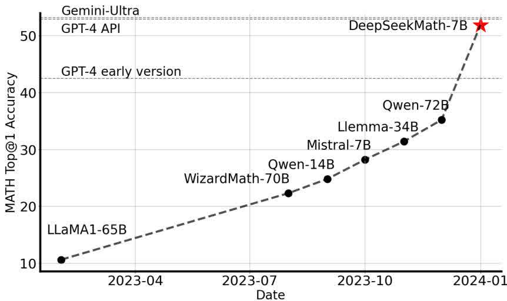
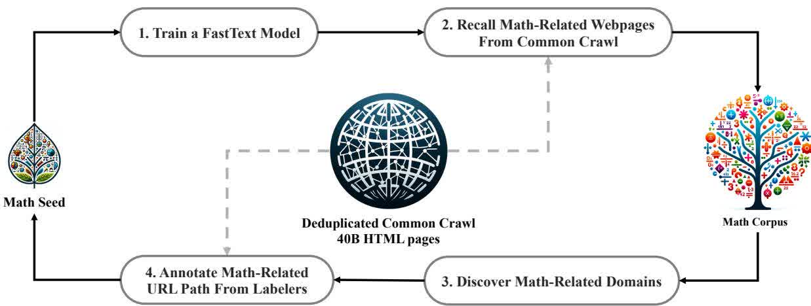
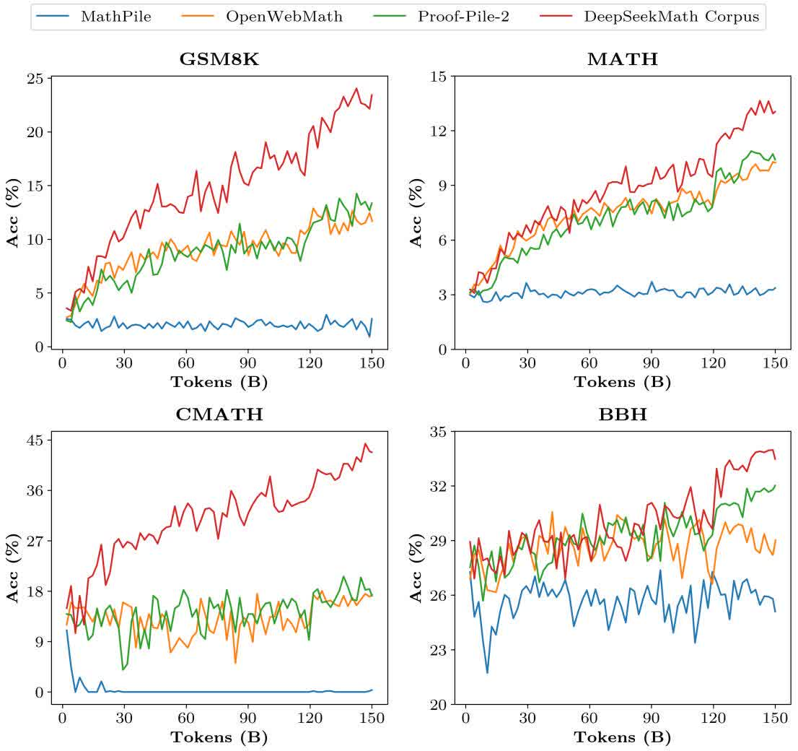
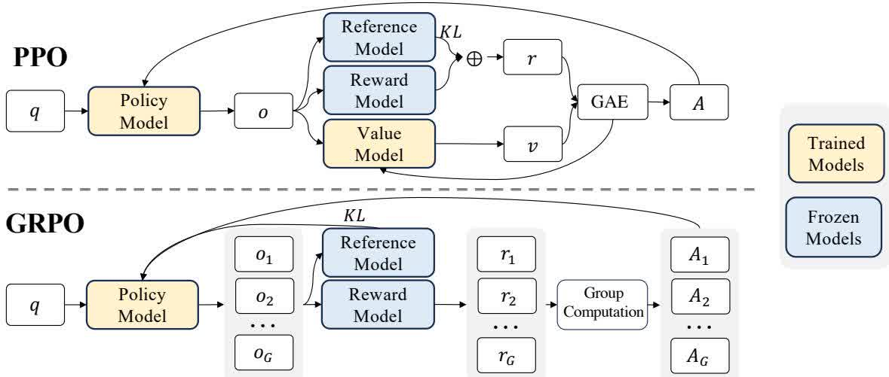
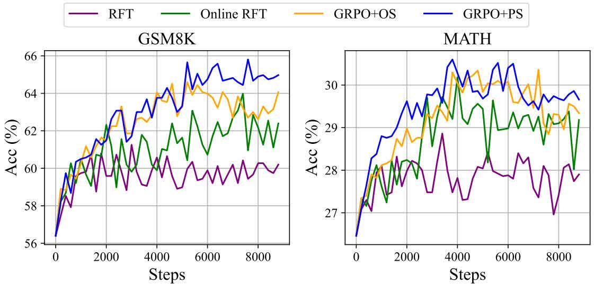
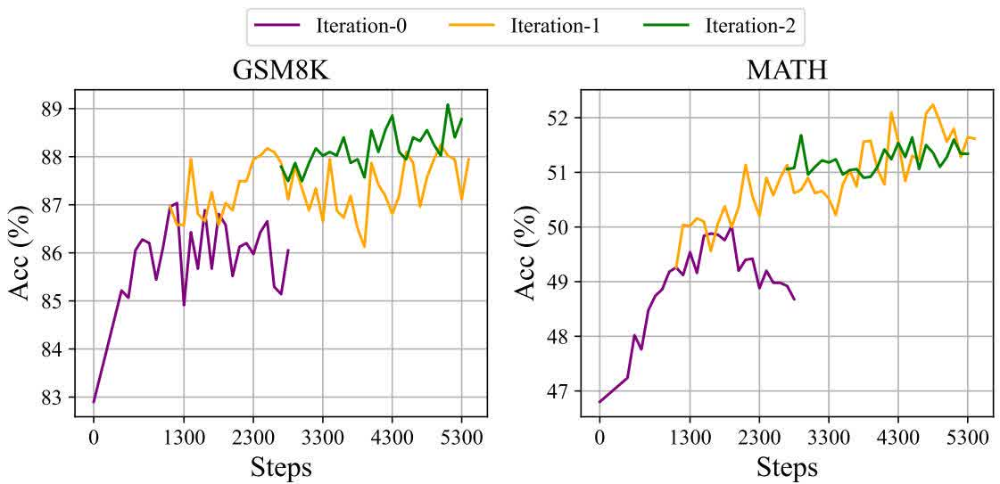
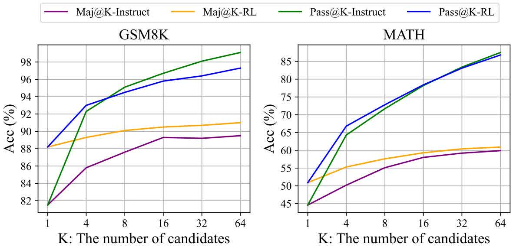

# DeepSeekMath：突破开放语言模型数学推理的极限

Zhihong Shao1,2∗†, Peiyi Wang1,3∗†, Qihao Zhu1,3∗†, Runxin Xu1, Junxiao Song1 Xiao Bi1, Haowei Zhang1, Mingchuan Zhang1, Y.K. Li1, Y. Wu1, Daya Guo1∗

1DeepSeek-AI, 2Tsinghua University, 3Peking University

{zhihongshao,wangpeiyi,zhuqh,guoday}@deepseek.com https://github.com/deepseek-ai/DeepSeek-Math

## 摘要

数学推理因其复杂和结构化的性质,对语言模型构成重大挑战. 在本文中,我们介绍 DeepSeekMath 7B,继续预训练 DeepSeek-Coder-Base-v1.5 7B 与 120B 与数学相关的 Token 来源于 Common Crawl,加上自然语言和代码数据。DeepSeekMath 7B 在竞争一级取得了 51.7%的令人印象深刻的成绩。MATH 不依赖外部工具包和表决技术,接近业绩水平 Gemini-Ultra 和 GPT-4 超过 64 个样本的自洽性 DeepSeekMath 7B 实现 60.9%MATH。数学推理能力 DeepSeekMath 有两个关键因素:第一,我们通过精心设计的数据选择程序,利用公开的网络数据的巨大潜力。 二,引入组相对策略优化(下同 GRPO),是近端策略优化的一个变种(PPO),可以增强数学推理能力,同时优化对内存的使用。PPO.

图 1Top1 竞争一级开源模型的准确性 MATH 基准(Hendrycks et al., 2021)不使用外部工具包和表决技术。

## 1. 引言

大型语言模型 LLM)使人工智能中的数学推理方法发生了革命性的变化,推动了定量推理基准的显著进步.(Hendrycks et al., 2021)和几何推理基准(Trinh et al., 2024)此外,这些模型已证明有助于人类解决复杂的数学问题。(Tao, 2023)然而,尖端模式,例如:GPT-4 (OpenAI, 2023)和 Gemini-Ultra (Anil et al., 2023)目前可访问的开源模型在性能方面远远落后。

在这项研究中,我们介绍 DeepSeekMath,一个域特定语言模型,它显著地超过了开源模型的数学能力,并且接近了性能水平 GPT-4 关于学术基准。 为了实现这一目标,我们创建了 DeepSeek-Math Corpus 大规模高质量的训练前训练大纲,其中包括:120B 数学 Token。 此数据集取自 Common Crawl(CC)使用基于 fastText 的- 基于分类器(Joulin et al., 2016)在初始迭代中,分类器使用来自 OpenWebMath (Paster et al., 2023)作为积极的例子,同时纳入不同选择的其他网页作为消极的例子。 随后,我们利用分类器从 CC 中挖掘出更多的积极实例,这些实例通过人类注释得到进一步完善。 然后用这个增强的数据集更新分类器以改进其性能. 评价结果表明,作为我们的基本模式,大规模体质很高 DeepSeekMath-Base 7B 实现 64.2%GSM8K (Cobbe et al., 2021)在竞争一级为 36.2%MATH 数据集(Hendrycks et al., 2021),成绩优异 Minerva 540B (Lewkowycz et al., 2022a)。此外,DeepSeekMath Corpus 是多语言的,所以我们注意到中国数学基准的改进(Wei et al., 2023; Zhong et al., 2023)我们认为,我们在数学数据处理方面的经验是研究界的起点,今后还有很大的改进余地。

DeepSeekMath-Base 初始化为 DeepSeek-Coder-Base-v1.5 7B (Guo et al., 2024)正如我们所注意到的,从代码训练模式开始,比起一般方法,选择更好。LLM 此外,我们观察到数学训练也提高了模型能力。MMLU (Hendrycks et al., 2020)和 BBH 基准(Suzgun et al., 2022),表示它不仅可以增强模型的数学能力,还可以放大一般推理能力.

经过预训练后,我们应用数学指令微调 DeepSeekMath-Base 与思维链(Wei et al., 2022),思维程序(Chen et al., 2022; Gao et al., 2023),和工具集成推理(Gou et al., 2023)数据。 由此产生的模式 DeepSeekMath-Instruct 7B 击败所有 7B 对口单位,与 70B 开源指令微调模型.

此外,我们提出 " 相对策略优化 "。GRPO),是一种变体强化学习(RL 近端策略优化的算法(PPO) (Schulman et al., 2017). GRPO 放弃 critic 模型,转而从组分中估算基线,大幅削减训练资源. 仅使用英语指令微调数据子集,GRPO 取得比强者更大的进步 DeepSeekMath-Instruct,包括两个内域(GSM8K: 82.9% → 88.2%, MATH: 46.8% – 51.7%)和域外数学任务(例如,CMATH: 84.6% – 88.8%)在强化学习阶段. 我们还提供了一个统一的范式来理解不同的方法,例如拒绝取样法(Fine-Tuning)RFT) (Yuan et al., 2023a),直接优化优惠(DPO) (Rafailov et al., 2023), PPO 和 GRPO 基于这种统一的模式,我们发现所有这些方法都是直接或简化的。RL 技术。 我们还进行广泛的试验,例如在线诉离线训练、结果诉过程监督、单回合诉迭接。RL 以深入探讨这一模式的基本要素。 我们终于解释了为什么 RL 提高教学调整模型的性能,并进一步总结潜在方向,以便更有效地 RL 基于这个统一的范式。

## 1.1. 贡献

我们的贡献包括可扩展的数学预训练练,以及对强化学习的探索和分析。

## 大规模数学预训练

• 我们的研究提供了令人信服的证据,证明公众可以查阅 Common Crawl 数据含有用于数学目的的宝贵信息。 通过实施精心设计的数据选择管道,我们成功地建造了 DeepSeekMath Corpus,一个高质量的数据集 120B 从网页中过滤的用于数学内容的 Token,它几乎是所使用的数学网页规模的 7 倍 Minerva (Lewkowycz et al., 2022a)和最近公布的 9 倍大小 OpenWebMath (Paster et al., 2023).

• 我们经过预先训练的基地模式 DeepSeekMath-Base 7B 实现与 Minerva 540B (Lewkowycz et al., 2022a),表示参数的数量并不是数学推理能力的唯一关键因素. 一个在高质量数据方面经过预先训练的较小的模型也可以取得良好的业绩。

• 我们分享数学训练实验的结果。 数学训练前的代码训练提高了模型用或不用工具解决数学问题的能力。 这为长期存在的问题提供了部分答案:代码训练是否提高了推理能力? 我们相信,至少对数学推理来说是这样。

• 虽然训练 arXiv 论文很常见,特别是在许多与数学有关的论文中,它并没有给本文通过的所有数学基准带来显著的改进.

## 强化学习的探索与分析

• 我们提出组相对策略优化(GRPO),是一种高效有效的强化学习算法.GRPO 放弃 critic 模型,转而根据组分估算基线,与近端策略优化相比,训练资源大幅减少(PPO).

• 我们证明:GRPO 大大提高了我们指令微调模型的性能 DeepSeekMath-Instruct,仅使用指示调试数据。 此外,我们还注意到,在强化学习过程中,外地业绩有所改进。

• 我们提供一个统一的范式来理解不同的方法,例如:RFT, DPO, PPO,以及 GRPO 我们还进行了广泛的试验,例如在线诉离线训练、结果诉过程监督、单回合诉迭代强化学习等,以深入调查这一范式的基本要素。

• 根据我们的统一模式,我们探索加强学习的有效性背后的原因,并总结若干可能的方向,以便更有效地加强学习 LLMs.

## 1.2. 评测与指标概述

^ 英文和中文数学推理：我们对英语和中文基准的模型进行全面评估,涵盖从年级到大学的数学问题. 英语基准包括:GSM8K (Cobbe et al., 2021), MATH (Hendrycks et al., 2021), SAT (Azerbayev et al., 2023), OCW 课程(Lewkowycz et al., 2022a), MMLU-STEM (Hendrycks et al., 2020)中国的基准包括:MGSM-zh (Shi et al., 2023), CMATH (Wei et al., 2023), Gaokao-MathCloze (Zhong et al., 2023),以及 Gaokao-MathQA (Zhong et al., 2023)我们评价模型在不使用工具的情况下生成自成一体的文本解决方案的能力,以及使用 Python.

在英语基准上,DeepSeekMath-Base 与闭源竞争 Minerva 540B (Lewkowycz et al., 2022a),并超越所有开源基模型(例如,Mistral 7B (Jiang et al., 2023)和 Llemma-34B (Azerbayev et al., 2023)不论是否接受过数学预训练, 值得注意的是,DeepSeekMath-Base 可能是因为我们没有遵循之前的作品,(Azerbayev et al., 2023; Lewkowycz et al., 2022a)用于收集仅使用英语的数学预训练练数据,还包括高质量的非英语数据。 通过数学教学的调和和强化学习,DeepSeekMath-Instruct 和 DeepSeekMath-RL 表现良好,在竞争一级准确度超过 50%MATH 数据集在开源社区内首次出现.

• 正式数学:我们评价 DeepSeekMath-Base 使用非正式至正式定理证明来自(Jiang et al., 2022)打开 miniF2F (Zheng et al., 2021)与 Isabelle (Wenzel et al., 2008)被选为证明助理。DeepSeekMath-Base 展现出极少数的自动正规化表现。

• 自然语言理解、理性和代码:为了全面描述模型的一般理解、推理和编码能力,我们评价 DeepSeekMath-Base 关于大规模多任务语言理解的 MMLU 基准(Hendrycks et al., 2020)包括 57 项多重选择任务,涉及不同主题;BIG-Bench Hard (BBH) (Suzgun et al., 2022)包括 23 项挑战性任务,这些任务最需要多步骤推理来解决,以及 HumanEval (Chen et al., 2021)和 MBPP (Austin et al., 2021)它们被广泛用于评价代码语言模型。 数学预训练既有利于语言理解,也有利于推理表现.

## 2. 数学预训练

## 2.1. 数据收集与去污染

在本节中,我们将概述建造这些设施的过程。DeepSeekMath Corpus 从 Common Crawl 如图 2 所示,我们提出一个迭代管道,说明如何系统地从中收集一个大规模数学库。Common Crawl,从种子体开始(例如,数学相关数据集的小型但高质量的收集). 值得注意的是,这种方法也适用于其他领域,如编码。

首先,我们选择 OpenWebMath (Paster et al., 2023)高质量的数学网络文本 是我们最初的种子 我们用这具尸体来训练 fastText 模式(Joulin et al., 2016)召回更多 OpenWebMath- 就像数学网页 具体地说,我们随机从种子体中选取 50 万个数据点作为积极的训练范例,并从中再选取 50 万个网页。Common Crawl 作为负面的。 我们使用开源库 1 进行训练,将矢量维度配置为 256 个,学习率配置为 0.1 个,n-gm 字最长长度为 3 个,最小字发生数配置为 3 个,训练纪元数配置为 3 个. 缩小原版的尺寸 Common Crawl,我们雇用 URL- 基于分解和近引技术,导致 40B HTML 网页。 然后,我们回顾数学网页 破译 Common Crawl 与 fastText 型号。 为了筛选出低质量的数学内容,我们根据收集的页面的分数进行排序。fastText 模式,只保留最高级的 保存的数据量通过训练前的试验在顶端进行评估 40B, 80B, 120B,以及 160B 标志。 在第一次重复中,我们选择保持顶部 40B 标志。

图 2 | 从 Common Crawl 收集数学网页的迭代管道。

在第一次重复数据收集之后,许多数学网页仍未收集,主要是因为 fastText 对模型进行一系列缺乏充分多样性的积极实例的训练。 因此,我们找出更多的数学网络来源来丰富种子体,以便我们优化 fastText 型号。 具体来说,我们首先组织整个 Common Crawl 输入脱联域; 一个域被定义为共享同一基数的网页 URL。对于每个域,我们计算在第一次迭代中收集的网页的百分比。 超过 10%的网页被收集的域被归类为与数学相关的域(如:mathoverflow.net). 随后,我们手动注释了这些已确认域(例如:mathoverflow.net/ questions)内与数学内容相关的 URL. 链接到这些 URL 的网页尚未收集, 将会添加到种子库中。 这一方法使我们能够收集更多积极的例子,从而训练改进的 fastText 模型可以在后续迭代中回顾更多的数学数据. 经过四次重复的数据收集,我们最终 35.5M 数学网页,总计 120B 标志。 在第四次重复中,我们注意到近 98%的数据已经在第三次重复中收集,所以我们决定停止数据收集。

为了避免基准污染,我们遵循 Guo et al. (2024)从英文数学基准中筛选出包含问题或答案的网页,例如 GSM8K (Cobbe et al., 2021)和 MATH (Hendrycks et al., 2021)和中国基准,例如:CMATH (Wei et al., 2023)和 AGIEval (Zhong et al., 2023)。过滤标准如下:任何含有 10 克字符串的文本段,与评价基准中的任何子字符串完全匹配,将从我们的数学训练大纲中删除。 对于短于 10 克但至少有 3 克的基准文本,我们使用精确的匹配来过滤受污染的网页。

## 2.2. 验证 DeepSeekMath Corpus 的质量

我们进行训练前的实验 来调查 DeepSeekMath Corpus 与最近发布的数学训练公司比较:

• MathPile (Wang et al., 2023c): 一种多来源程序(8.9B(原始内容存档于 2018-10-03). observators). Group from 教科书,维基百科, ProofWiki,.CommonCrawl,堆叠交换,arXiv(85%以上)arXiv;

• OpenWebMath (Paster et al., 2023): CommonCrawl 为数学内容过滤数据, 总计 13.6B 标志;

• Proof-Pile-2 (Azerbayev et al., 2023): 由 OpenWeb-Math, AlgebraicStack (10.3B 数学编码的 Token),和 arXiv 论文 28.0B(原始内容存档于 2019-03-29). Sorks. 当实验上 Proof-Pile-2,我们跟着 Azerbayev et al. (2023)要使用一个 arXiv:Web:代码比 2:4:1.

## 2.2.1. 训练设置

我们把数学训练应用到普通的预训练语言模型中 1.3B 参数,与 DeepSeek LLMs (DeepSeek-AI, 2024),表示为 DeepSeek-LLM 1.3B 我们为每个数学体分别训练一个模型。150B 标志。 所有实验都使用高效和轻量级 HAI-LLM (High-flyer, 2023)训练框架。 遵循训练实践 DeepSeek LLMs,我们使用 AdamW 优化器(Loshchilov and Hutter, 2017)与$\beta _ { 1 } = 0. 9, \beta _ { 2 } = 0. 9 5$, 加权分数=0.1, 加上一个多步骤的学习率时间表, 学习率在 2000 个热身步骤之后达到峰值, 在 80%的训练过程之后下降到 31.6%, 在 90%的训练过程之后进一步下降到峰值的 10.0%。 我们设定了学习率的最大值 5.3e-4,并使用批量大小 4M 带有 a 的 Token4K 上下文长度。

<table><tr><td rowspan="2">数学语料库</td><td rowspan="2">规模</td><td colspan="5">英文基准</td><td colspan="3">中文基准</td></tr><tr><td>GSM8K MATH</td><td></td><td>OCW</td><td>SAT</td><td>MMLU STEM</td><td>CMATH</td><td>Gaokao MathCloze I</td><td>Gaokao MathQA</td></tr><tr><td>无数学训练</td><td>N/A</td><td>2.9%</td><td>3.0%</td><td>2.9%</td><td>15.6%</td><td>19.5%</td><td>12.3%</td><td>0.8%</td><td>17.9%</td></tr><tr><td>MathPile</td><td>8.9B</td><td>2.7%</td><td>3.3%</td><td>2.2%</td><td>12.5%</td><td>15.7%</td><td>1.2%</td><td>0.0%</td><td>2.8%</td></tr><tr><td>OpenWebMath</td><td>13.6B</td><td>11.5%</td><td>8.9%</td><td>3.7%</td><td>31.3%</td><td>29.6%</td><td>16.8%</td><td>0.0%</td><td>14.2%</td></tr><tr><td>Proof-Pile-2</td><td>51.9B</td><td>14.3%</td><td>11.2%</td><td>3.7%</td><td>43.8%</td><td>29.2%</td><td>19.9%</td><td>5.1%</td><td>11.7%</td></tr><tr><td>DeepSeekMath Corpus</td><td>120.2B</td><td>23.8%</td><td>13.6%</td><td>4.8%</td><td>56.3%</td><td>33.1%</td><td>41.5%</td><td>5.9%</td><td>23.6%</td></tr></table>

表 1 考绩结果 DeepSeek-LLM 1.3B 接受过不同数学理论的训练, 使用几发脑链的提示来评价。 公司大小是使用我们的标注器计算的,词汇大小如下:100K.

## 2.2.2. 评测结果

那个 DeepSeekMath Corpus 质量很高,涵盖多种语言的数学内容,是体积最大的。

• 高质量:我们利用很少的思维链来评估下游 8 个数学基准的业绩 Wei et al. (2022)如表 1 所示,经过训练的模型具有明显的性能领先性。DeepSeekMath Corpus 图 3 显示,该模型经过了训练。DeepSeekMath Corpus 表现优于

图 3DeepSeek-LLM 1.3B 接受过不同的数学实验

Proof-Pile-2 时间 50BToken(1 个完整时段)Proof-Pile-2),表示平均质量 DeepSeekMath Corpus 更高级。

• 多语种:DeepSeekMath Corpus 包括多种语言的数据,主要以英语和汉语为代表最多的两种语言。 如下表 1 所示,训练范围包括:DeepSeekMath Corpus 提高英语和汉语的数学推理性能。 相比之下,以英语为中心的现有数学方块显示的改进有限,甚至可能阻碍中国数学推理中的性能.

• 大规模:DeepSeekMath Corpus 比现有的数学公司大好几倍 如图 3 所示。DeepSeek-LLM 1.3B,当训练 DeepSeek-Math Corpus,显示更陡峭的学习曲线,同时进行更持久的改进。 相比之下,基线阵型要小得多,在训练期间已经多次重复进行,由此产生的模型性能很快到达高原.

## 2.3. 训练与评测 DeepSeekMath-Base 7B

本节介绍 DeepSeekMath-Base 7B,一个具有强大推理能力的基础模型,特别是在数学方面. 我们的模型是初始化的 DeepSeek-Coder-Base-v1.5 7B (Guo et al., 2024)并训练 500B 标志。 数据分布情况如下:56%来自 DeepSeekMath Corpus 从 AlgebraicStack10%arXiv20%为 Github 代码,其余的 10%是来自 Common Crawl 英文和中文两种语文。 我们主要采用第 2.2.1 节规定的训练环境,但将学习率的最大值设定为:4.2e-4 并使用批量大小 10M 标志。

我们全面评估 DeepSeekMath-Base 7B,专注于其不依赖外部工具而生成自成一体的数学解决方案的能力,使用工具解决数学问题,并进行形式定理的验证. 除了数学之外,我们还提供了基础模型的更一般的概况,包括其自然语言理解,推理,编程技能的性能.

数学问题与分步解决 我们评价 DeepSeekMath-Base 使用数发连环提示解决数学问题(Wei et al., 2022),跨越英语和汉语的 8 个基准. 这些基准包括定量推理(例如:GSM8K (Cobbe et al., 2021), MATH (Hendrycks et al., 2021),以及 CMATH (Wei et al., 2023))和多选择问题(例如,MMLU-STEM (Hendrycks et al., 2020)和 Gaokao-MathQA (Zhong et al., 2023)),涵盖从小学到大学层次复杂程度的各种数学领域.

如表 2 所示,DeepSeekMath-Base 7B 在开放源码基模型(包括广泛使用的一般模型)中所有 8 个基准的业绩方面领先 Mistral 7B (Jiang et al., 2023)和最近释放的 Llemma 34B (Azerbayev et al., 2023)接受了数学训练的 Proof-Pile-2 (Azerbayev et al., 2023)) (中文(简体)). 特别是在竞争一级 MATH 数据集,DeepSeekMath-Base 绝对超过 10%的开放源代码基模型和超标 Minerva 540B (Lewkowycz et al., 2022a),一个基于 PaLM (Lewkowycz et al., 2022b)并接受数学文本的进一步训练。

<table><tr><td rowspan="2">模型</td><td rowspan="2">规模</td><td colspan="4">英文基准</td><td colspan="4">中文基准</td></tr><tr><td>GSM8K MATH</td><td></td><td>OCW</td><td>SAT</td><td>MMLU CMATH STEM</td><td></td><td>Gaokao MathCloze</td><td>Gaokao MathQA</td></tr><tr><td colspan="10">闭源基础模型</td></tr><tr><td>Minerva</td><td>7B</td><td>16.2%</td><td>14.1%</td><td>7.7%</td><td>1</td><td>35.6%</td><td></td><td></td><td></td></tr><tr><td>Minerva</td><td>62B</td><td>52.4%</td><td>27.6%</td><td>12.0%</td><td></td><td>53.9%</td><td></td><td></td><td></td></tr><tr><td>Minerva</td><td>540B</td><td>58.8%</td><td>33.6%</td><td>17.6%</td><td>-</td><td>63.9%</td><td></td><td></td><td></td></tr><tr><td colspan="10">开源基础模型</td></tr><tr><td>Mistral</td><td>7B</td><td>40.3%</td><td>14.3%</td><td>9.2%</td><td>71.9%</td><td>51.1%</td><td>44.9%</td><td>5.1%</td><td>23.4%</td></tr><tr><td>Llemma</td><td>7B</td><td>37.4%</td><td>18.1%</td><td>6.3%</td><td>59.4%</td><td>43.1%</td><td>43.4%</td><td>11.9%</td><td>23.6%</td></tr><tr><td>Llemma</td><td>34B</td><td>54.0%</td><td>25.3%</td><td>10.3%</td><td>71.9%</td><td>52.9%</td><td>56.1%</td><td>11.9%</td><td>26.2%</td></tr><tr><td>DeepSeekMath-Base 7</td><td>7B</td><td>64.2%</td><td>36.2%</td><td>15.4%</td><td>84.4%</td><td>56.5%</td><td>71.7%</td><td>20.3%</td><td>35.3%</td></tr></table>

表 2 比较 DeepSeekMath-Base 7B 和基于英语和中国数学基准的强大基础模型. 对模型的评估带有思维链的提示性。Minerva 结果引用自 Lewkowycz et al. (2022a).

用工具解决数学问题 我们评价程序辅助的数学推理 GSM8K 和 MATH 使用少许镜头的思维程序提示(Chen et al., 2022; Gao et al., 2023)。激励模型通过写出 Python 程序,用于复杂的计算。 程序的执行结果被评价为答案. 如表 3 所示,DeepSeekMath-Base 7B 超过先前的先进水平 Llemma 34B.
<table><tr><td rowspan="2">模型</td><td rowspan="2">规模</td><td colspan="2">使用工具解题</td><td colspan="2">非形式到形式证明</td></tr><tr><td>GSM8K+Python</td><td></td><td>MATH+Python miniF2F- 验证 miniF2F- 测试</td><td></td></tr><tr><td>Mistral</td><td>7B</td><td>48.5%</td><td>18.2%</td><td>18.9%</td><td>18.0%</td></tr><tr><td>CodeLlama</td><td>7B</td><td>27.1%</td><td>17.2%</td><td>16.3%</td><td>17.6%</td></tr><tr><td>CodeLlama</td><td>34B</td><td>52.7%</td><td>23.5%</td><td>18.5%</td><td>18.0%</td></tr><tr><td>Llemma</td><td>7B</td><td>41.0%</td><td>18.6%</td><td>20.6%</td><td>22.1%</td></tr><tr><td>Llemma</td><td>34B</td><td>64.6%</td><td>26.3%</td><td>21.0%</td><td>21.3%</td></tr><tr><td>DeepSeekMath-Base 7B</td><td></td><td>66.9%</td><td>31.4%</td><td>25.8%</td><td>24.6%</td></tr></table>

表 3 很少对基准模型利用工具解决数学问题的能力和进行非正式到正式定理证明的能力作出直接评价 Isabelle.

正式的数学验证自动化对于确保数学验证的准确性和可靠性以及提高效率都是有益的,近年来人们越来越关注. 我们评价 DeepSeekMath-Base 7B 非正式到正式证明(Jiang et al., 2022)即根据非正式声明、声明的正式对应方和非正式证据产生正式证据。 我们评价 miniF2F (Zheng et al., 2021),作为正式的奥林匹亚级数学的基准,并生成正式的证明 Isabelle 每一个问题都有少发提示。 跟踪 Jiang et al. (2022),我们利用模型生成证明素描, 并执行现成的自动证明 Sledgehammer (Paulson, 2010)以填写缺失的细节。 如表 3 所示,DeepSeekMath-Base 7B 在证明自动化方面表现出强有力的表现。

<table><tr><td>模型</td><td>大小 MMLU</td><td>BBH</td><td>HumanEval (Pass@1) MBPP (Pass@1)</td><td></td></tr><tr><td>Mistral</td><td>7B</td><td>62.4% 55.7%</td><td>28.0%</td><td>41.4%</td></tr><tr><td>DeepSeek-Coder-Base-v1.5+</td><td>7B</td><td>42.9%</td><td>42.9% 40.2%</td><td>52.6%</td></tr><tr><td>DeepSeek-Coder-Base-v1.5</td><td>7B</td><td>49.1%</td><td>55.2% 43.2%</td><td>60.4%</td></tr><tr><td>DeepSeekMath-Base</td><td>7B</td><td>54.9%</td><td>59.5% 40.9%</td><td>52.6%</td></tr></table>

表 4 关于自然语言理解、推理和代码基准的评价。DeepSeek-Coder-Base-v1.5 在学习率衰减前的检查站 用来训练 DeepSeekMath-Base 打开 MMLU 和 BBH 我们用很少的枪 链式的提示。 打开 HumanEval 和 MBPP,我们分别根据零镜头设定和几镜头设定来评价模型性能.

自然语言理解、理由和代码 我们评价自然语言理解的模型性能 MMLU (Hendrycks et al., 2020),推理论 BBH (Suzgun et al., 2022)和编码能力 HumanEval (Chen et al., 2021)和 MBPP(Austin 等人著,

2021 (英语). 如表 4 所示,DeepSeekMath-Base 7B 业绩显著提高 MMLU 和 BBH 它的前体,DeepSeek-Coder-Base-v1.5 (Guo et al., 2024),说明了数学训练对语言理解和推理的积极影响. 此外,通过为持续训练提供 Token,DeepSeekMath-Base 7B 有效保持 DeepSeek-Coder-Base-v1.5 两个编码基准。 总体而言,DeepSeekMath-Base 7B 明显超过一般模型 Mistral 7B (Jiang et al., 2023)三个推理和编码基准。

## 3. 监督微调

## 3.1. SFT 数据整理

我们构建了一个数学指示调试数据集,涵盖来自不同数学领域和复杂程度不同的英语和汉语问题:问题与思维链中的解决方案相结合(CoT) (Wei et al., 2022),思维程序 PoT) (Chen et al., 2022; Gao et al., 2023),和工具集成推理格式(Gou et al., 2023)训练实例总数 776K.

• 英语数学数据集:我们注释 GSM8K 和 MATH 工具集成解决方案存在问题,并采用数学指令的子集(Yue et al., 2023)与 Lila-OOD 训练配套(Mishra et al., 2022)解决的问题 CoT 或 PoT 我们的英语收藏涵盖了数学的不同领域,例如代数,概率,数字理论,微积分,和几何学.

^ 中国数学数据集:我们收集跨越线性方程等 76 个子专题的中国 K-12 数学问题,在两者中都有说明的解决方案.CoT 和工具集成推理格式。

## 3.2. 训练与评测 DeepSeekMath-Instruct 7B

本节介绍 DeepSeekMath-Instruct 7B 数学指令微调基于 DeepSeekMath-Base. 训练实例随机组合,直至达到最大上下文长度 4K 标志。 我们训练 500 步的模型, 批量大小为 256, 不断学习速度为 5e-5.

我们用英文和中文评价模型的数学表现, 我们以当时的主要模式作为基准:

• 封闭源码模型包括:(1) GPT 家族,其中 GPT-4 (OpenAI, 2023)和 GPT-4 Code Interpreter2 是最有能力的,(2)Gemini Ultra and Pro (Anil et al., 2023), (3) Inflection-2 (Inflection AI, 2023), (4) Grok-1 3,以及中国公司最近发布的模型包括(5).Baichuan-3 4, (6) 来自 GLM 家族的最新 GLM-4 5(Du et al., 2022)这些模式是通用的,大多数都经过了一系列的调整程序。

• 开源模型包括:(1) 一般模型 DeepSeek-LLM-Chat 67B (DeepSeek-AI, 2024), (2) Qwen 72B (Bai et al., 2023), (3) SeaLLM-v2 7B (Nguyen et al., 2023),和(4)

ChatGLM3 6B (ChatGLM3 Team, 2023),以及数学增强模型,包括(5)InternLM2-Math 20B6 项,以实习 LM2 为基础,并接受了数学训练,随后进行了教学调整,(6)Math-Shepherd-Mistral 7B 应用 PPO 训练(Schulman et al., 2017)改为:Mistral 7B (Jiang et al., 2023)以过程监督的奖励模型 (7) WizardMath 系列(Luo et al., 2023)改进数学推理 Mistral 7B 和拉马-270B (Touvron et al., 2023)使用进化指令(即使用 AI- 演化指令的指令微调版本)和 PPO 训练问题主要来自 GSM8K 和 MATH, (8) MetaMath 70B (Yu et al., 2023)这是拉玛 -270B 对扩充版的 GSM8K 和 MATH, (9) ToRA 34B Gou et al. (2023)这是 CodeLlama 34B 进行了精细调整,以进行工具综合数学推理,(10)MAmmoTH 70B (Yue et al., 2023)这是拉玛 -270B 对数学指令进行指导。

如表 5 所示,在不允许使用工具的评价环境中,DeepSeekMath-Instruct 7B 显示分步推理的有力表现. 特别是在竞争一级 MATH 数据集,我们的模型超过了所有开源模型和大多数专有模型(例如,.Inflection-2 和 Gemini Pro 绝对值至少为 9%。 即使是大得多的模型也是如此(例如,Qwen 72B)或通过注重数学的强化学习(例如,WizardMath-v1.1 7B) (中文(简体)). 虽然 DeepSeekMath-Instruct 竞争中国专有模式 GLM-4 和 Baichuan-3 打开 MATH 仍然表现不佳 GPT-4 和 Gemini Ultra.

根据允许模型将自然语言推理和基于程序的工具用于解决问题的评价环境,DeepSeekMath-Instruct 7B 精确度达到 60%MATH,超过了所有现有的开源模型。 在其他基准上,我们的模式与 DeepSeek-LLM-Chat 67B,前十倍的先进水平。

## 4. 强化学习

## 4.1. 组相对策略优化

加强学习 RL 经证明,在进一步提高数学推理能力方面是有效的。LLMs 监督的微调之后 SFT 阶段(Luo et al., 2023; Wang et al., 2023b)在本节中,我们介绍我们高效率和高效力的 RL 算法,组合相对策略优化(GRPO).

## 4.1.1. 从 PPO 到 GRPO

近端策略优化 PPO) (Schulman et al., 2017)是演员批评 RL 广泛使用的算法 RL 微调阶段 LLMs (Ouyang et al., 2022)特别是,它优化了 LLMs 最大限度地实现以下替代目标:

$$
\mathcal { T } p r o  ( \theta ) = \mathbb { E } [ q \sim P ( Q ) , o \sim \pi \theta _ { o d d } ( O | q ) ] \frac { 1 } { | o | } \sum _ { t = 1 } ^ { | o | } \operatorname* { m i n } \left[ \frac { \pi _ { \theta } ( o _ { t } | q , o _ { < t } ) } { \pi _ { \theta _ { o d d } } ( o _ { t } | q , o _ { < t } ) } A _ { t } , \mathrm { c l i p } \left( \frac { \pi _ { \theta } ( o _ { t } | q , o _ { < t } ) } { \pi _ { \theta _ { o d d } } ( o _ { t } | q , o _ { < t } ) } , 1 - \varepsilon , 1 + \varepsilon \right) A _ { t } \right] ,\tag{1}
$$

其中$\pi _ { \theta }$和$\pi _ { \theta _ { o l d } }$现行和旧的策略模型,以及$q, o$从数据集和旧策略中抽查的问题和输出$\pi _ { \theta _ { o l d } },$* 采用剪切相关的超参数。PPO 稳定训练。$A _ { t }$即优势,通过采用通用优势估计法计算(GAE) (Schulman et al., 2015)基于奖励$\left\{ r _ { \geq t } \right\}$和知识价值函数$V _ { \psi }$。。。 因此,在 PPO 为了减轻奖励模型的过度优化,标准做法是增加一个按 KL 从奖励的参考模型中处罚(Ouyang et al., 2022),也就是说,

<table><tr><td rowspan="2">模型</td><td rowspan="2">规模</td><td>英文基准</td><td>中文基准</td><td></td></tr><tr><td>GSM8K</td><td>MATH</td><td>MGSM-zh CMATH</td></tr><tr><td colspan="6">思维链推理</td></tr><tr><td colspan="6">闭源模型</td></tr><tr><td>Gemini Ultra</td><td>1</td><td>94.4%</td><td>53.2%</td><td></td><td>=</td></tr><tr><td>GPT-4</td><td>1</td><td>92.0%</td><td>52.9%</td><td>1</td><td>86.0%</td></tr><tr><td>Inflection-2</td><td>1</td><td>81.4%</td><td>34.8%</td><td>1</td><td>■</td></tr><tr><td>GPT-3.5</td><td></td><td>80.8%</td><td>34.1%</td><td>1</td><td>73.8%</td></tr><tr><td>Gemini Pro</td><td></td><td>86.5%</td><td>32.6%</td><td>1</td><td>一</td></tr><tr><td>Grok-1</td><td>-</td><td>62.9%</td><td>23.9%</td><td></td><td>1</td></tr><tr><td>Baichuan-3</td><td></td><td>88.2%</td><td>49.2%</td><td></td><td></td></tr><tr><td>GLM-4</td><td>1</td><td>87.6%</td><td>47.9%</td><td></td><td></td></tr><tr><td colspan="6">开源模型</td></tr><tr><td>InternLM2-Math</td><td>20B</td><td>82.6%</td><td>37.7%</td><td></td><td></td></tr><tr><td>Qwen</td><td>72B</td><td>78.9%</td><td>35.2%</td><td>-</td><td></td></tr><tr><td>Math-Shepherd-Mistral</td><td>7B</td><td>84.1%</td><td>33.0%</td><td>-</td><td>=</td></tr><tr><td>WizardMath-v1.1</td><td>7B</td><td>83.2%</td><td>33.0%</td><td>=</td><td>=</td></tr><tr><td>DeepSeek-LLM-Chat</td><td>67B</td><td>84.1%</td><td>32.6%</td><td>74.0%</td><td>80.3%</td></tr><tr><td>MetaMath</td><td>70B</td><td>82.3%</td><td>26.6%</td><td>66.4%</td><td>70.9%</td></tr><tr><td>SeaLLM-v2</td><td>7B</td><td>78.2%</td><td>27.5%</td><td>64.8%</td><td>一</td></tr><tr><td>ChatGLM3</td><td>6B</td><td>72.3%</td><td>25.7%</td><td>1</td><td>-</td></tr><tr><td>WizardMath-v1.0</td><td>70B</td><td>81.6%</td><td>22.7%</td><td>64.8%</td><td>65.4%</td></tr><tr><td>DeepSeekMath-Instruct 7B</td><td></td><td>82.9%</td><td>46.8%</td><td>73.2%</td><td>84.6%</td></tr><tr><td></td><td></td><td></td><td></td><td></td><td></td></tr><tr><td>DeepSeekMath-RL</td><td>7B</td><td>88.2%</td><td>51.7%</td><td>79.6%</td><td>88.8%</td></tr></table>

<table><tr><td colspan="4">工具集成推理</td></tr><tr><td></td><td>闭源模型</td><td></td><td></td></tr><tr><td>GPT-4 Code Interpreter </td><td>97.0% 1</td><td>69.7%</td><td></td></tr><tr><td></td><td>开源模型</td><td></td><td></td></tr><tr><td>InternLM2-Math</td><td>20B 80.7%</td><td>54.3%</td><td></td></tr><tr><td>DeepSeek-LLM-Chat</td><td>67B 86.7%</td><td>51.1% 76.4%</td><td>85.4%</td></tr><tr><td>ToRA</td><td>34B 80.7%</td><td>50.8%</td><td>41.2% 53.4%</td></tr><tr><td>MAmmoTH</td><td>70B 76.9%</td><td>41.8%</td><td>- 1</td></tr><tr><td>DeepSeekMath-Instruct</td><td>7B 83.7%</td><td>57.4%</td><td>72.0% 84.3%</td></tr><tr><td>DeepSeekMath-RL</td><td>7B 86.7%</td><td>58.8% 78.4%</td><td>87.6%</td></tr></table>

表 5 开源和闭源模型在英语和中文基准上既具有思维链又具有工具综合理由的性能。 灰色得分表示 32 名候选人获得多数票; 其他人是,他们是 Top1 分数。DeepSeekMath-RL 7B 击败所有 7B 到 70B 的开源模型,以及大多数的闭源模型. 虽然 DeepSeekMath-RL 7B 仅接受进一步的训练,以进行思维系统格式的教学,以调解 GSM8K 和 MATH,它改进了 DeepSeekMath-Instruct 7B 所有基准。

图 4PPO 我们 GRPO. GRPO 放弃了价值模型,而是从组分中估算基线,从而大大减少了训练资源。

$$
r _ { t } = r _ { \varphi } ( q , o _ { \le t } ) - \beta \log \frac { \pi _ { \theta } ( o _ { t } | q , o _ { < t } ) } { \pi _ { r e f } ( o _ { t } | q , o _ { < t } ) } ,\tag{2}
$$

其中$r _ { \varphi }$这是奖励模型,$\pi _ { r e f }$是参考模型,通常为初始 SFT 模型,以及$\beta$是该 KL 罚。

用作 PPO 作为策略模型,它通常是一个规模相当的模型,它带来巨大的内存和计算负担。 此外,在 RL 在计算减少差异的优势时,将价值函数作为基线。 期间 LLM 上下文,通常只有最后一个 Token 被奖励模型赋予奖励分数,这可能会使每个 Token 准确的值函数的训练复杂化. 为了解决这一问题，如图 4 所示，我们提出组相对策略优化（GRPO），它不像 PPO 那样需要额外的价值函数近似，而是使用针对同一问题采样得到的多个输出的平均奖励作为基线。 更具体地说,每个问题$q,$ GRPO 一组输出样本$\{ o _ { 1 }, o _ { 2 }, \cdots, o _ { G } \}$从旧策略$\pi _ { \theta _ { o l d } }$然后通过最大限度地实现以下目标优化策略模型:

$$
\begin{array} { l } { \displaystyle \mathcal { J } _ { G R P O } ( \theta ) = \mathbb { E } [ q \sim P ( Q ) , \{ \alpha _ { i } \} _ { i = 1 } ^ { G } \sim \pi _ { \theta _ { \theta } i d } ( O | q ) ] } \\ { \displaystyle \frac { 1 } { G } \sum _ { i = 1 } ^ { G } \frac { 1 } { | \alpha _ { i } | } \frac { | \alpha _ { i } | } { t = 1 } \{ \operatorname* { m i n } [ \frac { \pi _ { \theta } ( o _ { i , t } | q , o _ { i ,  } ) } { \pi _ { \theta _ { \theta d } } ( o _ { i , t } | q , o _ { i ,  } ) } \hat { A } _ { i , t } , \mathrm { c l i p } ( \frac { \pi _ { \theta } ( o _ { i , t } | q , o _ { i ,  } ) } { \pi _ { \theta _ { \theta d } } ( o _ { i , t } | q , o _ { i ,  } ) } , 1 - \varepsilon , 1 + \varepsilon ) \hat { A } _ { i , t } ] - \beta \mathbb { D } _ { K L } [ \pi _ { \theta } | | \pi _ { r e f } | \} , } \end{array}\tag{3}
$$

其中$\varepsilon$和$\beta$是超参数,$\hat { A } _ { i, t }$是仅根据每一组内输出的相对回报计算的优势,将在以下各分节详述。 组的相对方式 GRPO 利用各种杠杆计算优势,与奖励模型的比较性质保持一致,因为奖励模型通常都接受关于同一问题输出比较数据集的训练。 还注意到,而不是添加 KL 将受报酬的惩罚,GRPO 通过直接添加 KL 训练有素的策略与损失参考单之间的差异,避免使计算工作复杂化$\hat { A } _ { i, t }$

算法 1 迭代组相对策略优化
投入初步策略模型$\pi _ { \theta _ { \mathrm { i n i t } } };$奖励模型$r _ { \varphi };$任务提示 D; 超参数$\varepsilon, \beta, \mu$
1:策略模型${ \pi } _ { \theta } \gets { \pi } _ { \theta _ { \mathrm { i n i t } } }$
2: 重复$= 1, \hdots, \mathrm { I }$对
3:参考模型$\pi _ { r e f } \pi _ { \theta }$
4: 步骤$\mathbf { \Omega } = 1, \dots, \mathbf { M }$对
5: 一批样品$\mathcal { D } _ { b }$调自 D
6:更新旧的策略模型$\pi _ { \theta _ { o l d } } \pi _ { \theta }$
7: 样本$\{ o _ { i } \} _ { i = 1 } ^ { G } \sim \pi _ { \theta _ { o l d } } (\cdot \mid q)$每个问题$q \in \mathcal { D } _ { b }$
8:计算奖励$\{ r _ { i } \} _ { i = 1 } ^ { G }$每个抽样输出$o _ { i }$通过运行$r _ { \varphi }$
9: 计算$\hat { A } _ { i, t }$用来表示$o _ { i }$通过群体相对优势估计.
10:用于 GRPO 重复$= 1, \ldots, \mu$对
11:更新策略模型$\pi _ { \theta }$最大限度地实现 GRPO 目标(第 21 条)
12: 最新情况$r _ { \varphi }$通过使用重播机制的持续训练。
输出$\pi _ { \theta }$

并且与 KL 在(2)中使用的惩罚术语,我们估计 KL 与下列不带偏见的估算符的分歧(Schulman, 2020):

$$
\mathbb { D } _ { K L } \left[ \pi _ { \theta } | | \pi _ { r e f } \right] = \frac { \pi _ { r e f } ( o _ { i , t } | q , o _ { i , < t } ) } { \pi _ { \theta } ( o _ { i , t } | q , o _ { i , < t } ) } - \log \frac { \pi _ { r e f } ( o _ { i , t } | q , o _ { i , < t } ) } { \pi _ { \theta } ( o _ { i , t } | q , o _ { i , < t } ) } - 1 ,\tag{4}
$$

保证是积极的。

## 4.1.2. 基于 GRPO 的结果监督强化学习

在形式上,每个问题,一组输出$\left\{ o _ { 1 }, o _ { 2 }, \cdots, o _ { G } \right\}$取自旧策略模型$\pi _ { \theta _ { o l d } }$。然后使用奖励模型对输出进行评分,产生结果? 奖励$\mathbf { r } = \{ r _ { 1 }, r _ { 2 }, \cdot \cdot \cdot, r _ { G } \}$相应。 随后,这些奖励通过减去组平均值和除以组标准偏差而正常化. 成果监督在每个输出结束时提供正常化的奖励$o _ { i }$并设定优势$\hat { A } _ { i, t }$将输出中的所有 Token 作为通常的奖励,即$\begin{array} { r } { \hat { A } _ { i, t } = \widetilde { r } _ { i } = \frac { r _ { i } - \mathrm { m e a n } (\mathbf { r }) } { \mathrm { s t d } (\mathbf { r }) } } \end{array}$,然后通过最大化方程式(3)中定义的目标来优化策略.

## 4.1.3. 基于 GRPO 的过程监督强化学习

结果监督只在每项输出结束时提供奖励,这可能不足以有效地监督复杂数学任务中的策略。 跟踪 Wang et al. (2023b),我们也探索过程监督, 在每个推理步骤结束时提供奖励。 形式上,鉴于问题 和抽样输出$\left\{ o _ { 1 }, o _ { 2 }, \cdots, o _ { G } \right\}$,一个过程奖励模型用于对输出的每一步骤进行评分,产生相应的奖励:$\mathbf { \dot { R } } = \{ \{ r _ { 1 } ^ { i n d e x (1) }, \cdots, r _ { 1 } ^ { i n d e x (K _ { 1 }) } \}, \cdots, \{ r _ { G } ^ { i n d e x (1) }, \cdots, \hat { r } _ { G } ^ { i n d e x (K _ { G }) } \} \}$，其中 index(j) 是第 j 个推理步骤的结束 Token 索引，$K _ { i }$ 是第 i 个输出中的步骤总数。 我们还使这些奖励与平均和标准偏差,即,$\begin{array} { r } { \widetilde { r } _ { i } ^ { i n d e x (j) } = \frac { r _ { i } ^ { i n d e x (j) } - \mathrm { m e a n } (\mathbf { R }) } { \mathrm { s t d } (\mathbf { R }) } } \end{array}$. 随后,过程监督计算每个 Token 的优点,作为从以下步骤,即:$\begin{array} { r } { \hat { A } _ { i, t } = \sum _ { i n d e x (j) \geq t } \widetilde { r } _ { i } ^ { i n d e x (j) } } \end{array}$,然后通过最大化方程式(3)中定义的目标来优化策略.

## 4.1.4. 基于 GRPO 的迭代强化学习

随着强化学习训练进程的进展,旧的奖励模型可能不足以监督现行策略模型。 因此,我们也探索迭代 RL 与 GRPO。如算法 1 所示,在迭代中 GRPO 根据策略模型的抽样结果,我们为奖励模型产生新的训练,并使用包含 10%历史数据的重播机制,不断训练旧奖励模型。 然后,我们把参照模式确定为策略模型,并不断用新的奖励模型训练策略模型。

## 4.2. 训练与评测 DeepSeekMath-RL

我们进行 RL 基于 DeepSeekMath-Instruct 7B 训练数据 RL 的链式问题 GSM8K 和 MATH 从 SFT 数据,由周围 144K 问题。 我们排除了其他 SFT 影响的问题 RL 缺乏数据的基准 RL 阶段。 我们设计一套奖励模型(Wang et al., 2023b)我们基于 DeepSeekMath-Base 7B 学习率 2e-5 用于 GRPO,我们将策略模型的学习率设定为:1e-6 编辑 KL 系数为 0.04. 对于每个问题,我们抽样了 64 项输出。 最大长度设定为 1024,训练批量尺寸为 1024. 策略模型仅在每个勘探阶段之后有一次更新。 我们评价 DeepSeekMath-RL 7B 基准指标 DeepSeekMath-Instruct 7B 用于 DeepSeekMath-RL 7B, GSM8K 和 MATH 思维链推理可视为域内任务,所有其他基准可视为域外任务.

表 5 显示了开源和闭源模型在英语和中文基准上既具有思维链又具有工具集成推理的性能。 我们发现:1)DeepSeekMath-RL 7B 达到 88.2%和 51.7%GSM8K 和 MATH 分别利用思维链推理。 这一性能超过了所有 7B 到 70B 范围内的开源模型,以及大多数闭源模型。 2) 关键是,DeepSeekMath-RL 7B 仅接受关于思维系统格式指导的训练 GSM8K 和 MATH,从 DeepSeekMath-Instruct 7B 尽管其训练数据的范围有限,但其绩效却超过 DeepSeekMath-Instruct 7B 在所有评价指标中显示强化学习的有效性。

## 5. 讨论

在本节中,我们将在训练前和讲习班上分享我们的调查结果。RL 实验

## 5.1. 预训练中的经验教训

我们首先分享我们训练前的经验。 除非另有说明,我们将遵守第 2.2.1 节概述的训练环境。 值得注意的是,在提及 DeepSeekMath Corpus 本节使用 89B- 从数据收集过程的第二次迭代中调取数据集。

## 5.1.1. 代码训练有益于数学推理

一个流行而未经验证的假说认为代码训练可以改善推理. 我们试图对此作出部分回应,特别是在数学领域:代码训练

<table><tr><td rowspan="2">训练设置</td><td colspan="3">训练 Token</td><td colspan="3">不使用工具</td><td colspan="2">使用工具</td></tr><tr><td></td><td></td><td></td><td></td><td></td><td></td><td>一般代码数学 GSM8K MATH CMATH GSM8K+Python MATH+Python</td><td></td></tr><tr><td>无持续训练</td><td>1</td><td></td><td>1</td><td>2.9%</td><td>3.0%</td><td>12.3%</td><td>2.7%</td><td>2.3%</td></tr><tr><td colspan="9">两阶段训练</td></tr><tr><td>第一阶段:一般训练</td><td>400B</td><td>1</td><td>1</td><td>2.9%</td><td>3.2%</td><td>14.8%</td><td>3.3%</td><td>2.3%</td></tr><tr><td>第二阶段:数学训练</td><td></td><td></td><td>150B</td><td>19.1%</td><td>14.4%</td><td>37.2%</td><td>14.3%</td><td>6.7%</td></tr><tr><td>第一阶段:守则训练</td><td></td><td>400B</td><td>1</td><td>5.9%</td><td>3.6%</td><td>19.9%</td><td>12.4%</td><td>10.0%</td></tr><tr><td>第二阶段:数学训练</td><td></td><td>1</td><td>150B</td><td>21.9%</td><td>15.3%</td><td>39.7%</td><td>17.4%</td><td>9.4%</td></tr><tr><td colspan="9">单阶段训练</td></tr><tr><td>数学训练</td><td></td><td></td><td>150B</td><td>20.5%</td><td>13.1%</td><td>37.6%</td><td>11.4%</td><td>6.5%</td></tr><tr><td>代码和数学混合训练 -</td><td></td><td>400B</td><td>150B</td><td>17.6%</td><td>12.1%</td><td>36.3%</td><td>19.7%</td><td>13.5%</td></tr></table>

表 6 QQ 调查在不同训练环境下代码如何影响数学推理. 我们用实验 DeepSeek-LLM 1.3B,并评估其数学推理性能,不使用或使用工具,分别通过几发链式思维提示和几发程序式思维提示.

提高模型使用或不使用工具进行数学推理的能力。

为了研究密码训练如何影响数学推理,我们试验了以下两个阶段的训练和一个阶段的训练环境:

## 两阶段训练

• 守则训练 400BTokens – 数学训练 150B 脚本: 我们训练 DeepSeek-LLM 1.3B(单位:千美元)400B 代码 Token 后继 150B 数学 Token;

• 普通训练 400BTokens – 数学训练 150B 脚本: 作为控制实验,我们还在训练的第一阶段用一般 Token(从 DeepSeek-AI 创造的大规模一般 Token 样本)而不是代码 Token 进行实验,试图调查代码 Token 比一般 Token 在改进数学推理方面的优点.

## 单阶段训练

• 数学训练 150B 脚本: 我们训练 DeepSeek-LLM 1.3B(单位:千美元)150B 数学 Token;

• 关于混合体的训练 400B 密码 150B 数学托肯斯(Math Tokens):代码训练之后的数学训练会降低编码性能. 我们调查代码符符,当与数学符符符混合进行一个阶段的训练时,是否仍然会改善数学推理,也减轻灾难性遗忘的问题.

表 6 和表 7 显示了不同训练环境中的下游业绩。

密码训练在两阶段训练和一阶段训练的环境下,都有利于方案辅助的数学推理。 如表 6 所示,在两阶段训练中,单是代码训练就可大大提高解决能力。GSM8K 和 MATH 使用的问题 Python 第二阶段的数学训练有进一步的改进。 有趣的是,在一阶段训练中,混合代码 Token 和数学 Token 有效缓解了两阶段训练产生的灾难性遗忘问题,并协同编码(表 7)和方案辅助数学推理(表 6)。

<table><tr><td rowspan="2">训练设置</td><td colspan="3">训练 Token</td><td rowspan="2">MMLU</td><td rowspan="2">BBH HumanEval (Pass@1) MBPP (Pass@1)</td><td rowspan="2"></td></tr><tr><td></td><td>通用 代码 数学</td><td></td></tr><tr><td>无持续训练</td><td></td><td>一</td><td>1</td><td>24.5%</td><td>28.1%</td><td>12.2%</td><td>13.0%</td></tr><tr><td colspan="10">两阶段训练</td></tr><tr><td>第一阶段:一般训练</td><td>400B</td><td>1</td><td>1</td><td>25.9%</td><td>27.7%</td><td>15.2%</td><td>13.6%</td></tr><tr><td>第二阶段:数学训练</td><td></td><td></td><td>150B</td><td>33.1%</td><td>32.7%</td><td>12.8%</td><td>13.2%</td></tr><tr><td>第一阶段:守则训练</td><td></td><td>400B</td><td>1</td><td>25.0%</td><td>31.5%</td><td>25.0%</td><td>40.0%</td></tr><tr><td>第二阶段:数学训练</td><td></td><td>、</td><td>150B</td><td>36.2%</td><td>35.3%</td><td>12.2%</td><td>17.0%</td></tr><tr><td colspan="10">单阶段训练</td></tr><tr><td>数学训练</td><td></td><td>1</td><td>150B</td><td>32.3%</td><td>32.5%</td><td>11.6%</td><td>13.2%</td></tr><tr><td>代码和数学混合训练 -</td><td></td><td>400B</td><td>150B</td><td>33.5%</td><td>35.6%</td><td>29.3%</td><td>39.4%</td></tr></table>

表 7 QQ 调查代码和数学训练的不同设置如何影响语言理解,推理,编码的模型性能. 我们用实验 DeepSeek-LLM 1.3B 我们评价模型 MMLU 和 BBH 使用少许的射线 思维的提示。 打开 HumanEval 和 MBPP 我们分别进行零射和几射评价。
<table><tr><td rowspan="2">模型</td><td rowspan="2"></td><td rowspan="2">大小 arXiv 公司</td><td colspan="4">英文基准</td><td rowspan="2"></td><td colspan="3">中文基准</td></tr><tr><td>GSM8K MATH OCW</td><td></td><td></td><td>MMLU SAT STEM</td><td>CMATH</td><td>高高楼</td><td>Gaokao MathCloze 数学 QA</td></tr><tr><td rowspan="3">DeepSeek-LLM</td><td rowspan="3">1.3B</td><td>无数学训练</td><td>2.9%</td><td>3.0%</td><td>2.9% 15.6%</td><td></td><td>19.5%</td><td>12.3%</td><td>0.8%</td><td>17.9%</td></tr><tr><td>MathPile</td><td>2.7%</td><td>3.3%</td><td>2.2%</td><td>12.5%</td><td>15.7%</td><td>1.2%</td><td>0.0%</td><td>2.8%</td></tr><tr><td>阿尔西夫...RedPajama</td><td>3.3%</td><td>3.4%</td><td>4.0%</td><td>9.4%</td><td>9.0%</td><td>7.4%</td><td>0.8%</td><td>2.3%</td></tr><tr><td rowspan="3">DeepSeek-Coder-Base-v1.5 7B</td><td rowspan="3"></td><td>无数学训练</td><td>29.0%</td><td>12.5%</td><td>6.6%</td><td>40.6%</td><td>38.1%</td><td>45.9%</td><td>5.9%</td><td>21.1%</td></tr><tr><td>MathPile</td><td>23.6%</td><td>11.5%</td><td>7.0%</td><td>46.9%</td><td>35.8%</td><td>37.9%</td><td>4.2%</td><td>25.6%</td></tr><tr><td>阿尔西夫...RedPajama</td><td>28.1%</td><td>11.1%</td><td>7.7%</td><td>50.0%</td><td>35.2%</td><td>42.6%</td><td>7.6%</td><td>24.8%</td></tr></table>

表 8 数学训练对不同因素的影响 arXiv 数据集。 模型性能通过很少的镜头串联来评价思维.

<table><tr><td>阿尔西夫公司</td><td>miniF2F- 验证</td><td>miniF2F- 测试</td></tr><tr><td>无数学训练</td><td>20.1%</td><td>21.7%</td></tr><tr><td>MathPile</td><td>16.8%</td><td>16.4%</td></tr><tr><td>阿尔西夫...RedPajama</td><td>14.8%</td><td>11.9%</td></tr></table>

表 9 数学训练对不同因素的影响 arXivCorpora,基础模型是 DeepSeek-Coder-Base-v1.5 7B 我们评价非正式到正式证明 Isabelle.

代码训练也改进了数学推理而不用工具. 在两阶段训练中,代码训练的初始阶段已经取得了适度的改进。 这也提高了之后的数学训练的效率,最终导致最佳表现. 然而,将代码 Token 与数学 Token 合并,用于一个阶段的训练,不使用工具就妥协了数学推理. 一个猜测是 DeepSeek-LLM 1.3B 由于其规模有限,缺乏同时完全同化代码和数学数据的能力.

## 5.1.2. arXiv 论文似乎不能有效提升数学推理

ArXiv 论文通常作为数学预训练练数据的组成部分列入(Azerbayev et al., 2023; Lewkowycz et al., 2022a; Polu and Sutskever, 2020; Wang et al., 2023c)然而,关于它们对数学推理的影响的详细分析尚未广泛进行。 根据我们的实验 arXiv 论文似乎在改进数学推理方面没有效力。 我们试验不同尺寸的模型,包括:DeepSeek-LLM 1.3B 和 DeepSeek-Coder-Base-v1.5 7B (Guo et al., 2024),使用 arXiv 经历了各种加工管道的公司:

• MathPile (Wang et al., 2023c)：一个 8.9B-token 语料库，通过清洗和启发式过滤规则构建，其中超过 85% 来自科学 arXiv 论文；

• ArXiv --RedPajama (Computer, 2023): 整个 arXivLaTeX 文件, 包含序言、 注释、 宏和文献目录已删除、 总计 28.0B 标志。

在实验中,我们分别训练 DeepSeek-LLM 1.3B(单位:千美元)150B 标志和 DeepSeek-Coder-Base-v1.5 7B(单位:千美元)40B 每个 TokenarXiv 实体。 看来 arXiv 论文对于改进数学推理是无效的。 当训练在一个 arXiv- 两种模型都没有任何显著的改进,甚至在本研究中使用的各种复杂程度的数学基准上出现恶化。 这些基准包括定量推理数据集,例如:GSM8K 和 MATH(表 8),多重选择挑战,如 MMLU-STEM(表 8),以及正式数学 miniF2F(表 9)。

然而,这一结论有其局限性,应该用一粒盐来取用。 我们尚未研究:

• 影响 arXiv 不包括在这项研究中的特定数学相关任务的标志,例如将正式声明或证明转换为非正式版本的定理非正式化;

• 影响 arXiv 与其他类型数据结合时的 Token;

• 是否获益于 arXiv 报纸将以更大的模型规模显示。

因此,需要进一步探索,我们留待今后研究。

## 5.2. 关于强化学习的洞见

## 5.2.1. 迈向统一范式

在本节中,我们提供了一个分析不同训练方法的统一模式,例如:SFT, RFT, DPO, PPO, GRPO,并进一步进行实验,探索统一范式的因素. 一般来说,训练方法的参数的梯度可以写成:

$$
\nabla _ { \theta } \mathcal { T } ~ ( \theta ) = \mathbb { E } [ \underbrace { ( q , o ) \sim } _ { D a t a \ : S o u r c e } ] \left( \frac { 1 } { | o | } \sum _ { t = 1 } ^ { | o | } \underbrace { G C _ { \mathcal { R } } ( q , o , t , \mathbf { \theta } ) } _ { G r a d i e n t \ : C o e f f i c i e n t } \nabla _ { \theta } \log \pi _ { \theta } ( o _ { t } | q , o _ { < t } ) \right) .\tag{5}
$$

有三个关键组成部分:1)数据来源。${ \mathcal { D } },$用于确定训练数据; (2) 奖励函数$\pi _ { \boldsymbol { r } f },$训练奖励信号的来源是什么; 3) 算法 A: 如何处理训练数据以及梯度系数的奖励信号 ? 确定惩罚或强化数据的程度。 我们分析基于这种统一模式的几种代表性方法:

• 监督微调(SFT): SFT 精细调整预选人类的模型 SFT 数据。

<table><tr><td>方法</td><td>数据来源</td><td>奖励函数</td><td>梯度系数</td></tr><tr><td>SFT</td><td>$q, o \sim P _ { s f t } (Q, O)$</td><td></td><td>1</td></tr><tr><td>RFT</td><td>$q \sim P _ { s f t } (Q), o \sim \pi _ { s f t } (O | q)$</td><td>规则</td><td>方程式 10</td></tr><tr><td>DPO</td><td>$q \sim P _ { s f t } (Q), o ^ { + }, o ^ { - } \sim \pi _ { s f t } (O | q)$</td><td>规则</td><td>方程式 14</td></tr><tr><td>在线 RFT</td><td>$q \sim P _ { s f t } (Q), o \sim \pi _ { \theta } (O | q)$</td><td>规则</td><td>方程式 10</td></tr><tr><td>PPO</td><td>$q \sim P _ { s f t } (Q), o \sim \pi _ { \theta } (O | q)$</td><td>模型</td><td>方程式 18</td></tr><tr><td>GRPO</td><td>$q \sim P _ { s f t } (Q), \{ o _ { i } \} _ { i = 1 } ^ { G } \sim \pi _ { \theta } (O | q)$</td><td>模型</td><td>方程式 21</td></tr></table>

表 10 不同方法的数据源和梯度系数。$P _ { s f t }$表示有监督的微调数据集的数据分布.$\pi _ { \theta _ { s f t } }$和$\pi _ { \theta }$分别表示在线训练过程中的监督微调模式和实时策略模型。

图 5DeepSeekMath-Instruct 1.3B 模式在两个基准上得到了进一步的训练。

• 拒绝取样 RFT): RFT 进一步调整 SFT 从中抽取的过滤输出模型 SFT 基于 SFT 问题。RFT 根据答案的正确性过滤输出。

• 直接优化优惠(DPO): DPO 进一步完善 SFT 通过对模型进行微调,根据从模型中抽取的扩大输出进行微调。SFT 模型,使用对偶 DPO 损失。

• 在线拒绝抽样精细调整(在线)RFT: 与 RFT 在线 RFT 采用 SFT 通过对从实时策略模型中抽取的扩大输出进行微调并完善模型。

• PPO/GRPO: PPO/GRPO 使用 SFT 通过从实时策略模型中抽取的输出,建立模型并加以强化。

我们在表 10 中概述了这些方法的组成部分。 详见附录 A.1。

关于数据来源的意见 我们把数据源分为两类:在线取样和离线取样。 在线采样表示训练数据来自实时训练策略模型的勘探结果,而离线采样表示训练数据来自初始的取样结果 SFT 型号。RFT 和 DPO 遵循离线样式, 而在线 RFT 和 GRPO 遵循在线样式。

图 6DeepSeekMath-Instruct 7B 两个基准。

如图 5 所示,我们发现在线 RFT 明显超标 RFT 两个基准。 特别是在线 RFT 与 RFT 在训练的初期阶段,但在后期获得绝对优势,显示出在线训练的优越性。 这是直觉的,就像在初始阶段,演员和 SFT 模型显示的近似性,抽样数据只显示微小差异。 然而,在稍后阶段,从行动者中抽取的数据将显示出更大的差异,实时数据取样将带来更大的优势。

关于梯度系数的观测 算法将奖励信号处理到梯度系数,以更新模型参数. 我们在实验中将奖励功能分为“规则”和“模式”。 规则是指根据答案的正确性来判断一个响应的质量,Model 表示我们训练一个奖励模型来给每个响应打分. 奖励模型的训练数据基于规则判断. 方程式 10 和方程式 21 凸显出:GRPO 在线 RFT: GRPO 根据奖励模型提供的奖励价值,对梯度系数进行独特的调整。 这样,就能够根据不同程度的不同,对反应进行有区别的加强和惩罚。 反之,在线 RFT 它没有惩罚不正确的反应,并且以同样强度的正确答案统一加强所有反应。

如图 5 所示,GRPO 超过在线 RFT,从而突出改变正负梯度系数的效率。 临ΤGRPO+PS 显示优于 GRPO+OS,表示使用精细,阶梯性梯度系数的好处. 此外,我们探索迭代 RL 在实验中,我们进行两轮迭代 如图 6 所示,我们注意到,RL 显著提高了性能,特别是在第一次迭代时.

图 7 | SFT 和 RL 版 DeepSeekMath 7B 在 GSM8K 和 MATH 上的 Maj@K 与 Pass@K（temperature=0.7）。可以看到，RL 提升了 Maj@K，但没有提升 Pass@K。

## 5.2.2. 为什么 RL 有效？

在本文中,我们基于一个子集的指令微调数据进行强化学习,在指令微调模型上实现了显著的性能提升. 进一步解释为什么强化学习有效. 我们评价 Pass@K 和 Maj@K 准确性 RL 两个基准的模型。 如图 7 所示,RL 增强 Maj@K 表现,但不是 Pass@K. 这些调查结果表明:RL 换句话说,改善的原因似乎是提高 TopK 的正确反应,而不是提高基本能力。 同样,(Wang et al., 2023a)已识别出其中的推理任务存在错配问题 SFT 模型,显示 SFT 可通过一系列优惠调整战略改进模式(Song et al., 2023; Wang et al., 2023a; Yuan et al., 2023b).

## 5.2.3. 如何实现更有效的 RL？

我们示范 RL 在数学推理任务方面相当有效。 我们还为理解不同的代表性训练方法提供了一个统一的模式。 在这一范式中,所有方法都是直接或简化的。RL 技术。 如第 5 条概述的那样,有三个关键组成部分:数据源、算法和奖励函数。 我们为这三个组成部分提供了一些潜在的未来方向。

数据源是所有训练方法的原材料。 在以下背景下:RL,我们具体提到数据来源,作为从策略模型中抽取输出的无标签问题。 在本文中,我们只使用指令调试阶段的问题和天真核取样来抽样输出. 我们认为,这是一个潜在的原因,我们 RL 管道只改善 Maj@K 表现 将来,我们将探索我们 RL 与先进的采样(解码)战略相结合,如基于树木搜索方法的采样方案(Yao et al., 2023)此外,高效率的推断技术(Kwon et al., 2023; Leviathan et al., 2023; Xia et al., 2023, 2024)它决定了策略模型的探索效率,也发挥着极其重要的作用。

算法算法将数据和奖励信号处理到梯度系数,以更新模型参数. 基于第 5 个方程式,在某种程度上,现在所有方法都完全 TRUST,即奖励函数的信号,以增加或降低某个 Token 的有条件概率. 然而,不可能确保奖励信号总是可靠的,特别是在极其复杂的任务中。 例如,甚至 PRM800K 数据集(Lightman et al., 2023)由训练有素的注解员精心注释,仍包含约 20%的不正确注解。 为此,我们将探索强力对抗响亮的奖励信号的强化学习算法. 我们相信这样弱到强壮(Burns et al., 2023)校正方法将给学习算法带来根本性的变化.

奖励函数奖励函数是训练信号的来源. 内 RL,奖励功能通常是神经奖励模型. 我们认为奖励模型有三个重要方向:1)如何增强奖励模型的概括能力. 必须有效推广奖励模型,以处理分配外的问题和高级解码输出;否则,强化学习可能只是稳定分配。LLMs(二) 如何反映奖励模型的不确定性。 不确定性有可能成为弱奖励模型与弱到强学习算法之间的桥梁; 3) 如何有效建立高质量的过程奖励模型,为推理过程提供精细的训练信号.(Lightman et al., 2023; Wang et al., 2023b).

## 6. 结论、局限与未来工作

我们在此 DeepSeekMath,它优于竞争层面的所有开源模型 MATH 基准和接近封闭模型的性能。DeepSeekMath 初始化为 DeepSeek-Coder-v1.5 7B 并接受持续训练 500B 标志,训练数据的重要组成部分是:120B 来源于 Common Crawl 我们广泛研究显示,网页为高质量的数学数据提供了巨大潜力。arXiv 可能没有我们预期的那么有利 我们提出组相对策略优化(GRPO),是近端策略优化的一个变种(PPO),这可以显著地提高数学推理能力,同时减少内存消耗. 实验结果显示 GRPO 有效,即使 DeepSeekMath-Instruct 7B 在基准方面达到了很高的分数。 我们还提供了一个统一的范式,以理解一系列方法,并总结若干潜在的方向,以便更有效地加强学习。

虽然 DeepSeekMath 在定量推理基准上达到令人印象深刻的分数,它在几何和定理上的能力相对弱于封闭模型. 例如,在我们进行的模拟中,模型无法处理与三角和椭圆有关的问题,这可能表明在预训练和微调中的数据选择偏差。 此外,受模型尺度的限制,DeepSeekMath 情况比 GPT-4 数发子弹 GPT-4 可以通过少发子弹来改进其业绩,同时 DeepSeekMath 在零镜头和少镜头的评价中显示类似的性能. 今后,我们将进一步改进我们设计的数据选择管道,以建造更高质量的预训练练教材。 此外,我们将探索加强学习的潜在方向(第 5.2.3 节)。LLMs.

## 参考文献

R. Anil, S. Borgeaud, Y. Wu, J. Alayrac, J. Yu, R. Soricut, J. Schalkwyk, A. M. Dai, A. Hauth, K. Millican, D. Silver, S. Petrov, M. Johnson, I. Antonoglou, J. Schrittwieser, A. Glaese, J. Chen, E. Pitler, T. P. Lillicrap, A. Lazaridou, O. Firat, J. Molloy, M. Isard, P. R. Barham, T. Hennigan, B. Lee, F. Viola, M. Reynolds, Y. Xu, R. Doherty, E. Collins, C. Meyer, E. Rutherford, E. Moreira, K. Ayoub, M. Goel, G. Tucker, E. Piqueras, M. Krikun, I. Barr, N. Savinov, I. Danihelka, B. Roelofs, A. White, A. Andreassen, T. von Glehn, L. Yagati, M. Kazemi, L. Gonzalez, M. Khalman, J. Sygnowski, and et al. Gemini: A family of highly capable multimodal models. CoRR, abs/2312.11805, 2023. doi: 10.48550/ARXIV.2312.11805. URL https: //doi.org/10.48550/arXiv.2312.11805.

J. Austin, A. Odena, M. Nye, M. Bosma, H. Michalewski, D. Dohan, E. Jiang, C. Cai, M. Terry, Q. Le, et al. Program synthesis with large language models. arXiv preprint arXiv:2108.07732, 2021.

Z. Azerbayev, H. Schoelkopf, K. Paster, M. D. Santos, S. McAleer, A. Q. Jiang, J. Deng, S. Biderman, and S. Welleck. Llemma: An open language model for mathematics. arXiv preprint arXiv:2310.10631, 2023.

J. Bai, S. Bai, Y. Chu, Z. Cui, K. Dang, X. Deng, Y. Fan, W. Ge, Y. Han, F. Huang, et al. Qwen technical report. arXiv preprint arXiv:2309.16609, 2023.

C. Burns, P. Izmailov, J. H. Kirchner, B. Baker, L. Gao, L. Aschenbrenner, Y. Chen, A. Ecoffet, M. Joglekar, J. Leike, et al. Weak-to-strong generalization: Eliciting strong capabilities with weak supervision. arXiv preprint arXiv:2312.09390, 2023.

ChatGLM3 Team. Chatglm3 series: Open bilingual chat llms, 2023. URL https://github.c om/THUDM/ChatGLM3.

M. Chen, J. Tworek, H. Jun, Q. Yuan, H. P. de Oliveira Pinto, J. Kaplan, H. Edwards, Y. Burda, N. Joseph, G. Brockman, A. Ray, R. Puri, G. Krueger, M. Petrov, H. Khlaaf, G. Sastry, P. Mishkin, B. Chan, S. Gray, N. Ryder, M. Pavlov, A. Power, L. Kaiser, M. Bavarian, C. Winter, P. Tillet, F. P. Such, D. Cummings, M. Plappert, F. Chantzis, E. Barnes, A. Herbert-Voss, W. H. Guss, A. Nichol, A. Paino, N. Tezak, J. Tang, I. Babuschkin, S. Balaji, S. Jain, W. Saunders, C. Hesse, A. N. Carr, J. Leike, J. Achiam, V. Misra, E. Morikawa, A. Radford, M. Knight, M. Brundage, M. Murati, K. Mayer, P. Welinder, B. McGrew, D. Amodei, S. McCandlish, I. Sutskever, and W. Zaremba. Evaluating large language models trained on code. CoRR, abs/2107.03374, 2021. URL https://arxiv.org/abs/2107.03374.

W. Chen, X. Ma, X. Wang, and W. W. Cohen. Program of thoughts prompting: Disentangling computation from reasoning for numerical reasoning tasks. CoRR, abs/2211.12588, 2022. doi: 10.48550/ARXIV.2211.12588. URL https://doi.org/10.48550/arXiv.2211.12588.

K. Cobbe, V. Kosaraju, M. Bavarian, M. Chen, H. Jun, L. Kaiser, M. Plappert, J. Tworek, J. Hilton, R. Nakano, et al. Training verifiers to solve math word problems. arXiv preprint arXiv:2110.14168, 2021.

T. Computer. Redpajama: an open dataset for training large language models, Oct. 2023. URL https://github.com/togethercomputer/RedPajama-Data.

DeepSeek-AI. Deepseek LLM: scaling open-source language models with longtermism. CoRR, abs/2401.02954, 2024. doi: 10.48550/ARXIV.2401.02954. URL https://doi.org/10.485 50/arXiv.2401.02954.

Z. Du, Y. Qian, X. Liu, M. Ding, J. Qiu, Z. Yang, and J. Tang. Glm: General language model pretraining with autoregressive blank infilling. In Proceedings of the 60th Annual Meeting of the Association for Computational Linguistics (Volume 1: Long Papers), pages 320–335, 2022.

L. Gao, A. Madaan, S. Zhou, U. Alon, P. Liu, Y. Yang, J. Callan, and G. Neubig. PAL: programaided language models. In A. Krause, E. Brunskill, K. Cho, B. Engelhardt, S. Sabato, and J. Scarlett, editors, International Conference on Machine Learning, ICML 2023, 23-29 July 2023, Honolulu, Hawaii, USA, volume 202 of Proceedings of Machine Learning Research, pages 10764–10799. PMLR, 2023. URL https://proceedings.mlr.press/v202/gao23f. html.

Z. Gou, Z. Shao, Y. Gong, Y. Shen, Y. Yang, M. Huang, N. Duan, and W. Chen. Tora: A toolintegrated reasoning agent for mathematical problem solving. CoRR, abs/2309.17452, 2023. doi: 10.48550/ARXIV.2309.17452. URL https://doi.org/10.48550/arXiv.2309.1745 2.

D. Guo, Q. Zhu, D. Yang, Z. Xie, K. Dong, W. Zhang, G. Chen, X. Bi, Y. Wu, Y. K. Li, F. Luo, Y. Xiong, and W. Liang. Deepseek-coder: When the large language model meets programming – the rise of code intelligence, 2024.

D. Hendrycks, C. Burns, S. Basart, A. Zou, M. Mazeika, D. Song, and J. Steinhardt. Measuring massive multitask language understanding. arXiv preprint arXiv:2009.03300, 2020.

D. Hendrycks, C. Burns, S. Kadavath, A. Arora, S. Basart, E. Tang, D. Song, and J. Steinhardt. Measuring mathematical problem solving with the math dataset. arXiv preprint arXiv:2103.03874, 2021.

High-flyer. Hai-llm: 效且轻 的 型训练工具, 2023. URL https://www.high-flyer.c高n/en/blog/hai-llm.

Inflection AI. Inflection-2, 2023. URL https://inflection.ai/inflection-2.

A. Q. Jiang, S. Welleck, J. P. Zhou, W. Li, J. Liu, M. Jamnik, T. Lacroix, Y. Wu, and G. Lample. Draft, sketch, and prove: Guiding formal theorem provers with informal proofs. arXiv preprint arXiv:2210.12283, 2022.

A. Q. Jiang, A. Sablayrolles, A. Mensch, C. Bamford, D. S. Chaplot, D. d. l. Casas, F. Bressand, G. Lengyel, G. Lample, L. Saulnier, et al. Mistral 7b. arXiv preprint arXiv:2310.06825, 2023.

A. Joulin, E. Grave, P. Bojanowski, M. Douze, H. Jégou, and T. Mikolov. Fasttext. zip: Compressing text classification models. arXiv preprint arXiv:1612.03651, 2016.

W. Kwon, Z. Li, S. Zhuang, Y. Sheng, L. Zheng, C. H. Yu, J. E. Gonzalez, H. Zhang, and I. Stoica. Efficient memory management for large language model serving with pagedattention. In Proceedings of the ACM SIGOPS 29th Symposium on Operating Systems Principles, 2023.

Y. Leviathan, M. Kalman, and Y. Matias. Fast inference from transformers via speculative decoding. In International Conference on Machine Learning, pages 19274–19286. PMLR, 2023.

A. Lewkowycz, A. Andreassen, D. Dohan, E. Dyer, H. Michalewski, V. Ramasesh, A. Slone, C. Anil, I. Schlag, T. Gutman-Solo, et al. Solving quantitative reasoning problems with language models. Advances in Neural Information Processing Systems, 35:3843–3857, 2022a.

A. Lewkowycz, A. Andreassen, D. Dohan, E. Dyer, H. Michalewski, V. V. Ramasesh, A. Slone, C. Anil, I. Schlag, T. Gutman-Solo, Y. Wu, B. Neyshabur, G. Gur-Ari, and V. Misra. Solving quantitative reasoning problems with language models. In S. Koyejo, S. Mohamed, A. Agarwal, D. Belgrave, K. Cho, and A. Oh, editors, Advances in Neural Information Processing Systems 35: Annual Conference on Neural Information Processing Systems 2022, NeurIPS 2022, New Orleans, LA, USA, November 28 - December 9, 2022, 2022b. URL http://papers.nips. cc/paper\_files/paper/2022/hash/18abbeef8cfe9203fdf9053c9c4fe191-Abstr act-Conference.html.

H. Lightman, V. Kosaraju, Y. Burda, H. Edwards, B. Baker, T. Lee, J. Leike, J. Schulman, I. Sutskever, and K. Cobbe. Let’s verify step by step. arXiv preprint arXiv:2305.20050, 2023.

I. Loshchilov and F. Hutter. Decoupled weight decay regularization. arXiv preprint arXiv:1711.05101, 2017.

H. Luo, Q. Sun, C. Xu, P. Zhao, J. Lou, C. Tao, X. Geng, Q. Lin, S. Chen, and D. Zhang. Wizardmath: Empowering mathematical reasoning for large language models via reinforced evol-instruct. arXiv preprint arXiv:2308.09583, 2023.

S. Mishra, M. Finlayson, P. Lu, L. Tang, S. Welleck, C. Baral, T. Rajpurohit, O. Tafjord, A. Sabharwal, P. Clark, and A. Kalyan. LILA: A unified benchmark for mathematical reasoning. In Y. Goldberg, Z. Kozareva, and Y. Zhang, editors, Proceedings of the 2022 Conference on Empirical Methods in Natural Language Processing, EMNLP 2022, Abu Dhabi, United Arab Emirates, December 7-11, 2022, pages 5807–5832. Association for Computational Linguistics, 2022. doi: 10.18653/V1/2022.EMNLP-MAIN.392. URL https://doi.org/10.18653/v1/ 2022.emnlp-main.392.

X. Nguyen, W. Zhang, X. Li, M. M. Aljunied, Q. Tan, L. Cheng, G. Chen, Y. Deng, S. Yang, C. Liu, H. Zhang, and L. Bing. Seallms - large language models for southeast asia. CoRR, abs/2312.00738, 2023. doi: 10.48550/ARXIV.2312.00738. URL https://doi.org/10.485 50/arXiv.2312.00738.

OpenAI. GPT4 technical report. arXiv preprint arXiv:2303.08774, 2023.

L. Ouyang, J. Wu, X. Jiang, D. Almeida, C. Wainwright, P. Mishkin, C. Zhang, S. Agarwal, K. Slama, A. Ray, et al. Training language models to follow instructions with human feedback. Advances in Neural Information Processing Systems, 35:27730–27744, 2022.

K. Paster, M. D. Santos, Z. Azerbayev, and J. Ba. Openwebmath: An open dataset of high-quality mathematical web text. CoRR, abs/2310.06786, 2023. doi: 10.48550/ARXIV.2310.06786. URL https://doi.org/10.48550/arXiv.2310.06786.

L. C. Paulson. Three years of experience with sledgehammer, a practical link between automatic and interactive theorem provers. In R. A. Schmidt, S. Schulz, and B. Konev, editors, Proceedings of the 2nd Workshop on Practical Aspects of Automated Reasoning, PAAR-2010, Edinburgh, Scotland, UK, July 14, 2010, volume 9 of EPiC Series in Computing, pages 1–10. EasyChair, 2010. doi: 10.29007/TNFD. URL https://doi.org/10.29007/tnfd.

S. Polu and I. Sutskever. Generative language modeling for automated theorem proving. CoRR, abs/2009.03393, 2020. URL https://arxiv.org/abs/2009.03393.

R. Rafailov, A. Sharma, E. Mitchell, S. Ermon, C. D. Manning, and C. Finn. Direct preference optimization: Your language model is secretly a reward model. 2023.

J. Schulman. Approximating kl divergence, 2020. URL http://joschu.net/blog/kl-app rox.html.

J. Schulman, P. Moritz, S. Levine, M. Jordan, and P. Abbeel. High-dimensional continuous control using generalized advantage estimation. arXiv preprint arXiv:1506.02438, 2015.

J. Schulman, F. Wolski, P. Dhariwal, A. Radford, and O. Klimov. Proximal policy optimization algorithms. arXiv preprint arXiv:1707.06347, 2017.

F. Shi, M. Suzgun, M. Freitag, X. Wang, S. Srivats, S. Vosoughi, H. W. Chung, Y. Tay, S. Ruder, D. Zhou, D. Das, and J. Wei. Language models are multilingual chain-of-thought reasoners. In The Eleventh International Conference on Learning Representations, ICLR 2023, Kigali, Rwanda, May 1-5, 2023. OpenReview.net, 2023. URL https://openreview.net/pdf?id= fR3wGCk-IXp.

F. Song, B. Yu, M. Li, H. Yu, F. Huang, Y. Li, and H. Wang. Preference ranking optimization for human alignment. arXiv preprint arXiv:2306.17492, 2023.

M. Suzgun, N. Scales, N. Schärli, S. Gehrmann, Y. Tay, H. W. Chung, A. Chowdhery, Q. V. Le, E. H. Chi, D. Zhou, et al. Challenging big-bench tasks and whether chain-of-thought can solve them. arXiv preprint arXiv:2210.09261, 2022.

T. Tao. Embracing change and resetting expectations, 2023. URL https://unlocked.micro soft.com/ai-anthology/terence-tao/.

H. Touvron, L. Martin, K. Stone, P. Albert, A. Almahairi, Y. Babaei, N. Bashlykov, S. Batra, P. Bhargava, S. Bhosale, D. Bikel, L. Blecher, C. Canton-Ferrer, M. Chen, G. Cucurull, D. Esiobu, J. Fernandes, J. Fu, W. Fu, B. Fuller, C. Gao, V. Goswami, N. Goyal, A. Hartshorn, S. Hosseini, R. Hou, H. Inan, M. Kardas, V. Kerkez, M. Khabsa, I. Kloumann, A. Korenev, P. S. Koura, M. Lachaux, T. Lavril, J. Lee, D. Liskovich, Y. Lu, Y. Mao, X. Martinet, T. Mihaylov, P. Mishra, I. Molybog, Y. Nie, A. Poulton, J. Reizenstein, R. Rungta, K. Saladi, A. Schelten, R. Silva, E. M. Smith, R. Subramanian, X. E. Tan, B. Tang, R. Taylor, A. Williams, J. X. Kuan, P. Xu, Z. Yan, I. Zarov, Y. Zhang, A. Fan, M. Kambadur, S. Narang, A. Rodriguez, R. Stojnic, S. Edunov, and T. Scialom. Llama 2: Open foundation and fine-tuned chat models. CoRR, abs/2307.09288, 2023. doi: 10.48550/arXiv.2307.09288. URL https://doi.org/10.48550/arXiv.2307. 09288.

T. H. Trinh, Y. Wu, Q. V. Le, H. He, and T. Luong. Solving olympiad geometry without human demonstrations. Nature, 625(7995):476–482, 2024.

P. Wang, L. Li, L. Chen, F. Song, B. Lin, Y. Cao, T. Liu, and Z. Sui. Making large language models better reasoners with alignment. arXiv preprint arXiv:2309.02144, 2023a.

P. Wang, L. Li, Z. Shao, R. Xu, D. Dai, Y. Li, D. Chen, Y. Wu, and Z. Sui. Math-shepherd: Verify and reinforce llms step-by-step without human annotations. CoRR, abs/2312.08935, 2023b.

Z. Wang, R. Xia, and P. Liu. Generative AI for math: Part I - mathpile: A billion-token-scale pretraining corpus for math. CoRR, abs/2312.17120, 2023c. doi: 10.48550/ARXIV.2312.17120. URL https://doi.org/10.48550/arXiv.2312.17120.

J. Wei, X. Wang, D. Schuurmans, M. Bosma, B. Ichter, F. Xia, E. H. Chi, Q. V. Le, and D. Zhou. Chain-of-thought prompting elicits reasoning in large language models. In NeurIPS, 2022. URL http://papers.nips.cc/paper\_files/paper/2022/hash/9d5609613524ecf 4f15af0f7b31abca4-Abstract-Conference.html.

T. Wei, J. Luan, W. Liu, S. Dong, and B. Wang. Cmath: Can your language model pass chinese elementary school math test?, 2023.

M. Wenzel, L. C. Paulson, and T. Nipkow. The isabelle framework. In O. A. Mohamed, C. A. Muñoz, and S. Tahar, editors, Theorem Proving in Higher Order Logics, 21st International Conference, TPHOLs 2008, Montreal, Canada, August 18-21, 2008. Proceedings, volume 5170 of Lecture Notes in Computer Science, pages 33–38. Springer, 2008. doi: 10.1007/978-3-540-7 1067-7\_7. URL https://doi.org/10.1007/978-3-540-71067-7\_7.

H. Xia, T. Ge, P. Wang, S.-Q. Chen, F. Wei, and Z. Sui. Speculative decoding: Exploiting speculative execution for accelerating seq2seq generation. In H. Bouamor, J. Pino, and K. Bali, editors, Findings of the Association for Computational Linguistics: EMNLP 2023, pages 3909– 3925, Singapore, Dec. 2023. Association for Computational Linguistics. doi: 10.18653/v1/20 23.findings-emnlp.257. URL https://aclanthology.org/2023.findings-emnlp.257.

H. Xia, Z. Yang, Q. Dong, P. Wang, Y. Li, T. Ge, T. Liu, W. Li, and Z. Sui. Unlocking efficiency in large language model inference: A comprehensive survey of speculative decoding. arXiv preprint arXiv:2401.07851, 2024.

S. Yao, D. Yu, J. Zhao, I. Shafran, T. L. Griffiths, Y. Cao, and K. Narasimhan. Tree of thoughts: Deliberate problem solving with large language models. arXiv preprint arXiv:2305.10601, 2023.

L. Yu, W. Jiang, H. Shi, J. Yu, Z. Liu, Y. Zhang, J. T. Kwok, Z. Li, A. Weller, and W. Liu. Metamath: Bootstrap your own mathematical questions for large language models. CoRR, abs/2309.12284, 2023. doi: 10.48550/ARXIV.2309.12284. URL https://doi.org/10.485 50/arXiv.2309.12284.

Z. Yuan, H. Yuan, C. Li, G. Dong, C. Tan, and C. Zhou. Scaling relationship on learning mathematical reasoning with large language models. arXiv preprint arXiv:2308.01825, 2023a.

Z. Yuan, H. Yuan, C. Tan, W. Wang, S. Huang, and F. Huang. Rrhf: Rank responses to align language models with human feedback without tears. arXiv preprint arXiv:2304.05302, 2023b.

X. Yue, X. Qu, G. Zhang, Y. Fu, W. Huang, H. Sun, Y. Su, and W. Chen. Mammoth: Building math generalist models through hybrid instruction tuning. CoRR, abs/2309.05653, 2023. doi: 10.48550/ARXIV.2309.05653. URL https://doi.org/10.48550/arXiv.2309.05653.

K. Zheng, J. M. Han, and S. Polu. Minif2f: a cross-system benchmark for formal olympiad-level mathematics. arXiv preprint arXiv:2109.00110, 2021.

W. Zhong, R. Cui, Y. Guo, Y. Liang, S. Lu, Y. Wang, A. Saied, W. Chen, and N. Duan. AGIEval: A human-centric benchmark for evaluating foundation models. CoRR, abs/2304.06364, 2023. doi: 10.48550/arXiv.2304.06364. URL https://doi.org/10.48550/arXiv.2304.06364.

## A. 附录

## A.1. 强化学习分析

我们提供不同方法的数据来源和梯度系数(算法和奖励函数)的详细推导,包括:SFT, RFT 在线 RFT, DPO, PPO,以及 GRPO.

## A.1.1. 监督微调

监督微调的目标是最大限度地实现以下目标:

$$
\mathcal { T } _ { S F T } ( \theta ) = \mathbb { E } \left[ q , o \sim P _ { s f t } ( Q , O ) \right] \left( \frac { 1 } { | o | } \sum _ { t = 1 } ^ { | o | } \log \pi _ { \theta } ( o _ { t } | q , o _ { < t } ) \right) .\tag{6}
$$

渐变$\mathcal { T } _ { S F T } (\theta)$为:

$$
\nabla _ { \boldsymbol { \theta } } \mathcal { T } _ { S F T } = \mathbb { E } [ q , o \sim P _ { s f t } ( Q , O ) ] \left( \frac { 1 } { | o | } \sum _ { t = 1 } ^ { | o | } \nabla _ { \boldsymbol { \theta } } \log \pi _ { \boldsymbol { \theta } } ( o _ { t } | q , o _ { < t } ) \right) .\tag{7}
$$

资料来源:为下列人员使用的数据集:SFT。奖励函数: 这可被视为人类的选择。 渐变系数:总设为 1.

## A.1.2. 拒绝采样微调

受监督微调的多项输出 LLMs 每个问题,然后训练 LLMs 对抽样输出进行正确回答。 在形式上,目标是:RFT 最大限度地实现以下目标:

$$
\mathcal { T } _ { R F T } ( \theta ) = \mathbb { E } [ q \sim P _ { s f t } ( Q ) , o \sim \pi _ { s f t } ( O | q ) ] \left( \frac { 1 } { | o | } \sum _ { t = 1 } ^ { | o | } \mathbb { I } ( o ) \log \pi _ { \theta } ( o _ { t } | q , o _ { < t } ) \right) .\tag{8}
$$

渐变$\mathcal { T } _ { R F T } (\theta)$为:

$$
\nabla _ { \theta } \mathcal { T } _ { R F T } ( \theta ) = \mathbb { E } [ q \sim P _ { s f t } ( Q ) , o \sim \pi _ { s f t } ( O | q ) ] \left( \frac { 1 } { | o | } \sum _ { t = 1 } ^ { | o | } \mathbb { I } ( o ) \nabla _ { \theta } \log \pi _ { \theta } ( o _ { t } | q , o _ { < t } ) \right) .\tag{9}
$$

资料来源:问题 SFT 数据集,输出从 SFT 型号。 奖励函数:规则(答案是否正确). 渐变系数:

$$
G C _ { R F T } ( q , o , t ) = \mathbb { I } ( o ) = \left\{ { 1 \atop { 0 } } \right. \quad \mathrm { t h e ~ a n s w e r ~ o f ~ o ~ i s ~ c o r r e c t }\tag{10}
$$

## A.1.3. 在线拒绝采样微调

唯一的区别 RFT 在线 RFT 即在线 RFT 从实时策略模型中抽取$\pi _ { \theta },$而不是从 SFT 模式$\pi _ { \theta _ { s f t } }$因此,在线的梯度 RFT 为:

$$
\nabla _ { \theta } \mathcal { T } _ { o n R F T } ( \theta ) = \mathbb { E } [ q \sim P _ { s f t } ( Q ) , o \sim \pi _ { \theta } ( O | q ) ] \left( \frac { 1 } { | o | } \sum _ { t = 1 } ^ { | o | } \mathbb { I } ( o ) \nabla _ { \theta } \log \pi _ { \theta } ( o _ { t } | q , o _ { < t } ) \right) .\tag{11}
$$

## A.1.4. 直接优惠优化(E)DPO)

目标 DPO 为:

$$
\mathcal { T } _ { D P O } ( \theta ) = \mathbb { E } [ q \sim P _ { s f t } ( Q ) , o ^ { + } , o ^ { - } \sim \pi _ { s f t } ( O | q ) ] \log \sigma \left( \beta \frac { 1 } { \lvert o ^ { + } \rvert } \sum _ { t = 1 } ^ { \lvert o ^ { + } \rvert } \log \frac { \pi _ { \theta } ( o _ { t } ^ { + } \lvert q , o _ { \star \epsilon } ^ { + } ) } { \pi _ { \mathrm { r e f } } ( o _ { t } ^ { + } \lvert q , o _ { \star \epsilon } ^ { + } ) } - \beta \frac { 1 } { \lvert o ^ { - } \rvert } \sum _ { t = 1 } ^ { \lvert o ^ { - } \rvert } \log \frac { \pi _ { \theta } ( o _ { \star \epsilon } ^ { - } \lvert q , o _ { \star \epsilon } ^ { - } ) } { \pi _ { \mathrm { r e f } } ( o _ { \star \epsilon } ^ { - } \lvert q , o _ { \star \epsilon } ^ { - } ) } \right)\tag{12}
$$

渐变$\mathcal { T } _ { D P O } (\theta)$为:

$$
\begin{array} { r l } & { \nabla _ { \theta } \mathcal { T } _ { D P O } ( \theta ) = \mathbb { E } [ q \sim P _ { s f t } ( Q ) , o ^ { + } , o ^ { - } \sim \pi _ { s f t } ( O | q ) ] \left( \frac { 1 } { \lvert o ^ { + } \rvert } \displaystyle \sum _ { t = 1 } ^ { \lvert o ^ { + } \rvert } G C _ { D P O } ( q , o , t ) \nabla _ { \theta } \log \pi _ { \theta } ( o _ { t } ^ { + } \lvert q , o _ { < t } ^ { + } ) \right. } \\ & { \left. \qquad - \ \frac { 1 } { \lvert o ^ { - } \rvert } \displaystyle \sum _ { t = 1 } ^ { \lvert o ^ { - } \rvert } G C _ { D P O } ( q , o , t ) \nabla _ { \theta } \log \pi _ { \theta } ( o _ { t } ^ { - } \lvert q , o _ { < t } ^ { - } ) \right) } \end{array}\tag{13}
$$

资料来源:问题 SFT 数据集,输出从 SFT 型号。 奖励函数:一般领域的人类偏好(在数学任务中可以是‘规则'). 渐变系数:

$$
G C _ { D P O } ( q , o , t ) = \sigma \left( \beta \log \frac { \pi _ { \theta } ( o _ { t } ^ { - } | q , o _ { < t } ^ { - } ) } { \pi _ { \mathrm { r e f } } ( o _ { t } ^ { - } | q , o _ { < t } ^ { - } ) } - \beta \log \frac { \pi _ { \theta } ( o _ { t } ^ { + } | q , o _ { < t } ^ { + } ) } { \pi _ { \mathrm { r e f } } ( o _ { t } ^ { + } | q , o _ { < t } ^ { + } ) } \right)\tag{14}
$$

## A.1.5. 近端策略优化 PPO)

目标 PPO 为:

$$
\mathcal { T } _ { P P O } ( \theta ) = \mathbb { E } [ q \sim P _ { s f i } ( Q ) , o \sim \pi _ { \theta \sim d } ( O | q ) ] \frac { 1 } { | \sigma | } \sum _ { t = 1 } ^ { | \mathfrak { c } | } \operatorname* { m i n } \left[ \frac { \pi _ { \theta } ( o _ { t } | q , o _ { < t } ) } { \pi _ { \theta _ { o d } } ( o _ { t } | q , o _ { < t } ) } A _ { t } , \mathrm { c l i p } \left( \frac { \pi _ { \theta } ( o _ { t } | q , o _ { < t } ) } { \pi _ { \theta _ { o d } } ( o _ { t } | q , o _ { < t } ) } , 1 - \varepsilon , 1 + \varepsilon \right) A _ { t } \right] .\tag{15}
$$

为了简化分析,假定该模型在每个勘探阶段之后只有一次更新,从而确保$\pi _ { \theta _ { o l d } } = \pi _ { \theta }$。。。 在这种情况下,我们可以删除分钟和剪辑操作:

$$
\mathcal { T } _ { P P O } ( \theta ) = \mathbb { E } [ q \sim P _ { s f t } ( Q ) , o \sim \pi _ { \theta _ { o l d } } ( O | q ) ] \frac { 1 } { | o | } \sum _ { t = 1 } ^ { | o | } \frac { \pi _ { \theta } ( o _ { t } | q , o _ { < t } ) } { \pi _ { \theta _ { o l d } } ( o _ { t } | q , o _ { < t } ) } A _ { t } .\tag{16}
$$

渐变$\mathcal { T } _ { P P O } (\theta)$为:

$$
\nabla _ { \theta } \mathcal { T } _ { P P O } ( \theta ) = \mathbb { E } \big [ q \sim P _ { s f t } ( Q ) , o \sim \pi _ { \theta _ { o l d } } ( O | q ) \big ] \frac { 1 } { | o | } \sum _ { t = 1 } ^ { | o | } A _ { t } \nabla _ { \theta } \log \pi _ { \theta } ( o _ { t } | q , o _ { < t } )\tag{17}
$$

资料来源:问题 SFT 从策略模型中抽取输出的数据集。 奖励功能:奖励模型. 渐变系数:

$$
G C _ { P P O } ( q , o , t , \pi _ { \theta _ { r m } } ) = A _ { t } ,\tag{18}
$$

其中$A _ { t }$即优势,通过采用通用优势估计法计算(GAE) (Schulman et al., 2015)基于奖励$\left\{ r _ { \geq t } \right\}$和知识价值函数$V _ { \psi }$

## A.1.6. 分组相对策略优化(E)GRPO)

目标 GRPO 是(假设$\pi _ { \theta _ { o l d } } = \pi _ { \theta }$用于简化分析:

$$
\begin{array} { l } { \displaystyle \mathcal { J } _ { G R P O } ( \theta ) = \mathbb { E } [ q \sim P _ { s f t } ( Q ) , \{ o _ { i } \} _ { i = 1 } ^ { G } \sim \pi _ { \theta _ { o d } } ( O | q ) ] } \\ { \displaystyle \frac { 1 } { G } \sum _ { i = 1 } ^ { G } \frac { 1 } { | o _ { i } | } \sum _ { t = 1 } ^ { | o _ { i } | } \left[ \frac { \pi _ { \theta } ( o _ { i , t } | q , o _ { i , < t } ) } { \pi _ { \theta _ { o d d } } ( o _ { i , t } | q , o _ { i , < t } ) } \hat { A } _ { i , t } - \beta ( \frac { \pi _ { r e f } ( o _ { i , t } | q , o _ { i , < t } ) } { \pi _ { \theta } ( o _ { i , t } | q , o _ { i , < t } ) } - \log \frac { \pi _ { r e f } ( o _ { i , t } | q , o _ { i , < t } ) } { \pi _ { \theta } ( o _ { i , t } | q , o _ { i , < t } ) } - 1 ) \right] . } \end{array}\tag{19}
$$

渐变$\mathcal { T } _ { G R P O } (\theta)$为:

$$
\begin{array} { r l } & { \nabla _ { \theta } \mathcal { T } _ { G R P O } ( \theta ) = \mathbb { E } [ q \sim P _ { s f t } ( Q ) , \{ o _ { i } \} _ { i = 1 } ^ { G } \sim \pi _ { \theta _ { o l d } } ( O | q ) ] } \\ & { \frac { 1 } { G } \displaystyle \sum _ { i = 1 } ^ { G } \frac { 1 } { | o _ { i } | } \displaystyle \sum _ { t = 1 } ^ { | o _ { i } | } \left[ \hat { A } _ { i , t } + \beta \left( \frac { \pi _ { r e f } ( o _ { i , t } | o _ { i , < t } ) } { \pi _ { \theta } ( o _ { i , t } | o _ { i , < t } ) } - 1 \right) \right] \nabla _ { \theta } \log \pi _ { \theta } ( o _ { i , t } | q , o _ { i , < t } ) . } \end{array}\tag{20}
$$

资料来源:问题 SFT 从策略模型中抽取输出的数据集。 奖励功能:奖励模型. 渐变系数:

$$
G C _ { G R P O } ( q , o , t , \pi _ { \theta _ { r m } } ) = \hat { A } _ { i , t } + \beta \left( \frac { \pi _ { r e f } ( o _ { i , t } | o _ { i , < t } ) } { \pi _ { \theta } ( o _ { i , t } | o _ { i , < t } ) } - 1 \right) ,\tag{21}
$$

其中$\hat { A } _ { i, t }$根据团体奖励分数计算。
