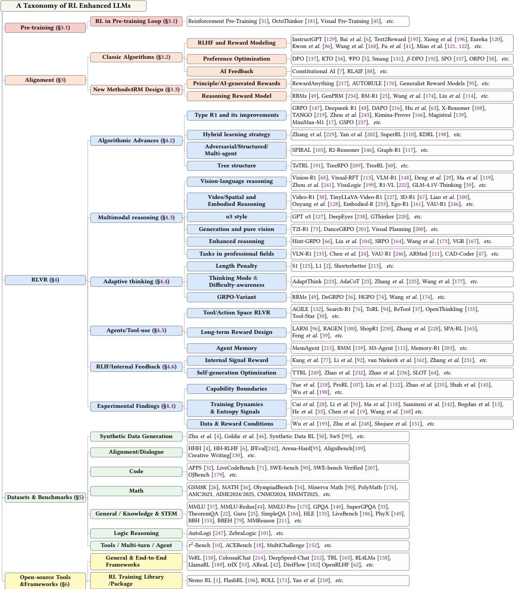
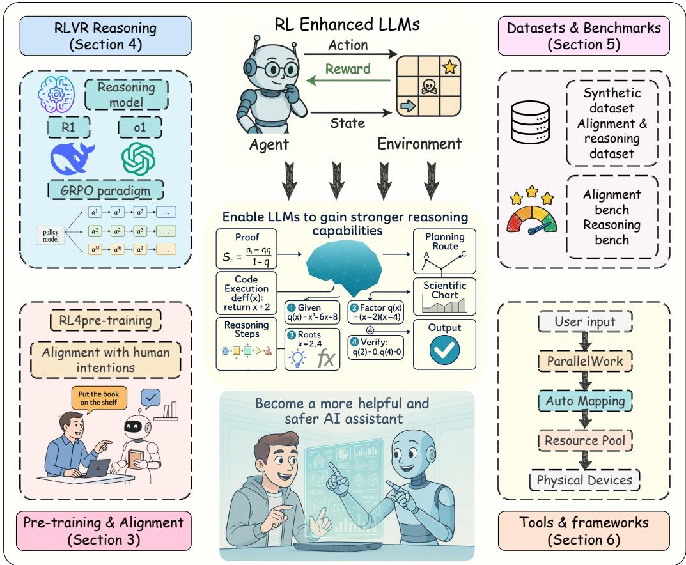
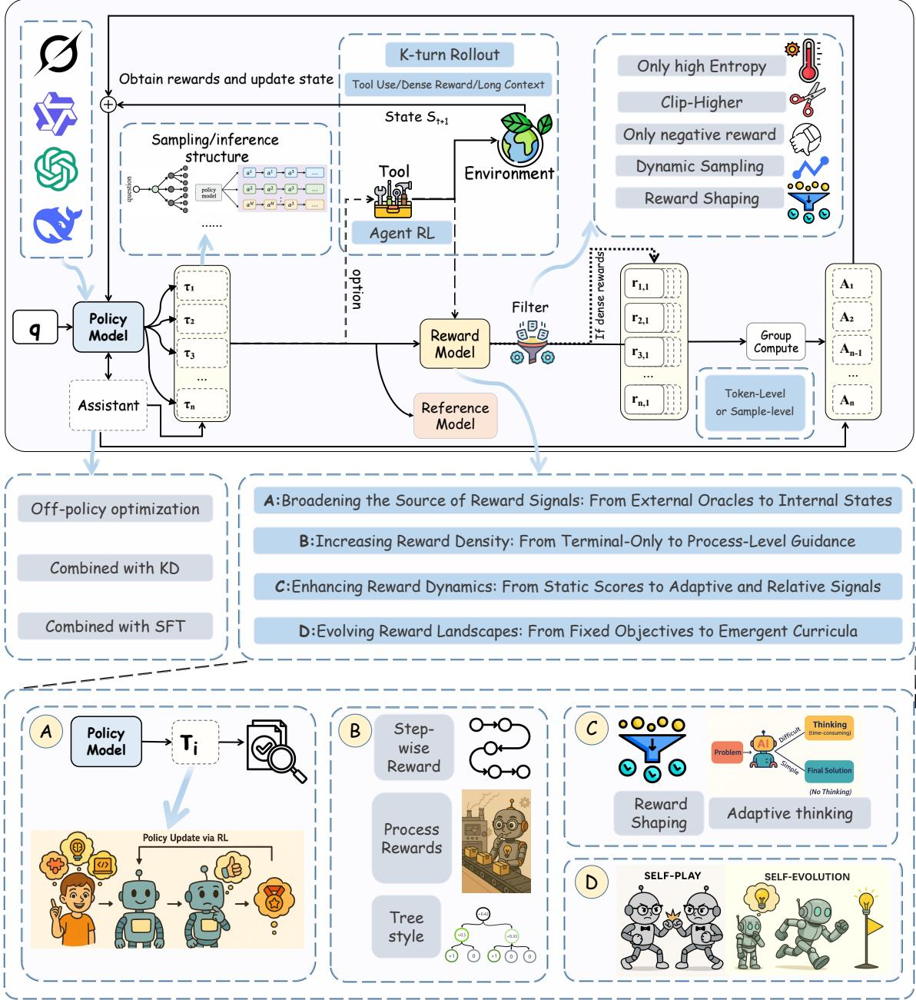

# 强化学习遇见大语言模型：贯穿 LLM 生命周期的进展与应用综述

KELIANG LIU∗，复旦大学，中国

DINGKANG YANG∗†，复旦大学，中国；ByteDance SAIL Team，中国

ZIYUN QIAN，复旦大学，中国

WEIJIE YIN，ByteDance SAIL Team，中国

YUCHI WANG、HONGSHENG LI，香港中文大学 MMLab，中国

JUN LIU，兰卡斯特大学，英国

PENG ZHAI‡，复旦大学，中国

YANG LIU‡，同济大学，中国；多伦多大学，加拿大

LIHUA ZHANG‡，复旦大学，中国

近年来，以强化学习（RL）为核心的训练方法显著提升了大语言模型（LLMs）的推理与对齐能力，尤其体现在理解人类意图、遵循用户指令以及增强复杂推断能力等方面。尽管已有综述对 RL 增强 LLMs 的研究进行了总结，但大多聚焦于局部问题，尚未系统梳理 RL 如何贯穿 LLM 的完整生命周期。本文围绕 RL 赋能 LLM 的理论基础与实践进展展开系统综述，重点关注近年来影响突出的“基于可验证奖励的强化学习”（RLVR）。首先，我们简要介绍强化学习的基本理论；其次，系统梳理 RL 在预训练、对齐微调和强化推理等阶段中的应用策略，特别强调“强化推理”阶段的 RL 方法已成为推动模型推理能力逼近极限的重要力量；随后，我们归纳当前 RL 微调常用的数据集与评测基准，涵盖人工标注偏好数据、AI 辅助偏好数据以及程序验证型语料；接着，我们回顾主流开源工具与训练框架，为后续研究和实践提供参考；最后，我们讨论 RL 增强 LLM 未来面临的主要挑战与发展趋势。本文旨在为研究者和工程实践者提供一份关于 RL 与 LLM 交叉领域的全景式参考，推动 LLM 朝着更智能、更通用、更安全的方向发展。

CCS 概念：调查与综述；自然语言处理；强化学习。

作者联系方式：Keliang Liu，klliu25@m.fudan.edu.cn，复旦大学，中国上海；Dingkang Yang，dkyang20@fudan.edu.cn，复旦大学，中国上海；ByteDance SAIL Team，中国上海；Ziyun Qian，zyqian22@m.fudan.edu.cn，复旦大学，中国上海；Weijie Yin，yinwj2021@163.com，ByteDance SAIL Team，中国上海；Yuchi Wang，wangyuchi@link.cuhk.edu.hk；Hongsheng Li，hsli@ee.cuhk.edu.hk，香港中文大学 MMLab，中国香港；Jun Liu，j.liu81@lancaster.ac.uk，兰卡斯特大学，英国；Peng Zhai，pzhai@fudan.edu.cn，复旦大学，中国上海；Yang Liu，yangliu@cs.toronto.edu，同济大学，中国上海；多伦多大学，加拿大；Lihua Zhang，lihuazhang@fudan.edu.cn，复旦大学，中国上海。

允许将本文全部或部分内容制作成数字版或纸质版，供个人学习或课堂教学免费使用，但前提是该复制品不得用于盈利或商业目的，且须在首页保留本声明与完整引用。若本文所包含的其他版权内容不归作者所有，则应尊重其相应版权。允许在注明出处的前提下进行摘要转载。若需以其他方式复制、再发布、上载服务器或分发至邮件列表，则需事先取得许可并可能支付相关费用。权限申请请联系 `permissions@acm.org`。© 2018 版权归作者或权利人所有，ACM 获得出版许可。

附加关键词：强化学习，大语言模型，推理，对齐，基于人类反馈的强化学习。
## ACM 参考格式：
刘凯良、丁康杨、钱子芸、尹伟杰、王宇驰、李鸿生、刘军、翟鹏、杨柳、张丽华。2018。《强化学习遇见大语言模型：贯穿 LLM 生命周期的进展与应用综述》。见 *ACM Computing Surveys*。ACM，美国纽约州纽约市，35 页。
## 1 引言
ChatGPT 等大语言模型在通用对话、代码生成和数学推理等任务上取得了令人瞩目的进展，并逐渐成为交互式人工智能系统的关键基础设施。然而，尽管这些模型具备较强的泛化能力，它们在准确理解细微人类意图、生成安全可信内容以及处理复杂推理任务方面仍然存在明显不足。因此，如何让大语言模型更好地与人类偏好、价值观和任务目标对齐，并进一步提升其解决复杂问题的推理能力，已成为当前研究的核心挑战之一。针对这些问题，强化学习通过交互反馈和奖励信号直接优化模型行为，已经成为一条极具代表性的技术路径。表 1 展示了若干典型模型在引入 RL 训练后相较于基线模型的性能提升。

表 1。代表性模型在引入强化学习训练后与其基线版本的性能对比。结果表明，RL 能显著提升基础模型的整体表现，凸显了强化学习在 LLM 后训练中的关键作用。其中，`Magistral Small-SC*` 和 `Magistral Small-RL#` 分别表示 `Magistral Small-24B-Starting Checkpoint` 以及该模型仅经过强化学习训练后的版本。
<table><tr><td>型号/基准</td><td>AIME2024号卫星</td><td>GPQA-钻石</td><td>LiveCode 奔驰</td><td>马特-500</td><td>姆卢</td><td>SWE 认证</td></tr><tr><td>深层搜索- V3 </td><td>39.2个</td><td>59.1 (中文(简体) ).</td><td>36.2 国家</td><td>90.2 (中文(简体) ).</td><td>88.5 (中文(简体) ).</td><td>42.0 (韩语).</td></tr><tr><td>深层Seek-R1-零</td><td>71.0 (+31.8) (中文(简体) ).</td><td>73.3(+14.2)</td><td>50.0(+13.8) (中文(简体) ).</td><td>95.9 (+5.7) (中文(简体) ).</td><td>页:1</td><td>页:1</td></tr><tr><td>深层搜索- R1 —— </td><td>79.8 (+40.6) (中文(简体) ).</td><td>71.5 (+12.4) (中文(简体) ).</td><td>65.9 (+29.7) (单位:千美元)</td><td>97.3(+7.1)</td><td>90.8 (+2.3) (中文(简体) ).</td><td>49.2(+7.2)</td></tr><tr><td>治安官 Small-SC * </td><td>32.2 (中文(简体) ).</td><td>63.4(GPQA,+SFT)</td><td>22.7(v5)</td><td>93.2(+SFT)</td><td>页:1</td><td>页:1</td></tr><tr><td>治安官 小RL# \ </td><td>65.8 (+33.6) (中文(简体) ).</td><td>68.8(全球采购质量评估,+5.4)</td><td>46.4(v5,+23.7)</td><td>95.4(+2.2)</td><td>页:1</td><td>页:1</td></tr><tr><td>GPT-40-0513 </td><td>9.3 (中文(简体) ).</td><td>49.9 国家</td><td>32.9 国家</td><td>74.6 (中文(简体) ).</td><td>87.2 (中文(简体) ).</td><td>第38.8条</td></tr><tr><td>OpenAI-o1-1217 — </td><td>79.2(+70.2)</td><td>75.7 (+25.8)</td><td>63.4(+30.5)</td><td>96.4(+21.8)</td><td>91.8 (+4.6) (中文(简体) ).</td><td>48.9 (+10.1)</td></tr></table>
自 Ouyang 等人提出“基于人类反馈的强化学习”（RLHF）以来，基于 RL 的微调逐渐成为提升 LLM 与人类指令、偏好和价值观一致性的核心方法。通过利用人工评估反馈或学习得到的奖励模型，RLHF 能让模型持续调整输出分布，生成更符合人类期待的回答，这是单纯监督学习难以做到的。近年来，在 RLHF 成功推动模型对齐的基础上，研究者进一步将强化学习用于增强推理能力。自 2024 年前后起，一批先进模型开始通过测试时扩展或训练后 RL 技术，在数学、编程等复杂推理任务上取得显著进步，例如 OpenAI o1、Claude 3.7/4、DeepSeek R1、Kimi K1.5 与 Qwen 3 等。这些成果表明，强化学习在推理阶段的应用，不仅能够改进模型的输出偏好，还可能激发其更强的问题求解能力。

推动这一轮进展的关键技术之一，是“基于可验证奖励的强化学习”（RLVR）。RLVR 通过程序执行、单元测试、形式化验证或答案正确性校验等客观且可自动验证的奖励信号来优化模型，从而避免仅依赖主观偏好标注。对能够通过严格正确性检验的输出给予正向奖励，使得模型更倾向于生成可验证、可靠且逻辑清晰的解答。在多步推理任务中，RLVR 已成为驱动模型性能突破的重要力量。

不过，RL 在 LLM 中的应用仍面临若干关键问题。首先，RLVR 是否真正带来了新的推理能力，还是主要提升了已有正确推理路径的采样效率，目前仍存在争议。其次，针对预训练、对齐和推理等不同阶段，究竟应采用何种 RL 技术组合，尚未形成统一共识。再次，高质量奖励数据的构建、奖励设计的可靠性以及策略优化方法的选择，依然是实践中的难点。最后，如何在大规模训练条件下兼顾效率、稳定性和模型已有能力的保持，也是一个尚未完全解决的问题。

基于上述背景，本文旨在对 RL 增强 LLM 的研究进展进行系统综述，重点关注近年快速发展的 RLVR 范式。我们希望澄清 RL 在 LLM 全生命周期中的作用，并梳理其在模型对齐与推理增强中的实际贡献。具体而言，本文从以下四个方面展开：一是 RL 应用于 LLM 的理论基础；二是 RL 在预训练、对齐微调和训练后推理等阶段的应用策略；三是 RL 微调常用的数据集与评测基准；四是支撑大规模 RL 训练的工具链与开源框架。我们希望这份综述能为研究者与工程实践者提供一张清晰的技术地图，帮助理解不同 RL 路线的优势与局限，并为后续工作提供参考。
## 1.1 相关综述
近年来，关于 RL 与大语言模型结合的综述不断增多，并提出了不同的分类框架。然而，现有研究大多只覆盖局部问题，缺少对完整技术版图的系统梳理。例如，一部分工作主要聚焦于基于 RL 的对齐技术，围绕奖励模型或偏好学习展开分类，却较少涉及推理增强等新兴方向；另一些研究尝试总结测试时推理与强化推理，但通常只从单一视角展开，缺乏覆盖预训练、对齐、推理、数据和工程框架的统一分析；还有一些综述从 RL 与 LLM 的协同关系、或简洁推理与自适应思考等特定主题切入，虽然具有参考价值，但难以构成一份端到端的生命周期综述。

图 1。RL 增强型 LLM 的分类框架。该图从五个分支梳理了构建 RL 增强型 LLM 所涉及的关键阶段与资源，包括预训练、对齐、RLVR、数据集与评测基准，以及开源框架。该框架有助于理解各阶段之间的联系，并为本文后续讨论的方法与资源提供结构化路线图。
表 2。代表性综述的比较分析。比较维度包括：生命周期覆盖范围、数据集与基准整理情况、工具与框架的系统性与实用性、引用的广度与时效性，以及对未来方向和挑战的讨论深度。
<table><tr><td>调查 </td><td></td><td>数据集和基准工具/框架</td><td></td><td>引用线索和及时性</td><td>未来方向和挑战</td></tr><tr><td>王等人 腾讯网.</td><td>X (仅对齐)</td><td>× (略为提及)</td><td>X(未涵盖)</td><td>× (未及时更新)</td><td>√(所述未来方向)</td></tr><tr><td>斯里瓦斯塔瓦等人()</td><td>X( 调整 + Rea- shoing)</td><td>× (仅用于演示性能)</td><td>X(未涵盖)</td><td> (截至2025年的接管)</td><td>(专门一节)</td></tr><tr><td>王等人 腾讯网.</td><td>X (主要对齐)</td><td>)× (略加提及)</td><td>X(未涵盖)</td><td>• (2025年初的办公室)</td><td>(简单讨论-sion)</td></tr><tr><td>曹 al等编. </td><td>X(未覆盖全部)</td><td>X(未涵盖)</td><td>X(未涵盖)</td><td>× (不包括)</td><td> (专门章节)</td></tr><tr><td>Chaudhari等人。 </td><td>X (仅对齐)</td><td>× (略为提及)</td><td>X(未涵盖)</td><td>X(仅关注高频,超时)</td><td>√(深入分析)</td></tr><tr><td>考夫曼等人。 </td><td>X (仅对齐)</td><td> (专门章节)</td><td>√(提及的图书馆支助)</td><td>× (暂时提前)</td><td>√(简要分析)</td></tr><tr><td>我们的调查</td><td>• (全面覆盖)</td><td> (专门章节)</td><td>•(组织良好)</td><td>√(完成最新工作)(深入分析)</td><td></td></tr></table>
与上述工作相比，本文试图从完整训练管线出发，系统考察 RL 在 LLM 从预训练、对齐微调到推理增强全过程中的作用，并在统一框架下组织相关方法、数据资源与工程工具。表 2 给出了本文与已有代表性综述的对比。
## 1.2 贡献摘要
本文的主要贡献可以概括为三点：

- 生命周期视角的系统组织。我们从 LLM 的完整生命周期出发，系统梳理 RL 在预训练、对齐和推理增强等阶段中的不同角色，明确各阶段的目标、技术路径与核心挑战。
- 聚焦 RLVR 的前沿进展。本文重点分析 RLVR 的核心思想、实验现象与最新应用，讨论如何通过客观、可验证的奖励设计提升模型的推理能力与输出可靠性。
- 汇总可直接使用的研究资源。我们整理了 RL 微调常用的数据集、评测基准、开源框架与工具链，以提升该方向研究的可复现性与工程可落地性。

为了给读者提供整体结构上的导航，图 1 从五个分支概括了本文的技术版图，而图 2 则展示了 RL 增强型 LLM 在完整生命周期中的关键组成部分及其相互关系。总体而言，本文从生命周期角度出发，对 RL 增强 LLM 的方法、资源与问题进行了系统综合，尤其强调 RLVR 在当前研究中的核心地位。

图 2。RL 增强型 LLM 的关键组成部分。该图展示了 RL 增强型 LLM 在完整生命周期中的核心模块及其相互作用关系：在 RL 框架与工具链支持下，RL 算法可参与预训练、对齐以及推理增强等训练阶段，并最终通过各类测试基准进行验证。
## 2 强化学习基础
强化学习的核心目标，是让智能体通过与环境交互学习最优策略，以最大化长期累积回报。一个典型的 RL 问题通常可表示为马尔可夫决策过程（MDP），其基本要素包括状态空间、动作空间、状态转移概率和奖励函数。在每个时间步，智能体根据当前状态选择动作，获得即时奖励，并转移到下一个状态。围绕这一目标，经典 RL 算法大体可分为两类：一类是基于策略的方法，直接优化策略本身；另一类是基于价值的方法，通过估计状态价值或动作价值来间接导出策略。本节简要介绍这两类方法的代表性算法，并说明它们在 LLM 训练中的作用。
## 2.1 策略学习
策略学习方法直接优化策略 $\pi(a|s;\theta)$，通常不显式学习环境模型或单独的价值函数。最经典的思路是策略梯度方法，即通过梯度上升直接调整策略参数，以最大化期望回报。REINFORCE 是最基础的蒙特卡洛策略梯度算法，它直接估计目标函数 $J(\theta)=\mathbb{E}[R]$ 关于参数 $\theta$ 的梯度，其中 $R$ 表示累计回报。利用对数导数技巧，可以得到如下无偏梯度估计：
$$
\nabla _ { \theta } J ( \theta ) = \mathbb { E } _ { \tau \sim \pi _ { \theta } } \left[ \sum _ { t = 0 } ^ { T } \nabla _ { \theta } \log \pi _ { \theta } ( a _ { t } | s _ { t } ) R _ { t } \right] .\tag{1}
$$
其中，$\tau=(s_0,a_0,r_0,\dots,s_T)$ 表示一条轨迹，$R_t=\sum_{k=t}^{T}\gamma^{k-t}r_k$ 表示从时间步 $t$ 开始的折扣回报，$\gamma$ 为折扣因子。直观来看，该公式表示：如果某个动作在后续带来了更高回报，就应该提升该动作在对应状态下被采样到的概率。采样完整轨迹后，REINFORCE 按照估计梯度更新参数：$\theta \leftarrow \theta + \alpha \nabla_\theta J(\theta)$，其中 $\alpha$ 是学习率。

为降低梯度估计的方差，常见做法是引入仅依赖状态的基线函数 $b(s)$。从回报中减去这一基线不会改变梯度的期望，但能显著降低方差，因此带基线的策略梯度可写为：
$$
\nabla _ { \theta } J ( \theta ) = \mathbb { E } \left[ \sum _ { t } \nabla _ { \theta } \log \pi _ { \theta } ( a _ { t } | s _ { t } ) \left( R _ { t } - b ( s _ { t } ) \right) \right] .\tag{2}
$$
$A_t = R_t - b(s_t)$ 通常被称为优势函数，用来衡量当前动作相对基线有多“好”。在不改变期望的前提下，它可以有效减少策略梯度估计的方差。

Actor-Critic（AC）方法进一步将策略梯度与价值函数近似结合起来：其中 actor 负责根据策略选择动作，critic 则通过状态值函数 $V_\phi(s)$ 或动作值函数 $Q_\phi(s,a)$ 对策略进行评估。在每一步，critic 估计优势函数或时序差分（TD）误差，actor 再据此更新策略参数。这一结构兼顾了策略优化的直接性与价值估计的稳定性。

信赖域策略优化（TRPO）旨在缓解策略更新过大带来的训练不稳定问题。其核心思想是：在最大化旧策略下优势函数的同时，约束新旧策略之间的 KL 散度不超过给定阈值，从而限制单次更新幅度。其优化目标如下：
$$
\operatorname* { m a x } _ { \theta } L ( \theta ) = \mathbb { E } _ { s \sim \pi _ { \mathrm { o l d } } } \left[ \sum _ { a } \frac { \pi _ { \theta } ( a | s ) } { \pi _ { \mathrm { o l d } } ( a | s ) } A ^ { \pi _ { \mathrm { o l d } } } ( s , a ) \right] ,\tag{3}
$$
$$
\begin{array} { r } { \mathrm { s . t . } \operatorname { \mathbb { E } } _ { s \sim \pi _ { \mathrm { o l d } } } \left[ D _ { \mathrm { K L } } ( \pi _ { \mathrm { o l d } } ( \cdot | s ) \parallel \pi _ { \theta } ( \cdot | s ) ) \right] \leq \delta . } \end{array}
$$
近端策略优化（PPO）则是深度强化学习时代最具代表性的策略优化算法之一。它通过“裁剪后的替代目标”在保证训练稳定性的同时允许多步更新，从而避免策略发生剧烈偏移。其目标函数为：
$$
L ^ { \mathrm { P P O } } ( \theta ) = \mathbb { E } _ { t } \bigl [ \operatorname* { m i n } ( r _ { t } ( \theta ) \hat { A } _ { t } , \ \mathrm { c l i p } ( r _ { t } ( \theta ) , 1 - \epsilon , 1 + \epsilon ) \hat { A } _ { t } ) \bigr ] .\tag{4}
$$
其中，$r_t(\theta)$ 表示新旧策略在时间步 $t$ 上的概率比，$\epsilon$ 为裁剪阈值，$\hat A_t$ 为优势估计。该目标函数的含义是：当策略更新幅度较小时，按常规策略梯度方向优化；一旦变化超出阈值，梯度会被削弱，从而避免策略偏离过远。

在 LLM 微调中，PPO 曾是 RLHF 的主力算法，因为它依赖价值网络来估计优势，训练相对稳定。但在长序列推理任务中，价值网络既会带来额外的显存与计算开销，也容易因估值不准造成训练不稳定。为此，DeepSeek 团队在 DeepSeekMath 中提出了组相对策略优化（GRPO）。GRPO 的核心思想是：对同一个问题一次采样多个回答，利用组内奖励的相对差异来更新策略，而不是为每个样本单独训练一个值函数。具体而言，模型为每个提示生成一组回答，再根据奖励模型或规则为每个回答打分，并以组内平均奖励或统计量作为动态基线。于是，奖励高于组均值的样本获得正优势，低于组均值的样本获得负优势。这样既能维持类似 PPO 的相对稳定更新，又避免了额外训练价值网络。
$$
\hat { A } _ { i , t } = \frac { r _ { i } - \operatorname* { m a x } ( \{ R _ { i } \} _ { i = 1 } ^ { G } ) } { \mathrm { s t d } ( \{ R _ { i } \} _ { i = 1 } ^ { G } ) } .\tag{5}
$$
与 PPO 类似，GRPO 也采用裁剪目标，并显式加入 KL 惩罚项，其目标函数如下：
$$
\begin{array} { l } { \displaystyle \mathcal { J } _ { \mathrm { G R P O } } ( \theta ) = \mathbb { E } _ { ( q , a ) \sim \mathcal { D } , \{ o _ { i } \} _ { i = 1 } ^ { G } \sim \pi _ { \theta _ { \mathrm { o d d } } } ( \cdot \vert q ) } } \\ { \displaystyle [ \frac { 1 } { G } \sum _ { i = 1 } ^ { G } \frac { 1 } { \vert o _ { i } \vert } \sum _ { t = 1 } ^ { \vert o _ { i } \vert } ( \operatorname* { m i n } ( r _ { i , t } ( \theta ) \hat { A } _ { i , t } , \ \mathrm { c l i p } ( r _ { i , t } ( \theta ) , 1 - \varepsilon , 1 + \varepsilon ) \hat { A } _ { i , t } ) - \beta D _ { \mathrm { K L } } ( \pi _ { \theta } | \vert \pi _ { \mathrm { r e f } } ) ) . } \end{array}\tag{6}
$$
## 2.2 价值学习
基于价值的方法通过估计价值函数来间接求解最优策略。价值函数描述了在某一策略下，状态或状态-动作对的长期期望收益，典型形式包括状态值函数 $V^\pi(s)$ 和动作值函数 $Q^\pi(s,a)$。这类方法的核心在于近似最优值函数，再按照“选择价值最高动作”的原则导出策略。

Q-learning 是最经典的无模型、离策略价值学习算法，其核心是在贝尔曼最优方程的指导下，迭代更新状态-动作对的价值估计。其更新规则为：
$$
\begin{array} { r } { Q _ { n e w } ( s _ { t } , a _ { t } ) \gets Q ( s _ { t } , a _ { t } ) + \alpha \left[ r _ { t } + \gamma \operatorname* { m a x } _ { a ^ { \prime } } Q ( s _ { t + 1 } , a ^ { \prime } ) - Q ( s _ { t } , a _ { t } ) \right] , } \end{array}\tag{7}
$$
其中，$\alpha$ 为学习率，$\gamma$ 为折扣因子。该更新规则通过时序差分（TD）误差修正当前价值估计，从而逐步逼近最优动作价值函数。由于 Q-learning 在更新时使用的是下一状态的“最大估计价值”，而不是实际执行动作对应的价值，因此它属于离策略方法。这一特性使其可以从历史经验或其他策略生成的数据中学习，但也容易带来价值高估问题。为缓解这一问题，后续研究提出了双重 Q-learning 等改进方法。

SARSA 是另一类经典的时序差分价值学习算法。与 Q-learning 不同，SARSA 属于在策略算法：它使用当前策略实际执行的动作来更新价值估计，因此学习到的是当前策略下的 $Q^\pi(s,a)$。其更新公式为：
$$
{ Q } _ { n e w } ( s _ { t } , a _ { t } ) \gets { Q } ( s _ { t } , a _ { t } ) + \alpha \left[ r _ { t } + \gamma { Q } ( { s } _ { t + 1 } , a _ { t + 1 } ) - { Q } ( { s } _ { t } , a _ { t } ) \right] .\tag{8}
$$
与 Q-learning 总是对下一状态取最大值不同，SARSA 使用的是当前策略实际采样到的下一动作，因此更贴近真实执行过程。随着策略逐步改进，SARSA 学到的价值估计也会逐渐逼近最优解。

深度 Q 网络（DQN）将神经网络引入 Q-learning，是基于价值方法的重要突破。其基本思想是用深度网络 $Q(s,a;\theta)$ 来近似动作价值函数，并通过最小化预测值与 TD 目标之间的均方误差进行训练：
$$
L ( \theta ) = \left( r + \gamma \operatorname* { m a x } _ { a ^ { \prime } } Q ( s ^ { \prime } , a ^ { \prime } ; \theta ^ { - } ) - Q ( s , a ; \theta ) \right) ^ { 2 } .\tag{9}
$$
其中，$\theta^-$ 表示目标网络参数，它会周期性地从训练网络同步，但在两次同步之间保持固定。通过引入目标网络，DQN 能缓解目标值与预测值同时变化导致的训练不稳定问题。

在 LLM 场景中，基于价值的方法通常并不是 RLHF 或 RLVR 的主流实现方式，主要原因在于自然语言生成的动作空间极其巨大，很难像传统 RL 环境那样显式为每个可能动作估计价值。不过，价值学习的思想仍然在部分工作中有所体现。例如，有研究利用基于 Q-learning 的框架动态选择上下文示例，通过在多样性与任务相关性之间进行权衡，帮助模型获得更有效的参考信息。
## 3 预训练阶段与对齐阶段的强化学习方法
## 3.1 训练前阶段的强化学习方法
目前，大多数 RL 赋能 LLM 的工作仍集中在对齐和微调阶段。不过，已有研究开始尝试把强化学习前移到预训练阶段。Dong 等人将传统的 next-token prediction 重构为一种基于 RL 的推理任务：当模型在给定上下文中正确预测下一个 token 时，即可获得可验证奖励，从而把强化学习直接引入预训练流程。尽管这一思路非常有启发性，但它也带来了极高的计算成本，并且通常依赖一个已经具有较强推理能力的基础模型。

在视觉方向，Ghosh 等人将 RL 引入无标注图像预训练，将其形式化为强化学习问题，并指出部分常见的自监督学习策略与价值学习之间存在概念上的相似性。OctoThinker 则提出一种两阶段中间训练策略，用于提升基础语言模型与强化学习的兼容性，使原本不适合大规模 RL 的 Llama 系列模型在数学推理任务上达到与 Qwen 系列相近的水平。这些工作表明，当 RL 被引入更早的训练阶段时，数据质量、训练节奏和样本风格都会显著影响最终效果。
## 3.2 对齐阶段的经典算法
Christiano 等人的工作为现代偏好优化奠定了基础，证明将人类偏好纳入微调流程，能够显著提升模型在帮助性与安全性上的表现。此后，Bai 等人的 RLHF 进一步表明，基于偏好反馈的训练不仅能够改善对话质量，也能提升模型在多类 NLP 任务上的综合表现。Xiong 等人从信息论角度重新解释 RLHF，将其写成带 KL 正则的迭代优化过程；SPO 等工作则尝试从博弈论视角理解偏好学习。与此同时，围绕 reward hacking 的研究也越来越多，说明奖励设计已成为对齐阶段的关键问题。

在降低人工标注成本方面，Constitutional AI 与 RLAIF 提供了代表性思路。前者通过一组预先定义的原则，让模型以“自我批评、自我修正”的方式生成更无害的输出；后者则利用已有模型提供 AI 反馈，在较少人工参与的条件下近似实现 RLHF 效果。

传统 RLHF 需要先训练奖励模型，再利用 RL 优化策略，流程相对复杂，且稳定性有限。DPO 的提出则将偏好学习进一步简化为一个更直接的目标函数，在一定条件下可以绕过显式奖励模型和复杂的 RL 训练。此后，围绕 DPO 的理论分析与改进方法不断出现，例如通过正则化、动态 KL 系数或数据过滤等方式提升其稳健性。与此同时，KTO、ORPO 以及基于自然语言自动构造奖励函数的方法，也都在尝试以更低成本完成模型对齐。由于这部分内容已有较多专门综述，本文仅保留核心脉络，奖励模型设计的进一步进展将在下一节介绍。
## 3.3 新的奖励模型设计方法
奖励模型在引导大语言模型生成符合人类预期的输出方面起着关键作用。近期，一批研究开始将奖励建模本身也视为一种“推理任务”：模型在给出奖励判断前，先进行思维链分析、代码验证或中间步骤评估。相关工作表明，奖励模型同样可以受益于测试时扩展、显式推理与强化学习训练，从而在复杂样本上做出更可靠的判断。

另一方面，奖励设计也在走向统一化与泛化。研究者尝试构建跨任务、跨模态可迁移的奖励模型，或从自然语言原则、规则抽取与在线生成式建模中学习奖励函数，以减轻对静态偏好数据的依赖。还有工作指出，经过标准语言建模训练的 LLM 内部本身就可能蕴含较强的“奖励判断能力”。总体来看，奖励模型正在从简单的打分器，逐步演变为具备更强推理性、可解释性和可迁移性的训练组件。
## 4 推理阶段的强化学习方法
随着 GPT-o1、DeepSeek R1 等模型的发布，强化学习在大语言模型领域的研究重心于 2025 年逐步转向 RLVR。本章将介绍 RLVR 的实验现象、算法进展，以及它在多模态推理、自适应思考、智能体和内部反馈学习中的应用。图 3 展示了 RLVR 的总体技术结构及其中若干关键可优化环节。
## 4.1 RLVR在提高LLMs的推理能力方面的实验结论
在数学和编程等任务上，基于可验证奖励的强化学习已经显著提升了大语言模型的推理表现。但与此同时，学界也在持续讨论一个核心问题：RLVR 究竟是在创造新的推理能力，还是主要在放大基础模型原本就具备的高质量推理路径。一些研究认为，在足够长的训练和新的任务条件下，RL 确实可能探索出基础模型原本难以产生的新路径；另一些工作则用 pass@k 等指标表明，RLVR 更多是在提高正确路径的采样效率，而不一定带来全新的推理机制。
$$
\begin{array} { r } { R = - a \exp ( \mathcal { H } ) + b . } \end{array}\tag{10}
$$
围绕 RLVR 的另一个重要议题，是策略熵下降、探索不足和模式收缩等训练现象。相关研究指出，策略性能提升往往伴随着探索能力下降，因此如何在提高正确率的同时维持足够的多样性，成为大规模 RL 训练中的关键难点。近期工作开始分析哪些 token、哪些推理连接词、以及哪些训练信号对最终推理路径影响最大，并尝试通过控制熵、限制更新范围、强调高价值 token 或构造更高质量数据来改善 RLVR 效果。总体而言，这些结果说明：推理增强不只是“加奖励”这么简单，训练信号的粒度、数据质量和探索机制都会深刻影响最终性能。
## 4.2 面向 LLM 的 RL 算法最新进展
近期 RLVR 算法的发展，主要围绕稳定性、样本效率和长链推理适配三个方向展开。以 GRPO 为起点，后续方法不断尝试改进裁剪策略、奖励归一化、采样方式和超长序列训练机制。例如，DAPO 通过调整裁剪策略、动态采样和 token 级损失设计来改善长序列训练；REINFORCE++ 试图在不依赖价值网络的前提下获得接近 PPO 的稳定性；GSPO、TreeRPO、TreeRL 等方法则从序列级比率和树状搜索等角度改进推理探索过程。

同时，还有不少方法尝试把 RL 与知识蒸馏、外部演示、形式化证明、协作式路由以及多智能体自博弈结合起来，以提升模型在数学、代码、定理证明和复杂规划任务中的泛化能力。总体来看，这一波算法创新的共识非常明确：面向 LLM 的 RL 不只是把传统 RL 直接套用到语言模型上，而是需要针对长文本生成、推理链稳定性和大规模训练效率进行专门设计。

图 3。RLVR 方法的技术结构。该图描绘了 RLVR 的整体工作流程，并进一步展开了奖励模型设计、策略外辅助、奖励过滤、采样与推理策略、智能体 RL 以及奖励更新层级等关键技术环节。
## 4.3 RLVR 在多模态推理中的应用
RLVR 在多模态推理中的扩展非常迅速。大量工作开始把强化学习从纯文本推理迁移到视觉、视频、三维场景、导航、医学影像乃至视觉生成任务中。围绕视觉语言模型（VLM）与多模态大语言模型（MLLM），研究者提出了多种强化微调框架，用于检测、定位、分类、视觉空间理解和多步视觉推理等任务。由于这类任务通常具有更明确的监督信号或更容易设计规则奖励，因此 RLVR 在多模态场景中具备较强的落地潜力。

在视频与具身场景中，RLVR 的作用进一步扩展到时间建模、空间关系推理和长时程任务分解。例如，一些工作通过时间依赖奖励提升视频推理能力，另一些方法则借助地图想象、第一人称视频理解、工具调用和协作式智能体流程来解决复杂时空推理问题。与此同时，RLVR 也逐步进入视觉生成任务，用于优化审美、文本对齐、视频运动质量等多维目标。

尽管如此，多模态 RL 推理仍有明显局限。当前大多数方法的核心推理链仍然以文本为中心，多模态信息与外部工具之间的深层协同还远未充分挖掘。围绕“何时看图、何时思考、何时调用工具”的动态决策机制，已经出现了一批新工作，这一方向预计会成为未来多模态强化学习研究的重要增长点。
## 4.4 自适应推理
RLVR 往往通过在测试阶段投入更多计算资源来生成更长的思维链，从而提升模型表现。但这种“多想一会儿就更强”的做法存在明显问题：思考长度通常不可控，简单问题可能被分配过多计算，复杂问题反而得不到足够预算。因此，研究者开始探索“自适应长度推理”方法，希望让模型学会根据任务难度决定是否展开长链思考，以及应当思考多长时间。

这一方向上，代表性工作包括通过“预算强制”延长推理过程、利用强化学习显式学习输出长度约束、将最短正确回答长度作为动态奖励信号，或通过控制符和长度奖励机制让模型在“快速回答”与“深度思考”之间自动切换。总体而言，自适应推理的目标是在性能与计算成本之间取得更精细的平衡，这对真实部署环境尤为关键。
## 4.5 面向智能体的 RLVR
与标准单轮文本生成任务不同，智能体任务涉及长时程决策、多轮交互和环境反馈，因此对强化学习提出了更高要求。近年来，AGILE、LARM、Search-R1、ToRL、ReTool、RAGEN、Tool-Star、SPA-RL、Memory-R1 等工作分别从工具使用、环境交互、长程规划、中间奖励和记忆管理等角度推进了面向智能体的 RL 训练。

总体上看，智能体 RL 的关键难点在于：奖励通常延迟出现，交互过程更长，错误恢复更困难，而且模型既要“会想”，也要“会行动”。因此，未来更细粒度的奖励设计、更稳定的多轮训练机制，以及更强的外部记忆与规划能力，将是这一方向持续演进的重点。
## 4.6 来自内部反馈的强化学习
虽然 RLHF 和 RLVR 已经取得显著成果，但它们仍高度依赖外部监督信号。这引出了一个自然问题：如果 RL 在很大程度上是在激活模型预训练中已经学到的知识，那么是否可以依靠模型自身的内部信号来驱动强化学习？围绕这一问题，近期出现了一批“来自内部反馈的强化学习”工作，例如利用模型自信度、自一致性、熵、测试时自监督乃至自生成任务来替代外部奖励。

这类方法的代表性思路包括：用样本间的自确定性来评估回答质量；用模型自身的信心作为唯一奖励信号；在没有人工数据的前提下，让模型自我生成任务、自我求解并通过执行器或规则进行验证；或从模型自评置信度中构建偏好数据再进行 RL 微调。这些工作证明，降低外部监督依赖是有可能的，但同时也暴露出稳定性不足、收益不稳定以及后期性能回落等问题，说明“无外部奖励推理学习”仍处于探索早期。
## 5 数据集和基准
## 5.1 合成数据生成
Zhu 等人提出了面向抽象视觉推理的合成数据框架，通过结构化 QA 生成与推理链构造，为模型提供定义清晰、覆盖多样的训练样本。Goldie 等人则为多步推理与工具使用设计了合成数据流水线，通过 LLM 与工具的交互构建带上下文、动作与反馈的轨迹，再根据过程合理性和最终正确性进行过滤，以获得高质量离线 RL 数据。Guo 等人提出基于任务定义的合成数据 RL 方法，可根据模型能力动态调节难度。SwS 则面向模型的薄弱点自动生成针对性问题，以更有效地弥补训练短板。
## 5.2 数据集和基准
本节介绍大语言模型强化学习研究中常用的数据集与测试基准。表 3 汇总了对齐/对话、代码、数学、通识与 STEM、逻辑推理以及多轮工具使用等多个方向的代表性数据集与评测任务。整体来看，当前基准已经从传统的静态问答逐渐演化为更强调可验证推理、多步决策与真实交互能力的评测体系。

表 3。数据集与基准概览。该表分类汇总了 RL-LLM 研究中常见的数据集与基准，覆盖对齐、代码、数学、知识、逻辑推理以及智能体任务等领域。
<table><tr><td>类别</td><td>数据集和基准</td><td>目 录</td></tr><tr><td>对齐/对话</td><td>(原始内容存档于2018-09-22). HHH-，HH-RLHF ，IFEval ，Arena-Hard ，Align Bench ，创意写作 。</td><td>评价对话的一致性,侧重于帮助、诚实和无害。</td></tr><tr><td>代码</td><td>APP ， LiveCode Bench ，SWE-bench ，SWE-bench验证版 ，OJ Bench </td><td>编程任务涉及代码生成和调试,有自动或实时的评价.</td></tr><tr><td>数学</td><td>GSM8K ，MATH ，奥林匹亚本奇 ，米内尔瓦数学 ，奥林匹亚本奇 ，PolyMath ，AMC2023,AIME2024/2025,CNMO2024,HMMT2025</td><td>解决数学问题的基准,从初级到高级,包括竞争和奥林匹克级任务。</td></tr><tr><td>普通考试/知识和STEM</td><td>MMLU ，MMLU-Pro ，GPQA ，超级GPQA ，定理QA ，古鲁 ，简单QA ，HLE ，Live Bench PH，PH PH 10，BBBEH ，MMReason </td><td>涵盖各个领域的一般知识基准,包括STEM和人级考试比较.</td></tr><tr><td>逻辑理由</td><td>自动Logi ， ZebraLogic </td><td>逻辑理性评价.</td></tr><tr><td>工具/多回合/智能体</td><td>(原始内容存档于2017-07-22) (中文(中国大陆) ). Bench ， ACEBENCH ， 多挑战 。</td><td>基准测试与工具的多回合互动,基于智能体的推理.</td></tr></table>
在具体数据集方面，GSM8K、MATH、MATH500、OlympiadBench、Minerva Math、AIME 等构成了数学推理评测的主力；APPS、LiveCodeBench、SWE-bench 和 OJBench 则代表代码生成与软件工程方向的重要基准；MMLU、MMLU-Pro、GPQA、SuperGPQA、TheoremQA、HLE、LiveBench 等覆盖了通识知识、科学推理和高难度考试场景；AutoLogi 和 ZebraLogic 面向逻辑推理；而 τ²-Bench、ACEBench、MultiChallenge 等则更强调多轮交互与工具使用能力。总体而言，这些基准越来越强调“可验证推理”和“真实任务环境”，也对 RL 方法提出了更高要求。

表 4。部分知名推理型大语言模型在测试基准上的表现。该表用于比较主流推理模型在通用任务、对齐任务、数学与编程推理以及逻辑推理等维度上的能力，其中 `*` 表示 14 语言版本。
<table><tr><td rowspan="2">OpenAI-o1 深层Seek-R1 </td><td colspan="6">格罗克-3-贝塔</td></tr><tr><td></td><td></td><td></td><td>(想着) </td><td></td><td>双子座2.5-Pro − Qwen3-235B-A22B − </td></tr><tr><td rowspan="3"></td><td>建筑</td><td></td><td>教育部</td><td></td><td></td><td>教育部</td></tr><tr><td># 激活的参数</td><td></td><td>第37B条</td><td></td><td>=</td><td>22B (韩语).</td></tr><tr><td>总参数</td><td>页:1</td><td>671B (英语).</td><td></td><td>页:1</td><td>235B (中文(简体) ).</td></tr><tr><td rowspan="4">一般任务</td><td>MMLU-Redux —— (中文(简体) ).</td><td>92.8 国家</td><td>92.9 国家</td><td>页:1</td><td>93.7 国家</td><td>92.7 国家</td></tr><tr><td>门卢* </td><td>88.4 国家</td><td>第86.4条</td><td>=</td><td>第86.9条</td><td>84.3 国家</td></tr><tr><td>GPQA-钻石 </td><td>78.0 国家</td><td>第71.5条</td><td>80.2 (韩语)</td><td>84.0 国家</td><td>71.1 国家</td></tr><tr><td>Live Bench – (英语).</td><td>75.7 国家</td><td>71.6 (中文(简体) ).</td><td>页:1</td><td>82.4 国家</td><td>77.1 国家</td></tr><tr><td rowspan="4">对齐任务</td><td>-IFEval – (法语)</td><td>92.6 (中文(简体) ).</td><td>第83.3条</td><td></td><td>89.5 (中文(简体) ).</td><td>第83.4条</td></tr><tr><td>竞技场 竞技场</td><td>92.1 (韩语)</td><td>92.3 (中文(简体) ).</td><td></td><td>96.4 (中文(简体) ).</td><td>95.6 国家</td></tr><tr><td>对齐奔驰 v1.1 </td><td>第8.86条</td><td>8.76 (中文(简体) ).</td><td></td><td>9.03 联合国</td><td>8.94 (简体中文).</td></tr><tr><td>创意写入 v3 </td><td>81.7 国家</td><td>85.5 (中文(简体) ).</td><td></td><td>86.0 国家</td><td>84.6 (中文(简体) ).</td></tr><tr><td rowspan="5">数学和编码原因</td><td>马特-500 -</td><td>96.4 (中文(简体) ).</td><td>97.3 国家</td><td></td><td>98.8 国家</td><td>98.0</td></tr><tr><td>24号线</td><td>74.3 国家</td><td>79.8 国家</td><td>83.9 国家</td><td>92.0 电话</td><td>85.7 国家</td></tr><tr><td>AIME' 25 (英语).</td><td>79.2 联合国</td><td>70.0 (中文(简体) ).</td><td>77.3 国家</td><td>86.7 国家</td><td>第81.5条</td></tr><tr><td>PolyMath – (多晶体)</td><td>38.9 联合国</td><td>第47.1条</td><td>页:1</td><td>第52.2条</td><td>54.7 国家</td></tr><tr><td>LiveCode Bench v5 互联网档案馆的存檔,存档日期2013-09-02.</td><td>63.9 国家</td><td>第64.3条</td><td>70.6 联合国</td><td>70.4 (中文(简体) ).</td><td>70.7 国家</td></tr><tr><td rowspan="2">逻辑理由</td><td>斑马纪 {}</td><td>81.0</td><td>78.7 国家</td><td>页:1</td><td>87.4 国家</td><td>80.3 (中文(简体) ).</td></tr><tr><td>自动 Logi </td><td>79.8 国家</td><td>第86.1条</td><td>=</td><td>85.4 国家</td><td>89.0 国家</td></tr></table>
## 6 开源工具和框架
VeRL、TRLX、RL4LMs、ColossalChat、DeepSpeed-Chat、OpenRLHF、TRL、AReaL、ROLL、NeMo RL、LlamaRL、FlashRL、DistFlow 等框架构成了当前 RL-LLM 工具生态的主体。它们覆盖了从分布式并行、模型切分、量化 rollout 到异步训练与多控制器调度等一系列工程需求。总体趋势很明确：框架不再只是“支持 RLHF 跑通”，而是在向“支持更长推理链、更复杂环境交互和更大规模后训练”的工程体系演进。
## 7 开放讨论
## 7.1 研究挑战
虽然强化学习已经显著推动了 LLM 的对齐与推理能力，但该方向仍面临几类基础性挑战。

7.1.1 可扩展性与训练稳定性。大规模 RL 训练依旧昂贵且脆弱。超大参数模型的后训练不仅需要可观的算力和显存资源，还高度依赖超参数、采样策略与分布式调度的精细控制。即便已有 VeRL、OpenRLHF、AReaL 等系统框架，如何在更大规模下稳定收敛，仍然是一个工程与算法共同面对的问题。

7.1.2 奖励设计与信用分配。对长链推理任务而言，仅依赖最终结果奖励往往不足以学到高质量的中间推理过程。如何构造更密集、更可靠的过程监督，如何在探索新路径与避免训练发散之间取得平衡，以及如何在极长序列上完成有效信用分配，依然是 RLVR 的核心挑战。

7.1.3 理论理解与可靠性。当前我们对“RL 在多大程度上真正提升了推理能力”仍缺乏统一结论。部分现象表明 RL 可能带来新的行为模式，也有研究认为它更多是在重排基础模型已有能力的分布。此外，训练不当还可能损害模型的校准性、知识保持能力与安全性，因此需要更深入的理论分析和更强的可解释性研究。

7.1.4 智能体应用中的难点。当 RL 被用于多轮智能体任务时，问题会进一步复杂化：环境交互成本更高，延迟奖励更严重，安全边界更难控制，长期记忆与规划能力也仍不充分。同时，当前缺少覆盖广泛、标准统一的智能体评测基准，这使得不同方法之间的横向比较依然困难。
## 7.2 未来趋势
7.2.1 学习范式将持续演化。未来 RL 训练很可能进一步从“结果奖励”走向“过程奖励”，从单一偏好优化走向更细粒度、更可验证的推理过程建模。同时，RL 也会与结构化推理、知识表示、图结构搜索以及工具规划更紧密结合，使模型学到更具迁移能力的推理策略。

7.2.2 应用边界将继续扩展。RL 在多模态推理、具身智能、科学研究辅助、形式化定理证明、决策支持系统等方向都具有广阔前景。随着任务环境更加开放、目标更加复杂，未来方法将更强调奖励设计的领域适配性，以及在真实场景中的安全可控性。

7.2.3 研究闭环会更加严谨。随着工具链、基准、训练框架和理论分析逐步成熟，RL-LLM 研究将形成更完整的正反馈循环：更好的工具支撑更可靠的实验，更严格的评测推动更稳健的方法，而更强的方法又会反过来催生新的评价标准。这一过程将持续推动 RL 增强型 LLM 朝着更一致、更通用、更安全的方向发展。
## 8 结论
本文围绕大语言模型从预训练、对齐到推理增强的完整生命周期，对强化学习相关研究进行了系统梳理。我们重点讨论了 RLVR 这一当前最具代表性的路线，因为它为 LLM 引入了更客观、更可靠、也更易自动化验证的优化信号。与此同时，本文还整理了相关数据集、评测基准与开源框架，希望为后续研究与工程实践提供一份结构化参考。总体而言，RL 已不再只是 LLM 后训练中的附属技术，而正在成为推动模型能力边界持续扩展的重要力量。
## 参考文献
[1] 2025. NeMo RL: A Scalable and Efficient Post-Training Library. https://github.com/NVIDIA-NeMo/RL. GitHub repository.
[2] Pranjal Aggarwal and Sean Welleck. 2025. L1: Controlling how long a reasoning model thinks with reinforcement learning. arXiv preprint arXiv:2503.04697 (2025).
[3] Anthropic. 2025. Claude Sonnet 4. https://www.anthropic.com/claude/sonnet
[4] Amanda Askell, Yuntao Bai, Anna Chen, Dawn Drain, Deep Ganguli, Tom Henighan, Andy Jones, Nicholas Joseph, Ben Mann, Nova DasSarma, et al. 2021. A general language assistant as a laboratory for alignment. arXiv preprint arXiv:2112.00861 (2021).
[5] Mohammad Gheshlaghi Azar, Zhaohan Daniel Guo, Bilal Piot, Remi Munos, Mark Rowland, Michal Valko, and Daniele Calandriello. 2024. A general theoretical paradigm to understand learning from human preferences. In International Conference on Artificial Intelligence and Statistics. PMLR, 4447–4455.
[6] Yuntao Bai, Andy Jones, Kamal Ndousse, Amanda Askell, Anna Chen, Nova DasSarma, Dawn Drain, Stanislav Fort, Deep Ganguli, Tom Henighan, et al. 2022. Training a helpful and harmless assistant with reinforcement learning from human feedback. arXiv preprint arXiv:2204.05862 (2022).
[7] Yuntao Bai, Saurav Kadavath, Sandipan Kundu, Amanda Askell, Jackson Kernion, Andy Jones, Anna Chen, Anna Goldie, Azalia Mirhoseini, Cameron McKinnon, et al. 2022. Constitutional ai: Harmlessness from ai feedback. arXiv preprint arXiv:2212.08073 (2022).
[8] Dibyanayan Bandyopadhyay, Soham Bhattacharjee, and Asif Ekbal. 2025. Thinking machines: A survey of llm based reasoning strategies. arXiv preprint arXiv:2503.10814 (2025).
[9] Yejin Bang, Samuel Cahyawijaya, Nayeon Lee, Wenliang Dai, Dan Su, Bryan Wilie, Holy Lovenia, Ziwei Ji, Tiezheng Yu, Willy Chung, Quyet V. Do, Yan Xu, and Pascale Fung. 2023. A Multitask, Multilingual, Multimodal Evaluation of ChatGPT on Reasoning, Hallucination, and Interactivity. In Proceedings of the 13th International Joint Conference on Natural Language Processing and the 3rd Conference of the Asia-Pacific Chapter of the Association for Computational Linguistics (Volume 1: Long Papers). Association for Computational Linguistics, Nusa Dua, Bali, 675–718. doi:10.18653/v1/2023.ijcnlp-main.45
[10] Victor Barres, Honghua Dong, Soham Ray, Xujie Si, and Karthik Narasimhan. 2025. ??2-Bench: Evaluating Conversational Agents in a Dual-Control Environment. arXiv preprint arXiv:2506.07982 (2025).
[11] Emily M Bender, Timnit Gebru, Angelina McMillan-Major, and Shmargaret Shmitchell. 2021. On the dangers of stochastic parrots: Can language models be too big?. In Proceedings of the 2021 ACM conference on fairness, accountability, and transparency. 610–623.
[12] Maciej Besta, Julia Barth, Eric Schreiber, Ales Kubicek, Afonso Catarino, Robert Gerstenberger, Piotr Nyczyk, Patrick Iff, Yueling Li, Sam Houliston, et al. 2025. Reasoning language models: A blueprint. arXiv preprint arXiv:2501.11223 (2025).
[13] Paul C Bogdan, Uzay Macar, Neel Nanda, and Arthur Conmy. 2025. Thought Anchors: Which LLM Reasoning Steps Matter? arXiv preprint arXiv:2506.19143 (2025).
[14] Rishi Bommasani, Drew A Hudson, Ehsan Adeli, Russ Altman, Simran Arora, Sydney von Arx, Michael S Bernstein, Jeannette Bohg, Antoine Bosselut, Emma Brunskill, et al. 2021. On the opportunities and risks of foundation models. arXiv preprint arXiv:2108.07258 (2021).
[15] Yuji Cao, Huan Zhao, Yuheng Cheng, Ting Shu, Yue Chen, Guolong Liu, Gaoqi Liang, Junhua Zhao, Jinyue Yan, and Yun Li. 2024. Survey on large language model-enhanced reinforcement learning: Concept, taxonomy, and methods. IEEE Transactions on Neural Networks and Learning Systems (2024).
[16] Shreyas Chaudhari, Pranjal Aggarwal, Vishvak Murahari, Tanmay Rajpurohit, Ashwin Kalyan, Karthik Narasimhan, Ameet Deshpande, and Bruno Castro da Silva. 2024. Rlhf deciphered: A critical analysis of reinforcement learning from human feedback for llms. Comput. Surveys (2024).
[17] Aili Chen, Aonian Li, Bangwei Gong, Binyang Jiang, Bo Fei, Bo Yang, Boji Shan, Changqing Yu, Chao Wang, Cheng Zhu, et al. 2025. MiniMax-M1: Scaling Test-Time Compute Efficiently with Lightning Attention. arXiv preprint arXiv:2506.13585 (2025).
[18] Chen Chen, Xinlong Hao, Weiwen Liu, Xu Huang, Xingshan Zeng, Shuai Yu, Dexun Li, Shuai Wang, Weinan Gan, Yuefeng Huang, et al. 2025. ACEBench: Who Wins the Match Point in Tool Learning? arXiv e-prints (2025), arXiv–2501.
[19] Hardy Chen, Haoqin Tu, Fali Wang, Hui Liu, Xianfeng Tang, Xinya Du, Yuyin Zhou, and Cihang Xie. 2025. Sft or rl? an early investigation into training r1-like reasoning large vision-language models. arXiv preprint arXiv:2504.11468 (2025).
[20] Jiawei Chen, Dingkang Yang, Yue Jiang, Mingcheng Li, Jinjie Wei, Xiaolu Hou, and Lihua Zhang. 2024. Efficiency in Focus: LayerNorm as a Catalyst for Fine-tuning Medical Visual Language Models. In Proceedings of the 32nd ACM International Conference on Multimedia. 3122–3130.
[21] Jiawei Chen, Dingkang Yang, Tong Wu, Yue Jiang, Xiaolu Hou, Mingcheng Li, Shunli Wang, Dongling Xiao, Ke Li, and Lihua Zhang. 2024. Detecting and evaluating medical hallucinations in large vision language models. arXiv preprint arXiv:2406.10185 (2024).
[22] Wenhu Chen, Ming Yin, Max Ku, Pan Lu, Yixin Wan, Xueguang Ma, Jianyu Xu, Xinyi Wang, and Tony Xia. 2023. TheoremQA: A Theoremdriven Question Answering Dataset. In Proceedings of the 2023 Conference on Empirical Methods in Natural Language Processing. Association for Computational Linguistics, Singapore, 7889–7901. doi:10.18653/v1/2023.emnlp-main.489
[23] Xiusi Chen, Gaotang Li, Ziqi Wang, Bowen Jin, Cheng Qian, Yu Wang, Hongru Wang, Yu Zhang, Denghui Zhang, Tong Zhang, et al. 2025. Rm-r1: Reward modeling as reasoning. arXiv preprint arXiv:2505.02387 (2025).
[24] Zuyao Chen, Jinlin Wu, Zhen Lei, Marc Pollefeys, and Chang Wen Chen. 2025. Compile scene graphs with reinforcement learning. arXiv preprint arXiv:2504.13617 (2025).
[25] Zhoujun Cheng, Shibo Hao, Tianyang Liu, Fan Zhou, Yutao Xie, Feng Yao, Yuexin Bian, Yonghao Zhuang, Nilabjo Dey, Yuheng Zha, et al. 2025. Revisiting Reinforcement Learning for LLM Reasoning from A Cross-Domain Perspective. arXiv preprint arXiv:2506.14965 (2025).
[26] Karl Cobbe, Vineet Kosaraju, Mohammad Bavarian, Mark Chen, Heewoo Jun, Lukasz Kaiser, Matthias Plappert, Jerry Tworek, Jacob Hilton, Reiichiro Nakano, et al. 2021. Training verifiers to solve math word problems. arXiv preprint arXiv:2110.14168 (2021).
[27] Gheorghe Comanici, Eric Bieber, Mike Schaekermann, Ice Pasupat, Noveen Sachdeva, Inderjit Dhillon, Marcel Blistein, Ori Ram, Dan Zhang, Evan Rosen, et al. 2025. Gemini 2.5: Pushing the frontier with advanced reasoning, multimodality, long context, and next generation agentic capabilities. arXiv preprint arXiv:2507.06261 (2025).
[28] Ganqu Cui, Yuchen Zhang, Jiacheng Chen, Lifan Yuan, Zhi Wang, Yuxin Zuo, Haozhan Li, Yuchen Fan, Huayu Chen, Weize Chen, et al. 2025. The entropy mechanism of reinforcement learning for reasoning language models. arXiv preprint arXiv:2505.22617 (2025).
[29] Huilin Deng, Ding Zou, Rui Ma, Hongchen Luo, Yang Cao, and Yu Kang. 2025. Boosting the generalization and reasoning of vision language models with curriculum reinforcement learning. arXiv preprint arXiv:2503.07065 (2025).
[30] Guanting Dong, Yifei Chen, Xiaoxi Li, Jiajie Jin, Hongjin Qian, Yutao Zhu, Hangyu Mao, Guorui Zhou, Zhicheng Dou, and Ji-Rong Wen. 2025. Tool-Star: Empowering LLM-Brained Multi-Tool Reasoner via Reinforcement Learning. arXiv preprint arXiv:2505.16410 (2025).
[31] Qingxiu Dong, Li Dong, Yao Tang, Tianzhu Ye, Yutao Sun, Zhifang Sui, and Furu Wei. 2025. Reinforcement Pre-Training. arXiv preprint arXiv:2506.08007 (2025).
[32] Shihan Dou, Yan Liu, Haoxiang Jia, Enyu Zhou, Limao Xiong, Junjie Shan, Caishuang Huang, Xiao Wang, Xiaoran Fan, Zhiheng Xi, Yuhao Zhou, Tao Ji, Rui Zheng, Qi Zhang, Tao Gui, and Xuanjing Huang. 2024. StepCoder: Improving Code Generation with Reinforcement Learning from Compiler Feedback. In Proceedings of the 62nd Annual Meeting of the Association for Computational Linguistics (Volume 1: Long Papers). Association for Computational Linguistics, Bangkok, Thailand, 4571–4585. doi:10.18653/v1/2024.acl-long.251
[33] Xinrun Du, Yifan Yao, Kaijing Ma, Bingli Wang, Tianyu Zheng, King Zhu, Minghao Liu, Yiming Liang, Xiaolong Jin, Zhenlin Wei, et al. 2025. Supergpqa: Scaling llm evaluation across 285 graduate disciplines. arXiv preprint arXiv:2502.14739 (2025).
[34] Kawin Ethayarajh, Winnie Xu, Niklas Muennighoff, Dan Jurafsky, and Douwe Kiela. 2024. Model alignment as prospect theoretic optimization. In Forty-first International Conference on Machine Learning.
[35] Kaixuan Fan, Kaituo Feng, Haoming Lyu, Dongzhan Zhou, and Xiangyu Yue. 2025. SophiaVL-R1: Reinforcing MLLMs Reasoning with Thinking Reward. arXiv preprint arXiv:2505.17018 (2025).
[36] Gongfan Fang, Xinyin Ma, and Xinchao Wang. 2025. Thinkless: Llm learns when to think. arXiv preprint arXiv:2505.13379 (2025).
[37] Jiazhan Feng, Shijue Huang, Xingwei Qu, Ge Zhang, Yujia Qin, Baoquan Zhong, Chengquan Jiang, Jinxin Chi, and Wanjun Zhong. 2025. Retool: Reinforcement learning for strategic tool use in llms. arXiv preprint arXiv:2504.11536 (2025).
[38] Kaituo Feng, Kaixiong Gong, Bohao Li, Zonghao Guo, Yibing Wang, Tianshuo Peng, Junfei Wu, Xiaoying Zhang, Benyou Wang, and Xiangyu Yue. 2025. Video-r1: Reinforcing video reasoning in mllms. arXiv preprint arXiv:2503.21776 (2025).
[39] Lang Feng, Zhenghai Xue, Tingcong Liu, and Bo An. 2025. Group-in-group policy optimization for llm agent training. arXiv preprint arXiv:2505.10978 (2025).
[40] Simon Frieder, Luca Pinchetti, Ryan-Rhys Griffiths, Tommaso Salvatori, Thomas Lukasiewicz, Philipp Petersen, and Julius Berner. 2023. Mathematical capabilities of chatgpt. Advances in neural information processing systems 36 (2023), 27699–27744.
[41] Jiayi Fu, Xuandong Zhao, Chengyuan Yao, Heng Wang, Qi Han, and Yanghua Xiao. 2025. Reward shaping to mitigate reward hacking in rlhf. arXiv preprint arXiv:2502.18770 (2025).
[42] Wei Fu, Jiaxuan Gao, Xujie Shen, Chen Zhu, Zhiyu Mei, Chuyi He, Shusheng Xu, Guo Wei, Jun Mei, Jiashu Wang, et al. 2025. AReaL: A Large-Scale Asynchronous Reinforcement Learning System for Language Reasoning. arXiv preprint arXiv:2505.24298 (2025).
[43] Samuel Gehman, Suchin Gururangan, Maarten Sap, Yejin Choi, and Noah A. Smith. 2020. RealToxicityPrompts: Evaluating Neural Toxic Degeneration in Language Models. In Findings of the Association for Computational Linguistics: EMNLP 2020. Association for Computational Linguistics, Online, 3356–3369. doi:10.18653/v1/2020.findings-emnlp.301
[44] Aryo Pradipta Gema, Joshua Ong Jun Leang, Giwon Hong, Alessio Devoto, Alberto Carlo Maria Mancino, Rohit Saxena, Xuanli He, Yu Zhao, Xiaotang Du, Mohammad Reza Ghasemi Madani, Claire Barale, Robert McHardy, Joshua Harris, Jean Kaddour, Emile Van Krieken, and Pasquale Minervini. 2025. Are We Done with MMLU?. In Proceedings of the 2025 Conference of the Nations of the Americas Chapter of the Association for Computational Linguistics: Human Language Technologies (Volume 1: Long Papers). Association for Computational Linguistics, Albuquerque, New Mexico, 5069–5096. doi:10.18653/v1/2025.naacl-long.262
[45] Dibya Ghosh and Sergey Levine. 2025. Visual Pre-Training on Unlabeled Images using Reinforcement Learning. arXiv preprint arXiv:2506.11967 (2025).
[46] Anna Goldie, Azalia Mirhoseini, Hao Zhou, Irene Cai, and Christopher D Manning. 2025. Synthetic data generation & multi-step rl for reasoning & tool use. arXiv preprint arXiv:2504.04736 (2025).
[47] Yandong Guan, Xilin Wang, Xingxi Ming, Jing Zhang, Dong Xu, and Qian Yu. 2025. CAD-Coder: Text-to-CAD Generation with Chain-of-Thought and Geometric Reward. arXiv preprint arXiv:2505.19713 (2025).
[48] Daya Guo, Dejian Yang, Haowei Zhang, Junxiao Song, Ruoyu Zhang, Runxin Xu, Qihao Zhu, Shirong Ma, Peiyi Wang, Xiao Bi, et al. 2025. Deepseek-r1: Incentivizing reasoning capability in llms via reinforcement learning. arXiv preprint arXiv:2501.12948 (2025).
[49] Jiaxin Guo, Zewen Chi, Li Dong, Qingxiu Dong, Xun Wu, Shaohan Huang, and Furu Wei. 2025. Reward reasoning model. arXiv preprint arXiv:2505.14674 (2025).
[50] Yiduo Guo, Zhen Guo, Chuanwei Huang, Zi-Ang Wang, Zekai Zhang, Haofei Yu, Huishuai Zhang, and Yikang Shen. 2025. Synthetic Data RL: Task Definition Is All You Need. arXiv preprint arXiv:2505.17063 (2025).
[51] Qianyue Hao, Sibo Li, Jian Yuan, and Yong Li. 2025. Rl of thoughts: Navigating llm reasoning with inference-time reinforcement learning. arXiv preprint arXiv:2505.14140 (2025).
[52] Hado Hasselt. 2010. Double Q-learning. Advances in neural information processing systems 23 (2010).
[53] Alexander Havrilla, Maksym Zhuravinskyi, Duy Phung, Aman Tiwari, Jonathan Tow, Stella Biderman, Quentin Anthony, and Louis Castricato. 2023. trlX: A framework for large scale reinforcement learning from human feedback. In Proceedings of the 2023 Conference on Empirical Methods in Natural Language Processing. 8578–8595.
[54] Chaoqun He, Renjie Luo, Yuzhuo Bai, Shengding Hu, Zhen Thai, Junhao Shen, Jinyi Hu, Xu Han, Yujie Huang, Yuxiang Zhang, Jie Liu, Lei Qi, Zhiyuan Liu, and Maosong Sun. 2024. OlympiadBench: A Challenging Benchmark for Promoting AGI with Olympiad-Level Bilingual Multimodal Scientific Problems. In Proceedings of the 62nd Annual Meeting of the Association for Computational Linguistics (Volume 1: Long Papers). Association for Computational Linguistics, Bangkok, Thailand, 3828–3850. doi:10.18653/v1/2024.acl-long.211
[55] Shenghua He, Tian Xia, Xuan Zhou, and Hui Wei. 2025. Response-Level Rewards Are All You Need for Online Reinforcement Learning in LLMs: A Mathematical Perspective. arXiv preprint arXiv:2506.02553 (2025).
[56] Dan Hendrycks, Steven Basart, Saurav Kadavath, Mantas Mazeika, Akul Arora, Ethan Guo, Collin Burns, Samir Puranik, Horace He, Dawn Song, and Jacob Steinhardt. 2021. Measuring Coding Challenge Competence With APPS. In Proceedings of the Neural Information Processing Systems Track on Datasets and Benchmarks, Vol. 1. https://datasets-benchmarks-proceedings.neurips.cc/paper\_files/paper/2021/file/ c24cd76e1ce41366a4bbe8a49b02a028-Paper-round2.pdf
[57] Dan Hendrycks, Collin Burns, Steven Basart, Andy Zou, Mantas Mazeika, Dawn Song, and Jacob Steinhardt. 2021. Measuring Massive Multitask Language Understanding. In ICLR. OpenReview.net.
[58] Jiwoo Hong, Noah Lee, and James Thorne. 2024. ORPO: Monolithic Preference Optimization without Reference Model. In Proceedings of the 2024 Conference on Empirical Methods in Natural Language Processing. Association for Computational Linguistics, Miami, Florida, USA, 11170–11189. doi:10.18653/v1/2024.emnlp-main.626
[59] Wenyi Hong, Wenmeng Yu, Xiaotao Gu, Guo Wang, Guobing Gan, Haomiao Tang, Jiale Cheng, Ji Qi, Junhui Ji, Lihang Pan, et al. 2025. GLM-4.1 V-Thinking: Towards Versatile Multimodal Reasoning with Scalable Reinforcement Learning. arXiv preprint arXiv:2507.01006 (2025).
[60] Zhenyu Hou, Ziniu Hu, Yujiang Li, Rui Lu, Jie Tang, and Yuxiao Dong. 2025. TreeRL: LLM Reinforcement Learning with On-Policy Tree Search. In Proceedings of the 63rd Annual Meeting of the Association for Computational Linguistics (Volume 1: Long Papers). Association for Computational Linguistics, Vienna, Austria, 12355–12369. doi:10.18653/v1/2025.acl-long.604
[61] Jian Hu. 2025. Reinforce++: A simple and efficient approach for aligning large language models. arXiv preprint arXiv:2501.03262 (2025).
[62] Jian Hu, Xibin Wu, Zilin Zhu, Weixun Wang, Dehao Zhang, Yu Cao, et al. 2024. Openrlhf: An easy-to-use, scalable and high-performance rlhf framework. arXiv preprint arXiv:2405.11143 (2024).
[63] Jingcheng Hu, Yinmin Zhang, Qi Han, Daxin Jiang, Xiangyu Zhang, and Heung-Yeung Shum. 2025. Open-reasoner-zero: An open source approach to scaling up reinforcement learning on the base model. arXiv preprint arXiv:2503.24290 (2025).
[64] Yang Hu, Xingyu Zhang, Xueji Fang, Zhiyang Chen, Xiao Wang, Huatian Zhang, and Guojun Qi. 2025. SLOT: Sample-specific Language Model Optimization at Test-time. arXiv preprint arXiv:2505.12392 (2025).
[65] Jie Huang, Xinyun Chen, Swaroop Mishra, Huaixiu Steven Zheng, Adams Yu, Xinying Song, and Denny Zhou. 2024. Large Language Models Cannot Self-Correct Reasoning Yet. In International Conference on Representation Learning, Vol. 2024. 32808–32824. https://proceedings.iclr.cc/ paper\_files/paper/2024/file/8b4add8b0aa8749d80a34ca5d941c355-Paper-Conference.pdf
[66] Qihan Huang, Weilong Dai, Jinlong Liu, Wanggui He, Hao Jiang, Mingli Song, Jingyuan Chen, Chang Yao, and Jie Song. 2025. Boosting mllm reasoning with text-debiased hint-grpo. arXiv preprint arXiv:2503.23905 (2025).
[67] Ting Huang, Zeyu Zhang, and Hao Tang. 2025. 3D-R1: Enhancing Reasoning in 3D VLMs for Unified Scene Understanding. arXiv preprint arXiv:2507.23478 (2025).
[68] Wenxuan Huang, Bohan Jia, Zijie Zhai, Shaosheng Cao, Zheyu Ye, Fei Zhao, Zhe Xu, Yao Hu, and Shaohui Lin. 2025. Vision-r1: Incentivizing reasoning capability in multimodal large language models. arXiv preprint arXiv:2503.06749 (2025).
[69] Aaron Hurst, Adam Lerer, Adam P Goucher, Adam Perelman, Aditya Ramesh, Aidan Clark, AJ Ostrow, Akila Welihinda, Alan Hayes, Alec Radford, et al. 2024. Gpt-4o system card. arXiv preprint arXiv:2410.21276 (2024).
[70] Aaron Jaech, Adam Kalai, Adam Lerer, Adam Richardson, Ahmed El-Kishky, Aiden Low, Alec Helyar, Aleksander Madry, Alex Beutel, Alex Carney, et al. 2024. Openai o1 system card. arXiv preprint arXiv:2412.16720 (2024).
[71] Naman Jain, King Han, Alex Gu, Wen-Ding Li, Fanjia Yan, Tianjun Zhang, Sida Wang, Armando Solar-Lezama, Koushik Sen, and Ion Stoica. 2024. Livecodebench: Holistic and contamination free evaluation of large language models for code. arXiv preprint arXiv:2403.07974 (2024).
[72] Miaomiao Ji, Yanqiu Wu, Zhibin Wu, Shoujin Wang, Jian Yang, Mark Dras, and Usman Naseem. 2025. A survey on progress in llm alignment from the perspective of reward design. arXiv preprint arXiv:2505.02666 (2025).
[73] Dongzhi Jiang, Ziyu Guo, Renrui Zhang, Zhuofan Zong, Hao Li, Le Zhuo, Shilin Yan, Pheng-Ann Heng, and Hongsheng Li. 2025. T2i-r1: Reinforcing image generation with collaborative semantic-level and token-level cot. arXiv preprint arXiv:2505.00703 (2025).
[74] Lingjie Jiang, Xun Wu, Shaohan Huang, Qingxiu Dong, Zewen Chi, Li Dong, Xingxing Zhang, Tengchao Lv, Lei Cui, and Furu Wei. 2025. Think only when you need with large hybrid-reasoning models. arXiv preprint arXiv:2505.14631 (2025).
[75] Ruili Jiang, Kehai Chen, Xuefeng Bai, Zhixuan He, Juntao Li, Muyun Yang, Tiejun Zhao, Liqiang Nie, and Min Zhang. 2024. A survey on human preference learning for large language models. arXiv preprint arXiv:2406.11191 (2024).
[76] Bowen Jin, Hansi Zeng, Zhenrui Yue, Jinsung Yoon, Sercan Arik, Dong Wang, Hamed Zamani, and Jiawei Han. 2025. Search-r1: Training llms to reason and leverage search engines with reinforcement learning. arXiv preprint arXiv:2503.09516 (2025).
[77] Zhewei Kang, Xuandong Zhao, and Dawn Song. 2025. Scalable best-of-n selection for large language models via self-certainty. arXiv preprint arXiv:2502.18581 (2025).
[78] Timo Kaufmann, Paul Weng, Viktor Bengs, and Eyke Hüllermeier. 2024. A Survey of Reinforcement Learning from Human Feedback. arXiv:2312.14925 [cs.LG] https://arxiv.org/abs/2312.14925
[79] Mehran Kazemi, Bahare Fatemi, Hritik Bansal, John Palowitch, Chrysovalantis Anastasiou, Sanket Vaibhav Mehta, Lalit K Jain, Virginia Aglietti, Disha Jindal, Peter Chen, et al. 2025. Big-bench extra hard. arXiv preprint arXiv:2502.19187 (2025).
[80] Zixuan Ke, Fangkai Jiao, Yifei Ming, Xuan-Phi Nguyen, Austin Xu, Do Xuan Long, Minzhi Li, Chengwei Qin, Peifeng Wang, Silvio Savarese, et al. 2025. A survey of frontiers in llm reasoning: Inference scaling, learning to reason, and agentic systems. arXiv preprint arXiv:2504.09037 (2025).
[81] Zachary Kenton, Tom Everitt, Laura Weidinger, Iason Gabriel, Vladimir Mikulik, and Geoffrey Irving. 2021. Alignment of language agents. arXiv preprint arXiv:2103.14659 (2021).
[82] Vijay Konda and John Tsitsiklis. 1999. Actor-critic algorithms. Advances in neural information processing systems 12 (1999).
[83] Tomasz Korbak, Hady Elsahar, Germán Kruszewski, and Marc Dymetman. 2022. On reinforcement learning and distribution matching for fine-tuning language models with no catastrophic forgetting. Advances in Neural Information Processing Systems 35 (2022), 16203–16220.
[84] Suhas Kotha, Jacob Mitchell Springer, and Aditi Raghunathan. 2024. Understanding Catastrophic Forgetting in Language Models via Implicit Inference. In ICLR. OpenReview.net.
[85] Komal Kumar, Tajamul Ashraf, Omkar Thawakar, Rao Muhammad Anwer, Hisham Cholakkal, Mubarak Shah, Ming-Hsuan Yang, Phillip HS Torr, Fahad Shahbaz Khan, and Salman Khan. 2025. Llm post-training: A deep dive into reasoning large language models. arXiv preprint arXiv:2502.21321 (2025).
[86] Minae Kwon, Sang Michael Xie, Kalesha Bullard, and Dorsa Sadigh. 2023. Reward Design with Language Models. In ICLR. OpenReview.net.
[87] Nathan Lambert, Jacob Morrison, Valentina Pyatkin, Shengyi Huang, Hamish Ivison, Faeze Brahman, Lester James V Miranda, Alisa Liu, Nouha Dziri, Shane Lyu, et al. 2024. Tulu 3: Pushing frontiers in open language model post-training. arXiv preprint arXiv:2411.15124 (2024).
[88] Harrison Lee, Samrat Phatale, Hassan Mansoor, Kellie Ren Lu, Thomas Mesnard, Johan Ferret, Colton Bishop, Ethan Hall, Victor Carbune, and Abhinav Rastogi. 2023. Rlaif: Scaling reinforcement learning from human feedback with ai feedback. (2023).
[89] Yuxuan Lei, Dingkang Yang, Zhaoyu Chen, Jiawei Chen, Peng Zhai, and Lihua Zhang. 2025. Large Vision-Language Models as Emotion Recognizers in Context Awareness. In Asian Conference on Machine Learning. PMLR, 111–126.
[90] Aitor Lewkowycz, Anders Andreassen, David Dohan, Ethan Dyer, Henryk Michalewski, Vinay Ramasesh, Ambrose Slone, Cem Anil, Imanol Schlag, Theo Gutman-Solo, et al. 2022. Solving quantitative reasoning problems with language models. Advances in neural information processing systems 35 (2022), 3843–3857.
[91] Ming Li, Jike Zhong, Shitian Zhao, Yuxiang Lai, Haoquan Zhang, Wang Bill Zhu, and Kaipeng Zhang. 2025. Think or not think: A study of explicit thinking in rule-based visual reinforcement fine-tuning. arXiv preprint arXiv:2503.16188 (2025).
[92] Pengyi Li, Matvey Skripkin, Alexander Zubrey, Andrey Kuznetsov, and Ivan Oseledets. 2025. Confidence Is All You Need: Few-Shot RL Fine-Tuning of Language Models. arXiv preprint arXiv:2506.06395 (2025).
[93] Tianle Li, Wei-Lin Chiang, Evan Frick, Lisa Dunlap, Tianhao Wu, Banghua Zhu, Joseph E Gonzalez, and Ion Stoica. 2024. From crowdsourced data to high-quality benchmarks: Arena-hard and benchbuilder pipeline. arXiv preprint arXiv:2406.11939 (2024).
[94] Xuefeng Li, Haoyang Zou, and Pengfei Liu. 2025. Torl: Scaling tool-integrated rl. arXiv preprint arXiv:2503.23383 (2025).
[95] Yi-Chen Li, Tian Xu, Yang Yu, Xuqin Zhang, Xiong-Hui Chen, Zhongxiang Ling, Ningjing Chao, Lei Yuan, and Zhi-Hua Zhou. 2025. Generalist Reward Models: Found Inside Large Language Models. arXiv preprint arXiv:2506.23235 (2025).
[96] Zhuoling Li, Xiaogang Xu, Zhenhua Xu, Ser-Nam Lim, and Hengshuang Zhao. 2025. LARM: Large Auto-Regressive Model for Long-Horizon Embodied Intelligence. In Forty-second International Conference on Machine Learning. https://openreview.net/forum?id=zcx7jqUZg5
[97] Eric Liang, Richard Liaw, Robert Nishihara, Philipp Moritz, Roy Fox, Ken Goldberg, Joseph Gonzalez, Michael Jordan, and Ion Stoica. 2018. RLlib: Abstractions for distributed reinforcement learning. In International conference on machine learning. PMLR, 3053–3062.
[98] Guannan Liang and Qianqian Tong. 2025. LLM-Powered AI Agent Systems and Their Applications in Industry. arXiv preprint arXiv:2505.16120 (2025).
[99] Xiao Liang, Zhong-Zhi Li, Yeyun Gong, Yang Wang, Hengyuan Zhang, Yelong Shen, Ying Nian Wu, and Weizhu Chen. 2025. SwS: Self-aware Weakness-driven Problem Synthesis in Reinforcement Learning for LLM Reasoning. arXiv preprint arXiv:2506.08989 (2025).
[100] Zhenyi Liao, Qingsong Xie, Yanhao Zhang, Zijian Kong, Haonan Lu, Zhenyu Yang, and Zhijie Deng. 2025. Improved visual-spatial reasoning via r1-zero-like training. arXiv preprint arXiv:2504.00883 (2025).
[101] Bill Yuchen Lin, Ronan Le Bras, Kyle Richardson, Ashish Sabharwal, Radha Poovendran, Peter Clark, and Yejin Choi. 2025. ZebraLogic: On the Scaling Limits of LLMs for Logical Reasoning. In Forty-second International Conference on Machine Learning. https://openreview.net/forum?id=sTAJ9QyA6l
[102] Aixin Liu, Bei Feng, Bing Xue, Bingxuan Wang, Bochao Wu, Chengda Lu, Chenggang Zhao, Chengqi Deng, Chenyu Zhang, Chong Ruan, et al. 2024. Deepseek-v3 technical report. arXiv preprint arXiv:2412.19437 (2024).
[103] Bo Liu, Leon Guertler, Simon Yu, Zichen Liu, Penghui Qi, Daniel Balcells, Mickel Liu, Cheston Tan, Weiyan Shi, Min Lin, et al. 2025. SPIRAL: Self-Play on Zero-Sum Games Incentivizes Reasoning via Multi-Agent Multi-Turn Reinforcement Learning. arXiv preprint arXiv:2506.24119 (2025).
[104] Chengzhi Liu, Zhongxing Xu, Qingyue Wei, Juncheng Wu, James Zou, Xin Eric Wang, Yuyin Zhou, and Sheng Liu. 2025. More Thinking, Less Seeing? Assessing Amplified Hallucination in Multimodal Reasoning Models. arXiv preprint arXiv:2505.21523 (2025).
[105] Jiawei Liu, Chunqiu Steven Xia, Yuyao Wang, and Lingming Zhang. 2023. Is your code generated by chatgpt really correct? rigorous evaluation of large language models for code generation. Advances in Neural Information Processing Systems 36 (2023), 21558–21572.
[106] Liyuan Liu, Feng Yao, Dinghuai Zhang, Chengyu Dong, Jingbo Shang, and Jianfeng Gao. 2025. FlashRL: 8Bit Rollouts, Full Power RL. https: //fengyao.notion.site/flash-rl
[107] Mingjie Liu, Shizhe Diao, Ximing Lu, Jian Hu, Xin Dong, Yejin Choi, Jan Kautz, and Yi Dong. 2025. Prorl: Prolonged reinforcement learning expands reasoning boundaries in large language models. arXiv preprint arXiv:2505.24864 (2025).
[108] Qianchu Liu, Sheng Zhang, Guanghui Qin, Timothy Ossowski, Yu Gu, Ying Jin, Sid Kiblawi, Sam Preston, Mu Wei, Paul Vozila, et al. 2025. X-reasoner: Towards generalizable reasoning across modalities and domains. arXiv preprint arXiv:2505.03981 (2025).
[109] Xiao Liu, Xuanyu Lei, Shengyuan Wang, Yue Huang, Andrew Feng, Bosi Wen, Jiale Cheng, Pei Ke, Yifan Xu, Weng Lam Tam, Xiaohan Zhang, Lichao Sun, Xiaotao Gu, Hongning Wang, Jing Zhang, Minlie Huang, Yuxiao Dong, and Jie Tang. 2024. AlignBench: Benchmarking Chinese Alignment of Large Language Models. Association for Computational Linguistics, Bangkok, Thailand, 11621–11640. doi:10.18653/v1/2024.acl-long.624
[110] Yihao Liu, Shuocheng Li, Lang Cao, Yuhang Xie, Mengyu Zhou, Haoyu Dong, Xiaojun Ma, Shi Han, and Dongmei Zhang. 2025. SuperRL: Reinforcement Learning with Supervision to Boost Language Model Reasoning. arXiv preprint arXiv:2506.01096 (2025).
[111] Yizhou Liu, Jingwei Wei, Zizhi Chen, Minghao Han, Xukun Zhang, Keliang Liu, and Lihua Zhang. 2025. Breaking Reward Collapse: Adaptive Reinforcement for Open-ended Medical Reasoning with Enhanced Semantic Discrimination. arXiv preprint arXiv:2508.12957 (2025).
[112] Zichen Liu, Changyu Chen, Wenjun Li, Tianyu Pang, Chao Du, and Min Lin. 2025. There may not be aha moment in r1-zero-like training—a pilot study.
[113] Ziyu Liu, Zeyi Sun, Yuhang Zang, Xiaoyi Dong, Yuhang Cao, Haodong Duan, Dahua Lin, and Jiaqi Wang. 2025. Visual-rft: Visual reinforcement fine-tuning. arXiv preprint arXiv:2503.01785 (2025).
[114] Zijun Liu, Peiyi Wang, Runxin Xu, Shirong Ma, Chong Ruan, Peng Li, Yang Liu, and Yu Wu. 2025. Inference-time scaling for generalist reward modeling. arXiv preprint arXiv:2504.02495 (2025).
[115] Lin Long, Yichen He, Wentao Ye, Yiyuan Pan, Yuan Lin, Hang Li, Junbo Zhao, and Wei Li. 2025. Seeing, Listening, Remembering, and Reasoning: A Multimodal Agent with Long-Term Memory. arXiv preprint arXiv:2508.09736 (2025).
[116] Chenwei Lou, Zewei Sun, Xinnian Liang, Meng Qu, Wei Shen, Wenqi Wang, Yuntao Li, Qingping Yang, and Shuangzhi Wu. 2025. AdaCoT: Pareto-Optimal Adaptive Chain-of-Thought Triggering via Reinforcement Learning. arXiv preprint arXiv:2505.11896 (2025).
[118] Wenjie Ma, Jingxuan He, Charlie Snell, Tyler Griggs, Sewon Min, and Matei Zaharia. 2025. Reasoning models can be effective without thinking. arXiv preprint arXiv:2504.09858 (2025).
[119] Xinyu Ma, Ziyang Ding, Zhicong Luo, Chi Chen, Zonghao Guo, Derek F Wong, Xiaoyi Feng, and Maosong Sun. 2025. Deepperception: Advancing r1-like cognitive visual perception in mllms for knowledge-intensive visual grounding. arXiv preprint arXiv:2503.12797 (2025).
[120] Yecheng Jason Ma, William Liang, Guanzhi Wang, De-An Huang, Osbert Bastani, Dinesh Jayaraman, Yuke Zhu, Linxi Fan, and Anima Anandkumar. 2023. Eureka: Human-level reward design via coding large language models. arXiv preprint arXiv:2310.12931 (2023).
[121] Yuchun Miao, Sen Zhang, Liang Ding, Rong Bao, Lefei Zhang, and Dacheng Tao. 2024. Inform: Mitigating reward hacking in rlhf via informationtheoretic reward modeling. Advances in Neural Information Processing Systems 37 (2024), 134387–134429.
[122] Yuchun Miao, Sen Zhang, Liang Ding, Yuqi Zhang, Lefei Zhang, and Dacheng Tao. 2025. The energy loss phenomenon in rlhf: A new perspective on mitigating reward hacking. arXiv preprint arXiv:2501.19358 (2025).
[123] Iman Mirzadeh, Keivan Alizadeh, Hooman Shahrokhi, Oncel Tuzel, Samy Bengio, and Mehrdad Farajtabar. 2025. GSM-Symbolic: Understanding the Limitations of Mathematical Reasoning in Large Language Models. In ICLR. OpenReview.net.
[124] Volodymyr Mnih, Koray Kavukcuoglu, David Silver, Andrei A Rusu, Joel Veness, Marc G Bellemare, Alex Graves, Martin Riedmiller, Andreas K Fidjeland, Georg Ostrovski, et al. 2015. Human-level control through deep reinforcement learning. nature 518, 7540 (2015), 529–533.
[125] Niklas Muennighoff, Zitong Yang, Weijia Shi, Xiang Lisa Li, Li Fei-Fei, Hannaneh Hajishirzi, Luke Zettlemoyer, Percy Liang, Emmanuel Candès, and Tatsunori Hashimoto. 2025. s1: Simple test-time scaling. arXiv preprint arXiv:2501.19393 (2025).
[126] OpenAI. 2022. Introducing ChatGPT. https://openai.com/blog/chatgpt.
[127] OpenAI. 2025. OpenAI o3 and o4-mini System Card. Technical Report. OpenAI. https://cdn.openai.com/pdf/2221c875-02dc-4789-800b-e7758f3722c1/ o3-and-o4-mini-system-card.pdf System Card officially released by OpenAI on April 16, 2025.
[128] Kun Ouyang, Yuanxin Liu, Haoning Wu, Yi Liu, Hao Zhou, Jie Zhou, Fandong Meng, and Xu Sun. 2025. SpaceR: Reinforcing MLLMs in Video Spatial Reasoning. arXiv preprint arXiv:2504.01805 (2025).
[129] Long Ouyang, Jeffrey Wu, Xu Jiang, Diogo Almeida, Carroll Wainwright, Pamela Mishkin, Chong Zhang, Sandhini Agarwal, Katarina Slama, Alex Ray, et al. 2022. Training language models to follow instructions with human feedback. Advances in neural information processing systems 35 (2022), 27730–27744.
[130] Samuel J Paech. 2025. EQ-Bench Creative Writing Benchmark v3. https://github.com/EQ-bench/creative-writing-bench.
[131] Arka Pal, Deep Karkhanis, Samuel Dooley, Manley Roberts, Siddartha Naidu, and Colin White. 2024. Smaug: Fixing failure modes of preference optimisation with dpo-positive. arXiv preprint arXiv:2402.13228 (2024).
[132] Feng Peiyuan, Yichen He, Guanhua Huang, Yuan Lin, Hanchong Zhang, Yuchen Zhang, and Hang Li. 2024. Agile: A novel reinforcement learning framework of llm agents. Advances in Neural Information Processing Systems 37 (2024), 5244–5284.
[133] Long Phan, Alice Gatti, Ziwen Han, Nathaniel Li, Josephina Hu, Hugh Zhang, Chen Bo Calvin Zhang, Mohamed Shaaban, John Ling, Sean Shi, et al. 2025. Humanity’s last exam. arXiv preprint arXiv:2501.14249 (2025).
[134] Moschoula Pternea, Prerna Singh, Abir Chakraborty, Yagna Oruganti, Mirco Milletari, Sayli Bapat, and Kebei Jiang. 2024. The rl/llm taxonomy tree: Reviewing synergies between reinforcement learning and large language models. Journal of Artificial Intelligence Research 80 (2024), 1525–1573.
[135] Zhangyang Qi, Zhixiong Zhang, Yizhou Yu, Jiaqi Wang, and Hengshuang Zhao. 2025. VLN-R1: Vision-Language Navigation via Reinforcement Fine-Tuning. arXiv preprint arXiv:2506.17221 (2025).
[136] Qwen, :, An Yang, Baosong Yang, Beichen Zhang, Binyuan Hui, Bo Zheng, Bowen Yu, Chengyuan Li, Dayiheng Liu, Fei Huang, Haoran Wei, Huan Lin, Jian Yang, Jianhong Tu, Jianwei Zhang, Jianxin Yang, Jiaxi Yang, Jingren Zhou, Junyang Lin, Kai Dang, Keming Lu, Keqin Bao, Kexin Yang, Le Yu, Mei Li, Mingfeng Xue, Pei Zhang, Qin Zhu, Rui Men, Runji Lin, Tianhao Li, Tianyi Tang, Tingyu Xia, Xingzhang Ren, Xuancheng Ren, Yang Fan, Yang Su, Yichang Zhang, Yu Wan, Yuqiong Liu, Zeyu Cui, Zhenru Zhang, and Zihan Qiu. 2025. Qwen2.5 Technical Report. arXiv:2412.15115 [cs.CL] https://arxiv.org/abs/2412.15115
[137] Rafael Rafailov, Archit Sharma, Eric Mitchell, Christopher D Manning, Stefano Ermon, and Chelsea Finn. 2023. Direct preference optimization: Your language model is secretly a reward model. Advances in neural information processing systems 36 (2023), 53728–53741.
[138] Rajkumar Ramamurthy, Prithviraj Ammanabrolu, Kianté Brantley, Jack Hessel, Rafet Sifa, Christian Bauckhage, Hannaneh Hajishirzi, and Yejin Choi. 2023. Is Reinforcement Learning (Not) for Natural Language Processing: Benchmarks, Baselines, and Building Blocks for Natural Language Policy Optimization. In ICLR. OpenReview.net.
[139] Abhinav Rastogi, Albert Q Jiang, Andy Lo, Gabrielle Berrada, Guillaume Lample, Jason Rute, Joep Barmentlo, Karmesh Yadav, Kartik Khandelwal, Khyathi Raghavi Chandu, et al. 2025. Magistral. arXiv preprint arXiv:2506.10910 (2025).
[140] David Rein, Betty Li Hou, Asa Cooper Stickland, Jackson Petty, Richard Yuanzhe Pang, Julien Dirani, Julian Michael, and Samuel R Bowman. 2024. Gpqa: A graduate-level google-proof q&a benchmark. In First Conference on Language Modeling.
[141] Gavin A Rummery and Mahesan Niranjan. 1994. On-line Q-learning using connectionist systems. Vol. 37. University of Cambridge, Department of Engineering Cambridge, UK.
[142] Soumya Rani Samineni, Durgesh Kalwar, Karthik Valmeekam, Kaya Stechly, and Subbarao Kambhampati. 2025. RL in Name Only? Analyzing the Structural Assumptions in RL post-training for LLMs. arXiv preprint arXiv:2505.13697 (2025).
[143] John Schulman, Sergey Levine, Pieter Abbeel, Michael Jordan, and Philipp Moritz. 2015. Trust region policy optimization. In International conference on machine learning. PMLR, 1889–1897.
[144] John Schulman, Filip Wolski, Prafulla Dhariwal, Alec Radford, and Oleg Klimov. 2017. Proximal policy optimization algorithms. arXiv preprint arXiv:1707.06347 (2017).
[145] Darsh J Shah, Peter Rushton, Somanshu Singla, Mohit Parmar, Kurt Smith, Yash Vanjani, Ashish Vaswani, Adarsh Chaluvaraju, Andrew Hojel, Andrew Ma, et al. 2025. Rethinking reflection in pre-training. arXiv preprint arXiv:2504.04022 (2025).
[146] Chenyang Shao, Xinyang Liu, Yutang Lin, Fengli Xu, and Yong Li. 2025. Route-and-Reason: Scaling Large Language Model Reasoning with Reinforced Model Router. arXiv preprint arXiv:2506.05901 (2025).
[147] Zhihong Shao, Peiyi Wang, Qihao Zhu, Runxin Xu, Junxiao Song, Xiao Bi, Haowei Zhang, Mingchuan Zhang, YK Li, Yang Wu, et al. 2024. Deepseekmath: Pushing the limits of mathematical reasoning in open language models. arXiv preprint arXiv:2402.03300 (2024).
[148] Haozhan Shen, Peng Liu, Jingcheng Li, Chunxin Fang, Yibo Ma, Jiajia Liao, Qiaoli Shen, Zilun Zhang, Kangjia Zhao, Qianqian Zhang, et al. 2025. Vlm-r1: A stable and generalizable r1-style large vision-language model. arXiv preprint arXiv:2504.07615 (2025).
[149] Hui Shen, Taiqiang Wu, Qi Han, Yunta Hsieh, Jizhou Wang, Yuyue Zhang, Yuxin Cheng, Zijian Hao, Yuansheng Ni, Xin Wang, et al. 2025. PhyX: Does Your Model Have the" Wits" for Physical Reasoning? arXiv preprint arXiv:2505.15929 (2025).
[150] Guangming Sheng, Chi Zhang, Zilingfeng Ye, Xibin Wu, Wang Zhang, Ru Zhang, Yanghua Peng, Haibin Lin, and Chuan Wu. 2025. Hybridflow: A flexible and efficient rlhf framework. In Proceedings of the Twentieth European Conference on Computer Systems. 1279–1297.
[151] Parshin Shojaee, Iman Mirzadeh, Keivan Alizadeh, Maxwell Horton, Samy Bengio, and Mehrdad Farajtabar. 2025. The illusion of thinking: Understanding the strengths and limitations of reasoning models via the lens of problem complexity. arXiv preprint arXiv:2506.06941 (2025).
[152] Ved Sirdeshmukh, Kaustubh Deshpande, Johannes Mols, Lifeng Jin, Ed-Yeremai Cardona, Dean Lee, Jeremy Kritz, Willow Primack, Summer Yue, and Chen Xing. 2025. Multichallenge: A realistic multi-turn conversation evaluation benchmark challenging to frontier llms. arXiv preprint
arXiv:2501.17399 (2025).
[153] Aarohi Srivastava, Abhinav Rastogi, Abhishek Rao, Abu Awal Shoeb, Abubakar Abid, Adam Fisch, Adam R Brown, Adam Santoro, Aditya Gupta, Adri Garriga-Alonso, et al. 2023. Beyond the imitation game: Quantifying and extrapolating the capabilities of language models. Transactions on machine learning research (2023).
[154] Saksham Sahai Srivastava and Vaneet Aggarwal. 2025. A Technical Survey of Reinforcement Learning Techniques for Large Language Models. arXiv preprint arXiv:2507.04136 (2025).
[155] Zhaochen Su, Linjie Li, Mingyang Song, Yunzhuo Hao, Zhengyuan Yang, Jun Zhang, Guanjie Chen, Jiawei Gu, Juntao Li, Xiaoye Qu, et al. 2025. Openthinkimg: Learning to think with images via visual tool reinforcement learning. arXiv preprint arXiv:2505.08617 (2025).
[156] Richard S Sutton, David McAllester, Satinder Singh, and Yishay Mansour. 1999. Policy gradient methods for reinforcement learning with function approximation. Advances in neural information processing systems 12 (1999).
[157] Gokul Swamy, Christoph Dann, Rahul Kidambi, Zhiwei Steven Wu, and Alekh Agarwal. 2024. A minimaximalist approach to reinforcement learning from human feedback. arXiv preprint arXiv:2401.04056 (2024).
[158] Alex Tamkin, Miles Brundage, Jack Clark, and Deep Ganguli. 2021. Understanding the capabilities, limitations, and societal impact of large language models. arXiv preprint arXiv:2102.02503 (2021).
[159] Zhen Tan, Jun Yan, I Hsu, Rujun Han, Zifeng Wang, Long T Le, Yiwen Song, Yanfei Chen, Hamid Palangi, George Lee, et al. 2025. In prospect and retrospect: Reflective memory management for long-term personalized dialogue agents. arXiv preprint arXiv:2503.08026 (2025).
[160] Kimi Team, Angang Du, Bofei Gao, Bowei Xing, Changjiu Jiang, Cheng Chen, Cheng Li, Chenjun Xiao, Chenzhuang Du, Chonghua Liao, et al. 2025. Kimi k1. 5: Scaling reinforcement learning with llms. arXiv preprint arXiv:2501.12599 (2025).
[161] Shulin Tian, Ruiqi Wang, Hongming Guo, Penghao Wu, Yuhao Dong, Xiuying Wang, Jingkang Yang, Hao Zhang, Hongyuan Zhu, and Ziwei Liu. 2025. Ego-R1: Chain-of-Tool-Thought for Ultra-Long Egocentric Video Reasoning. arXiv preprint arXiv:2506.13654 (2025).
[162] Carel van Niekerk, Renato Vukovic, Benjamin Matthias Ruppik, Hsien chin Lin, and Milica Gašić. 2025. Post-Training Large Language Models via Reinforcement Learning from Self-Feedback. arXiv:2507.21931 [cs.CL] https://arxiv.org/abs/2507.21931
[163] Leandro von Werra, Younes Belkada, Lewis Tunstall, Edward Beeching, Tristan Thrush, Nathan Lambert, Shengyi Huang, Kashif Rasul, and Quentin Gallouédec. 2020. TRL: Transformer Reinforcement Learning. https://github.com/huggingface/trl.
[164] Zhongwei Wan, Zhihao Dou, Che Liu, Yu Zhang, Dongfei Cui, Qinjian Zhao, Hui Shen, Jing Xiong, Yi Xin, Yifan Jiang, et al. 2025. Srpo: Enhancing multimodal llm reasoning via reflection-aware reinforcement learning. arXiv preprint arXiv:2506.01713 (2025).
[165] Hanlin Wang, Chak Tou Leong, Jiashuo Wang, Jian Wang, and Wenjie Li. 2025. SPA-RL: Reinforcing LLM Agents via Stepwise Progress Attribution. arXiv preprint arXiv:2505.20732 (2025).
[166] Haiming Wang, Mert Unsal, Xiaohan Lin, Mantas Baksys, Junqi Liu, Marco Dos Santos, Flood Sung, Marina Vinyes, Zhenzhe Ying, Zekai Zhu, et al. 2025. Kimina-prover preview: Towards large formal reasoning models with reinforcement learning. arXiv preprint arXiv:2504.11354 (2025).
[167] Jiacong Wang, Zijiang Kang, Haochen Wang, Haiyong Jiang, Jiawen Li, Bohong Wu, Ya Wang, Jiao Ran, Xiao Liang, Chao Feng, et al. 2025. VGR: Visual Grounded Reasoning. arXiv preprint arXiv:2506.11991 (2025).
[168] Shenzhi Wang, Le Yu, Chang Gao, Chujie Zheng, Shixuan Liu, Rui Lu, Kai Dang, Xionghui Chen, Jianxin Yang, Zhenru Zhang, et al. 2025. Beyond the 80/20 rule: High-entropy minority tokens drive effective reinforcement learning for llm reasoning. arXiv preprint arXiv:2506.01939 (2025).
[169] Shuhe Wang, Shengyu Zhang, Jie Zhang, Runyi Hu, Xiaoya Li, Tianwei Zhang, Jiwei Li, Fei Wu, Guoyin Wang, and Eduard Hovy. 2024. Reinforcement learning enhanced llms: A survey. arXiv preprint arXiv:2412.10400 (2024).
[170] Tevin Wang and Chenyan Xiong. 2025. AutoRule: Reasoning Chain-of-thought Extracted Rule-based Rewards Improve Preference Learning. arXiv preprint arXiv:2506.15651 (2025).
[171] Weixun Wang, Shaopan Xiong, Gengru Chen, Wei Gao, Sheng Guo, Yancheng He, Ju Huang, Jiaheng Liu, Zhendong Li, Xiaoyang Li, et al. 2025. Reinforcement Learning Optimization for Large-Scale Learning: An Efficient and User-Friendly Scaling Library. arXiv preprint arXiv:2506.06122 (2025).
[172] Xubin Wang, Jianfei Wu, Yichen Yuan, Deyu Cai, Mingzhe Li, and Weijia Jia. 2024. Demonstration selection for in-context learning via reinforcement learning. arXiv preprint arXiv:2412.03966 (2024).
[173] Xiyao Wang, Zhengyuan Yang, Chao Feng, Yongyuan Liang, Yuhang Zhou, Xiaoyu Liu, Ziyi Zang, Ming Li, Chung-Ching Lin, Kevin Lin, et al. 2025. ViCrit: A Verifiable Reinforcement Learning Proxy Task for Visual Perception in VLMs. arXiv preprint arXiv:2506.10128 (2025).
[174] Yibin Wang, Zhimin Li, Yuhang Zang, Chunyu Wang, Qinglin Lu, Cheng Jin, and Jiaqi Wang. 2025. Unified multimodal chain-of-thought reward model through reinforcement fine-tuning. arXiv preprint arXiv:2505.03318 (2025).
[175] Yubo Wang, Xueguang Ma, Ge Zhang, Yuansheng Ni, Abhranil Chandra, Shiguang Guo, Weiming Ren, Aaran Arulraj, Xuan He, Ziyan Jiang, et al. 2024. Mmlu-pro: A more robust and challenging multi-task language understanding benchmark. Advances in Neural Information Processing Systems 37 (2024), 95266–95290.
[176] Yiming Wang, Pei Zhang, Jialong Tang, Haoran Wei, Baosong Yang, Rui Wang, Chenshu Sun, Feitong Sun, Jiran Zhang, Junxuan Wu, et al. 2025. Polymath: Evaluating mathematical reasoning in multilingual contexts. arXiv preprint arXiv:2504.18428 (2025).
[177] Yunhao Wang, Yuhao Zhang, Tinghao Yu, Can Xu, Feng Zhang, and Fengzong Lian. 2025. Adaptive Deep Reasoning: Triggering Deep Thinking When Needed. arXiv preprint arXiv:2505.20101 (2025).
[178] Zhichao Wang, Bin Bi, Shiva Kumar Pentyala, Kiran Ramnath, Sougata Chaudhuri, Shubham Mehrotra, Xiang-Bo Mao, Sitaram Asur, et al. 2024. A comprehensive survey of llm alignment techniques: Rlhf, rlaif, ppo, dpo and more. arXiv preprint arXiv:2407.16216 (2024).
[179] Zhexu Wang, Yiping Liu, Yejie Wang, Wenyang He, Bofei Gao, Muxi Diao, Yanxu Chen, Kelin Fu, Flood Sung, Zhilin Yang, et al. 2025. OJBench: A Competition Level Code Benchmark For Large Language Models. arXiv preprint arXiv:2506.16395 (2025).
[180] Zihan Wang, Kangrui Wang, Qineng Wang, Pingyue Zhang, Linjie Li, Zhengyuan Yang, Xing Jin, Kefan Yu, Minh Nhat Nguyen, Licheng Liu, et al. 2025. Ragen: Understanding self-evolution in llm agents via multi-turn reinforcement learning. arXiv preprint arXiv:2504.20073 (2025).
[181] Zengzhi Wang, Fan Zhou, Xuefeng Li, and Pengfei Liu. 2025. Octothinker: Mid-training incentivizes reinforcement learning scaling. arXiv preprint arXiv:2506.20512 (2025).
[182] Zhixin Wang, Tianyi Zhou, Liming Liu, Ao Li, Jiarui Hu, Dian Yang, Jinlong Hou, Siyuan Feng, Yuan Cheng, and Yuan Qi. 2025. DistFlow: A Fully Distributed RL Framework for Scalable and Efficient LLM Post-Training. arXiv preprint arXiv:2507.13833 (2025).
[183] Christopher JCH Watkins and Peter Dayan. 1992. Q-learning. Machine learning 8, 3 (1992), 279–292.
[184] Jason Wei, Nguyen Karina, Hyung Won Chung, Yunxin Joy Jiao, Spencer Papay, Amelia Glaese, John Schulman, and William Fedus. 2024. Measuring short-form factuality in large language models. arXiv preprint arXiv:2411.04368 (2024).
[185] Laura Weidinger, John Mellor, Maribeth Rauh, Conor Griffin, Jonathan Uesato, Po-Sen Huang, Myra Cheng, Mia Glaese, Borja Balle, Atoosa Kasirzadeh, et al. 2021. Ethical and social risks of harm from language models. arXiv preprint arXiv:2112.04359 (2021).
[186] Colin White et al. 2025. LiveBench: A Challenging, Contamination-Free LLM Benchmark. In The Thirteenth International Conference on Learning Representations.
[187] Ronald J Williams. 1992. Simple statistical gradient-following algorithms for connectionist reinforcement learning. Machine learning 8, 3 (1992), 229–256.
[188] Thomas Wolf, Lysandre Debut, Victor Sanh, Julien Chaumond, Clement Delangue, Anthony Moi, Pierric Cistac, Tim Rault, Remi Louf, Morgan Funtowicz, et al. 2020. Transformers: State-of-the-art natural language processing. In Proceedings of the 2020 conference on empirical methods in natural language processing: system demonstrations. 38–45.
[189] Bo Wu, Sid Wang, Yunhao Tang, Jia Ding, Eryk Helenowski, Liang Tan, Tengyu Xu, Tushar Gowda, Zhengxing Chen, Chen Zhu, et al. 2025. Llamarl: A distributed asynchronous reinforcement learning framework for efficient large-scale llm trainin. arXiv preprint arXiv:2505.24034 (2025).
[190] Fang Wu, Weihao Xuan, Ximing Lu, Zaid Harchaoui, and Yejin Choi. 2025. The Invisible Leash: Why RLVR May Not Escape Its Origin. arXiv preprint arXiv:2507.14843 (2025).
[191] Haoyuan Wu, Xueyi Chen, Rui Ming, Jilong Gao, Shoubo Hu, Zhuolun He, and Bei Yu. 2025. ToTRL: Unlock LLM Tree-of-Thoughts Reasoning Potential through Puzzles Solving. arXiv preprint arXiv:2505.12717 (2025).
[192] Junkang Wu, Yuexiang Xie, Zhengyi Yang, Jiancan Wu, Jinyang Gao, Bolin Ding, Xiang Wang, and Xiangnan He. 2024. \beta-DPO: Direct Preference Optimization with Dynamic \beta. In Advances in Neural Information Processing Systems, A. Globerson, L. Mackey, D. Belgrave, A. Fan, U. Paquet, J. Tomczak, and C. Zhang (Eds.), Vol. 37. Curran Associates, Inc., 129944–129966. https://proceedings.neurips.cc/paper\_files/paper/2024/file/ ea888178abdb6fc233226d12321d754f-Paper-Conference.pdf
[193] Mingqi Wu, Zhihao Zhang, Qiaole Dong, Zhiheng Xi, Jun Zhao, Senjie Jin, Xiaoran Fan, Yuhao Zhou, Yanwei Fu, Qin Liu, et al. 2025. Reasoning or Memorization? Unreliable Results of Reinforcement Learning Due to Data Contamination. arXiv preprint arXiv:2507.10532 (2025).
[194] xAI. 2025. Grok 3 Beta — The Age of Reasoning Agents. https://x.ai/news/grok-3. Accessed: 2025-08-25.
[195] Tianbao Xie, Siheng Zhao, Chen Henry Wu, Yitao Liu, Qian Luo, Victor Zhong, Yanchao Yang, and Tao Yu. 2024. Text2Reward: Reward Shaping with Language Models for Reinforcement Learning. In ICLR. OpenReview.net.
[196] Wei Xiong, Hanze Dong, Chenlu Ye, Ziqi Wang, Han Zhong, Heng Ji, Nan Jiang, and Tong Zhang. 2023. Iterative preference learning from human feedback: Bridging theory and practice for rlhf under kl-constraint. arXiv preprint arXiv:2312.11456 (2023).
[197] Fengli Xu, Qianyue Hao, Zefang Zong, Jingwei Wang, Yunke Zhang, Jingyi Wang, Xiaochong Lan, Jiahui Gong, Tianjian Ouyang, Fanjin Meng, et al. 2025. Towards large reasoning models: A survey of reinforced reasoning with large language models. arXiv preprint arXiv:2501.09686 (2025).
[198] Hongling Xu, Qi Zhu, Heyuan Deng, Jinpeng Li, Lu Hou, Yasheng Wang, Lifeng Shang, Ruifeng Xu, and Fei Mi. 2025. KDRL: Post-Training Reasoning LLMs via Unified Knowledge Distillation and Reinforcement Learning. arXiv preprint arXiv:2506.02208 (2025).
[199] Weiye Xu, Jiahao Wang, Weiyun Wang, Zhe Chen, Wengang Zhou, Aijun Yang, Lewei Lu, Houqiang Li, Xiaohua Wang, Xizhou Zhu, et al. 2025. Visulogic: A benchmark for evaluating visual reasoning in multi-modal large language models. arXiv preprint arXiv:2504.15279 (2025).
[200] Yi Xu, Chengzu Li, Han Zhou, Xingchen Wan, Caiqi Zhang, Anna Korhonen, and Ivan Vulić. 2025. Visual Planning: Let’s Think Only with Images. arXiv preprint arXiv:2505.11409 (2025).
[201] Zeyue Xue, Jie Wu, Yu Gao, Fangyuan Kong, Lingting Zhu, Mengzhao Chen, Zhiheng Liu, Wei Liu, Qiushan Guo, Weilin Huang, et al. 2025. DanceGRPO: Unleashing GRPO on Visual Generation. arXiv preprint arXiv:2505.07818 (2025).
[202] Jianhao Yan, Yafu Li, Zican Hu, Zhi Wang, Ganqu Cui, Xiaoye Qu, Yu Cheng, and Yue Zhang. 2025. Learning to reason under off-policy guidance. arXiv preprint arXiv:2504.14945 (2025).
[203] Sikuan Yan, Xiufeng Yang, Zuchao Huang, Ercong Nie, Zifeng Ding, Zonggen Li, Xiaowen Ma, Hinrich Schütze, Volker Tresp, and Yunpu Ma. 2025. Memory-R1: Enhancing Large Language Model Agents to Manage and Utilize Memories via Reinforcement Learning. arXiv preprint arXiv:2508.19828 (2025).
[204] An Yang, Anfeng Li, Baosong Yang, Beichen Zhang, Binyuan Hui, Bo Zheng, Bowen Yu, Chang Gao, Chengen Huang, Chenxu Lv, et al. 2025. Qwen3 technical report. arXiv preprint arXiv:2505.09388 (2025).
[205] Dingkang Yang, Jinjie Wei, Dongling Xiao, Shunli Wang, Tong Wu, Gang Li, Mingcheng Li, Shuaibing Wang, Jiawei Chen, Yue Jiang, et al. 2024. Pediatricsgpt: Large language models as chinese medical assistants for pediatric applications. Advances in Neural Information Processing Systems 37
(2024), 138632–138662.
[206] Dingkang Yang, Dongling Xiao, Jinjie Wei, Mingcheng Li, Zhaoyu Chen, Ke Li, and Lihua Zhang. 2025. Improving factuality in large language models via decoding-time hallucinatory and truthful comparators. In Proceedings of the AAAI Conference on Artificial Intelligence, Vol. 39. 25606–25614.
[207] John Yang, Kilian Leret, Carlos E Jimenez, Alexander Wettig, Kabir Khandpur, Yanzhe Zhang, Binyuan Hui, Ofir Press, Ludwig Schmidt, and Diyi Yang. 2025. Swe-smith: Scaling data for software engineering agents. arXiv preprint arXiv:2504.21798 (2025).
[208] Yi Yang, Xiaoxuan He, Hongkun Pan, Xiyan Jiang, Yan Deng, Xingtao Yang, Haoyu Lu, Dacheng Yin, Fengyun Rao, Minfeng Zhu, et al. 2025. R1-onevision: Advancing generalized multimodal reasoning through cross-modal formalization. arXiv preprint arXiv:2503.10615 (2025).
[209] Zhicheng Yang, Zhijiang Guo, Yinya Huang, Xiaodan Liang, Yiwei Wang, and Jing Tang. 2025. TreeRPO: Tree Relative Policy Optimization. arXiv preprint arXiv:2506.05183 (2025).
[210] Feng Yao, Liyuan Liu, Dinghuai Zhang, Chengyu Dong, Jingbo Shang, and Jianfeng Gao. 2025. Your Efficient RL Framework Secretly Brings You Off-Policy RL Training. https://fengyao.notion.site/off-policy-rl
[211] Huanjin Yao, Jiaxing Huang, Yawen Qiu, Michael K Chen, Wenzheng Liu, Wei Zhang, Wenjie Zeng, Xikun Zhang, Jingyi Zhang, Yuxin Song, et al. 2025. MMReason: An Open-Ended Multi-Modal Multi-Step Reasoning Benchmark for MLLMs Toward AGI. arXiv preprint arXiv:2506.23563 (2025).
[212] Zhewei Yao, Reza Yazdani Aminabadi, Olatunji Ruwase, Samyam Rajbhandari, Xiaoxia Wu, Ammar Ahmad Awan, Jeff Rasley, Minjia Zhang, Conglong Li, Connor Holmes, et al. 2023. Deepspeed-chat: Easy, fast and affordable rlhf training of chatgpt-like models at all scales. arXiv preprint arXiv:2308.01320 (2023).
[213] Jingyang Yi, Jiazheng Wang, and Sida Li. 2025. Shorterbetter: Guiding reasoning models to find optimal inference length for efficient reasoning. arXiv preprint arXiv:2504.21370 (2025).
[214] Yang You. 2023. “Colossalchat: An open-source solution for cloning chatgpt with a complete rlhf pipeline.
[215] Hongli Yu, Tinghong Chen, Jiangtao Feng, Jiangjie Chen, Weinan Dai, Qiying Yu, Ya-Qin Zhang, Wei-Ying Ma, Jingjing Liu, Mingxuan Wang, et al. 2025. MemAgent: Reshaping Long-Context LLM with Multi-Conv RL-based Memory Agent. arXiv preprint arXiv:2507.02259 (2025).
[216] Qiying Yu, Zheng Zhang, Ruofei Zhu, Yufeng Yuan, Xiaochen Zuo, Yu Yue, Weinan Dai, Tiantian Fan, Gaohong Liu, Lingjun Liu, et al. 2025. Dapo: An open-source llm reinforcement learning system at scale. arXiv preprint arXiv:2503.14476 (2025).
[217] Zhuohao Yu, Jiali Zeng, Weizheng Gu, Yidong Wang, Jindong Wang, Fandong Meng, Jie Zhou, Yue Zhang, Shikun Zhang, and Wei Ye. 2025. RewardAnything: Generalizable Principle-Following Reward Models. arXiv preprint arXiv:2506.03637 (2025).
[218] Yang Yue, Zhiqi Chen, Rui Lu, Andrew Zhao, Zhaokai Wang, Shiji Song, and Gao Huang. 2025. Does reinforcement learning really incentivize reasoning capacity in llms beyond the base model? arXiv preprint arXiv:2504.13837 (2025).
[219] Kaiwen Zha, Zhengqi Gao, Maohao Shen, Zhang-Wei Hong, Duane S Boning, and Dina Katabi. 2025. RL Tango: Reinforcing Generator and Verifier Together for Language Reasoning. arXiv preprint arXiv:2505.15034 (2025).
[220] Yufei Zhan, Ziheng Wu, Yousong Zhu, Rongkun Xue, Ruipu Luo, Zhenghao Chen, Can Zhang, Yifan Li, Zhentao He, Zheming Yang, et al. 2025. GThinker: Towards General Multimodal Reasoning via Cue-Guided Rethinking. arXiv preprint arXiv:2506.01078 (2025).
[221] Junyu Zhang, Runpei Dong, Han Wang, Xuying Ning, Haoran Geng, Peihao Li, Xialin He, Yutong Bai, Jitendra Malik, Saurabh Gupta, et al. 2025. AlphaOne: Reasoning Models Thinking Slow and Fast at Test Time. arXiv preprint arXiv:2505.24863 (2025).
[222] Jingyi Zhang, Jiaxing Huang, Huanjin Yao, Shunyu Liu, Xikun Zhang, Shijian Lu, and Dacheng Tao. 2025. R1-vl: Learning to reason with multimodal large language models via step-wise group relative policy optimization. arXiv preprint arXiv:2503.12937 (2025).
[223] Jiajie Zhang, Nianyi Lin, Lei Hou, Ling Feng, and Juanzi Li. 2025. Adaptthink: Reasoning models can learn when to think. arXiv preprint arXiv:2505.13417 (2025).
[224] Kaiyan Zhang, Yuxin Zuo, Bingxiang He, Youbang Sun, Runze Liu, Che Jiang, Yuchen Fan, Kai Tian, Guoli Jia, Pengfei Li, et al. 2025. A Survey of Reinforcement Learning for Large Reasoning Models. arXiv preprint arXiv:2509.08827 (2025).
[225] Xiaoyun Zhang, Jingqing Ruan, Xing Ma, Yawen Zhu, Haodong Zhao, Hao Li, Jiansong Chen, Ke Zeng, and Xunliang Cai. 2025. When to continue thinking: Adaptive thinking mode switching for efficient reasoning. arXiv preprint arXiv:2505.15400 (2025).
[226] Xiaojiang Zhang, Jinghui Wang, Zifei Cheng, Wenhao Zhuang, Zheng Lin, Minglei Zhang, Shaojie Wang, Yinghan Cui, Chao Wang, Junyi Peng, et al. 2025. Srpo: A cross-domain implementation of large-scale reinforcement learning on llm. arXiv preprint arXiv:2504.14286 (2025).
[227] Xingjian Zhang, Siwei Wen, Wenjun Wu, and Lei Huang. 2025. Tinyllava-video-r1: Towards smaller lmms for video reasoning. arXiv preprint arXiv:2504.09641 (2025).
[228] Xiaoqing Zhang, Huabin Zheng, Ang Lv, Yuhan Liu, Zirui Song, Xiuying Chen, Rui Yan, and Flood Sung. 2025. Divide-Fuse-Conquer: Eliciting" Aha Moments" in Multi-Scenario Games. arXiv preprint arXiv:2505.16401 (2025).
[229] Yudi Zhang, Lu Wang, Meng Fang, Yali Du, Chenghua Huang, Jun Wang, Qingwei Lin, Mykola Pechenizkiy, Dongmei Zhang, Saravan Rajmohan, et al. 2025. Distill Not Only Data but Also Rewards: Can Smaller Language Models Surpass Larger Ones? arXiv preprint arXiv:2502.19557 (2025).
[230] Yimeng Zhang, Tian Wang, Jiri Gesi, Ziyi Wang, Yuxuan Lu, Jiacheng Lin, Sinong Zhan, Vianne Gao, Ruochen Jiao, Junze Liu, Kun Qian, Yuxin Tang, Ran Xue, Houyu Zhang, Qingjun Cui, Yufan Guo, and Dakuo Wang. 2025. Shop-R1: Rewarding LLMs to Simulate Human Behavior in Online Shopping via Reinforcement Learning. arXiv:2507.17842 [cs.CL] https://arxiv.org/abs/2507.17842
[231] Yanzhi Zhang, Zhaoxi Zhang, Haoxiang Guan, Yilin Cheng, Yitong Duan, Chen Wang, Yue Wang, Shuxin Zheng, and Jiyan He. 2025. No Free Lunch: Rethinking Internal Feedback for LLM Reasoning. arXiv preprint arXiv:2506.17219 (2025).
[232] Andrew Zhao, Yiran Wu, Yang Yue, Tong Wu, Quentin Xu, Matthieu Lin, Shenzhi Wang, Qingyun Wu, Zilong Zheng, and Gao Huang. 2025. Absolute zero: Reinforced self-play reasoning with zero data. arXiv preprint arXiv:2505.03335 (2025).
[233] Baining Zhao, Ziyou Wang, Jianjie Fang, Chen Gao, Fanhang Man, Jinqiang Cui, Xin Wang, Xinlei Chen, Yong Li, and Wenwu Zhu. 2025. Embodied-R: Collaborative Framework for Activating Embodied Spatial Reasoning in Foundation Models via Reinforcement Learning. arXiv preprint arXiv:2504.12680 (2025).
[234] Jian Zhao, Runze Liu, Kaiyan Zhang, Zhimu Zhou, Junqi Gao, Dong Li, Jiafei Lyu, Zhouyi Qian, Biqing Qi, Xiu Li, et al. 2025. Genprm: Scaling test-time compute of process reward models via generative reasoning. arXiv preprint arXiv:2504.00891 (2025).
[235] Rosie Zhao, Alexandru Meterez, Sham Kakade, Cengiz Pehlevan, Samy Jelassi, and Eran Malach. 2025. Echo chamber: Rl post-training amplifies behaviors learned in pretraining. arXiv preprint arXiv:2504.07912 (2025).
[236] Xuandong Zhao, Zhewei Kang, Aosong Feng, Sergey Levine, and Dawn Song. 2025. Learning to reason without external rewards. arXiv preprint arXiv:2505.19590 (2025).
[237] Chujie Zheng, Shixuan Liu, Mingze Li, Xiong-Hui Chen, Bowen Yu, Chang Gao, Kai Dang, Yuqiong Liu, Rui Men, An Yang, et al. 2025. Group Sequence Policy Optimization. arXiv preprint arXiv:2507.18071 (2025).
[238] Ziwei Zheng, Michael Yang, Jack Hong, Chenxiao Zhao, Guohai Xu, Le Yang, Chao Shen, and Xing Yu. 2025. DeepEyes: Incentivizing" Thinking with Images" via Reinforcement Learning. arXiv preprint arXiv:2505.14362 (2025).
[239] Jialun Zhong, Wei Shen, Yanzeng Li, Songyang Gao, Hua Lu, Yicheng Chen, Yang Zhang, Wei Zhou, Jinjie Gu, and Lei Zou. 2025. A comprehensive survey of reward models: Taxonomy, applications, challenges, and future. arXiv preprint arXiv:2504.12328 (2025).
[240] Guanghao Zhou, Panjia Qiu, Cen Chen, Jie Wang, Zheming Yang, Jian Xu, and Minghui Qiu. 2025. Reinforced mllm: A survey on rl-based reasoning in multimodal large language models. arXiv preprint arXiv:2504.21277 (2025).
[241] Hengguang Zhou, Xirui Li, Ruochen Wang, Minhao Cheng, Tianyi Zhou, and Cho-Jui Hsieh. 2025. R1-Zero’s" Aha Moment" in Visual Reasoning on a 2B Non-SFT Model. arXiv preprint arXiv:2503.05132 (2025).
[242] Jeffrey Zhou, Tianjian Lu, Swaroop Mishra, Siddhartha Brahma, Sujoy Basu, Yi Luan, Denny Zhou, and Le Hou. 2023. Instruction-following evaluation for large language models. arXiv preprint arXiv:2311.07911 (2023).
[243] Xiangxin Zhou, Zichen Liu, Anya Sims, Haonan Wang, Tianyu Pang, Chongxuan Li, Liang Wang, Min Lin, and Chao Du. 2025. Reinforcing General Reasoning without Verifiers. arXiv preprint arXiv:2505.21493 (2025).
[244] Jason Zhu and Hongyu Li. 2025. Towards Concise and Adaptive Thinking in Large Reasoning Models: A Survey. arXiv preprint arXiv:2507.09662 (2025).
[245] Ke Zhu, Yu Wang, Jiangjiang Liu, Qunyi Xie, Shanshan Liu, and Gang Zhang. 2025. On Data Synthesis and Post-training for Visual Abstract Reasoning. arXiv preprint arXiv:2504.01324 (2025).
[246] Liyun Zhu, Qixiang Chen, Xi Shen, and Xiaodong Cun. 2025. VAU-R1: Advancing Video Anomaly Understanding via Reinforcement Fine-Tuning. arXiv preprint arXiv:2505.23504 (2025).
[247] Qin Zhu, Fei Huang, Runyu Peng, Keming Lu, Bowen Yu, Qinyuan Cheng, Xipeng Qiu, Xuanjing Huang, and Junyang Lin. 2025. AutoLogi: Automated generation of logic puzzles for evaluating reasoning abilities of large language models. arXiv preprint arXiv:2502.16906 (2025).
[248] Xinyu Zhu, Mengzhou Xia, Zhepei Wei, Wei-Lin Chen, Danqi Chen, and Yu Meng. 2025. The surprising effectiveness of negative reinforcement in LLM reasoning. arXiv preprint arXiv:2506.01347 (2025).
[249] Yuxin Zuo, Kaiyan Zhang, Li Sheng, Shang Qu, Ganqu Cui, Xuekai Zhu, Haozhan Li, Yuchen Zhang, Xinwei Long, Ermo Hua, et al. 2025. Ttrl: Test-time reinforcement learning. arXiv preprint arXiv:2504.16084 (2025).
