# 智能体架构的降龙十八掌：从原型到工程落地的"生死取舍"

> **分享嘉宾**：晁岳攀（鸟窝）｜百度资深工程师
> **出品**：QCon 全球软件开发大会 / InfoQ 极客传媒


## 目录

1. **Agent 模式速览**
2. **OpenClaw 分析**
3. **Hermes Agent 分析**
4. **AutoResearch 实战**

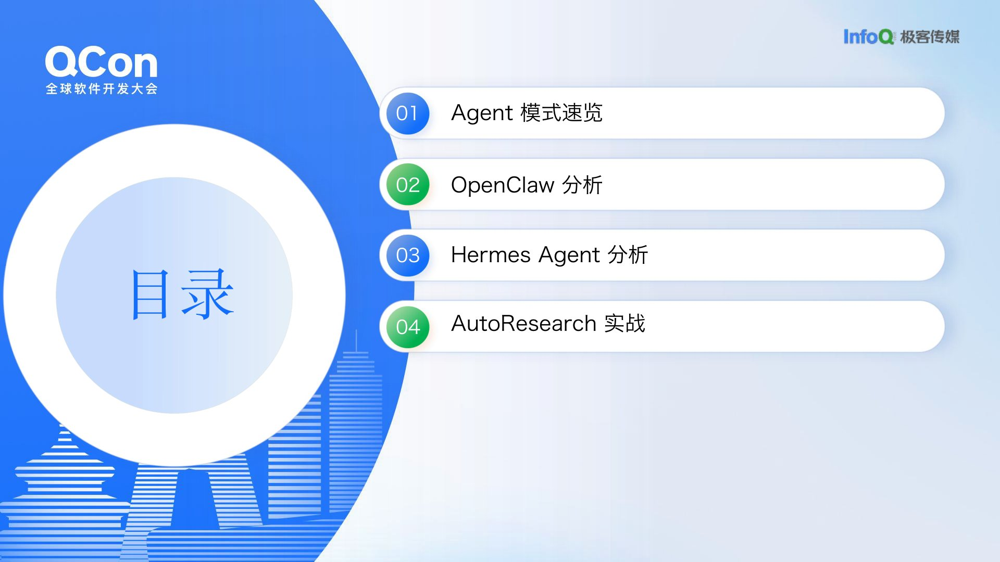

---

## 01 Agent 模式速览


### 明星产品 Agent 的实现有啥套路？

Agent Loop 不就是下面的代码吗？为啥我们做出的智能体远达不及明星产品（CC、OpenClaw 等）？

**核心模式**：所有 AI 编程 Agent 共享同一个循环：调用模型、执行工具、回传结果。生产级系统会在其上叠加策略、权限和生命周期层。

```python
# agent_loop.py
while True:
    response = client.messages.create(messages=messages, tools=tools)
    if response.stop_reason != "tool_use":
        break
    for tool_call in response.content:
        result = execute_tool(tool_call.name, tool_call.input)
        messages.append(result)
```

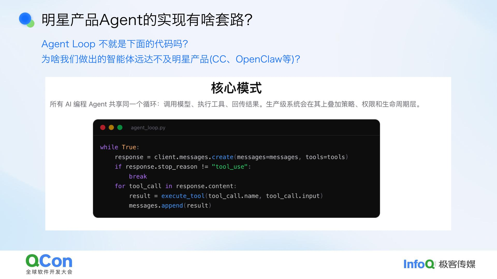

### 建造明星产品的基础

建造明星产品需要五大基础（齿轮图）：

| 序号 | 要素 | 说明 |
|---|---|---|
| 01 | **LLMs** | 根据场景选择最合适的 LLM |
| 02 | **Tools** | 在最简单的 Agent Loop 上（发动机）堆砌复杂的产品（豪华跑车） |
| 03 | **Memory** | 上下文（内存）管理 |
| 04 | **架构模式** | 选择合适的架构模式，在 Agent Loop 上层层构建 |
| 05 | **RAG** | 用最有效的资料生成最精确的、最全面的结果 |

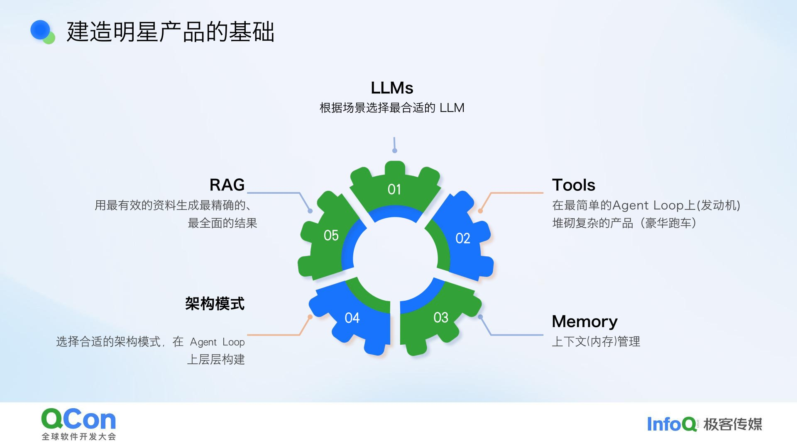

### RAG 模式

RAG（检索增强生成）通过从外部数据源获取数据来增强 LLM 的输出。

- **朴素 RAG**：基本方法包括文档分块、索引、基于语义相似性的检索和生成。
- **高级 RAG**：通过检索前技术（查询重写、分解）和检索后步骤（重新排序、摘要）提高检索精度。
- **模块化 RAG**：一种灵活的、专门化的架构，它将流程分解为功能组件（搜索、检索、生成），这些组件可以进行定制和重新排列，例如在专门的引擎中。
- **混合 RAG**：结合密集检索（向量搜索）和稀疏检索（关键词搜索），以确保语义理解和精确的关键词匹配。
- **图 RAG**：利用知识图谱结构化实体关系，支持多跳推理和全局信息聚合。
- **纠正性 RAG（CRAG）**：集成自我验证机制，对检索到的文档进行批判，如果信息不可靠，则触发重新评估或替代搜索。
- **Agentic RAG**：使用自主代理进行规划、选择工具、迭代推理和解决复杂的多跳查询。
- **上下文 RAG**：利用聊天历史和对话状态来改进检索，解决对话式 AI 中的"上下文盲点"问题。
- **HyDE（假设文档嵌入）**：LLM 生成查询的合成假设答案，然后将其用于语义搜索以查找真实的相似文档。

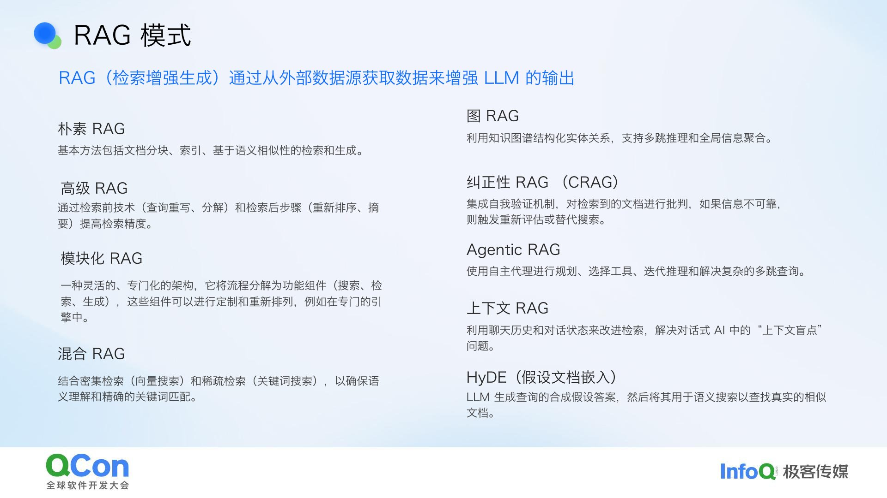

### Agent 架构模式（降龙十八掌）

#### 第一部分：基础增强模式

| 序号 | 模式名称 (Architecture) | 核心概念 (Core Concept) | 核心驱动力 | 业务 | 常见的坑（外部知识补充） |
|---|---|---|---|---|---|
| 1 | 反思 (Reflection) | 从单次生成转变为深思熟虑的多步推理，通过批判和改进自身工作来提升质量。 | 输出质量 | 提升单次任务精度 | 容易陷入无限修改循环；多次反思会成倍增加 Token 消耗。 |
| 2 | 工具使用 (Tool Use) | 赋予智能体调用外部 API 和函数的能力，克服知识截止限制并与现实世界交互。 | 外部扩展性 | 跨系统自动化 | 模型可能幻觉出不存在的工具名称或参数；外部 API 不稳定导致任务失败。 |
| 3 | 编程式工具调用 (PTC) | 允许智能体在代码沙箱中编排工具并处理中间结果，仅将最终输出返回给上下文。 | 上下文与计算优化 | 海量数据批处理与复杂逻辑编排 | 代码沙箱可能面临安全逃逸风险；模型生成的代码可能存在逻辑错误；中间状态黑盒化导致调试困难。 |
| 4 | ReAct（推理与行动） | 在自适应循环中动态交替进行推理（思考）和行动（工具使用），解决复杂的多步问题。 | 自适应逻辑 | 多步复杂调研 | 推理链条容易断裂；面对错误反馈时可能卡在死循环中重复相同动作。 |
| 5 | 规划 (Planning) | 在执行前主动将复杂任务分解为详细的、分步的计划，确保结构化和可追踪的工作流。 | 过程可追溯 | 预测性流程管理 | 初始计划过于死板，在执行中遇到意外变化时缺乏动态调整的灵活性。 |

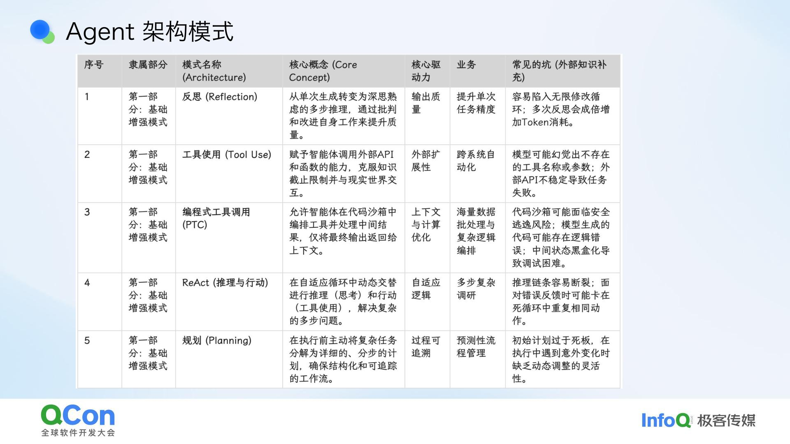

#### 第二部分：多智能体协作

| 序号 | 模式名称 (Architecture) | 核心概念 (Core Concept) | 核心驱动力 | 业务 | 常见的坑（外部知识补充） |
|---|---|---|---|---|---|
| 6 | 多智能体系统 (Multi-Agent Systems) | 由专业智能体组成的团队协同解决问题，通过分工合作在输出中实现极高的深度和质量。 | 专家分工 | 企业级协作流水线 | 智能体之间的通信成本高；可能因为目标不一致导致输出偏离主题。 |
| 7 | 黑板系统 (Blackboard Systems) | 灵活的多智能体系统，智能体在动态控制器引导下，通过共享的中央记忆（黑板）进行协作。 | 环境感知 | 动态诊断、物联网调度 | 共享记忆区的数据可能发生冲突或被错误覆盖；难以维持全局一致性。 |
| 8 | 元控制器 (Meta-Controller) | 作为一个监督智能体，分析传入的任务并将其路由到专家池中最合适的专业子智能体。 | 任务分流 | 企业多功能服务中台 | 元控制器成为性能瓶颈（单点故障）；路由判断失误会导致整个任务失败。 |
| 9 | 集成模式 (Ensemble) | 多个独立智能体并行分析问题，最终由"聚合器"智能体综合输出，得出更稳健结论。 | 鲁棒性/去偏 | 关键决策支持 | 消耗资源极大（多次并发 API 调用）；聚合器在面对分歧极大的观点时难以得出有效结论。 |

#### 第三部分：高级记忆与推理

| 序号 | 模式名称 (Architecture) | 核心概念 (Core Concept) | 核心驱动力 | 业务 | 常见的坑（外部知识补充） |
|---|---|---|---|---|---|
| **10** | 情景与语义双重记忆 (Episodic + Semantic) | 结合记录过去对话的向量存储和存储结构化事实的图数据库，打造类人的强大记忆系统。 | 长期个性化 | 私人专业导师/顾问 | 记忆检索的准确率难以保证；旧有的矛盾信息可能污染新推理。 |
| 11 | 思维树 (Tree of Thoughts, ToT) | 在树状结构中探索多条推理路径，系统性评估并修剪分支，从而找到最佳解决方案。 | 深度逻辑探索 | 尖端科研、复杂博弈 | 极高的时间延迟和 Token 成本；评估分支质量的启发式方法难以设计。 |
| 12 | 图谱与世界模型记忆 (Graph / World-Model) | 将知识存储为结构化图谱，通过遍历连接进行复杂的多跳推理。 | 关联推理 | 商业情报、知识图谱分析 | 知识图谱的构建和更新成本高昂；关系提取常常存在噪音和错误。 |

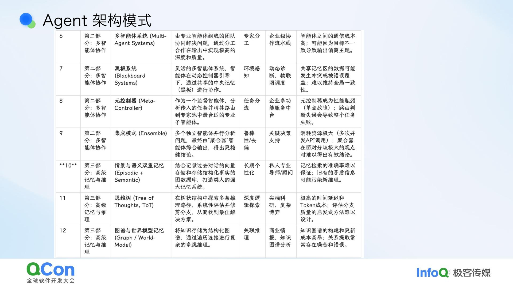

#### 第四部分：安全性与现实交互

| 序号 | 模式名称 (Architecture) | 核心概念 (Core Concept) | 核心驱动力 | 业务 | 常见的坑（外部知识补充） |
|---|---|---|---|---|---|
| 13 | PEV（计划、执行、验证） | 高度稳健的自我纠错循环，由"验证者"智能体检查每次行动结果，实现错误检测与恢复。 | 零失误容忍 | 财务审计、合规操作 | "验证者"自身可能产生幻觉，错误地否决正确的执行结果或放过错误。 |
| 14 | 心理循环/模拟器 (Mental Loop/Simulator) | 智能体在采取实际行动前，先在内部心智模型中测试行动，以预测结果并评估风险。 | 风险预判 | 交易策略、安全关键系统 | 内部"模拟器"的准确度通常受限，无法完美反映复杂的真实世界动态。 |
| 15 | 演练测试台 (Dry-Run Harness) | 安全关键模式，智能体提议的行动首先被模拟试运行，必须经过批准后才能真实执行。 | 安全红线 | 敏感系统发布控制 | 如果过度依赖人类批准，会丧失自动化系统的效率优势，造成流程阻塞。 |
| 16 | 反思性元认知 (Reflexive Metacognitive) | 拥有"自我模型"的智能体，能推理自身能力与局限，自主决定行动、使用工具或升级交由人类处理。 | 边界意识 | 医疗、法律高风险咨询 | 可能陷入过度自我怀疑，导致频繁将简单任务抛给人类，降低系统自主性。 |

#### 第五部分：学习与适应

| 序号 | 模式名称 (Architecture) | 核心概念 (Core Concept) | 核心驱动力 | 业务 | 常见的坑（外部知识补充） |
|---|---|---|---|---|---|
| 17 | RLHF / 自我改进 (Self-Improvement) | 智能体输出受到批评并利用反馈迭代修改，保存高质量输出以提升未来表现。 | 自我进化 | 持续优化的内容工厂 | 模型可能过度迎合批评智能体的特定偏好（奖励作弊），导致输出风格单一。 |
| 18 | 元胞自动机 (Cellular Automata) | 通过多个简单的、基于网格的去中心化智能体的局部交互，涌现出复杂的全局行为。 | 群体涌现 | 物流模拟、空间分析 | 全局行为极其难以预测和控制；难以针对特定业务目标进行精准调试。 |

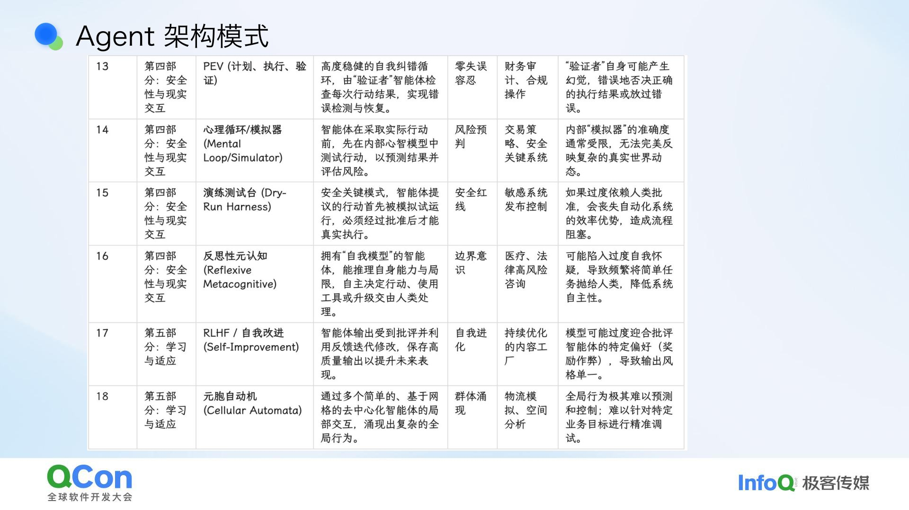

### Memory 管理模式

| 序号 | 内存优化方法 | 核心概念与原理 | 适用场景与优势 |
|---|---|---|---|
| 1 | 顺序优化 (Sequential Approach) | 最基础的按发生顺序记录和存储历史对话上下文的方法。 | 适用场景：简单的、短生命周期的聊天机器人。优势：最容易实现，能满足基础任务需求。 |
| 2 | 滑动窗口 (Sliding Window Approach) | 限制智能体的记忆范围，仅保留最近特定数量（如窗口大小设为 2）的交互记录作为上下文。 | 适用场景：简单的短期机器人。优势：易于实现，能有效防止上下文超出 Token 限制。 |
| 3 | 基于摘要的优化 (Summarization Based Optimization) | 对之前的对话内容进行总结，用简短的摘要替代冗长的原始对话历史。 | 适用场景：长时间、富有创造性的对话。优势：能够在不产生大规模 Token 开销的情况下，保持对话的整体连贯性和上下文流向。 |
| 4 | 基于检索的内存 (Retrieval Based Memory) | 利用内存向量数据库（如 FAiSS）将信息转化为嵌入向量，通过高效的相似性搜索来检索相关记忆。 | 适用场景：需要精确、长期回忆的智能体。优势：这是目前的行业标准，功能强大且可扩展，是大多数 RAG（检索增强生成）应用的基础。 |
| 5 | 内存增强型架构 (Memory Augmented Transformers) | 引入额外的 LLM 调用来从对话中提取和保存关键事实。虽然成本较高，但能保留核心状态。 | 适用场景：高可靠性的个人助手。优势：能够将关键事实与日常闲聊剥离开来，在漫长且不断发展的对话中可靠地保留关键信息。 |
| 6 | 面向多任务的层次化优化 (Hierarchical Optimization) | 模拟人类思维，为不同的目标和用途构建不同类型的、分层的内存系统。 | 适用场景：高可靠性助手及复杂规划任务。优势：在极端有效地减少 Token 数量的同时，完美保留任务的核心事实与逻辑。 |
| 7 | 基于图的优化 (Graph Based Optimization) | 利用图数据结构（如 NetworkX 库）创建和管理知识图谱，将记忆存储为节点和实体关系。 | 适用场景：专家系统和知识库。优势：在推理数据点之间复杂关系的能力上具有无与伦比的优势。 |
| 8 | 压缩与整合内存 (Compression & Consolidation Memory) | 运用高级策略对存储的记忆进行持续的压缩和信息整合，消除冗余。 | 适用场景：需要长期运行且记忆不断累积的复杂智能体系统。 |
| 9 | 类 OS（操作系统）内存管理 (OS-Like Memory Management) | 借鉴计算机操作系统的内存管理理念：将 LLM 的上下文窗口视为 RAM（速度极快但容量有限，用于活跃程序），将外部数据库/文件视为硬盘（容量大、成本低但速度较慢，用于长期存储）。 | 适用场景：大规模智能体系统。优势：能在保持活跃上下文（RAM）小且快的同时，为智能体提供几乎无限的记忆容量。 |

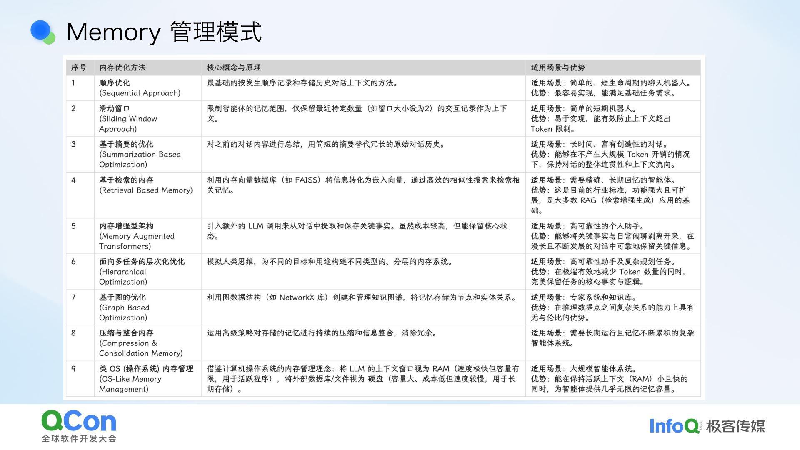

---

## 02 OpenClaw 分析

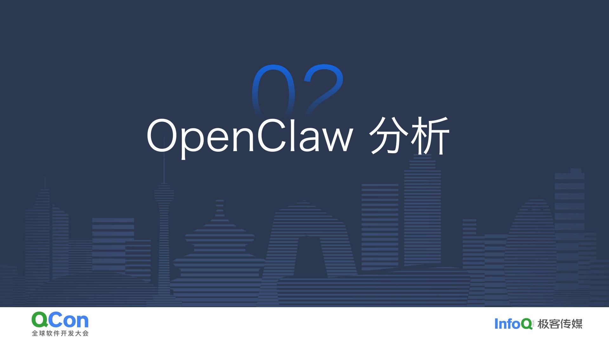

### Tool Use 模式

**模式概念**：Tool Use（工具调用）是 Agent Loop 中模型与外部世界交互的核心机制。当模型判断需要执行操作（读写文件、运行命令、搜索网页等）时，生成结构化的 `tool_call` 请求，由运行时调度执行并将结果注入对话上下文，形成 **调用 → 执行 → 观测** 的闭环。

**工具类型**：

| 类别 | 示例 | 来源 |
|---|---|---|
| 核心工具 | read, write, edit, exec, apply_patch | `createOpenClawCodingTools()` 内建 |
| 网络工具 | web_search, web_fetch | `src/agents/tools/web-tools.ts` |
| 消息工具 | message | `src/agents/tools/message-tool.ts` |
| 媒体工具 | image_generate, video_generate, music_generate, pdf | `src/agents/tools/` |
| 会话工具 | sessions_spawn, sessions_send, sessions_list, sessions_yield | `src/agents/tools/` |
| 定时工具 | cron | `src/agents/tools/cron-tool.ts` |
| MCP 工具 | 运行时从 MCP 服务器动态物化 | `materializeBundleMcpToolsForRun()` |
| Skill 工具 | 模型通过 Skill 工具按需加载 | `src/agents/skills/` |
| 网关工具 | plugin.approval.request | `src/agents/tools/gateway.ts` |

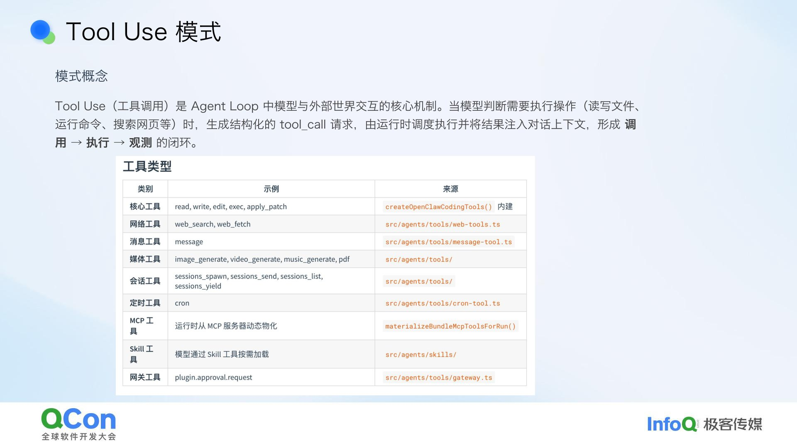

### ReAct 模式

**模式概念**：ReAct（Reasoning + Acting）是一种将 **推理** 与 **行动** 交织的 Agent 执行范式，由 Yao et al. (2023) 提出。OpenClaw 在其嵌入式 Agent 运行时中实现了完整的 ReAct 循环，核心特征是：

> **思考 → 行动 → 观察 → 再思考，直至产出最终答案**

**三阶段循环**：

| 阶段 | 机制 | 实现 |
|---|---|---|
| Reasoning | 模型在隐藏标签内进行内部推理 | `...` 标签对，内容不暴露给用户 |
| Acting | 模型调用工具执行操作 | `createOpenClawCodingTools()` 注册工具（read/write/bash/exec/web_search/message 等） |
| Observing | 工具结果注入上下文 | `SessionManager` 管理 tool_response 消息，经 `wrapStreamFnSanitizeMalformedToolCalls()` 清洗 |

**循环终止条件**：

1. **自然终止**：模型返回的 response 中不再包含 tool_call，仅产出 `<final>` 文本
2. **循环检测**（`src/agents/tool-loop-detection.ts`）：四级递进防护
   - `generic_repeat`：连续相同工具调用（阈值 10 → warning）
   - `pang_pong`：两个工具交替反复
   - `known_poll_no_progress`：轮询型工具无进展
   - `global_circuit_breaker`：全局硬上限（阈值 30 → critical，强制中断）
3. **上下文溢出**：`installToolResultContextGuard()` 依据 `contextWindowTokens` 截断

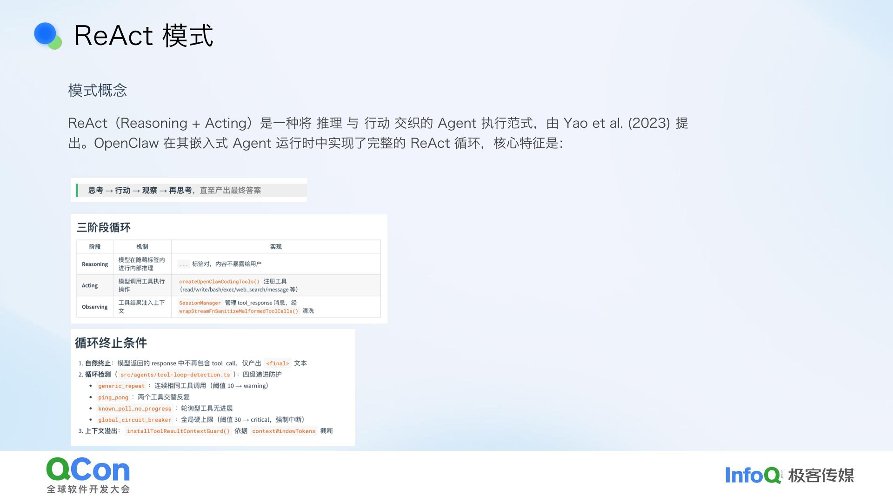

### 多智能体模式

**核心概念**：OpenClaw 采用多智能体 + 层级式多智能体架构：

- **多智能体**：并列的顶级智能体
- **层级式**：主 Agent 按需生成专用子智能体，子智能体可继续嵌套生成，形成有深度的智能体树。

```
        主 Agent
        /     \
   子Agent₁  子Agent₂
     |         |
  子Agent₃   子Agent₄
```

**五种多智能体协调模式（ANTHROPIC CLAUDE 博客）**：

1. **生成器-验证器模式**：输入 → 生成智能体 → 验证智能体 → 输出（最终输出可回流迭代）。关键词：生成 / 验证 / 迭代（input、output、feedback）；快速生成、质量把关、明确标准。
   → *增加角色专精*
2. **编排器-子智能体模式**：编排器（主理协调）向下分派给多个子智能体（独立子任务）。关键词：集中控制 / 任务分解 / 分派；主理协调、独立子任务、线性执行。
   → *平行团队协作*
3. **智能体团队模式**：规划智能体 ↔ 代码智能体 ↔ 测试智能体 ↔ 文档智能体，全互联协作。关键词：角色专精（交叉职能）/ 平行工作（长生命周期）/ 持久（共享上下文）。
   → *异步可扩展*
4. **消息总线模式**：发布者 A/C 与订阅者 B/D 挂在消息总线上。关键词：异步 / 发布-订阅 / 解耦（类型词、发布订阅、分实训程）；事件驱动、动态扩展、灵活接入。
   → *分布式共享知识*
5. **共享状态模式**：多个智能体对共享知识库进行读/写。关键词：去中心化 / 共同知识 / 实时（类型词、共同知识库、在线知识）；唯一事实来源、集体智慧、高并发。

资料来源：claude.com/blog

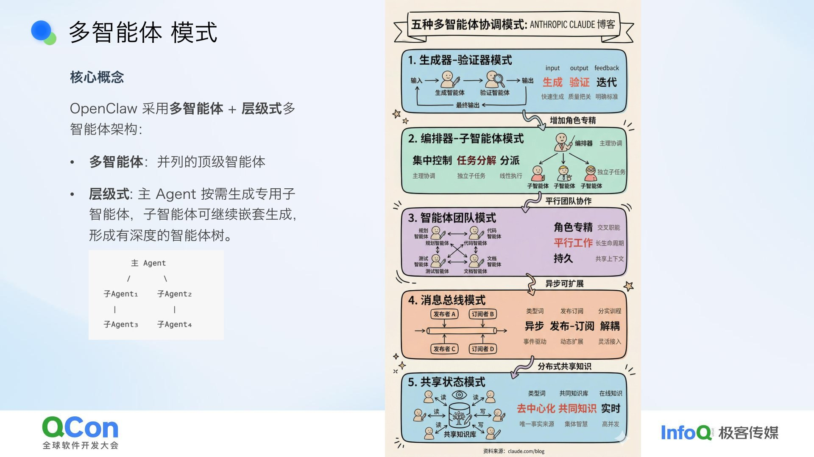

### 双循环架构模式

**核心思想**：将 Agent 运行时拆分为外层循环（错误恢复）和内层循环（推理执行），实现关注点分离：

- **内层**专注对话流程
- **外层**专注系统韧性

**内层循环 · attempt.ts** —— 职责：单次对话 Turn 的完整推理流程

```
┌─────────────────────────────────────────┐
│         Inner Loop (attempt.ts)         │
│                                         │
│  for each turn:                         │
│    ① 加载黑板内容 & 记忆                 │
│    ② 构建 Prompt                        │
│    ③ 流式推理（模型响应）                │
│    ④ 提取工具调用                        │
│    ⑤ 执行工具                           │
│    ⑥ 工具结果追加到消息                  │
│    ⑦ 循环检测                           │
│    → 返回 EmbeddedRunAttemptResult      │
└─────────────────────────────────────────┘
```

每 Turn 的执行流：**Prompt 构建 → 模型推理 → 工具调用 → 结果处理**

循环检测阈值：

| 级别 | 阈值 | 动作 |
|---|---|---|
| 警告 | 10 次工具循环 | 记录警告 |
| 严重 | 20 次工具循环 | 强制提示改进 |
| 熔断 | 30 次工具循环 | 强制停止 |

**外层循环 · run.ts** —— 职责：会话级错误恢复与故障转移

```
┌────────────────────────────────────────────┐
│           Outer Loop (run.ts)              │
│                                            │
│  while (runLoopIterations < MAX_ITERATIONS) { │
│    result = innerLoop(attempt)             │
│    if (可恢复错误)  → 修复 + 重试           │
│    if (不可恢复)    → 返回结果              │
│  }                                         │
└────────────────────────────────────────────┘
```

处理的错误类型：

| 错误 | 恢复策略 |
|---|---|
| 429 限流 | 认证配置轮转 |
| 401/403 认证失败 | 标记失效，切换配置 |
| 500/503 服务不可用 | 模型回退（降级到备用模型） |
| 上下文溢出 | 触发自动压缩后重试 |
| 系统过载 | 指数退避重试 |

**设计优势**：

| 优势 | 说明 |
|---|---|
| 关注点分离 | 推理逻辑与错误恢复完全解耦，内层代码简洁清晰 |
| 渐进式容错 | 从最轻量的恢复手段开始，逐级升级，避免过度降级 |
| 状态解耦 | 内层只关心 Turn 级状态，外层维护完整的故障恢复状态机 |
| 防止死循环 | 外层迭代上限 + 内层熔断器，双重保障 |

**OpenClaw Agent 双循环架构（流程图文字）**：消息到达 → 外层循环（run.ts）— 错误恢复 → 内层循环（attempt.ts）— 推理执行（构建 Prompt → 模型推理 → 工具调用 → 结果处理，循环检测：10 次警告 → 20 次阻断 → 30 次熔断）→ 错误检查 → 按错误类型分支处理并重试：认证轮转（429 限流 / 401 认证）、上下文压缩（上下文溢出）、模型回退（500/503 服务不可用）→ 成功则返回结果。迭代上限：`min(160, max(32, 24 + 配置数 × 8))`；渐进式容错优先级：认证轮转 → 上下文压缩 → 模型回退。

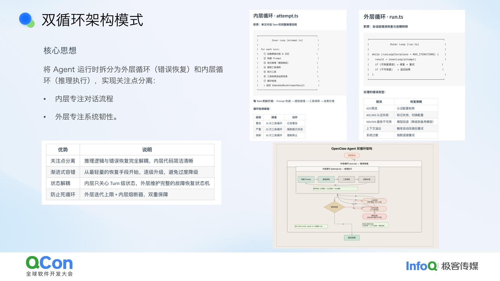

### Memory 管理模式 - 内置

OpenClaw 内置记忆管理架构（架构图文字整理）：

- **主链路**：User（Human Input）→ Gateway（Startup memory init）↔ Agent Loop（Conversation Runtime，LLM + Tool Calling）→ Memory Tools（`memory_search` / `memory_get`，provided by Memory Plugin Slot）→ Memory Search Manager（Orchestration + Fallback，IndexManager | QMD auto-fallback）。
- **Memory Flush**：auto-compaction（自动压缩）。
- **Context Injection**：System prompt enrichment（系统提示词增强），向 Agent Loop 注入 enriched context。
- **Slot: `memory.backend`（pick one）**：builtin (SQLite) / QMD。
- **Embedding Providers**：OpenAI / Gemini / Voyage / Mistral · Ollama / Local (GGUF)。
- **Slot: `plugins.slots.memory` — Active Memory（pick one）**：`memory-core`（bundled default · Dreaming · hybrid search）；3rd party plugins（pick one）：lancedb / mem0 / honcho。
- **Slot: `plugins.slots.contextEngine`（pick one）**：legacy（default）/ lossless-claw（3rd party，`@martian-engineering/lossless-claw`）。
- **Memory Files（Always-on，source of truth）**：`MEMORY.md`（Curated long-term）、`YYYY-MM-DD.md`（Daily append-only logs）。
- **索引链路**：Memory Files → File Watcher（Debounced 1.5s detection）→ Index Update（Chunk + Embed + Store）。
- **Hybrid Search Pipeline**：Vector Search（Cosine similarity）+ BM25 Search（Keyword FTS5）→ Score Merge（weighted: vec + text）→ Temporal Decay（30-day half-life recency）→ MMR Re-ranking（Diversity dedup）→ Citations + Top-K。
- **Dreaming（Experimental，in memory-core）**：`dreaming.enabled` · default: off · cron: `0 3 * * *`。Light（Sort & stage）→ REM（Reflect themes）→ Deep（Score & promote）；产物：`DREAMS.md`、`memory/.dreams/`、→ `MEMORY.md`。
- **Memory Wiki（Bundled Plugin）**：Parallel knowledge vault — does NOT replace active memory plugin。三种模式：isolated（self-contained）/ bridge（reads active plugin）/ unsafe-local（experimental）；接口：`wiki_search` / `wiki_get` / `wiki_apply` / `wiki_lint` · entities/ concepts/ syntheses/。
- **图例（Legend）**：Plugin Slot (exclusive) / Core Engine / Always-on Storage / Embedding / Index Pipeline / Context Engine / Flush · Write / Dreaming / Memory Wiki；Context Injection Flow / Memory Write Path / Dreaming Promotion。Slots are independent — combine freely。

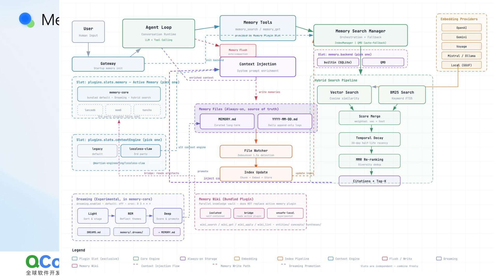

---

## 03 Hermes 模式

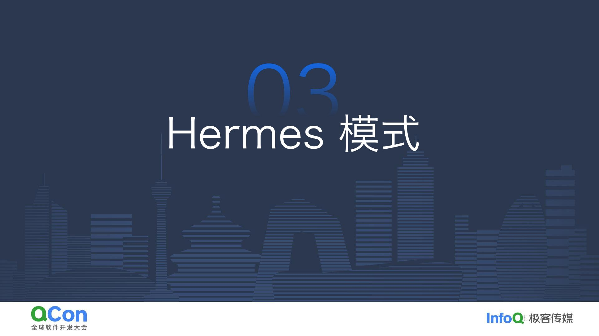

### Tool Use 模式

**Hermes 围绕"让 Agent 自己更强大"——能学、能问、能搜、能委派；OpenClaw 围绕"让平台更健壮"——多平台安全、类型严格、开发者友好。**

**【工具系统】Agent 的手**

- **自注册机制**：每个 `.py` 文件调用 `registry.register()`，启动时 `importlib` 自动发现
- **工具集粒度控制**：`enabled_toolsets` / `disabled_toolsets` 按任务场景组装工具包
- **运行时自适应**：`check_fn()` 动态检查可用性，`coerce_tool_args()` 自动修复 LLM 参数类型
- **澄清工具**：`clarify()` — Agent 主动向用户提问，结构化多选交互

> OpenClaw：工具是平台管道节点，全局注册 + `toolAllowlist` 白名单，无语义分组

**【技能系统】Agent 的程序性记忆**

- **运行时动态创建技能**：Agent 完成复杂任务后，主动将成功经验沉淀为可复用技能
  - `skill_manage(create)` — 创建新技能，写入 SKILL.md + 子目录
  - `skill_manage(edit/patch)` — 编辑、修补已有技能内容
  - `skill_manage(write_file/remove_file)` — 添加或删除引用文件（references/templates/scripts）
  - `skill_manage(delete)` — 删除不再需要的技能
  - 后续遇到同类任务 → `skill_view()` 加载完整步骤，直接复用
- **渐进式披露**：4 层 token 节约
  - `skills_categories()` → 几十个 token
  - `skills_list()` → 几百个 token
  - `skill_view()` → 几千个 token
  - `skill_view(file_path)` → 按需加载子文件
- **安全扫描**：`skills_guard` 检测 prompt 注入模式

> OpenClaw：插件是平台能力扩展，开发者部署 TypeScript 代码，Agent 只能使用不能创建；工具 schema 一次性全量注入，无分层加载

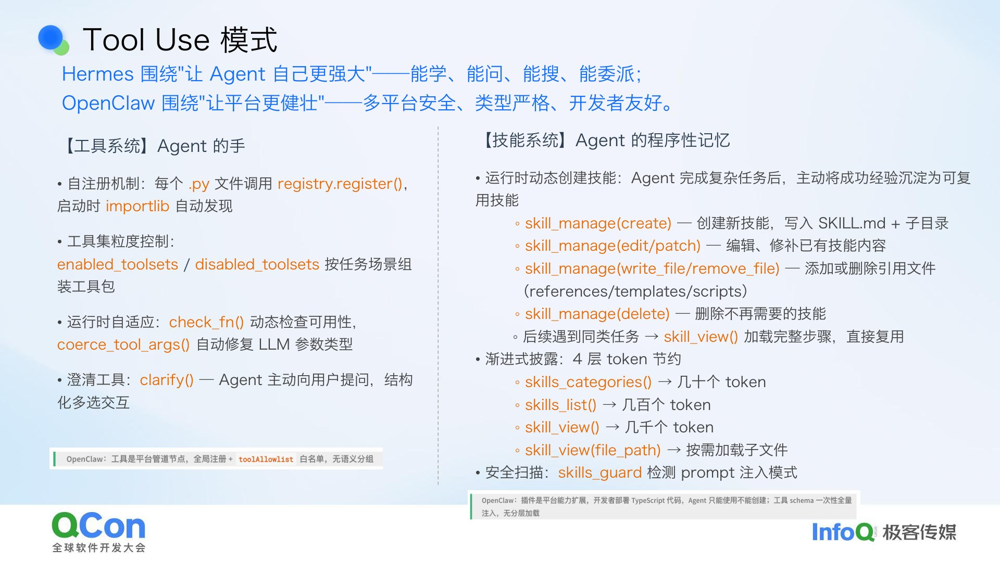

### Agent Loop 模式

两者都有完整的容错能力（认证轮转、模型回退、上下文压缩）：

- **Hermes** 把容错内嵌在**单循环**中用 continue 无缝恢复：Hermes 额外多了 per-turn 主模型恢复和 LLM 参数自动修复
- **OpenClaw** 把容错抽到**外层循环**重新调用内层：OpenClaw 额外多了循环检测器和 thinking 降级。

**【核心差异】**

| | Hermes | OpenClaw |
|---|---|---|
| 架构 | 单循环内嵌容错 | 双循环分离容错 |
| 错误恢复 | 同一循环内 `continue`，无缝重试 | 外层循环捕获，重新调用内层 |
| 认证策略 | 4 种轮转策略，1h 冷却 | profile 顺序轮转 + cooldown |
| 压缩时机 | 阈值触发（预防性）+ 溢出触发 | 主要溢出后被动触发 |
| 主模型恢复 | 每轮自动恢复（turn-scoped fallback） | 无等价机制，fallback 后持续使用 |
| 循环检测 | 无 | 4 种检测器（默认关闭） |
| 代码量 | ~350 行循环 + ~800 行分类器 | ~1800 行外层 + ~2400 行内层 |

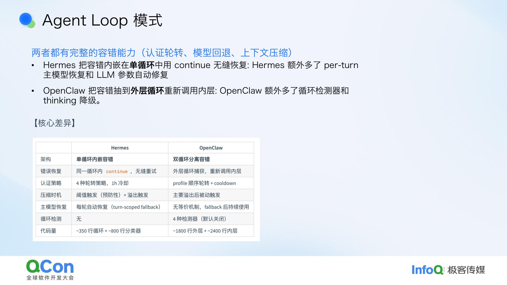

### ReAct 模式

- **Hermes** 对所有 provider 统一保留推理内容用于上下文回放，Hermes 的 Agent 在后续 turn 中能看到之前的推理过程。
- **OpenClaw** 只对 Anthropic 保留推理，其他 provider 的推理在会话历史中被丢弃，OpenClaw 的 Agent（非 Anthropic）会丢失这部分上下文。

**【核心差异】**

| | Hermes | OpenClaw |
|---|---|---|
| 推理保留 | **所有 provider 都保留推理内容到会话历史** | Anthropic 保留；其他 provider 丢弃 |
| 用户输出 | 推理可实时显示给用户 | 推理标签始终剥离，用户只看 `<final>` |
| 推理断裂 | incomplete scratchpad 检测 + 重试 | 无等价机制 |
| Provider 兼容 | 多路径提取兼容 5+ 种格式 | Anthropic 结构化 thinking + 其他 provider 标签剥离 |
| 推理深度 | 按模型前缀自动判断 | ThinkLevel 配置 + 不支持时降级 |

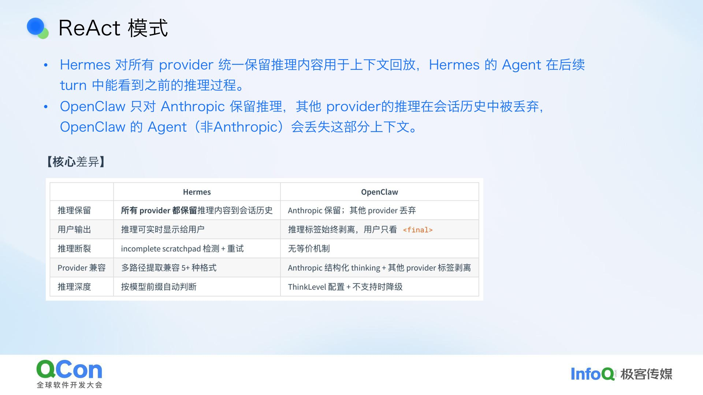

### LLM Wiki

**【核心差异】** Hermes 记忆架构（架构图文字整理）：

- **主链路**：User（Human Input）→ Agent Loop（Conversation Runtime，LLM + Tool Calling）→ Memory Tools（`memory` / `session_search` + provider-specific tools）→ Memory Manager（Orchestrator + Fallback，Builtin + one external provider）。
- **Security Scanning**：Injection · exfiltration · invisible chars；作用于 Memory writes + context files。
- **Memory Sync**（`sync_turn`）与 **Context Injection**（`<memory-context>` fencing）：向 Agent Loop 注入 enriched context（activate / recall）。
- **Slot: `memory.provider`（pick one）**：builtin（`MEMORY.md` + `USER.md`）；external providers（pick one，`plugins/memory/`）：honcho / openviking / mem0 / hindsight / holographic / retaindb / byterover / super-mem。
- **Slot: `context.engine`（pick one）**：compressor（default builtin）/ hermes-lcm（`plugins/context_engine/lcm`）；流程：`should_compress` → `compress` → `on_session_end`。
- **Memory Files（Always-on，frozen at session start）**：`MEMORY.md`（Agent notes，~2200 chars）、`USER.md`（User profile，~1375 chars）。
- **Session Search Pipeline**：FTS5 Search（SQLite state.db）→ Session Grouping（top-N unique sessions）→ LLM Summarize（Gemini Flash）。
- **Context Compression Pipeline**：Prune Tool Results → Protect Head + Tail → LLM Summarize Middle；Iterative Updates（Previous summary preserved across multiple compactions；~75% threshold trigger；~20% tail protection；auxiliary/cheap model）。
- **System Prompt Assembly（9 layers）**：
  1. Agent identity（`SOUL.md` / default）
  2. Memory usage guide（hardcoded rules）
  3. MEMORY snapshot（frozen from `MEMORY.md`）
  4. USER PROFILE snapshot（frozen from `USER.md`）
  5. Skills index（~80+ skills，~5000 chars）
  6. `AGENTS.md`（up to 20K，head 70% + tail 30%）
  7. Session metadata（time / model / provider）
  8. Platform hint（Telegram / Discord specific）
  9. Session context（source / group / delivery）

  Prefix-cache friendly — stable for entire session；Security scan: injection + exfiltration detection。
- **图例（Legend）**：Plugin Slot (exclusive) / Core Engine / Always-on Storage / Session Search / Context Engine / Prompt Assembly / Sync · Security；Context Injection Flow / Memory Write Path / Compression Flow。Built-in always active · External providers: pick one。

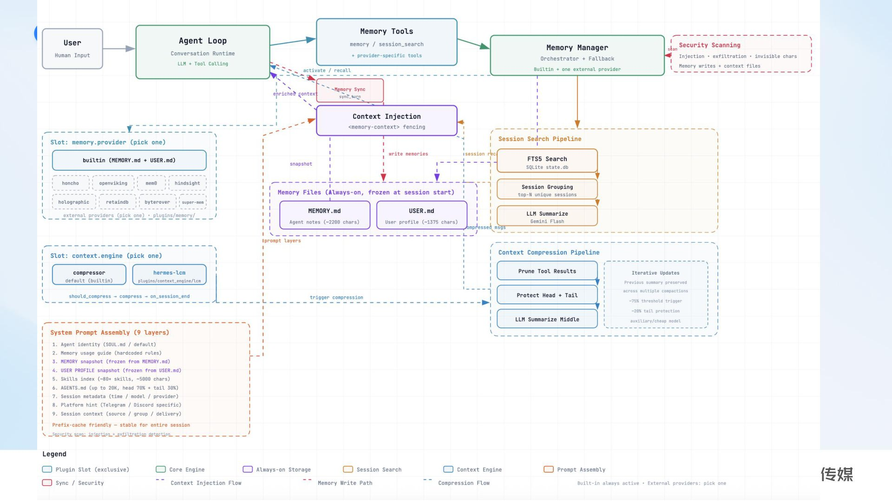

---

## 04 AutoResearch 实战

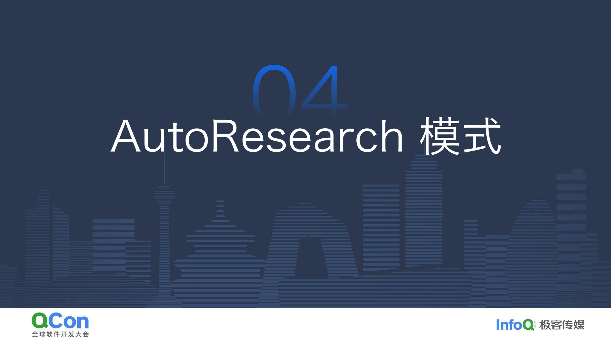

### AutoResearch 是什么？

自主完成「提假设 → 改代码 → 训练 → 评估 → 决策」的完整研究循环。

**核心架构 — 只有三件事**：

| 准备 | Agent 可改 | 人来写 |
|---|---|---|
| `prepare.py` | `train.py` | `program.md` |
| 数据 / Tokenizer / 评估 | 模型 / 优化器 / 训练 | 指令 / 约束 / 目标 |
| 🔒 固定不动 | ✏️ 唯一可编辑 | 👤 人类定义 |

**设计哲学**：

- **单文件约束** — Agent 只改 train.py，diff 可审查，爆炸半径可控
- **固定 5 分钟** — 每轮实验等时，公平比较，杜绝"跑得久 = 跑得好"
- **单一指标** — val_bpb（越低越好），没有多目标博弈
- **Git 即实验记录** — 好的 commit，差的 reset，git log = 完整研究轨迹

（右侧配图：AUTORESEARCH —— Modify Code → 5-Min Train on GPU → Evaluate 的自动循环，人在睡觉、AI 在做实验。）

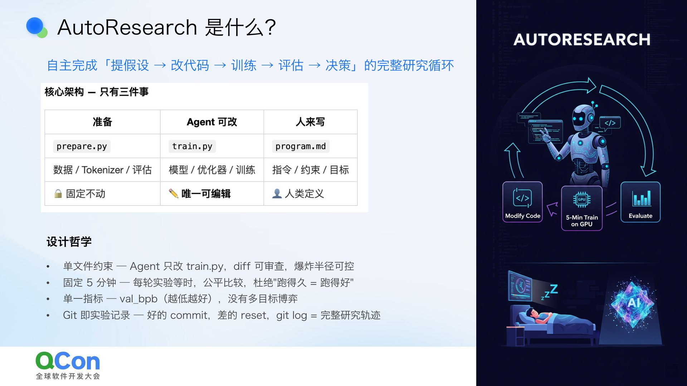

### AutoResearch 如何自主运行？

**研究循环 — 无限迭代，优胜劣汰，约束**：

```
观察历史 → 提出想法 → 改 train.py → 跑 5 分钟 → 量 val_bpb
   ↑                                                ↓
   |          好 → commit 保留                       |
   |          差 → git reset 回滚                    |
   |          挂 → 修 bug 或放弃                     |
   └────────────────────────────────────────────────┘
```

**为什么值得关注**：

- **最小可行 Agent 系统** — 3 个文件、1 个 GPU、1 个指标，即可运转
- **人机分工清晰** — 人定方向（program.md），机器执行试错（train.py）
- **可复现可审计** — 每一步实验都有 git commit，results.tsv 全记录
- **范式启发** — 证明了「AI 做实验」不是未来，是现在

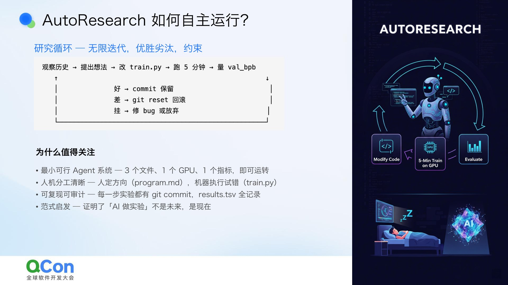

### AutoResearch for development 架构

**AutoResearch for Developing 系统架构（架构图文字整理）**：

- **人类** → `program.md`（人类定义的规则、目标、约束）
- → **Issue Selector**（优先级排序 + 复杂度评估 + 排除过滤）
- → **Agent Orchestrator（run.sh）— 使用 acpx 控制**
  - 奇数轮：Codex 审核 → Codex 实现 → 测试 → Claude 审核 → Claude 实现
  - 偶数轮：Claude 审核 → Claude 实现 → 测试 → Codex 审核 → Codex 实现
  - **迭代循环（最多 42 次）**：实现 → 测试 → 审核 → 反馈驱动 → 再实现（未达标则回到"实现"继续迭代）
  - **质量检查点**：测试通过 + 评分 ≥ 9.0 → 自动 commit + PR + 合并
- → `results.tsv` + `workflows/`（全量过程日志，可回溯可审计）

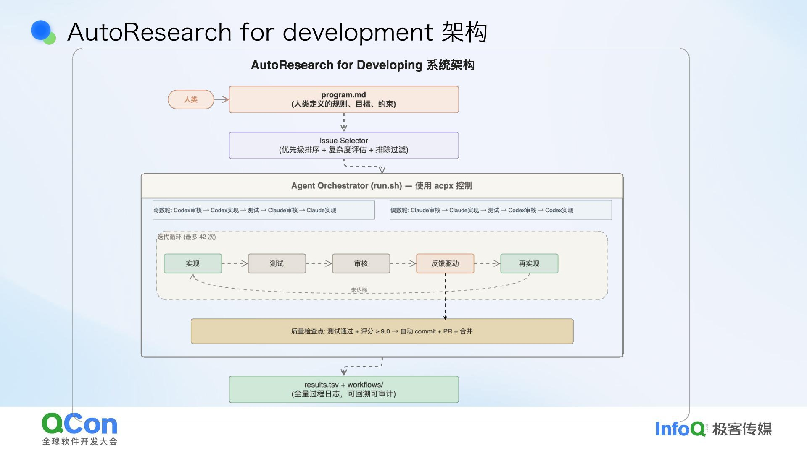

**六项原则**：

| # | 原则 | 说明 |
|---|---|---|
| 01 | `program.md` 即宪法 | 所有规则、约束、代码规范都在此定义，Agent 不越权 |
| 02 | 多 Agent 对抗 | Codex 和 Claude 轮流担任实现者和审核者，交叉验证 |
| 03 | 量化门槛 | 评分 ≥ 9.0/10 才算通过（5 维度加权），主观判断最小化 |
| 04 | 反馈驱动 | 审核反馈直接传入下一轮迭代，持续改进直到达标 |
| 05 | 独立评分 | 实现 Agent 和审核 Agent 分离，避免"自己改自己评" |
| 06 | 全量可审计 | 每次迭代、每次审核、每次测试结果都记录在 `workflows/` |

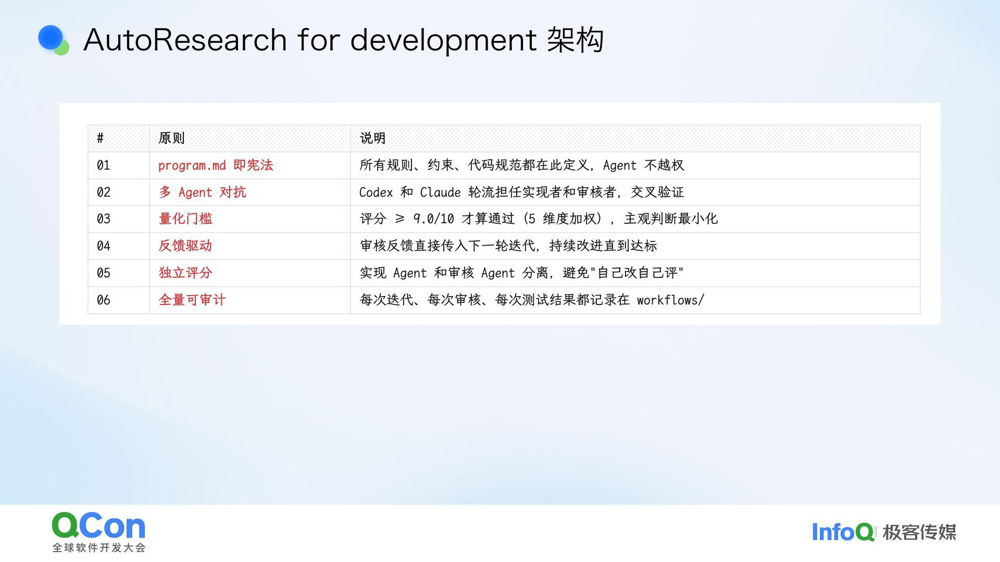

### AutoResearch 思想实践

**回放**：https://asciinema.org/a/896260（附二维码）

终端实录（以 issue #21「feat: enhance job execution with agent selection and timeout」为例）：

```
[2026-04-03 17:38:12] Git remote: git@github.com:smallnest/imclaw.git
[2026-04-03 17:38:12] 检查依赖...
[2026-04-03 17:38:12] 依赖检查通过
[2026-04-03 17:38:12] 获取 Issue #21 信息...
[2026-04-03 17:38:13] Issue 标题: feat: enhance job execution with agent selection and timeout
[2026-04-03 17:38:13] 工作目录: /Users/chaoyuepan/ai/imclaw/.autoresearch/workflows/issue-21
[2026-04-03 17:38:13] 准备 acpx session...
[2026-04-03 17:38:13] 关闭旧 session...
[2026-04-03 17:38:15] 创建 codex session...
[acpx] created session cwd (019d52b5-283f-7682-acfb-39d135e8c3bc)
[acpx] agent: codex
[acpx] cwd: /Users/chaoyuepan/ai/imclaw
[2026-04-03 17:38:17] 创建 claude session...
[acpx] created session cwd (b94a61a7-c30e-451f-a778-4282d30fbfb7)
[acpx] agent: claude
[2026-04-03 17:38:26] acpx session 准备完成
[2026-04-03 17:38:26] 创建分支: feature/issue-21
Switched to a new branch 'feature/issue-21'
[2026-04-03 17:38:26] ========================================
[2026-04-03 17:38:26] 迭代 1/42
[2026-04-03 17:38:26] 本轮: Codex 实现 → Claude 审核
[2026-04-03 17:38:26] ========================================
[2026-04-03 17:38:26] 迭代 1: Codex 实现...
[2026-04-03 17:38:26] 使用指令文件: /Users/chaoyuepan/ai/imclaw/docs/autoresearch/agents/codex.md
[2026-04-03 17:38:26] 调用 codex (尝试 1/3)...
[acpx] session cwd (019d52b5-283f-7682-acfb-39d135e8c3bc) · /Users/chaoyuepan/ai/imclaw · agent needs reconnect
[client] initialize (running)
[client] authenticate (running)
[client] session/new (running)
Model metadata for `qwen/qwen3.6-plus:free` not found. Defaulting to fallback metadata; this can degrade performance and cause issues.
```

右侧 GitHub 截图：issue **#21**「feat: enhance job execution with agent selection and timeout」已 Closed；关联 issue #10（feat: add background jobs and queued task execution）；smallnest 上周添加了 2 个引用该 issue 的 commit（`c54bbc0`、`5ddeee0`），并通过 PR **#26**「feat: feat: enhance job execution with agent selection and timeout (#21)」合并（Merge pull request #26 from smallnest/feature/issue-21，Verified `c509ca1`），smallnest 于上周在 #26 中将本 issue 关闭为 completed。

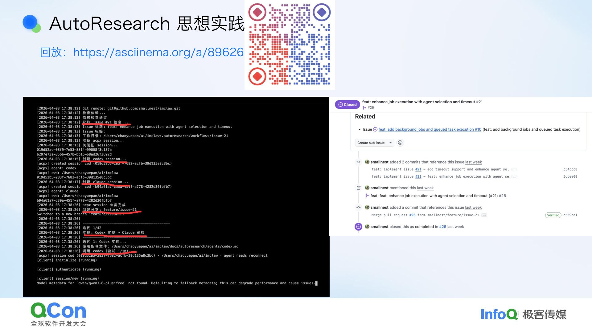

---

## 结语

**THANKS — 大模型正在重新定义软件（Large Language Model Is Redefining The Software）**


---

## 附录：大会信息（推广页）

**极客邦科技 2026 年会议规划** —— 促进软件开发及相关领域知识与创新的传播（附参会咨询二维码）：

| 时间 | 地点 | 规模 | 会议 | 会议时间 | 专题方向 |
|---|---|---|---|---|---|
| 6 月 | 上海 | 1000 人 | AiCon 全球人工智能开发与应用大会 | 6 月 26-27 日 | AI Infra 系统工程、多 Agent 协作与实践、多模态融合、模型训练与推理创新、数据平台与特征服务 |
| 8 月 | 深圳 | 1000 人 | AiCon 全球人工智能开发与应用大会 | 8 月 21-22 日 | Agentic AI、轻量化与高效推理、多模态应用、AI + IoT 场景实践、AI 工业化落地 |
| 10 月 | 上海 | 1200 人 | QCon 全球软件开发大会 | 10 月 22-24 日 | AI Agent、Vibe Coding、智能可观测、推理基建、模型攻防、AI x 创造力 |
| 12 月 | 北京 | 1000 人 | AiCon 全球人工智能开发与应用大会 | 12 月 18-19 日 | 大模型架构创新、多模态 AI 产业融合、具身智能、AI for Science、大模型安全 |


**AiCon 全球人工智能开发与应用大会 · 上海站** —— 探索 AI 应用边界（Explore the limits of AI applications），2026 年 6 月 26-27 日 / 上海张江科学会堂（附参会咨询二维码）：

- 专题：世界模型与多模态智能突破｜专题出品人：朱政（极佳视界 / 联合创始人 & 首席科学家）
- 专题：Agent 系统架构与工程化实践｜专题出品人：鲁浩楠（OPPO / 大模型算法负责人）
- 专题：AI 原生数据工程｜专题出品人：王彦辉（火山引擎 / 数智平台产品总监）
- 专题：Agent 安全、评测与可信治理｜专题出品人：马传雷（岳立）（支付宝 / 业务风险技术部负责人）
- 专题：Agent 数据、记忆与运行时基础设施｜专题出品人：邓亚峰（EverMind / CEO）
- 专题：企业级研发体系的重构｜专题出品人：沈浪（快手 / 研发效能负责人）


