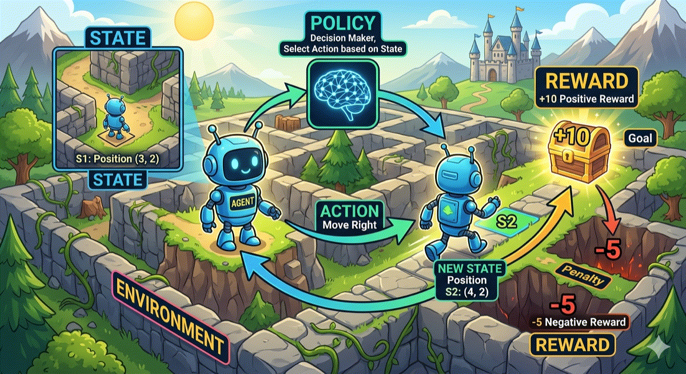

# 强化学习系统学习笔记

> 本文档是仓库根目录下的独立强化学习学习入口，目标是从概念直觉逐步走到 MDP、Q-Learning、Policy Gradient 和 Actor-Critic。
> 原 `17_model_extensions/03_reinforcement_learning/` 中的 Q-Learning 补充材料已经并入当前目录，可继续查看 `reinforcement_learning/`。

## 阅读路径

- 先阅读当前 `README.md`，建立强化学习核心概念框架
- 再进入 `reinforcement_learning/README.md`，补充 Q-Learning 专题讲义和演示项目

## 1. 强化学习是什么

强化学习（Reinforcement Learning, RL）是一类基于**智能体‑环境交互范式**，依托奖励反馈信号迭代优化决策策略的机器学习分支。

它研究的核心问题可以概括为三件事：

- 智能体当前应该采取什么动作
- 这个动作会让未来获得更多奖励还是更少奖励
- 如何在不断试错中学到一套长期收益更高的决策策略

强化学习中的学习过程，通常围绕“状态、动作、奖励、长期回报”展开。
智能体通过与环境的反复交互，逐步修正自己的决策方式。

一句话概括：

> 强化学习研究的是“如何让智能体通过试错学习，在长期累计奖励意义下做出更优决策”。

## 2. 强化学习与监督学习的区别

监督学习通常有明确标注，例如“图片对应什么类别”“一句话对应什么情感标签”。

强化学习关注的是连续决策问题，任务结构通常具有以下特点：

- 没有现成的标准动作标签
- 反馈可能延迟出现
- 当前动作的好坏，往往要看未来一连串结果
- 需要在“探索新策略”和“利用已知策略”之间平衡

从学习目标来看，两者的差异非常明显：

- 监督学习：看到棋盘状态 $S$，人类告诉它“这一步应该怎么走”
- 强化学习：看到棋盘状态 $S$，自己尝试不同走法，赢了记 $+1$，输了记 $-1$，再根据结果不断调整策略

这种差异也构成了强化学习的重要优势：

> 很多真实问题里，没有现成答案可以标注，但可以定义清晰目标。

只要奖励函数设计合理，智能体就可以通过不断试错，逐步收敛到高质量策略，甚至在某些任务上超越人类经验。

从问题类型上看，监督学习更接近静态映射学习，强化学习更接近面向未来的序列决策与长期优化。

## 3. 强化学习的核心组成

一个标准强化学习问题通常包含以下元素：

- **Agent（智能体）**：做决策的主体
- **Environment（环境）**：智能体交互的外部世界
- **State（状态）**：环境在某一时刻提供给智能体的信息
- **Action（动作）**：智能体在当前状态下可执行的选择
- **Reward（奖励）**：环境对动作结果给出的反馈信号
- **Policy（策略）**：智能体在不同状态下如何选动作的规则，常记为 $\pi(a \mid s)$
- **Trajectory（轨迹）**：状态、动作、奖励组成的时间序列

快速记忆可以直接背这句：

> 智能体（Agent）在环境（Environment）里，看状态（State），按策略（Policy），做动作（Action），拿奖励（Reward）。

配合下面这张图会更容易记住：

可以把图里的元素直接和概念一一对应：

- 机器人 = **Agent（智能体）**
- 迷宫 = **Environment（环境）**
- 机器人当前所在位置 = **State（状态）**
- 机器人“大脑”里的决策过程 = **Policy（策略）**
- 向右移动一步 = **Action（动作）**
- 走到宝箱得到正反馈、掉进坑里得到负反馈 = **Reward（奖励）**
- 走完一步后的新位置 `S2` = **New State（新状态）**

## 4. MDP：强化学习的标准建模方式

很多强化学习任务都可以抽象成 **Markov Decision Process, MDP**。
它提供了一套统一的描述框架，用来说明：

- 当前处在什么状态
- 可以采取哪些动作
- 动作执行后环境如何变化
- 会收到什么奖励
- 智能体如何衡量长期收益

一个 MDP 通常写成五元组：

$$
(S, A, P, R, \gamma)
$$

其中：

- $S$：状态集合
- $A$：动作集合
- $P$：状态转移概率，即执行动作后环境如何变化
- $R$：奖励函数
- $\gamma$：折扣因子，满足 $0 \leq \gamma < 1$

### 4.1 马尔可夫性质

马尔可夫性质强调：**当前状态应当成为对过去关键信息的充分概括**。

> 未来只依赖当前状态，而不依赖更久远的历史。

形式化地说：

$$
P(S_{t+1} \mid S_t, S_{t-1}, \ldots, S_0) = P(S_{t+1} \mid S_t)
$$

符号说明：

- $P(\cdot \mid \cdot)$：条件概率，表示“在已知某些条件下，某事件发生的概率”
- $S_t$：第 $t$ 步时的当前状态
- $S_{t+1}$：下一步状态
- $S_0, S_1, \ldots, S_{t-1}$：更早的历史状态
- $\mid$：表示“在……条件下”
- 等号右边只保留 $S_t$：表示当前状态已经浓缩了做预测所需的信息

这条性质的重要性在于：后面的策略、价值函数、贝尔曼方程，都可以围绕“当前状态”来定义和计算。

### 4.2 强化学习的目标

强化学习关注的是**长期累计回报**。
单步奖励提供局部反馈，真正决定策略质量的是从当前时刻往后能够积累多少收益。

定义从时刻 $t$ 开始的回报（Return）：

$$
G_t = R_{t+1} + \gamma R_{t+2} + \gamma^2 R_{t+3} + \ldots = \sum_{k=0}^{\infty} \gamma^k R_{t+k+1}
$$

符号说明：

- $G_t$：从时间步 $t$ 开始往后的总回报
- $R_{t+1}, R_{t+2}, R_{t+3}$：未来每一步拿到的奖励
- $\gamma$：折扣因子，表示越远的奖励权重越小
- $\gamma^2$：表示第二个未来奖励要再多打一次折
- $\ldots$：后面还有更多未来奖励
- $\sum_{k=0}^{\infty}$：把从当前开始的所有未来奖励都加起来
- $k$：求和时的计数变量
- $\gamma^k R_{t+k+1}$：第 $t+k+1$ 步奖励的折扣形式

这里的 $\gamma$ 决定了智能体更看重眼前收益还是长期收益：

- $\gamma$ 越小，越偏向短期
- $\gamma$ 越大，越重视长期

## 5. 价值函数与贝尔曼方程

在 MDP 中，**价值函数（Value Function）** 负责给状态和动作“标价”，
**贝尔曼方程（Bellman Equation）** 负责递归地计算这些价格。

如果把任务想象成一个迷宫，那么价值函数很像一张“热力图”：

- 哪些位置前景更好
- 哪些动作更值得做
- 哪些路线更接近长期目标

贝尔曼方程则像这张热力图背后的更新规则。
它把一个面向未来的长线决策问题，拆解成“当前一步奖励 + 下一步价值”的递归结构。

### 5.1 状态价值函数

**状态价值函数 $V^\pi(s)$** 用来衡量“站在这个状态上，整体前景如何”。

它的定义是：在策略 $\pi$ 已经给定的前提下，智能体从状态 $s$ 出发，未来能够获得的**期望累积折扣回报**。

$$
V^\pi(s) = \mathbb{E}_\pi [G_t \mid S_t = s]
$$

符号说明：

- $V^\pi(s)$：在策略 $\pi$ 下，状态 $s$ 的价值
- $\pi$：当前采用的策略
- 上标 $\pi$：表示这个价值函数依赖于策略 $\pi$
- $s$：某一个具体状态
- $\mathbb{E}_\pi$：在策略 $\pi$ 作用下取期望
- $G_t$：从时间步 $t$ 开始的累计回报
- $S_t = s$：表示“在时间步 $t$，系统正好处于状态 $s$”

### 5.2 动作价值函数

**状态-动作价值函数 $Q^\pi(s, a)$** 用来衡量“站在这个状态，并且先做这个动作，前景如何”。

它的定义是：智能体处于状态 $s$ 时，先执行动作 $a$，之后再继续遵循策略 $\pi$，所能获得的期望回报。

$$
Q^\pi(s, a) = \mathbb{E}_\pi [G_t \mid S_t = s, A_t = a]
$$

符号说明：

- $Q^\pi(s, a)$：在策略 $\pi$ 下，状态 $s$ 先执行动作 $a$ 的价值
- $a$：某一个具体动作
- $A_t = a$：表示“在时间步 $t$，采取的动作是 $a$”
- 其余符号如 $\pi$、$\mathbb{E}_\pi$、$G_t$、$S_t = s$ 与上一个公式含义一致

### 5.3 优势函数

**优势函数 $A^\pi(s, a)$** 进一步回答一个更细的问题：

> 在状态 $s$ 下，动作 $a$ 相比这个状态的一般水平，到底高出多少？

它常用于策略优化，因为它直接反映“这个动作是否值得被额外鼓励”。

$$
A^\pi(s, a) = Q^\pi(s, a) - V^\pi(s)
$$

符号说明：

- $A^\pi(s, a)$：优势函数，表示“动作 $a$ 比该状态下平均水平好多少”
- $Q^\pi(s, a)$：做动作 $a$ 时的价值
- $V^\pi(s)$：只看状态 $s$ 的平均价值
- 减号：表示“某动作的价值”减去“该状态的平均价值”

如果 $A^\pi(s, a) > 0$，说明这个动作比平均动作更好。

### 5.4 贝尔曼期望方程

贝尔曼方程的核心思想是**递归**：

> 一个状态今天值多少钱，取决于当前一步能拿到什么，以及下一步落到哪里。

对已经给定的策略 $\pi$，价值函数满足贝尔曼期望方程。

对状态价值函数：

$$
V^\pi(s) = \sum_a \pi(a \mid s) \sum_{s', r} p(s', r \mid s, a) \left[r + \gamma V^\pi(s')\right]
$$

符号说明：

- $\sum_a$：对当前状态下所有可能动作求和
- $\pi(a \mid s)$：在状态 $s$ 下选择动作 $a$ 的概率
- $\sum_{s', r}$：对所有可能的下一状态 $s'$ 和奖励 $r$ 求和
- $p(s', r \mid s, a)$：在当前状态 $s$ 执行动作 $a$ 后，转移到 $s'$ 并得到奖励 $r$ 的概率
- $r$：当前这一步拿到的即时奖励
- $\gamma V^\pi(s')$：下一状态未来价值的折扣项
- 方括号里的整体：当前奖励 + 未来价值
- 这个公式整体表达的是：状态价值 = 各种可能动作与后果的加权平均

对动作价值函数：

$$
Q^\pi(s, a) = \sum_{s', r} p(s', r \mid s, a) \left[r + \gamma \sum_{a'} \pi(a' \mid s') Q^\pi(s', a')\right]
$$

符号说明：

- 左边的 $Q^\pi(s, a)$：当前状态 $s$ 下先执行动作 $a$ 的价值
- $\sum_{s', r}$：对所有可能的下一状态和奖励求和
- $p(s', r \mid s, a)$：从 $(s, a)$ 出发到达 $(s', r)$ 的概率
- $a'$：下一状态中的候选动作
- $\sum_{a'} \pi(a' \mid s') Q^\pi(s', a')$：在下一状态 $s'$ 下，按策略 $\pi$ 对各动作价值做加权平均
- 整个右边表示：先拿当前奖励，再接上下一状态的未来期望价值

从定义还可以推出一组很重要的转换关系：

$$
V^\pi(s) = \sum_a \pi(a \mid s) Q^\pi(s, a)
$$

$$
Q^\pi(s, a) = \sum_{s', r} p(s', r \mid s, a) \left[r + \gamma V^\pi(s')\right]
$$

这两条关系非常实用：

- 第一条说明：状态价值可以由动作价值加权得到
- 第二条说明：动作价值可以由下一状态价值递推得到

### 5.5 贝尔曼最优方程

当目标从“评估一个给定策略”切换为“寻找最优策略”时，就会进入**贝尔曼最优方程**。

最优状态价值函数和最优动作价值函数分别满足：

$$
V^*(s) = \max_a Q^*(s, a)
$$

$$
Q^*(s, a) = \sum_{s', r} p(s', r \mid s, a) \left[r + \gamma \max_{a'} Q^*(s', a')\right]
$$

符号说明：

- $Q^*(s, a)$：最优动作价值函数，表示“如果后面都按最优方式行动，这个动作值多少”
- 上标 $*$：表示最优
- $V^*(s)$：最优状态价值函数
- $\max_{a'} Q^*(s', a')$：到达下一状态 $s'$ 后，从所有动作里挑价值最大的那个
- $\max_a Q^*(s, a)$：当前状态下直接选择价值最高的动作
- 和贝尔曼期望方程相比，这里直接使用 $\max$ 操作，把下一步动作固定为价值最高的选择
- 这就是很多最优控制与 Q-Learning 方法的基础

当状态空间很大时，这组方程通常无法直接精确求解。
这也是现代深度强化学习会引入神经网络去逼近 $V^*$ 或 $Q^*$ 的原因。

## 6. 探索与利用

强化学习中一个经典矛盾是：

- **Exploration（探索）**：尝试没试过的动作，可能发现更优策略
- **Exploitation（利用）**：优先选择当前看起来最好的动作，稳定获得收益

如果只利用，可能陷入局部最优；如果只探索，又会学得很慢。

常见策略是 $\epsilon$-greedy：

- 以概率 $\epsilon$ 随机选动作
- 以概率 $1 - \epsilon$ 选择当前价值最高的动作

这里的符号说明：

- $\epsilon$：探索率，表示“有多大概率去随机试一试”
- $1 - \epsilon$：利用率，表示“有多大概率使用当前最优选择”

## 7. Q-Learning：值函数方法的代表

Q-Learning 是最经典的 **Value-Based** 强化学习方法之一。
它的目标很明确：通过不断采样交互经验，逐步逼近最优动作价值函数 $Q^*(s, a)$。

它的核心更新公式是：

$$
Q(s_t, a_t) \leftarrow Q(s_t, a_t) + \alpha \left[r_{t+1} + \gamma \max_{a'} Q(s_{t+1}, a') - Q(s_t, a_t)\right]
$$

其中：

- $\alpha$：学习率
- $r_{t+1}$：执行动作后获得的即时奖励
- $\gamma \max_{a'} Q(s_{t+1}, a')$：对下一状态最优未来收益的估计
- $s_t$：第 $t$ 步时的当前状态
- $a_t$：第 $t$ 步时实际执行的动作
- $s_{t+1}$：执行动作后的下一状态
- $\leftarrow$：把左边的旧估计更新成右边的新结果
- 方括号中的整体：目标值减去旧估计后的修正信号

方括号内这一项通常称为 **TD Error（时序差分误差）**。
它刻画的是：这次交互得到的结果，与原先的价值估计之间存在多大偏差。

### 7.1 Q-Learning 的直觉

可以把 Q-Learning 理解成一个不断修正“动作标价表”的过程：

- 结果比预期更好，这个动作的价值估计就向上修正
- 结果低于预期，这个动作的价值估计就向下修正

经过大量交互后，$Q(s, a)$ 会逐步逼近最优动作价值函数。

### 7.2 Q-Learning 的优点

- 逻辑清晰，适合入门
- 不需要环境转移概率模型
- 在离散状态和离散动作空间下非常有效

### 7.3 Q-Learning 的局限

- 状态空间很大时，表格法难以扩展
- 连续动作空间下不方便直接取 $\max$
- 学习过程对探索策略和超参数较敏感

因此在更复杂问题中，往往需要函数逼近或策略梯度方法。

## 8. Policy Gradient：直接学习策略

### 8.1 为什么要直接学习策略

策略梯度方法把注意力直接放在“策略本身”上。
这条路线在以下场景里尤其自然：

- 动作空间可能是连续的
- 策略需要天然随机性
- 只学 $Q$ 值不够方便

这时常见做法是对策略进行参数化，记为 $\pi_\theta(a \mid s)$，然后直接优化参数 $\theta$。

### 8.2 优化目标

策略梯度方法的目标是：让当前策略在平均意义下产出更高的回报。

$$
J(\theta) = \mathbb{E}_{\tau \sim \pi_\theta} [R(\tau)]
$$

其中 $\tau$ 表示一条轨迹，$R(\tau)$ 表示整条轨迹的累计回报。

符号说明：

- $J(\theta)$：目标函数，表示“当前参数 $\theta$ 下，这个策略总体有多好”
- $\theta$：策略模型的参数
- $\mathbb{E}_{\tau \sim \pi_\theta}$：轨迹 $\tau$ 是按策略 $\pi_\theta$ 采样得到的，并对这些轨迹取平均
- $\pi_\theta$：由参数 $\theta$ 控制的策略
- $\tau$：一整条交互轨迹，例如一串状态、动作、奖励序列
- $R(\tau)$：轨迹 $\tau$ 的总回报

### 8.3 基本梯度形式

经典 REINFORCE 方法给出了一个非常有代表性的梯度表达式：

$$
\nabla_\theta J(\theta) = \mathbb{E}_{\tau \sim \pi_\theta} \left[ \sum_t \nabla_\theta \log \pi_\theta(a_t \mid s_t) G_t \right]
$$

符号说明：

- $\nabla_\theta J(\theta)$：目标函数对参数 $\theta$ 的梯度，也就是“参数该往哪里调”
- $\sum_t$：对一条轨迹中的每一个时间步求和
- $\nabla_\theta \log \pi_\theta(a_t \mid s_t)$：在状态 $s_t$ 下选择动作 $a_t$ 的对数概率，对参数 $\theta$ 的梯度
- $\log \pi_\theta(a_t \mid s_t)$：动作 $a_t$ 被当前策略选中的对数概率
- $G_t$：从当前时间步往后的累计回报
- 这个公式整体表示：回报高的动作，其概率要被提高；回报低的动作，其概率要被降低

从直观上看，这个公式表达的是：

- 如果某条轨迹最终回报高，就增加轨迹中那些动作被选中的概率
- 如果回报低，就降低这些动作被选中的概率

### 8.4 Policy Gradient 的优点

- 适合连续动作空间
- 可以直接学习随机策略
- 优化目标更贴近最终决策策略本身

### 8.5 Policy Gradient 的局限

- 梯度方差通常较大
- 样本效率往往不高
- 训练稳定性可能不如简单离散场景下的值函数方法

这也是 Actor-Critic 出现的原因之一。

## 9. Actor-Critic：策略与价值结合

Actor-Critic 将“策略优化”和“价值评估”结合到同一个框架中。
它通常被拆成两个彼此配合的角色：

- **Actor**：负责输出策略，决定在状态 $s$ 下采取什么动作
- **Critic**：负责评估当前策略或动作有多好

### 9.1 为什么这样组合

Q-Learning 在离散动作场景中非常直接，Policy Gradient 在连续动作场景中更自然。
Actor-Critic 试图把两条路线的优点放进同一套框架里：

- 用 Actor 保留“直接优化策略”的优点
- 用 Critic 提供更稳定的学习信号，降低梯度方差

### 9.2 TD 误差作为学习信号

Actor-Critic 中一个非常关键的量是 **TD 误差**。
它用来衡量“这一步的实际结果，与原先价值估计之间的差距”。

一个常见写法是：

$$
\delta_t = r_t + \gamma V_w(s_{t+1}) - V_w(s_t)
$$

其中：

- $V_w$ 是 Critic 估计的状态价值函数
- $\delta_t$ 衡量“这一步实际结果是否比原先预期更好”
- $w$：Critic 的参数
- $r_t$：当前这一步拿到的奖励
- $V_w(s_t)$：当前状态的原先价值估计
- $V_w(s_{t+1})$：下一状态的价值估计
- 整个右边：实际拿到的奖励 + 下一状态估计价值 - 当前状态旧估计

### 9.3 Actor 与 Critic 的更新直觉

Actor 更新：

$$
\theta \leftarrow \theta + \alpha_\theta \delta_t \nabla_\theta \log \pi_\theta(a_t \mid s_t)
$$

符号说明：

- $\theta$：Actor 的参数
- $\alpha_\theta$：Actor 的学习率
- $\delta_t$：TD 误差，作为“这步动作好不好”的学习信号
- $\nabla_\theta \log \pi_\theta(a_t \mid s_t)$：告诉 Actor 应该怎样调整参数，才能改变当前动作的选择概率
- 如果 $\delta_t > 0$，更新会增加这个动作未来被选中的概率
- 如果 $\delta_t < 0$，更新会降低这个动作未来被选中的概率

Critic 更新：

$$
w \leftarrow w - \alpha_w \nabla_w \frac{1}{2} \delta_t^2
$$

符号说明：

- $w$：Critic 的参数
- $\alpha_w$：Critic 的学习率
- $\nabla_w$：对 Critic 参数 $w$ 求梯度
- $\frac{1}{2} \delta_t^2$：平方误差损失，表示 Critic 的估计偏差有多大
- 目标是让 $\delta_t$ 逐渐变小，也就是让 Critic 的价值估计越来越准

可以这样理解：

- 如果 $\delta_t > 0$，说明这步动作比预期好，Actor 就更倾向于以后重复它
- 如果 $\delta_t < 0$，说明动作比预期差，Actor 就降低它的概率
- Critic 则不断修正自己的价值估计，使评价越来越准

### 9.4 Actor-Critic 的优点

- 比纯 REINFORCE 更稳定
- 比纯值函数法更容易处理连续动作空间
- 是很多现代强化学习算法的重要基础

常见变体包括 A2C、A3C、PPO 等。

## 10. 三类方法的直观对比

| 方法 | 核心思想 | 优点 | 局限 |
| --- | --- | --- | --- |
| Value-Based | 学习状态或动作价值，再据此选动作 | 直观、易入门、离散场景有效 | 难处理大状态空间和连续动作 |
| Policy-Based | 直接学习策略参数 | 适合连续动作，可学习随机策略 | 方差较大，训练不稳 |
| Actor-Critic | 用 Critic 评估，用 Actor 决策 | 兼顾策略优化与稳定性 | 训练细节更复杂，超参数更多 |

## 11. 强化学习的典型应用

强化学习常见于以下场景：

- **游戏 AI**：如下棋、Atari、StarCraft 决策
- **机器人控制**：机械臂抓取、行走控制、路径规划
- **推荐与广告**：长期用户价值优化
- **资源调度**：缓存、网络路由、系统资源分配
- **大模型对齐**：通过奖励模型或偏好信号优化模型行为

## 12. 强化学习与大模型训练的关系

在大模型领域，强化学习最常被提到的是 RLHF（Reinforcement Learning from Human Feedback）。

可以用一句话理解：

- 监督微调让模型“学会模仿答案”
- 强化学习让模型“朝更符合偏好的方向优化”

常见名词包括 PPO、RLHF、GRPO 等。

需要注意的是：

- 这些方法借用了强化学习思想
- 但工程实现通常比经典教科书例子复杂得多
- 像 DPO 这类方法常和 RLHF 一起讨论，但它并不是标准意义上的在线强化学习

因此，打好 MDP、价值函数、策略梯度和 Actor-Critic 的基础，理解大模型强化学习会轻松很多。

## 13. 一条实用的学习路线

如果你准备继续深入，建议按下面顺序学习：

1. 先彻底理解 MDP、回报、价值函数、贝尔曼方程
2. 再掌握 Q-Learning 和 TD Learning 的更新逻辑
3. 然后学习 Policy Gradient 和 REINFORCE
4. 接着进入 Actor-Critic、A2C、PPO
5. 最后再看 DQN、SAC、DDPG、TRPO、RLHF 等扩展主题

## 14. 总结

强化学习的核心不是“拟合答案”，而是“在交互中学会决策”。

你可以把它理解成一条主线：

- 用 MDP 建模问题
- 用回报定义长期目标
- 用价值函数估计未来收益
- 用 Q-Learning 学值
- 用 Policy Gradient 直接学策略
- 用 Actor-Critic 把两条路线结合起来

如果这条主线能讲清楚，强化学习的大部分基础框架就已经建立起来了。
