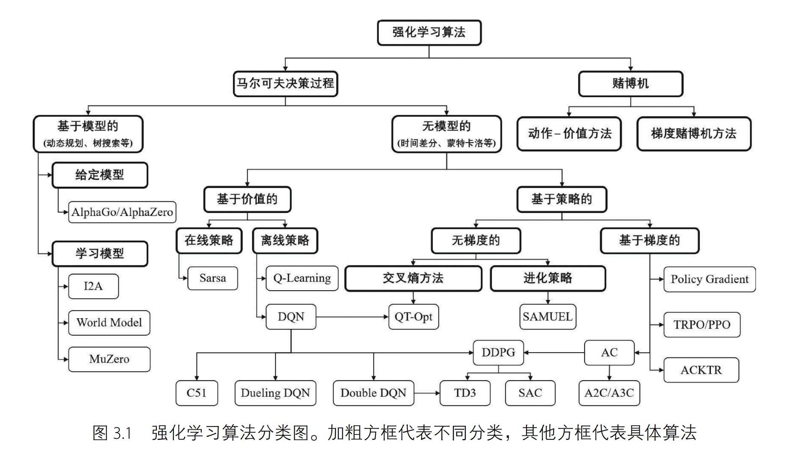
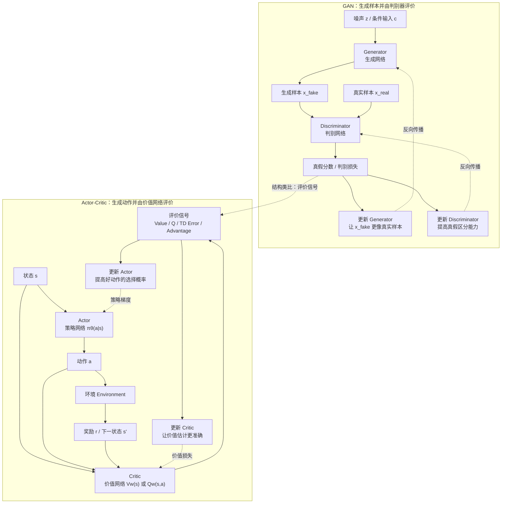

# 强化学习系统学习笔记：基础篇

> 本文档是强化学习系统学习笔记的基础篇，目标是从概念直觉逐步走到 MDP、Q-Learning、Policy Gradient 和 Actor-Critic。
> 扩展主题已拆到 `强化学习系统学习笔记_扩展篇.md`，包括 MARL、模仿学习、高级拓展、RLHF 与大模型训练。
> 原 `17_model_extensions/03_reinforcement_learning/` 中的 Q-Learning 补充材料已经并入当前目录，可继续查看 `reinforcement_learning/`。

## 阅读路径

- 先阅读当前 `README.md`，建立强化学习核心概念框架
- 再阅读本文件，掌握从 MDP 到 Actor-Critic 的基础主线
- 继续阅读 `强化学习系统学习笔记_扩展篇.md`，补充 MARL、模仿学习、高级拓展和大模型 RL
- 最后进入 `reinforcement_learning/README.md`，补充 Q-Learning 专题讲义和演示项目

## 强化学习算法分类图



这张分类图可以按下面的层级理解：

```text
强化学习算法
├── 1. 赌博机 Bandit
│   ├── 动作-价值方法 Action-Value Methods
│   └── 梯度赌博机方法 Gradient Bandit Methods
├── 2. 马尔可夫决策过程 MDP
│   ├── 2.1 基于模型 Model-Based
│   │   ├── 给定模型 Model Provided
│   │   │   ├── Dynamic Programming
│   │   │   ├── Tree Search
│   │   │   └── MCTS
│   │   └── 学习模型 Model Learned
│   │       ├── Dyna / World Model
│   │       ├── MuZero
│   │       └── Model-Based Policy Optimization
│   ├── 2.2 无模型 Model-Free
│   │   ├── 基于价值 Value-Based
│   │   │   ├── On-Policy：SARSA
│   │   │   └── Off-Policy：Q-Learning / DQN / Double DQN / Dueling DQN
│   │   └── 基于策略 / Actor-Critic
│   │       ├── Policy Gradient：REINFORCE / TRPO / PPO
│   │       ├── Actor-Critic：A2C / A3C / PPO
│   │       ├── 连续控制：DPG / DDPG / TD3
│   │       └── 最大熵方法：SAC
│   ├── 2.3 按数据来源
│   │   ├── Online RL：训练时持续和环境交互
│   │   └── Offline RL：只使用固定历史数据集
│   ├── 2.4 按智能体数量
│   │   ├── Single-Agent RL
│   │   └── Multi-Agent RL：IQL / VDN / QMIX / MADDPG / MAPPO
│   ├── 2.5 从专家数据学习
│   │   └── Imitation Learning：BC / IRL / GAIL
│   └── 2.6 高级扩展
│       ├── Hierarchical RL：Options / Manager-Worker
│       └── Distributional RL：C51 / QR-DQN / IQN
└── 3. 大模型对齐中的强化学习思想
    ├── RLHF：Reward Model + PPO
    ├── GRPO：组内相对奖励
    └── DPO：偏好优化，不是标准在线 RL
```

简化理解：

- **Bandit**：没有复杂状态转移，重点是当前选哪个动作能获得更高奖励。
- **MDP**：有状态转移和长期回报，重点是当前动作如何影响未来整体结果。
- **Model-Based**：显式使用或学习环境模型，再进行规划。
- **Model-Free**：不显式建环境模型，直接从交互经验中学习价值函数或策略。
- **Value-Based**：学习 $V(s)$ 或 $Q(s, a)$，再根据价值函数选择动作。
- **Policy-Based / Actor-Critic**：直接学习策略 $\pi(a \mid s)$，或者同时学习策略和价值评估器。
- **Online / Offline RL**：关注训练数据来源：实时交互，还是固定历史数据；不要和 On-Policy / Off-Policy 混淆。
- **MARL**：多个智能体共同学习，重点是联合动作、非平稳性和信用分配。
- **Imitation Learning**：从专家示范中学习策略，常作为 RL 之前的 warm start 或奖励难设计时的替代路线。
- **HRL / Distributional RL**：分别从任务分层和回报分布角度扩展基础强化学习框架。

**Model-Based 和 Model-Free 的核心区别**

在 MDP 中，环境通常由状态转移函数 $P$ 和奖励函数 $R$ 描述：

```text
P：执行动作后，环境会转移到哪里
R：执行动作后，环境会给多少奖励
```

如果 $P$ 和 $R$ 是已知的，就可以直接用动态规划、树搜索、MCTS 等规划方法求解。

如果 $P$ 和 $R$ 一开始未知，智能体也可以通过和环境交互收集样本：

```text
(s, a, s', r)
```

再用这些样本去估计：

```text
p(s' | s, a)
r(s, a)
```

也就是学习“在状态 $s$ 执行动作 $a$ 后，会到达哪个状态、得到多少奖励”。当状态转移函数 $P$ 和奖励函数 $R$ 被估计出来后，智能体就可以利用这个环境模型进行规划。这类方法称为 **基于模型的方法（Model-Based RL）**。

另一类方法不尝试显式学习 $P$ 和 $R$，而是直接学习如何做决策。这类方法称为 **无模型方法（Model-Free RL）**。

例如：

- **Q-Learning**：直接估计状态-动作对 $(s, a)$ 的 $Q$ 值，并倾向于选择 $Q$ 值更高的动作
- **Policy Gradient**：不显式建模环境，也不一定先估计 $Q$ 表，而是把策略参数化，直接在策略空间中优化累计回报

所以最短判断标准是：

```text
Model-Based：学习或使用环境模型 P/R，再规划
Model-Free：不显式学习环境模型，直接学习价值函数或策略
```

## 1. 强化学习是什么

强化学习（Reinforcement Learning, RL）是通过智能体与环境交互进行学习的方法，无需明确的监督标签。智能体通过试错，从环境反馈的奖励或惩罚中学习最佳行动策略，以最大化长期累计奖励。在大模型训练中，基于人类反馈的强化学习（RLHF）以及基于自博弈（Self-Play）的强化学习训练，是常见的强化学习应用。

## 2. 强化学习与监督学习的区别

监督学习主要学习“输入应该对应什么标签”，强化学习主要学习“在当前状态下应该采取什么动作，才能获得更高的长期收益”。

| 对比维度 | 监督学习 | 强化学习 |
|---|---|---|
| 学习信号 | 明确标签，例如类别、分数、标准答案 | 奖励或惩罚，通常只说明结果好坏 |
| 数据来源 | 固定的标注数据集 | 与环境交互得到的经验，或历史轨迹数据 |
| 学习目标 | 学习输入到输出的映射 | 学习状态到动作的策略 |
| 反馈时机 | 通常每个样本都有直接反馈 | 反馈可能延迟，当前动作会影响未来结果 |
| 优化目标 | 降低预测误差 | 最大化长期累计回报 |
| 关键难点 | 标注质量、泛化能力、分布偏移 | 探索与利用、奖励设计、信用分配 |
| 典型例子 | 图像分类、文本分类、回归预测 | 游戏 AI、机器人控制、推荐策略、大模型 RLHF |

可以这样记：

```text
监督学习：看标签，学答案。
强化学习：看奖励，学决策。
```

更短一句话：

> 监督学习关心“这次预测对不对”，强化学习关心“一串动作之后总收益高不高”。

## 3. 强化学习的核心组成

一个标准强化学习问题通常包含以下元素：

- **Agent（智能体）**：做决策的主体
- **Environment（环境）**：智能体交互的外部世界
- **State（状态）**：环境在某一时刻提供给智能体的信息
- **Action（动作）**：智能体在当前状态下可执行的选择
- **Reward（奖励）**：环境对动作结果给出的反馈信号
- **Policy（策略）**：智能体在不同状态下如何选动作的规则，常记为 $\pi(a \mid s)$
- **Trajectory（轨迹）**：状态、动作、奖励组成的时间序列

快速记忆可以直接背这句：

> 智能体（Agent）观察环境（Environment）给出的状态（State），根据策略（Policy）选择动作（Action），环境返回奖励（Reward）和下一状态，智能体再据此更新策略或价值估计。

配合下面这张图会更容易记住：


可以把图里的元素直接和概念一一对应：

- 机器人 = **Agent（智能体）**
- 迷宫 = **Environment（环境）**
- 机器人当前所在位置 = **State（状态）**
- 机器人“大脑”里的决策过程 = **Policy（策略）**
- 向右移动一步 = **Action（动作）**
- 走到宝箱得到正反馈、掉进坑里得到负反馈 = **Reward（奖励）**
- 走完一步后的新位置 `S2` = **New State（新状态）**

## 4. 马尔可夫性质、马尔可夫链与 MDP（马尔可夫决策过程）

这一节要解决的是：为什么强化学习通常要用 MDP 来描述问题。

整体技术关系可以先记成：

```text
马尔可夫性质：未来只依赖当前状态
-> 马尔可夫链 / MP（马尔可夫过程）：只有状态转移
-> MRP（马尔可夫奖励过程）：状态转移 + 奖励
-> MDP（马尔可夫决策过程）：状态转移 + 奖励 + 动作
-> 五元组 (S, A, P, R, gamma)
-> 长期累计回报 G_t
```

其中，马尔可夫性质是底层假设，马尔可夫链和 MP 描述状态如何转移，MRP 在状态转移上加入奖励，MDP 再加入动作。

MDP 五元组是强化学习最常用的正式建模方式，长期累计回报是强化学习最终要优化的目标。

### 4.0 马尔可夫性质：为什么只看当前状态

MP、MRP 和 MDP 都建立在同一个核心假设上：**马尔可夫性质**。

它的意思是：**预测下一步时，只需要看当前状态，不需要再看更早的历史状态**。

从数学上讲，设状态序列为：

$$
S_0, S_1, S_2, \ldots
$$

其中 $S_t$ 表示第 $t$ 步的状态。如果状态转移概率满足：

$$
P(S_{t+1}=s_{t+1} \mid S_t=s_t, S_{t-1}=s_{t-1}, \ldots, S_0=s_0)
=
P(S_{t+1}=s_{t+1} \mid S_t=s_t)
$$

则称这个状态序列具有**马尔可夫性质**。

其中：

- $P(\cdot \mid \cdot)$：条件概率，表示“在给定条件下，某事件发生的概率”
- $S_t=s_t$：第 $t$ 步处于状态 $s_t$
- $S_{t+1}=s_{t+1}$：下一步转移到状态 $s_{t+1}$
- $S_0=s_0, \ldots, S_{t-1}=s_{t-1}$：当前之前的历史状态

也就是说，$P(S_{t+1}=s_{t+1} \mid S_t=s_t)$ 表示：当前处于状态 $s_t$ 时，下一步转移到状态 $s_{t+1}$ 的概率。更早的历史状态不会额外改变这个概率。

在离散时间、离散状态的场景下，满足马尔可夫性质的状态序列通常称为**马尔可夫链（Markov Chain）**。

```text
马尔可夫链：状态 -> 状态 -> 状态 -> ...
```

例如用天气做简化建模：如果“今天的天气”已经足以决定“明天天气”的概率分布，那么预测明天时不需要再额外查看昨天、前天的天气。此时这个天气状态序列就可以近似看作马尔可夫链。

所以这一组概念可以这样区分：

- **马尔可夫性质**：一种“未来只依赖当前状态”的条件独立假设
- **马尔可夫链（Markov Chain）**：满足马尔可夫性质的状态转移随机过程
- **马尔可夫过程（MP）**：不考虑动作和奖励，只描述状态如何随时间演化的过程

这条假设很重要，因为后面的状态转移概率、策略、价值函数和贝尔曼方程，都会围绕“当前状态”来定义。

### 4.1 从 MP 到 MRP 再到 MDP

在正式进入强化学习建模之前，需要先区分三个逐层增强的概念。

**MP（Markov Process，马尔可夫过程）** 只讨论状态怎样随时间演化：

```text
状态 -> 下一个状态
```

它没有动作，也没有奖励。直观理解：你只能观察环境怎么变。

**MRP（Markov Reward Process，马尔可夫奖励过程）** 在 MP 的基础上增加了奖励：

```text
状态 -> 奖励 -> 下一个状态
```

它能描述“世界怎么变，以及每一步得到什么反馈”，但仍然没有智能体自己选动作这一步。

**MDP（Markov Decision Process，马尔可夫决策过程）** 在 MRP 的基础上再加入动作：

```text
状态 -> 动作 -> 奖励 + 下一个状态
```

这时智能体可以在不同状态下自己做决策，而动作会影响后续状态和奖励。

三者可以理解成一个逐层增加要素的关系：

$$
\text{MP} \rightarrow \text{MRP} \rightarrow \text{MDP}
$$

也可以这样记：

| 模型 | 包含什么 | 能回答什么 |
|---|---|---|
| MP | 状态转移 | 环境会怎么变化 |
| MRP | 状态转移 + 奖励 | 环境变化时会得到什么回报 |
| MDP | 状态转移 + 奖励 + 动作 | 当前应该选择什么动作 |

这三个概念的关键区别是：

```text
有没有奖励？
能不能主动选择动作？
```

如果没有奖励，谈不上长期回报最大化；如果没有动作，谈不上策略优化。因此，真正进入强化学习时，通常会落到 MDP。

### 4.2 MDP 的五元组

MDP 提供了一套统一的描述框架，用来说明：

- 当前处在什么状态
- 可以采取哪些动作
- 动作执行后环境如何变化
- 会收到什么奖励
- 智能体如何衡量长期收益

一个 MDP 通常写成五元组：

$$
(S, A, P, R, \gamma)
$$

其中：

- $S$：状态集合，英文是 **State Space**
- $A$：动作集合，英文是 **Action Space**
- $P$：状态转移概率，英文是 **Transition Probability**，表示执行动作后环境如何变化
- $R$：奖励函数，英文是 **Reward Function**
- $\gamma$：折扣因子，英文是 **Discount Factor**；$\gamma$ 是希腊字母 gamma，满足 $0 \leq \gamma < 1$

其中 $P$ 和 $R$ 是理解 MDP 的关键。

**$P$：状态转移概率（Transition Probability）**

$P$ 描述环境的动态规律：智能体在状态 $s$ 下执行动作 $a$ 后，会以多大概率转移到下一个状态 $s'$。

常见写法是：

$$
p(s' \mid s, a)
$$

含义是：

> 当前在状态 $s$，执行动作 $a$ 后，下一步到达状态 $s'$ 的概率。

例如：

```text
p(右边格子 | 当前格子, 向右) = 0.8
p(原地不动 | 当前格子, 向右) = 0.2
```

这表示执行“向右”后，有 $0.8$ 概率成功到右边格子，有 $0.2$ 概率因为环境随机性留在原地。

在强化学习教材中，也常把“下一状态”和“奖励”放在一起写：

$$
p(s', r \mid s, a)
$$

含义是：

> 当前在状态 $s$，执行动作 $a$ 后，转移到状态 $s'$ 并得到奖励 $r$ 的联合概率。

**$R$：奖励函数（Reward Function）**

$R$ 描述环境给智能体的即时反馈：在状态 $s$ 下执行动作 $a$ 后，环境返回多少奖励。

常见写法是：

$$
r(s, a)
$$

含义是：

> 当前在状态 $s$ 执行动作 $a$ 时，环境给出的即时奖励值。

例如：

```text
r(普通格子, 向右) = 0
r(目标格子, 到达) = +1
r(陷阱格子, 到达) = -1
```

如果奖励还依赖下一状态，也可以写成：

$$
r(s, a, s')
$$

含义是：从状态 $s$ 执行动作 $a$ 并到达状态 $s'$ 后得到的奖励。

**例子：机器人走格子**

假设有一个机器人在二维网格中移动，目标是走到终点，同时避免撞墙或掉进陷阱。这个问题可以用 MDP 五元组描述：

- $S$：所有可能的格子位置，例如 $(1, 1)$、$(1, 2)$、$(2, 1)$
- $A$：机器人可以执行的动作，例如上、下、左、右
- $P$：执行动作后到达下一个格子的概率，例如“向右”有 $0.8$ 概率到达右边格子，有 $0.2$ 概率原地不动
- $R$：奖励函数，例如到达目标 $+1$，撞墙 $-1$，普通移动 $0$
- $\gamma$：折扣因子，用来控制机器人更看重眼前奖励还是未来奖励

可以写成：

```text
S：所有格子位置
A：上、下、左、右
P：执行动作后到达哪个格子的概率
R：到达目标 +1，撞墙 -1，普通移动 0
γ：未来奖励折扣
```

这个例子里，MDP 描述的是“问题本身”：机器人能看到哪些状态、能做哪些动作、动作会如何改变位置、环境会如何给奖励。

**MDP、策略 $\pi$ 和强化学习算法的关系**

MDP 五元组定义的是环境和任务本身，但它不直接告诉智能体应该怎么行动。真正决定智能体如何行动的是策略 $\pi$。

可以这样区分：

```text
MDP：定义问题
π：定义智能体在每个状态下如何选择动作
强化学习算法：在 MDP 中寻找更好的 π
```

例如在机器人走格子中：

- MDP 定义网格、动作、转移概率和奖励规则
- 策略 $\pi(a \mid s)$ 定义机器人在某个格子里选择“上、下、左、右”的概率
- 强化学习算法通过试错更新策略，让机器人更容易走到目标、避开撞墙或陷阱

### 4.3 强化学习的目标：长期累计回报

速记：

```text
长期累计回报：从当前开始，未来奖励加起来是多少。
反向计算回报：从 episode 末尾往前，把这些回报高效算出来。
```

MDP 五元组定义了问题，强化学习算法要做的是在这个 MDP 中找到更好的策略。

强化学习关注的是**长期累计回报**。单步奖励只提供局部反馈，真正决定策略质量的是从当前时间步开始，未来一段时间内能够累计获得多少收益。

强化学习里的**回报（Return）**，通常用字母 $G$ 或 $G_t$ 表示，也可以理解为 Gain（收益）。它表示从某个时间步开始，未来所有奖励的累计总和，用来衡量当前策略的长期收益。

如果从时间步 $t$ 开始，到本回合结束，回报可以写成：

$$
G_t = R_{t+1} + R_{t+2} + R_{t+3} + \cdots + R_T
$$

如果考虑折扣因子 $\gamma$，则是累计折扣奖励：

$$
G_t = R_{t+1} + \gamma R_{t+2} + \gamma^2 R_{t+3} + \cdots
= \sum_{k=0}^{\infty} \gamma^k R_{t+k+1}
$$

符号说明：

- $G_t$：从时间步 $t$ 开始往后的总回报
- $R_{t+1}, R_{t+2}, R_{t+3}$：未来每一步拿到的奖励
- $\gamma$：折扣因子，表示越远的奖励权重越小
- $\sum_{k=0}^{\infty}$：把从当前开始的所有未来奖励按折扣加起来

这里的 $\gamma$ 决定了智能体更看重眼前收益还是长期收益：

- $\gamma$ 越小，越偏向短期
- $\gamma$ 越大，越重视长期

需要注意，回报 $G_t$ 通常是随机的，主要原因有两个：

1. **状态转移有随机性**：同一个状态下执行同一个动作，环境可能返回不同的下一状态和奖励。
2. **动作选择有随机性**：为了探索，智能体可能不会总是选择当前最优动作，而是随机尝试其他动作。

简单记忆：

```text
奖励 R：一步反馈，看短期
回报 G：未来累计收益，看长期
```

#### 4.3.1 反向计算回报：从 episode 末尾往前算

在实际代码里，回报 $G_t$ 通常不会从每个时间步都重新向后求和。更常见的做法是：等一条 episode 结束后，从最后一步奖励开始，**从后往前递推**。

假设一条 episode 的奖励序列是：

```text
R1, R2, R3, ..., RT
```

episode 结束后进入终止状态，终止状态之后没有未来奖励，因此可以令：

$$
G_T = 0
$$

然后从 $t = T-1$ 开始往前算：

$$
G_t = R_{t+1} + \gamma G_{t+1}
$$

这个公式的意思是：

```text
当前回报 = 当前这一步奖励 + 折扣后的下一时间步回报
```

最后一个非终止时间步的回报是：

$$
G_{T-1} = R_T + \gamma G_T = R_T
$$

因为 $G_T = 0$，所以最后一步奖励本身就是最后一个非终止状态的回报。

例如奖励序列是：

```text
rewards = [2, 1, 3]
gamma = 0.9
```

反向计算：

```text
终止状态：G = 0
第 2 步：G2 = 3 + 0.9 * 0 = 3
第 1 步：G1 = 1 + 0.9 * 3 = 3.7
第 0 步：G0 = 2 + 0.9 * 3.7 = 5.33
```

所以每个时间步对应的回报是：

```text
G0 = 5.33
G1 = 3.70
G2 = 3.00
```

极简代码可以写成：

```python
def compute_returns(rewards, gamma):
    returns = []
    g = 0.0

    for reward in reversed(rewards):
        g = reward + gamma * g
        returns.append(g)

    returns.reverse()
    return returns
```

这个函数在 REINFORCE、蒙特卡罗价值估计、轨迹级奖励学习里都很常见。

一句话理解：

```text
回报 G_t 不必每次都从头累加，可以从 episode 末尾反向递推。
```

有了 MDP 和回报定义后，下一步问题是：如何评价一个状态或动作对长期累计回报的贡献？这就引出了后面的**价值函数**和**贝尔曼方程**。

## 5. Bandit：多臂赌博机问题

除了 MDP，强化学习里还有一类更简单的问题，叫 **Bandit**，中文常翻译成 **多臂赌博机问题**。

它可以理解成：

> 面前有多台老虎机，每台老虎机的平均收益不同，但一开始不知道哪台最好。每次只能选择一台拉杆，然后得到一次奖励。目标是在不断尝试中，尽快找到收益高的选择。

Bandit 也有动作和奖励：

- 动作：选择哪一个臂，例如选择广告 A、广告 B，或者推荐商品 A、商品 B
- 奖励：这次选择后得到的反馈，例如点击、购买、得分
- 核心矛盾：要不要继续选择当前看起来最好的动作，还是试试没怎么尝试过的动作

它和 MDP 的主要区别是：

| 对比项 | Bandit | MDP |
|---|---|---|
| 状态转移 | 通常没有复杂状态转移 | 有状态转移 |
| 决策长度 | 更偏单步选择 | 强调多步序列决策 |
| 动作影响 | 主要影响当前奖励 | 影响当前奖励和未来状态 |
| 典型场景 | 广告选择、推荐排序、A/B 测试 | 游戏、机器人控制、自动驾驶、多轮对话 |

简单理解：

```text
Bandit：当前选哪个动作，当前奖励更高
MDP：当前怎么做，才会让未来整体回报更高
```

### 5.1 Bandit 中的动作价值估计

在 Bandit 问题中，通常不需要考虑状态转移，核心是估计每个动作的平均收益。

动作 $a$ 的价值可以记为：

$$
q(a) = \mathbb{E}[R \mid A = a]
$$

符号说明：

- $q(a)$：动作 $a$ 的真实期望奖励
- $R$：选择动作后得到的奖励
- $A = a$：这一次选择的动作是 $a$
- $\mathbb{E}[R \mid A = a]$：在选择动作 $a$ 的条件下，奖励 $R$ 的期望值

但真实的 $q(a)$ 一开始通常不知道，所以智能体会维护一个估计值 $Q(a)$：

```text
q(a)：真实平均收益，智能体不知道
Q(a)：智能体根据历史样本估计出来的动作价值
```

最直接的估计方法是样本平均：

$$
Q(a) = \frac{\text{动作 } a \text{ 历史获得的奖励总和}}{\text{动作 } a \text{ 被选择的次数}}
$$

也可以写成增量更新形式：

$$
Q(a) \leftarrow Q(a) + \frac{1}{N(a)}\left[R - Q(a)\right]
$$

符号说明：

- $N(a)$：动作 $a$ 到目前为止被选择的次数
- $R$：这次选择动作 $a$ 后得到的奖励
- $R - Q(a)$：这次奖励和旧估计之间的差距
- $\frac{1}{N(a)}$：样本平均形式下的步长

如果环境奖励分布会变化，也可以使用固定学习率：

$$
Q(a) \leftarrow Q(a) + \alpha \left[R - Q(a)\right]
$$

这和后面价值函数更新的形式是一致的：

```text
新估计 = 旧估计 + 步长 × (新目标 - 旧估计)
```

### 5.2 ε-greedy Bandit 算法逻辑

Bandit 的核心矛盾是探索与利用：

```text
利用：选择当前 Q(a) 最大的动作
探索：随机试试其他动作
```

最常见的动作选择方法是 $\epsilon$-greedy。

算法逻辑可以写成：

```text
初始化每个动作的价值估计 Q(a)
初始化每个动作的选择次数 N(a)

for 每一次交互:
    以概率 ε:
        随机选择一个动作 A
    以概率 1 - ε:
        选择当前 Q(a) 最大的动作 A

    执行动作 A，得到奖励 R
    N(A) ← N(A) + 1
    Q(A) ← Q(A) + 1/N(A) × [R - Q(A)]
```

如果使用固定学习率 $\alpha$，最后一步也可以改成：

```text
Q(A) ← Q(A) + α[R - Q(A)]
```

一句话理解：

```text
Bandit 动作价值方法 = 试动作、拿奖励、更新 Q(a)，再更倾向于选择 Q(a) 高的动作
```

它和后面的 MDP 方法的区别是：

```text
Bandit：只估计当前动作的平均奖励
MDP：还要考虑动作导致的下一状态和未来长期回报
```

所以很多强化学习算法分类图会先把问题分成 **Bandit** 和 **MDP** 两条线。当前文档后面主要讨论的是 MDP，因为它更适合描述有状态转移和长期回报的序列决策问题。

## 6. 价值函数与贝尔曼方程

前面已经定义了长期累计回报 $G_t$。需要注意，$G_t$ 描述的是从时间步 $t$ 开始，沿着某一条轨迹实际得到的累计折扣奖励。

但同一个状态，或者同一个状态-动作对出发，后续轨迹可能并不唯一。动作选择可能有随机性，环境转移也可能有随机性，因此强化学习通常关心的是 $G_t$ 的**条件期望**。

**价值函数（Value Function）** 就是用来刻画这种期望累计回报的工具。

它回答的问题是：

> 在给定策略 $\pi$ 下，从状态 $s$ 出发，或者在状态 $s$ 先执行动作 $a$ 后，未来平均能获得多少累计折扣回报？

这一节可以先按下面这条线理解：

```text
回报 G_t：某一条轨迹实际拿到的累计折扣奖励
状态价值 Vπ(s)：从状态 s 出发，按策略 π 行动的期望回报
动作价值 Qπ(s,a)：在状态 s 先做动作 a，再按策略 π 行动的期望回报
贝尔曼方程：把当前价值拆成“当前奖励 + 下一状态价值”
```

价值函数主要分成两类：

- **状态价值函数 $V^\pi(s)$**：评估“处在状态 $s$，并按照策略 $\pi$ 继续行动”的期望累计回报
- **动作价值函数 $Q^\pi(s, a)$**：评估“在状态 $s$ 先执行动作 $a$，之后再按照策略 $\pi$ 继续行动”的期望累计回报

这里的上标 $\pi$ 很重要。它表示价值依赖于指定的行动方式 $\pi$，是在评估这套策略下的长期回报。

### 6.0 奖励、回报、价值的区别

在强化学习里，**奖励（Reward）**、**回报（Return）**、**价值（Value）** 经常一起出现，但它们不是同一个概念。

最短区分是：

```text
奖励 R：某一步实际拿到的即时反馈
回报 G：从某一时刻开始，把未来奖励折扣累加起来
价值 V/Q：对未来回报 G 的期望估计
```

可以放在一张表里看：

| 概念 | 常用符号 | 描述对象 | 是否单步 | 是否对未来求和 | 是否取期望 |
|---|---|---|---:|---:|---:|
| 奖励 | $R_{t+1}$ 或 $r$ | 环境在一步动作后给出的反馈 | 是 | 否 | 否 |
| 回报 | $G_t$ | 从时刻 $t$ 开始的一条实际轨迹总收益 | 否 | 是 | 否 |
| 状态价值 | $V^\pi(s)$ | 从状态 $s$ 出发的平均未来回报 | 否 | 是 | 是 |
| 动作价值 | $Q^\pi(s,a)$ | 在状态 $s$ 先做动作 $a$ 后的平均未来回报 | 否 | 是 | 是 |

例如一条轨迹的奖励是：

```text
R1 = 2, R2 = 1, R3 = 3
gamma = 0.9
```

那么从起点开始的回报是：

$$
G_0 = 2 + 0.9 \times 1 + 0.9^2 \times 3 = 5.33
$$

但这只是这一条轨迹的实际结果。如果从同一个状态出发，可能因为策略随机或环境随机得到不同回报：

```text
轨迹 1：G0 = 5.33
轨迹 2：G0 = 3.10
轨迹 3：G0 = 7.40
```

价值函数关心的是这些回报的平均水平：

$$
V^\pi(s) = \mathbb{E}_\pi[G_t \mid S_t=s]
$$

$$
Q^\pi(s,a) = \mathbb{E}_\pi[G_t \mid S_t=s, A_t=a]
$$

所以不要把 $R$、$G$、$V/Q$ 混在一起：

```text
R 是环境给的一步分数
G 是某条轨迹算出来的总分
V/Q 是对未来总分的长期估计
```

### 6.1 状态价值函数

速记：

```text
Vπ(s)：这个状态 s 好不好？
也就是从 s 出发，按策略 π 继续行动时，未来回报 G_t 的平均值。
```

**状态价值函数 $V^\pi(s)$** 表示：在策略 $\pi$ 下，从状态 $s$ 出发，未来能够获得的累计折扣回报的期望值。

通俗地说，它回答的是：

> 我现在处于状态 $s$，如果后面都按照策略 $\pi$ 行动，长期来看平均能拿到多少回报？

它只固定当前**状态**，不固定第一步动作。第一步具体做什么，由策略 $\pi(a \mid s)$ 决定。

$$
V^\pi(s) = \mathbb{E}_\pi [G_t \mid S_t = s]
$$

符号说明：

| 符号 | 含义 |
|---|---|
| $V^\pi(s)$ | 策略 $\pi$ 下状态 $s$ 的价值 |
| $G_t$ | 从时间步 $t$ 开始的一条轨迹回报 |
| $S_t=s$ | 当前时间步处于状态 $s$ |
| $\mathbb{E}_\pi[\cdot]$ | 按策略 $\pi$ 行动时，对可能轨迹取平均 |

这条公式的关键是：**$G_t$ 是一条轨迹的实际回报，$V^\pi(s)$ 是很多可能 $G_t$ 的平均值**。

例如，从同一个状态 $s$ 出发，按照同一个策略 $\pi$ 行动，由于环境转移和动作采样可能有随机性，可能得到多条不同轨迹：

```text
轨迹 1：G_t = 5.33
轨迹 2：G_t = 3.10
轨迹 3：G_t = 7.40
```

单条轨迹的 $G_t$ 只是一个样本，$V^\pi(s)$ 表示这些可能回报在策略 $\pi$ 下的平均水平。用上面三条样本近似估计，可以写成：

$$
V^\pi(s) \approx \frac{5.33 + 3.10 + 7.40}{3} = 5.28
$$

所以，状态价值函数更像是在问：

```text
这个位置整体前景怎么样？
如果继续按策略 π 走，平均能拿到多少累计折扣回报？
```

### 6.2 动作价值函数

速记：

```text
Qπ(s,a)：在状态 s 下，先做动作 a 值不值？
也就是固定当前状态 s 和第一步动作 a 后，未来回报 G_t 的平均值。
```

**动作价值函数 $Q^\pi(s, a)$**，也叫**状态-动作价值函数**。它表示：在状态 $s$ 下，第一步先执行动作 $a$，之后再按照策略 $\pi$ 行动时，未来能够获得的累计折扣回报的期望值。

通俗地说，它回答的是：

> 我现在处于状态 $s$，如果第一步先选动作 $a$，后面再按照策略 $\pi$ 继续行动，那么我平均能获得多大的长期回报？

它比 $V^\pi(s)$ 多固定了一个条件：**当前动作必须是 $a$**。从下一步开始，后续动作再交给策略 $\pi$ 决定。

$$
Q^\pi(s, a) = \mathbb{E}_\pi [G_t \mid S_t = s, A_t = a]
$$

符号说明：

| 符号 | 含义 |
|---|---|
| $Q^\pi(s,a)$ | 策略 $\pi$ 下，在状态 $s$ 先做动作 $a$ 的价值 |
| $S_t=s$ | 当前时间步处于状态 $s$ |
| $A_t=a$ | 当前时间步执行动作 $a$ |
| $G_t$ | 从时间步 $t$ 开始的一条轨迹回报 |
| $\mathbb{E}_\pi[\cdot]$ | 当前动作固定后，后续按策略 $\pi$ 行动，对可能轨迹取平均 |

这条公式的关键是：**先固定状态 $s$ 和第一步动作 $a$，再看后续可能回报的平均值**。

例如，从同一个 $(s, a)$ 出发，由于环境转移和后续动作采样可能有随机性，可能得到多条不同轨迹：

```text
轨迹 1：G_t = 5.62
轨迹 2：G_t = 3.10
轨迹 3：G_t = 7.40
...
```

单次采样的 $G_t$ 只是一个样本，$Q^\pi(s,a)$ 表示这些可能回报在策略 $\pi$ 下的平均水平。用上面三条样本近似估计，可以写成：

$$
Q^\pi(s,a) \approx \frac{5.62 + 3.10 + 7.40}{3} = 5.37
$$

因此，$Q^\pi(s,a)$ 主要回答两个问题：

```text
在状态 s 下先做动作 a，长期来看平均回报是多少？
在同一个状态下，不同动作哪个更值得先执行？
```

它通常简称为 **Q 函数**，也是 Q-Learning 的核心对象。如果知道每个动作的 Q 值，就可以直接比较在同一状态下哪个动作更值得选择。

### 6.3 状态价值与动作价值的关系

速记：

```text
Vπ(s)：评价状态整体，第一步动作由策略 π 决定。
Qπ(s,a)：评价状态 s 下先做动作 a，第一步动作已经固定。
Vπ(s) = 按策略 π 对所有 Qπ(s,a) 做加权平均。
最优时，V*(s) = 所有 Q*(s,a) 中最大的那个。
```

状态价值函数 $V^\pi(s)$ 和动作价值函数 $Q^\pi(s, a)$ 的核心区别是：**有没有把第一步动作固定下来**。

可以用表格对比：

| 函数 | 条件 | 第一动作由谁决定 | 回答的问题 |
|---|---|---|---|
| $V^\pi(s)$ | 给定状态 $s$ | 策略 $\pi(a \mid s)$ | 这个状态整体值多少 |
| $Q^\pi(s, a)$ | 给定状态 $s$ 和动作 $a$ | 已固定为 $a$ | 这个动作在该状态下值多少 |

#### 6.3.1 给定策略下：V 是 Q 的策略加权平均

如果策略 $\pi$ 在状态 $s$ 下会以不同概率选择不同动作，那么状态价值 $V^\pi(s)$ 可以看成这些动作价值 $Q^\pi(s,a)$ 的加权平均：

$$
V^\pi(s) = \sum_a \pi(a \mid s) Q^\pi(s, a)
$$

例如：

```text
π(向左 | s) = 0.2，Qπ(s, 向左) = 1
π(向右 | s) = 0.8，Qπ(s, 向右) = 5
```

那么：

$$
V^\pi(s) = 0.2 \times 1 + 0.8 \times 5 = 4.2
$$

这表示：在状态 $s$ 下，如果策略更倾向于选择高价值动作，那么这个状态的整体价值也会更高。

#### 6.3.2 从 Q 看 V：先做一个动作，再看下一状态

动作价值 $Q^\pi(s,a)$ 可以理解成两部分：

```text
当前这一步的奖励
+ 折扣后的下一状态价值
```

公式可以写成：

$$
Q^\pi(s, a) = \sum_{s', r} p(s', r \mid s, a) \left[r + \gamma V^\pi(s')\right]
$$

含义是：

- 先在状态 $s$ 执行动作 $a$
- 环境根据 $p(s', r \mid s, a)$ 给出奖励 $r$ 并转移到下一状态 $s'$
- 到达 $s'$ 后，后续动作继续由策略 $\pi$ 决定，所以未来价值用 $V^\pi(s')$
- 对所有可能的下一状态 $s'$ 和奖励 $r$ 做平均

#### 6.3.3 最优情况下：V 是最大的 Q

如果策略是确定性的，比如在状态 $s$ 下永远选择动作 $a^*$，那么状态价值就等于这个动作的动作价值：

$$
V^\pi(s) = Q^\pi(s, a^*)
$$

如果讨论的是最优价值函数，那么状态价值就是所有动作价值中的最大值：

$$
V^*(s) = \max_a Q^*(s, a)
$$

这条关系是后面贝尔曼最优方程和 Q-Learning 的基础。

#### 6.3.4 四种价值函数怎么记

强化学习里常见的四种价值函数可以按两个维度区分：

```text
状态价值 vs 动作价值
给定策略 π vs 最优策略 *
```

汇总成表格：

| 函数 | 全称 | 回答的问题 | 是否依赖给定策略 | 常见用途 |
|---|---|---|---:|---|
| $V^\pi(s)$ | 策略状态价值 | 按策略 $\pi$ 从状态 $s$ 出发，平均回报是多少 | 是 | 策略评估、Critic |
| $Q^\pi(s,a)$ | 策略动作价值 | 在状态 $s$ 先做动作 $a$，之后按 $\pi$ 行动，平均回报是多少 | 是 | SARSA、Actor-Critic |
| $V^*(s)$ | 最优状态价值 | 从状态 $s$ 出发，如果后续都最优，最大平均回报是多少 | 否 | 最优控制、价值迭代 |
| $Q^*(s,a)$ | 最优动作价值 | 在状态 $s$ 先做动作 $a$，之后都最优，最大平均回报是多少 | 否 | Q-Learning、DQN |

最短记忆：

```text
V：只看状态
Q：看状态 + 第一动作
π：评估给定策略
*：表示最优
```

如果从“算法在学什么”来记：

```text
Policy Evaluation：学 Vπ 或 Qπ
Policy Improvement / Control：逐步逼近 V* 或 Q*
SARSA：学当前策略下的 Qπ
Q-Learning / DQN：学最优动作价值 Q*
Actor-Critic：Critic 常学 Vπ、Qπ 或 Aπ
```

### 6.4 贝尔曼方程总览

**贝尔曼方程（Bellman Equation）** 是一类递推关系的总称。它的核心思想是：

> 当前价值（期望累计回报） = 当前奖励 + 折扣后的未来价值

在强化学习中，常见的贝尔曼方程主要分成两类：

- **贝尔曼期望方程**：用于评估一个给定策略 $\pi$，回答“如果固定按这个策略行动，每个状态或动作的期望累计回报是多少”
- **贝尔曼最优方程**：用于寻找最优策略，回答“如果每一步都选择期望累计回报最高的动作，最优回报是多少”

两者最关键的区别是：

- 贝尔曼期望方程会出现 $\pi(a \mid s)$，因为它按当前策略的动作概率做平均
- 贝尔曼最优方程会出现 $\max$，因为它直接选择期望累计回报最高的动作

关系可以概括为：

```text
贝尔曼方程
├── 贝尔曼期望方程：给定策略 π，估计这个策略的期望累计回报
└── 贝尔曼最优方程：寻找最优策略，估计最优情况下的期望累计回报
```

### 6.5 贝尔曼期望方程

速记：

```text
贝尔曼期望方程：给定策略 π，计算这个策略的期望价值。
当前价值 = 当前奖励 + 按策略 π 继续行动时的未来价值。
关键点：按策略 π 的动作概率做平均，不直接选最大值。
```

贝尔曼期望方程（Bellman Expectation Equation）描述的是：**在一个已经给定的策略 $\pi$ 下，价值函数应该满足什么递推关系**。

它解决的是**策略评估（Policy Evaluation）**问题：

> 如果固定按照策略 $\pi$ 行动，每个状态或动作的期望累计回报是多少？

#### 6.5.1 状态价值形式

状态价值形式回答的是：

> 在状态 $s$ 下，继续按照策略 $\pi$ 行动，平均能拿到多少长期回报？

$$
V^\pi(s) = \sum_a \pi(a \mid s) \sum_{s', r} p(s', r \mid s, a) \left[r + \gamma V^\pi(s')\right]
$$

公式可以按三步读：

- 策略 $\pi$ 在状态 $s$ 下按概率选择动作 $a$
- 环境根据 $p(s', r \mid s, a)$ 转移到下一状态 $s'$ 并给出奖励 $r$
- 当前价值等于当前奖励 $r$ 加上折扣后的下一状态价值 $\gamma V^\pi(s')$，再对所有可能情况求平均

符号说明：

| 符号 | 含义 |
|---|---|
| $\pi(a \mid s)$ | 策略 $\pi$ 在状态 $s$ 下选择动作 $a$ 的概率 |
| $p(s', r \mid s, a)$ | 执行动作 $a$ 后，转移到 $s'$ 并得到奖励 $r$ 的概率 |
| $r$ | 当前一步的即时奖励 |
| $\gamma V^\pi(s')$ | 折扣后的下一状态价值 |

一个简单数字例子：

假设在状态 $s$ 下只有两个动作：

- 动作 $a_1$：策略选择概率是 $0.7$，执行后得到奖励 $2$，下一状态价值是 $10$
- 动作 $a_2$：策略选择概率是 $0.3$，执行后得到奖励 $0$，下一状态价值是 $4$

再假设 $\gamma = 0.9$，环境转移是确定的，那么：

$$
V^\pi(s) = 0.7 \times (2 + 0.9 \times 10) + 0.3 \times (0 + 0.9 \times 4)
$$

$$
V^\pi(s) = 0.7 \times 11 + 0.3 \times 3.6 = 8.78
$$

这个结果表示：如果在状态 $s$ 下继续按照策略 $\pi$ 行动，未来的期望累计回报是 $8.78$。

#### 6.5.2 动作价值形式

动作价值形式回答的是：

> 在状态 $s$ 下先执行动作 $a$，之后继续按照策略 $\pi$ 行动，平均能拿到多少长期回报？

$$
Q^\pi(s, a) = \sum_{s', r} p(s', r \mid s, a) \left[r + \gamma \sum_{a'} \pi(a' \mid s') Q^\pi(s', a')\right]
$$

这个公式可以理解为 **On-Policy 动作价值函数的贝尔曼方程**：

- 第一步动作 $a$ 已经固定
- 环境转移到下一状态 $s'$ 并给出奖励 $r$
- 到达 $s'$ 后，后续动作 $a'$ 继续按策略 $\pi$ 选择
- 所以未来价值要写成 $\sum_{a'} \pi(a' \mid s') Q^\pi(s', a')$

#### 6.5.3 和贝尔曼最优方程的区别

最短记忆：

```text
贝尔曼期望方程：给定策略 π，按 π 的动作概率做平均
贝尔曼最优方程：不固定策略，直接选择价值最大的动作
```

所以，贝尔曼期望方程里会出现 $\pi(a \mid s)$；贝尔曼最优方程里会出现 $\max$。

### 6.6 贝尔曼最优方程

贝尔曼期望方程解决的是**策略评估**：

> 给定策略 $\pi$，估计这个策略的期望累计回报。

贝尔曼最优方程（Bellman Optimality Equation）解决的是**最优控制**：

> 在每个状态里选择期望累计回报最高的动作，直接追求最优价值。

最优状态价值函数和最优动作价值函数分别满足：

$$
V^*(s) = \max_a Q^*(s, a)
$$

$$
Q^*(s, a) = \sum_{s', r} p(s', r \mid s, a) \left[r + \gamma \max_{a'} Q^*(s', a')\right]
$$

符号说明：

- $Q^*(s, a)$：最优动作价值函数，表示“如果后面都按最优方式行动，这个动作对应的期望累计回报是多少”
- 上标 $*$：表示最优
- $V^*(s)$：最优状态价值函数
- $\max_{a'} Q^*(s', a')$：到达下一状态 $s'$ 后，从所有动作里挑期望累计回报最大的那个
- $\max_a Q^*(s, a)$：当前状态下直接选择期望累计回报最高的动作
- 和贝尔曼期望方程相比，这里直接使用 $\max$ 操作，把下一步动作固定为期望累计回报最高的选择
- 这就是很多最优控制与 Q-Learning 方法的基础

一个简单数字例子：

假设当前在状态 $s$，先执行动作 $a$ 后会得到奖励 $2$，并转移到下一状态 $s'$。

在下一状态 $s'$，有三个可选动作，它们的最优动作价值分别是：

```text
Q*(s', a1) = 3
Q*(s', a2) = 8
Q*(s', a3) = 5
```

如果折扣因子 $\gamma = 0.9$，那么：

$$
Q^*(s, a) = 2 + 0.9 \times \max(3, 8, 5)
$$

$$
Q^*(s, a) = 2 + 0.9 \times 8 = 9.2
$$

这里的关键是 $\max(3, 8, 5)$。贝尔曼最优方程不会按某个策略概率做平均，而是直接选择下一状态中期望累计回报最高的动作。

当状态空间很大时，这组方程通常无法直接精确求解。
这也是现代深度强化学习会引入神经网络去逼近 $V^*$ 或 $Q^*$ 的原因。

### 6.7 优势函数

速记：

```text
Aπ(s,a) = Qπ(s,a) - Vπ(s)
Qπ(s,a)：这个动作本身有多好
Vπ(s)：这个状态的平均水平
Aπ(s,a)：这个动作比状态平均水平好多少
```

**优势函数 $A^\pi(s, a)$** 用来衡量：在状态 $s$ 下选择动作 $a$，相比按照当前策略 $\pi$ 在该状态下的平均水平，额外好多少或差多少。它定义为动作价值函数与状态价值函数之差。

它回答的问题是：

> 在状态 $s$ 下，动作 $a$ 相比这个状态的一般水平，到底高出多少？

$$
A^\pi(s, a) = Q^\pi(s, a) - V^\pi(s)
$$

符号说明：

| 符号 | 含义 |
|---|---|
| $A^\pi(s,a)$ | 动作 $a$ 在状态 $s$ 下的优势 |
| $Q^\pi(s,a)$ | 在状态 $s$ 下先做动作 $a$ 的价值 |
| $V^\pi(s)$ | 状态 $s$ 的平均价值 |
| $Q^\pi(s,a) - V^\pi(s)$ | 动作价值相对状态平均水平的差值 |

所以：

- 如果 $A^\pi(s, a) > 0$，说明动作 $a$ 比该状态下的平均动作更好
- 如果 $A^\pi(s, a) = 0$，说明动作 $a$ 和该状态下的平均水平差不多
- 如果 $A^\pi(s, a) < 0$，说明动作 $a$ 比该状态下的平均动作更差

一个简单例子：

假设在状态 $s$ 下，策略 $\pi$ 对两个动作的选择概率和 Q 值如下：

```text
π(向左 | s) = 0.2，Qπ(s, 向左) = 1
π(向右 | s) = 0.8，Qπ(s, 向右) = 5
```

先计算状态价值：

$$
V^\pi(s) = 0.2 \times 1 + 0.8 \times 5 = 4.2
$$

再计算两个动作的优势：

$$
A^\pi(s, \text{向左}) = 1 - 4.2 = -3.2
$$

$$
A^\pi(s, \text{向右}) = 5 - 4.2 = 0.8
$$

这表示：在状态 $s$ 下，“向右”比当前策略的平均水平更好，而“向左”比平均水平更差。

优势函数常用于策略优化，因为它直接反映“某个动作是否值得被额外鼓励”：

- $A^\pi(s,a) > 0$：提高这个动作的概率
- $A^\pi(s,a) < 0$：降低这个动作的概率
- $A^\pi(s,a) = 0$：这个动作和平均水平差不多

这一点会在后面的 Policy Gradient、Actor-Critic 和 PPO 中继续出现。实际训练中，$V^\pi(s)$ 常作为 baseline，用来把“动作本身好不好”改成“动作比当前状态平均水平好多少”，从而让更新信号更稳定。

### 6.8 本章关系小结

第 6 章的核心是建立强化学习里的**价值评价体系**。

速记：

```text
G_t：一次实际结果
Vπ(s)：状态平均价值
Qπ(s,a)：动作平均价值
Aπ(s,a)：动作相对优势
贝尔曼方程：价值如何递推
```

这一章可以按下面这条主线理解：

```text
奖励 R
-> 回报 G_t
-> 状态价值 Vπ(s)
-> 动作价值 Qπ(s,a)
-> 贝尔曼方程
-> 优势函数 Aπ(s,a)
```

对应关系是：

| 概念 | 主要含义 | 回答的问题 |
|---|---|---|
| $R$ | 单步奖励 | 这一步环境给了多少反馈 |
| $G_t$ | 从时间步 $t$ 开始的一条实际回报 | 这条轨迹实际拿到了多少累计收益 |
| $V^\pi(s)$ | 状态价值 | 从状态 $s$ 出发，按策略 $\pi$ 行动，平均回报是多少 |
| $Q^\pi(s,a)$ | 动作价值 | 在状态 $s$ 先做动作 $a$，之后按策略 $\pi$ 行动，平均回报是多少 |
| $A^\pi(s,a)$ | 优势函数 | 动作 $a$ 比状态 $s$ 的平均水平好多少 |
| 贝尔曼期望方程 | 给定策略下的价值递推 | 固定策略 $\pi$ 时，价值如何递推 |
| 贝尔曼最优方程 | 最优策略下的价值递推 | 追求最优策略时，价值如何递推 |

因此，第 6 章主要解决三个问题：

```text
1. 怎么评价一个状态好不好：Vπ(s)
2. 怎么评价一个动作好不好：Qπ(s,a)
3. 怎么判断一个动作是否比平均水平更好：Aπ(s,a)
```

贝尔曼方程则把这些价值写成递推形式：

```text
当前价值 = 当前奖励 + 折扣后的未来价值
```

有了这些定义之后，第 7 章才开始回答：如何实际估计或更新这些价值。

## 7. 动态规划、蒙特卡罗与时间差分

速记：

```text
第 6 章：定义什么是价值
第 7 章：讨论怎么估计和更新价值

DP：知道环境模型，直接用贝尔曼方程算
MC：不知道环境模型，等完整 episode 结束，用真实回报 G_t 更新
TD：不知道环境模型，不等 episode 结束，走一步就更新
```

前面已经定义了价值函数，并用贝尔曼方程说明了价值函数应该满足什么递推关系。接下来的问题是：

> 实际上怎么估计或更新 $V(s)$ 和 $Q(s, a)$？

强化学习里常见的三类基础方法是 **动态规划（Dynamic Programming, DP）**、**蒙特卡罗（Monte Carlo, MC）** 和 **时间差分（Temporal Difference, TD）**。

它们可以放在一起理解，因为三者都在做同一件事：

> 为当前价值估计构造一个更合理的更新目标，然后用这个目标修正旧估计。

统一形式可以写成：

$$
V(s_t) \leftarrow V(s_t) + \alpha \left[\text{target} - V(s_t)\right]
$$

符号说明：

- $V(s_t)$：当前对状态 $s_t$ 的价值估计
- $\alpha$：学习率，控制每次更新幅度
- $\text{target}$：这次用来修正旧估计的目标值
- $\text{target} - V(s_t)$：新目标和旧估计之间的误差

DP、MC、TD 的核心区别就在于：**target 从哪里来**。

```text
DP：target 来自环境模型和贝尔曼方程的完整期望
MC：target 来自一条完整轨迹的真实回报 G_t
TD：target 来自一步奖励 + 下一状态的当前价值估计
```

本章可以同时抓住两条主线。

第一条主线是：**target 怎么来**。

| 方法 | target 来源 | 核心直觉 |
|---|---|---|
| DP | 环境模型给出的完整期望 | 知道规则后直接算 |
| MC | 完整 episode 的真实回报 $G_t$ | 跑完一局后用真实结果修正 |
| TD | 一步奖励 + 下一状态价值估计 | 走一步就用估计修正估计 |

第二条主线是：**是在做预测，还是在做控制**。

```text
预测 Prediction：固定一个策略 π，估计它的 Vπ 或 Qπ
控制 Control：不只估计价值，还要根据价值改进策略
```

把两条主线合起来，本章结构可以看成：

```text
价值估计与控制方法
├── DP：有环境模型
│   ├── Policy Evaluation：预测，评估给定策略
│   ├── Policy Iteration：控制，评估策略后改进策略
│   └── Value Iteration：控制，直接逼近最优价值
├── MC：无环境模型，等完整 episode
│   ├── MC Prediction：预测，用完整回报估计价值
│   ├── MC Control：控制，用完整回报更新 Q 并改进策略
│   └── Incremental MC：用增量形式更新平均回报
└── TD：无环境模型，不等完整 episode
    ├── TD Prediction：预测，走一步更新 V
    ├── SARSA：On-Policy TD Control
    └── Q-Learning：Off-Policy TD Control
```

这张图的重点是：**DP、MC、TD 是三类估计/更新价值的方法；预测和控制是两类任务目标**。

### 7.1 动态规划

速记：

```text
DP = 知道环境模型 p(s',r|s,a)，用贝尔曼方程直接更新价值。
Policy Iteration：先评估策略，再改进策略
Value Iteration：直接朝最优价值更新
```

动态规划（Dynamic Programming, DP）解决的是：**在已经知道环境模型的情况下，如何用贝尔曼方程估计价值或寻找最优策略**。

这里的“知道环境模型”，指的是知道状态转移和奖励的概率分布：

$$
p(s', r \mid s, a)
$$

符号说明：

- $p(s', r \mid s, a)$：在状态 $s$ 执行动作 $a$ 后，转移到下一状态 $s'$ 并得到奖励 $r$ 的概率

DP 使用环境模型对所有可能的下一状态和奖励做加权平均，无需真实采样轨迹。

它的 target 来自贝尔曼方程右侧：

```text
DP target = 对所有可能下一状态和奖励的期望
```

例如，在给定策略 $\pi$ 下，状态价值可以按贝尔曼期望方程更新：

$$
V^\pi(s) \leftarrow \sum_a \pi(a \mid s) \sum_{s', r} p(s', r \mid s, a) \left[r + \gamma V^\pi(s')\right]
$$

这个更新目标由环境模型计算得到。

一句话理解：

```text
DP = 已知环境规则后，用贝尔曼方程把价值算出来。
```

本节主要涉及三件事：

| 方法 | 类型 | 作用 |
|---|---|---|
| Policy Evaluation | 预测 | 评估给定策略 $\pi$ 的价值 |
| Policy Iteration | 控制 | 交替进行策略评估和策略改进 |
| Value Iteration | 控制 | 直接朝最优价值函数迭代 |

#### 7.1.1 策略迭代：先评估策略，再改进策略

**策略迭代（Policy Iteration）** 的核心流程是：

```text
初始化一个策略 π
-> 评估当前策略 π 的价值 Vπ
-> 根据 Vπ 改进策略
-> 再评估新策略
-> 再改进
-> 直到策略稳定
```

它由两个步骤反复交替组成。

第一步是 **策略评估（Policy Evaluation）**：给定当前策略 $\pi$，计算或迭代估计 $V^\pi(s)$。

$$
V^\pi(s) \leftarrow \sum_a \pi(a \mid s) \sum_{s', r} p(s', r \mid s, a) \left[r + \gamma V^\pi(s')\right]
$$

这一步回答的是：

> 如果固定使用当前策略 $\pi$，每个状态的长期价值是多少？

第二步是 **策略改进（Policy Improvement）**：根据刚刚得到的 $V^\pi(s)$，在每个状态选择更好的动作。

$$
\pi_{\text{new}}(s) = \arg\max_a \sum_{s', r} p(s', r \mid s, a) \left[r + \gamma V^\pi(s')\right]
$$

符号说明：

- $\pi_{\text{new}}(s)$：改进后的策略在状态 $s$ 下选择的动作
- $\arg\max_a$：找到让后面表达式最大的动作 $a$
- $V^\pi(s')$：在当前策略 $\pi$ 下，下一状态 $s'$ 的价值
- $r + \gamma V^\pi(s')$：先拿当前奖励，再接上折扣后的未来价值

这一步回答的是：

> 既然已经知道各个状态的价值，那么当前状态下哪个动作能带来更高的后续价值？

算法逻辑可以写成：

```text
初始化策略 π
初始化状态价值 V(s)

while 策略还没有稳定:
    # 1. 策略评估
    重复更新 V(s)，直到 V(s) 基本收敛:
        for 每一个状态 s:
            V(s) ← Σ_a π(a|s) Σ_{s',r} p(s',r|s,a)[r + γV(s')]

    # 2. 策略改进
    policy_stable ← true
    for 每一个状态 s:
        old_action ← π(s)
        π(s) ← argmax_a Σ_{s',r} p(s',r|s,a)[r + γV(s')]
        if old_action != π(s):
            policy_stable ← false

    if policy_stable:
        停止迭代
```

这里的重点是：策略迭代会明确地区分“评估当前策略”和“改进当前策略”两个阶段。

一句话理解：

```text
策略迭代 = 先认真评价当前策略，再用评价结果改进策略
```

#### 7.1.2 价值迭代：直接逼近最优价值

**价值迭代（Value Iteration）** 把“策略评估”和“策略改进”合并到一次最优 Bellman 更新中，直接用贝尔曼最优方程更新价值函数。

它的典型更新形式是：

$$
V(s) \leftarrow \max_a \sum_{s', r} p(s', r \mid s, a) \left[r + \gamma V(s')\right]
$$

符号说明：

- $V(s)$：当前对状态 $s$ 的价值估计
- $\max_a$：直接选择当前看来价值最高的动作
- $p(s', r \mid s, a)$：执行动作 $a$ 后到达 $s'$ 并获得奖励 $r$ 的概率
- $r + \gamma V(s')$：当前奖励加上折扣后的下一状态价值

这一步回答的是：

> 如果每个状态都选择当前看来最好的动作，状态价值应该是多少？

算法逻辑可以写成：

```text
初始化状态价值 V(s)

while V(s) 还没有收敛:
    for 每一个状态 s:
        V(s) ← max_a Σ_{s',r} p(s',r|s,a)[r + γV(s')]

收敛后，根据 V 提取策略:
    for 每一个状态 s:
        π*(s) ← argmax_a Σ_{s',r} p(s',r|s,a)[r + γV(s')]
```

这里的重点是：价值迭代在更新 $V(s)$ 时已经内置了“选择当前最优动作”的 $\max$ 操作，相比策略迭代，省去了对固定策略的完整评估阶段。

当 $V(s)$ 逐渐收敛后，可以从价值函数中提取策略：

$$
\pi^*(s) = \arg\max_a \sum_{s', r} p(s', r \mid s, a) \left[r + \gamma V^*(s')\right]
$$

也就是说，价值迭代先得到最优价值 $V^*(s)$，再根据 $V^*(s)$ 反推出最优策略 $\pi^*$。

一句话理解：

```text
价值迭代 = 每次都朝“当前最优动作”更新状态价值，最后再提取策略
```

#### 7.1.3 策略迭代与价值迭代的区别

两者都属于动态规划方法，都要求知道环境模型 $p(s', r \mid s, a)$，也都基于贝尔曼方程。

核心区别在于：

| 方法 | 主要思路 | 每轮做什么 | 策略在哪里出现 |
|---|---|---|---|
| 策略迭代 | 先评估策略，再改进策略 | Policy Evaluation + Policy Improvement | 过程中显式维护策略 $\pi$ |
| 价值迭代 | 直接逼近最优价值 | 用 $\max$ 做最优 Bellman 更新 | 收敛后从 $V^*$ 提取策略 |

最短记忆：

```text
Policy Iteration：评估 π -> 改进 π -> 再评估 -> 再改进
Value Iteration：直接更新 V，让 V 越来越接近 V*
```

### 7.2 蒙特卡罗

速记：

```text
MC = 不知道环境模型，跑完整 episode，用真实回报 G_t 更新价值。
target = G_t
特点：概念直观，但必须等 episode 结束，方差可能较高。
```

蒙特卡罗无需知道环境模型。它通过真实交互采样得到回报，并用这些回报更新价值函数。

它的典型更新形式是：

$$
V(s_t) \leftarrow V(s_t) + \alpha \left[G_t - V(s_t)\right]
$$

符号说明：

- $G_t$：从时间步 $t$ 开始，到 episode 结束时实际得到的累计折扣回报
- $G_t - V(s_t)$：真实回报和旧价值估计之间的误差

这里的 target 就是完整回报 $G_t$：

```text
target = G_t
```

一句话理解：

> MC 是“跑完整条轨迹后，用真实总回报修正价值估计”。

它的特点是：

- 无需环境转移概率 $p(s', r \mid s, a)$
- 通常需要等一条完整 episode 结束后才能计算 $G_t$
- 使用真实回报，概念直观
- 回报可能波动较大，方差通常较高

#### 7.2.1 蒙特卡罗预测：评估一个给定策略

**蒙特卡罗预测（Monte Carlo Prediction）** 解决的是策略评估问题：

> 给定一个策略 $\pi$，如何估计它的状态价值 $V^\pi(s)$ 或动作价值 $Q^\pi(s, a)$？

它的基本思路是：

```text
按照策略 π 采样很多条 episode
-> 记录每次访问状态 s 后得到的真实回报 G_t
-> 用这些 G_t 的平均值估计 Vπ(s)
```

对状态价值函数，可以写成：

$$
V^\pi(s) \approx \text{average}\left(G_t \mid S_t = s\right)
$$

符号说明：

- $V^\pi(s)$：策略 $\pi$ 下状态 $s$ 的价值
- $G_t$：从访问状态 $s$ 的时间步 $t$ 开始，直到 episode 结束得到的累计折扣回报
- $\text{average}(\cdot)$：对多次采样得到的回报取平均

如果估计动作价值函数，则可以写成：

$$
Q^\pi(s, a) \approx \text{average}\left(G_t \mid S_t = s, A_t = a\right)
$$

这表示：多次从同一个状态-动作对 $(s, a)$ 出发，统计后续真实回报 $G_t$ 的平均水平。

常见的两种统计方式是：

- **First-Visit MC**：一条 episode 中，某个状态第一次出现时才用它的回报更新
- **Every-Visit MC**：一条 episode 中，某个状态每次出现都用对应回报更新

算法逻辑可以写成：

```text
初始化 V(s)
初始化每个状态的回报记录 Returns(s)

for 每一个 episode:
    按照策略 π 生成一条完整轨迹:
        S0, A0, R1, S1, A1, R2, ..., ST

    for episode 中出现过的每一个状态 S_t:
        从时间步 t 开始计算回报 G_t

        if 使用 First-Visit MC:
            只在 S_t 是本 episode 中第一次出现时更新

        if 使用 Every-Visit MC:
            每次出现 S_t 都更新

        把 G_t 加入 Returns(S_t)
        V(S_t) ← Returns(S_t) 的平均值
```

使用增量更新时，可以直接用新得到的 $G_t$ 修正旧估计，无需保存完整的 `Returns(S_t)` 列表。

一句话理解：

```text
蒙特卡罗预测 = 固定策略 π，用真实 episode 的回报平均值估计 Vπ 或 Qπ
```

#### 7.2.2 蒙特卡罗控制：寻找更好的策略

**蒙特卡罗控制（Monte Carlo Control）** 解决的是控制问题：

> 通过采样持续更新动作价值，并根据新的价值改进策略。

它通常学习动作价值函数 $Q(s, a)$，因为在不知道环境模型 $p(s', r \mid s, a)$ 的情况下，直接比较各个动作的 $Q$ 值更方便。

基本流程可以看成广义策略迭代（Generalized Policy Iteration, GPI）：

```text
初始化策略 π 和动作价值 Q
-> 按当前策略 π 采样 episode
-> 用 episode 的真实回报更新 Q(s,a)
-> 根据新的 Q 改进策略 π
-> 重复采样、评估、改进
```

策略改进通常使用 $\epsilon$-greedy 保留探索：

```text
大多数时候选择当前 Q 值最大的动作
少数时候随机探索其他动作
```

保留少量探索可以避免策略过早固定在当前估计最优的动作上。

算法逻辑可以写成：

```text
初始化所有状态-动作对的 Q(s, a)
初始化策略 π，例如设置为基于 Q 的 ε-greedy 策略
初始化每个状态-动作对的回报记录 Returns(s, a)

for 每一个 episode:
    按照当前策略 π 生成一条完整轨迹:
        S0, A0, R1, S1, A1, R2, ..., ST

    for episode 中出现过的每一个状态-动作对 (S_t, A_t):
        从时间步 t 开始计算回报 G_t

        if 使用 First-Visit MC:
            只在 (S_t, A_t) 是本 episode 中第一次出现时更新

        if 使用 Every-Visit MC:
            每次出现 (S_t, A_t) 都更新

        把 G_t 加入 Returns(S_t, A_t)
        Q(S_t, A_t) ← Returns(S_t, A_t) 的平均值

        根据新的 Q，把策略 π 更新为 ε-greedy 策略
```

如果使用增量形式，也可以直接更新：

$$
Q(S_t, A_t) \leftarrow Q(S_t, A_t) + \alpha \left[G_t - Q(S_t, A_t)\right]
$$

这样可以省去保存所有历史回报。

一句话理解：

```text
蒙特卡罗控制 = 用完整 episode 的真实回报更新 Q，再用 Q 改进策略
```

#### 7.2.3 增量蒙特卡罗：不用保存所有回报

最直接的蒙特卡罗估计方式，是把某个状态或状态-动作对的所有历史回报都存下来，然后求平均。

实际实现中，通常会用**增量更新（Incremental Update）** 维护平均值，避免保存所有 $G_t$。

如果状态 $s$ 已经被更新过 $N(s)$ 次，第 $N(s)$ 次访问得到的回报是 $G_t$，则可以写成：

$$
V(s) \leftarrow V(s) + \frac{1}{N(s)}\left[G_t - V(s)\right]
$$

符号说明：

- $N(s)$：状态 $s$ 被用于更新的次数
- $\frac{1}{N(s)}$：样本平均形式下的步长
- $G_t - V(s)$：这次真实回报和旧估计之间的差距

对于非平稳问题，或者希望新样本影响更稳定，也常使用固定学习率 $\alpha$：

$$
V(s) \leftarrow V(s) + \alpha \left[G_t - V(s)\right]
$$

如果更新的是动作价值函数，也可以写成：

$$
Q(s, a) \leftarrow Q(s, a) + \alpha \left[G_t - Q(s, a)\right]
$$

一句话理解：

```text
增量蒙特卡罗 = 每来一个新回报 G_t，就把旧价值估计朝 G_t 推近一点
```

和前面的统一形式对应：

```text
target = G_t
误差 = G_t - 当前价值估计
```

### 7.3 时间差分

速记：

```text
TD = 无需环境模型，episode 结束前也能更新。
走一步就更新：target = R_{t+1} + γV(S_{t+1})
核心：用下一状态的当前价值估计来修正当前价值估计。
```

时间差分无需知道环境模型，也可以在 episode 结束前更新价值。

它走一步就更新一次，用“当前奖励 + 下一状态估计价值”作为更新目标：

$$
V(s_t) \leftarrow V(s_t) + \alpha \left[r_{t+1} + \gamma V(s_{t+1}) - V(s_t)\right]
$$

符号说明：

- $r_{t+1}$：从状态 $s_t$ 走到下一步时得到的即时奖励
- $V(s_{t+1})$：当前对下一状态 $s_{t+1}$ 的价值估计
- $r_{t+1} + \gamma V(s_{t+1})$：TD 的一步更新目标
- $r_{t+1} + \gamma V(s_{t+1}) - V(s_t)$：TD Error

这里的 target 是：

```text
target = r_{t+1} + γV(s_{t+1})
```

一句话理解：

> TD 是“走一步，就用下一步的估计值修正当前估计值”。

方括号中的部分叫 **TD Error（时间差分误差）**：

$$
\delta_t = r_{t+1} + \gamma V(s_{t+1}) - V(s_t)
$$

TD 的关键特征是 **Bootstrap（自举）**：它用已有的价值估计 $V(s_{t+1})$ 去更新当前价值估计 $V(s_t)$。

TD 是很多值函数方法的基础。后面的 SARSA 和 Q-Learning 都可以看成基于 TD 思想的动作价值学习方法。

#### 7.3.1 时间差分预测：评估一个给定策略

**时间差分预测（TD Prediction）** 解决的是策略评估问题：

> 给定一个策略 $\pi$，如何不等完整 episode 结束，就估计它的状态价值 $V^\pi(s)$？

它使用的就是前面的 TD(0) 更新：

$$
V(S_t) \leftarrow V(S_t) + \alpha \left[R_{t+1} + \gamma V(S_{t+1}) - V(S_t)\right]
$$

符号说明：

- $S_t$：当前状态
- $R_{t+1}$：执行一步后得到的奖励
- $S_{t+1}$：下一状态
- $V(S_{t+1})$：下一状态的当前价值估计
- $R_{t+1} + \gamma V(S_{t+1})$：TD target
- $R_{t+1} + \gamma V(S_{t+1}) - V(S_t)$：TD Error

算法逻辑可以写成：

```text
初始化所有状态的 V(s)

for 每一个 episode:
    初始化状态 S

    while 当前 episode 未结束:
        按照给定策略 π，从 S 中选择动作 A
        执行动作 A，得到奖励 R 和下一状态 S'

        if S' 是终止状态:
            V(S) ← V(S) + α[R - V(S)]
            结束当前 episode
        else:
            V(S) ← V(S) + α[R + γV(S') - V(S)]
            S ← S'
```

注意：TD 预测固定使用给定策略 $\pi$ 来采样动作，目标是评估这个策略；策略改进属于 TD 控制。

一句话理解：

```text
TD 预测 = 固定策略 π，走一步就用 TD target 更新 Vπ
```

它和蒙特卡罗预测的区别是：

```text
MC 预测：等 episode 结束，用完整回报 G_t 更新
TD 预测：走一步就更新，用 R_{t+1} + γV(S_{t+1}) 更新
```

#### 7.3.2 时间差分控制：学习更好的策略

**时间差分控制（TD Control）** 解决的是控制问题：

> 在交互过程中更新动作价值 $Q(s,a)$，并逐步改进策略。

TD 控制通常直接学习动作价值函数 $Q(s, a)$，因为知道 $Q$ 值后，可以直接比较当前状态下不同动作的好坏。

根据“更新目标使用哪个下一步动作”，TD 控制常见分成两类：

```text
SARSA：在线策略 On-Policy TD 控制
Q-Learning：离线策略 Off-Policy TD 控制
```

#### 7.3.3 SARSA：在线策略 TD 控制

**SARSA** 的名字来自一次更新中用到的五个量：

```text
S_t, A_t, R_{t+1}, S_{t+1}, A_{t+1}
```

也就是：

```text
当前状态 -> 当前动作 -> 奖励 -> 下一状态 -> 下一动作
```

它的更新公式是：

$$
Q(S_t, A_t) \leftarrow Q(S_t, A_t) + \alpha \left[R_{t+1} + \gamma Q(S_{t+1}, A_{t+1}) - Q(S_t, A_t)\right]
$$

符号说明：

- $Q(S_t, A_t)$：当前状态-动作对的旧价值估计
- $A_{t+1}$：在下一状态 $S_{t+1}$ 中，按照当前策略实际选出来的下一动作
- $R_{t+1} + \gamma Q(S_{t+1}, A_{t+1})$：SARSA 的 TD target
- 方括号整体：SARSA 的 TD Error

算法逻辑可以写成：

```text
初始化所有状态-动作对的 Q(s, a)

for 每一个 episode:
    初始化状态 S
    用一个基于 Q 的策略，从 S 中选择动作 A
    例如使用 ε-greedy 策略

    while 当前 episode 未结束:
        执行动作 A，得到奖励 R 和下一状态 S'

        if S' 是终止状态:
            Q(S, A) ← Q(S, A) + α[R - Q(S, A)]
            结束当前 episode
        else:
            用同一个基于 Q 的策略，从 S' 中选择下一动作 A'
            Q(S, A) ← Q(S, A) + α[R + γQ(S', A') - Q(S, A)]
            S ← S'
            A ← A'
```

注意这里的动作选择顺序：

```text
先在 S 中选 A
执行 A 后到达 S'
再在 S' 中选 A'
用 (S, A, R, S', A') 更新 Q(S, A)
然后把 S' 和 A' 接到下一轮
```

也就是说，初始化时已经选出了当前动作 $A$，循环中直接执行这个 $A$；到达下一状态后再选择 $A'$。同一个时间步里只选择一次 $A_t$。

SARSA 是 **在线策略（On-Policy）** 方法，因为它用实际采样策略选出来的下一动作 $A_{t+1}$ 来更新：

```text
采样用什么策略，学习也按这个策略评估
```

如果当前策略是 $\epsilon$-greedy，SARSA 会把探索动作也纳入更新目标，因此它学到的是“包含探索行为的当前策略”的价值。

一句话理解：

```text
SARSA = 我下一步实际怎么走，就用这个实际下一步来更新 Q
```

#### 7.3.4 Q-Learning：离线策略 TD 控制

**Q-Learning** 也是 TD 控制方法。它的更新目标直接使用下一状态中最大的 Q 值，和实际采样出的下一动作分开。

更新公式是：

$$
Q(S_t, A_t) \leftarrow Q(S_t, A_t) + \alpha \left[R_{t+1} + \gamma \max_a Q(S_{t+1}, a) - Q(S_t, A_t)\right]
$$

符号说明：

- $\max_a Q(S_{t+1}, a)$：在下一状态 $S_{t+1}$ 下，所有动作中最大的 Q 值
- $R_{t+1} + \gamma \max_a Q(S_{t+1}, a)$：Q-Learning 的 TD target
- 方括号整体：Q-Learning 的 TD Error

算法逻辑可以写成：

```text
初始化所有状态-动作对的 Q(s, a)

for 每一个 episode:
    初始化状态 S

    while 当前 episode 未结束:
        用一个基于 Q 的行为策略，从 S 中选择动作 A
        例如使用 ε-greedy 策略

        执行动作 A，得到奖励 R 和下一状态 S'

        if S' 是终止状态:
            Q(S, A) ← Q(S, A) + α[R - Q(S, A)]
            结束当前 episode
        else:
            Q(S, A) ← Q(S, A) + α[R + γ max_a Q(S', a) - Q(S, A)]
            S ← S'
```

注意这里和 SARSA 的区别：

```text
SARSA：到达 S' 后，先实际选出 A'，再用 Q(S', A') 更新
Q-Learning：直接用 max_a Q(S', a) 更新，采样出的 A' 不进入 target
```

Q-Learning 是 **离线策略（Off-Policy）** 方法，因为采样时可以用带探索的行为策略，但学习目标朝贪心策略靠近：

```text
采样时可以探索
更新时假设下一步选择当前 Q 值最大的动作
```

一句话理解：

```text
Q-Learning = 更新目标朝当前最优动作靠近，和实际下一步动作解耦
```

最短对比：

| 方法 | 类型 | TD target | 直觉 |
|---|---|---|---|
| SARSA | On-Policy TD 控制 | $R_{t+1} + \gamma Q(S_{t+1}, A_{t+1})$ | 用实际下一步动作更新 |
| Q-Learning | Off-Policy TD 控制 | $R_{t+1} + \gamma \max_a Q(S_{t+1}, a)$ | 用下一状态最大 Q 值更新 |

#### 7.3.5 多步 TD 与 TD(λ)

前面介绍的 TD(0) 只向前看一步：

$$
G_t^{(1)} = R_{t+1} + \gamma V(S_{t+1})
$$

它的特点是更新快，但目标里大量依赖当前价值估计，偏差可能较大。

蒙特卡罗方法则一直看到 episode 结束：

$$
G_t = R_{t+1} + \gamma R_{t+2} + \gamma^2 R_{t+3} + \cdots
$$

它的目标更接近真实采样回报，但必须等完整 episode 结束，方差也可能更大。

**多步 TD（n-step TD）** 介于二者之间：先真实观察未来 $n$ 步奖励，再接上第 $n$ 步后的价值估计。

$$
G_t^{(n)} =
R_{t+1}
+ \gamma R_{t+2}
+ \cdots
+ \gamma^{n-1} R_{t+n}
+ \gamma^n V(S_{t+n})
$$

可以这样理解：

```text
TD(0)：看 1 步真实奖励 + 下一状态估计
n-step TD：看 n 步真实奖励 + 第 n 步后的状态估计
MC：看到 episode 结束，target 只由真实奖励组成
```

例如 $n=3$ 时：

$$
G_t^{(3)} = R_{t+1} + \gamma R_{t+2} + \gamma^2 R_{t+3} + \gamma^3 V(S_{t+3})
$$

更新形式仍然是：

$$
V(S_t) \leftarrow V(S_t) + \alpha \left[G_t^{(n)} - V(S_t)\right]
$$

这里的区别只在于 target 从一步 TD target 换成了 n-step return。

**TD(λ)** 可以看成把不同步数的 TD target 做加权平均。

TD(λ) 同时混合多个步数的 return：

```text
1-step return
2-step return
3-step return
...
完整 MC return
```

然后用参数 $\lambda$ 控制“更偏短视 TD，还是更偏完整回报”。

直观上：

- $\lambda = 0$ 时，TD(λ) 退化成 TD(0)，主要看一步
- $\lambda$ 越接近 1，越重视更长的未来回报
- $\lambda = 1$ 且 episode 有终止时，形式上接近 Monte Carlo return

可以把 $\lambda$ 理解成“信用分配的时间跨度”：

```text
λ 小：主要把误差分配给最近一步，更新更快、更短视
λ 大：把误差分配给更长轨迹，信息更完整但方差更高
```

在实现上，TD(λ) 常和 **Eligibility Trace（资格迹）** 一起出现。

资格迹记录的是：

> 最近访问过的状态或状态-动作对，应该在多大程度上为当前 TD Error 负责。

如果某个状态刚刚出现过，它的资格迹较高；随着时间推移，资格迹会按 $\gamma\lambda$ 衰减。

对于状态价值，可以用下面的直觉形式理解：

```text
每走一步：
    计算当前 TD Error δ
    提高当前状态的资格迹 e(S)
    对所有有资格迹的状态，用 δ 按资格迹大小更新 V
    所有资格迹按 γλ 衰减
```

一句话理解：

```text
TD(λ) = 把一步 TD 和完整 MC 之间的多种回报长度混合起来，
用 λ 控制信用向过去传播多远。
```

#### 7.3.6 DP、MC、TD 与穷举搜索的区别

DP、MC、TD 和穷举搜索都可能被用来“找到更好的决策”，但它们解决问题的方式不同。

| 方法 | 是否需要环境模型 | 是否依赖采样 | 是否显式展开未来决策树 | 核心思想 |
|---|---:|---:|---:|---|
| DP | 需要 | 否 | 否 | 用模型对所有可能下一步做期望更新 |
| MC | 不需要 | 是 | 否 | 跑完整 episode，用真实回报更新 |
| TD | 不需要 | 是 | 否 | 走一步，用奖励和下一状态估计更新 |
| 穷举搜索 | 通常需要 | 可选 | 是 | 把未来可能动作序列展开后比较 |

**穷举搜索（Exhaustive Search）** 更像是规划或搜索问题：从当前状态出发，把未来所有可能动作序列展开，计算每条路径的结果，再选择最好的一条。

例如棋类任务中，如果动作分支少、搜索深度有限，可以向前展开：

```text
当前状态
├── 动作 a1
│   ├── 对手回应 b1
│   └── 对手回应 b2
└── 动作 a2
    ├── 对手回应 b1
    └── 对手回应 b2
```

但在很多强化学习问题里，状态空间和动作空间太大，不可能完整穷举。

所以可以这样记：

```text
DP：知道模型，用方程算
MC：不知道模型，用完整采样结果学
TD：不知道模型，边走边用估计修正估计
搜索：从当前状态向未来展开候选路径再比较
```

### 7.4 本章小结

第 7 章解决的是一个问题：

> 已经定义了 $V$、$Q$ 和贝尔曼方程之后，实际怎么把价值估计出来？

可以先按 **target 来源** 对比三类方法：

| 方法 | target 来源 | 是否需要环境模型 | 是否要等完整 episode | 是否使用 Bootstrap |
|---|---|---:|---:|---:|
| 动态规划 DP | 所有可能下一步结果的期望 | 需要 | 不需要 | 是 |
| 蒙特卡罗 MC | 完整轨迹的真实回报 $G_t$ | 不需要 | 需要 | 否 |
| 时间差分 TD | 当前奖励 + 下一状态估计价值 | 不需要 | 不需要 | 是 |

再按下面的层次记：

```text
先看有没有环境模型：

有模型：
    DP
    -> 用 p(s',r|s,a) 直接计算贝尔曼期望或最优更新

没模型，但能跑完整 episode：
    MC
    -> 用真实完整回报 G_t 更新价值

没模型，也不想等 episode 结束：
    TD
    -> 用一步奖励 + 下一状态估计价值更新当前价值
```

从关系上看：

- DP 使用环境模型，直接计算贝尔曼方程里的期望
- MC 不使用环境模型，而是用完整采样回报近似期望
- TD 不使用环境模型，也不等完整回报，而是把一步真实奖励和下一状态价值估计结合起来

因此，TD 可以看成介于 DP 和 MC 之间：

```text
DP：完全依赖模型计算
MC：完全依赖采样回报
TD：采样一步真实奖励 + 使用价值估计
```

再看任务目标：

```text
Prediction：固定策略，只估计价值
Control：边估计价值，边改进策略
```

对应关系可以压缩成一张表：

| 方法族 | 预测 Prediction | 控制 Control |
|---|---|---|
| DP | Policy Evaluation | Policy Iteration / Value Iteration |
| MC | MC Prediction | MC Control |
| TD | TD Prediction | SARSA / Q-Learning |

最短记忆：

```text
DP：知道模型，直接算
MC：不知道模型，跑完整局后学
TD：不知道模型，走一步就学

SARSA：On-Policy，按实际下一步动作学
Q-Learning：Off-Policy，朝当前最优下一步学
```

## 8. 探索与利用

第 7 章解决的是“如何估计或更新价值”，例如更新 $V(s)$ 或 $Q(s, a)$。

但在真实交互中，智能体每一步还必须回答另一个问题：

> 当前到底应该选择哪个动作，才能既学到新信息，又尽量获得高回报？

这就引出了强化学习中的经典问题：**探索与利用问题（Exploration-Exploitation Trade-off）**。

核心意思是：智能体在学习时，需要在两件事之间做平衡。

- **利用（Exploitation）**：选择当前已知效果最好的动作。例如总去自己熟悉、评价稳定的饭店，风险小，但可能错过更好的选择。
- **探索（Exploration）**：尝试还不确定的新动作。例如尝试新饭店，可能发现更好的，也可能踩坑。

它想说明的问题是：

> 强化学习不能只选当前看起来最好的动作，也不能一直随机尝试新动作，而是要在“用已有经验”和“探索新可能”之间取得平衡。

常见解决策略包括：

1. **$\epsilon$-greedy（ε-贪婪策略）**：大部分时间选择当前最优动作，少部分时间随机探索。
2. **UCB（Upper Confidence Bound，上置信界）算法**：同时考虑动作的平均收益和不确定性，优先尝试“可能更好但还不够确定”的动作。
3. **Thompson Sampling（汤普森采样）**：基于概率分布进行采样，用贝叶斯方式在探索和利用之间做平衡。

简单记忆：

> 探索是为了发现更好的选择，利用是为了用好已经知道的选择。强化学习要解决的就是两者如何平衡。

这一节和前后章节的关系是：

```text
第 7 章：如何更新价值 V 或 Q
第 8 章：根据当前价值估计，如何选择动作
第 9 章：SARSA 和 Q-Learning 在探索策略下如何更新 Q
```

也就是说，探索与利用连接着“价值估计”和“策略改进”，是策略学习中的关键环节。

## 9. SARSA 与 Q-Learning：On-Policy 和 Off-Policy 的区别

第 7 章已经介绍过，SARSA 和 Q-Learning 都属于 **TD 控制（TD Control）** 方法，都会通过交互样本更新动作价值函数 $Q(s, a)$。

第 8 章又说明了，真实训练时通常会使用 $\epsilon$-greedy 这类带探索的策略来选择动作。

所以这里真正要区分的是：

```text
采样时实际怎么选动作？
学习时目标又是在评估哪一种策略？
```

这就引出了 **On-Policy** 和 **Off-Policy** 的区别。

### 9.1 行为策略与目标策略

先区分两个策略：

```text
行为策略 behavior policy：实际和环境交互、采样数据时使用的策略
目标策略 target policy：算法真正想评估或学习的策略
```

例如：

```text
行为策略：ε-greedy，负责探索和采样
目标策略：贪心策略，总是选择当前 Q 值最大的动作
```

如果行为策略和目标策略是同一个策略，就是 **On-Policy（在线策略）**。

如果行为策略和目标策略不是同一个策略，就是 **Off-Policy（离线策略）**。

最短理解：

```text
On-Policy：用什么策略采样，就学习这个策略本身
Off-Policy：可以用一个策略采样，但学习另一个目标策略
```

### 9.2 SARSA：On-Policy 方法

SARSA 的名字来自一次更新中用到的五个量：

```text
S_t, A_t, R_{t+1}, S_{t+1}, A_{t+1}
```

SARSA 的更新公式是：

$$
Q(S_t, A_t) \leftarrow Q(S_t, A_t) + \alpha \left[R_{t+1} + \gamma Q(S_{t+1}, A_{t+1}) - Q(S_t, A_t)\right]
$$

符号说明：

- $S_t$：当前状态
- $A_t$：当前实际执行的动作
- $R_{t+1}$：执行动作后得到的奖励
- $S_{t+1}$：下一状态
- $A_{t+1}$：在下一状态中，按照当前行为策略实际选择的下一动作
- $R_{t+1} + \gamma Q(S_{t+1}, A_{t+1})$：SARSA 的 TD target

SARSA 的关键在于：它用实际选出来的下一动作 $A_{t+1}$ 更新当前 $Q(S_t, A_t)$。

所以 SARSA 是 **On-Policy**：

```text
行为策略 = 目标策略
实际怎么探索，学习目标就把这种探索也算进去
```

如果当前策略是 $\epsilon$-greedy，SARSA 在更新时会考虑“下一步实际可能因为探索而选到非最优动作”的影响。

所以 SARSA 通常更保守。

一句话理解：

```text
SARSA：我下一步实际怎么走，就按这个实际下一步来学习
```

### 9.3 Q-Learning：Off-Policy 方法

Q-Learning 不使用实际下一步动作 $A_{t+1}$ 来更新，而是假设下一状态会选择当前估计回报最高的动作。

它的更新公式是：

$$
Q(S_t, A_t) \leftarrow Q(S_t, A_t) + \alpha \left[R_{t+1} + \gamma \max_a Q(S_{t+1}, a) - Q(S_t, A_t)\right]
$$

符号说明：

- $\max_a Q(S_{t+1}, a)$：在下一状态 $S_{t+1}$ 下，所有动作中最大的 Q 值
- $R_{t+1} + \gamma \max_a Q(S_{t+1}, a)$：Q-Learning 的 TD target
- 这个 target 对应的是“下一步选择当前看来最好的动作”

Q-Learning 的关键在于：采样时可以用 $\epsilon$-greedy 探索，但更新目标直接朝贪心策略靠近。

所以 Q-Learning 是 **Off-Policy**：

```text
行为策略：可以是 ε-greedy，用来探索
目标策略：贪心策略，选择当前 Q 值最大的动作
```

一句话理解：

```text
Q-Learning：不管下一步实际怎么走，更新目标都朝当前最优动作靠近
```

### 9.4 为什么 SARSA 更保守

假设下一状态 $s'$ 下有两个动作：

```text
Q(s', 安全动作) = 5
Q(s', 冒险动作) = 10
```

如果使用 $\epsilon$-greedy 采样，智能体大多数时候会选“冒险动作”，但仍然有一定概率因为探索而选择其他动作。

SARSA 的更新目标取决于实际采样到的下一动作：

```text
如果下一步实际选了安全动作，SARSA 用 Q(s', 安全动作) 更新
如果下一步实际选了冒险动作，SARSA 用 Q(s', 冒险动作) 更新
```

Q-Learning 的更新目标则总是使用最大 Q 值：

```text
Q-Learning 总是用 max(5, 10) = 10 更新
```

所以：

- SARSA 会把探索策略带来的实际行为风险算进去
- Q-Learning 更像是在学习“如果以后总选当前最优动作，会有多好”

这就是为什么 SARSA 通常更保守，而 Q-Learning 更直接朝最优动作价值函数靠近。

### 9.5 最短对比

| 方法 | 策略类型 | 行为策略 | 学习目标 | TD target | 直觉 |
|---|---|---|---|---|---|
| SARSA | On-Policy | 当前策略，例如 $\epsilon$-greedy | 当前实际采样策略 | $R_{t+1} + \gamma Q(S_{t+1}, A_{t+1})$ | 跟着当前策略学 |
| Q-Learning | Off-Policy | 可探索策略，例如 $\epsilon$-greedy | 贪心策略 / 最优策略 | $R_{t+1} + \gamma \max_a Q(S_{t+1}, a)$ | 朝最优策略学 |

一句话记忆：

```text
SARSA：跟着当前策略学
Q-Learning：朝着最优策略学
```

它们和前后章节的关系可以这样理解：

```text
第 7 章：TD 控制提供 Q 的更新框架
第 8 章：探索与利用决定采样动作怎么选
第 9 章：SARSA 和 Q-Learning 的差异在于，学习目标是否跟采样策略一致
```

### 9.6 Online RL 与 Offline RL：训练数据从哪里来

On-Policy / Off-Policy 讨论的是：

```text
采样数据的行为策略，和算法想学习的目标策略，是否是同一个策略
```

而 **Online RL / Offline RL** 讨论的是另一个问题：

```text
训练过程中，智能体是否还能继续和环境交互、采集新数据
```

两组概念容易混淆，但它们不是同一个维度。

**Online RL（在线强化学习）** 指的是：训练过程中，智能体可以不断和环境交互，用新采集到的数据更新策略。

典型流程是：

```text
当前策略 π
-> 和环境交互采样新数据
-> 用新数据更新策略
-> 新策略继续交互
-> 循环迭代
```

例如在游戏模拟器、机器人仿真环境中训练智能体，通常属于 Online RL。

它的优点是：

- 数据分布会随着策略改进而更新
- 智能体可以主动探索没见过的状态
- 更接近经典强化学习的交互式设定

它的代价是：

- 需要可交互环境
- 采样成本可能很高
- 真实系统里直接探索可能有安全风险

**Offline RL（离线强化学习）** 指的是：训练时不能继续和环境交互，只能使用已经收集好的历史数据集。

典型流程是：

```text
历史数据集 D = {(s, a, r, s')}
-> 不再向环境采样
-> 只在 D 上训练策略或价值函数
-> 部署前尽量保证策略不会偏离数据分布太远
```

例如医疗决策、自动驾驶日志、推荐系统历史日志等场景，通常不能让一个未验证策略随意在线探索，因此会先考虑 Offline RL。

它的核心难点是：**分布外动作（Out-of-Distribution Action）**。

如果数据集里几乎没有某个状态-动作对，算法却因为估计误差认为它很好，就可能学出危险策略：

```text
历史数据没有覆盖这个动作
-> Q 值估计不可靠
-> 策略却选择了它
-> 部署后结果可能很差
```

所以 Offline RL 往往会限制策略不要偏离数据集太远，或者对不确定动作做保守估计。

可以用一张表区分四个概念：

| 概念 | 讨论的问题 | 典型例子 |
|---|---|---|
| On-Policy | 学习目标是否就是采样策略本身 | SARSA、REINFORCE |
| Off-Policy | 能否用一个策略采样，学习另一个策略 | Q-Learning、DQN |
| Online RL | 训练时能否继续和环境交互 | 在模拟器中边玩边学 |
| Offline RL | 是否只能使用固定历史数据集训练 | 从医疗或驾驶日志中学习 |

最短记忆：

```text
On/Off-Policy：策略关系
Online/Offline RL：数据来源
```

## 10. Q-Learning：值函数方法的代表

前面已经分别讲了：

```text
第 7 章：TD 控制如何更新 Q(s,a)
第 8 章：探索与利用如何选择动作
第 9 章：Q-Learning 为什么是 Off-Policy
```

第 10 章把这些内容合在一起，看 Q-Learning 作为一个完整的值函数方法到底在做什么。

Q-Learning 是最经典的 **Value-Based** 强化学习方法之一。它不直接学习策略函数 $\pi(a \mid s)$，而是先学习一个动作价值函数 $Q(s, a)$：

```text
Q(s, a)：在状态 s 下执行动作 a，未来平均能获得多少回报
```

学到 $Q(s, a)$ 之后，策略就可以从 Q 值中直接导出：

$$
\pi(s) = \arg\max_a Q(s, a)
$$

也就是说：

```text
先学 Q 值
再选择 Q 值最大的动作
```

Q-Learning 的目标是通过不断采样交互经验，逐步逼近最优动作价值函数 $Q^*(s, a)$。

### 10.1 核心更新公式

Q-Learning 的核心更新公式是：

$$
Q(s_t, a_t) \leftarrow Q(s_t, a_t) + \alpha \left[r_{t+1} + \gamma \max_{a'} Q(s_{t+1}, a') - Q(s_t, a_t)\right]
$$

符号说明：

- $\alpha$：学习率
- $r_{t+1}$：执行动作后获得的即时奖励
- $s_t$：第 $t$ 步时的当前状态
- $a_t$：第 $t$ 步时实际执行的动作
- $s_{t+1}$：执行动作后的下一状态
- $\max_{a'} Q(s_{t+1}, a')$：下一状态中所有动作的最大 Q 值
- $r_{t+1} + \gamma \max_{a'} Q(s_{t+1}, a')$：Q-Learning 的 TD target
- $\leftarrow$：把左边的旧估计更新成右边的新结果
- 方括号中的整体：目标值减去旧估计后的修正信号

方括号内这一项通常称为 **TD Error（时序差分误差）**。
它刻画的是：这次交互得到的结果，与原先的价值估计之间存在多大偏差。

可以把公式拆成：

```text
旧估计：Q(s_t, a_t)
新目标：r_{t+1} + γ max Q(s_{t+1}, a')
误差：新目标 - 旧估计
更新：旧估计朝新目标移动一小步
```

这里最关键的是 $\max_{a'} Q(s_{t+1}, a')$。它表示：不管采样时下一步实际会不会探索，学习目标都假设下一状态会选择当前 Q 值最大的动作。

这正是 Q-Learning 的 Off-Policy 特征。

### 10.2 表格型 Q-Learning 的算法逻辑

在状态和动作都比较少时，可以直接维护一张 Q 表。

算法逻辑可以写成：

```text
初始化所有状态-动作对的 Q(s, a)

for 每一个 episode:
    初始化状态 S

    while 当前 episode 未结束:
        根据当前 Q 表选择动作 A
        例如使用 ε-greedy:
            以概率 ε 随机探索
            以概率 1-ε 选择当前 Q(S, a) 最大的动作

        执行动作 A，得到奖励 R 和下一状态 S'

        if S' 是终止状态:
            Q(S, A) ← Q(S, A) + α[R - Q(S, A)]
            结束当前 episode
        else:
            Q(S, A) ← Q(S, A) + α[R + γ max_a Q(S', a) - Q(S, A)]
            S ← S'
```

这段流程里有两件事要分清：

```text
动作选择：可以用 ε-greedy，保留探索
学习目标：使用 max_a Q(S', a)，朝当前最优动作更新
```

所以 Q-Learning 可以一边探索采样，一边学习贪心策略对应的最优动作价值。

### 10.3 Q-Learning 的直觉

可以把 Q-Learning 理解成一个不断修正“动作标价表”的过程：

- 结果比预期更好，这个动作的价值估计就向上修正
- 结果低于预期，这个动作的价值估计就向下修正

经过大量交互后，$Q(s, a)$ 会逐步逼近最优动作价值函数。

例如，假设当前估计：

```text
Q(s, 向右) = 3
```

执行“向右”后得到奖励 $r = 2$，到达下一状态 $s'$。在 $s'$ 中，最大 Q 值是：

```text
max_a Q(s', a) = 6
```

如果 $\gamma = 0.9$，则 TD target 是：

$$
2 + 0.9 \times 6 = 7.4
$$

旧估计是 $3$，新目标是 $7.4$，说明原来低估了这个动作，所以 $Q(s, \text{向右})$ 会被向上修正。

### 10.4 Q-Learning 的优点

- 逻辑清晰，适合入门
- 不需要环境转移概率模型
- 在离散状态和离散动作空间下非常有效
- 可以用探索策略采样，同时朝最优策略学习

### 10.5 Q-Learning 的局限

- 状态空间很大时，表格法难以扩展
- 连续动作空间下不方便直接取 $\max$
- 学习过程对探索策略和超参数较敏感
- 用函数逼近时训练可能不稳定

因此在更复杂问题中，往往需要函数逼近或策略梯度方法。

这也自然引出下一章的深度强化学习：

```text
表格型 Q-Learning：直接存 Q(s,a)
DQN：用神经网络近似 Qθ(s,a)
```

## 11. 深度强化学习：强化学习与深度学习如何结合

前面的 Q-Learning 可以先理解成**表格法**：

```text
Q(s, a) = 某个状态 s 下执行动作 a 的估计回报
```

如果状态和动作都很少，可以直接维护一张 Q 表。但真实问题中的状态往往很复杂，例如：

- 游戏画面
- 机器人传感器数据
- 自动驾驶环境状态
- 用户行为序列
- 多轮对话上下文

这时很难把所有状态都枚举出来，也不可能为每个 $(s, a)$ 都维护一张表。

深度学习介入的位置就是：

> 用神经网络近似强化学习里的价值函数或策略函数，让智能体能处理高维、连续或复杂状态。

也就是说：

- 强化学习定义学习目标：通过奖励信号优化长期累计回报
- 深度学习提供函数表示：用神经网络表示 $V(s)$、$Q(s, a)$ 或 $\pi(a \mid s)$

本章可以先按下面这条线理解：

```text
表格型强化学习
-> 状态空间太大，Q 表存不下
-> 用神经网络做函数逼近
-> 价值网络：近似 V(s) 或 Q(s,a)
-> 策略网络：近似 π(a|s)
-> Actor-Critic：同时使用策略网络和价值网络
```

对于基于价值的方法，最典型路线是：

```text
Value-Based RL
-> Q-Learning
-> 函数逼近 Qθ(s, a)
-> DQN
-> Replay Buffer + Target Network 稳定训练
```

含义是：

- **Value-Based RL**：核心是学习 $V(s)$ 或 $Q(s, a)$
- **Q-Learning**：用 TD 更新学习最优动作价值函数
- **函数逼近**：状态空间太大时，用带参数 $\theta$ 的函数 $Q_\theta(s, a)$ 近似 Q 值，替代表格查询
- **DQN**：用深度神经网络作为 $Q_\theta(s, a)$ 的函数逼近器
- **Replay Buffer / Target Network**：解决直接用神经网络训练 Q-Learning 时容易不稳定的问题

### 11.1 函数逼近：从查表到神经网络

强化学习和深度学习结合的核心概念是 **函数逼近（Function Approximation）**。

表格法是显式保存每个状态或状态-动作对的价值：

```text
查表：Q(s, a)
```

函数逼近用带参数的函数来估计价值或策略，避免保存完整表格：

```text
状态价值函数：V_w(s)
动作价值函数：Q_θ(s, a)
策略函数：π_θ(a | s)
```

其中 $w$ 或 $\theta$ 表示神经网络参数。

可以这样对比：

| 目标 | 表格法 | 神经网络形式 | 用途 |
|---|---|---|---|
| 状态价值 | $V(s)$ | $V_w(s)$ | 评估状态好坏 |
| 动作价值 | $Q(s, a)$ | $Q_\theta(s, a)$ | 比较动作好坏 |
| 策略 | $\pi(a \mid s)$ | $\pi_\theta(a \mid s)$ | 直接输出动作概率 |

一句话理解：

```text
深度强化学习 = 用神经网络表示 V、Q 或 π，再用强化学习目标训练这些网络
```

### 11.2 DQN：用神经网络实现 Q-Learning

DQN（Deep Q-Network）可以看成 Q-Learning 的深度学习版本。

它的核心变化是：

```text
Q-Learning：用表格存 Q(s, a)
DQN：用神经网络近似 Q(s, a)
```

在离散动作空间中，DQN 通常把状态 $s$ 作为输入，一次性输出所有动作对应的 Q 值。

```text
输入：当前游戏画面
输出：每个动作对应的 Q 值
```

```text
Q_network(state) -> [左: 1.2, 右: 3.8, 跳: 2.1, 开火: 5.6]
```

智能体可以选择 Q 值最大的动作，也可以用 $\epsilon$-greedy 保留探索。

#### DQN 的输入输出

DQN / Q 网络常见有两种输入输出结构。

第一种是输入状态和候选动作，输出这个动作对应的价值：

```text
输入：(s, a)
输出：Q(s, a)
```

含义是：给定当前状态 $s$ 和候选动作 $a$，网络输出这个动作的价值，也就是未来回报的预估。如果要比较多个动作，可以分别计算多个 $Q(s,a)$。

第二种是输入状态，输出动作空间中所有动作对应的 Q 值：

```text
输入：状态 s
输出：[Q(s, a1), Q(s, a2), Q(s, a3), ...]
```

```text
DQN(state) -> [左: 1.2, 右: 3.8, 跳: 2.1, 开火: 5.6]
```

实际执行时，智能体通常选择 Q 值最大的动作：

$$
a = \arg\max_a Q_\theta(s, a)
$$

标准 DQN 通常采用第二种结构：**输入状态，一次输出所有离散动作的 Q 值**。这种结构适合离散动作空间，计算效率更高。

#### Replay Buffer：经验回放

DQN 会把交互经验存进 **Replay Buffer（回放缓存）**，再从缓存中抽样训练网络，避免只依赖最新一步数据：

```text
(s, a, r, s', done)
```

含义是：

- $s$：当前状态
- $a$：执行的动作
- $r$：得到的奖励
- $s'$：下一状态
- $done$：这一轮是否结束

训练时，再从 Replay Buffer 中随机采样一批历史经验更新网络。

这样做有两个好处：

- 打破连续样本之间的强相关性
- 让同一条经验可以被重复利用，提高样本利用率

#### Target Network：目标网络

DQN 还会维护一个较慢更新的 **Target Network（目标网络）**，专门用来计算 TD target：

$$
\text{target} = r + \gamma \max_{a'} Q_{\text{target}}(s', a')
$$

当前 Q 网络负责输出预测值：

$$
\text{prediction} = Q_\theta(s, a)
$$

训练目标是让预测值接近目标值：

$$
\text{loss} = \left(\text{target} - \text{prediction}\right)^2
$$

Target Network 的作用是让目标值变化得更慢，从而提高训练稳定性。

#### DQN 的 Loss：batch、done mask 与 Huber loss

DQN 的 loss 用来让当前 Q 网络的预测值接近 TD target。

这一节可以按六步理解：

```text
1. 从 Replay Buffer 采样一个 batch
2. 当前 Q 网络预测 Q(s,a)
3. Target Network 计算下一状态的最大 Q 值
4. 用 done mask 截断终止状态
5. 构造 TD target
6. 用 MSE 或 Huber loss 让预测值接近 target
```

实际训练时，会从 Replay Buffer 中采样一个 batch：

```text
(s_i, a_i, r_i, s'_i, done_i), i = 1, 2, ..., B
```

其中 $B$ 是 batch size。

对第 $i$ 条经验，当前 Q 网络需要预测“在状态 $s_i$ 下执行动作 $a_i$ 的 Q 值”：

$$
q_i = Q_\theta(s_i, a_i)
$$

由于标准 DQN 通常输入状态并输出所有动作的 Q 值，代码里会先得到：

```text
Qθ(s_i) = [Qθ(s_i,a1), Qθ(s_i,a2), ...]
```

然后用真实执行过的动作 $a_i$ 取出对应的 $Q_\theta(s_i,a_i)$。这就是代码里 `gather(1, actions)` 的含义。

TD target 用 Target Network 构造：

$$
y_i =
r_i
+ \gamma (1 - done_i)
\max_{a'} Q_{\theta^-}(s'_i, a')
$$

这里的 $\theta^-$ 表示 Target Network 的参数。

这个 target 表示：

```text
当前奖励
+ 折扣后的下一状态最大 Q 值
```

`done_i` 是终止标记，用来判断下一状态后面是否还有未来价值：

- 如果 $done_i = 0$，说明 episode 没结束，target 里要接上下一状态价值
- 如果 $done_i = 1$，说明已经到达终止状态，未来价值应该被截断

所以：

```text
done = 0：target = r + gamma * max Q_target(s', a')
done = 1：target = r
```

这就是 DQN 代码里经常看到 `(1 - done)` 的原因。它是一个 mask，用来避免终止状态继续 bootstrap。

DQN loss 比较的是当前网络预测值 $q_i$ 和 TD target $y_i$ 的差距。最简单的形式是均方误差：

$$
\mathcal{L}(\theta)
=
\frac{1}{B}
\sum_{i=1}^{B}
\left(y_i - Q_\theta(s_i, a_i)\right)^2
$$

实际工程中也常用 **Huber loss**，也叫 Smooth L1 loss。它在误差小时像平方损失，误差大时像绝对值损失，因此对异常 TD Error 更稳。

令：

$$
\delta_i = y_i - Q_\theta(s_i, a_i)
$$

Huber loss 可以写成：

$$
L_\kappa(\delta_i) =
\begin{cases}
\frac{1}{2}\delta_i^2, & |\delta_i| \le \kappa \\
\kappa(|\delta_i| - \frac{1}{2}\kappa), & |\delta_i| > \kappa
\end{cases}
$$

当 $\kappa = 1$ 时，就是很多深度学习框架里的 `smooth_l1_loss`。

batch 形式是：

$$
\mathcal{L}(\theta)
=
\frac{1}{B}
\sum_{i=1}^{B}
L_\kappa\left(y_i - Q_\theta(s_i, a_i)\right)
$$

对应到 PyTorch 代码，核心就是：

```python
q_values = q_net(states).gather(1, actions)

with torch.no_grad():
    next_q_values = target_net(next_states).max(dim=1, keepdim=True).values
    targets = rewards + gamma * next_q_values * (1 - dones)

loss = F.smooth_l1_loss(q_values, targets)
```

代码对应关系：

| 代码 | 含义 |
|---|---|
| `q_net(states)` | 当前网络输出每个状态下所有动作的 Q 值 |
| `.gather(1, actions)` | 取出 batch 中实际执行动作对应的 Q 值 |
| `target_net(next_states)` | 目标网络计算下一状态的 Q 值 |
| `.max(...)` | 取下一状态中最大的动作价值 |
| `(1 - dones)` | 终止状态 mask |
| `smooth_l1_loss` | Huber loss |

一句话理解：

```text
DQN loss = 当前网络预测的 Q(s,a)
           和目标网络构造的 TD target 之间的误差；
done mask 负责截断终止状态，Huber loss 负责降低异常误差的影响。
```

#### DQN 的训练流程

DQN 的训练过程可以按下面六步理解。

1. **初始化网络**

初始化当前 Q 网络 $Q_\theta$。通常还会初始化一个目标网络 $Q_{\theta^-}$，并先把当前网络参数复制给目标网络。

2. **初始化 Replay Buffer**

初始化经验回放缓冲区 $D$，用于保存智能体和环境交互得到的经验。

3. **收集经验**

在每个时间步 $t$：

```text
智能体在状态 s_t 下选择动作 a_t
执行动作 a_t
环境返回奖励 r_{t+1}、下一状态 s_{t+1} 和终止标记 done
将经验 (s_t, a_t, r_{t+1}, s_{t+1}, done) 存入 Replay Buffer D
```

实际选择动作时，常用 $\epsilon$-greedy 策略，在利用当前 Q 值的同时保留探索。

4. **采样 batch 并计算预测值和目标值**

从 Replay Buffer $D$ 中随机采样一批经验。对第 $i$ 条样本：

当前网络预测值是：

$$
Q_\theta(s_i, a_i)
$$

目标值是：

$$
y_i = r_i + \gamma (1 - done_i) \max_{a'} Q_{\theta^-}(s'_i, a')
$$

其中 $Q_{\theta^-}$ 是 Target Network，$(1 - done_i)$ 用来截断终止状态的未来价值。

5. **计算 loss 并更新当前网络**

用当前网络预测值和目标值计算 loss，例如 MSE 或 Huber loss：

$$
L(\theta) =
\left(y_i - Q_\theta(s_i, a_i)\right)^2
$$

然后通过 PyTorch 等深度学习框架的反向传播机制计算梯度，并更新当前 Q 网络参数 $\theta$。

6. **重复训练并同步目标网络**

不断重复“收集经验 -> 随机采样 batch -> 计算 TD target -> 计算 loss -> 反向传播更新”的过程。每隔一段时间，把当前网络参数复制给目标网络：

```text
\theta^- \leftarrow \theta
```

训练会持续到满足终止条件，例如达到最大训练步数，或者策略表现达到预期。

可以记成：

```text
初始化网络和 Replay Buffer
-> 交互采样并存经验
-> 随机抽样
-> 算 prediction 和 target
-> 计算 loss 并更新当前网络
-> 定期同步目标网络
-> 重复直到训练结束
```

#### DQN 极简代码示例

下面代码只展示核心训练逻辑，省略了环境创建、探索策略和完整训练循环：

```python
import random
from collections import deque

import torch
import torch.nn as nn
import torch.nn.functional as F


class QNetwork(nn.Module):
    def __init__(self, state_dim: int, action_dim: int):
        super().__init__()
        self.net = nn.Sequential(
            nn.Linear(state_dim, 128),
            nn.ReLU(),
            nn.Linear(128, action_dim),
        )

    def forward(self, state: torch.Tensor) -> torch.Tensor:
        return self.net(state)


replay_buffer = deque(maxlen=10000)


def store_transition(state, action, reward, next_state, done):
    replay_buffer.append((state, action, reward, next_state, done))


def train_dqn(q_net, target_net, optimizer, batch_size=32, gamma=0.99):
    batch = random.sample(replay_buffer, batch_size)
    states, actions, rewards, next_states, dones = zip(*batch)

    states = torch.tensor(states, dtype=torch.float32)
    actions = torch.tensor(actions, dtype=torch.long).unsqueeze(1)
    rewards = torch.tensor(rewards, dtype=torch.float32).unsqueeze(1)
    next_states = torch.tensor(next_states, dtype=torch.float32)
    dones = torch.tensor(dones, dtype=torch.float32).unsqueeze(1)

    # prediction: 当前 Q 网络对 Q(s, a) 的估计
    q_values = q_net(states).gather(1, actions)

    # target: 用目标网络计算 r + gamma * max Q_target(s', a')
    with torch.no_grad():
        next_q_values = target_net(next_states).max(dim=1, keepdim=True).values
        targets = rewards + gamma * next_q_values * (1 - dones)

    loss = F.smooth_l1_loss(q_values, targets)

    optimizer.zero_grad()
    loss.backward()
    optimizer.step()

    return loss.item()


def sync_target_network(q_net, target_net):
    target_net.load_state_dict(q_net.state_dict())
```

这段代码对应前面的流程：

- `replay_buffer`：保存 $(s, a, r, s', done)$
- `random.sample(...)`：从 Replay Buffer 随机采样
- `q_net(states).gather(...)`：计算当前网络的 prediction
- `target_net(next_states).max(...)`：计算 Target Network 给出的下一状态最大 Q 值
- `F.smooth_l1_loss(q_values, targets)`：用 Huber loss 让 prediction 接近 target
- `sync_target_network(...)`：定期把当前网络参数复制给目标网络

#### DQN 的常见改进

DQN 后面有很多改进版本，常见的有 **Double DQN**、**Dueling DQN** 和 **Prioritized Experience Replay（PER）**。

**Double DQN** 主要改进目标值计算方式，用来减少 Q 值高估。

普通 DQN 在计算目标值时，使用同一个目标网络完成“选动作”和“估值”：

$$
\text{target} = r + \gamma \max_{a'} Q_{\text{target}}(s', a')
$$

Double DQN 把这两件事拆开：

```text
在线网络：选择下一状态中哪个动作最大
目标网络：估计这个动作的 Q 值
```

可以理解成：

$$
a^* = \arg\max_{a'} Q_{\theta}(s', a')
$$

$$
\text{target} = r + \gamma Q_{\text{target}}(s', a^*)
$$

一句话：

```text
Double DQN：目标计算更稳，减少 Q 值高估
```

**Dueling DQN** 主要改进网络结构。

普通 DQN 直接输出 $Q(s, a)$，Dueling DQN 把它拆成两部分：

```text
V(s)：状态本身的价值
A(s, a)：动作相对平均动作的优势
```

组合时可以写成：

$$
Q(s, a) = V(s) + A(s, a)
$$

实际实现中通常会加入归一化项，让分解更稳定：

$$
Q(s, a) = V(s) + A(s, a) - \frac{1}{|A|}\sum_{a'} A(s, a')
$$

一句话：

```text
Dueling DQN：网络结构更细，把 Q 值拆成状态价值 V 和动作优势 A
```

**Prioritized Experience Replay（PER，优先经验回放）** 是 Replay Buffer 的改进。

普通 Replay Buffer 是均匀随机采样；PER 会给经验分配优先级，更常采样“当前模型学得不好”的经验。

常见优先级来自 TD Error：

$$
\delta = \text{target} - \text{prediction}
$$

如果某条经验的 TD Error 很大，说明当前网络对这条经验预测不准，它就更值得被再次学习。

一句话：

```text
Replay Buffer：随机抽经验
PER：优先抽 TD Error 大的经验
```

这三者可以这样记：

```text
DQN
├── Double DQN：目标计算更稳
├── Dueling DQN：网络结构更细
└── PER：经验采样更有重点
```

最短记忆：

```text
DQN = Q-Learning + 神经网络 + Replay Buffer + Target Network
```

### 11.3 用神经网络学习策略

策略方法不一定先学习 $Q(s, a)$，也可以直接学习策略：

$$
\pi_\theta(a \mid s)
$$

这里的 $\theta$ 是神经网络参数。

例如：

```text
Policy_network(state) -> [向左: 0.1, 向右: 0.7, 跳跃: 0.2]
```

这表示在当前状态下，策略网络认为“向右”的动作概率更高。

### 11.4 Actor-Critic 中的结合方式

Actor-Critic 会同时使用两类网络：

- **Actor**：学习策略，负责输出动作或动作概率
- **Critic**：学习价值函数，负责评估当前状态或动作的期望累计回报

所以可以这样理解：

```text
Actor：决定怎么做
Critic：评价做得怎么样
```

很多现代深度强化学习算法都属于这个方向，例如 A2C、A3C、DDPG、TD3、SAC、PPO。

### 11.5 本章小结

第 11 章解决的是：

> 当状态空间太大，不能再用表格保存 $V(s)$ 或 $Q(s,a)$ 时，如何继续做强化学习？

答案是：用神经网络做函数逼近。

整体关系可以这样记：

```text
强化学习：定义奖励、试错、长期回报和策略优化目标
深度学习：用神经网络表示复杂的价值函数或策略函数
深度强化学习：用神经网络学习强化学习里的 V / Q / π
```

对应到常见算法路线：

| 路线 | 神经网络学习什么 | 代表 |
|---|---|---|
| Value-Based | $Q_\theta(s,a)$ | DQN |
| Policy-Based | $\pi_\theta(a \mid s)$ | Policy Gradient |
| Actor-Critic | Actor 学 $\pi_\theta$，Critic 学 $V_w$ 或 $Q_w$ | A2C / PPO / SAC |

对于 DQN，可以压缩成：

```text
DQN = Q-Learning + 神经网络 + Replay Buffer + Target Network
```

其中：

- 神经网络解决 Q 表无法扩展的问题
- Replay Buffer 缓解连续样本相关性太强的问题
- Target Network 缓解 TD target 变化太快的问题

因此，深度强化学习的核心，是把神经网络作为函数逼近器，接入强化学习的价值学习、策略学习或 Actor-Critic 框架中。

## 12. Policy Gradient：直接学习策略

前面几章主要围绕 **Value-Based** 方法展开：

```text
学习 Q(s,a)
-> 比较不同动作的 Q 值
-> 选择 Q 值最大的动作
```

这种思路在离散动作空间里很自然，例如“上、下、左、右”。

但有些问题中，直接学习 $Q(s,a)$ 再取最大值并不方便：

- 动作空间可能是连续的
- 策略需要天然随机性
- 动作维度很高，不方便枚举所有动作
- 只根据 $\max_a Q(s,a)$ 选动作，可能不适合需要随机探索或多样行为的任务

Policy Gradient 的思路是换一个角度：

> 不先学习每个动作的价值，再间接选动作；而是直接学习一个策略函数，让它输出动作或动作概率。

### 12.1 直接参数化策略

策略梯度方法把策略写成一个带参数的函数：

$$
\pi_\theta(a \mid s)
$$

含义是：

> 在状态 $s$ 下，由参数 $\theta$ 控制的策略选择动作 $a$ 的概率。

符号说明：

- $\pi_\theta$：带参数的策略函数
- $\theta$：策略模型的参数，通常是神经网络参数
- $s$：当前状态
- $a$：候选动作
- $\pi_\theta(a \mid s)$：在状态 $s$ 下选择动作 $a$ 的概率

例如：

```text
Policy_network(state) -> [向左: 0.1, 向右: 0.7, 跳跃: 0.2]
```

这表示策略网络认为在当前状态下，“向右”的动作概率最高。

对于连续动作空间，策略网络也可以不输出离散动作概率，而是输出某个动作分布的参数，例如高斯分布的均值和方差：

```text
Policy_network(state) -> 动作分布参数
再从这个分布中采样具体动作
```

一句话理解：

```text
Policy Gradient = 直接调整策略参数 θ，让好动作出现的概率变大
```

需要注意：如果目标是最大化期望回报，通常说的是**梯度上升（Gradient Ascent）**；如果把目标改写成最小化负回报，也可以用**梯度下降（Gradient Descent）**来表述。

### 12.2 优化目标

策略梯度方法的目标是：让当前策略在平均意义下产出更高的回报。

$$
J(\theta) = \mathbb{E}_{\tau \sim \pi_\theta} [R(\tau)]
$$

符号说明：

- $J(\theta)$：目标函数，表示“当前参数 $\theta$ 下，这个策略总体有多好”
- $\theta$：策略模型的参数
- $\mathbb{E}_{\tau \sim \pi_\theta}$：轨迹 $\tau$ 是按策略 $\pi_\theta$ 采样得到的，并对这些轨迹取平均
- $\pi_\theta$：由参数 $\theta$ 控制的策略
- $\tau$：一整条交互轨迹，例如一串状态、动作、奖励序列
- $R(\tau)$：轨迹 $\tau$ 的总回报

这个公式的意思是：

```text
用当前策略 πθ 采样很多条轨迹
计算每条轨迹的总回报
让这些轨迹的平均回报尽可能高
```

因此，Policy Gradient 直接优化策略产生高回报轨迹的能力，Q 值拟合不是它的主要目标。

### 12.3 基本梯度形式

经典 REINFORCE 方法给出了一个非常有代表性的梯度表达式：

$$
\nabla_\theta J(\theta) = \mathbb{E}_{\tau \sim \pi_\theta} \left[ \sum_t \nabla_\theta \log \pi_\theta(a_t \mid s_t) G_t \right]
$$

符号说明：

- $\nabla_\theta J(\theta)$：目标函数对参数 $\theta$ 的梯度，也就是“参数该往哪里调”
- $\sum_t$：对一条轨迹中的每一个时间步求和
- $\nabla_\theta \log \pi_\theta(a_t \mid s_t)$：在状态 $s_t$ 下选择动作 $a_t$ 的对数概率，对参数 $\theta$ 的梯度
- $\log \pi_\theta(a_t \mid s_t)$：动作 $a_t$ 被当前策略选中的对数概率
- $G_t$：从当前时间步往后的累计回报
- 这个公式整体表示：回报高的动作，其概率要被提高；回报低的动作，其概率要被降低

从直观上看，这个公式表达的是：

- 如果某条轨迹最终回报高，就增加轨迹中那些动作被选中的概率
- 如果回报低，就降低这些动作被选中的概率

可以把它理解成：

```text
动作被选中后结果很好 -> 提高以后选这个动作的概率
动作被选中后结果不好 -> 降低以后选这个动作的概率
```

### 12.4 策略梯度定理

前面的 REINFORCE 梯度形式来自一个更一般的结论：**策略梯度定理（Policy Gradient Theorem）**。

它说明了一个关键事实：

> 想优化策略的长期回报时，可以只对策略本身求梯度，而不需要显式对环境转移概率求梯度。

一个常见表达是：

$$
\nabla_\theta J(\theta)
= \mathbb{E}_{S \sim d^\pi, A \sim \pi_\theta}
\left[
\nabla_\theta \log \pi_\theta(A \mid S) Q^\pi(S, A)
\right]
$$

符号说明：

- $J(\theta)$：当前策略参数 $\theta$ 对应的期望长期回报
- $d^\pi$：策略 $\pi$ 诱导出来的状态访问分布，可以理解为“这个策略训练时经常会到达哪些状态”
- $A \sim \pi_\theta$：动作由当前策略采样
- $Q^\pi(S, A)$：在状态 $S$ 选择动作 $A$ 后，未来能得到的期望累计回报
- $\nabla_\theta \log \pi_\theta(A \mid S)$：调整参数后，当前动作概率会怎样变化

这条公式的核心直觉是：

```text
如果某个状态-动作对的 Qπ(S,A) 高：
    增大这个动作在该状态下被选中的概率

如果某个状态-动作对的 Qπ(S,A) 低：
    减小这个动作在该状态下被选中的概率
```

策略梯度定理重要的地方在于，它绕开了一个看起来很麻烦的问题。

策略会影响动作，动作会影响环境转移，环境转移又会影响后续状态分布。按直觉，求 $\nabla_\theta J(\theta)$ 时似乎必须对整条状态分布变化求导。但定理告诉我们，可以把梯度写成“动作对数概率梯度 × 动作价值”的期望形式。

这让策略优化变成了可采样估计的问题：

```text
用当前策略采样状态和动作
估计这些动作的价值或优势
用 log probability 的梯度更新策略
```

REINFORCE 是策略梯度定理的一种蒙特卡罗实现。由于真实的 $Q^\pi(S_t, A_t)$ 不知道，它直接用从当前时间步开始的采样回报 $G_t$ 作为估计：

$$
Q^\pi(S_t, A_t) \approx G_t
$$

于是得到：

$$
\nabla_\theta J(\theta)
\approx
\sum_t \nabla_\theta \log \pi_\theta(A_t \mid S_t) G_t
$$

Actor-Critic 则是另一种实现：它用 Critic 来估计 $Q^\pi$、$V^\pi$ 或 $A^\pi$，从而减少纯蒙特卡罗回报带来的高方差。

最短记忆：

```text
策略梯度定理：
提高好动作的概率，降低差动作的概率；
“好不好”由 Q、G 或 Advantage 提供。
```

### 12.5 REINFORCE 算法逻辑

REINFORCE 是最基础的 Monte Carlo Policy Gradient 方法。

它通常要等一条完整 episode 结束后，计算每个时间步的回报 $G_t$，再更新策略参数。

算法逻辑可以写成：

```text
初始化策略网络 πθ

for 每一个 episode:
    用当前策略 πθ 采样一条完整轨迹:
        S0, A0, R1, S1, A1, R2, ..., ST

    for 轨迹中的每一个时间步 t:
        计算从 t 开始的累计回报 G_t
        计算梯度 ∇θ log πθ(A_t | S_t)
        用 G_t 加权这个梯度

    按梯度上升更新 θ:
        θ ← θ + α Σ_t ∇θ log πθ(A_t | S_t) G_t
```

这里的关键点是：

```text
G_t 越大，越鼓励当时选过的动作
G_t 越小，越不鼓励当时选过的动作
```

如果用深度学习框架实现，通常会把“最大化回报”改写成“最小化损失”：

$$
\text{loss} = - \sum_t \log \pi_\theta(a_t \mid s_t) G_t
$$

负号的作用是：深度学习优化器通常做梯度下降，而 Policy Gradient 原始目标是梯度上升。

### 12.6 Baseline 与 Advantage：降低梯度方差

纯 REINFORCE 直接用 $G_t$ 更新策略，概念清晰，但梯度方差通常很大。

一个常见改进是减去 baseline，例如状态价值函数 $V^\pi(s_t)$：

$$
\nabla_\theta J(\theta) = \mathbb{E}\left[\sum_t \nabla_\theta \log \pi_\theta(a_t \mid s_t) \left(G_t - V^\pi(s_t)\right)\right]
$$

其中：

$$
G_t - V^\pi(s_t)
$$

可以理解为一种优势估计：

```text
实际回报 G_t
- 当前状态的平均水平 Vπ(s_t)
= 这个动作相对平均水平到底好多少
```

这和前面第 6 章的优势函数是一致的：

$$
A^\pi(s, a) = Q^\pi(s, a) - V^\pi(s)
$$

使用 Advantage 的好处是：

- 如果某个动作只是因为状态本身很好而得到高回报，不会被过度奖励
- 更新信号变成“比平均水平好多少”，通常更稳定
- 这为后面的 Actor-Critic 做铺垫

### 12.7 Policy Gradient 的优点

- 适合连续动作空间
- 可以直接学习随机策略
- 优化目标更贴近最终决策策略本身
- 不需要显式枚举所有动作再取 $\max$
- 可以自然处理“输出动作分布”的任务

### 12.8 Policy Gradient 的局限

- 梯度方差通常较大
- 样本效率往往不高
- 训练稳定性可能不如简单离散场景下的值函数方法
- REINFORCE 通常需要等完整 episode 结束后才能更新
- 只用采样回报更新策略，学习信号可能比较噪声

这也是 Actor-Critic 出现的原因之一。

### 12.9 本章小结

第 12 章的核心是：

```text
Value-Based：先学 Q，再根据 Q 选动作
Policy Gradient：直接学 πθ，让策略本身产生更高回报
```

整体关系可以这样记：

```text
策略 πθ 产生轨迹
-> 轨迹得到回报
-> 回报高的动作概率上调
-> 回报低的动作概率下调
-> 策略逐步变好
```

Policy Gradient 的优势是直接优化策略，适合连续动作和随机策略；局限是方差大、样本效率低。

因此下一章的 Actor-Critic 会把两条路线结合起来：

```text
Actor：使用 Policy Gradient 更新策略
Critic：学习价值函数，提供更稳定的评价信号
```

## 13. Actor-Critic：策略与价值结合

速记：

```text
Actor：负责决策，输出动作或动作概率
Critic：负责评价，估计状态或动作的价值
Actor-Critic：Actor 负责学会怎么做，Critic 负责告诉 Actor 做得好不好
```

Actor-Critic 将“策略优化”和“价值评估”放到同一个框架中。
它由两个彼此配合的角色组成：

- **Actor**：负责输出策略，决定在状态 $s$ 下采取什么动作
- **Critic**：负责评估当前策略或动作有多好

### 13.1 为什么这样组合

前面已经介绍过两条路线：

```text
Value-Based：先学习价值，再根据价值选择动作
Policy-Based：直接学习策略，让策略输出动作或动作概率
```

Actor-Critic 把这两条路线结合起来：

- 用 Actor 保留“直接优化策略”的优点
- 用 Critic 提供价值评估信号，降低纯策略梯度的方差

可以这样理解：

```text
Actor 负责提出动作
Critic 负责评价动作
Actor 根据 Critic 的评价调整策略
```

### 13.2 Actor-Critic 架构与训练流程

Actor 和 Critic 通常分别用两个带参数的函数表示：

```text
Actor:  πθ(a | s)
Critic: Vw(s) 或 Qw(s, a)
```

其中：

- $\theta$：Actor 参数
- $w$：Critic 参数
- $\pi_\theta(a \mid s)$：策略在状态 $s$ 下选择动作 $a$ 的概率
- $V_w(s)$：Critic 对状态价值的估计
- $Q_w(s,a)$：Critic 对动作价值的估计

#### 13.2.1 从策略梯度到 Actor-Critic

REINFORCE 的更新形式是：

$$
\nabla_\theta J(\theta)
\approx
\sum_t
\nabla_\theta \log \pi_\theta(a_t \mid s_t) G_t
$$

它直接用蒙特卡罗回报 $G_t$ 作为动作好坏的信号。

这种做法的主要问题是：

```text
G_t 来自完整采样轨迹
-> 方差大
-> 需要等 episode 结束
-> 学习信号噪声较强
```

Actor-Critic 引入 Critic 来估计价值，让 Actor 使用 Critic 给出的 TD Error 或 Advantage 作为更新信号。

例如用 TD Error：

$$
\delta_t =
r_t
+ \gamma V_w(s_{t+1})
- V_w(s_t)
$$

Actor 用 $\delta_t$ 作为动作好坏信号：

$$
\theta
\leftarrow
\theta
+
\alpha_\theta
\delta_t
\nabla_\theta \log \pi_\theta(a_t \mid s_t)
$$

Critic 则最小化 TD Error 的平方：

$$
\mathcal{L}_{critic}
=
\frac{1}{2}
\delta_t^2
$$

所以从 REINFORCE 到 Actor-Critic 的变化可以概括为：

```text
REINFORCE：
    用完整回报 Gt 直接更新策略

Actor-Critic：
    Critic 学价值
    Actor 用 Critic 给出的 TD Error / Advantage 更新策略
```

#### 13.2.2 Actor-Critic 架构图解

一次 Actor-Critic 训练循环可以写成：

```text
状态 s_t
  |
  v
Actor πθ(a|s) ---------------> 采样动作 a_t
  |                                  |
  |                                  v
  |                              环境 Env
  |                                  |
  |                                  v
  |                         奖励 r_t，下一状态 s_{t+1}
  |                                  |
  v                                  v
Critic Vw(s_t), Vw(s_{t+1}) -> TD Error / Advantage
  |                                  |
  |                                  v
  |                           更新 Actor
  v
更新 Critic
```

更具体地说：

```text
1. Actor 根据当前状态 s_t 选择动作 a_t
2. 环境返回奖励 r_t 和下一状态 s_{t+1}
3. Critic 计算 V(s_t) 和 V(s_{t+1})
4. 构造 TD Error 或 Advantage
5. 用 Advantage 更新 Actor
6. 用价值误差更新 Critic
```

常见损失可以写成：

$$
\mathcal{L}_{actor}
=
-
\log \pi_\theta(a_t \mid s_t)
\cdot
\operatorname{stopgrad}(A_t)
$$

$$
\mathcal{L}_{critic}
=
\frac{1}{2}
\left(
R_t^{target}
- V_w(s_t)
\right)^2
$$

这里的 `stopgrad` 表示：Actor 更新时把 $A_t$ 当成外部评价信号，Actor loss 只更新策略参数，Advantage 的计算图保持断开。

### 13.3 TD 误差作为学习信号

Actor-Critic 中一个非常关键的量是 **TD 误差**。
它用来衡量“这一步的实际结果，与原先价值估计之间的差距”。

一个常见写法是：

$$
\delta_t = r_t + \gamma V_w(s_{t+1}) - V_w(s_t)
$$

其中：

- $V_w$ 是 Critic 估计的状态价值函数
- $\delta_t$ 衡量“这一步实际结果是否比原先预期更好”
- $w$：Critic 的参数
- $r_t$：当前这一步拿到的奖励
- $V_w(s_t)$：当前状态的原先价值估计
- $V_w(s_{t+1})$：下一状态的价值估计
- 整个右边：实际拿到的奖励 + 下一状态估计价值 - 当前状态旧估计

### 13.4 Actor 与 Critic 的更新直觉

Actor 更新：

$$
\theta \leftarrow \theta + \alpha_\theta \delta_t \nabla_\theta \log \pi_\theta(a_t \mid s_t)
$$

符号说明：

- $\theta$：Actor 的参数
- $\alpha_\theta$：Actor 的学习率
- $\delta_t$：TD 误差，作为“这步动作好不好”的学习信号
- $\nabla_\theta \log \pi_\theta(a_t \mid s_t)$：告诉 Actor 应该怎样调整参数，才能改变当前动作的选择概率
- 如果 $\delta_t > 0$，更新会增加这个动作未来被选中的概率
- 如果 $\delta_t < 0$，更新会降低这个动作未来被选中的概率

Critic 更新：

$$
w \leftarrow w - \alpha_w \nabla_w \frac{1}{2} \delta_t^2
$$

符号说明：

- $w$：Critic 的参数
- $\alpha_w$：Critic 的学习率
- $\nabla_w$：对 Critic 参数 $w$ 求梯度
- $\frac{1}{2} \delta_t^2$：平方误差损失，表示 Critic 的估计偏差有多大
- 目标是让 $\delta_t$ 逐渐变小，也就是让 Critic 的价值估计越来越准

可以这样理解：

- 如果 $\delta_t > 0$，说明这步动作比预期好，Actor 就更倾向于以后重复它
- 如果 $\delta_t < 0$，说明动作比预期差，Actor 就降低它的概率
- Critic 则不断修正自己的价值估计，使评价越来越准

### 13.5 Actor-Critic 的优点

- 比纯 REINFORCE 更稳定
- 比纯值函数法更容易处理连续动作空间
- 是很多现代强化学习算法的重要基础

常见变体包括 A2C、A3C、PPO 等。

### 13.6 三类方法的直观对比

学到 Actor-Critic 之后，可以把前面的三条路线放在一起看：

| 方法 | 核心思想 | 优点 | 局限 |
|---|---|---|---|
| Value-Based | 学习状态或动作价值，再据此选动作 | 直观、易入门、离散场景有效 | 难处理大状态空间和连续动作 |
| Policy-Based | 直接学习策略参数 | 适合连续动作，可学习随机策略 | 方差较大，训练不稳 |
| Actor-Critic | 用 Critic 评估，用 Actor 决策 | 兼顾策略优化与稳定性 | 训练细节更复杂，超参数更多 |

可以这样理解：

```text
Value-Based：先评价动作，再选动作
Policy-Based：直接学习怎么选动作
Actor-Critic：一边学习怎么选动作，一边学习怎么评价动作
```

这个对比适合作为 Actor-Critic 章的小结，因为 Actor-Critic 本身就是 Value-Based 和 Policy-Based 两条路线的结合。

### 13.7 GAN 与 Actor-Critic 的结构类比

生成对抗网络（Generative Adversarial Networks, GAN）和 Actor-Critic 来自不同领域：

- GAN 是生成模型，目标是生成接近真实数据分布的样本
- Actor-Critic 是强化学习方法，目标是学习能最大化长期累计回报的策略

但从结构上看，两者都可以理解成：

```text
第一部分：生成一个对象
第二部分：评价这个对象
评价信号再反过来改进第一部分
```

对应关系是：

| 结构 | GAN | Actor-Critic |
|---|---|---|
| 生成/行动模块 | Generator | Actor |
| 生成内容 | 样本 $x_{fake}$ | 动作 $a$ |
| 评价模块 | Discriminator | Critic |
| 评价内容 | 样本是否像真实数据 | 状态或动作的期望累计回报 |
| 反馈信号 | 判别分数 / 对抗损失 | Value / Q 值 / TD Error / Advantage |
| 优化目标 | 让生成样本更像真实数据 | 让策略获得更高长期回报 |

需要注意：这只是结构类比，不表示两者完全等价。GAN 中 Generator 和 Discriminator 是对抗关系；Actor-Critic 中 Actor 和 Critic 更像协作关系，Critic 的作用是帮助 Actor 改进策略。



最短记忆：

```text
GAN：Generator 生成样本，Discriminator 判断真假
Actor-Critic：Actor 生成动作，Critic 评价动作
```

## 后续阅读

本文件到 Actor-Critic 为止，覆盖强化学习基础主线。继续阅读 `强化学习系统学习笔记_扩展篇.md`，补充以下内容：

- 多智能体强化学习（MARL）
- 模仿学习（IL）
- Model-Based RL、HRL、Distributional RL
- 强化学习典型应用
- RLHF、PPO、GRPO、DPO 与大模型训练
