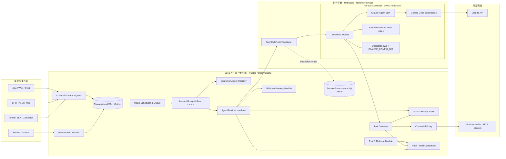
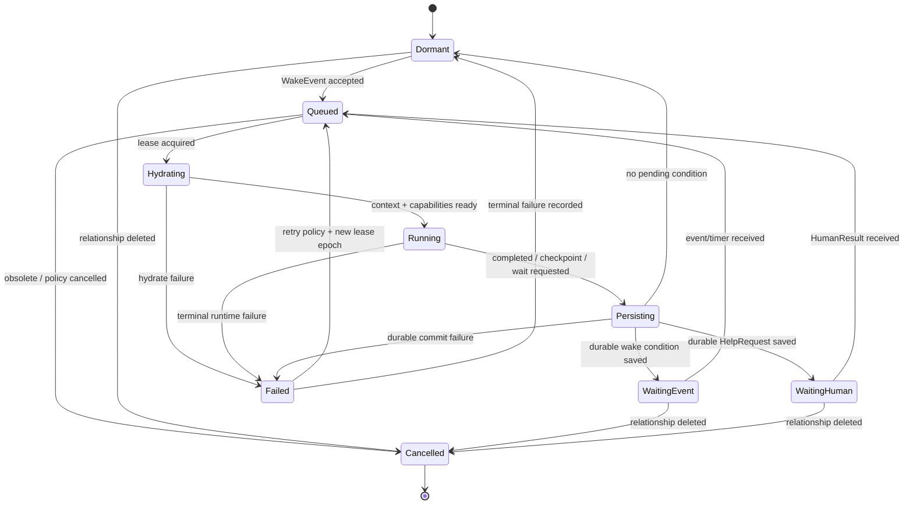
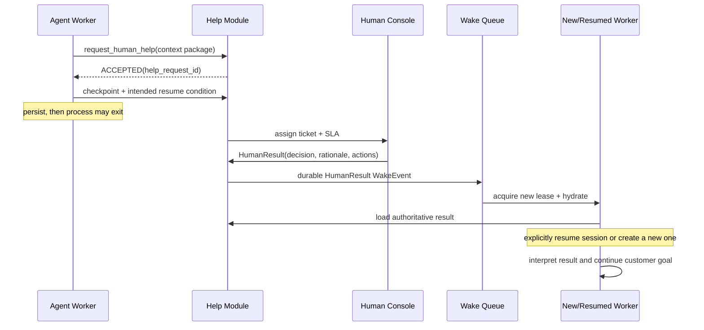

# 用 Claude 生态设计生产级长期 Agent 平台

> 研究日期：2026-08-24
> 推荐路线：**自托管控制平面 + Claude Agent SDK 执行平面**
> 适用对象：需要为每位客户提供长期关系型 Agent，同时要求可审计、可暂停、可恢复、可评测和多租户隔离的平台团队
> 证据范围：Kavak 公开材料的既有研究、Anthropic 官方文档与官方 GitHub 仓库。本文不使用二手博客作为产品事实来源。

## 摘要与架构决策

本文推荐把“每客户一个 Agent”建模为**长期存在的关系身份（Customer-Agent）**，而不是长期驻留的 Claude Code 子进程：事件到达时，控制平面取得该客户的单活租约，装载关系记忆、任务状态与可恢复会话，启动一个隔离的 Agent SDK Worker；运行完成、等待外部事件或转人工后，先持久化业务状态和回执，再释放计算资源。

这条路线的核心分工是：

- **Java 自托管控制平面**拥有客户关系身份、事件、调度、租约、业务任务、长期记忆、工具授权、人工求助、审计与发布决策。
- **TypeScript/Python Agent SDK Worker**拥有一次运行期间的 Claude Code agent loop、短期上下文、工具调用编排与 SDK session 适配。
- **Claude Agent SDK session**只是可轮换的会话连续性载体，不等同于客户身份，也不是业务状态数据库。
- **每个活动 session 对应一个 Claude Code 子进程**；并发 N 个 session 意味着 N 个子进程及其进程树。空闲时应退出，而不是永久占用进程。[Agent SDK Hosting](https://code.claude.com/docs/en/agent-sdk/hosting)

生产设计必须守住七条红线：

1. **Customer-Agent 与 SDK session 不是永久 1:1。** Registry 只保存当前 `active_session_id`、摘要与版本，达到上下文、策略、模型或保留期边界时可以轮换 session。
2. **SessionStore 只做 transcript mirror。** mirror 失败会重试，最终可发出 `mirror_error`、丢弃该批 transcript 而 query 继续；因此任务状态、工具回执和人工求助必须进入控制平面的事务库与 outbox。[Session storage](https://code.claude.com/docs/en/agent-sdk/session-storage)
3. **一位客户最多一个活动运行。** 依靠带 fencing token 的单活 lease 防止旧 Worker 在租约失效后继续提交结果。
4. **所有有副作用的工具必须幂等。** `operation_id`/`idempotency_key`、预期版本、审批引用和持久化 ToolReceipt 是恢复正确性的基础。
5. **MCP 是接入协议，不是授权边界。** 工具网关才负责身份、租户范围、risk tier、审批、限额、回执与审计。
6. **外层容器或 microVM 才是租户边界。** `sandbox-runtime` 是内层最小权限措施；其官方定位仍是 Beta Research Preview，不能替代强隔离。[sandbox-runtime README](https://github.com/anthropic-experimental/sandbox-runtime)
7. **凭据不进入 Agent 沙箱。** Worker 只得到短时、窄权限 capability；真实凭据由沙箱外的 Credential Proxy 注入并限制出口。[Secure deployment](https://code.claude.com/docs/en/agent-sdk/secure-deployment)

因此，推荐把 Agent SDK 当作一个有深度的执行模块，而不是平台本身。平台正确性来自自托管控制平面的 durable state、事务边界、租约、幂等和补偿；Agent SDK 提供强大的非确定性执行能力，但不承担业务系统的强一致职责。

## 证据口径

为避免把不同层次的判断混写，本文使用以下标记：

| 标记 | 含义 |
|---|---|
| **[Kavak 事实]** | 来自仓库内 Kavak 研究稿对其公开材料的归纳；本文不再次把它外推成 Anthropic 产品承诺 |
| **[Anthropic 事实]** | 来自 Anthropic 官方文档、官方 SDK 或官方 GitHub 仓库 |
| **[设计建议]** | 本文基于目标、约束和产品能力做出的架构选择，不是 Anthropic 官方承诺 |
| **[待验证]** | 文档不足、版本差异明显或必须通过本组织 PoC/压测确认 |

功能状态以 2026-08-24 官方页面为准。本文把官方明确标注的 Beta、Research Preview 原样保留；对没有 Beta 标记但仍处于 0.x 的 SDK，不武断称为“长期稳定 GA”，而写作“官方公开能力，需锁版本和兼容测试”。

## 1. 从 Kavak 原则到 Claude 生态

仓库源文：[2026-08-24-kavak-agent-design-research.md](./2026-08-24-kavak-agent-design-research.md)

| Kavak 设计原则 | Claude 生态可承接的能力 | 控制平面必须补齐的职责 | 判断性质 |
|---|---|---|---|
| 每位活跃客户拥有长期 Agent | Agent SDK session 可延续对话，Worker 可 resume；Claude Code 有项目记忆机制 | 稳定的 `customer_agent_id`、关系目标、关系记忆、任务和渠道绑定 | [Kavak 事实] + [Anthropic 事实] + [设计建议] |
| Agent 可运行分钟、小时或天，也会睡眠和唤醒 | SDK 支持本地 session、SessionStore 与长运行/混合托管模式 | 事件队列、定时器、lease、Dormant 状态、显式 hydrate/persist | [Anthropic 事实] + [设计建议] |
| Agent 跨渠道持续理解客户 | SDK transcript 能保存对话连续性 | 渠道归一化、客户解析、来源标记、长期事实与偏好存储 | [设计建议] |
| Agent 有工具、API 和 CLI | Agent SDK 支持内建工具、自定义 MCP 工具、Skills、Plugins、hooks 和权限 | Tool Gateway、凭据代理、风险分级、审批、回执、补偿 | [Anthropic 事实] + [设计建议] |
| Agent 可请求人工帮助，且人处理后 Agent 继续在回路中 | `canUseTool` 可等待输入；TS/headless 可 defer 单次工具调用并 resume | Durable HelpRequest、SLA、人工上下文包、结果事件、显式恢复 | [Anthropic 事实] + [设计建议] |
| 评价最终业务结果，而非只看单轮回答 | Anthropic 生态可导出运行事件、成本估算和 OpenTelemetry | outcome/trajectory/dialogue/safety/SLO 多层评测、发布门禁和回滚 | [设计建议] |

**关键翻译：**Kavak 所说的长期 Agent，其“长期”在**身份、目标、记忆和未完成任务**，不在进程寿命。[Kavak 事实] Agent SDK 官方 Hosting 文档也把 session/进程建模为可按请求启动、长运行或混合式托管；`query()` 会创建独立 Claude Code 子进程。[Anthropic 事实：Agent SDK Hosting](https://code.claude.com/docs/en/agent-sdk/hosting) 因此“长期关系、短命计算”是二者之间最可靠的工程映射。[设计建议]

## 2. Claude 产品能力地图与选型

### 2.1 核心执行与 API

| 能力 | 2026-08-24 状态 | 适合承担什么 | 不应承担什么 | 本方案选择 |
|---|---|---|---|---|
| Claude Agent SDK（TS/Python） | 官方公开 SDK；包仍为 0.x，锁版本 | 在自有进程中提供 Claude Code agent loop，调用模型和工具、处理 compaction/session | 多租户控制平面、业务强一致状态、永久 Agent 身份 | **主执行 Adapter** |
| Claude Code / headless `claude -p` | 官方支持的非交互接口 | CLI 自动化、单任务或兼容性回退；Agent SDK 底层原生运行时 | 直接暴露为跨团队平台协议 | 运维诊断/兼容回退，不作为控制平面 Interface |
| Messages API | 核心 API；单次请求或由调用方提交多轮消息 | 确定性更强的模型调用、自建工具循环、批处理/评审模型 | 自动提供 Claude Code 完整运行时 | **ClientSdkRuntimeAdapter 的底座** |
| Anthropic Java Client SDK | 官方客户端，Java 8+ | Java 控制平面的分类、评审、摘要、轻量工具循环及管理 API | 直接运行 Agent SDK 的 Claude Code loop | 控制平面首选 Client SDK |
| Anthropic TS/Python Client SDK | 官方客户端 | Worker 内补充直接 Messages API 调用、专用评审/抽取 | 与 Agent SDK session 混为同一状态机 | 有明确边界地使用 |
| Managed Agents | **Beta**，`managed-agents-2026-04-01` | Anthropic 托管或自托管 sandbox 的 agent/environment/session/event 抽象 | 当前主控制面的强依赖；把 Beta 状态、数据资格和 API 约束当成稳定承诺 | 仅定义未来 `ManagedAgentsRuntimeAdapter` |

Agent SDK 官方说明其独立 TS/Python 包包含 Claude Code 原生二进制，并运行与 Claude Code 相同的自主循环：模型输出工具调用，运行时执行并回送结果，直到模型完成。[Agent loop](https://code.claude.com/docs/en/agent-sdk/agent-loop) 在托管形态上，应用调用 `query()`，SDK 拉起并监管本地 `claude` 子进程、通过 stdio 通信；这就是 Agent SDK 与 Claude Code/CLI 的直接关系。Java 也可以自己管理 `claude -p`，但会承担进程协议和兼容细节，本方案选择用 TS/Python SDK 把这些细节封装在 Adapter 内。[Agent SDK Hosting](https://code.claude.com/docs/en/agent-sdk/hosting) 官方 Python/TypeScript 仓库在研究时分别处于 0.x 发布线，应进行精确版本锁定、镜像校验与升级回归，而不是依赖浮动最新版。[Python SDK](https://github.com/anthropics/claude-agent-sdk-python) [TypeScript SDK](https://github.com/anthropics/claude-agent-sdk-typescript)

官方没有把“Agent SDK 安装包/内置原生二进制大小”定义为固定容量契约；它会随 SDK/Claude Code 版本、CPU 架构、包管理器缓存和基础镜像变化。生产设计不写死某个下载大小，而是在锁定版本后分别记录下载包、解压目录、容器镜像增量和首次启动临时文件，纳入 SBOM、镜像预算与升级门禁。[设计建议]

Messages API 是无平台会话状态的消息接口：多轮调用由客户端重新提交 `messages`。[Messages API](https://platform.claude.com/docs/en/api/messages/create) Anthropic 提供 Java、TypeScript、Python 等官方 Client SDK；Java SDK支持同步/异步调用与 tool use。[SDK overview](https://platform.claude.com/docs/en/cli-sdks-libraries/overview) [Java SDK](https://platform.claude.com/docs/en/cli-sdks-libraries/sdks/java) 这使“Java 控制平面 + TS/Python Agent Worker”不需要通过非官方 Java Agent SDK 桥接。[设计建议]

Managed Agents 是另一套 Beta 产品面，提供 agents、environments、sessions 与 events；它与本地 Agent SDK 不是同一个运行时。其“self-hosted sandbox”也不等于自托管控制平面：orchestration/control plane 仍在 Anthropic，只把工具执行、文件系统和网络出口放进客户基础设施，工具输入/结果仍流经 Anthropic。[Managed Agents self-hosted sandboxes](https://platform.claude.com/docs/en/managed-agents/self-hosted-sandboxes) [Self-hosted sandbox security](https://platform.claude.com/docs/en/managed-agents/self-hosted-sandboxes-security) 官方当前还说明 Managed Agents 不适用于 ZDR 和 HIPAA BAA 覆盖。[Managed Agents overview](https://platform.claude.com/docs/en/managed-agents/overview) 本方案只预留 Adapter，待稳定性、数据合规、区域、配额和可移植性满足要求后再比较替换。[设计建议]

### 2.2 六类会话与“记忆”机制不能混写

| 机制 | 所属产品/状态 | 数据语义 | 平台定位 |
|---|---|---|---|
| Agent SDK transcript/session | Agent SDK 官方能力 | prompt、模型响应、工具调用/结果等会话历史；不包含文件系统状态 | 短期连续性和可追溯 transcript，不是长期关系真相 |
| Agent SDK SessionStore | Agent SDK 官方能力 | 本地 transcript 的跨主机 mirror | 最佳努力 transcript 存储，不能作为强一致业务状态源 |
| Claude Code `CLAUDE.md` | Claude Code 官方能力 | 人写的项目/用户指令，进入上下文 | Worker/项目说明，不是关系事实库，也不是强制安全配置 |
| Claude Code auto memory | Claude Code 官方能力 | Claude 在本机按项目写入的记忆文件 | 单租户开发体验；生产多租户默认关闭，除非建立隔离和治理 |
| Messages API Memory Tool | **GA** 的 client tool | 模型发出 memory 命令，应用实现持久化和返回结果 | 可作为 RelationMemory Interface 的一个受控工具 Adapter |
| Managed Agents Memory Store | Managed Agents Beta 产品面 | workspace 级文本 memory，挂载进 Managed Agent session | 仅用于未来 ManagedAgentsRuntimeAdapter，不与自托管记忆库混用 |

Claude Code 每个新 session 都有新的上下文；`CLAUDE.md` 是人维护的指令，auto memory 是 Claude 写入的本机项目记忆。二者会进入模型上下文，但不是强制执行的配置；auto memory 可用 `CLAUDE_CODE_DISABLE_AUTO_MEMORY=1` 关闭。[Claude Code memory](https://code.claude.com/docs/en/memory) Agent SDK Hosting 对多租户也明确建议隔离 `CLAUDE_CONFIG_DIR`、`cwd`，并按需关闭 auto memory。[Agent SDK Hosting](https://code.claude.com/docs/en/agent-sdk/hosting)

Messages API Memory Tool 是 client-side tool：应用负责实际读写 `/memories` 存储并回送 tool result。[Memory Tool](https://platform.claude.com/docs/en/agents-and-tools/tool-use/memory-tool) Managed Agents Memory Store 则是 Managed Agents 的 workspace 级持久文本存储，支持 `read_only`/`read_write`，同时官方提醒被写入的 prompt injection 可能跨 session 持续存在；其 memory-store endpoint 使用独立 beta header，不能和 Managed Agents header 混发。[Managed Agents memory](https://platform.claude.com/docs/en/managed-agents/memory) 因此表中的六类机制不得用一个“memory”字段笼统表示。[设计建议]

### 2.3 工具、扩展与控制

| 能力 | 状态 | 正确用途 | 生产注意事项 |
|---|---|---|---|
| Agent SDK 内建/自定义工具 | 官方能力 | 文件、命令、自定义业务能力 | 自定义工具可带 read-only/destructive/idempotent 注解，但注解只是元数据，不是授权执行器 |
| MCP（Agent SDK） | 官方能力 | 通过 stdio/HTTP/SSE 接入工具 | MCP 工具仍需权限；不要用 `bypassPermissions` 代替最小授权 |
| MCP Connector（Messages API） | **Beta** | API 直接连接远程 MCP server | 与 Agent SDK 本地/远程 MCP 配置是不同产品面 |
| Skills | 官方能力 | `SKILL.md` 的渐进式能力说明与资源 | `allowed_tools`/技能过滤不构成文件沙箱；Bash/Read 仍可能读取文件 |
| Plugins | 官方能力 | 本地目录打包 Skills、agents、hooks、MCP | SDK 只接收本地插件路径；不是租户授权或供应链信任边界 |
| Hooks | 官方能力 | 在生命周期点观察、阻断、修改、记录 | TS/Python 能力有差异；安全关键规则仍应由确定性网关执行 |
| Permissions | 官方能力 | hooks、deny、mode、allow、`canUseTool` 的分层决策 | `allowedTools` 是预批准，不等于从模型可见集合删除；`bypassPermissions` 风险高 |

相关官方文档：[Custom tools](https://code.claude.com/docs/en/agent-sdk/custom-tools)、[MCP in Agent SDK](https://code.claude.com/docs/en/agent-sdk/mcp)、[Skills](https://code.claude.com/docs/en/agent-sdk/skills)、[Plugins](https://code.claude.com/docs/en/agent-sdk/plugins)、[Hooks](https://code.claude.com/docs/en/agent-sdk/hooks)、[Permissions](https://code.claude.com/docs/en/agent-sdk/permissions)。

本方案在 SDK permissions 之外增加 Tool Gateway。原因是 permissions 适合一次 Worker 内的工具决策，而平台还需要跨 Worker 的租户身份、业务版本、预算、审批、幂等与回执；这些不能依赖模型提示或本地配置保持一致。[设计建议] 尤其 `allowedTools` 是自动批准列表，不是可见工具的安全 allowlist；未列工具仍可能进入 permission flow。无人值守运行应组合 `dontAsk`、`disallowedTools` 和确定性的 `PreToolUse`/Gateway 策略，而不是打开 `bypassPermissions`。[Permissions](https://code.claude.com/docs/en/agent-sdk/permissions)

### 2.4 上下文、成本与认证

| 能力 | 状态 | 选择结论 |
|---|---|---|
| Agent SDK tool search | 官方 SDK 能力，默认行为有平台/模型/代理差异 | 可减少初始工具定义；部署前验证代理兼容和回退行为 |
| Messages API Tool Search Tool | **GA** | 适合 `ClientSdkAdapter`，不要与 SDK 内工具搜索行为混成一个配置 |
| Prompt caching | 官方稳定能力 | 用于稳定前缀降时延/成本，但不会降低上下文占用；监控命中率 |
| Context editing | **Beta**，`context-management-2025-06-27` | 仅纳入 `ClientSdkAdapter` 试点；不能默认声称 Agent SDK 原样透传 |
| Server-side compaction | **Beta**，`compact-2026-01-12` | 与 Claude Code/Agent SDK 自身 compaction 区分；仅 Messages API Adapter 试点 |
| Programmatic tool calling | **GA** 的 Messages API 能力，受模型/代码执行/数据保留约束 | 仅用于窄场景 `ClientSdkAdapter`；是否能与 Agent SDK 同时使用标为待验证 |
| OpenTelemetry | metrics/logs 官方能力；enhanced traces **Beta** | 统一 trace，但 telemetry 丢失不能改变业务状态正确性 |
| Agent SDK `total_cost_usd` | 客户端估算 | 运行内预警可用；不能作为账单、对客计费或财务结算依据 |
| Workload Identity Federation | 官方认证能力 | 控制平面/Credential Proxy 用 OIDC 换短期 token，避免长期 API key；验证 scope 和凭据优先级 |

Agent SDK tool search 会按需暴露工具，官方也记录了不支持模型、第三方 provider 或某些代理条件下的回退，必须在目标环境验证。[Agent SDK tool search](https://code.claude.com/docs/en/agent-sdk/tool-search) Messages API 的 Tool Search Tool 状态应以官方工具参考为准。[Tool reference](https://platform.claude.com/docs/en/agents-and-tools/tool-use/tool-reference)

Prompt caching 缓存匹配的 prompt 前缀，可降低延迟和输入成本，但缓存内容仍计入上下文窗口。[Prompt caching](https://platform.claude.com/docs/en/build-with-claude/prompt-caching) Context editing 和 server-side compaction 是 Messages API 的独立 Beta 能力；Claude Code/Agent SDK 运行时也有自己的 compaction 行为，不能因名称相似就视为同一实现。[Context editing](https://platform.claude.com/docs/en/build-with-claude/context-editing) [Server-side compaction](https://platform.claude.com/docs/en/build-with-claude/compaction) Programmatic tool calling 当前为 GA，但依赖代码执行环境且不是 ZDR eligible；状态为 GA 不改变本方案的边界，它仍只放入直接 API Adapter 的受控试验。[Programmatic tool calling](https://platform.claude.com/docs/en/agents-and-tools/tool-use/programmatic-tool-calling)

Agent SDK 的成本字段使用随包发布的价格表计算，官方明确其可能落后于当前定价；权威数据来自 Usage and Cost API 或 Console。[Cost tracking](https://code.claude.com/docs/en/agent-sdk/cost-tracking) OpenTelemetry 导出失败也可能静默丢数据，因此成本、审计和业务回执不能只依赖 telemetry。[Observability](https://code.claude.com/docs/en/agent-sdk/observability)

Agent SDK 可以使用 `ANTHROPIC_API_KEY`/`ANTHROPIC_AUTH_TOKEN` 等标准认证配置；开发和 PoC 可直接注入 API key。生产推荐让沙箱外的 Credential Proxy 使用 Workload Identity Federation，以 OIDC 换取可自动刷新的短期 bearer token，再代理 Claude API 出口；只有经过风险评审的部署才把短时 token 直接交给 Worker。构造器凭据或上述环境变量优先于 federation，甚至空的 API key 环境变量也会阻断回退，因此镜像启动检查应验证凭据解析。[Authentication](https://platform.claude.com/docs/en/manage-claude/authentication) [WIF reference](https://platform.claude.com/docs/en/manage-claude/wif-reference)

### 2.5 相关官方参考实现，不是生产产品

- [`anthropics/cwc-long-running-agents`](https://github.com/anthropics/cwc-long-running-agents) 展示长运行 harness 的若干原语：默认失败（default-FAIL）契约、fresh-context evaluator 和 handoff。其 README 明确这是“配料示例”而不是 turnkey harness，是活动演示且不维护。可借鉴失败默认值与独立评审思想，不能直接部署为平台。
- [`anthropics/defending-code-reference-harness`](https://github.com/anthropics/defending-code-reference-harness) 展示自治发现、验证、报告和修复流水线，并用 gVisor 隔离 agent、用新上下文 verifier 复核。它也是不维护的参考仓库，不是托管产品。本文据此推导“可信的确定性 orchestrator 包围被隔离的非确定性 Agent”这一设计模式。[设计建议]

## 3. 领域模型与总体架构

### 3.1 统一语言

| 术语 | 精确定义 | 明确不是什么 |
|---|---|---|
| Customer-Agent | 客户与平台之间的长期关系身份、目标与策略主体 | 不是进程、容器、prompt 或单个 SDK session |
| Run | 由一个或一组 WakeEvent 触发的一次有界执行 | 不是长期关系本身 |
| SDK Session | Agent SDK 的可恢复会话 transcript 标识 | 不是客户主键，不是业务事务 |
| Worker | 承载一次活动 Run 的 TS/Python 进程及 Claude Code 子进程 | 不拥有永久业务状态 |
| WakeEvent | 触发 Customer-Agent 唤醒的规范事件 | 不是直接塞入 prompt 的任意 JSON |
| RelationMemory | 经治理的客户事实、偏好、约束和摘要 | 不是全量聊天记录，也不是 Claude Code auto memory |
| TaskState | 未完成业务任务的 durable 状态机 | 不是 transcript 中的一段自然语言 |
| ToolCommand | 对外部系统执行读/写的规范化请求 | 不是数据库连接或任意 shell |
| ToolReceipt | 工具执行结果、外部引用和幂等证明 | 不是可丢失日志 |
| HelpRequest | Agent 请求人工判断或动作的 durable 工单 | 不是一个挂起内存 Promise |
| Lease | 限定时长且带 fencing token 的单活执行权 | 不是普通分布式锁布尔值 |

上述边界是架构正确性的基础。尤其是 `Customer-Agent ≠ SDK Session ≠ Worker Process`，任何把三者共用一个 ID 或生命周期的实现都会造成扩缩容、合规删除和恢复困难。[设计建议]

### 3.2 总体架构



### 3.3 Deep Module 原则

本设计把 `AgentRuntime` 作为最重要的 **Seam**：控制平面只看到领域命令和规范事件，不看到 Agent SDK 的原始消息 union、CLI stderr、content block 或版本字段。`AgentSdkRuntimeAdapter` 在 Seam 后吸收 SDK 版本差异、消息翻译、session resume、hooks、子进程和 transcript mirror 的复杂度。

- **Module**：按业务所有权划分，模块内部可同时拥有代码、表、队列消费者和策略。
- **Interface**：用少量稳定的领域命令/事件表达能力，不暴露供应商类型。
- **Seam**：`AgentRuntime`、`ToolGateway`、`RelationMemory` 和 `Help` 是可替换实现边界。
- **Adapter**：`AgentSdkRuntimeAdapter`、`ClientSdkRuntimeAdapter`、未来的 `ManagedAgentsRuntimeAdapter` 把外部产品语义翻译成内部协议。
- **Depth**：Runtime Interface 很小，但内部封装进程、会话、权限、hook、超时、成本与版本兼容，属于深模块。
- **Locality**：lease 判定集中在 Scheduler/Lease Module，工具授权集中在 Tool Gateway，记忆写入规则集中在 Relation Memory；不能散落到 prompt、hook 和业务服务三处。

删除测试：若替换 Agent SDK，控制平面的 Registry、任务、记忆、工具回执、人工工单、评测和审计不应被删除；只替换 Runtime Adapter 和少量能力协商。这是防止供应商运行时渗漏的验收标准。[设计建议]

## 4. 控制平面 Modules

### 4.1 Channel & Event Ingress

职责：认证渠道、解析 `tenant_id/customer_id`、去重、规范化时间与来源、把原始大 payload 存对象存储并生成 `payload_ref`，再通过同一事务写入 inbox/outbox。它不直接启动 Worker，也不把外部文本当系统指令。

关键规则：

- 外部 `event_id` 与平台 `idempotency_key` 分离；渠道重试必须落到同一逻辑事件。
- 用户文本、CRM 字段、网页内容一律视为不可信数据，并保留 provenance。
- 大附件先做类型、恶意内容和敏感数据扫描，再生成受时限约束的读取 capability。

### 4.2 Customer-Agent Registry

Registry 是长期关系的目录，不保存完整 transcript。最小状态包括：

```text
CustomerAgent {
  customer_agent_id, tenant_id, customer_id,
  relationship_goal_ref, policy_version,
  lifecycle_state, relationship_version,
  active_session_id?, session_summary_ref?, session_generation,
  next_wake_at?, open_task_count,
  memory_snapshot_version, last_completed_run_id?,
  created_at, updated_at, deletion_state
}
```

`active_session_id` 可以为空或被轮换。轮换触发器至少包括：上下文质量下降、策略/工具集合不兼容、模型迁移、保留期限、session 文件丢失或安全事件。轮换前生成有来源的 session summary；恢复时由 Memory Module 重新装载事实和任务，而不是依赖旧 transcript 存活。[设计建议]

### 4.3 Wake Scheduler、Queue 与 Lease

Scheduler 将事件、定时器、人工结果和工具回调合并为 Run。Lease Module 原子地授予：

```text
Lease {
  customer_agent_id,
  run_id,
  lease_epoch,          // 单调递增 fencing token
  owner_worker_id,
  acquired_at,
  expires_at,
  heartbeat_at
}
```

所有改变业务状态的提交都携带 `lease_epoch`。数据库只接受等于当前 epoch 的写入；因此旧 Worker 即使网络恢复，也不能覆盖新 Run 的结果。事件可以合并，但不同客户之间不共享 cwd 或 session。[设计建议]

### 4.4 Runtime Interface 与 Adapters

以下是说明性接口，不是某种语言的具体实现计划：

```java
interface AgentRuntime {
    RunStream execute(RunCommand command);
    void cancel(CancelCommand command);
    RuntimeCapabilities capabilities(RuntimeProfile profile);
}

record RunCommand(
    String runId,
    String customerAgentId,
    long leaseEpoch,
    RuntimeProfile profile,
    Optional<String> resumableSessionId,
    ContextBundle context,
    List<ToolCapability> capabilities,
    RunLimits limits,
    TraceContext trace
) {}

sealed interface RunEvent {
    record Started(String runId, String runtimeSessionId) implements RunEvent {}
    record Progress(String runId, ProgressSummary summary) implements RunEvent {}
    record ToolRequested(String runId, ToolCommand command) implements RunEvent {}
    record HelpRequested(String runId, HelpRequest request) implements RunEvent {}
    record Checkpointed(String runId, Checkpoint checkpoint) implements RunEvent {}
    record Completed(String runId, RunOutcome outcome) implements RunEvent {}
    record Failed(String runId, FailureClass failure) implements RunEvent {}
}
```

`RunEvent` 故意不包含 SDK 的 `AssistantMessage`、`ResultMessage`、content block 或 CLI 消息。Adapter 内部维护供应商消息到领域事件的映射，并把未识别消息作为版本兼容告警，而不是让 Java 服务被迫升级其领域协议。[设计建议]

Adapter 组合：

- `AgentSdkRuntimeAdapter`：主路径，负责创建隔离目录、传入最小 settings、启动 query、处理 hooks、翻译流事件、resume/轮换 session、终止进程。
- `ClientSdkRuntimeAdapter`：直接调用 Messages API，用于确定性摘要、分类、评审、窄工具循环，以及 context editing/programmatic tool calling 等已明确属于 API 的能力。
- `ManagedAgentsRuntimeAdapter`：未来可选，只有 capability/status/合规门禁通过后启用。

### 4.5 Relation Memory Module

提供按用途检索、候选写入、冲突消解、删除和快照 Interface。它不向 Worker 暴露底层向量库/关系库，也不让模型直接覆盖确认事实。详见第 6 节。

### 4.6 Session Mapping 与 Transcript Storage

模块维护 `customer_agent_id → active_session_id` 的版本化映射，以及 transcript 的最佳努力副本。官方 SessionStore 是本地 transcript 的 mirror：subprocess 先写本地，SDK 再调用 store；append 失败最多重试后会发出 `mirror_error` 并丢弃 batch，query 继续。对从 store 恢复的运行，结束后本地副本还可能删除。[Session storage](https://code.claude.com/docs/en/agent-sdk/session-storage)

所以必须明确：

- SessionStore 允许断档，承担调试和会话恢复价值，不承担订单/退款/预约/审批的事实价值。
- 自定义 SessionStore 按 `entry.uuid` 去重，并实现租户、保留、删除、加密和访问审计。
- SessionStore 的 lookup key 与工作目录相关；resume 时要恢复一致的逻辑 `cwd` 映射。即使 transcript 成功恢复，文件系统 artifact 也不会随 session 自动恢复。[Sessions](https://code.claude.com/docs/en/agent-sdk/sessions) [Session storage](https://code.claude.com/docs/en/agent-sdk/session-storage)
- session resume 失败时，平台可以用受治理摘要 + durable task/memory 创建新 session。
- tool result 的 transcript 不等同于 ToolReceipt；后者必须事务落库。

### 4.7 Tool Gateway 与 Credential Proxy

Tool Gateway 暴露 agent-ready Interface，执行 schema 校验、身份映射、risk tier、限额、审批、幂等、外部调用、回执与审计。Credential Proxy 位于 Agent 容器外，把 capability 换成真实凭据，并按目标 host/path/method 限制出口。

它们共同保证即使 prompt injection 驱使模型调用工具，最坏结果仍被确定性政策约束。Agent SDK 官方安全文档也要求假设 prompt injection 与模型错误会发生，使用隔离、最小权限和沙箱外凭据代理。[Secure deployment](https://code.claude.com/docs/en/agent-sdk/secure-deployment)

### 4.8 Human Help Module

拥有 durable `HelpRequest`、队列、SLA、分派、人工结果、超时升级和 resume event。它不依赖 Worker 进程一直活着。详见第 8 节。

### 4.9 Eval & Release Module

拥有数据集版本、评审器版本、离线回放、shadow/canary/A-B 分配、阈值、回滚和困难样本闭环。它消费规范化 RunEvent、ToolReceipt 和业务结果，不解析某个 SDK 的原始消息来决定生产发布。

### 4.10 Observability & Audit Module

将 `tenant_id/customer_agent_id/run_id/lease_epoch/session_id/tool_operation_id/help_request_id` 相关联；安全审计进入不可变存储，运行指标进入 OTel。telemetry 可丢失，审计与业务记录不能依赖 OTel exporter 成功。[Agent SDK observability](https://code.claude.com/docs/en/agent-sdk/observability)

## 5. 运行生命周期与恢复状态机



### 5.1 状态语义

- **Dormant**：无活动计算；关系身份、记忆、任务仍存在。
- **Queued**：至少一个事件已 durable 入队，但尚未获得客户单活 lease。
- **Hydrating**：装载 Registry、task、记忆、session 映射、策略、工具能力和工作目录。
- **Running**：恰好一个持有有效 lease 的 Worker 执行。
- **WaitingHuman**：HelpRequest 已落库，Worker 可退出；等待 HumanResult 唤醒。
- **WaitingEvent**：唤醒条件已落库，Worker 可退出；等待 webhook/timer/业务事件。
- **Persisting**：先提交业务状态、ToolReceipt、摘要、下一唤醒与 outbox，再确认 Run 完成。
- **Failed**：失败已分类并落库；是否重试由确定性策略决定。
- **Cancelled**：业务取消、关系删除或政策终止；后续回调只能进入审计/补偿，不可重新激活。

### 5.2 一次运行的顺序

1. Ingress 事务写 `WakeEvent + inbox/outbox`，重复事件返回原处理状态。
2. Scheduler 按租户公平性和优先级选取事件，原子取得 `lease_epoch`。
3. Hydrator 读取 Registry 版本、开放任务、关系记忆、已确认 ToolReceipt、可恢复 session 与策略快照。
4. Runtime Adapter 创建独立 cwd/配置目录，启动一个 session 对应的 Claude Code 子进程。[Agent SDK Hosting](https://code.claude.com/docs/en/agent-sdk/hosting)
5. Worker 只能通过能力清单调用 Tool Gateway；每个 command 先有 `operation_id`。
6. 等待人工/外部事件时，先写 durable wait record 和 outbox，再结束 query/容器。
7. 完成时进入 Persisting；以 `lease_epoch + expected relationship_version` 条件提交任务、记忆候选、回执引用、session mapping 和后续事件。
8. commit 成功后释放 lease；commit 不确定时不得重新执行外部副作用，只能查 ToolReceipt/外部幂等接口后恢复。

### 5.3 超时、取消和恢复

超时分四层：queue deadline、run wall-clock、单工具 deadline、人工 SLA。运行超时先停止接受新工具命令，再请求 Runtime cancel，最后由容器运行时强制终止进程树。取消不是删除：已产生的 ToolReceipt、审计和补偿任务继续保留。

恢复遵循“先事实，后 transcript”：先读取 durable TaskState/ToolReceipt/HelpResult，再尝试 resume SDK session；session 不可用时用 `session_summary + memory snapshot + open tasks` 建新 session。这样会话连续性损失只影响表达上下文，不破坏业务正确性。[设计建议]

## 6. 会话、上下文与长期记忆分层

### 6.1 六层状态

| 层 | 典型内容 | 权威来源 | 生命周期 | 注入方式 |
|---|---|---|---|---|
| L1 Run working context | 当前事件、临时计划、最近 tool result | Worker/SDK | 一次 Run | 直接上下文，严格预算 |
| L2 SDK session transcript | prompt、回答、工具轨迹 | Agent SDK transcript/SessionStore | 可恢复、可轮换、有保留期 | resume 或近期摘要 |
| L3 客户事实与偏好 | 联系偏好、长期目标、确认约束 | Relation Memory + 业务主数据 | 跨 session，受同意/删除约束 | 按任务检索的 MemoryPacket |
| L4 任务状态 | 订单处理、报价、预约、待审批、wake condition | 控制平面事务库 | 直到完成/取消/合规保留 | 结构化 TaskPacket |
| L5 领域知识 | 政策、产品、流程、操作手册 | 版本化知识库/Skills | 按发布版本 | 检索、技能或工具 |
| L6 操作账本与审计 | ToolCommand/Receipt、审批、lease、策略决策 | 事务库 + 不可变审计 | 法规/风控保留期 | 默认不进 prompt，按需摘要 |

L1/L2 帮助模型保持对话连续性；L3-L6 保证关系和业务连续性。只有 L2 由 SDK session 直接承载，且 SessionStore 仍是最佳努力 mirror。把全部历史回灌 prompt 会扩大成本、延迟、隐私暴露和 prompt injection 持久性，因此禁止作为默认恢复策略。[设计建议]

### 6.2 记忆写入门控

模型只能提出 `MemoryCandidate`，不能直接覆盖确认事实：

```text
MemoryCandidate {
  candidate_id,
  customer_agent_id,
  kind,                    // fact | preference | constraint | summary
  value,
  source_refs[],           // channel event / business record / human result
  observed_at,
  confidence,
  consent_basis?,
  sensitivity,
  proposed_ttl?,
  expected_memory_version,
  proposer_run_id
}
```

写入策略：

- **来源优先**：业务主数据和用户明确陈述高于模型推断；摘要不能反向成为比原始记录更强的事实。
- **置信度分层**：推断偏好默认是 provisional；达到确认门槛或由用户/人工确认才升级。
- **同意和目的限制**：敏感事实要求合法的 consent/purpose；检索也按用途裁剪。
- **TTL**：短期意图、位置、临时偏好默认过期；长期偏好定期再确认。
- **删除**：按客户和 source lineage 删除事实、派生摘要与索引；审计保留需单独合法依据和访问隔离。
- **冲突消解**：不静默覆盖；保留版本、来源、有效时间，必要时生成澄清任务。
- **安全**：外部文本和 Managed/auto memory 均可能固化 prompt injection；写入前做内容分类，运行时把 memory 当数据而非指令。

### 6.3 上下文装配

Hydrator 按任务装配 `ContextBundle`：

```text
ContextBundle {
  relationship_goal,
  policy_digest,
  current_events[],
  open_tasks[],
  relevant_memories[],
  recent_receipts[],
  knowledge_refs[],
  prior_session_summary?,
  provenance_map,
  token_budget
}
```

采用渐进式披露：先给索引、摘要和少量高相关事实；需要原文时通过只读工具查询。上下文预算要分别限制事件、记忆、知识、工具定义和 transcript，不能只看总 token。[设计建议]

## 7. Agent-ready Tools 与授权边界

### 7.1 Interface 设计

工具必须贴近 Agent 的意图，而不是复制内部数据库表或微服务 RPC。例如：

- 好：`get_customer_open_commitments(customer_id)`、`propose_refund(order_id, reason, amount)`。
- 差：`execute_sql(query)`、`update_order_table(fields)`、把 60 个内部 API 原样暴露。

使用 query/command 分离：

- Query 无副作用、可缓存、可并行，返回稳定语义和 provenance。
- Command 可能产生副作用，必须有幂等键、risk tier、审批策略、预期版本和 durable receipt。

Schema 要窄：枚举代替自由文本动作，金额包含 currency，时间包含 timezone，资源必须带 tenant/customer scope。工具描述说明成功、拒绝和可重试语义，不能让模型靠错误字符串猜测状态。[设计建议]

### 7.2 Command 与 Receipt

```json
{
  "operation_id": "op_01...",
  "idempotency_key": "tenant/customer/task/action/version",
  "tenant_id": "t_123",
  "customer_agent_id": "ca_456",
  "run_id": "run_789",
  "lease_epoch": 42,
  "tool": "issue_refund",
  "risk_tier": "HIGH",
  "arguments": {"order_id": "o_1", "amount": {"value": "25.00", "currency": "USD"}},
  "expected_resource_version": 7,
  "approval_ref": "approval_...",
  "deadline": "2026-08-24T10:15:00Z"
}
```

```json
{
  "operation_id": "op_01...",
  "status": "SUCCEEDED",
  "effect": "REFUND_ACCEPTED",
  "external_reference": "refund_abc",
  "resource_version": 8,
  "committed_at": "2026-08-24T10:14:01Z",
  "result_digest": "sha256:...",
  "compensation": {"supported": false},
  "policy_version": "tool-policy-31"
}
```

Tool Gateway 在调用外部系统前写 operation intent，在获得确定结果后写 receipt + outbox。网络超时且提交状态未知时返回 `UNKNOWN_COMMIT`，恢复流程按 `operation_id` 查询，不允许模型换一个 id 重试。外部系统若不支持幂等，需要本地单次执行器、状态查询或人工确认；“再调一次”不是补偿策略。[设计建议]

### 7.3 Risk tier 与审批

| 层级 | 例子 | 默认控制 |
|---|---|---|
| R0 只读 | 查公开政策、读客户自己的订单 | scope 校验、审计、速率限制 |
| R1 可逆低风险 | 保存草稿、添加标签 | 幂等、版本检查、自动补偿 |
| R2 有限业务影响 | 改预约、发优惠券 | 规则审批、额度、事后采样 |
| R3 高风险/不可逆 | 退款、签约、身份变更、对外承诺 | 明确人工审批、多因素证据、严格额度 |
| R4 禁止自治 | 法律结论、超授权资金动作、越租户访问 | 拒绝并转人工 |

SDK 的 tool annotations 有助于模型和 runtime 理解只读、破坏性、幂等等属性，但官方明确这些是注解信息；真正的 enforcement 应在 Tool Gateway。[Custom tools](https://code.claude.com/docs/en/agent-sdk/custom-tools)

### 7.4 MCP 的位置

MCP server 是 `ToolGatewayAdapter` 的一种实现：它统一工具发现和调用协议，但不天然证明调用者身份、租户范围、业务授权、幂等或审批。任何第三方 MCP server 都必须位于 Gateway 之后，或由 Gateway 包装；Agent 不直连数据库，不获得数据库账号。[设计建议]

## 8. 人工求助与显式恢复

### 8.1 `request_human_help` 工具

```text
request_human_help {
  help_request_id,
  customer_agent_id,
  run_id,
  category,
  question,
  options?,
  recommended_action?,
  evidence_refs[],
  risk_tier,
  response_schema,
  sla_deadline,
  resume_policy
}
```

工具返回 `ACCEPTED(help_request_id)` 即表示工单已 durable 创建，不表示人工已经回答。Agent 随后产生 checkpoint，运行进入 Persisting → WaitingHuman，Worker 可以释放。

人工上下文包必须包含：客户目标、待决定问题、可选动作、模型建议及不确定性、相关业务事实、工具回执、政策版本、允许披露的对话片段。避免把全量 transcript 默认交给人工，遵守最小披露。[设计建议]

### 8.2 Agent 留在回路中的流程



人工不是把 Agent 替换掉：HumanResult 会重新唤醒同一 Customer-Agent；Agent读取人工已采取的动作和回执，更新任务并继续后续沟通。[设计建议，与 Kavak 原则一致]

### 8.3 TS defer 只是优化

Claude Code headless hooks 支持把一次工具调用 defer，进程以 `tool_deferred` 退出，之后显式 resume。但官方限制很具体：只在非交互 `claude -p` 生效；仅当该轮只有一个 tool call 时有效，多 tool call 会忽略 defer；恢复时工具不可用会得到 `tool_deferred_unavailable`；本地保留也有清理行为。[Claude Code hooks: defer](https://code.claude.com/docs/en/hooks)

因此：

- defer 可以作为 TS `AgentSdkRuntimeAdapter` 的成本/资源优化。
- 正确性不能依赖 defer 是否被特定 SDK 版本接受。
- durable HelpRequest、checkpoint 和 HumanResult 始终由外部 Help Module 持有。
- resume 必须是显式动作；若原 session 或工具版本不兼容，则创建新 session 并注入权威结果。
- Python 或其他 Adapter 缺少等价能力时，走“持久化后结束 query，再由事件重启”的通用路径。

## 9. 隔离、凭据与 Prompt Injection

### 9.1 分层安全模型

```text
Tenant boundary       : per-tenant/per-run container, gVisor or microVM
Process boundary      : one active session -> one subprocess/process tree
Inner sandbox         : sandbox-runtime file/network/socket minimum policy
Workspace boundary    : unique cwd + unique CLAUDE_CONFIG_DIR
Tool boundary         : Tool Gateway risk/identity/idempotency/approval
Credential boundary   : external Credential Proxy + short-lived capability
Data boundary         : tenant-scoped stores, encryption, deletion lineage
Model boundary        : untrusted content labeling, minimal context, output validation
```

Agent SDK 官方安全部署文档明确要求把 Agent 放进容器/VM，凭据留在沙箱外，通过代理实施最小权限和出口控制。[Secure deployment](https://code.claude.com/docs/en/agent-sdk/secure-deployment) `sandbox-runtime` 提供 macOS/Linux/Windows 的 OS 级文件、网络和 socket 限制，但 README 把它标成 Beta Research Preview，API/配置仍可能变化。其网络和写入默认是 allow-only，但文件读取策略不是“默认什么都看不见”，需要显式 deny 广域路径再只开放工作区；README 也提醒 allowed domain、domain fronting 和 Unix socket（例如 Docker socket）可能形成绕过。[sandbox-runtime](https://github.com/anthropic-experimental/sandbox-runtime)

所以 sandbox-runtime 是**内层防线**，不是跨租户强隔离。生产租户边界至少使用独立容器 + gVisor，风险更高时使用 microVM；绝不把 Docker socket、宿主凭据目录或共享可写工作区挂进沙箱。[设计建议]

### 9.2 文件与本地状态隔离

官方 Hosting 文档说明 transcript、`CLAUDE.md`、auto memory 和工作文件会落本地；并发 session 默认还可能使用同一个 cwd。[Agent SDK Hosting](https://code.claude.com/docs/en/agent-sdk/hosting) 每个活动 session 必须拥有：

- 独立、不可复用的 `cwd`；只挂载该任务需要的数据。
- 独立 `CLAUDE_CONFIG_DIR`；禁止跨租户共享 transcript/config。
- `settingSources: []` 或经过白名单的明确 settings 来源；这仍不是完整沙箱，managed policy、`~/.claude.json` 等其他配置面也要在镜像和挂载层隔离。
- 默认 `CLAUDE_CODE_DISABLE_AUTO_MEMORY=1`；启用必须绑定租户、保留、删除和安全扫描。
- 只读基础镜像；临时写层按 Run 销毁，需保留的 artifact 经扫描后外置。

同 cwd 并发是明确的冲突风险：文件覆盖、git lock、配置和 auto memory 污染都可能发生。即使是同一客户，也依靠单活 lease 串行运行；跨客户绝不能共享可写 cwd。[设计建议]

操作系统会隔离不同子进程的堆内存，但 Claude 的“记忆”主要通过 transcript、配置目录、auto memory 和工作文件落盘；这些不会因为启动了多个子进程就自动按租户隔离。只有同时隔离容器、`cwd`、`CLAUDE_CONFIG_DIR`、挂载和 SessionStore key，才能得到完整的会话与本地状态隔离。[设计建议]

### 9.3 凭据与出口

Worker 得到的不是供应商 API key 或业务系统密钥，而是短时 capability token，至少绑定：tenant、customer、tool、resource scope、method、risk tier、run_id、lease_epoch、过期时间和次数。Credential Proxy 检查 capability 后，为 Claude API 或业务 API 注入真实凭据，并记录目标和响应摘要。

Credential Proxy 优先使用 Workload Identity Federation 的短期 token；同时要清理其运行环境中可能抢占 federation 的 API key 环境变量。[WIF reference](https://platform.claude.com/docs/en/manage-claude/wif-reference) 业务系统若不能支持动态 token，也由 Proxy 持有静态密钥，Agent 沙箱不见密钥值。若某个部署不得不让 Worker 直连 Claude API，只交付最短有效期和最小 scope 的 token，并承认这是相对外置代理更弱的凭据边界。[设计建议]

### 9.4 假设 Prompt Injection 一定会发生

不以“提示模型不要泄露”作为安全控制。网页、邮件、客户文本、工具结果、Skills、memory 都可能含恶意指令。确定性边界必须保证：模型即使被劫持，也无法越租户读取、扩大 scope、绕过审批、重复副作用或取出真实凭据。Managed Agents Memory 官方也特别警告持久 memory 可让注入跨 session 持续。[Managed Agents memory](https://platform.claude.com/docs/en/managed-agents/memory)

## 10. 并发调度、容量与成本

### 10.1 单活与进程模型

Agent SDK `query()` 会生成单独的 Claude Code CLI 子进程；一个 session 映射一个 subprocess，并发 N 个 session 即 N 个进程树和 transcript。[Agent SDK Hosting](https://code.claude.com/docs/en/agent-sdk/hosting) 推荐：

- Customer-Agent 粒度单活 fenced lease。
- 每个活动 session 一个 Worker sandbox/子进程；禁止一个 SDK session 被两个 Worker 同时 resume。
- 事件在 lease 前聚合，运行中到达的新事件写队列；是否追加到当前 Run 由确定性策略决定。
- 不依靠 PID 代表 Agent 身份；Worker 重启后仍是同一 Customer-Agent 的新 Run。

### 10.2 队列与公平性

队列至少实现：

- 优先级：安全/人工 SLA/客户实时消息高于批量维护。
- 租户公平：weighted fair queue 或 per-tenant virtual queue，防止大租户挤压。
- 并发限制：全局、tenant、customer、runtime profile 四层 semaphore。
- Claude API 限制：RPM、input/output token、并发和组织预算同时检查。
- 业务工具限制：按外部系统的 quota/circuit breaker 独立控制。
- 背压：超过 queue age/SLO 时降级非关键唤醒、合并事件、拒绝低优先级任务，而不是无限排队。

### 10.3 容量模型

官方建议初始至少为每个 Agent SDK 容器预留约 1 GiB RAM、5 GiB 磁盘和 1 CPU，但也明确要求用真实负载测量峰值 RSS；其主机内存估算为：

```text
memory_concurrency
  = floor((host_memory - host_overhead) / measured_session_memory_ceiling)
```

[Agent SDK Hosting](https://code.claude.com/docs/en/agent-sdk/hosting)

平台可用的实际并发是多个瓶颈的最小值：

```text
effective_concurrency = min(
  memory_concurrency,
  cpu_concurrency,
  sandbox_slots,
  claude_api_concurrency,
  token_budget_concurrency,
  tool_gateway_concurrency,
  tenant_policy_concurrency
)
```

对平均到达率 `λ`、平均活动时间 `W`，基础活动量约为 `L = λW`；生产容量还要乘峰值系数并留出故障/发布余量。长人工等待不计入 `W`，因为状态持久化后 Worker 退出。[设计建议]

### 10.4 成本模型

```text
run_cost_estimate =
    model_input_tokens  * input_rate
  + model_output_tokens * output_rate
  + cache_write/read_cost
  + api_tool_cost
  + sandbox_compute_seconds * compute_rate
  + storage_and_egress
  + human_help_minutes * labor_rate
```

按 `tenant/customer_agent/run/tool` 归集：预算门禁使用保守 token 上限和组织级权威使用数据；SDK `total_cost_usd` 只做近实时估算，不能作为正式账单。[Cost tracking](https://code.claude.com/docs/en/agent-sdk/cost-tracking)

### 10.5 冷启动与预热

先采用按事件冷启动，测量镜像拉取、容器创建、SDK/CLI 初始化、session hydrate 和首 token 延迟。只对高概率实时队列维持小型预热池；预热实例不能预装租户凭据、cwd 或 memory。预热优化不能改变“每 Run 独立状态、每客户单活”的边界。[设计建议]

## 11. 评测、发布与困难样本闭环

### 11.1 五层指标

| 层 | 核心问题 | 例子 |
|---|---|---|
| 业务结果 | 是否完成客户长期目标 | 解决率、成交/留存、承诺兑现、重复联系率、客户满意度 |
| 轨迹与工具 | 是否走了可接受路径 | 工具选择、无效循环、幂等命中、审批遵守、补偿成功率 |
| 对话质量 | 是否准确、连贯、有同理心 | 事实一致性、澄清质量、跨渠道延续、过度承诺率 |
| 安全与合规 | 最坏情况是否被约束 | 越权、敏感数据暴露、prompt injection、跨租户、绕过人工 |
| 系统 SLO | 平台是否可靠可控 | queue age、成功率、resume 率、P95/P99、成本、mirror_error、lease fencing 拒绝 |

不能只用 LLM judge 看最终文本：订单是否真的退款、是否重复执行、人工批准是否存在，都要以 ToolReceipt、业务系统状态和审计为准。[设计建议]

### 11.2 发布流水线

1. **离线回放**：固定输入事件、记忆快照、工具模拟和策略版本；验证结果、轨迹与安全断言。
2. **Fresh-context evaluator**：评审器不继承被评 Agent 的上下文和自我辩护，降低同源偏差。Anthropic 的长运行参考仓库也展示该思想，但其本身不是生产产品。[cwc-long-running-agents](https://github.com/anthropics/cwc-long-running-agents)
3. **Shadow**：新版本读取同一脱敏事件，但禁止真实副作用，只比较计划与工具意图。
4. **Canary**：按 tenant/customer 固定分桶，小比例执行低风险真实流量；不能按每轮随机，避免同一关系版本漂移。
5. **A/B**：只在合规和安全门槛相同的候选间比较业务指标，控制渠道、客户阶段与季节性。
6. **自动回滚**：安全违规立即停止；业务/SLO/成本用滚动窗口和最小样本门槛。
7. **困难样本闭环**：收集人工升级、未知提交、lease 冲突、长工具循环、记忆冲突和投诉，脱敏后加入版本化数据集。

### 11.3 发布单元

一个可发布 Agent Profile 至少固定：模型、Agent SDK/Claude Code 版本、system instruction、工具 schema、Skills/Plugins digest、权限/Hook 策略、Runtime Adapter 版本、memory retrieval policy、sandbox policy、评测集版本。只记录“prompt v5”不足以复现行为。[设计建议]

## 12. 可观测性与审计

### 12.1 三类记录分离

- **业务账本**：TaskState、ToolReceipt、HelpResult、memory change，强持久化，参与恢复。
- **安全审计**：身份、授权、策略、工具目标、审批、删除，追加写且防篡改。
- **运行 telemetry**：trace/span/log/metrics，可采样和降级，不参与业务 commit。

Agent SDK 可通过 CLI subprocess 导出 OTel metrics/logs/traces，其中 enhanced traces 需要 beta 开关；export 失败可能静默丢失。[Observability](https://code.claude.com/docs/en/agent-sdk/observability) 所以“没有 trace”不能推导“没有执行过工具”，正式证明来自 ToolReceipt。[设计建议]

### 12.2 必备关联键

所有层保留：

```text
tenant_id
customer_agent_id
relationship_version
run_id
lease_epoch
runtime_session_id
session_generation
event_id / causation_id / correlation_id
tool_operation_id
help_request_id
policy_version / agent_profile_version
trace_id
```

敏感 prompt/tool payload 不直接作为 span attribute；记录 digest、分类、大小和受控对象引用。日志访问与客户数据权限分开审批。[设计建议]

## 13. 事件协议与数据一致性

### 13.1 WakeEvent envelope

```json
{
  "event_id": "evt_01...",
  "event_version": 1,
  "tenant_id": "t_123",
  "customer_agent_id": "ca_456",
  "type": "HUMAN_RESULT_AVAILABLE",
  "occurred_at": "2026-08-24T10:00:00Z",
  "received_at": "2026-08-24T10:00:01Z",
  "idempotency_key": "source/system/event-991",
  "causation_id": "help_789",
  "correlation_id": "journey_321",
  "payload_ref": "object://encrypted/...",
  "payload_digest": "sha256:...",
  "policy_version": "ingress-12",
  "trace_context": {"traceparent": "..."}
}
```

Envelope 只含路由和验证需要的最少字段；敏感大 payload 通过受控引用获取。Consumer 以 `event_id + consumer` 建 inbox，处理结果和后续 outbox 同事务提交。[设计建议]

### 13.2 一致性原则

- 客户关系、任务、记忆版本、ToolReceipt、HelpRequest/Result：控制平面事务库为权威。
- transcript：SessionStore 最佳努力 mirror，允许缺口；缺口触发 `session_degraded`，不回滚已完成业务动作。
- 外部系统：通过幂等 key、外部 reference、状态查询和补偿达到业务一致；不宣称跨系统 ACID。
- Artifact/大 payload：对象存储写入完成后再发布引用，或用 staging → commit 标记。
- 搜索/向量索引：异步派生，可重建；读路径用 source version 检测陈旧。
- telemetry：允许丢失，不作为业务事实。

## 14. 故障矩阵与补偿策略

| 故障 | 可观测症状 | 正确性风险 | 检测/处置 | 恢复或补偿 |
|---|---|---|---|---|
| 重复 WakeEvent | 同 source/idempotency key 再到达 | 重复 Run/重复动作 | inbox 唯一约束 | 返回既有状态；不新建 command |
| Scheduler 在派发后崩溃 | Queued/lease 无心跳 | Run 遗失或双跑 | lease TTL + heartbeat | 新 epoch 重派；旧 epoch 写入被 fencing 拒绝 |
| 旧 Worker 网络恢复 | 提交 stale `lease_epoch` | 覆盖新结果 | 数据库条件写 | 拒绝、审计、终止旧进程 |
| Claude Code 子进程崩溃 | stream 中断/无 Result | 未完成 Run | Adapter 进程树监控 | 先查 receipts，再用同/新 session 重试 |
| 容器/宿主丢失 | session/cwd 本地文件消失 | transcript/临时文件丢失 | node loss + SessionStore 状态 | 从 durable task/memory hydrate；必要时换 session |
| SessionStore `mirror_error` | system mirror_error | transcript batch 永久缺口 | 指标 + session degraded 标记 | query 可继续；业务状态不回滚；下次用摘要/新 session |
| SessionStore 重复 append | 同 `entry.uuid` | transcript 重复 | store 去重 | 幂等接受 |
| Session resume 不兼容/不存在 | resume error | 对话连续性下降 | Adapter 分类错误 | 新 session + summary + authoritative state |
| 工具调用超时，提交未知 | `UNKNOWN_COMMIT` | 重复副作用 | operation 查询/外部 idempotency | 禁止换 id 重试；查状态、人工或补偿 |
| ToolReceipt 写入前 Worker 崩溃 | 外部已成功、本地未知 | 重复动作 | Gateway 自己事务记录 intent/result | Worker 恢复时只查 Gateway receipt |
| 工具 schema/version 变化 | validation/unavailable | 错误重试、语义漂移 | profile 固定 schema digest | 旧版本兼容 Adapter 或换 session/profile |
| Human SLA 超时 | WaitingHuman 过期 | 客户被无限挂起 | timer WakeEvent | 升级队列、受控降级、通知客户 |
| defer 被忽略/工具不可用 | 无 `tool_deferred` / unavailable | 内存等待或 resume 失败 | Adapter capability 检测 | 通用 durable checkpoint + 结束进程 + 新 session |
| Memory 冲突 | expected version 不匹配 | 覆盖新事实 | OCC + provenance | 合并、保留冲突、澄清/人工 |
| Prompt injection | 异常工具意图/数据读取 | 越权/泄密 | Gateway policy、egress、canary tokens | 阻断、撤销 capability、隔离 session、复盘 |
| 同 cwd 并发 | 文件/git lock/记忆污染 | 跨 Run/租户污染 | cwd ownership assertion | 终止冲突 Run，丢弃工作层，重建独立 cwd |
| Claude API 429/过载 | rate errors、queue age | 重试风暴/SLO | central limiter + breaker | 带 jitter 退避、降级低优先级、预算保护 |
| OTel exporter 失败 | trace 缺失 | 观测盲点 | exporter health + sequence gap | 不影响 commit；从业务审计重建关键路径 |
| sandbox policy violation | denied syscall/network/file | Run 失败或攻击尝试 | sandbox audit | 默认失败；人工复核后最小化调整 policy |
| Persisting DB 失败 | Run 无完成 commit | 状态不确定 | transaction result/commit token | 读取事务结果；工具不重放，按 receipt 恢复 |

`SessionStore mirror_error` 的特殊性必须写进演练：官方行为是 query 继续而 batch 可丢失，因此任何“transcript 中看见 tool result 才算成功”的恢复算法都不成立。[Session storage](https://code.claude.com/docs/en/agent-sdk/session-storage)

## 15. 分阶段落地

阶段不是功能清单，而是每一步形成可验证的安全闭环。

### 阶段 A：最小业务闭环

- Java Ingress/Registry/Scheduler/单活 lease。
- TS 或 Python `AgentSdkRuntimeAdapter` 二选一，固定 SDK/CLI 版本。
- 一个只读 query 工具、一个低风险幂等 command、一个 `request_human_help`。
- TaskState、ToolReceipt、HelpRequest 和 outbox 先于 transcript 持久化。
- 单一渠道、单一区域、小规模内部客户。

退出门槛：重复事件和 Worker crash 不产生重复副作用；人工结果能在进程退出后显式唤醒同一 Customer-Agent。

### 阶段 B：持久化关系与 session 轮换

- Relation Memory 写入门控、来源/置信度/TTL/删除。
- SessionStore mirror、`mirror_error` 演练、summary 和新 session fallback。
- 跨渠道事件归一、开放任务与 wake conditions。
- Transcript、Memory、Task、Audit 的保留和删除策略分开落地。

退出门槛：丢失全部 Worker 本地盘后，可以从控制平面恢复业务任务；session 轮换不改变客户关系身份。

### 阶段 C：安全隔离与高风险工具

- 每 Run 外层容器/gVisor 或 microVM；独立 cwd/`CLAUDE_CONFIG_DIR`。
- sandbox-runtime 仅作为内层策略，并固定实验版本。
- Credential Proxy、WIF、egress allowlist、短期 capability。
- risk tier、审批、未知提交查询与补偿演练。

退出门槛：prompt injection 红队无法越租户、取凭据、绕过审批或重复副作用；宿主和 Docker socket 不可达。

### 阶段 D：评测与发布治理

- 业务/轨迹/对话/安全/SLO 数据集和版本化 Agent Profile。
- 离线回放、fresh-context evaluator、shadow、canary、自动回滚。
- Human escalation 与事故样本进入困难样本闭环。

退出门槛：任何模型/SDK/tool schema/policy 变更都有可重复的发布证据和回滚路径。

### 阶段 E：规模化调度

- 多租户公平队列、分层 quota、central rate/token budget。
- 冷启动剖析、无租户状态预热池、容量和成本模型校准。
- 多区域事件归属、lease 一致性、灾备演练。
- 对 `ManagedAgentsRuntimeAdapter` 做独立合规与成本评估，不影响主路径。

退出门槛：峰值、单租户突发、API 429、区域故障和 telemetry 丢失均有 SLO 内的受控退化。

## 16. 明确非目标

- 不让一个 Claude Code 进程永久代表一位客户。
- 不用 SDK session、SessionStore、`CLAUDE.md` 或 auto memory 充当 CRM/订单/任务数据库。
- 不把全量历史消息每次塞回 prompt。
- 不向 Agent 暴露数据库、云控制面、Docker socket 或长期凭据。
- 不把 MCP、Skills、Plugins、hooks 或 prompt 当作租户授权边界。
- 不承诺对所有外部系统实现强分布式事务；通过幂等、receipt、查询和补偿管理一致性。
- 不默认启用 Messages API 新能力到 Agent SDK；未经官方透传说明和兼容测试的能力留在 `ClientSdkAdapter`。
- 不把 Managed Agents Beta、sandbox-runtime Research Preview 或未维护参考仓库描述为稳定生产托管产品。
- 不以 SDK 成本估算作为权威账单。

## 17. 架构评审前必须回答的问题

### 业务与关系

1. 哪些客户状态由业务主系统权威维护，哪些允许成为 Agent 推断记忆？
2. “一个客户”在家庭、企业、多账号、匿名到实名迁移时如何归一？
3. Agent 可以自主承诺哪些结果，金额/频率/地域上限是什么？
4. Dormant 关系的保留、主动唤醒和删除策略是什么？

### 数据与合规

5. transcript、关系记忆、任务、审计各自的区域、TTL、删除和 legal hold 是什么？
6. 摘要和向量索引如何完成派生删除验证？
7. 哪些数据禁止进入 Claude API、Managed Agents memory、telemetry 或人工上下文包？
8. Managed Agents 当前不满足 ZDR/HIPAA BAA 的限制是否直接排除某些 Adapter 场景？[Managed Agents overview](https://platform.claude.com/docs/en/managed-agents/overview)

### 运行时与兼容

9. 首选 TS 还是 Python Agent SDK，哪些 hooks/defer/session 能力是硬要求？
10. SDK 包和 bundled Claude Code binary 如何做 SBOM、镜像签名、版本锁定与回滚？
11. SessionStore 在目标版本上的批大小、timeout、`mirror_error` 事件和 compaction 后可见链是否经故障注入确认？
12. programmatic tool calling、context editing、server compaction 是否只在 ClientSdkAdapter 使用？Agent SDK 透传情况保持 [待验证]。

### 隔离与工具

13. 哪类客户/工具需要 microVM，哪类可用容器 + gVisor？
14. sandbox-runtime 的目标 OS、socket/域名绕过、升级策略是否经过红队？
15. 每个高风险外部系统是否支持幂等查询；不支持时单次执行与人工核对怎么做？
16. capability token 的签发、撤销、重放防护和时钟偏差怎么处理？

### 调度与经济性

17. 峰值到达率、平均/尾部 Run 时长、峰值 RSS、token 分布和人工等待分布是多少？
18. tenant/customer/API/tool 四层 quota 冲突时谁优先？
19. 实时 SLA 与成本预算的降级顺序是什么？
20. 权威 Usage/Cost 数据与内部 run attribution 如何对账？

## 18. 最终推荐

采用“Java 自托管控制平面 + TS/Python Agent SDK Worker”作为当前主架构。把 Customer-Agent 建成长期关系聚合，把 Agent SDK session 建成可轮换的会话资源，把 Worker/Claude Code 子进程建成事件驱动的短命计算，把 TaskState、RelationMemory、ToolReceipt、HelpRequest 和 Audit 建成外置的 durable state。

平台的**可信核心**应保持确定性和可审计：事件去重、单活 fenced lease、工具授权、幂等回执、人工状态、版本发布和补偿。Agent SDK 的**非确定性执行核心**则被放在强隔离边界内，通过一个窄而深的 Runtime Interface 发挥规划、对话和工具编排能力。这个分工既保留 Claude Code agent loop 的能力，也避免把 transcript、进程或实验功能误当成生产控制面。

最先验证的不是“Agent 能不能连续聊很久”，而是三项失败条件：

1. SessionStore 丢 batch、Worker 丢盘或 session 无法 resume 时，业务任务能否无重复副作用地恢复。
2. 同一客户发生并发事件、lease 过期和旧 Worker 复活时，fencing 是否能保证单活提交。
3. prompt injection 驱使高风险工具时，Gateway、沙箱和凭据代理是否仍能阻断越权并保留完整回执。

三项成立，长期 Agent 才是一个可靠平台身份；否则它只是一个长上下文进程。

## 19. 官方来源索引

### Claude Agent SDK / Claude Code

- [Agent SDK overview](https://code.claude.com/docs/en/agent-sdk/overview)
- [Agent loop](https://code.claude.com/docs/en/agent-sdk/agent-loop)
- [Hosting the Agent SDK](https://code.claude.com/docs/en/agent-sdk/hosting)
- [Sessions](https://code.claude.com/docs/en/agent-sdk/sessions)
- [Session storage](https://code.claude.com/docs/en/agent-sdk/session-storage)
- [Permissions](https://code.claude.com/docs/en/agent-sdk/permissions)
- [Hooks in the Agent SDK](https://code.claude.com/docs/en/agent-sdk/hooks)
- [Claude Code hooks and deferred tools](https://code.claude.com/docs/en/hooks)
- [Handle approvals and user input](https://code.claude.com/docs/en/agent-sdk/user-input)
- [Custom tools](https://code.claude.com/docs/en/agent-sdk/custom-tools)
- [MCP in the Agent SDK](https://code.claude.com/docs/en/agent-sdk/mcp)
- [Tool search](https://code.claude.com/docs/en/agent-sdk/tool-search)
- [Skills](https://code.claude.com/docs/en/agent-sdk/skills)
- [Plugins](https://code.claude.com/docs/en/agent-sdk/plugins)
- [Claude Code features in the SDK](https://code.claude.com/docs/en/agent-sdk/claude-code-features)
- [Claude Code memory](https://code.claude.com/docs/en/memory)
- [Secure deployment](https://code.claude.com/docs/en/agent-sdk/secure-deployment)
- [Observability](https://code.claude.com/docs/en/agent-sdk/observability)
- [Cost tracking](https://code.claude.com/docs/en/agent-sdk/cost-tracking)
- [Claude Agent SDK for Python](https://github.com/anthropics/claude-agent-sdk-python)
- [Claude Agent SDK for TypeScript](https://github.com/anthropics/claude-agent-sdk-typescript)

### Claude API 与 Client SDK

- [Messages API](https://platform.claude.com/docs/en/api/messages/create)
- [Client SDK overview](https://platform.claude.com/docs/en/cli-sdks-libraries/overview)
- [Java SDK](https://platform.claude.com/docs/en/cli-sdks-libraries/sdks/java)
- [Python SDK](https://platform.claude.com/docs/en/cli-sdks-libraries/sdks/python)
- [Tool reference and status](https://platform.claude.com/docs/en/agents-and-tools/tool-use/tool-reference)
- [Tool runner](https://platform.claude.com/docs/en/agents-and-tools/tool-use/tool-runner)
- [Memory Tool](https://platform.claude.com/docs/en/agents-and-tools/tool-use/memory-tool)
- [MCP connector](https://platform.claude.com/docs/en/agents-and-tools/mcp-connector)
- [Prompt caching](https://platform.claude.com/docs/en/build-with-claude/prompt-caching)
- [Context editing](https://platform.claude.com/docs/en/build-with-claude/context-editing)
- [Server-side compaction](https://platform.claude.com/docs/en/build-with-claude/compaction)
- [Programmatic tool calling](https://platform.claude.com/docs/en/agents-and-tools/tool-use/programmatic-tool-calling)
- [Authentication](https://platform.claude.com/docs/en/manage-claude/authentication)
- [Workload Identity Federation reference](https://platform.claude.com/docs/en/manage-claude/wif-reference)
- [Anthropic Java SDK repository](https://github.com/anthropics/anthropic-sdk-java)
- [Anthropic TypeScript SDK repository](https://github.com/anthropics/anthropic-sdk-typescript)
- [Anthropic Python SDK repository](https://github.com/anthropics/anthropic-sdk-python)

### Managed Agents、沙箱与参考实现

- [Managed Agents overview](https://platform.claude.com/docs/en/managed-agents/overview)
- [Managed Agents sessions](https://platform.claude.com/docs/en/managed-agents/sessions)
- [Managed Agents session operations](https://platform.claude.com/docs/en/managed-agents/session-operations)
- [Managed Agents memory](https://platform.claude.com/docs/en/managed-agents/memory)
- [Managed Agents self-hosted sandboxes](https://platform.claude.com/docs/en/managed-agents/self-hosted-sandboxes)
- [Managed Agents self-hosted sandbox security](https://platform.claude.com/docs/en/managed-agents/self-hosted-sandboxes-security)
- [sandbox-runtime](https://github.com/anthropic-experimental/sandbox-runtime)
- [cwc-long-running-agents](https://github.com/anthropics/cwc-long-running-agents)
- [defending-code-reference-harness](https://github.com/anthropics/defending-code-reference-harness)
