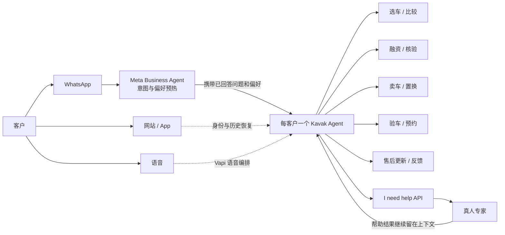
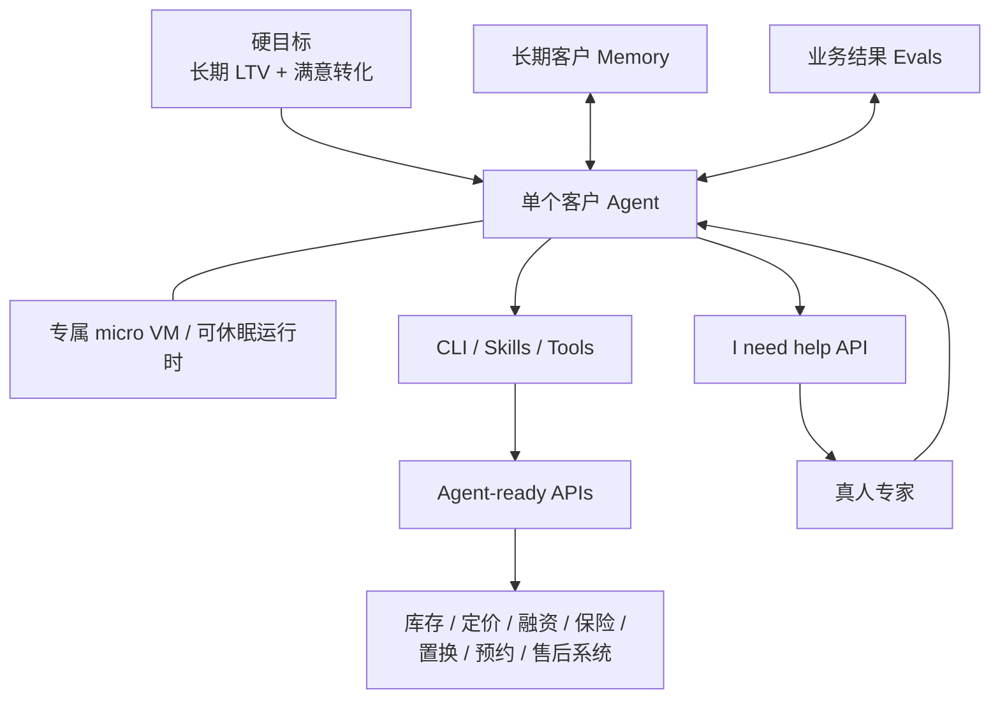

# Kavak AI Agent 设计调研

> 调研日期：2026-08-24
>
> 范围：Kavak 面向客户的销售/交易智能体，以及与之直接相关的语音、WhatsApp、人工接管、评测和内部智能体。
>
> 证据原则：优先采用 Kavak、a16z、Meta/WhatsApp、Vapi 的官方演讲、案例、招聘和公告。文中的效果数字均为 Kavak 或合作厂商自报，不能视为独立审计结果。

## 一句话结论

Kavak 最新公开的核心设计不是 FAQ 客服机器人，也不再是以固定 LangGraph 图为中心的多 Agent 工作流，而是**为每个活跃客户启动一个可休眠/唤醒的长期销售智能体**：它运行在独立的微型 VM 中，携带跨时间的客户记忆，以客户 LTV 和满意转化为硬目标，通过 CLI、工具和重建后的业务 API 完成找车、融资、置换、保险等任务；遇到无法处理的情况，由智能体主动调用 `I need help` API 请求真人协助，同时保留智能体在回路中以形成可学习数据。[a16z/Kavak 官方访谈，2026-08-10，架构段](https://www.youtube.com/watch?v=n34CIw3gk1k&t=143s)、[架构重构段](https://www.youtube.com/watch?v=n34CIw3gk1k&t=1724s)

### 通俗版理解

1. **一人一个 Agent**：每位客户都有专属智能体，持续服务整个购车周期。
2. **长期记忆**：记住客户过去看过的车、预算、电话和融资情况，不必每次重新沟通。
3. **直接执行任务**：Agent 可以调用库存、融资、保险、置换等系统，不只是给建议。
4. **能休眠和唤醒**：暂时没有合适机会时进入休眠，条件变化或时机合适时再被唤醒并联系客户。
5. **把真人作为可按需调用的能力**：Agent 处理不了时通过 `I need help` API 请求真人协助；真人介入后 Agent 仍留在回路中，继续服务并沉淀处理结果。

一句话概括：**Kavak 把 Agent 从聊天窗口升级成了一个有记忆、能行动、对长期业务结果负责的数字员工。**

### 为什么要“一人一个 Agent”

“一人一个 Agent”的核心好处是：**始终由同一个数字客户经理负责这个客户。**

- **不用重复沟通**：Agent 记得预算、车型偏好、融资进度和历史问题。
- **服务更连贯**：从看车、比较、贷款到置换和售后，信息不会因流程切换而丢失。
- **推荐更准确**：它了解的是客户的长期需求，而不只是当前说的一句话。
- **能选择合适时机行动**：客户暂时不买就休眠，有新车源、降价或融资机会时再唤醒。
- **责任更清晰**：客户目标、记忆、操作记录和服务结果都归属于同一个 Agent，方便评测和追踪。
- **减少复杂编排**：不必频繁在销售 Agent、融资 Agent、保险 Agent 之间传递上下文。

例如，客户两个月前看过 SUV，但因首付不足离开。后来融资政策变化，专属 Agent 可以恢复原来的预算和偏好，主动提供新方案，而不必让客户从头咨询。

本质上，它优化的是**长期客户关系**，而不是单次对话的回答质量。代价是必须认真解决记忆准确性、隐私保护、权限控制和长期运行成本。

这个设计真正特别的地方有三点：

1. **产品目标是经营一段长期客户关系**，不是完成一次意图分类或工单闭环。
2. **公司系统被反向改造成 Agent 可操作的环境**，而不是只在现有系统上加聊天界面。
3. **业务结果评测、长期记忆和人工求助接口属于运行时的一部分**，而不是上线后的附加监控。

## 先厘清：Kavak 所说的 “Agent” 有五种含义

| 公开语境 | 实际含义 | 本文如何处理 |
|---|---|---|
| Customer / Sales Agent | 面向购车、卖车、置换、融资客户的长期关系与交易智能体 | 核心研究对象 |
| Meta Business Agent | WhatsApp 广告或营销消息后的上游接待、意图识别和线索预热层 | 渠道入口，不等于 Kavak 核心智能体 |
| Vapi Voice Agent | 将销售、验车、融资核验、售后等旅程语音化的编排/交付层 | 语音通道及评测平台 |
| AI CEO、维修技师 sidekick | 门店经营和维修技师辅助等内部运营智能体 | 证明同一 Agent 设计已扩展到内部运营 |
| Human sales agent | 传统招聘或业务页面里的人工销售代表 | 不是本文所指 AI Agent |

因此，搜索结果中出现的 “agent” 不能直接合并。尤其是 2025 至 2026 年初招聘和厂商案例里的 LangGraph、多智能体和固定工作流，只能说明**上一代或局部系统**；2026-08 的公开演讲明确描述了核心客户智能体的架构重构。

## 一、最新公开设计：每客户一个长期智能体

### 1. 业务目标：最大化长期 LTV，同时让客户满意地完成转化

Kavak Chief Product & AI Officer Alejandro Maza Ayala 在 2026-08-10 的 a16z 官方访谈中描述：客户到来时，系统会为该客户生成一个专属 Agent 和 VM；它能记住多年历史，包括网页行为和两年前的电话，并制定长期策略。其硬目标不是“回答当前问题”，而是随时间最大化客户终身价值，同时保持客户满意并促成转化。[官方视频，2026-08-10，02:23 起](https://www.youtube.com/watch?v=n34CIw3gk1k&t=143s)

这使它更接近“数字客户经理”而不是客服机器人：

- Kavak 明确说他们没有先做 support/customer-service agent，而是做 **sales agent**。[官方视频，2026-08-10，10:49 起](https://www.youtube.com/watch?v=n34CIw3gk1k&t=649s)
- 约 20,000 个库存 SKU 还要组合融资、保险、保障、置换等条件；过去这些知识分散在约 15 类专家或团队中，现在试图由一个“mega-expert”统一处理。[同上](https://www.youtube.com/watch?v=n34CIw3gk1k&t=649s)
- Kavak 自报当前约 96% 的互动无需真人处理，约 95% 的交易由智能体完整处理；车辆实物交付仍需人工。[官方视频，2026-08-10，02:23 起](https://www.youtube.com/watch?v=n34CIw3gk1k&t=143s)

“长期”不表示一台 VM 永久在线。公开说法是每天实例化约 10 万至 20 万个 Agent，有的活跃 3 分钟，有的 8 小时或 3 天，之后设置唤醒条件并休眠。因此更准确的理解是：**客户身份、目标和记忆长期存在，计算实例按活动周期创建、休眠和唤醒**。[同上](https://www.youtube.com/watch?v=n34CIw3gk1k&t=143s)

### 2. 用户旅程：一个关系主体贯穿多个任务和通道

公开资料可以确认的端到端旅程如下。虚线部分表示公开资料证明了各通道能力，但没有披露它们在生产环境中的精确身份解析和事件总线实现。



#### WhatsApp 入口

Meta 的官方案例说明了一个清晰的两层交接设计：

1. 注册后沉默的用户收到营销消息，或从 click-to-WhatsApp 广告进入会话。
2. Meta Business Agent 根据用户此前看过的车辆、融资步骤或卖车历史发起对话，判断买、卖或置换意图。
3. 它把用户偏好和已经回答过的问题作为完整上下文交给 Kavak 自有 AI Agent，避免用户重复叙述。
4. 达到合格线索条件后，仍可交给销售团队。

该案例还展示了实际交互：智能体先承接广告中的月供锚点，补充“240 点检查/保障”等信任信息，再询问预算、油耗、轿车或 SUV 等约束；页面明确显示 “AI from Meta” 的平台披露。[WhatsApp Business 官方案例，发布 2026-06-30、更新 2026-08-14](https://whatsappbusiness.com/resources/success-stories/kavak/)、[案例交互截图](https://whatsappbusiness.com/wp-content/uploads/2026/06/kavak-ux.jpg)

#### 语音入口

Vapi 的 Kavak 官方客户案例称，Kavak 原先已有文本 Agent，但在拉美高客单价汽车交易中，语音对建立信任仍然关键。语音 Agent 已覆盖：首次销售接触、验车预约、融资和承保参考电话、售后每日主动更新，以及整备中心反馈。[Vapi 官方 Kavak 案例，页面未标注发布日期，核验于 2026-08-24](https://vapi.ai/customers/kavak)

Kavak 团队可以细调声音、延迟、性能、性格、工具、主动程度和友好程度，并在几分钟内上线修改；业务团队还能直接建立评测，基于真实通话调整音色、语气、情绪和速度。[同上](https://vapi.ai/customers/kavak)

Vapi 在 2026-05-12 的官方融资公告中特别澄清：Kavak 在 Vapi 之上自行构建了记忆和个性化层，使回访客户能从上次位置继续；这不是 Vapi 直接交付的功能。Kavak 从一个语音场景扩展到数十个场景。[Vapi Series B 公告，2026-05-12](https://vapi.ai/blog/series-b)

### 3. 最新运行时：VM + Agent + Memory + Evals + CLI + Tools

2026-08 的最新公开“最小架构”可以画成：



这是公开概念图，不是 Kavak 发布的内部组件图。可以证实的是：

- Kavak 重新构建了大量 API 和系统，使 Agent 能直接使用业务能力；公开表述是 Agent 可访问每个工具/API，并通过 CLI 和 skills 工作。[a16z/Kavak 官方访谈，2026-08-10](https://www.youtube.com/watch?v=n34CIw3gk1k&t=1724s)
- 当前招聘仍显示实现层需要用 Python 构建可扩展后端/API，把 LLM 连接到 Kavak 微服务，开发客户沟通工具，管理模型和 prompts，并在 SQL/NoSQL、REST、Docker、事件驱动环境中运行。[Kavak 官方 AI Engineer 职位，发布 2026-07-08 UTC](https://jobs.lever.co/kavak/4ce9aa25-1b47-4ec0-84ed-9037db6f9de2)
- 但“能访问所有 API”只表示业务覆盖面，**不能据此推断每个 Agent 拥有无条件、无分级的生产权限**。权限模型和敏感操作审批阈值没有公开。

### 4. 知识与数据：关系记忆比一次性 RAG 更核心

Kavak 对数据基础的建设早于生成式 AI。CEO Carlos García Ottati 在 2026-02 的 a16z 访谈中说，公司从 2017 年起建设跨业务线的 ontology 和 information highway，让验车、定价、整备、销售、融资和售后数据互通；公司自营保障服务，也是为了把车辆故障数据反哺验车、整备和售后流程。[a16z 官方访谈，2026-02-18](https://a16z.com/podcast/from-copilots-to-agents-rebuilding-the-company-around-ai/)

这一设计的重点是：**Agent 不仅要能查询业务资料，还要长期记住“这个客户是谁、经历过什么、交易进行到哪里”。**

一次性 RAG 与关系记忆解决的问题不同：

- **一次性 RAG**：回答当前问题时，临时检索车辆资料、融资政策或保险规则。
- **关系记忆**：长期保存某个客户的历史、偏好、交易进度和人工处理结果。

下面是一个说明性对比：

```text
一次性 RAG
客户问“这辆车能贷款吗？”
    ↓
检索当前贷款政策并回答

关系记忆
Agent 知道客户两个月前看过 SUV
    ↓
知道其月供预算、低油耗偏好和上次暂停原因
    ↓
新融资方案出现后恢复原有进度并重新联系
```

最新 Agent 在统一数据基础上强调三类记忆：

- **关系历史**：跨年网页行为、电话和先前会话。
- **交易上下文**：预算、车型偏好、融资步骤、卖车/置换意图及已回答问题。
- **组织反馈**：一次失败或人工帮助产生的数据，可进入次日其他 Agent 的学习/评测循环。

关系记忆之所以更核心，是因为 Kavak 的 Agent 优化的是长期客户关系和 LTV。没有长期记忆，Agent 每次被唤醒都要从头询问，也无法实现跨渠道连续、主动跟进和个性化服务。[a16z/Kavak 官方访谈，2026-08-10](https://www.youtube.com/watch?v=n34CIw3gk1k&t=143s)

但两者并不是替代关系：

- **RAG 解决“公司和汽车业务知道什么”**；
- **关系记忆解决“关于这个客户，我们已经知道什么”**。

公开资料没有说明记忆使用何种数据库、向量库或图数据库，也没有说明摘要、压缩、冲突消解、保留期限和删除机制。因此把该系统具体描述成“某种 RAG/知识图谱架构”都超出了证据。

一句话概括：**RAG 让 Agent 懂业务，关系记忆让 Agent 真正认识并持续服务一个客户。**

## 二、编排架构如何演进

### 演进时间线

| 时间 | 公开阶段 | 已证实设计 | 应如何解读 |
|---|---|---|---|
| 2017 起 | 数据底座 | 建设跨业务 ontology / information highway；把保障故障数据反哺业务 | 为后来的 Agent 提供统一可操作数据，不是当时已有生成式 Agent |
| 2022 末起 | Employee copilots | 先给员工做 copilot，但采用率低 | 促使团队绕过内部采用瓶颈，把 Agent 直接放到客户旅程中 |
| 2023 起 | Funnel-by-funnel agents | 从承保、车辆故障等硬边界问题入手；按 funnel、process、skill 拆分，由 orchestrator 按复杂度协调 Agent 与真人 | 这是早期多智能体/流程式设计 |
| 2025 至 2026 初 | 规模化语音与图工作流 | 厂商案例描述 MCP 服务、LangGraph 工作流、可观测性管道和按意图动态装配能力；招聘也要求 LangChain/LangGraph 测试 | 是生产过的前代/局部架构，不应当成 2026-08 最新核心架构 |
| 2026-05 至 06 | 通道扩展 | Vapi 支撑数十个语音场景；Meta Agent 做 WhatsApp 上游触达、意图识别和上下文交接 | 渠道层扩大 Agent 的可达范围 |
| 2026-08 | 长期单 Agent 运行时 | 每客户一个 VM/Agent，配 memory、evals、CLI、tools 和长期硬目标 | 当前公开的核心客户 Agent 设计 |

早期阶段的直接来源是 [a16z 对 Kavak CEO 的官方访谈，2026-02-18](https://a16z.com/podcast/from-copilots-to-agents-rebuilding-the-company-around-ai/)。其中描述了先按漏斗逐个推进、由 orchestrator 分流复杂任务，以及 Agent 与真人协作的方式。

### 为什么从多 Agent 图转向一个长期 Agent

Maza 在 2026-08 的演讲中说，团队此前花约两年构建了成千上万乃至数万个可规模运行的 multi-agent workflows/graphs；到 2025 年 12 月这一体系仍在工作。Claude Opus 4.5 出现后，他判断固定图、multi-agent lattice 和既有 harness 正在约束更强模型的智能，因此决定拆掉并重建为更简单的运行时：**VM + one agent + memory + evals + CLI + tools/APIs + long-term goals**。[a16z/Kavak 官方访谈，2026-08-10，28:44 起](https://www.youtube.com/watch?v=n34CIw3gk1k&t=1724s)

这里必须注意两点：

1. Opus 4.5 是触发架构反思的模型，公开材料**没有说它就是当前生产环境唯一或主要基座模型**。
2. “从多 Agent 转为一个 Agent”指核心客户关系运行时。公开资料没有证明 Kavak 全公司已删除所有专用 Agent、路由器或局部工作流。

### 旧 LangGraph 证据为何仍有价值

Vapi 在 2026-01-07 发布了一篇未具名的“拉美首家科技独角兽、总部墨西哥城”汽车平台案例。其描述、负责人引语和后续具名 Kavak 页面高度吻合，因此**可以高置信推断**对象是 Kavak，但页面本身没有明示公司名。[Vapi 汽车案例，2026-01-07](https://vapi.ai/blog/case-study-automotive)

该页面记录了当时的实现：内部 MCP 服务、LangGraph 工作流、语音编排和自建可观测性；融资、身份验证、预约等能力按意图动态组合，而非固定脚本；工程团队拥有业务逻辑，产品/运营团队拥有会话流。它还报告 5 个国家、1,000 多个本地化 Agent 配置、每天 1 万至 1.5 万通 AI 电话、450 多并发和每月 170 万次交互。

这些数字与 2026-08 所说的“每天实例化 10 万至 20 万个客户 Agent”不是同一计量单位：前者更可能是本地化能力/配置和语音调用规模，后者是全渠道客户运行实例。这个解释是**合理推断**，两份材料没有直接做口径对照。

## 三、交互设计

### 1. 从“问答”转为“渐进式约束收集”

“渐进式约束收集”指的是：**Agent 不急着直接给答案或一次展示大量车辆，而是通过连续对话，逐步弄清客户真正需要什么。**

下面是一个说明性流程：

```text
客户询问便宜的车
    ↓
每月预算是多少？
    ↓
更喜欢轿车还是 SUV？
    ↓
是否在意油耗？
    ↓
需要贷款还是全款？
    ↓
有没有旧车需要置换？
    ↓
根据完整条件推荐合适车辆
```

这里的“约束”是影响车辆和交易方案选择的条件，例如：

- 总预算或可接受月供；
- 轿车、SUV 等车型偏好；
- 油耗和日常使用场景；
- 全款还是融资；
- 是否卖车或置换；
- 对车辆检查、保障和售后的要求。

它与普通问答机器人的区别是：

- **普通问答**：客户问什么，就回答什么。
- **渐进式约束收集**：通过少量、连续的问题缩小选择范围，再给出个性化方案。

Meta 案例中的实际对话符合这种模式：它没有先展示大段库存，而是逐步收集预算/月供、油耗、车身类型和买/卖/置换意图等高信息量约束；同时承接广告中的价格承诺，并用检查、保障等信息降低客户的信任障碍。[WhatsApp 官方案例及截图，2026-06-30](https://whatsappbusiness.com/resources/success-stories/kavak/)

这种交互可以减少长表单和海量结果带来的认知负担，Agent 也能根据前面的回答选择下一项需要确认的信息。

一句话概括：**不是马上给答案，而是先通过对话逐步弄清预算、偏好和限制，再推荐真正合适的方案。**

这与旧 GenUI 招聘所描述的 chat-first 方向一致：聊天中动态生成车辆比较卡、商品卡和个性化结果，而不是把对话停留在纯文本。该职位还提到 React/Next.js、A/B 测试、RAG/微服务，以及 OpenAI/Anthropic 接入；但页面只显示约一年前发布，且招聘要求不证明所有设计已上线，所以只能作为产品方向证据。[Kavak 官方 LinkedIn 职位：Sr. Frontend GenUI，约 2025](https://ar.linkedin.com/jobs/view/sr-frontend-genui-at-kavak-com-4233723998)

### 2. 主动但不局限于“立即成交”

“主动但不局限于立即成交”指的是：**Agent 不会只考虑让客户现在买车，而是围绕客户的长期需求寻找合适的下一步行动。**

下面是根据其长期 Agent 机制整理的说明性流程：

```text
客户暂时没有购买
    ↓
Agent 保存车型、预算和融资进度
    ↓
进入休眠，等待新的业务条件
    ↓
出现降价、新车源或更合适的融资方案
    ↓
Agent 被唤醒并重新联系客户
```

长期 Agent 会在合适时机休眠和唤醒，WhatsApp 的上游 Agent 也会重新触达注册后未行动的用户。它还可以尝试识别表面意图背后的真实约束：Vapi 案例给出的例子是，用户表面上想卖车，实际需求可能是获得流动性，此时 Agent 可以转而提出信贷方案。[Vapi 官方 Kavak 案例，核验于 2026-08-24](https://vapi.ai/customers/kavak)

这和传统销售机器人的优化目标不同：

- **传统机器人**：关注这次对话能否立即成交。
- **Kavak 长期 Agent**：关注能否持续为客户创造价值，并在合适时机完成合适的交易。

这体现了 LTV 目标的产品后果：Agent 不只优化“当前页面的主按钮”，而是寻找能解决客户真实约束的下一最佳动作。好处是推荐可以更贴近客户的实际情况，也可以在条件变化后恢复服务。

风险也同样明显：若没有触达频率、方案适用性和金融公平性约束，LTV 硬目标可能诱发过度营销，甚至向客户推荐不合适的金融产品。Kavak 没有公开这些控制机制的具体实现。

一句话概括：**不是每次都催客户现在成交，而是在正确的时间，为客户提供更合适的下一步方案。**

### 3. 跨渠道连续性

跨渠道连续性指的是：**客户更换沟通渠道后，Agent 仍能接着上一次的进度继续服务。**

```text
客户在网站看过几辆 SUV
    ↓
后来从 WhatsApp 咨询月供
    ↓
Agent 恢复其车型偏好和大致预算
    ↓
几天后通过电话沟通融资
    ↓
语音交互从之前的融资进度继续
```

Kavak 的公开资料可以确认三种相关能力：

- **网站和电话历史**：最新核心 Agent 可以读取客户过去的网页行为和电话记录。[a16z/Kavak 官方访谈，2026-08-10](https://www.youtube.com/watch?v=n34CIw3gk1k&t=143s)
- **WhatsApp 上下文交接**：Meta Agent 收集客户意图、偏好和已经回答的问题，再把上下文交给 Kavak 自有 Agent。[WhatsApp Business 官方案例](https://whatsappbusiness.com/resources/success-stories/kavak/)
- **语音记忆恢复**：Kavak 在 Vapi 之上自建记忆和个性化层，让回访客户可以从上次中断的位置继续。[Vapi Series B 公告，2026-05-12](https://vapi.ai/blog/series-b)

这种设计可以避免客户在网站、WhatsApp 和电话之间反复介绍自己，也能减少渠道切换造成的购车或融资进度丢失。

但公开资料仍然没有说明：

- 不同渠道如何识别并合并为同一个客户；
- 文本和语音是否始终连接到同一个逻辑 Agent；
- 客户如何同意跨渠道使用和共享数据；
- 哪些信息可以写入长期记忆；
- 记忆保留多久以及如何删除。

因此，这些证据共同指向跨渠道连续关系设计，但不能据此补全其身份解析、同意管理和记忆治理架构。

一句话概括：**渠道可以变化，但服务客户的记忆和任务进度不能中断。**

## 四、Guardrails、人工接管与质量控制

### 1. 真人是 Agent 按需调用的能力

Kavak 的关键设计是：**真人介入后，Agent 不退出会话。** 人并不是被“放进模型”，而是通过 `I need help` API 成为 Agent 可以按需调用的专家和现实世界执行能力。

整体流程可以简化为：

```text
Agent 服务客户
    ↓
遇到自己处理不了、需要真人判断或权限的情况
    ↓
调用 I need help API
    ↓
把客户目标、历史对话和当前进度交给真人
    ↓
真人判断、审批或完成线下操作
    ↓
结果返回 Agent
    ↓
Agent 继续服务，并把困难案例沉淀到记忆或评测循环
```

公开访谈能够直接确认的是：当 Agent 卡住时，它会调用 `I need help` API；另一端由真人提供帮助；Agent 留在回路中观察结果并继续完成任务。这样既解决当前客户的问题，也能把困难案例转化成后续 Agent 的训练或评测数据。[a16z/Kavak 官方访谈，2026-08-10](https://www.youtube.com/watch?v=n34CIw3gk1k&t=1450s)

#### 说明性例子：融资异常

下面是根据上述机制推演的说明性例子，不是 Kavak 公开披露的具体生产案例：

- Agent 已经收集客户收入、预算和车型偏好。
- Agent 无权批准例外融资条件，于是请求融资专家帮助。
- 专家完成判断或审批。
- 结果返回 Agent，由 Agent 继续向客户解释并推进交易。
- 这次困难案例进入记忆或评测系统，帮助后续 Agent 改进。

#### 真人承担的三类工作

1. **异常决策**：处理 Agent 没见过、信心不足或无法独立完成的问题。
2. **高风险审批**：对融资、退款、身份核验等敏感操作提供判断或授权。
3. **现实世界执行**：完成验车、维修和车辆交付等物理工作。

一句话概括：**Agent 是客户关系的负责人，真人是它按需调用的专家、审批者和现实世界执行者。**

需要注意，上述三类职责是对公开机制的设计归纳。Kavak 尚未公开哪些操作必须由真人审批，也未披露求助是由规则、模型自判还是外部风险引擎触发，以及人工响应 SLA、失败回滚和权限分层的具体实现。

### 2. 业务结果 Evals 是“刹车”，投入与 Agent 本体相当

Maza 表示，他们在 evals 上投入与 Agent 本体相同数量级的工程时间、token 和资金，并把 evals 称作让团队能够高速前进的 brakes。第一层不是检查措辞是否漂亮，而是看转化、创造价值、客户满意和后续再互动等业务结果。[a16z/Kavak 官方访谈，2026-08-10](https://www.youtube.com/watch?v=n34CIw3gk1k&t=360s)

#### 通俗理解：Evals 到底评什么

这里的 Evals 就是“评测系统”。结合 Kavak 公开的业务结果和 QA 测试范围，它主要检查：

- 客户是否顺利完成交易；
- 转化率有没有提高；
- 客户满意度有没有下降；
- 推荐是否真正创造价值；
- 客户之后是否愿意继续使用；
- Agent 是否正确调用工具、在需要时转交真人。

例如修改融资推荐逻辑时，不能只看 Agent 的回答是否流畅，还可以设置如下说明性检查项：

```text
新版本 Agent
    ↓
融资转化是否提高？
客户投诉是否增加？
是否推荐了不合适的贷款？
是否更频繁地需要真人帮助？
```

这些问题展示的是评测思路，不代表 Kavak 已公开上述每一项指标及其阈值。Kavak 明确公开的是转化、创造价值、客户满意和后续再互动等业务结果，以及工具行为、fallback 等 QA 范围。

把 Evals 称为“刹车”，并不是为了让开发变慢，而是因为：**有可靠的刹车，团队才敢更快发布新版本。**

“投入与 Agent 本体相当”也不是严格的 50:50，而是说评测所消耗的工程时间、模型 token 和资金，与开发 Agent 本身处于同一量级。

一句话概括：**开发 Agent 是制造发动机，Evals 是建立仪表盘、刹车和安全检测，确保它跑得快但不会失控。**

Vapi 的语音层则补充了低一层的连续评测：真实通话的客户情绪，以及声音、语气、情绪、速度、延迟、性格、主动性等参数。[Vapi 官方 Kavak 案例](https://vapi.ai/customers/kavak)

Kavak 的 AI QA 招聘进一步显示测试范围包括语音/聊天负载、延迟、打断（barge-in）、prompt 一致性、工具行为、意图准确率、fallback、噪声/重叠语音/断线、多语言、幻觉和行为不一致。职位的 nice-to-have 还列出 TTS/STT 以及 LangSmith、Promptfoo、TruLens，但这只证明候选能力需求，不能确认所有工具都在生产使用。[Kavak QA Automation Engineer - AI 招聘，发布 2026-02-26](https://jobs.generalcatalyst.com/companies/kavak/jobs/68770394-qa-automation-engineer-ai)

因此可以归纳出三层公开评测面：

| 层级 | 公开评测信号 | 证据状态 |
|---|---|---|
| 业务结果 | 转化、价值、满意度、复访/LTV | 已证实，是最新核心 eval 第一层 |
| 对话/语音体验 | 情绪、语气、速度、延迟、打断、多语言 | 已证实，Vapi 与 QA 范围 |
| Agent 行为 | 意图、工具调用、fallback、prompt 一致性、幻觉 | 已证实为 QA 测试范围；具体阈值未知 |

### 3. 销售 Agent 之外，还有专门负责系统测试的 Agentic QA

这里的 Agentic QA 是指：**再用一批 AI Agent 扮演客户，自动测试 Kavak 的网站和内部系统。** 它不是销售 Agent 自身的 guardrail，而是一层独立的产品质量保障机制。

```text
测试 Agent 模拟真实客户
    ↓
执行找车、登录、申请融资等端到端流程
    ↓
发现页面错误、接口异常或流程中断
    ↓
保存复现步骤和证据，自动创建 Jira 工单
    ↓
真人 QA 审查并交给产品或研发团队
    ↓
修复后由 Agent 重新测试
```

两类 Agent 的职责不同：

- **销售 Agent**：服务真实客户，帮助完成交易。
- **QA Agent**：模拟真实客户，持续检查产品和系统是否正常。

Autonoma 的官方 Kavak 案例称，测试智能体会持续模拟用户端到端旅程，发现生产网站或内部应用异常后自动创建 Jira 工单，由 Solutions Center 真人审查并按需升级给产品/技术团队；修复后可从 Jira 重跑并记录复现证据。[Autonoma 官方案例，2025-11](https://getautonoma.com/blog/kavak)

一句话概括：**Kavak 不仅用 Agent 服务客户，还用 Agent 自动扮演客户，持续寻找产品问题。**

Kavak 巴西透明度页面确认公司存在一份 “Ethics in AI Use Policy”，同时列有个人数据保护治理，但页面没有公开政策正文。因此只能确认治理文件存在，不能据此声称已经实现某种提示注入防护、加密、模型隔离或内容审查控制。[Kavak 官方透明度页面，未标注发布日期，核验于 2026-08-24](https://comunicaciones.kavak.com/transparencia-home-br/)

## 五、上线结果：必须按阶段和基线拆开看

| 来源/阶段 | Kavak 或厂商自报结果 | 限制 |
|---|---|---|
| a16z/Kavak，2026-08 | 约 96% 互动无需真人；约 95% 交易由 Agent 完整处理；转化当前约为人工的 2.1 倍；客户满意/NPS 约为早期的 3 倍 | 公司高管口述；未给样本、时间窗和统计方法 |
| Vapi/Kavak，页面日期未标注 | 收入 +200%、转化 +30%、NPS 约 +20 点；墨西哥用 2 倍客户量实现盈利；100% 会话每日分析，过去每天人工只抽查 10–30 次；服务从每天 8 小时变 24/7 | 厂商客户案例；各指标基线和归因窗口未公开，不能与 a16z 数字相加 |
| Meta/Kavak，一月测试，2026-06 发布 | 广告发起者约三分之一被认定为合格并交给销售；线索捕获效率是仅用 outbound marketing 的 8 倍；前两周 489 次会话 | Meta 明示为客户自报，结果不可保证可复现 |
| Vapi 匿名汽车案例，2026-01 | 收入 +200%、CAC -50%、呼叫中心规模减少 50% 以上 | 对象为 Kavak 属高置信推断；是旧架构阶段，厂商自报 |
| AI CEO 门店试点，2026-08 访谈 | Cuernavaca 六周试点；首月目标利润翻倍，实际约 +50%；满意度、库存周转、融资渗透改善 | 内部 Agent，不是客户销售 Agent；除利润外未给改善幅度 |
| 维修技师 sidekick，2026-08 访谈 | 面向约 800 名技师；更快、更便宜、质量更高；保障索赔/故障约下降 26% | 高管口述，未披露对照组和时间窗；名称仅见自动字幕，未独立核验 |

对应一手来源：[a16z/Kavak 2026-08-10 官方视频](https://www.youtube.com/watch?v=n34CIw3gk1k)、[Vapi Kavak 官方案例](https://vapi.ai/customers/kavak)、[WhatsApp Kavak 官方案例](https://whatsappbusiness.com/resources/success-stories/kavak/)、[Vapi 2026-01-07 汽车案例](https://vapi.ai/blog/case-study-automotive)。

Kavak 自己的 2026-02-17 融资公告只采用了更保守的说法：大多数客户需求已由 AI Agent 服务，并计划在 2026 年进一步自动化内部流程。[Kavak 官方 Newsroom，2026-02-17](https://news-room.kavak.com/kavak-announces-usd300-million-series-f-led-by-andreessen-horowitz-to-expand-access-trust-and-financing-across-latin-america)

## 六、内部 Agent：同一设计思想的组织级扩展

### AI CEO

Kavak 所说的 AI CEO **不是替代整个公司的法定 CEO**，更准确地说，它是一个负责门店或区域经营的内部运营 Agent。普通客户 Agent 负责一位客户，AI CEO 则面向整个经营单元，持续优化利润、客户满意度、库存周转和融资渗透率。

它主要承担以下工作：

- 读取门店的利润、库存、客户和融资等经营数据；
- 分析当前问题并预测经营结果；
- 为现场员工制定每日行动计划；
- 通过语音收集员工的执行反馈；
- 根据结果持续调整后续经营策略。

```text
读取门店经营数据
    ↓
发现利润、库存或客户问题
    ↓
制定每日行动计划
    ↓
把任务交给现场员工
    ↓
员工完成验车、维修、交付等实体工作
    ↓
员工通过语音反馈结果
    ↓
AI CEO 根据结果继续调整策略
```

Kavak 在墨西哥 Cuernavaca 进行了六周试点。AI CEO 每天读取经营数字和客户情况，进行预测和精细运营，并向需要完成实体工作的员工发送计划、索取语音反馈。首月目标是让利润翻倍，最终由 Kavak 自报实现约 50% 提升；客户满意度、库存周转和融资渗透率也有所改善，但具体统计方法和各项改善幅度没有公开。[a16z/Kavak 官方访谈，2026-08-10，16:13 起](https://www.youtube.com/watch?v=n34CIw3gk1k&t=973s)

一句话概括：**普通 Agent 负责一个客户，AI CEO 负责一个经营单元；它负责分析和决策，真人负责现实执行。**

### 维修技师 sidekick

维修技师 sidekick 是一个服务于一线维修技师的现场辅助 Agent，相当于技师旁边的“数字维修顾问”。它不会替代维修技师，而是通过信息、提醒和建议减少漏检，帮助不同技师执行更一致的维修标准。

根据公开描述，可以把它的作用归纳为：

- 读取车辆检查和整备信息；
- 根据车辆问题提示检查重点或维修建议；
- 提醒容易遗漏的检查项目；
- 帮助统一维修和质量标准；
- 把现场处理结果反馈到后续质量和评测循环。

其工作流程可以简化为：

```text
车辆进入检查或整备
    ↓
Agent 读取车辆和故障信息
    ↓
向技师提示检查重点或处理建议
    ↓
技师完成实际拆检和维修
    ↓
把处理结果反馈给 Agent
    ↓
结果进入质量和评测循环
```

公开访谈直接确认的是：这个 sidekick 面向约 800 名维修技师，会观察检查和整备工作并给出提示。Kavak 自报维修变得更快、更便宜且质量更高，保障索赔或后续故障约下降 26%，但没有公开具体统计方法、对照组和各项能力的实现细节。[a16z/Kavak 官方访谈，2026-08-10，16:13 起](https://www.youtube.com/watch?v=n34CIw3gk1k&t=973s)

自动字幕将其名称转写为 “El Mike/El Mic”，暂无独立来源确认正式名称。

一句话概括：**AI CEO 帮门店负责人经营门店，维修技师 sidekick 帮一线技师把车修得更快、更稳定、少出错。**

这两类 Agent 与客户 Agent 的共同模式是：给一个长期业务结果目标，开放可观察的数据和可执行工具，把真人留在需要物理操作或异常判断的位置，并把现场反馈重新写入评测循环。

## 七、已证实、合理推断与仍未知

### 已证实事实

- 2026-08 最新核心客户架构是每客户一个可长期保持关系的 Agent/VM，包含 memory、evals、CLI、tools/APIs 和 LTV 硬目标。
- Kavak 曾经运行大规模多 Agent 图/工作流，但在更强模型出现后重构了核心客户运行时。
- Agent 覆盖销售而非仅客服，能处理选车、融资、保险、置换等组合任务。
- Vapi 提供语音编排/评测，Kavak 自建跨会话记忆和个性化层。
- Meta Business Agent 是上游入口，可把偏好和已回答问题交给 Kavak 自有 Agent。
- 人工接管通过 Agent 主动求助完成，Agent 留在回路中。
- evals 同时覆盖业务结果、语音体验和 Agent/工具行为。

### 合理推断

- Vapi 2026-01 未具名“拉美首家科技独角兽、总部墨西哥城”汽车案例对象是 Kavak；后续具名页面和负责人引语高度吻合。
- “1,000+ 本地化 Agents”与“每天 10 万至 20 万 Agent 实例”是配置/能力与运行实例的不同口径，而非相互矛盾的部署规模。
- 最新系统大概率通过统一客户身份把网页、电话、WhatsApp 等事件恢复到关系记忆，但身份解析和事件架构没有披露。

### 公开资料仍未知

- 当前生产使用的基础模型、模型路由和版本组合；Opus 4.5 只被明确说成架构重构触发点。
- 记忆的数据库、RAG/向量检索实现、摘要策略、保留期限、删除和跨国数据边界。
- prompt、system policy、工具 schema、权限模型、幂等/回滚和敏感操作审批规则。
- PII 加密与隔离、金融公平性控制、贷款拒批解释、人工审核阈值。
- prompt injection、越权工具调用、内容安全、红队和事故响应的具体做法。
- eval 数据集、自动评分器/人工评分比例、阈值、shadow/canary/A-B 设计和失败率。
- `I need help` API 的触发策略、真人 SLA、队列路由及低置信度阈值。
- 最新单 Agent 运行时是否彻底取代所有局部 LangGraph、多 Agent 和确定性流程。

特别值得注意：2026-08 访谈中主持人问到了 PII 和 evals，但回答重点转向 AI CEO 试点，没有公开 PII 控制细节。因此不应把“问题被问过”误写成“机制已披露”。Vapi 平台自身宣传合规、硬 guardrails 和人工升级能力，也不能证明 Kavak 启用了其中每一项。

## 八、可复用的设计启示

1. **先定义关系级硬目标，再决定 Agent 形态。** Kavak 的 LTV/满意转化目标解释了为什么它需要长期记忆、主动唤醒和跨任务能力。
2. **把 API 当成 Agent 的产品界面。** 如果库存、融资、预约和售后只能被人操作，Agent 永远只是对话层；Kavak 的关键投入是重建可操作系统。
3. **通道适配与核心关系主体分层。** Meta 负责上游触达和预热，Vapi 负责语音表现与编排，核心客户 Agent 负责目标、记忆和业务动作。
4. **人工求助要产生学习闭环。** 让 Agent 调用求助接口并留在回路中，比直接转走会话更有利于积累困难样本。
5. **评测先看业务结果，再下钻对话与工具行为。** 只优化回答相似度不足以约束一个拥有交易工具的销售 Agent。
6. **不要把流程图永久当作智能边界。** Kavak 的演进表明，当模型能力变化时，固定多 Agent 图可能从安全脚手架变成能力上限；但高风险动作仍需要确定性权限和审批约束，这一部分 Kavak 尚未公开。

## 九、来源索引

### 关键一手资料

- [a16z / Kavak：《The Self-Improving Company | Kavak's AI Playbook》官方视频](https://www.youtube.com/watch?v=n34CIw3gk1k)，2026-08-10。最新架构、规模、目标、eval、人工求助、架构重构、AI CEO/维修技师 sidekick。可检索字幕辅助：[BidClub 的 YouTube captions 镜像](https://bidclub.ai/e/kavak-s-playbook-rebuilding-company-around-ai)；事实引用仍指向官方视频。
- [a16z：《From Copilots to Agents: Rebuilding the Company Around AI》](https://a16z.com/podcast/from-copilots-to-agents-rebuilding-the-company-around-ai/)，2026-02-18。Kavak CEO 讲述数据底座、copilot 采用失败、早期 funnel-by-funnel Agent 和人机编排。
- [Kavak Newsroom：Series F 公告](https://news-room.kavak.com/kavak-announces-usd300-million-series-f-led-by-andreessen-horowitz-to-expand-access-trust-and-financing-across-latin-america)，2026-02-17。公司对 AI Agent 覆盖范围的官方表述。
- [a16z：Investing in Kavak](https://a16z.com/announcement/investing-in-kavak/)，2026-02-17。投资方对定价、融资谈判等 Agent 场景的描述；a16z 是投资方，非独立评价者。
- [WhatsApp Business：Kavak success story](https://whatsappbusiness.com/resources/success-stories/kavak/)，发布 2026-06-30，更新 2026-08-14。Meta Agent 到 Kavak Agent 的上下文交接、线索指标和交互截图。
- [Vapi：Kavak customer story](https://vapi.ai/customers/kavak)，未标注发布日期，核验于 2026-08-24。语音全旅程、参数迭代、业务评测和效果指标。
- [Vapi：Series B](https://vapi.ai/blog/series-b)，2026-05-12。Kavak 自建记忆/个性化层、从单一语音场景扩展到数十个。
- [Vapi：Automotive case study](https://vapi.ai/blog/case-study-automotive)，2026-01-07。未具名旧架构案例；对象为 Kavak 属高置信推断。
- [Kavak 官方 AI Engineer 招聘](https://jobs.lever.co/kavak/4ce9aa25-1b47-4ec0-84ed-9037db6f9de2)，发布 2026-07-08 UTC。LLM、prompts、微服务、客户沟通工具与工程栈。
- [Kavak QA Automation Engineer - AI 招聘](https://jobs.generalcatalyst.com/companies/kavak/jobs/68770394-qa-automation-engineer-ai)，发布 2026-02-26。语音/聊天/工具行为/意图/fallback/多语言测试范围。
- [Kavak Sr. Frontend GenUI 招聘](https://ar.linkedin.com/jobs/view/sr-frontend-genui-at-kavak-com-4233723998)，约 2025，精确日期未显示。chat-first、动态商品卡、RAG/微服务和 A/B 测试方向。
- [Autonoma：Kavak case study](https://getautonoma.com/blog/kavak)，2025-11。端到端 Agentic QA、Jira 和人工审查闭环。
- [Kavak 巴西透明度页面](https://comunicaciones.kavak.com/transparencia-home-br/)，未标注发布日期，核验于 2026-08-24。确认 AI 伦理政策和数据治理文件存在，但没有公开正文。

## 结论

Kavak 的公开实践展示了一条清晰的架构演进路线：**数据统一底座 → 员工 copilot → 分漏斗、多 Agent 图编排 → 多渠道规模化 → 每客户一个长期单 Agent 运行时**。它的核心设计单位已经从“对话”变成“客户关系”，核心优化目标也从局部任务成功率变成 LTV、转化、满意度和复访。

最值得借鉴的是关系记忆、Agent-ready API、业务结果 eval 和人工求助回路的组合；最需要谨慎的是，Kavak 尚未公开足以评估金融推荐、公平性、PII、工具权限和长期记忆治理的细节。对外材料证明了产品与组织设计，但还不能完成一次严格的安全或合规架构审查。
