# 金融可信智能体：Agentic Engineering 的工程实践与演进

## 导读

在大模型应用从概念验证走向产业落地的关键阶段，金融行业面临着一个普遍困境：如何让智能体真正进入生产系统，而不仅仅停留在演示原型？蚂蚁集团数字科技在服务金融客户的过程中，给出了一套系统性的工程答案——Agentic Engineering。

**主要内容包括以下几个部分：**

1. 从"水平通用"到"垂直专精"

2. 可信运行：基于四车间的可信智能体架构

3. 可信协作：从单智能体流水线到多智能体协作

4. 可信进化：下一代自进化模式探索

5. 方法论背后的产业洞察

6. Q&A

分享嘉宾｜陈京阳 蚂蚁数科智能中间件高级技术专家

内容校对｜韩珊珊

出品社区｜DataFun

---

## 01 从"水平通用"到"垂直专精"

蚂蚁数科在 2024 年从蚂蚁集团独立出来，成为专注 To B 科技服务的业务板块。基于蚂蚁集团 20 年的技术沉淀，将人工智能、隐私计算、风控、区块链等核心能力包装成商业化产品，持续深耕金融行业。

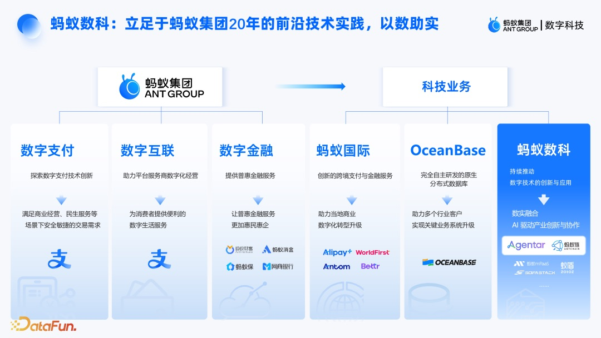

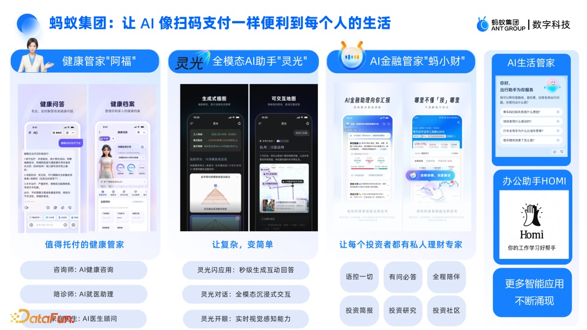

在服务客户的过程中，蚂蚁数科观察到产业 AI 落地经历了三个阶段：大模型基模的规模化部署、在基模基础上构建通用智能体、构建真正能在生产系统里稳定运行的垂类金融智能体。目前行业正处在第三阶段的攻坚期。

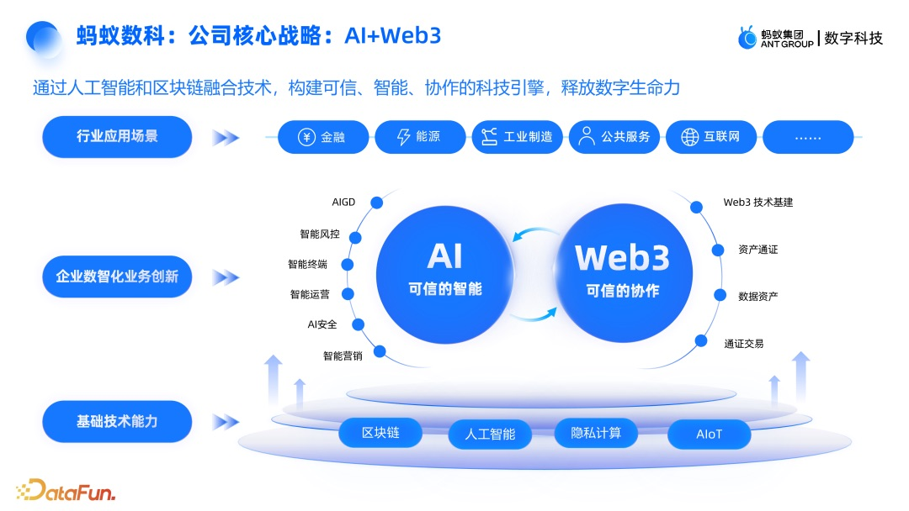

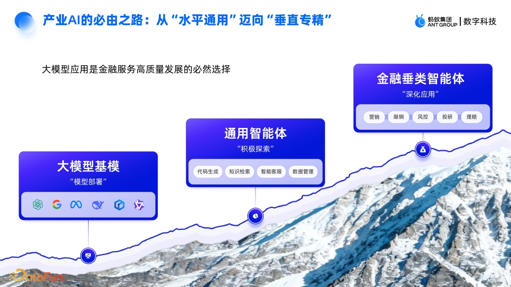

如何将通用智能体变成可在生产链路中运行的金融垂类智能体？这个问题背后隐藏着三个核心痛点。第一是金融场景对回答质量有着近乎严苛的要求，体现在严谨性（数字指标绝对不能错）、专业性（需要逻辑自洽的方法论和论据）、遵从性（满足金融监管、隐私保护和政策解读）三个维度。第二是单智能体架构存在天花板，受限于模型上下文 token 限制，跨领域问题需要多个专家智能体协作。第三是自进化需求与可控性的平衡，主流自动化方式不适用于金融场景。

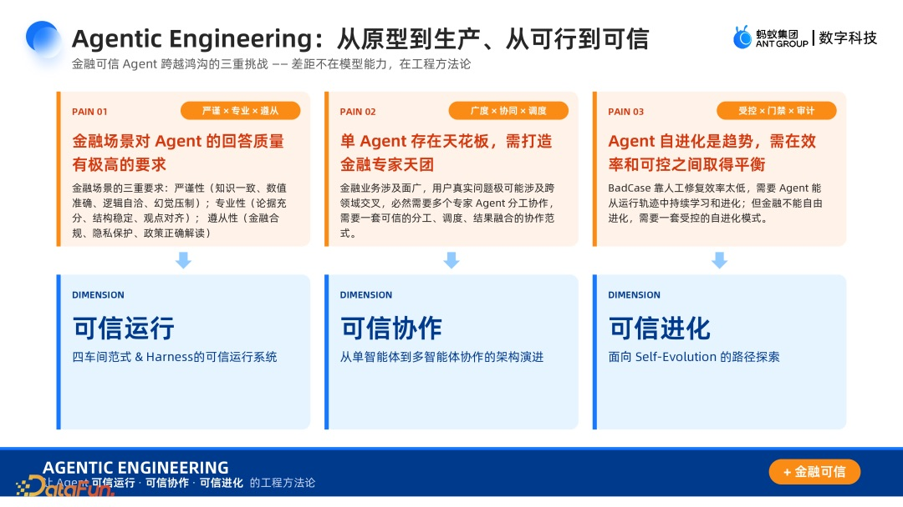

基于这三个痛点，Agentic Engineering 被定义为一套让 Agent 能够可信运行、可信协作、可信进化的工程方法论。

## 02 可信运行：基于四车间的可信智能体架构

可信运行的核心是蚂蚁的"四车间"智能体构建工程范式。以"易方达黄金基金今年以来有哪些相关新闻"为例，请求经过前置改写和记忆加载后，依次进入四个车间。

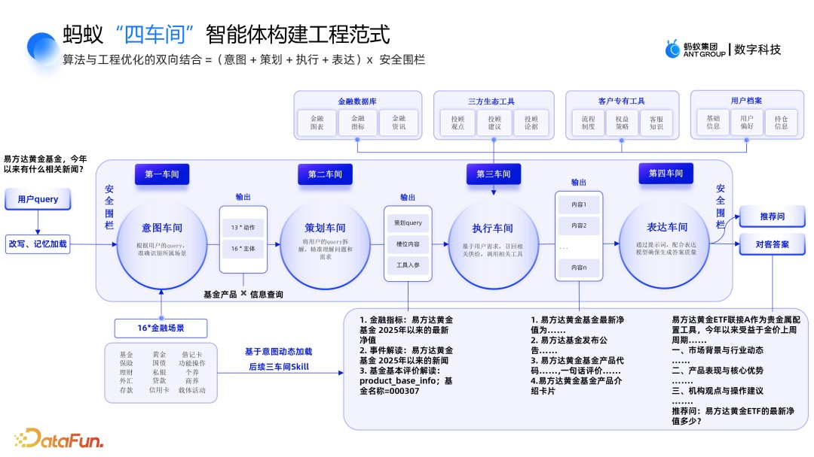

**第一车间是意图车间**，负责识别用户意图。构建了二维意图矩阵，一级意图是金融主体（基金、保险、理财等），二级意图是金融动作（查询、对比、操作建议等）。独立的意图车间用于降低后续车间与模型交互的压力，缩减上下文。实测一级意图准确率 98.6%，二级意图准确率 92.3%。

**第二车间是策划车间**，根据意图动态加载 Skill 技能。通过单独微调的策划模型从工具集中选取工具，完成入参填写和槽位提取（将自然语言转为 API 可识别的代码或 ID）。策划模型复用大模型原生的 function call 能力，Function Call 的 F1 值从 73% 提升到 95%。

**第三车间是执行车间**，将策划车间输出的工具进行并发调用。依赖的供给包括蚂蚁金融数据库、三方生态工具（投顾观点、投研建议）、客户内部专有系统（流程制度、用户 KYC 信息、持仓信息等）。

**第四车间是表达车间**，将执行车间获取的所有数据组装在一起，结合用户原始问题，调用单独微调的表达模型生成最终回答，同时并行生成推荐问。表达模型胜和率（对比 Qwen3-32B）达到 93.35%。

只有四车间还不够。团队在四车间基础上构建了 Agent Harness 工程体系，包括金融行业大模型（基于开源基模或蚂蚁百灵模型）、金融知识库、金融专家 Skill、倚天剑安全合规围栏、评测平台和可观测平台。

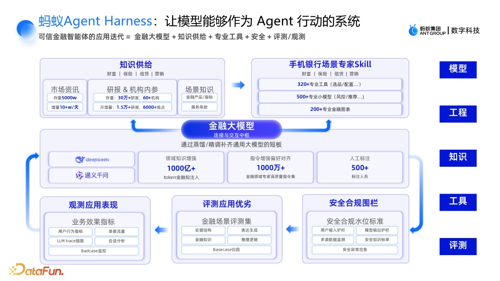

整个智能体基于蚂蚁开源的 Agent Universe 框架开发。这套框架主打开箱即用和敏捷开发，可以方便地集成开源模型、知识库、数据库，并参考 Spring 的设计思想支持配置化开发。

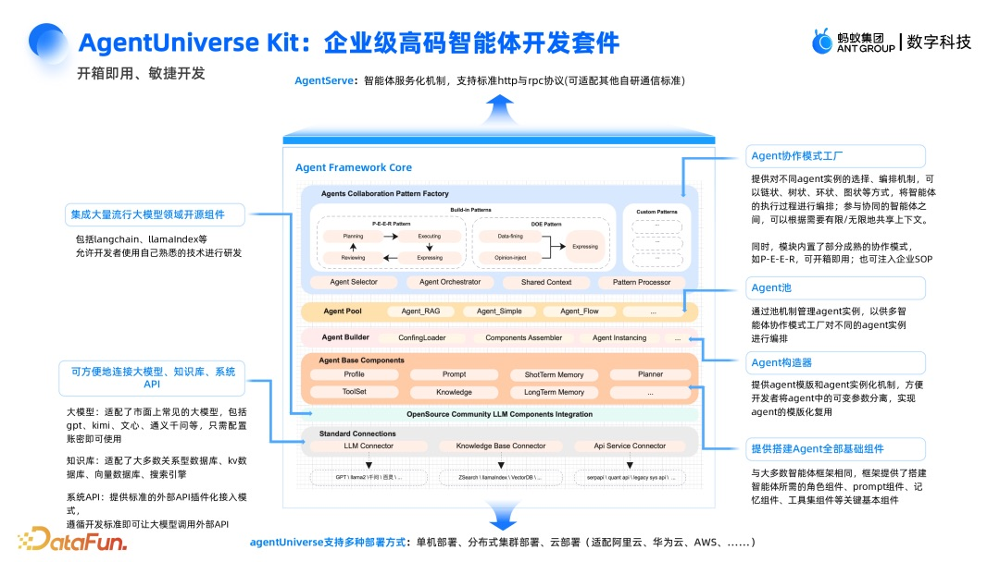

支撑四车间运转的核心是金融行业大模型。蚂蚁数科采用两阶段训练策略：第一阶段在蚂蚁内部环境训练，基于开源基模或百灵模型，结合蚂蚁财富业务数据，让模型"出厂即专家"；第二阶段在客户私有化环境浅层调优，结合客户业务数据实现"千人千面"。

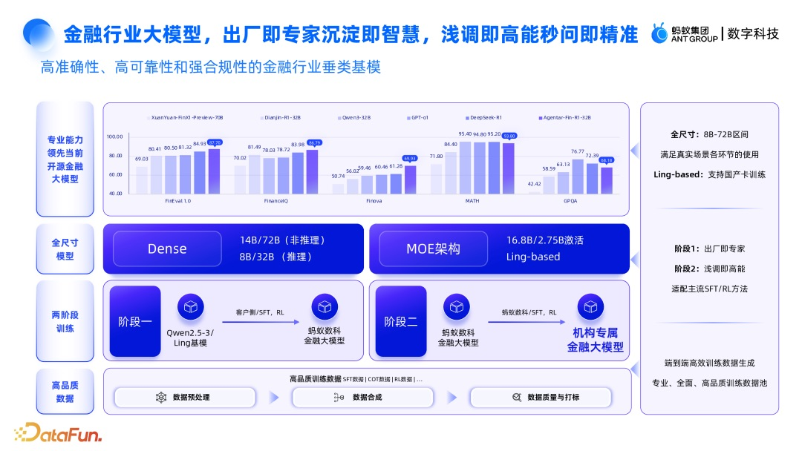

除了通用金融大模型，团队还针对四车间关键环节训练了四个专项模型。提槽模型采用"识别-召回-重排-过滤"四段流水线设计，通过 NER 进行实体识别，关键词和向量双路召回，文本相似度和业务偏好重排序，数字精确匹配等业务规则过滤，效果准确率达到 98%。

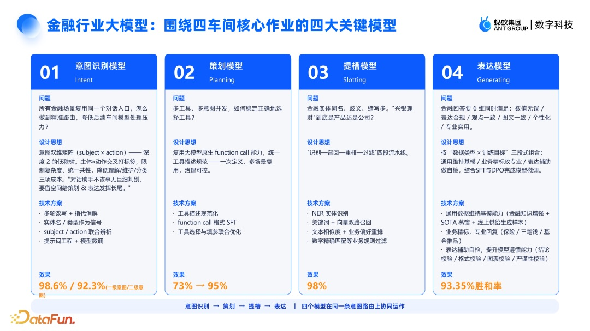

知识供给体系包含市场资讯（存量 5000 万条，日增 10 万条）、研报与机构内参（存量 30 万+研报，60+机构）、320+专业工具、500+专业小模型、200+专业金融图表。

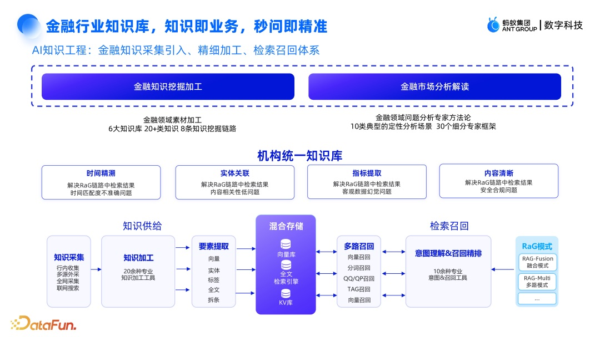

评测体系采用三层架构：L1 评测白盒逻辑（意图、提槽、策划准确性），L2 评测数据严谨性，L3 评测用户体验。评测目标是达到 85% 胜和率，以金牌理财经理为对标。可观测平台监控 TTFT、Token 消耗、点赞点踩率等指标，在 C 端场景中首屏耗时可压缩至 5 秒以内。

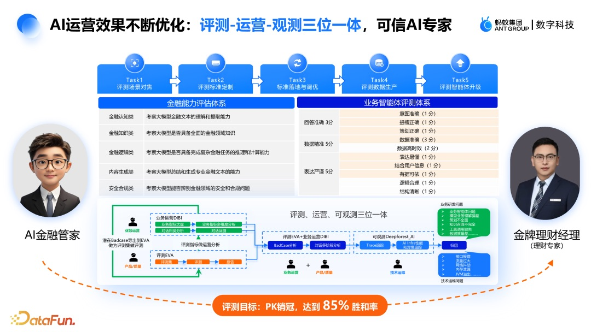

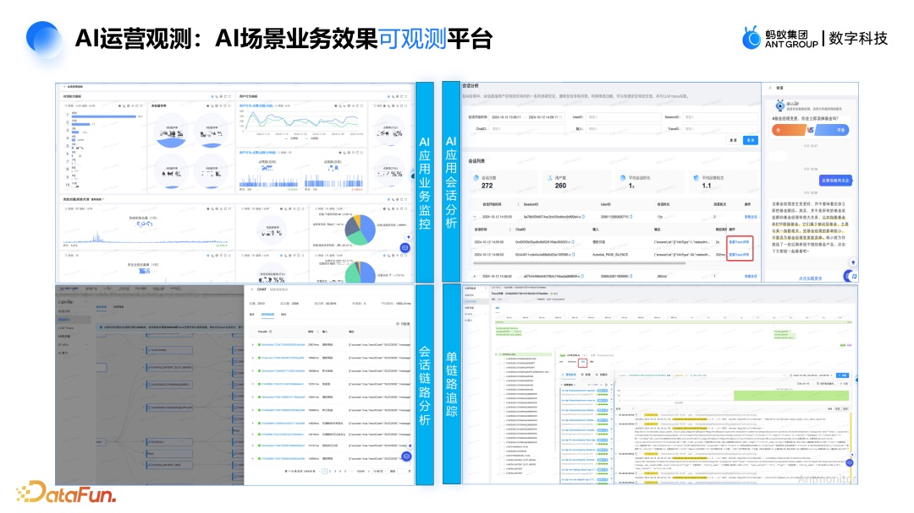

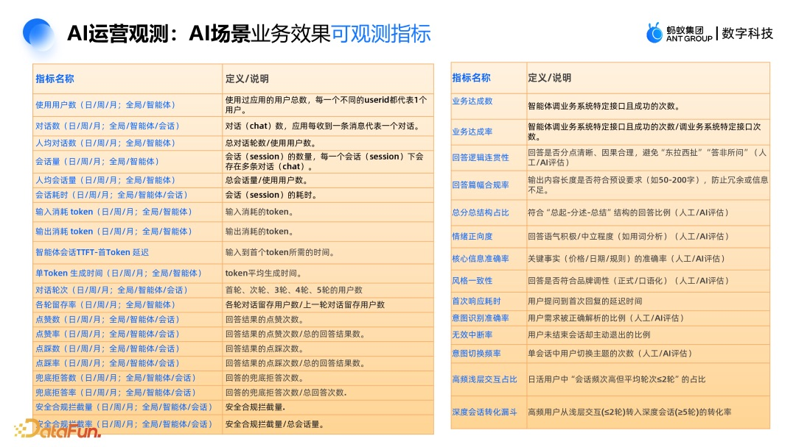

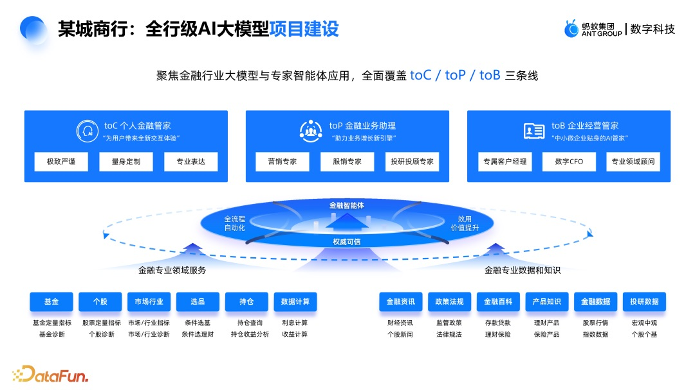

## 03 可信协作：从单智能体流水线到多智能体协作

当单智能体四车间架构无法满足复杂跨领域问题时，多智能体协作成为必然选择。蚂蚁数科设计了 Lead-Expert-Express 三层协作模型。

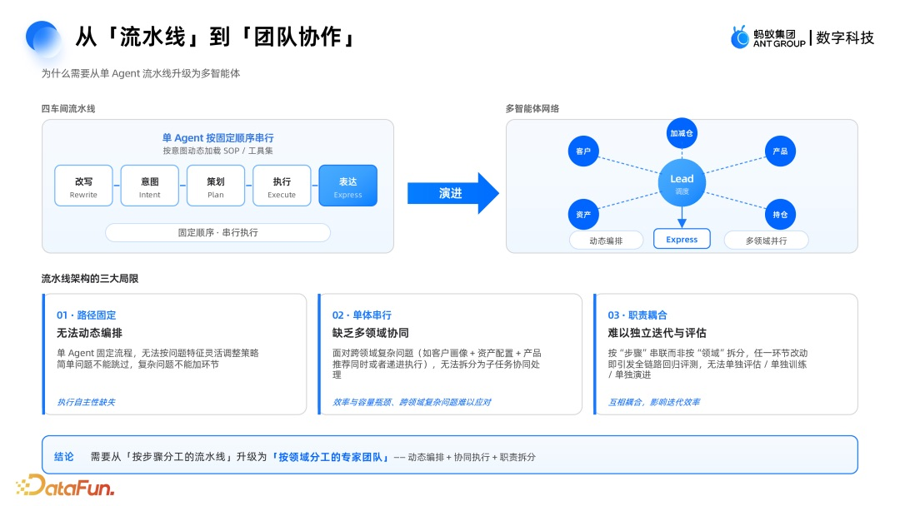

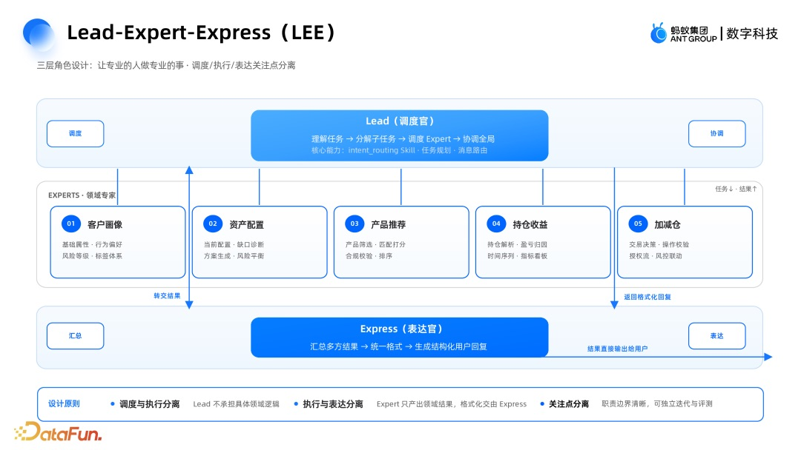

Lead（调度官）负责问题理解、任务拆解和调度；Expert（领域专家）是独立的领域智能体，如客户画像专家、产品推荐专家，职责分离、互不干扰；Express（表达官）汇总各专家结论，输出结构化报告。

实际落地采用双模混合架构：通过路由决策，高频标准化问题走"四车间"流水线模式（可控性高），复杂探索性问题走"多智能体"协作模式（灵活性高）。技术上采用 Mailbox 异步通信机制，并行调用的总时延等于各专家耗时的最大值，大幅提升响应效率。

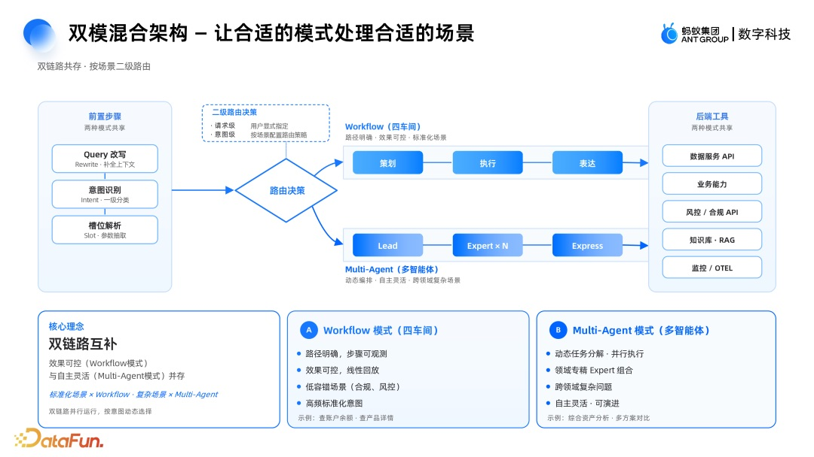

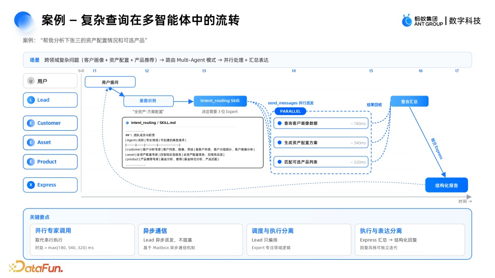

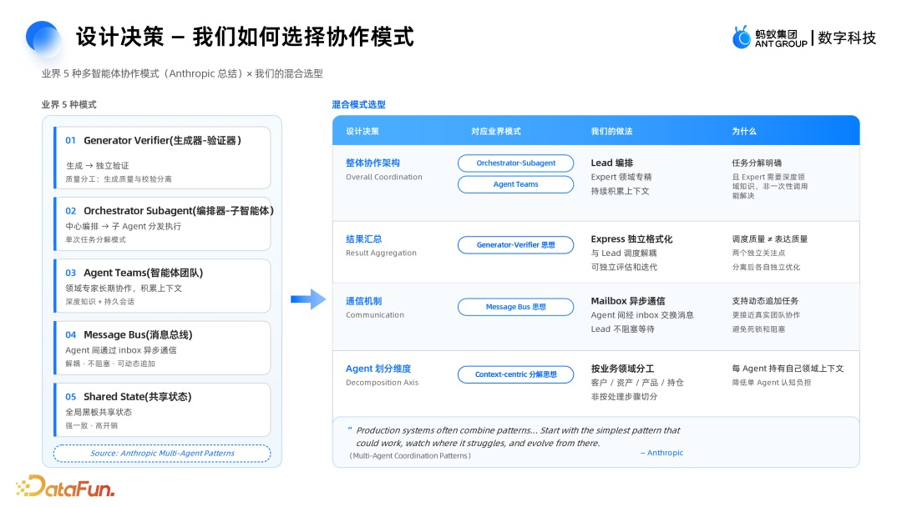

## 04 可信进化：下一代自进化模式探索

智能体持续迭代优化是工程落地的重要环节。蚂蚁数科设计了两条自进化路径。

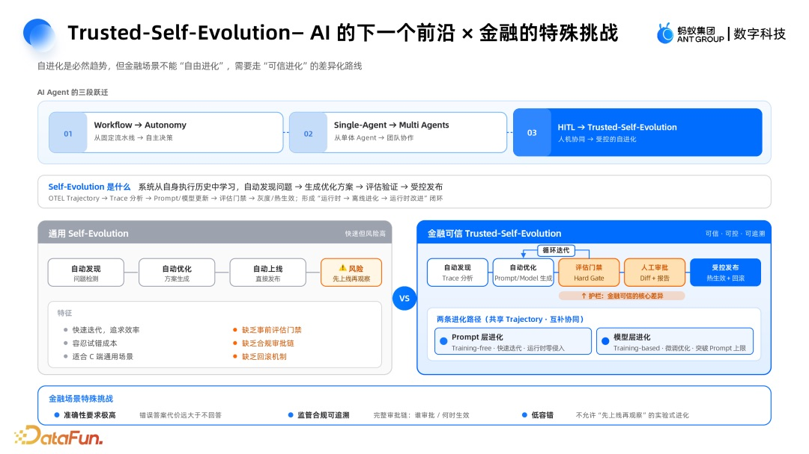

第一条是 Training-free（轻量化进化）路径，围绕提示词工程展开。通过插件采集运行轨迹，利用外置模型分析进化点，在评测集上循环迭代，通过受控发布系统（支持秒级回滚）生效。

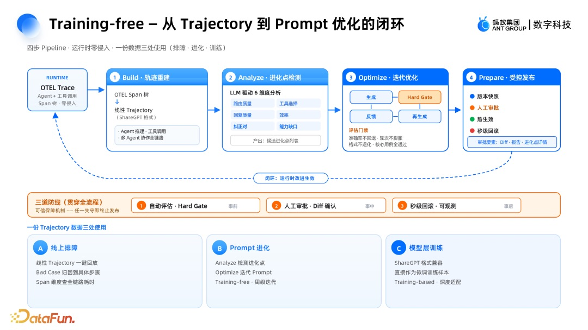

第二条是 Training-based（深度进化）路径，围绕模型层展开。当发现意图漂移或模型能力不足时，将运行轨迹转化为训练样本并扩充，通过 LoRA 或全参数微调优化模型，评测达标后发布。某城商行的意图分类模型从 V23 的 F1 值 45% 优化到 V24 的 83.33%，严格匹配率达到 79.50%。

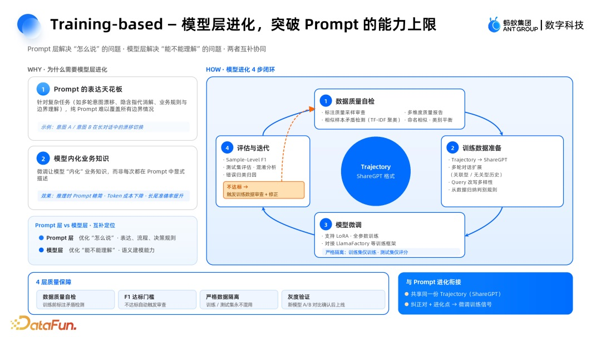

整个自进化流程包含轨迹重建、进化点检测、迭代优化、评估门禁、受控发布五个环节，确保了过程的可控性和可追溯性。

### 某城商行的全行级实践

去年，蚂蚁数科为某城商行打造了全行级 AI 大模型项目，是 Agentic Engineering 方法论的完整落地。项目构建了三大金融助手：个人金融管家（To C）、理财经理辅助助手（To P）、企业经营管家（To B）。全量采用四车间架构、金融大模型、知识库及完整评测方法论，实现私有化部署。

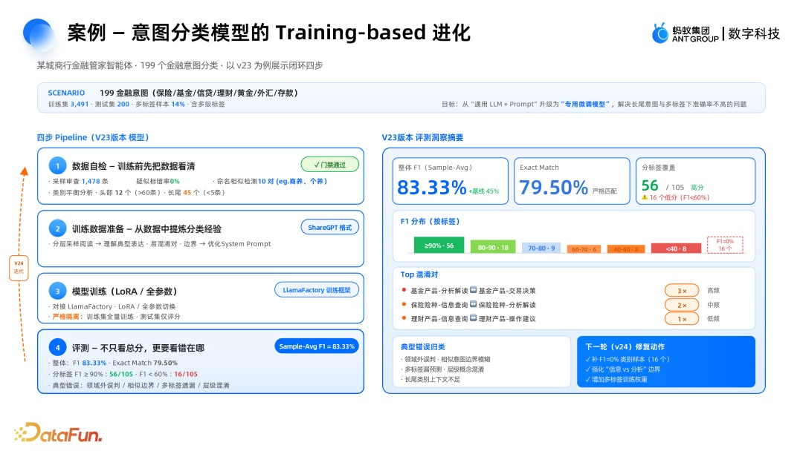

项目验证了一个关键经验：纯靠 Prompt 工程的评测通过率上限约为 80%，若要达到 90% 以上，必须配合模型微调。对于金融这样的高要求场景，工程优化和模型优化必须双管齐下。

## 05 方法论背后的产业洞察

Agentic Engineering 的价值在于它揭示了产业 AI 落地的核心矛盾：差距不在模型能力，在工程方法论。当前很多企业在智能体应用上止步于原型阶段，根本原因是缺乏从原型到生产、从可行到可信的系统性工程能力。

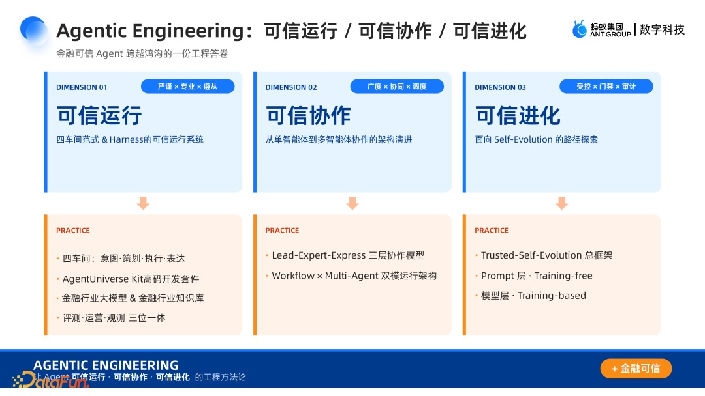

蚂蚁数科通过四车间范式解决可信运行问题，通过LEE架构解决可信协作问题，通过双路径自进化解决可信进化问题，构成完整闭环。待解决的挑战包括协作策略自动优化、代码层自进化能力、长期记忆驱动的持续学习、评测用例自动采集等。

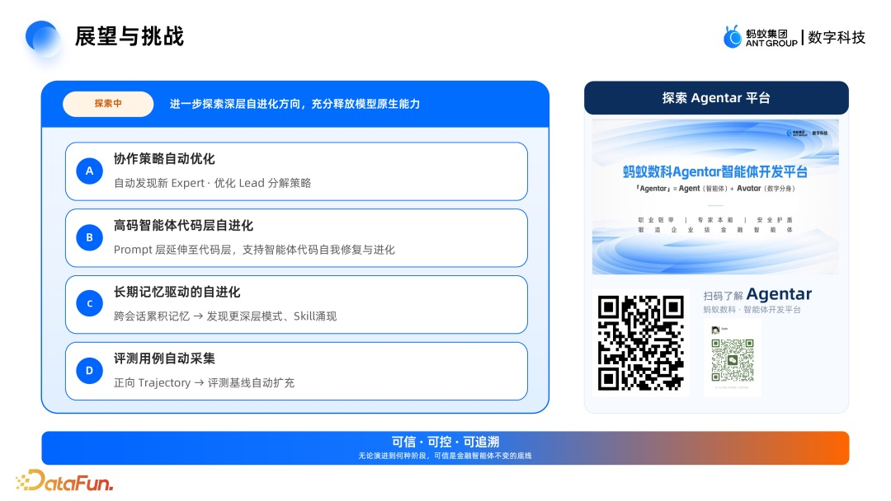

对于金融行业来说，Agentic Engineering 提供了一个可复制的范式。它证明了在严谨性、专业性、遵从性要求极高的场景下，通过系统性的工程方法，智能体完全可以从实验室走向业务一线。这或许也是整个产业 AI 从"积极探索"迈向"深化应用"的必经之路。

## 06 Q&A

### Q1: 对于没有资源进行模型微调的公司，仅通过提示词等手段，效果上限在哪里？

**陈京阳：**根据实际落地经验，如果以 1000 套评测集为例，纯提示词工程和上下文工程优化的上限大约在 80 分（即 80% 的通过率）。如果客户的验收标准要求达到 90 分或以上，这 10 分以上的差距必须通过模型微调来加强。这也呼应了前面提到的城商行案例经验。

### Q2: 金融场景中如何保证大模型回答数值准确性?

**陈京阳：**团队从三个层面同时发力：工程层面定义工具返回规则，将单位在工具返回阶段就处理成"亿元"等标准格式，避免模型二次加工产生错误；模型层面构造专门的训练样本，通过微调提升表达数据时的严谨性；数据层面预置算子，确保数据在存储落库阶段就是准确的。

### Q3：关于响应延迟的优化怎么做的？

**陈京阳：**大模型调用速度慢是普遍痛点。蚂蚁数科采取"旁路"策略解决实时性问题：针对高频问题，先检索 FAQ 知识库，命中则直接输出标准答案；其次利用缓存。通过这些工程手段，面向 C 端的场景可以将首包响应时间压缩到 5 秒以内。

**以上就是本次分享的内容，谢谢大家。**
