# 用 OpenClaw 突破企业传统数据资产架构的实践

> 原始文件：用 OpenClaw 突破企业传统数据资产架构的实践 (2026_6_23 10：35：08).html

**导读** 传统的数据架构已无法支撑大模型对高质量数据集的真实需求。本文从驾驭工程的落地实践出发，拆解高质量数据集的三要素，并详细阐述一套分层解耦、全算子化的新型平台设计。文中的实践发现与真实问题，为 AI 时代的企业数据系统重构提供了直接参考。主要内容包括以下几个部分：

1. 传统数据资产架构核心痛点
2. OpenClaw 核心定位与优势
3. 重构数据架构的核心能力
4. 落地路径与实战价值
5. 总结

- 分享嘉宾｜王仕亿 普元信息 AI科学家
- 内容校对｜韩珊珊
- 出品社区｜DataFun

## 01 传统数据资产架构核心痛点

当前数据系统普遍存在几个问题。一是数据孤岛严重，企业内部系统繁多，数据彼此割裂。二是数据治理流程过长，从原始数据到最终可用的数据集，中间要经历大量步骤。三是底层平台的功能构建和开发迭代极为复杂，一个产品迭代多个版本，依然会存在各种需要与业务流程配合解决的问题。

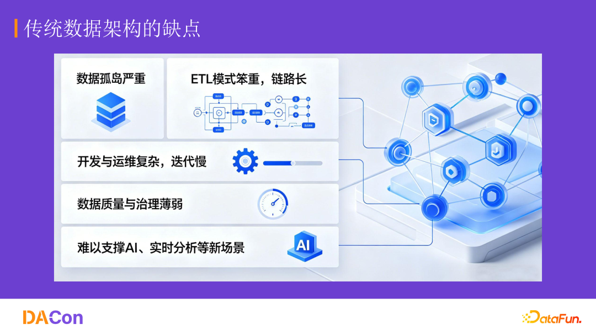

另一个更直接的问题是，国家提倡的高质量数据集，并不是把传统数据治理的工作重新做一遍。大量数据喂给大模型之后，效果并不理想。无论是私有部署还是调用云端大模型，如何将海量数据构建高质量数据集喂给模型，本身就是一个难题。

最后，现有的数据结构不足以支持 AI 做实时分析或场景应用。这是整个改造的核心动因。

### 新平台需要具备的四个特征

该方案希望构建的平台，首先要具备一套面向 AI 的 SaaS 体系。转译系统中留存的 API 接口，或者构建适配 MCP 框架，或者封装成 Skill——让 AI 能够调用系统中的所有功能。这些功能不仅包括数据治理的原始算子，还包括应用中的点击、跳转等操作。

例如：构建一个报销智能体，仅靠对话式的大模型交互显然做不到。不是因为模型不理解逻辑，而是模型需要嵌入原有系统，理解整个业务流、操作流和数据流替人完成报销操作。

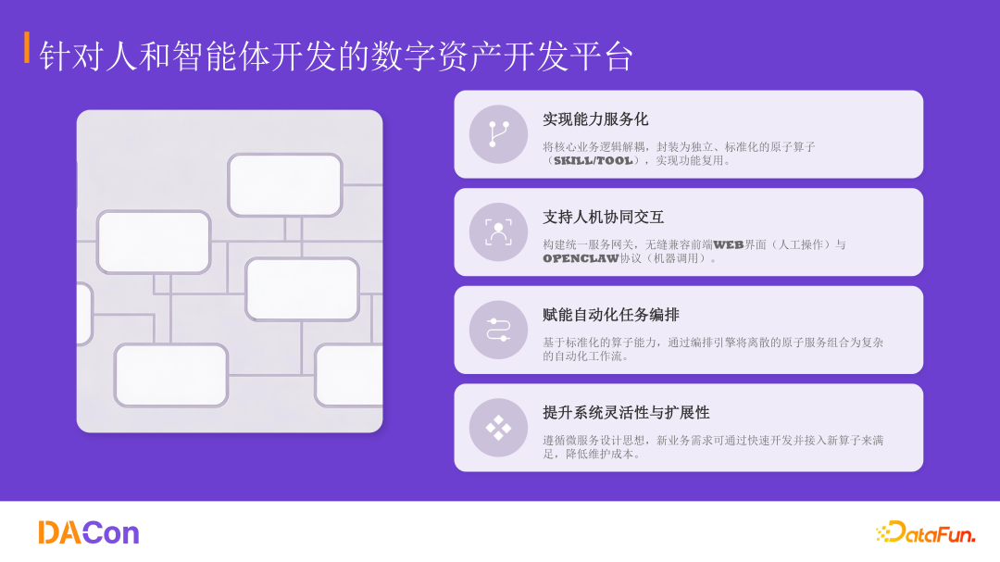

其次，传统软件系统的交互是给人使用的。人处理信息的速度很慢，智能一步一步处理或者一个页面一个页面处理。而智能体接收和输出信息的速度都很快，如何让两者在同一个工作台里同步工作，是系统需要解决的第二点。

第三，数据治理链路很长，智能体需要能自动编排任务流程。

第四，系统要能被灵活扩展到各个业务系统之间。

### 高质量数据集的三个组成部分

从底层逻辑抽象来看，一个高质量数据集应该包含三部分。

深度治理的数据集。这部分工作大量基于传统数据治理平台来完成，包括清洗、去噪、去重、对齐等。

精确标注的标注集。无论是自动驾驶的深度标注、医疗影像的结构化数据，还是各类数据表之间的结构关系，都需要标注之后才能给大模型使用。多模态、结构化、非结构化、半结构化数据，都需要一个完整的标注集去解释。

模型调用的解释集。有了高质量数据集之后，模型应该怎么调用它？如果用在图像识别训练中，另一套工作台如何拿这套数据集去应用？需要有一个相应的文档，写在Skill或使用文档里，交给下一阶段的大模型去使用。

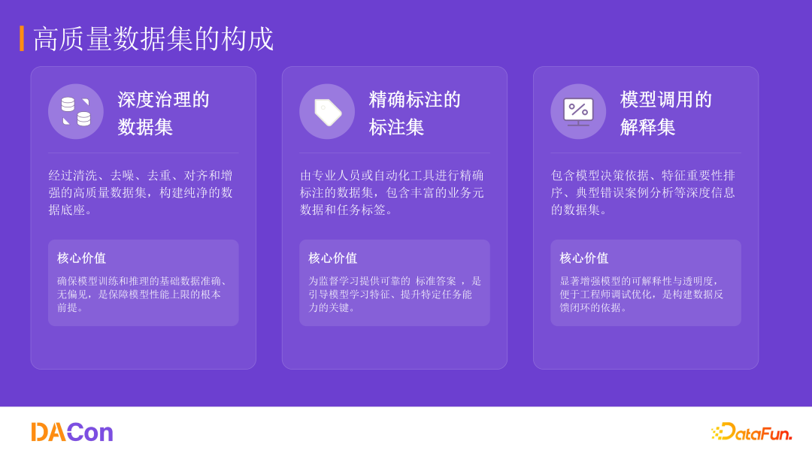

### 传统数据架构的根源问题

现在的企业系统都是以人为核心设计的。人的外层是业务工具或者说是软件系统，如 ERP、CRM 等，每个系统会产生自己的数据，导致了不同系统之间，数据流转的各种障碍，如：数据孤岛、治理链路长等问题，根源都在这里。

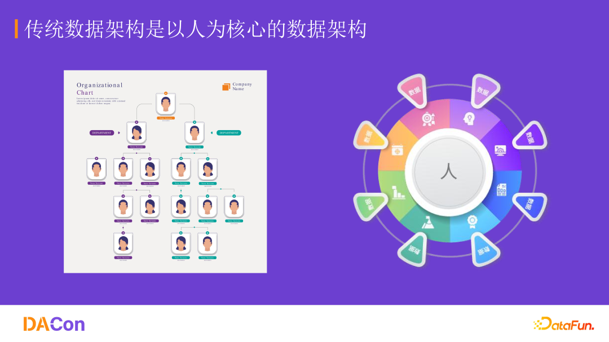

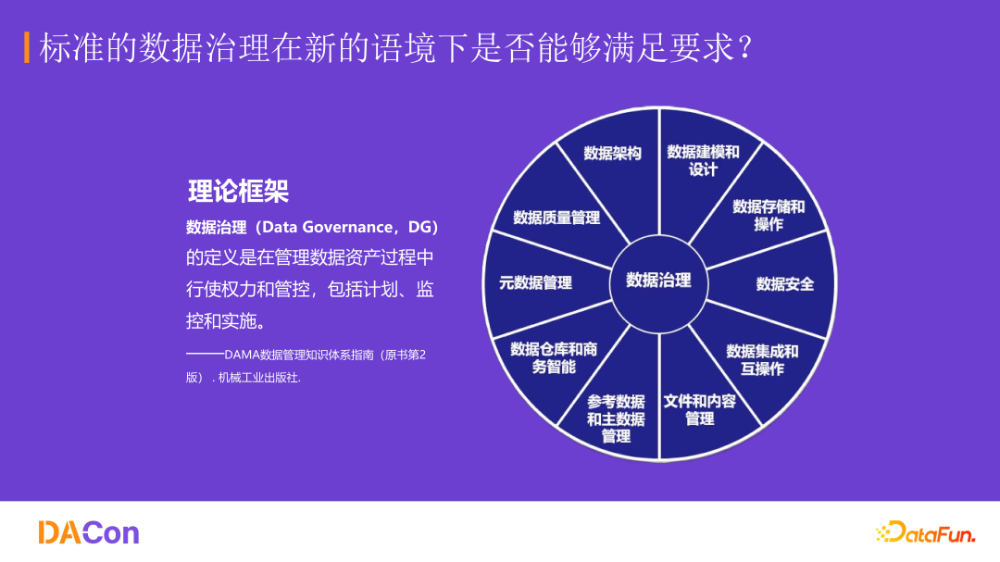

大模型来了之后，AI 需要从各个地方收集数据。这会导致要么注意力分散，要么采集不到采集不全数据。未来的企业架构可能会发生变化——以数据和知识作为核心，业务在第二层，人和 AI 作为外层。企业只关心交付的业务结果正确，至于是人完成的还是 AI 完成的并不重要。

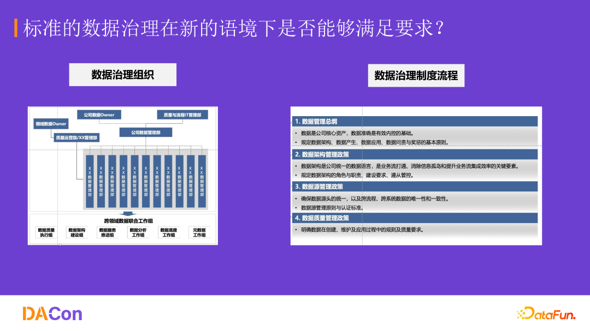

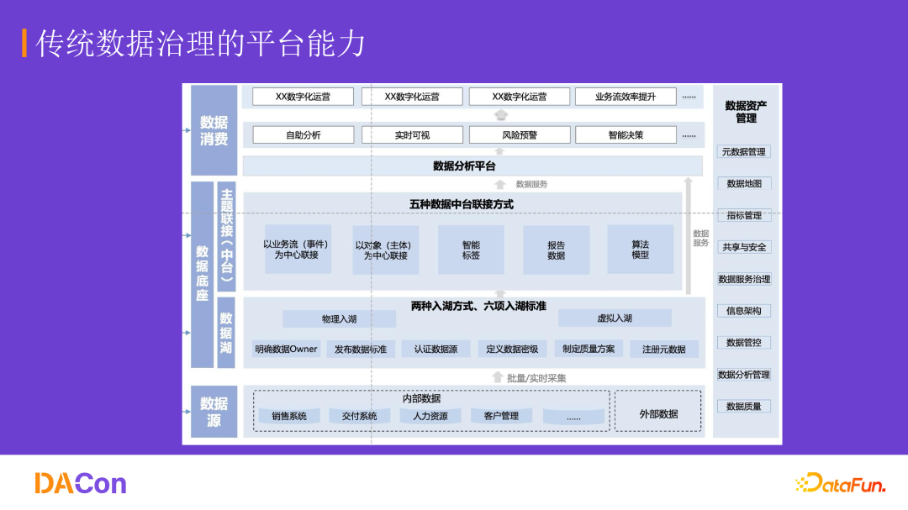

这样做的好处是，所有数据结构可以被统一管理，不需要考虑业务结构。无论是人来调用还是 AI 来调用，最后完成的都是中间层的业务结构。

当然和目前的整体架构的冲突是 AI 在企业转型的关键。现在的应用产品需要设计 UI，UI 是给人用的，大模型的能力其实不需要很强的 UI，一个对话框输入指令，它可以从后端 CLI 里调用相应的数据结构，交付业务结果就行。但人去完成这件事，就需要设计 UI，因为人需要一步一步操作。

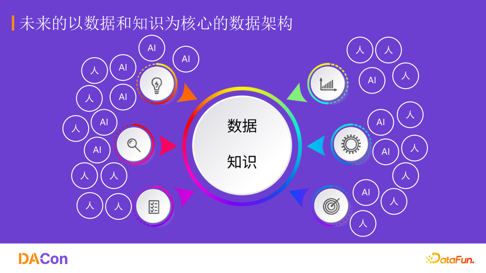

## 02 OpenClaw 核心定位与优势

OpenClaw 代表的不仅仅是某个具体工具，而是过去一年里 AI 应用发展的三个阶段的一个必然形态。

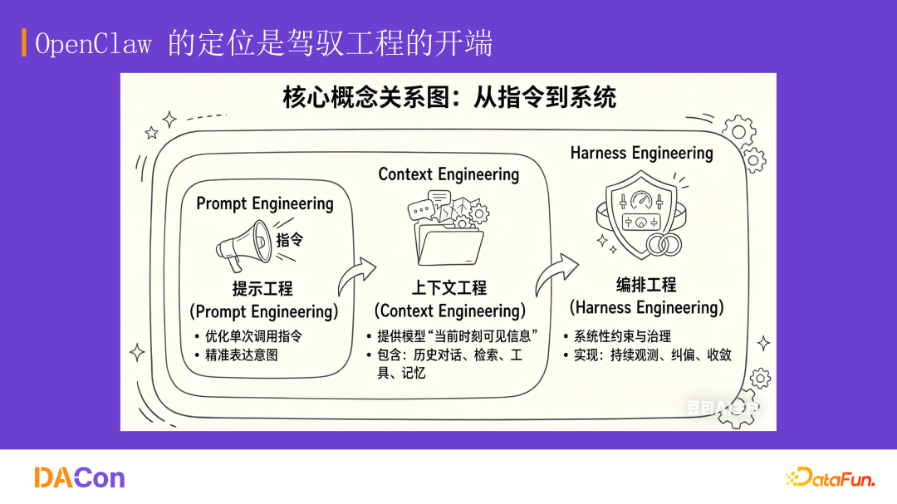

提示词工程的核心是“把话说明白”。给大模型一个人设，发现不够；再加思考模式，还不够；再给一些示例。大模型本质上是文本回复的概率模型，提示词的作用是把回复框定在一个人类认为准确的概率空间里。

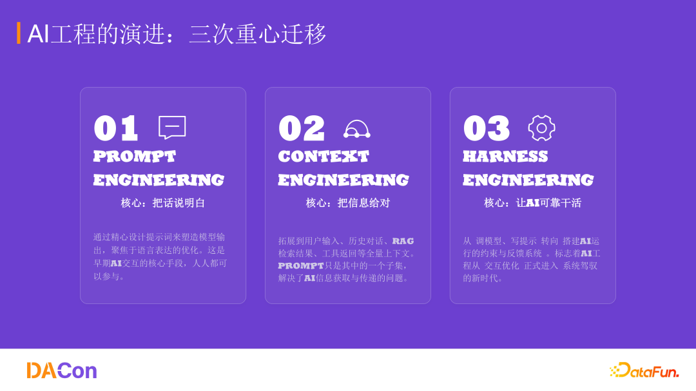

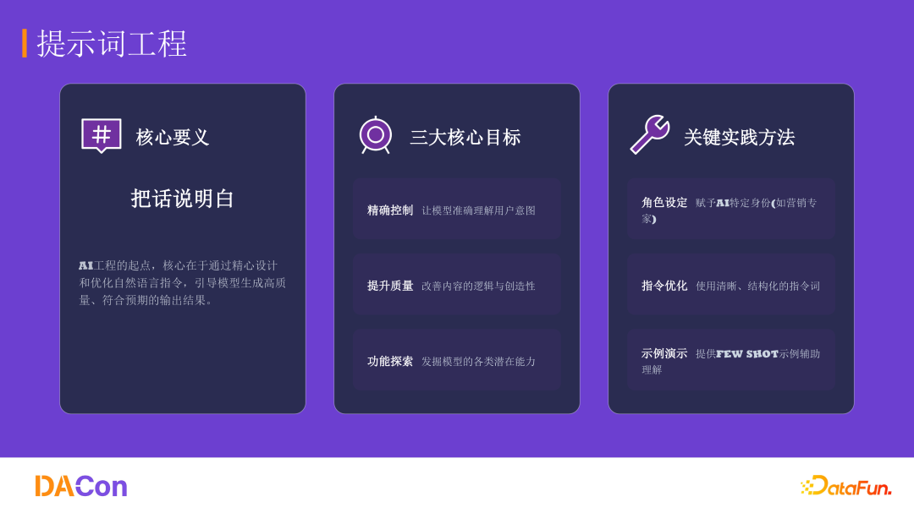

提示词工程的缺点是效果不稳定，有上下文遗忘的问题，信息孤岛现象严重。企业级数据不可能把所有数据都在对话形式的上下文里给模型。因此发展出了第二阶段，上下文工程阶段。

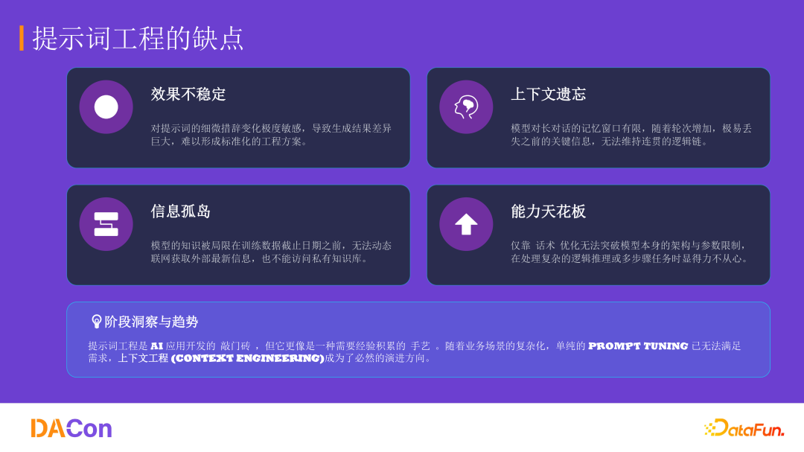

上下文工程的核心是“在正确的时间给出正确的信息”。RAG 技术是这个阶段的典型代表，让模型在需要的时候搜索需要的上下文，只把准确的上下文给它。上下文工程增强了信息广度同时又兼具了信息的密度，提升了任务复杂度，还能保持对话一致性。

但它依然有问题：一旦跑偏，拉不回来。因此，出现了如 OpenClaw 这样的驾驭工程雏形。

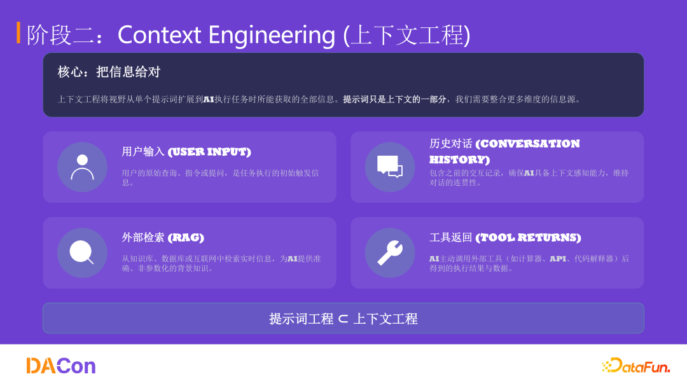

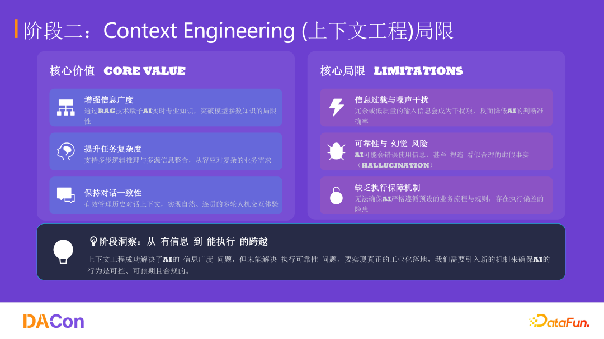

驾驭工程 Harness Engineering 的核心是“让 AI 干可靠的活”。OpenAI 工程师提出过一个公式可以概括：Agent = Model + Harness。

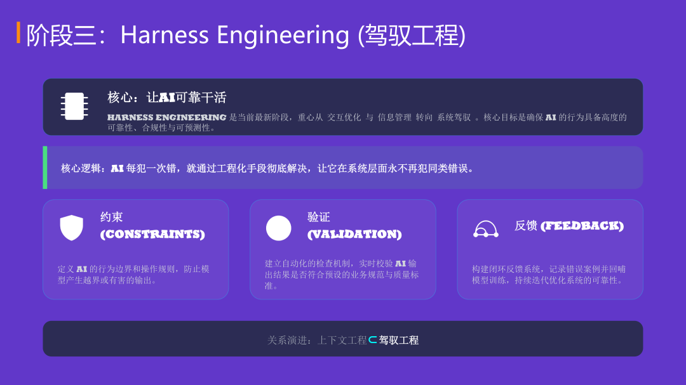

### 驾驭工程至少包含六个方向：

上下文管理：模型不是聪不聪明的问题，而是要看它到底看到了什么数据。包括角色定义、目标定义、信息选择与裁剪、结构化组织。

工具系统：什么时候该调用什么工具，工具产生的数据如何反馈回去。

执行编排：理解目标、判断信息、结果分析、生成输出。其中检查输出非常重要，可以单独设置一个自查的智能体，根据任务目标严格检查。

状态与记忆：任务状态、中间结果、长期记忆。

评估与观测：输出验收、自动化测试、日志和指标、错误归因。

约束与纠正：失败是大模型的常态，约束、校验、恢复机制在企业级应用中非常关键。

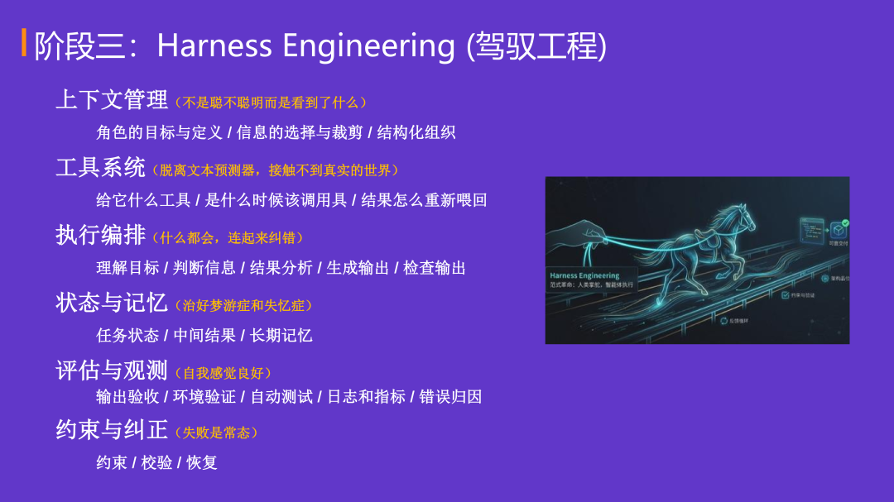

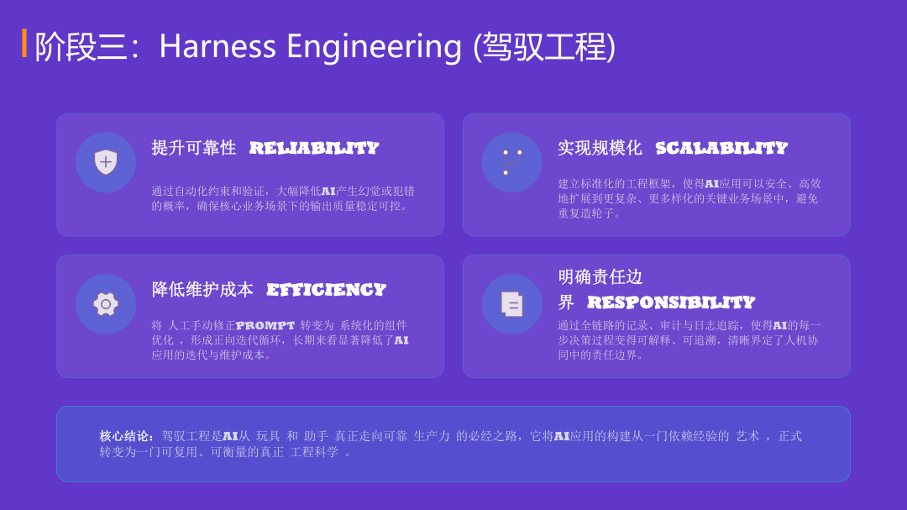

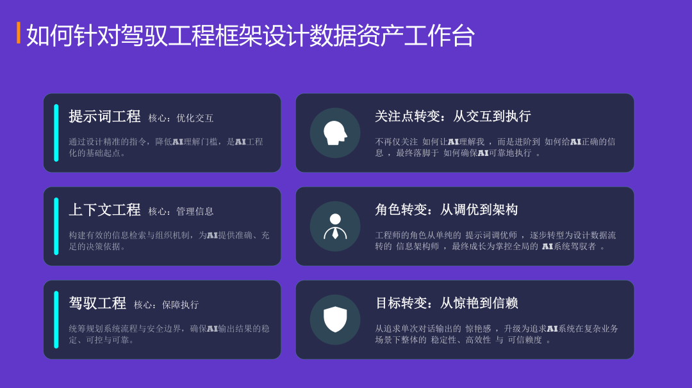

## 03 重构数据架构的核心能力

### 传统数据资产工具的问题

原有工具有几个明显的缺陷。一是解耦难，数据治理、清洗、去重全都集成在现有系统中，本质上是算子，但被封装成函数、API 等各种形式，没办法灵活拆解。二是能力孤岛，自己做的数据治理工具、大文件传输工具，连企业内部其他系统都很难调用。三是 API 管理困难，面对企业历史留存的海量 API，如何管理本身就是难题。四是编排能力缺失，大模型提供了强大的思考能力，但原有企业系统很难具备这样的能力。

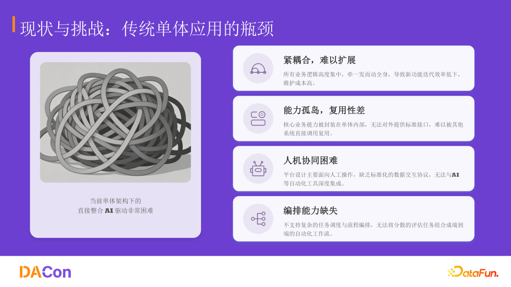

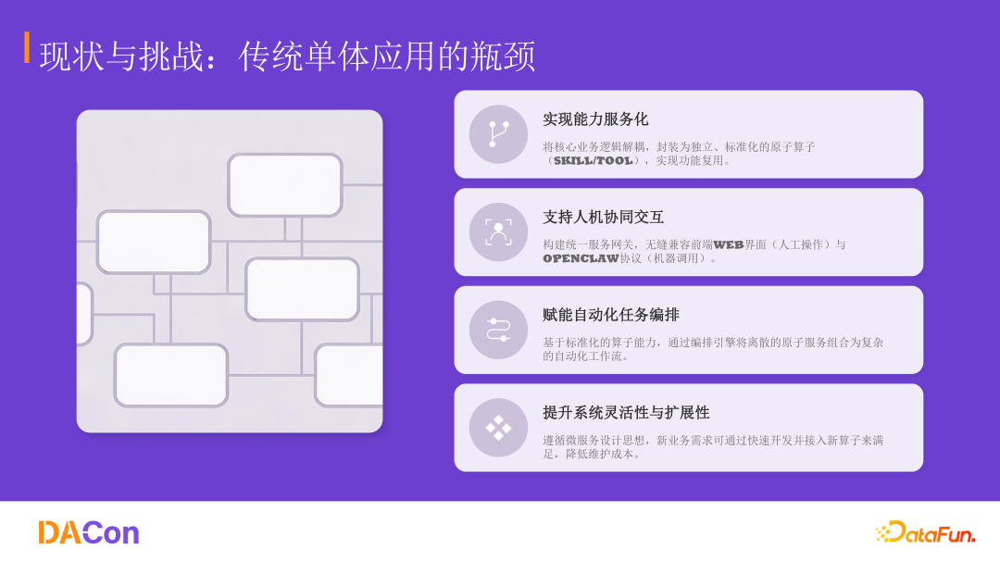

### 从单体到分层解耦的架构设计

新的分层架构将单体应用解耦为五个层次。

接入层：前端界面（人工操作）与智能体（机器调用）双入口。

网关适配层：统一协议转换、服务路由、鉴权认证、流量控制。

算子服务层：数据集构建、质量评估、血缘分析、成本统计等独立算子。

能力支撑层：通用算法工具库、统一身份认证、分布式日志监控。

数据持久层：关系型数据库、分布式缓存、非结构化文件存储。

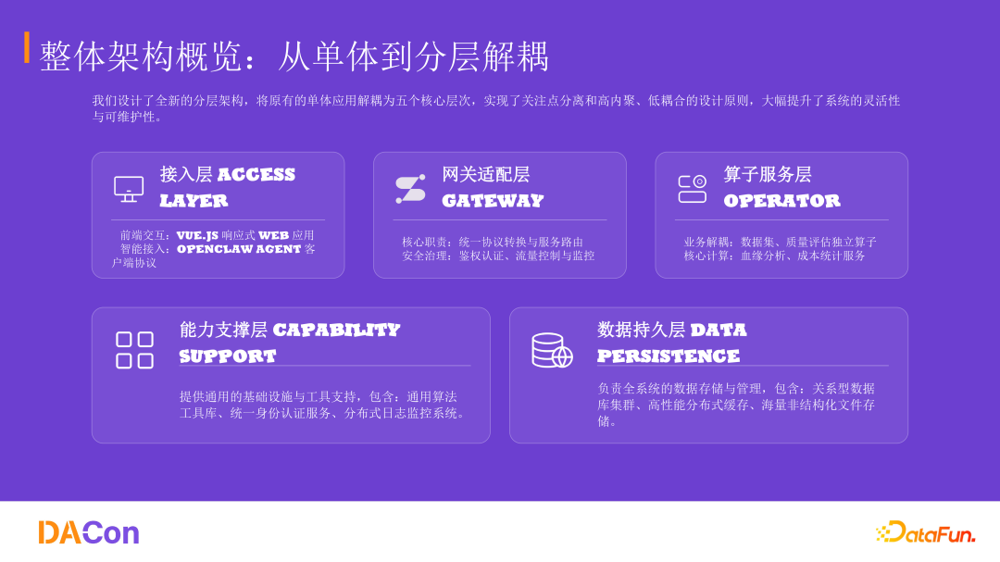

### 算子化：从功能到技能

算子化的核心是将紧密耦合的功能模块拆分为独立、标准化的服务单元。每个算子包含三部分：

元信息文件（SKILL.md）：算子的名称、描述、参数，自描述性强。

执行代码（Python）：基于 FastAPI 等框架，实现具体业务逻辑。

接口定义（Pydantic）：严格约束输入输出数据结构，运行前校验数据。

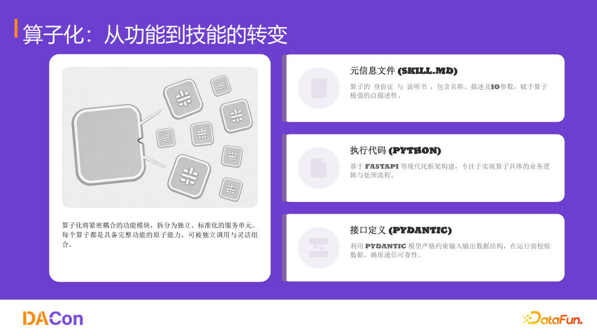

## 04 落地路径与实战价值

该方案在普元科技内部做了一套高质量数据集的工作台 Demo，累积生成超过 50 万行代码，最终版本约 9 多万行代码由一人团队（OPT）完成。这套系统有几个关键设计：

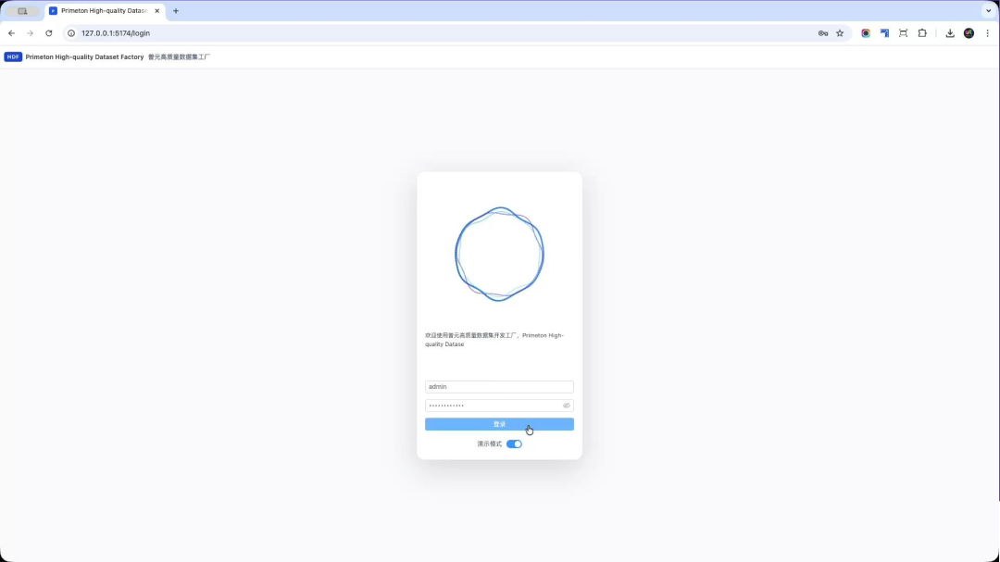

返回方式不只有对话框。大模型的交付不是给一段话或一个图表，而是直接在工程里完成任务——从数据采集到交付，再到数据标注。所有操作在工程沙盒中完成，全部留痕。

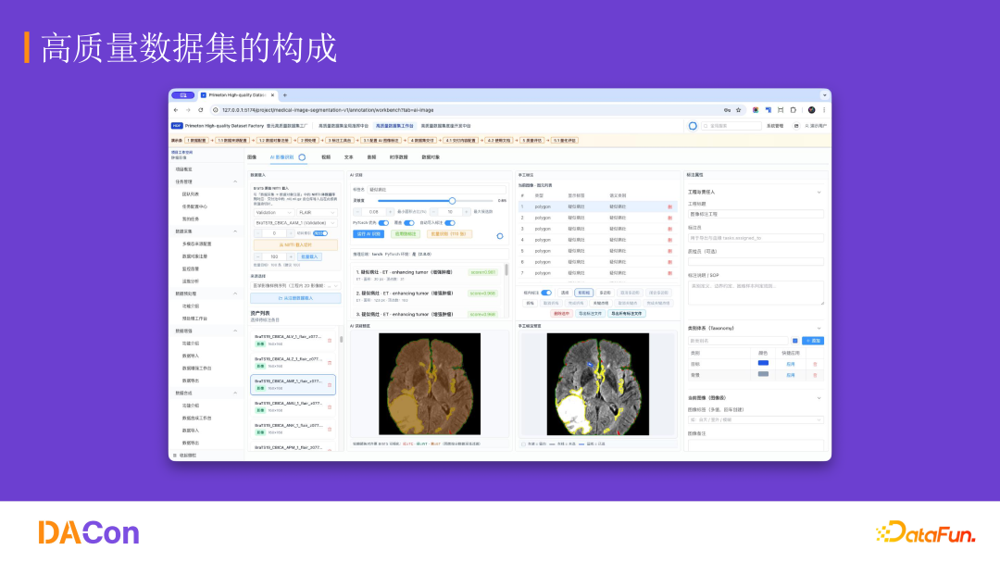

人机协同的UI依然必要。目前阶段，AB 系统并行代表着人机并行。业务人员不可能对着命令行操作，UI 是给人用的。但同时要有一套系统给 AI 用。两套系统的判别逻辑是：AI 不能判工作结果，人判别 AI 的工作结果。最终要还原到 UI 界面给人做最后决策。

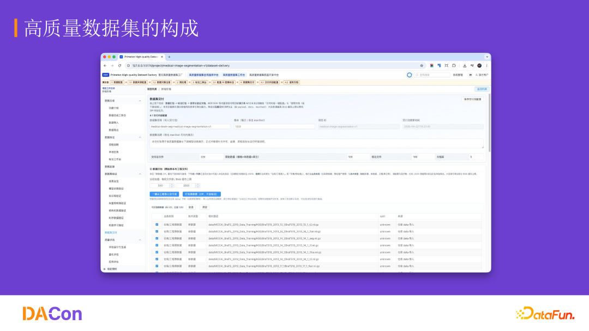

多任务协作问题。如果十个人同时用这套系统对同一份数据进行编排，如何锁定数据集、如何做版本更迭、如何编排任务，这些是实践中发现的需要进一步解决的问题。

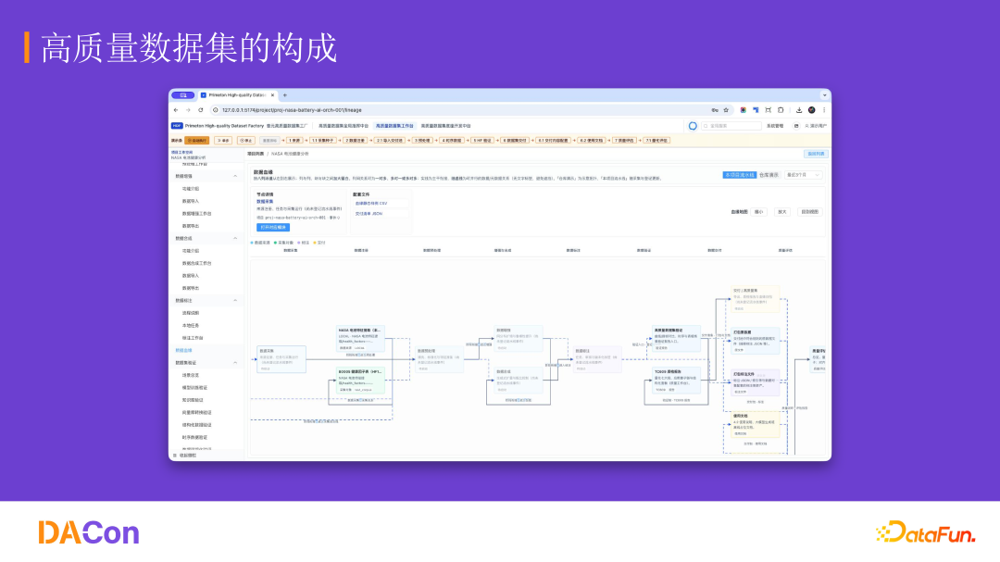

通过构建统一的算子库，供系统配置和智能体调用。针对不同场景（如自动驾驶标注和医疗影像标注）依靠算子的灵活性的编排任务流程和功能。

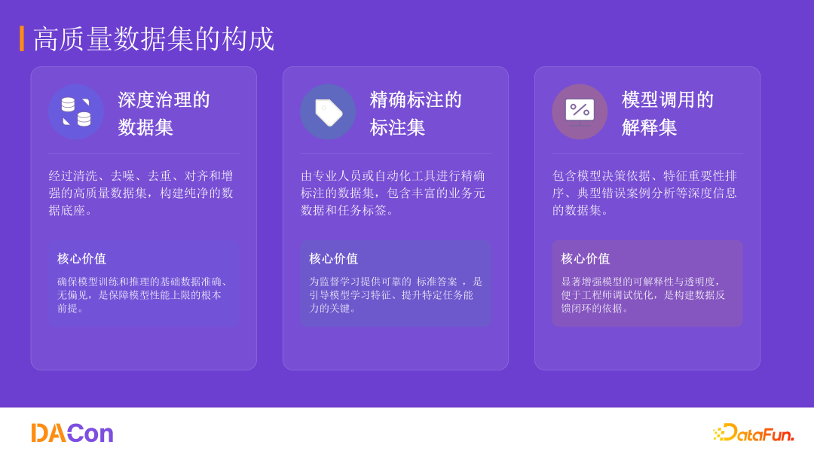

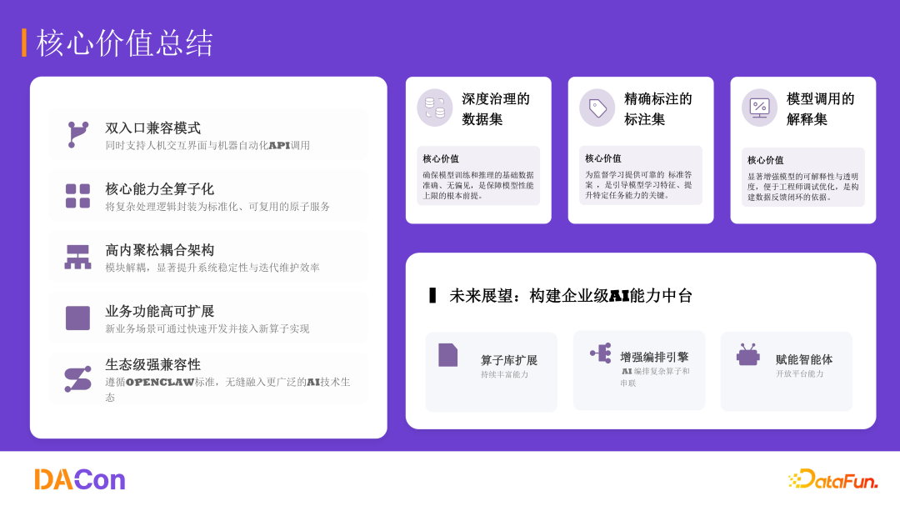

## 05 总结

该方案的核心观点可以归纳为五个方面：双入口兼容模式（人机界面与智能体调用接口）、核心能力全算子化、高内聚松耦合架构、业务功能高可扩展性、生态级强兼容性。通过人和 AI 的协同操作，帮助客户构建包含深度治理的数据集、精确标注的标注集、以及模型调用的解释集。以上就是本次分享的内容，谢谢大家。

