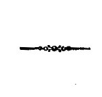

古登堡计划电子书《我们如何思维》，约翰·杜威著。

    由John Dewey撰写的Gutenberg EBook 计划,
    
    这个eBook是供任何地方的任何人免费使用,几乎没有任何限制. 您可以在www.gutenberg.org上根据EBook中包含的Gutenberg许可证项目条款复制、赠与或重新使用。
    
    标题:我们如何思考
    
    作者:约翰·杜威
    
    发布日期:2011年9月14日 [EBook #37423].
    
    语文:英文
    
    字符集编码: ISO-8859- 页:1
    
    *** 这个项目的开始 盖特伯格EBOOK如何我们认为***
    
    由朱丽叶·萨瑟兰(Juliet Sutherland),凯茜·马克萨姆(Cathy Maxam)和在线分发的校对团队在http://www.pgdp.net制作.

译者注:对连字中小的不一致之处进行了调整,以对应作者最常用的用法. 第60页更正了原文本中的打印机错误:在"......图画已经学会了...

这本电子书包含了一些古希腊语的短语,根据用户安装的字体,这些短语可能无法正确显示. 将鼠标绕过希腊语短语来查看转写,例如: (λογος).

# 我们如何思维

作者

## 约翰·杜威

哥伦比亚大学哲学教授

D. C. Heath & Co. 出版，波士顿、纽约、芝加哥

------------------------------------------------------------------------

版权，1910 年，D. C. Heath & Co. 所有

2 F 8

美国印刷

------------------------------------------------------------------------

## 序言

我们的学校对学习的倍增感到不安,每门课程都有自己的材料和原则的倍增。 我们的教师发现他们的任务更重,因为他们是来单独对待学生的,而不仅仅是大规模地对待学生。 除非预先采取这些步骤以分散注意力为目的,否则必须找到一些团结的裂痕,即一些简化的原则。 这本书代表着一种信念, 即需要稳定和集中的因素, 在于将我们称之为科学的思想和思想习惯, 当作努力的终结。 可以想象,这种科学的心态可能与教育儿童和青年相当无关。 但这本书也代表着人们相信情况并非如此;以强烈的好奇心、肥沃的想象力和对实验性探究的热爱为特征的童年的原生和未受破坏的态度,接近于科学思想的态度。 如果这些页有助于人们欣赏这种亲缘关系,并认真考虑在教育实践中承认这种亲缘关系将如何促进个人幸福和减少社会浪费,这本书将充分达到其目的。

无需列举欠我的作者。 我从根本上欠我妻子的债,他激发了这本书的思想,他通过1896年至1903年间在芝加哥存在的实验室学校的工作,从实践的体现和试验中获得了如此具体的想法。 我也很高兴承认那些在管理该校时担任教师和主管的人的智慧和同情,特别是当时是大学同事、现在是芝加哥学校主管的Ella Flagg Young女士。

纽约市,1909年12月。

------------------------------------------------------------------------

## 目录

|       |                                      |      |
|-------|--------------------------------------|------|
|       | 第一部分                             |      |
|       | 思维训练的问题                       |      |
| 章    |                                      | 页码 |
| 一.   | 什么是思维？                         | 1    |
| 二.   | 思维训练的必要性                     | 14   |
| 三.   | 思维训练中的自然资源                 | 29   |
| 四.   | 学校条件与思维训练                   | 45   |
| 五.   | 心智训练的手段与目的：心理的与逻辑的 | 56   |
|       |                                      |      |
|       | 第二部分                             |      |
|       | 逻辑方面的考察                       |      |
| 六.   | 完整思维活动的分析                   | 68   |
| 七.   | 系统推理：归纳与演绎                 | 79   |
| 八.   | 判断：事实的解释                     | 101  |
| 九.   | 意义：概念与理解                     | 116  |
| 十.   | 具体思维与抽象思维                   | 135  |
| 十一. | 经验性思维与科学思维                 | 145  |
|       |                                      |      |
|       | 第三部分                             |      |
|       | 思维训练                             |      |
| 十二. | 活动与思维训练                       | 157  |
| 十三. | 语言与思维训练                       | 170  |
| 十四. | 思维训练中的观察与信息               | 188  |
| 十五. | 课堂问答与思维训练                   | 201  |
| 十六. | 若干一般结论                         | 214  |

------------------------------------------------------------------------

## 我们如何思维

------------------------------------------------------------------------

## 第一部分：思维训练的问题

------------------------------------------------------------------------

## 第一章

#### 什么是思维？

§ 1. 术语的各种含义

四觉从广至有限.

我们的嘴唇上没有比思考和思考更经常说的话。 因此,我们使用这些词语,确实非常繁杂,而且不尽相同,所以我们很难简单地界定这些词语的含义。 本章的目的是找到一个单一的一致含义. 可以考虑使用这些术语的一些典型方式来提供援助。 首先,思想被广泛使用,而不是随意使用。 想到的一切,"走进我们的脑袋",都叫做思想. 想到一件事情,就是从任何方面意识到它。 第二,这个术语被限制,排除了直接呈现的事物;我们只想(或想)我们没有直接看到,听到,闻,或品味的东西. 第三,意义进一步局限于基于某种证据或证词的信仰. 在这种第三种类型中,必须歧视两种,或者说两种程度。在某些情况下,一种信念被接受,只是略微或几乎没有试图说明支持它的理由。 在其他情况下,故意寻求某种信仰的根据或依据,而其理由或依据足以支持所审查的信念。 这一过程被称为反思性思考;它本身在价值上是真正教育性的,因此构成了本卷的主要课题. 我们现在简要地描述这四种感觉中的每一种。

机会和闲置思维

一、从最松散的意义上来说,思考意味着一切,正如我们所说的,是"在我们脑海里",或者"通过我们的脑海里". 提供"一分钱给你"的人 并不指望能推动任何大交易 他称自己要求的思想为目标时,并不打算将尊严、连续性或真相描述为目标。 任何闲置的花哨,琐碎的回忆,或挥舞的印象,都会满足他的要求. 白日梦,在空中建造城堡 在放松的瞬间漂浮在我们脑海里的 随意和断开的 物质的松散流动, 在这个随机的意义上,就是在思考。 我们的觉醒生活比我们本该承认的还要多,甚至对自己来说,很可能在这种无足轻重的磨难中被抛弃,充满了无谓的幻想和无谓的希望。

反射思想是连续的, 不仅仅是一个顺序

在这个意义上,愚蠢的民俗和呆子会思考. 故事讲述了一位在情报方面略负声望的人,他希望在他的新英格兰小镇被选为选手,在这个明智的场合向邻居们发了一个结:"我听说你并不相信我知道足以担任官职. 我希望你明白,我在思考 的东西或其他的大部分时间。" 现在反省思想就像这种随机的周游事物的思维, 因为它是由一系列被思考的东西组成的; 但是它却不同, 因为它只是偶然的发生“某事或其他” 在一个不规则的序列中是不够的。 反省不仅涉及一系列想法,而且涉及一种后果——连续顺序,以便两者将各自确定为适当的结果,而各自则依次归顺其前辈。 反省思想的后半部分互相发展,互相支持,他们不进不退。 每个阶段都是从某种东西到某种东西的一步——从技术上讲,这是一个思想术语。 每个学期都留下一笔押金,用于下一个学期。 溪流或溪流成为火车,链条,或线条.

将思维限制在超出直接观察的范围

然而,反思的目的在于相信

二、即使在广义上使用思维时,它通常也仅限于没有直接感知到的事项:即我们所看不到的,嗅觉,听觉,或触觉. 我们问讲故事的人,如果他看到某个事件发生,他的回答可能是:"不,我只想到它". 与忠实的观察记录不同的发明笔记存在. 在这一类中,最重要的是一系列富有想象力的事件和事件,这些事件和事件具有某种一致性,紧紧挂在一条连续的线上,它们介于奇特的意外飞行和为得出结论而故意采用的考虑之间。 儿童所讲述的富有想象力的故事有着各种程度的内部和谐;有些是脱节的,有些是阐述的。 当连接时,它们模拟反射思维;事实上,它们通常发生在逻辑能力的头脑中.这些富有想象力的企业往往先考虑近身型,并为它铺平道路。 但他们不是以知识为目的的,不是以信仰真理为目的的;即使他们是象那样的,他们也是被思维所背离的。 表达这种想法的人并不期望可信,而是称赞精心构筑的阴谋或精心安排的高潮. 他们编造了好故事,不是偶然的-知识 这种思想是感觉的精华;情绪或情绪的增强是它们的目的;情感的凝聚,它们绑定的领带.

思想通过两种方式诱导信仰

三、从下一个意义上说,思想是指建立在某种基础上的信念,即超越直接存在的真正的或假定的知识。 它的特点是接受或拒绝合理可能或不可能接受的东西。 然而,这一阶段的思想包括两种不同的信仰,即使它们的区别完全是程度的区别,而不是同类的区别,但实际上必须分别考虑它们。 有些信仰在本身没有考虑其理由时被接受,另一些信仰因其理由经过审查而被接受.

当我们说,"男人过去以为世界是平的",或者"我以为你走过房子"时,我们表示相信:一些东西被接受,持有,默许,或者被确认. 但是,这种想法可能意味着一种未经考虑其真实理由而接受的假设。 这些可能足够,但可能不够;但是,它们对于它们给予的信念支持的价值没有得到考虑。

这种思想是无意识的,没有提及正确信仰的实现。 他们被带走了,我们不知道怎么做到的。 他们通过不明的渠道 暗示自己被接受 并不知不觉地成为我们精神家具的一部分 传统、教诲、模仿——都取决于以某种形式的权威,或为了我们自己的利益,或怀着强烈的热情投入其中——都是由他们负责的。 这种思想是偏见,即偏见,而不是偏见。判决的正确性取决于对证据的调查。<a href="#Footnote_1_1" class="fnanchor">[1]</a>

考虑信仰的基础和后果

四、导致信仰的思想重视这些思想,从而导致反思、自觉地调查信仰的性质、条件和根基。 在云中想到鲸鱼和骆驼,就是在幻想中取悦自己,可以满足我们的喜悦,这并不能导致任何特定的信仰. 但是,把世界看成是平坦的,就是把一种品质说成是真实的事物的不动产。 这一结论表明,事物之间存在联系,因此,与想象力一样,对我们的情绪来说,不是塑料。 相信世界的平坦让持有它的人以某些特定的方式思考其他物体,如天体,反波斯,航海的可能性. 它规定他的行动符合他对这些目标的构想。

信仰对其他信仰和行为的后果可能非常重要,因此,男子被迫考虑其信仰的理由或理由及其逻辑后果。 这意味着反省思考——从其优雅和强烈的意义上思考。

所定义的反思思想

男人认为世界是平的,直到哥伦布认为是圆的. 早先的想法是一种信念,因为男人没有精力或勇气去质疑关于他们的人接受和教导什么,特别是这一点似乎得到明显合理事实的证实。 哥伦布的想法是一个合理的结论. 它标志着对事实的研究、对证据的审查和修改、对各种假设的影响的研拟以及对证据的审查和修改的结束。将这些理论结果相互比较,并与已知的事实进行比较. 因为哥伦布没有毫不犹豫地接受现在的传统理论,因为他怀疑和质询,所以他得出了他的思想. 从长期习惯来看,对什么持怀疑态度,似乎最确定,对看似不可能的事情持怀疑态度,他继续思考,直到他能够拿出证据来证明他的信心和不信。 即使他的结论最终被证明是错误的,它也会是不同于那些它对立的信仰,因为它是通过另一种方法达成的. 积极、持续和仔细地根据支持这种认识的理由以及它所趋向的进一步结论,审议任何信念或假定的知识形式,都是反映性思维。 前三种思想中的任何一种都可能引起这种类型的思想;但是,一旦开始,就是一种自觉和自愿的努力,以便在坚定的理由基础上建立信念。

§ 2. 思维中的核心因素

所有类型的思想都有共同的要素:

然而,刚才概述的各种行动之间没有明显的分界线。 实现正确的反思习惯的问题要比它容易得多,不同的思维方式不是不明智地相互融合。 迄今为止,我们考虑了每一种非常极端的情况,以便明确摆在我们面前。 让我们现在扭转这一行动;让我们考虑一个简单的思维案例,介于认真审查证据和仅仅不负责任的幻想之间。 一个人在温暖的一天走路 他最后一次观察天空时,天空是晴朗的;但目前,他注意到,虽然主要是其他东西,空气却比较凉爽。 他觉得,它可能会雨;仰望,他看见他和太阳之间有一道暗云,然后他加速步调. 如果有的话,在这种情况下,什么叫做思考? 无论是行走的动作还是寒冷的记号都不是一种想法. 行走是活动的一个方向;看和注意到是其他活动方式。 然而,它可能降雨,这是某种暗示。 行者觉了寒;他想着云和即将到来的淋浴.

即未遵守的建议

但是,反思也涉及表示

至今为止,还有同样的情况,当人们看到一朵云,就会想起一个人类的人物和面孔。 在这两种情况下的思考(信仰和花哨的情况)都涉及一个注意到或察觉的事实,然后是所看到的东西所暗示的、没有被观察到但被想到的另一些事实。 正如我们所说,一个使我们想起另一个。 然而,在两种建议中,与这一一致因素并列是明显分歧的一个因素。 我们不相信云层所建议的面孔;我们根本不考虑它是事实的可能性。 没有反省的想法。 相反,雨的危险向我们呈现出一种真正的可能性——与所观察到的凉爽程度具有同样性质的可能事实。换句话说,我们不认为云的含义或表示面孔,而只是暗示它,而我们确实认为凉爽可能意味着下雨。 在第一种情况下,看到一个物体,我们恰巧如我们所说,想到别的东西;在第二种情况下,我们考虑所看到物体与所建议的物体之间的联系的可能性和性质. 所看到的东西在某种程度上被视为对建议的东西的信念的基础或基础;它具有证据的质量。

表示函数的各种同义词

一种作用表示或表明另一种作用,从而导致我们考虑一种作用在多大程度上可被视为相信另一种作用,因此,它是所有反映或独特的智力思维的核心因素。 学生通过指出其含义和含义所适用的各种情况,最好能亲自了解反映思想的词语所表明的事实。 这些术语的同义词是:指,指,指,指,指,指,代表,代表,指.<a href="#Footnote_2_2" class="fnanchor">[2]</a>我们还说一件事预示着另一件事;是另一件事的不祥之兆,或者是它的一种症状,或者是它的关键,或者(如果联系相当模糊的话)它给出了暗示,线索,或者暗示。

对证据的反思和信念

因此,反思意味着,某件事不是直接相信的(或不信的),而是通过作为证人、证据、证据、凭证和授权证的其他东西相信的,即作为信仰的理由。 一次,雨实际上被感觉或直接体验;另一次,我们推断它已经从草木的外观中降下,或者由于空气状况或气压计的状态而要下雨. 有一次,我们看到一个人(或假设我们这样做)没有任何中间事实;有一次,我们并不完全确定我们所看到的是什么,并寻找作为迹象、迹象和信条的随附事实。

就本调查而言,思考的定义是,现有事实表明其他事实(或事实)的行动,其方式是促使人们根据前者的实际情况或理由相信后者。 我们不把仅仅建立在最可靠程度的保证上。 说"我想是这样"意味着我还不知道 推论信仰可能后来得到确认,并如实站立,但本身就始终有一定的假设要素.

§ 3. 反思思考的要素

如此多的描述 更外部和明显的方面的事实 叫做思考。 进一步考虑一下,就会发现参与每个反射操作的某些子程序。 它们是:(a) 困惑、犹豫、怀疑的状态;和(b) 旨在揭示进一步事实的搜查或调查行为,这些事实有助于证实或否定所提出的信念。

不确定性的重要性

\(a\) 在我们的例子中,酷酷的冲击至少暂时造成了混乱和怀疑。 由于这是出乎意料的,所以是需要说明、查明或安置的冲击或中断。 说突然发生的温度变化可能构成一个强迫和人为的问题;但如果我们愿意将问题一词的含义扩大到任何事物——无论性格多么轻微和常见——对思想的迷惑和质疑,从而使信念完全不确定,那么这种突然变化的经历就涉及到真正的问题或问题。

和调查,以检验

\(b\) 头部的转动、眼睛的抬起、对天的扫描,都是为将事实带入认识而调整的活动,将回答突然凉爽提出的问题。 事实本身他们首先提出自己是令人困惑的;然而,他们却提出云。 寻找是发现这一解释是否正确的行为。 它可能再次被迫将这种几乎自动的外观说成是一种研究或调查行为。 但是,如果我们愿意将我们的精神操作概念概括为包括微不足道和普通的以及技术的和重新定义的,那么就没有理由拒绝给这种目击行为以这样的头衔。 这一调查行动的用意是确认或反驳所提出的信念。 新的事实被带入认知,这要么证实了即将发生天气变化的观念,要么否定了这种观念。

找一个反省的例子

另一个常见的例子,也并非微不足道,可能执行这一教训。 一个在陌生地区旅行的人来到了公路的分支. 不知所措,他犹豫不决。 哪条路对吗? 如何解决困惑? 只有两种选择:他必须盲目和武断地走自己的路,相信结果的运气,或者他必须找到理由得出某一条道路是正确的结论。 任何通过思考来决定此事的尝试,都将涉及对其他事实的调查,无论是通过记忆还是进一步观察,还是通过两者的结果。 迷惑的路人必须仔细检查他面前的东西,必须动摇他的记忆。他寻找证据,支持对道路中任何一条都有利的信念,这些证据将削弱一项建议。 他可能爬上一棵树;他可能先朝这个方向走,然后在那个方向,在任何一种情况下,寻找标志,线索,迹象 他想要某种具有标志牌或地图性质的东西,他的反射旨在发现有助于这一目的的事实.

B. 可能但不一致的建议

上述例子可以概括。 思考开始于一种可以相当地称为 " 预设道路 " 的局面,这种局面含糊不清,造成了一种两难局面,提出了各种替代办法。 只要我们的活动顺利地从一面滑翔到另一面,或者只要我们允许我们的想象力以愉悦的心情来娱乐幻想,就没有必要进行反思。 然而,在取得某种信念的过程中遇到困难或阻碍,使我们暂停。 在不确定的悬念中,我们比喻地爬上一棵树;我们试图找到一些观点,从中我们可以调查更多的事实,并且对情况有更明确的看法,从而可以决定事实如何相互关联。

按照其宗旨对思维进行规范

对解决困惑的要求是整个反思过程中的稳定和指导因素。 在没有问题需要解决或难以克服的地方,建议的过程会随机而为;我们有第一种想法。 如果建议流 仅仅控制 由他们的情感凝聚, 他们适合 在一个单一的图片或故事, 我们有第二种类型。 但是,一个需要回答的问题,一个需要解决的模糊不清的问题,设定了一个结束,把各种想法的潮流固定在一条明确的渠道上. 每个建议的结论都通过提到这一规范目的,通过它与当前问题的相关性来检验。 这种需要澄清一种迷惑性的情况也控制了所进行的调查。 旅行者的结局是最美丽的道路 将寻找其他的考虑将检验他遇到的建议的另一项原则,而不是他是否想发现通往某一城市的道路。 问题解决了思想的终结,最终控制了思考的过程.

§ 4. 目 录

来源和刺激

我们可以概括地说,思想的起源是某种迷惑、困惑或怀疑。 思考不是一种自发燃烧的情况;它不仅仅发生在"一般原则"上. 有一些特定的场合和触发它。 一般呼吁一个儿童(或一个成年人),不管他自己的经历中是否存在一些困扰他和扰乱他平衡的困难,都认为这种想法是徒劳无益的,就像建议他用靴子抬起自己。

建议和过去的经验

鉴于困难,下一步是提出某种出路——拟订一些暂定计划或项目,采纳一些考虑到有关特点的理论,考虑解决问题的一些办法。 掌握的数据不能提供解决办法;它们只能提出解决办法。 那么,建议的来源是什么? 显然,过去的经验和以前的知识。 如果该人熟悉类似情况,如果他以前曾处理过同类材料,那么就可能提出多少适当和有益的建议。 但是,除非有某种程度的类似经验,而这种经验现在可能体现在想象中,否则,混淆仍然是纯粹的混淆。 为澄清这一点,没有任何依据。即使一个儿童(或成年人)有问题,敦促他思考他以前没有涉及某些相同条件的经验,也是完全徒劳的。

勘探和试验

如果该建议一经接受,我们就有不批判的思维,即最低限度的思考。 要把事情转到心上, 思考, 寻找更多的证据, 寻找新的数据, 来发展这个建议, 并且,正如我们所说的, 要不然, 要不然, 要说明它的荒谬和无关性。 鉴于真正的困难和可以借鉴的合理程度的类似经验,目前可以看到良好和不良思维之间的差异。 最简单的做法是接受任何似乎可行的建议,从而结束精神不安的状况。 反省性思维总是或多或少是麻烦的,因为它涉及克服一种惯性,这种惯性使人难以接受其表面价值的建议;它涉及愿意忍受精神动荡和扰动的状况。简言之,反省思维意味着在进一步调查期间暂停判决;悬念可能有些痛苦。 我们稍后将看到,培养良好精神习惯的最重要因素是获得暂停结论的态度,掌握各种寻找新材料的方法,以证实或驳斥最初提出的建议。 维持怀疑状态,并进行系统和旷日持久的调查——这些都是思考的基本内容。

------------------------------------------------------------------------

## 第二章

#### 思维训练的必要性

人类的动物认为

释放思想的重要性是荒谬的。 人类的传统定义是"思考的动物" 将思想确定为人类和野蛮人之间的根本区别 —— 无疑是一个重要事项. 与我们的目的更为相关的问题是,思想如何重要,因为对这个问题的回答将揭示如果要屈从于其目的,需要何种培训思想。

§ 1. 思想的价值

故意和故意活动的可能性

一、思想提供了逃避纯粹的冲动或纯粹的例行行动的唯一方法。 无思考能力的人只能靠直觉和食欲来感动,因为这些是外向条件和机体的内在状态所呼唤的. 如此感动的人被从后面推开。 这就是我们所说的野蛮行径的盲目性质。 代理人没有看到或预见到他为之采取行动的结局,也没有看到其行为以某种方式而不是以另一种方式产生的结果。 他不知道自己在说什么 在有思想的地方,所呈现的东西作为尚未经历的东西的标志或象征。 因此,一种思维可以在不存在和未来的基础上采取行动。 而不是因为部队的迫切性而陷入一种行动模式,无论是他不知道的本能或习惯,一个反射剂(至少在某种程度上)被吸引到一些他间接意识到的较远物体的行动上.

自然事件变成一种语言

在下雨威胁下,没有思想的动物可能进入洞穴,因为立即刺激了它的机体。 一个思维代理人会认为某些特定的事实可能是未来降雨的迹象,并将根据这一预期的未来采取步骤。 种植种子、种植土壤、收获谷物是故意的行为,只有学会了将直接感受到的经验要素从属于这些暗示和预言的价值的人才有可能。 哲学家们创作了许多"自然之书","自然之语言"的短语. 嗯,正是由于思想能力, 给定的东西是重要的 缺漏的东西, 大自然讲的语言 可以被解释。对于那些认为事物是历史记录的人来说,正如化石所讲述的地球以前的历史那样,并且是对其未来的预言,从现在的天体位置来看,遥远的日蚀是预言的. 莎士比亚的"树上的口吻,奔流的溪流中的书",从字面上表达出当它们吸引一种思维存在时,超乎存在的力量. 根据符号化的功能,取决于所有前瞻,所有明智的规划,考虑和计算.

系统化展望的可能性

二、根据思想,人还开发并安排人造迹象,以便事先提醒他后果,以及保证和避免后果的方法。 正如刚才提到的特征使野蛮人和野蛮人不同,所以这种特征使文明人和野蛮人不同. 一个在河里沉没的野蛮人 可能会发现某些事情将来把他当作危险的迹象 但是,文明人故意制造这样的标志;他在残骸警告浮标之前设置,并在他看到可能发生这类事件的迹象的地方建造灯塔. 野蛮人非常精通地阅读天气标志;文明人建立了一种气象服务,通过这种服务,在出现任何没有特殊方法就能够探测到的标志之前,人工保护这些标志并传播信息。 一个野蛮人通过阅读某些模糊的迹象巧妙地穿过荒野;文明人建造一条高速公路,为所有人指明道路。 野蛮人学会探测火的征兆,从而发明产生火焰的方法;文明人创造随时需要产生光和热的永久条件.文明文化的实质是,我们故意竖立纪念碑和纪念物,以免我们忘记;在各种突发事件和生命紧急情况发生之前,刻意设置各种装置,以探测其走向和登记其性质,防止不祥之事,或至少保护自己不受其全面影响,并使所喜事更加安全和广泛。 各种形式的人工器械都是有意设计对自然事物的修改,以便它们比在自然产业中更好服务,以表示隐藏的,不存在的,和遥远的.

质量丰富的物体的可能性

三、最后,思想赋予物理事件和物体与它们所拥有的地位和价值大不相同,而赋予一个不反映的生物。 这些单词只是划痕,奇异的光线和阴影的变化,对于一个不是语言标志的人来说. 对于以物配主者,两者都有各自的明确个性,按照它们用来表达的含义。 完全一样的自然物体。 椅子是另一个物体,它自觉地向一个人建议一个机会,从它是什么来坐着、沉睡或可调和,到它仅仅表现为一种被闻到、或被咬住、或被跳过的东西;石头不同于一个了解过去历史和今后用途的人,从它是什么,到仅仅通过感官直接感觉到它的人。 事实上,我们只能通过礼节来说,一个没有思想的动物体验到一个物体——因此,基本上,它是作为其他事物的标志而由它所具有的品质所构成的物体向我们展示的任何东西。

动物感受到的物体的性质

一位英国逻辑学家(Venn先生)说,狗看到彩虹是否比他逮捕他所居住国家的政治宪法还要多,这一点可能会受到质疑。 同样的原则也适用于他睡觉时的窝和他吃的肉. 当他困了,他去小窝里;当他饿了,他为肉的气味和颜色而兴奋;在此之外,他从什么意义上看到一个物体? 他的确不能看见一个房屋,即一个有固定居所的所有财产和关系的房屋,除非他能用一个统一的迹象来证明不存在的东西,除非他能思维。 他也不认为自己所吃的东西是肉,除非它表明它没有某种特性,而这种特性是某些动物的某种关节,而且众所周知,它能提供营养。正如一个物体所剩的,我们无法说得很清楚;但是我们可以确定,这个物体与我们所看到的物体截然不同。 那边而且,对于某一事物的融合,其感知和思维,或作为其他事物的标志,增长的可能性,也没有特别的限制。 今天,儿童很快将一旦需要哥白尼人或牛顿人的情报才能逮捕的物体特性视为其组成部分。

生活事业和思想职业的磨坊

关于思想力量的这些各种价值,可以从约翰·斯图尔特·米尔的以下引文中归纳出来. "为引推论",他说:"据说是人生的伟大事业. 每个人都有日常、小时和瞬间需要查明他没有直接观察到的事实:不是出于任何增加他的知识库的一般目的,而是因为事实本身对他的利益或职业很重要。 地方官,军事长官,航海家,医师,农学家的事务,只是判断证据,采取相应行动...... 当他们这样做好或病,所以他们履行好或病的几个召唤的职责. 这是心灵永不停息的唯一职业".<a href="#Footnote_3_3" class="fnanchor">[3]</a>

§ 2. 方向对于实现这些价值的重要性

思维会迷失方向

一个人不仅每天和小时都有表演的需要,而且暂时需要表演,这不是一个技术和疏远的问题;另一方面,它也不是微不足道的。 这种职能必须同心同德,必须在每一个适当的时候,以不受破坏的心态履行。 然而,仅仅因为这是一种推断、根据证据得出结论、间接形成信念的行动,所以,行动既可能是错误的,也可能是正确的,因此需要保障和培训。 其重要性越大,越是恶劣的邪恶。

思想是我们的统治者,无论好坏

比密尔更早的作家约翰·洛克(1632年-1704年)提出了思想对生命的重要性和训练的需要,以便实现它的最佳而不是最糟糕的可能性,他用以下的话来说:"除了某种观点或其他观点之外,没有人会把自己置于任何事物之上,这为他的行为服务;以及他所雇用的任何院系,以它所了解的光线,无论它是否明智,不断引领;通过这种光线,真假,他的一切行动能力都是被指向的. 寺庙有他们的神圣形象,我们看到他们一直对大片人类施加什么影响。 但事实上,男人心中的思想和形象是不断统治他们的无形力量,对这些人来说,他们都普遍愿意屈服。因此,最令人担心的是,应当非常谨慎地对待谅解,在寻求知识时,在它所作的判决中,把它当作权利。”<a href="#Footnote_4_4" class="fnanchor">[4]</a>如果在考虑时搁置一切蓄意活动以及我们利用所有其他权力的做法,洛克关于应当注意其行为的说法是温和的。 虽然思想的力量使我们摆脱了对本能,食欲,和常规的奴役,但也带来了错误和错误的机会和可能性. 将我们提升到野蛮人之上, 为我们打开了失败的可能性, 而动物,仅限于本能,不能沉没。

§ 3. 需要经常管制的租金

正确思维的物质和社会制裁

一直到某一点,正常的自然和社会生活条件为规范推论的运作提供了必要的条件. 生活必需品是一种根本的、持久的纪律,最狡猾的艺术将无法替代。 被烧伤的儿童害怕火灾;痛苦的后果强调正确推论的必要性,远远大于对热的特性所学的论述。 社会条件还重视在基于有效思想的行动具有社会重要性的问题上正确推断。 这些适当思考的制裁可能会影响生活本身,或者至少可以合理地避免长期不适的生活. 必须正确抓住敌人、住所、食物、主要社会条件的迹象。

此类制裁的严重局限性

但是,这种纪律训练虽然在一定限度内是有效的,但却不能使我们超越限制界限。 从逻辑上讲,从一个方面实现这一点,并不妨碍在另一个方面得出过分的结论。 一位判断他所猎杀的动物的移动和位置迹象的野蛮专家将接受并严肃地讲述最荒谬的关于动物习惯和结构起源的线条。 当对生命的安全和繁荣的推断没有直接的明显反应时,对接受错误的信仰没有自然的制约. 仅仅因为建议是生动的和有趣的,就可以产生一些事实结论;大量积累的数据可能无法表明一个适当的结论,因为现有的习惯不愿意接受。 除了训练,还有"原始的信用"它倾向于不区分 训练有素的头脑 所谓的花哨 和它所谓的合理结论。 云中的面孔被认为是某种事实,仅仅是因为被强行暗示. 自然智慧不是传播错误的障碍,也不是积累固定的虚假信仰的庞大但未经训练的经验。 错误可能相互支持,并编织出一个更大和更牢固的误解结构。 梦境,恒星的位置,手的线条,可能被视为有价值的征兆,卡片的掉落是不可避免的预兆,而具有最关键意义的自然事件则被忽视. 各种迹象中的信仰,现在仅仅是新奇和疯狂的迷信,曾经是普遍的。 征服他们需要严谨的学问

作为科学的自然结果的迷信

仅仅在建议的作用上,一柱汞对预示雨的力量与动物的内脏或鸟类为预示战争之财而飞行的力量没有区别. 对任何人来说,盐的溢出可能与蚊子的咬伤一样进口疟疾。 只有系统地规范发表意见的条件,严格约束娱乐性建议习惯,才能确保决定一种信仰是邪恶的,另一种信仰是健全的。 科学取代迷信的推论习惯并没有因为感官的急性或建议功能的自然作用的任何改进而产生. 这是对观察和推断条件的规范的结果。

不良思想的一般原因:培根的"idols"

值得指出的是,有人曾试图将取得信仰方面的主要错误来源分类。 例如弗朗西斯·培根(Francis Bacon),在现代科学调查的开始,列举了四个这样的类,在"idols"(Gr. ειδωλα,影像)这个有点神奇的标题下,光谱形式将心灵引向假路径. 他称之为

(a) 部落、

(b) 市场、

(c) 洞穴或洞穴和

(d) 剧院的偶像或幽灵;或(a) 站立错误的方法(或至少是错误的诱惑),

其根源一般在于人性;(b) 来自性交和语言;(c) 源于特定个人特有的原因;最后,(d) 其来源属于某一时期的时态或一般状态。将这些谬误信仰的原因分类的方式有些不同,我们可以说,两个是内在的,两个是外在的。 在内在因素中,一种是所有男人都共有的(例如,普遍的趋势是发现比那些与之相矛盾的人更容易证实一种偏爱的信仰的情况),而另一种则处于特定个人的具体脾气和习惯之中。 在外语中,一种来源于一般社会条件,如一种倾向,即认为有事实存在,而不存在语言术语,而另一种来源则来自当地和临时的社会潮流。

锁定影响

洛克处理典型形式的错误信仰的方法不太正式,可能更具有启发性. 我们几乎不能比引用他的强悍和奇特的语言更好,

对他人的依赖,

1."第一种是那些很少有理性,却按照别人的榜样做和思考的人,无论是父母,邻居,大臣,还是他们乐于选择隐含的信仰,为了拯救自己,为自己思考和检查的痛苦和烦恼".

\(b\) 自身利益,

2\. “这种人把激情置于理性之位,并决心支配他们的行动和论点,既不利用自己的理由,也不倾听他人的道理,这比他们的幽默、利益或党更合适。”<a href="#Footnote_5_5" class="fnanchor">[5]</a>

\(c\) 有限经验

3."第三种人,是那些随心所欲,诚心顺从理性的人,但为了要得到人们可能称之为大,声音,圆环感的事物,对于所有与问题有关的事物,没有完全的看法. 他们互相交谈,但是与一种男人, 他们阅读了一种书籍, 他们不会在听觉中出现,而是一种概念... 他们和一些知名的记者在小溪里有相当的交通... 但不会冒险进入伟大的知识海洋" 原本相等的自然部分的男性最终可能到达了非常不同的知识和真理的储存,"当他们之间的所有机率都是赋予他们理解范围的不同范围,用于收集信息,为他们的头部配备思想和概念以及观察,从而运用他们的头脑".<a href="#Footnote_6_6" class="fnanchor">[6]</a>

在他的另一部分著作中,<a href="#Footnote_7_7" class="fnanchor">[7]</a>洛克以略有不同的形式表述了相同的思想.

教条原则的效果,

1."那些与我们的原则不一致的,远远没有经过,可能与我们一起,是不允许的. 对这些原则的崇敬是如此之大,其权威如此之至高至高,以至于不仅其他男人的证词,而且我们自己感知的证据,常常被拒绝,当他们提出担保任何违反这些既定规则的东西时...... 没有什么比儿童从父母、护士或与他们有关的方面得到的建议更普通的了;儿童在不警惕和不带偏见的理解中被影射,并且被程度所束缚,终于(无论真实还是虚假)被长期的习俗和教育所笼罩,而不可能再次被拉出来。对于男人来说,当他们长大了,反省自己的意见,发现这种人的思想中和记忆一样古老,没有观察他们早期的影射,也没有用什么方法得到他们,他们很适合尊敬他们,视他们为神圣的事物,不让他们遭受污辱,触摸,或者被质问". 他们视他们为标准,"成为真理和虚伪的伟大和不安的裁判者,以及他们要以各种争议方式向法官上诉的法官".

封闭的心灵,

2\. "第二,在这些人旁边,他们的理解被铸成模具,并且只是按照得到的假说大小塑造". 这些人,洛克接着说,虽然没有否认事实和证据的存在,但是证据不能说服他们:如果不是因为坚持坚定的信仰而封闭他们的心灵,他们就会被决定。

强烈的激情,

3,"主要激情. 第三,跨越男人的胃口和激情的概率也一样。 让如此多的概率悬在 贪婪的人的推理的一边 和金钱的一边 很容易预见到会超过这一点 地球人的思想,如泥墙,抵抗最强的电池.

对他人权威的依赖

4\. 授权。 第四种也是最后一种错误的概率衡量标准, 我将会注意到, 并且它使更多的人 愚昧或错误 比其他人在一起,

不良精神习惯的原因既有社会原因也有出生原因

培根和洛克都表明,除了存在于个人自然倾向中的错误信仰来源之外(如那些匆忙和意义过于深远的结论),社会条件往往通过权威、自觉的教导,以及语言、模仿、同情和建议等更阴险的半意识影响,煽动和证实错误的思维习惯。 因此,教育不仅是为了保护个人不受自己思想中的错误倾向的困扰——其鲁莽、推定和偏爱那些有私利的事物——而且还是为了破坏和摧毁长期积累和自生的偏见。当一般的社会生活变得更加合理,更加充满理性的信念,而较少受到强烈权威和盲目的热情的感动时,教育机构可能比现在更加积极和建设性,因为它们会与教育影响协调的工作,由其他社会环境对个人的思想和信仰习惯随意施加。 目前,教学工作不仅必须把自然倾向转变为训练有素的思想习惯,还必须加强思想对抗社会环境目前非理性倾向的能力,并帮助取代已经产生的错误习惯。

§ 4. 将推断转化为证据

所有的想法都包含着飞跃

思考之所以重要,是因为正如我们所看到的那样,正是这种职能提供了或确定的事实代表或表明了其他没有直接查明的事实。 但是,实现缺席的过程特别暴露在错误中;它可能受到几乎任何不可见和没有考虑的原因的影响,这些原因包括过去的经历、接受教条、激发自我利益、激起激情、纯粹的精神懒惰、带有偏见的传统或充满虚假期望的动画的社会环境等等。 从字面意义上讲,思想的演练就是推论;通过推论,有一件事使我们走向另一件事的想法和信念。 它涉及跳跃,跳跃,超越它的授权书上肯定接受的其他人所知道的范围.除非一个人是白痴,否则,一个人根本无法帮助使所有事物和事件都暗示实际上不存在的其他事物,也不能帮助一种基于前者而相信后者的倾向. 跳跃的必然性,跳跃,到未知的地步,只是强调必须注意跳跃发生的条件,以便减少错误步骤的危险,增加右倾着陆的概率.

因此,需要制定在适当时能够证明

这种注意包括(1)关于建议职能发生条件的条例和(2)关于产生对建议的信任的条件的条例。 以这两种方式控制的推论(其研究细节构成本书的主要对象之一)构成证明. 证明一件事,主要意味着尝试,测试. 客人出价参加婚礼宴会,因为必须证明自己的牛. 据说例外证明一项规则;即它们提供了极其极端的情况,以致于它们以最严厉的方式尝试其适用性;如果该规则能够经受这样的考验,就没有理由进一步怀疑它。 直到有人用口语试验出来, 在那之前,可能只是假象,虚张声势但是,在实力测试或试验中取得胜利的事物带有它的资质;它得到了批准,因为它已经得到证明。 其价值明显显示,显示,即显示. 故以推论. 一般推论是一种宝贵的功能这一事实并不能保证,甚至无助于任何特定推论的正确性。 任何推论都可能误入歧途;而且正如我们所看到的那样,存在着随时愿意帮助其错误发展的长期影响。 重要的是,每个推论都应是经过检验的推论;或者(因为往往不可能),我们应区别基于经过检验的证据的信仰和那些没有证据的信仰,因此,我们应注意所得出的同意的种类和程度。

培养技术人才的教育办公室

思考权

虽然证明所发表的每一项声明不是教育的事业,但除了教授每一个可能的信息之外,教育是其事业。• 培养一种生动、真诚和开明的倾向,以得出有适当依据的结论,并深入了解个人适合所出现各种问题的工作习惯、调查和推理方法。 无论一个人作为道听途说和信息知道多少,如果他没有这种态度和习惯,他也没有受过知识教育。 他缺乏精神纪律的理论。 由于这些习惯不是自然的礼物(无论获得这些习惯的能力如何强大);此外,自然和社会环境的偶然情况不足以迫使他们获得这些习惯,教育的主要部门是提供种植这些习惯的条件。这些习惯的形成是心灵训练.

------------------------------------------------------------------------

## 第三章

#### 思维训练中的自然资源

只有本土的力量才能得到训练.

在最后一章中,我们认为有必要通过培训,将推断的自然能力转化为批判性审查和调查的习惯。 思想对生活的重要性使得教育必须控制它,因为它自然倾向于误入歧途,而且社会影响的存在往往形成思想习惯,导致信仰不足和错误。 然而,培训本身必须基于自然趋势,即必须从中找到出发点。 没有训练就无法思考的人永远不能被训练思考;一个人可能必须学会好思考,而不是思考. 简言之,培训必须取决于自然力量的先前和独立存在;培训涉及的是它们的适当方向,而不是创造它们。

因此,教的人必须主动

教学和学习是相关或相应的过程,与买卖一样多. 不如说他在没人买东西的时候就卖了 说在没人学的时候就教他 在教育交易中,主动权在于学习者,而不是在商业中,主动权在于买方。 如果一个人能够学会思考 只有在学习 雇用更多的经济和他已经拥有的实实在在的权力,甚至更真正地能够教别人只有从吸引和促进已经活跃在这种权力中的力量的意义上去思考。 除非教师对现有习惯和倾向,即他拥有的与自己结盟的自然资源有深刻的认识,否则不可能产生这种有效的吸引力。

三大自然资源

对这种自然资本物品的任何盘点都有些武断,因为它必须超越许多复杂的细节。 但是,关于对思考至关重要的因素的说明将概述主要内容。 思考涉及(正如我们所看到的那样)关于接受结论的建议,以及搜索或调查,以检验建议的价值,然后最后接受建议。 这意味着(a) 建议所依据的某种基金或经验和事实的储存;(b) 建议的及时性、灵活性和生育力;以及(c) 建议的有序性、连续性和适当性。 显然,一个人在以下三个方面的任何方面都可能受到阻碍: 他的思想可能无关紧要、狭隘或粗糙,因为他没有足够的实际材料作为结论的依据;或者因为具体的事实和原材料,即使内容广泛和内容繁多,也不能轻易地引起大量的建议;或者因为最后,即使满足了这两个条件,所提出的想法是不一致和奇妙的,而不是相关和一致的。

§ 1. 好奇心

希望经验充分:

在提供建议可能涉及的主要材料方面,最重要的因素无疑是好奇心。 希腊人最聪明的人说奇迹是所有科学之母 一个惰性的思想在等待着经验被无情地强加于它。 怀孕的Wordsworth说:

眼睛,它不能选择,只能看见; 我们不能让耳朵静静。 我们的身体感觉,他们在哪里, 违背我们的意愿。

以好奇心自然拥有的程度保持良好。 好奇的心灵在不断的警觉和探索,寻求思考的材料,因为一个充满活力和健康的身体在坚果的精华上。 对经验的渴望,对各种新的接触的渴望,是发现奇迹之处。 这种好奇心是获得主要事实的唯一可靠保证,而这种基本事实必须作为推论的依据。

\(a\) 物质

\(a\) 好奇心首先是一种至关重要的溢出现象,是一种丰富的有机能源的表现。 生理上的不安导致一个孩子"进入一切"——即到达,戳,敲,窥. 动物观察家们注意到了一位作者所说的"他们的顽固的愚弄倾向". "老鼠跑来跑去,闻起来,挖出来,或者挖出来,没有真正提到手头的生意. 就像杰克\[一只狗\]拼写和跳跃,小猫游荡和挑挑,水獭滑动到处,就像地面闪电,大象无休止的扭动,猴子拉动事物".<a href="#Footnote_8_8" class="fnanchor">[8]</a>对幼儿活动的最偶然的注意表明,探索和测试活动是无休止的。 物体被吸、指和抽;抽、推、处理和投掷;简而言之,是经验修补,直到他们不再产生新的品质。 这种活动几乎不是知识活动,如果没有这种活动,知识活动就会因业务上缺少东西而变得脆弱和时断时续。

\(b\) 社会

\(b\) 在社会刺激的影响下发展出更高的好奇心。 当孩子得知他可以向别人呼吁他去挖掘他的经验库时,这样,如果物体不能对他的实验作出有趣的反应,他可以号召人们提供有趣的材料,一个新的划时代。 "这是什么?" "为什么?"成为孩子存在的永恒迹象. 起初,这种质疑只不过是对身体溢出现象的社会关系的预测,而身体溢出现象使儿童不得不推拉拉拉拉拉。 他接连地询问,什么是支撑着房屋,什么是支撑着房屋的土壤,什么是支撑着土壤的土壤;但他的问题并不是任何真正理性联系意识的证据. 他为何不要求科学解释;其背后的动机只是渴望更了解他所处的神秘世界。 寻找的不是法律或原则,而是更大的事实。 然而,人们不仅仅希望积累公正的信息或堆积断续的物品,尽管有时审讯习惯可能恶化成纯粹的语言疾病。 感觉,无论多么暗淡,直接与感知相遇的事实并不是整个故事,背后还有更多,从中产生的更多,是智力好奇的细菌.

\(c\) 知识

\(c\) 好奇心高于有机机和社会机体,在智力上达到它转变为对观察事物和物质积累引起的问题的兴趣。 当被问到另一个问题而不解脱时,当孩子继续用自己的心思去取悦它,并且对有助于解答它的任何事物保持警惕时,好奇心已成为一种积极的智力力量. 对开放的心态来说,自然和社会经验充满了各种微妙的挑战,需要进一步审视。 如果发芽的力量在适当的时候没有被使用和栽培,它们往往会是过渡性的,会死在外,或者会减弱强度. 这种一般法对不确定和有疑问的事物的敏感度是特别真实的;在少数人中,智力好奇是无厌的,没有什么会阻止它,但大多数边缘很容易被沉闷和钝化.培根说,为了进入科学王国,我们必须像小孩子一样成长,这再次提醒人们,童年的开明和灵活的奇迹,以及失去这种天赋的轻便。 一些人在漠不关心或粗心大意中失去这种信念;另一些人则在轻率的放荡中失去这种信念;许多人在逃避这些罪恶时,只得陷入对奇异精神同样致命的强硬教条主义之中。 有些人被例行处理,以致无法了解新的事实和问题。 其他人只对其选择的职业生涯中的个人利益感到好奇。 许多人对当地流言蜚语和邻居的财富感兴趣,至于好奇心,老师通常要学的比教的多。 他很少能向火烧办公室求情甚至会增加它。 他的任务更是保持神圣的奇幻火花的活力,并点燃已经发光的火焰. 他的问题在于保护探究精神,防止它变得阴郁过度,木质的习惯,通过教条式的教导化为化石,或者在琐事上被随机锻炼消散.

§ 2. 建议

无论是丰富还是微小的、重要的还是无关紧要的,从目前经验的主题出发,就尚未给出的内容提出建议、想法和信念。 建议的功能不是通过教学可以产生的;虽然它可能因条件的好坏而改变,但不能被摧毁. 许多孩子都尽力去观察他是否无法“停止思考”, 但是尽管我们有意愿, 首先是,自然,我们不是从任何积极负责任的意义上来思考的;思考是我们正在发生的事情。 只有一个人已经掌握了建议的作用发生的方法,并且接受了对其后果的责任,才能诚实地说:"我想是这样的".

建议的各个方面:

\(a\) 简便

建议书的功能有多种方面(或我们可能称之为的维度),在不同的人,无论是本身还是其组合方式上都有所不同. 这些维度是容易或迅速、程度或多样性、深度或持久性。 (a) 将人分为枯燥和明亮两类的共同分类主要是根据准备程度或在此之后提出建议的设施a物体的分解和事件的发生。 正如沉闷和明亮的比喻所暗示的那样,一些头脑是无动于衷的,否则就会被动地吸收. 所有呈现的东西都丢失在 毫无回报的荒芜单体中 其他人却以各种光线反射或还击。 沉闷不作回应;亮亮的闪回事实,质量有变化。 惰性或愚蠢的心灵需要沉重的振荡或剧烈的震动才能将其移向建议;明亮的心灵是快速的,是警惕的,以解释和提出后续的后果来作出反应.

然而,教师无权仅仅因为对学校科目或教科书或教师提供的课目反应不灵而认为自己是愚蠢甚至乏味。 被贴上无望标签的小学生可能会迅速而活泼地作出反应,当手头的东西在他看来是值得的,而作为一些校外运动或社交活动。 实际上,如果设置在不同的背景中,并以不同的方法对待他,则学校科目可能会动他。 一个在几何学上沉闷的男孩在接受手工训练时可能很快被证明是;在判断其熟人或虚构人物的品行问题时,似乎无法理解历史事实的女孩可能迅速作出反应。 阻碍身体缺陷或疾病、缓慢和乏味是相对罕见的。

\(b\) 范围

\(b\) 无论人们在思想对事实作出反应的方便和迅速性方面有何不同,所产生的建议的数量或范围都有所不同。 在某些情况下,我们真正谈论的是大量的建议;在另一些情况下,我们谈论的只是细小的细微。 偶尔,向外的缓慢反应是由于各种建议相互制约,导致犹豫不决和悬疑;而积极而迅速的建议则可能占用思想,以阻止他人的发展。 很少有建议表明一种干燥和微弱的心理习惯;当这种习惯与伟大的学习相结合时,会产生踏板或格拉德格林德。 这种人的思想很强壮;他很可能只是用大量的信息来向他人灌输。 他与我们所称的成熟,多汁,美乐的人形成对比.

在对若干备选案文进行审议之后得出的结论在形式上可能是正确的,但它将不具备在比较更广泛的备选案文之后所得出的结论的充分性和丰富性。 另一方面,为了心理习惯的最佳利益,建议可能太多,内容也太杂。 如此众多的建议可能会出现,以致于该个人在其中选择失败. 他觉得很难得出任何明确的结论,在他们中间或多或少无助地徘徊。 如此之多的暗示自己是利弊的,一件事引向另一件事是自然的,以至于他发现在实际事务中很难决定,在理论事务中很难得出结论. 有太多的想法,例如,由于局势提出的多种意见,行动瘫痪。同样,建议的数量可能不利于追踪它们之间的逻辑序列,因为它可能诱使心灵远离寻找真正联系的必要而艰巨的任务,进入在特定事实上刺绣一个令人接受的幻想组织这一更合情合理的职业。 最好的心理习惯是兼顾建议不足和重复。

\(c\) 保证金

\(c\) 深度。 我们不仅根据人们的迅速性和智力反应的肥力加以区分,而且还根据发生这种反应的平面——反应的内在质量——加以区分。

一个人的思想是深刻的,而另一个思想是肤浅的;一个人去事情的根源,另一个人轻轻地触及它最外部的方面. 这一阶段的思考或许是所有思想中最未学会的,也最不会受到外部影响,无论是为了改进还是为了伤害。 然而,学生与主题接触的条件可能使他不得不加入具有更重要特点的团体,或者鼓励他根据无关紧要的东西来处理。 常见的假设是,如果学生只思考,一个思想对他的精神纪律和另一个思想一样好,而学习的结局是收集信息,两者都倾向于培养肤浅,牺牲重大的思想.学生如果在普通的实际经历中,对重要和无意义的区别有现成和强烈的认识,往往在学校科目中达到一个点,即所有东西似乎同等重要或同等不重要;一件事情与另一件事情一样可能是真的,在智力上的努力不是在区别对待事情,而是在试图在口头上联系。

思想平衡

有时反应的缓慢和深度是紧密相连的. 需要时间来消化印象,并将其转化为实质性的想法。 "光荣"可能只是锅里的闪光. "缓慢但肯定"的人,无论是男人还是孩子, 是在谁的印象沉陷和积累, 这样思考就完成了在更深的数值水平上,比负载更轻。 许多孩子被斥责为"缓慢",而不是"迅速回答",当时他的部队正在花时间聚集起来,有效地处理手头的问题. 在这种情况下,不给时间和闲暇时间,就会产生迅速但肤浅的判断习惯。 问题感的深度,难度,沉积,决定了接下来的思维质量;以及任何鼓励学生为成功朗读或展示记忆中的信息而滑翔于真实问题薄冰的教学习惯,颠倒了真正的心灵训练方法.

个人差异

研究在成年生活中在他们各自的使命中成就了美好事物的男女的生活是有好处的,但是在他们上学的日子中却被称为“无聊”。 有时早期的判断错误,主要由于孩子表现出能力的方向没有被当时使用的良好老标准所承认,比如达尔文对甲虫,蛇,蛙的兴趣. 有时,这是因为儿童通常在比其他学生——或其教师——更深的反省面上居住,在期望得到通常那样的迅速答复时没有表现出优势。 有时是由于学生的自然接触方式与文字或教师的习惯性冲突,后者的方法被假定为绝对的估计依据。

任何学科都可能是知识分子

无论如何,老师最好摆脱"思考"是一个单一的,不可改变的教职员的概念;他应该认识到,这是一个指代事物获得的各种方式的术语.意义。 最好也驱逐一种类似的概念,即有些学科本质上是"知识分子",因此拥有一种几乎神奇的力量来培养思想能力. 思考是具体的,而不是一种机器般的、现成的机器,可以无动于衷地随意地对所有主体进行改造,因为灯笼可能像在马匹、街道、花园、树木或河流上发生的那样发出光芒。 思考是具体的,因为不同的事物暗示了它们自己的适当含义,讲述了它们自己独特的故事,并且它们用非常不同的方式与不同的人来做这件事. 由于身体的成长是通过食物的同化,所以心灵的成长是通过主题物的逻辑组织.思考不象香肠机,它无动于衷地将所有材料减少到一种市场化的商品,而是追踪和联系具体事物引发的具体建议的力量。 因此,任何科目,从希腊语到烹饪,从绘画到数学,都是智力的,如果说是智力的,不是固定的内在结构,而是其功能的——它有权开始和指导重要的调查和反思。 几何学对一个人有什么作用,操纵实验室机器,掌握音乐成分,或从事商业活动,对另一个人可能有用。

§ 3. 秩序:其性质

连续性

事实,无论是狭隘的还是广泛的,以及它们提出的结论,无论是很多还是少数,即使综合起来,都不构成反映性思维。 这些建议必须加以组织;它们必须相互参照,并参照它们所依赖的证据。 当设施、生育力和深度等因素是适当平衡或比例的,我们得到的结果是思想的连续性。 我们既不想迟钝,也不想草率行事。 我们不希望随意扩散或僵硬。 串联性是指材料的灵活性和多样性,与方向的单一性和确定性相结合. 它既反对机械式的例行统一,也反对类似 grass的运动. 在聪明的孩子中,人们经常说,“只要他们安顿下来,他们就可以做任何事情。” 但是,唉,他们很少和解。

另一方面,它不足以不被转移。 致命和狂热的一贯性不是我们的目标。 浓度并不意味着固定性,也不意味着建议流的短暂停止或瘫痪。 这意味着思想的多样性和转变,结合到一个向统一结论迈进的单一稳定趋势之中。 思想的集中不是通过保持静止和变化,而是通过不断向物体移动,因为将军集中他的部队进行攻击或防御。 将注意力放在一个主题上,就像把船只按其航向航行;这意味着不断改变位置,同时统一方向。 连贯和有序的思维正是主题事项的这种变化。一贯性不仅仅是没有矛盾, 各种不同和不相容的建议都可能会产生,并在增加这些建议时得到遵循,但是,只要对每项建议都与主要专题有关,就应始终如一地进行思考。

实际要求执行一定程度的连续性

对大多数人来说,主要资源主要是:发展有序的思想习惯是间接的,而不是直接的。 知识组织是作为组织实现目的所需行为的一种伴奏而产生,并在一段时间内发展起来,而不是由于直接号召思想力量的结果。 需要思考完成超出思考之外的事情,这比思考本身更有力。 所有人,以及大部分人,在一开始,可能一生中,都通过行动命令获得思想秩序。 成年人通常从事某些职业、职业、追求;这提供了连续轴线,组织他们的知识、信仰以及达成和测试结论的习惯。 与有效履行其使命有关的意见得到扩展和准确。与其有关的资料不仅收集起来,然后放在堆积中,而且分类和细分,以便在需要时提供。 推论是由大多数男人作出的,并非纯粹出于推测动机,而是因为他们参与高效履行"他们几次召唤中涉及的职责". 因此,其推论不断受到所取得成果的考验;徒劳无益和分散的方法往往被低估;有条不紊的安排会给它们带来好处。 这个事件,即问题,是对导致它的思想的不断检查;以行动效率衡量的这一纪律是几乎所有不是科学专家的人对思想秩序的主要制裁。

这种资源是成年人生活中纪律严明思想的主要支柱,在对年轻人进行正确的知识习惯培训时,不应被轻视。 然而,在不成熟和贫困之间有着深刻的差别。在任何教育活动中必须认真考虑的差别:(一) 活动所产生的外部成就对成年人来说更为迫切,因此与他一起是比对儿童更有效的精神纪律手段;(二) 成人活动的目的比儿童活动的目的更为特殊。

儿童难度

\(i\) 选择和安排适当的行动方针是一个比成年人更难解决的问题,因为青年比成年人更难。 与后者相比,主线大致根据情况确定. 成年人的社会地位,即他是公民、家庭主妇、父母、在某种正常的工业或职业场合工作的人,规定了将要实施的行为的主要特征,并在一定程度上自动地确保了适当的相关思维方式。 但是,对于孩子来说,地位和追求没有这种固定性;几乎没有什么可决定的,应该遵循这种和这种连续的行动方针,而不是另一条路线,而其他人的意愿、他本人的气质和关于他的情况往往产生一种孤立的瞬间行动。缺乏持续的积极性与不成熟者的内在可塑性相呼应,从而增加了教育培训的重要性,而且难以找到对儿童和青年来说可能与成年人的严肃职业和职能一样的连续活动模式。 就儿童而言,这种选择特别暴露在任意因素、学校传统、教育潮流和奇幻潮流、社会潮流的波动中,有时完全厌恶结果的不足,因此产生了反应。完全忽视了公开活动作为一种教育因素,并诉诸于纯粹的理论学科和方法。

与儿童相处的机会

然而,这一困难表明,选择真正教育活动的机会在儿童生活中无限多于成年人。 外部压力因素对大多数成年人来说是如此强大,以至于追逐的教育价值——它对智力和性格的反射影响——无论多么真实,都是偶然的,而且往往几乎是偶然的。 青年人的问题和机会是选择有序和持续的职业模式,这些模式虽然导致并准备了成人生活不可或缺的活动,但在目前对思维习惯的形成产生反射影响时,它们有充分的理由。

极端之间的行动和反应

教育实践表明,在公开活动和锻炼活动方面,两个极端之间有持续的趋势。 一个极端现象是几乎完全忽视它们,理由是它们是混乱和波动的,只是转移注意力,吸引了不成熟的思想的暂时性、不成熟的品味和诱惑;或者如果它们避免这种邪恶,就是成人生活中高度专业化、或多或少商业性活动的令人厌恶的副本。 如果学校允许任何活动,入学是一种令人毛骨悚然的让步,因为有时必须免除不断从事智力工作的压力,或者接受外界对学校的功利主义要求。另一个极端是热情地相信任何一种活动的几乎神奇的教育效果,赋予它是一种活动,而不是对学术和理论材料的被动吸收. 游戏的概念,自然生长的自我表达几乎被吸引,仿佛这意味着任何自发活动的机会不可避免地保证了对精神力量的适当训练;或者一种神话式的脑生理学被吸引来证明任何肌肉的锻炼都会激发思想的力量。

解决教育问题

虽然我们从一个极端到另一个极端振动,但所有问题中最严重的问题却被忽视了:即发现和安排活动形式的问题(a) 最合情合理、最适应发展不成熟阶段的活动;(b) 作为对成人生活社会责任的准备,具有最不远的希望的活动;(c) 同时,在形成急性观察和连续推论习惯方面影响最大。 由于好奇心与获得思想材料有关,而建议则与思想的灵活性和力量有关,因此活动顺序本身并非主要是智力,而是与连续性的知识力量的形成有关.

------------------------------------------------------------------------

## 第四章

#### 学校条件与思维训练

§ 1. 导言:方法和条件

正式纪律

所谓的院系心理学与教育中正规纪律思想的流派并存. 如果思想是独立于观察、记忆、想象和对人和事物的常识判断之外的一种独特的精神机器,那么思想应该通过专门为此目的设计的特别练习来训练,因为人们可以设计特殊练习来发展双鱼肌。 某些学科则被视为智力或逻辑学科,具有本能地锻炼思维能力,正如某些机器比其他机器更适合发展臂力一样。 这三个概念是第四个概念,这种方法包括一套操作,通过这些操作,思考机制将就任何主题事项开展工作。

对真实的思考

我们在前几章中试图表明,没有单一和统一的思想力量,而是以多种不同的方式观察、记住、听到、阅读与会议有关并在续集中取得成果的建议或想法。 培训是探索和测试的好奇心、建议和习惯的发展,扩大了其范围。与效率。 一个学科——任何学科——在与任何特定的人一起成功实现这种增长的程度上是知识分子。 根据这一观点,第四个因素,即方法,涉及提供适合个人需要和权力的条件,以便永久改进观察、建议和调查。

方法的真假含义

因此,教师的问题有两个方面。 一方面,他需要(正如我们在最后一章中看到的)成为个人特征和习惯的学生;另一方面,他需要成为改变个人权力习惯表达方向的条件的学生。 他必须认识到,这种方法不仅包括他为心理训练目的所故意设计和使用的东西,而且包括他在没有任何意识地提到这一点的情况下所从事的一切,即学校在气氛和行为上对儿童的好奇心、反应能力和有秩序的活动作出的任何反应。无论是个人心理手术还是学校条件对这些手术的影响,作为聪明学生的教师,基本上可以相信自己能以较窄和较技术的眼光发展教学方法,这些方法最能适应特定科目,如阅读、地理或代数,取得结果。 在不明智地意识到个人能力以及整个环境对其无意识的影响的人的手中,即使最好的技术方法也有可能以牺牲深厚和持久的习惯为代价立即取得结果。 我们可将学校环境的调节影响归为以下三个部分:(1) 学生的精神态度和习惯。与儿童有接触的人; (2)学习的科目; (3)目前的教育目标和理想。

§ 2. 其他人的人身影响

仅仅提到人性的模仿性就足以说明他人的精神习惯如何深刻地影响被训练者的态度. 实例比教条更有说服力;教师有意识的最好努力可能因他不了解或认为不重要的个人特质的影响而受到更大的抵消。 在技术上有缺陷的教学和纪律方法,可能由于背后的个人方法的启发而变得实际上无害。

B. 方法上对环境的基本反应

然而,将教育家(无论是家长还是教师)的制约性影响限制在模仿上,就是对他人的知识影响有一个非常肤浅的看法。 模仿只是更深入的原则之一——刺激和反应原则。 老师所做的一切,以及他的行为方式,都煽动孩子以某种方式做出回应,而每次回应都倾向于以某种方式设定孩子的态度. 即使儿童不关心成年人,也往往是一种反应方式,这是无意识训练的结果。<a href="#Footnote_9_9" class="fnanchor">[9]</a>老师很少(甚至从来没有完全)成为另一个思想进入某一学科的透明媒介. 年轻时,老师的个性影响与学科紧密结合;孩子不分离.也不区分两者。 而当孩子的回答是针对或远离任何内容时,他不断发表评论,对此他自己几乎没有明确意识到,喜欢和不喜欢,同情和厌恶,不仅对老师的行为,而且对老师所占据的科目也十分厌恶.

教师自身习惯的影响

自己判断别人

这种对道德和礼仪、性格、言论习惯和社会影响的程度和权力几乎得到普遍承认。 但是,将思想想象成一个孤立的教职员工的倾向,常常使教师看不到这样一个事实,即这种影响在思想关切中同样真实和普遍. 教师以及儿童,多多少少坚持要点,多多少少采用木制和僵硬的应对方法,对出现的问题表现出多少的智力好奇. 而这种特质都是老师教学方法中不可避免的一部分. 仅仅在不事先通知的情况下接受语言、轻浮推论、无想象力和文字反应等不切实际的习惯,就是将这种倾向灌输到习惯中去,并批准它们成为习惯,从而贯穿于教师和学生之间的所有接触范围。在这个复杂和复杂的领域,有两、三点完全可以挑出来特别通知。 (a) 大多数人完全不知道自己精神习惯的不同特点。 他们将自己的精神手术视为理所当然的,并且无意识地将自己作为判断他人精神过程的标准.<a href="#Footnote_10_10" class="fnanchor">[10]</a>因此,这里这是一种鼓励学生中一切同意这种态度的倾向,是一种忽视或不理解与这种态度不相容的倾向。 与实际追求相比,理论学科对于思想训练的价值普遍被高估,这无疑是部分由于老师的召唤倾向于选择那些有特别强烈的理论兴趣的人,并击退那些有行政能力标志的人. 在这个基础上,教师以类似的标准来判断学生和科目,鼓励那些自然地与学生同流合污的人保持思想的片面性,并击退那些实际本能更加紧迫的人的学习。

夸大直接的个人影响

\(b\) 教师——尤其是更强和更好的教师——打算依靠他们个人的强项来留住一个孩子的工作,从而取代他们个人的影响来作为学习的动机。 教师通过经验发现,在受指挥关注的主体力量几乎为零的地方,他自己的个性常常是有效的;然后他越来越多地利用前者,直到学生与老师的关系几乎取代了他与该学科的关系. 这样,教师的个性就可能成为个人依赖和软弱的根源,这种影响使学生出于自身的原因对科目的价值漠不关心。

独立思考与"得到答案"

\(c\) 除非仔细观察和指导,否则教师自己的精神习惯往往使孩子成为教师特异性的学生,而不是他应该学习的科目。 他最关心的就是让自己适应老师期望着他,而不是精力充沛地投入到主题问题上。 "这是对的吗?" 意思是"这个答案还是这个过程能满足老师呢?" 而不是"它能满足问题固有的条件吗?" 否认儿童在学校中进行的人性研究的合法性或价值是愚蠢的;但是,他们的主要智力问题显然不应是提出教师认可的答案,他们的成功标准是成功地适应他人的要求。

§ 3. 研究性质的影响

研究类型

这些研究按传统和方便分类:(1) 特别涉及学习表演技能的研究—— 学校艺术,如阅读、写作、构思和音乐。 (2) 主要与获得知识有关的研究—— “信息”研究,如地理和历史。 (3)那些在工作技巧和大部分信息中相对不太重要,对抽象思维,"理性"的吸引力最显著的——"学科"研究,如算术和正式语法.<a href="#Footnote_11_11" class="fnanchor">[11]</a>这些学科的每组都有自己的特殊陷阱.

抽象为孤立

\(a\) 就所谓的纪律或突出逻辑研究而言,智力活动有可能脱离普通事务。生命中最伟大的生命 老师和学生都倾向于在逻辑思想之间架设一个隔阂,把逻辑思想当作抽象和偏僻的东西,把日常事件的具体和具体的要求放在一边。 抽象往往变得如此疏远,远离应用,以至于脱离实际和道德观念。 专门学者出于本行,奢侈的推论和言语习惯,在实际事务中无法得出结论,在自己学科中自负自负,都是将研究与生活中的普通联系完全分开的恶劣效果的极端例子.

超负荷机械和自动

"虾"

\(b\) 研究中主要侧重于获得技能的危险性正好相反。 趋势是尽可能缩短削减时间,以达到所要求的目的。 这使得主体机械化,从而限制知识力量. 在精通阅读,写作,绘画,实验室技术等,需要节约时间和物质,精准整洁,迅速和统一,以至于这些东西本身往往成为目的,不管它们对一般精神态度的影响如何. 模仿、描述将要采取的步骤、机械钻探,可能最快地产生结果,但加强可能对反射力致命的特性。 要求学生这样做和具体的事情,除了这样做能更快地得到结果之外,不知道任何理由;他的错误被指出并改正;他完全重复某些行为,直到它们自动发生。 后来,老师想知道为什么学生的阅读 很少用表达, 和数字 这么少聪明的考虑术语他的问题。 在一些教育教条和实践中,训练思想本身似乎与一项几乎不触及思想的训练思想——或更坏的训练思想——相混淆,因为训练思想完全被外部执行方面的训练技能所接受。 这种方法将人类的"训练"降低到动物训练的水平. 实用技能,有效技术的模式,只有在智力在获取中发挥作用时,才能被智能化,非机械化使用.

智慧对信息

\(c\) 对于传统上以信息大宗和准确性为重点的研究来说,情况大同小异。 信息与智慧的区别是古老的,然而却需要不断重新绘制. 信息只是获得和储存的知识;智慧是知识朝着权力的方向运作,以更好地生活。 信息,仅仅作为信息,并不意味着对智力进行特别培训;智慧是这种培训的最佳成果。 在学校里,积累信息总是倾向于逃避智慧或良好判断的理想. 目标常常是——特别是在地理主题中——使学生成为所谓的“无用信息百科全书”。 "封地"是首要需要;培养思想是坏的第二. 当然,思考不能在真空中进行;只有在有关事实事项的信息基础上才能提出建议和推断。

但是,无论是将获取信息本身视为目的,还是将信息作为思想培训的一个组成部分,这在世界上都是不同的。 假设信息具有:除了用于确认和解决某一问题之外,后来经思想自由使用是完全错误的。 即时掌握情报的技巧,就是在情报的协助下获得的技巧;除意外之外,唯一可以用于逻辑的信息,就是在思考过程中获得的信息. 因为他们的知识是根据具体情况的需要而获得的,所以很少学习书籍的男子往往能够有效利用他们所拥有的每一盎司的知识;而具有广泛思想的男子往往被他们仅仅大部分的学习所淹没,因为记忆而不是思维在获得这种知识方面起了作用。

§4. 当前目标和理想的影响

当然,无法将这一无形条件与刚才所讨论的问题分开;因为自动技能和信息数量是贯穿整个学校的教育理想。 然而,我们可以区分某些趋势,例如从外部结果的角度来判断教育,而不是从个人态度和习惯的发展的角度来判断教育。 产品的理想,与获得产品的精神过程的理想相比,表现在教学和道德纪律上.

外部成果与进程

\(a\) 在指示中,外部标准表现为对"正确答案"的重视. 没有任何其他事情,也许, 如此致命地反对把注意力集中在 教师的心理训练上, 成为他们思想的主宰, 认为最重要的是让学生正确背诵他们的课。只要这一目的是最高的(无论是有意识的还是无意识的),思想训练仍然是偶然的和次要的考虑. 理解为什么这种理想有这种五花八门的现象并不困难。 需要处理的学生人数众多,家长和学校当局往往要求有迅速和具体的进展证据,合谋使学生受益。 教师只了解主题,而不是儿童;此外,只有明确规定和规定的部分才了解主题,因此比较容易掌握。以提高学生的思想态度和方法为标准的教育要求进行更认真的预备培训,因为它对个人思想的运作有同情和智慧的洞察力,并且对主题事项有非常广泛和灵活的指挥,以便能够在有需要时选择和应用所需要。 最后,确保取得外部成果的目标自然有利于学校管理机制——考试、评分、分级、晋升等。

依赖他人

\(b\) 关于行为,外部理想也有很大的影响。 行为符合戒律和规则是最容易的,因为大多数是机械标准。 我们目前的任务不在于说明在道德训练中应该在多大程度上延伸教条主义的教导,或严格遵守习俗、惯例和社会上级的命令;但是,由于行为问题是生活所有问题中最深刻和最常见的问题,因此处理方式的影响会波及到所有其他精神态度,甚至远离任何精神问题的人。直接或自觉的道德考虑。 事实上,每个人最深刻的精神态度是由行为问题处理方式决定的。 如果把思想的功能,认真的探究和思考,降低到处理它们的最低限度,那么期望思想习惯在不太重要的事务中施加很大影响是不合理的. 另一方面,积极调查和认真审议重大和关键行为问题的习惯,为总体思维结构的合理性提供了最佳保障。

------------------------------------------------------------------------

## 第五章

#### 心智训练的手段与目的：心理的与逻辑的

§ 1. 导言:逻辑的意义

本章的专题

在前面几章中,我们考虑了(一) 思想是什么;(二) 其特殊培训的重要性;(三) 适合其培训的自然趋势;(四) 学校条件下培训过程中的一些特殊障碍。 我们现在来谈谈逻辑与精神训练的目的之间的关系。

三感名词逻辑

实际是逻辑的重要意义

从最广义的意义上来说,任何以结论结束的思维都是合乎逻辑的——无论得出的结论是正当的还是谬误的;即逻辑一词既涵盖逻辑上的好,也涵盖逻辑上的坏。 在最狭义的意义上,逻辑一词仅指从意义明确、不言而喻属实、或以前证明属实的前提中证明必然遵循的内容。 证据的强度相当于逻辑 在这个意义上,仅数学和形式逻辑(可能是数学的一个分支)是严格逻辑的. 但是,逻辑学从第三种意义上说,它现在更加重要和实用;它指的是为保护反思而采取的系统谨慎、消极和积极态度,以便在特定条件下产生最佳结果。如果人造的词和这个想法有关或通过自愿学徒获得的专家技能(而不是暗示事实和不真实),我们可以说,逻辑是指人为的思想。

谨慎、彻底和准确 逻辑标记

从这个意义上讲,逻辑一词与广义的觉醒、透彻和仔细的反思是同义词——从最好的意义上考虑(ante, p.5)。 反省在各个方面和各种灯光中翻过一个话题,以免忽略任何重要的话题——几乎让人翻过一块石头,看看它隐藏的一面是什么样子或它所覆盖的内容。 实际上,深思熟虑意味着与认真注意相同的事情;把我们的思想给予一个主题就是去注意它,去忍受它的痛苦. 谈到反思,我们自然会使用重磅、深思和深思熟虑的术语,暗示着事物相互之间某种微妙和谨慎的平衡。 密切相关的名字是审查、审查、考虑、检查术语,这意味着仔细和仔细的展望。再说一遍,思考就是把事情联系起来 就像我们所说的,“把两个和两个放在一起”。 具有数学组合的准确性和确定性的分析给我们提供了诸如计算、计算、核算、甚至理性本身等表达方式。 因此,谨慎、谨慎、彻底、确定、准确、有序、有条理的安排,是我们从一边是随机和随意的,另一边是学术和正式的,来标出逻辑的特征。

知识教育的全部目标就是形成逻辑的处置

逻辑和心理上的虚假对立

无需提出论据来指出,教育者在实际和重要意义上关心逻辑。 也许需要论证,以表明知识(不同于道德)教育的结束是完全的,并且只是这种意义上的逻辑;即形成谨慎,警觉,透彻的思维习惯. 承认这一原则的主要困难是对个人心理倾向与其逻辑成就之间的关系的错误概念。 如果假设——如此频繁地假设——它们本质上与彼此无关,那么逻辑训练必然被认为是异乎寻常的和不相干的东西,应该从外人身上继承给个人,这样就把教育的目标与逻辑力量的发展联系起来是荒谬的。

反对自然与逻辑

个人心理学与逻辑方法和结果没有内在联系的观念,被两个对立的教育理论学派所持有,令人奇怪。 一所学校,自然<a href="#Footnote_12_12" class="fnanchor">[12]</a>这是首要和根本的;它的趋势是很少明显地培养知识分子。 它的座右铭是自由,自我表现,个性,自发,游戏,兴趣,自然发展等等. 在强调个人的态度和活动时,它略微重视有组织的主题或研究材料,并设想由各种手段组成,以刺激和发挥个人自然成长的潜能。

忽略固有逻辑资源

仅与主题事项确定逻辑

另一所学校高度估计逻辑的价值,但设想个人对逻辑成就的厌恶或至少是无动于衷的自然倾向. 它依赖于主题事项——已经界定和分类的事项。 因此,方法与这些特性被输入到心智中的装置有关。令人发指。 因此,它的座右铭是纪律、指导、克制、自愿或自觉的努力、任务的必要性等等。 从这一观点出发,研究,而不是态度和习惯,体现了教育中的逻辑因素。 只有学会适应外部主题 心智才变得合乎逻辑 为了产生这种一致性,首先应该(通过教科书或教师)将研究分析成其逻辑要素;然后应界定每个这些要素;最后,所有要素应按照逻辑形式或一般原则按系列或分类排列。 然后,学生逐一学习定义;并逐渐地将一个加到另一个中,建立逻辑系统,从而自己逐渐地被灌输,从无到有,具有逻辑质量.

从地理上推断,

这种描述将通过一个插图获得意义. 假设主题是地理 首先要给出它的定义,从其他主题中标出它. 然后,将科学科学发展所依赖的各种抽象术语逐一加以阐述和界定,从较简单的单位到其中形成的较复杂的单位;然后将更为具体的要素分为类似的系列:大陆、岛屿、海岸、前期、披风、地峡、半岛、海洋、湖泊、海岸、海湾等。 在获得这种材料时,心灵应该不仅获得重要信息,而且通过适应现成的逻辑定义,概括,分类,逐渐获得逻辑习惯.

从绘图

这种方法适用于学校教授的每个科目——阅读、写作、音乐、物理、语法、算术。 例如,被教授的理论是,由于所有图示都是将直线和曲线线结合起来的问题,所以最简单的程序是让瞳孔首先获得在各种位置(横向、直角、对角等)绘制直线的能力,然后是典型的曲线;最后,将各种轮廓中的直线和曲线线结合起来来构造实际的图片。 这似乎赋予了理想的"逻辑"方法,首先从对元素的分析开始,然后定期进行,以便越来越复杂的综合,每个元素在使用时都会被定义,从而得到明确的理解.

正式方法

即使没有采用这种极端形式的方法,也很少有学校(特别是中、小学以上年级的学校)在学生得到合理结果时,不过分注意据称由学生使用的形式。 认为有一定步骤按一定顺序排列,预示着对主体的理解,学生被要求将这些步骤"分析"他的程序,即学习某种常规的语法. 虽然这种方法在语法和算术上通常处于鼎盛阶段,但它也入侵了历史甚至文学,在智力训练的恳求下,它被降格为"外线",图,以及划分和分化的计划. 在纪念这个模拟切割和干燥的成人逻辑复制品时,一般会诱使孩子沉浸在自己的微妙和至关重要的逻辑运动中.教师采用这种对逻辑方法的误解,可能比任何其他事情都更能使教学学失真;因为对许多人来说,“教学法”恰恰意味着一套机械的、自觉的装置,以取代某些方法。铸铁的外部计划 个人的个人精神运动。

对缺乏形式和方法的反应

这种反应不可避免地产生于这些公开的“逻辑”方法所产生的不良结果。 缺乏对学习的兴趣、缺乏注意和拖延的习惯、对智力应用的积极厌恶、依赖纯粹的记忆和机械的常规,而瞳孔只略微了解他的内容,表明逻辑定义、划分、分级和系统等理论实际上不能如理论上应该的那样发挥作用。 随之而来的意向——如同每个反应一样——是走向相反的极端。 “逻辑”被认为是完全人为的和无关的;教师和学生都要背弃它,努力表达现有的能力和味道。 强调自然倾向和权力是发展的唯一可能起点,确实很好。但是,这种反应是虚假的,因而具有误导性,因为它忽视和否认了:在现有的权力和利益中存在着真正的知识因素。

主题的逻辑是成年人或受过训练的心灵的逻辑

传统所称的逻辑(即从主题-事项的角度来看逻辑),实际上代表了训练有素的成人思想的逻辑。 将一个学科划分、界定其要素并按照一般原则将其分组为各班的能力,是经过彻底培训后达到的最佳点的逻辑能力。 通常在划分、定义、概括和系统概述方面表现出技能的思想不再需要逻辑方法方面的培训。 但是,假设一个心灵需要训练,因为它不能演这些歌剧,这是荒谬的。离子可以从专家思维停止的地方开始. 从主题观点来看,合乎逻辑的是目标、最后一个培训期限,而不是出发点。

不成熟的思想有自己的逻辑

因此,心理和逻辑代表 同一运动的两端

事实上,发展的各个阶段的思想都有自己的逻辑。 错误的概念,即通过对自发倾向的吸引力和材料的倍增,我们可能完全不考虑逻辑因素, 在于忽略了学生生活中已经发挥多大的好奇心、推论、实验和测试。 因此,它低估了个人更自发的游戏和工作中的知识因素——这个因素本身确实具有教育意义。 任何一位在正常孩子的经历中生机勃勃地运用思想模式的老师,在避免用现成的主体组织来识别逻辑上,以及避免这一错误的唯一方法就是不注意逻辑考虑的观念上,都不会有困难.这样一位老师将毫不费力地看到,知识教育的真正问题在于将自然力量转变为专家的、经过考验的力量:将或多或少的偶然好奇心和零星的建议转化为警惕、谨慎和彻底的调查态度。 他将会看到心理和逻辑,而不是相互对立(甚至相互独立),作为正常生长的一个连续过程中的先期和后期,彼此相连. 自然或心理活动,即使没有被逻辑考虑自觉控制,也具有自己的智力功能和完整性;自觉和有意的思维技巧,一旦实现,就形成了习惯性或第二性. 第一种精神上已经合乎逻辑;最后一种精神上已经符合逻辑。动静和态度,然后是心理的(如个人的),就像任何偶然或偶然的冲动一样。

§ 2. 纪律和自由

纪律的真假概念

因此,精神纪律实际上是一种结果,而不是一种原因。 任何思想在已经实现独立智力主动和控制的学科中都会受到纪律约束. 纪律代表着原始的本土天赋,通过逐步行使,转变为有效的权力。 至于心灵的纪律,特定学科中的方法控制已经实现,使心灵能够在没有外部监护的情况下独立管理自己. 教育的目的恰恰是发展这种独立而有效的思想。 纪律是积极和建设性的。

纪律作为演习

然而,纪律常常被视为是消极的——令人痛心地强迫人们从与之相提并论的渠道转移到约束渠道,而这一过程在当时很痛苦,但却是准备或多或少遥远的未来所必须的。 然后,一般将纪律与操练区分开来;在操练时,采用机械类比方式,通过不断的打击,将一种外国物质打成一种耐用材料;或者在机械类比方式下,对原始新兵进行培训,使其适应士兵的怀抱和习惯,而这些习惯对他们拥有者来说自然是完全陌生的。 此类培训,无论是否称为纪律,都不是精神纪律。 它的目的和结果不是思考的习惯,而是统一的外部行动方式.由于没有问他纪律意味着什么, 许多教师被误导 假设他正在发展精神力量和效率通过一些方法,这些方法实际上限制和消亡了智力活动,并且往往产生机械的常规,或者精神被动和守寡.

作为独立的权力或自由

自由和外部自发性

当在智力上构思纪律(作为有效精神攻击的惯用力量)时,就被确定为真正意义上的自由. 因为思想自由是指能够独立锻炼的精神力量,从他人的主导弦中解放出来,而不仅仅是不受阻碍的外部操作. 当自发性或自然性被确认为或多或少是暂时性冲动的暂时性排放时,教育家的倾向是提供多种刺激,以便自发性活动可以保持. 提供各种有趣的材料、设备、工具、活动模式,以免出现自由自我表达。 这种方法忽略了实现真正自由的一些基本条件。

思想上的一些必要障碍

\(a\) 直接立即释放或表达冲动倾向对思维是致命的。 只有在对冲动进行某种程度的检查和自我反射时,才产生反射。 事实上,假设必须从无到有地强加武断的任务,以提供令人有必要思考的困惑和困难因素,这是愚蠢的错误。 任何深度和范围的重大活动都不可避免地在努力实现自我的过程中遇到障碍——这一事实使得寻找人为或外部问题变得非常多余。 然而,在发展经验过程中存在的困难,教育家不应低估,因为这些困难是自然刺激因素。以反思调查。 自由并不在于保持不间断和不受阻碍的外部活动,而是通过个人的反思,通过征服,摆脱各种困难,防止立即溢出和自发的成功。

知识因素是自然的

\(b\) 注重心理和自然的方法,但未能看到自然趋势中的一个重要部分在每一个生长阶段都通过好奇心、推论和对试验的渴望而构成,不能保证自然的发展。 在自然生长中,每一连续活动阶段都无意识地、但彻底地准备下阶段的表现形式——如植物生长周期。 没有理由认为"思考"是一种特殊的,孤立的自然趋势,它必然会在适当的季节开花,仅仅因为各种感官和运动活动在之前就已经自由表现;或者因为观察,记忆,想象力和手动技能之前都是在没有思考的情况下进行的.只有在不断利用感官和肌肉来指导和应用观察和运动时,才能为后续的更高类型的思维做好准备.

思想起源与任何人类精神活动的起源同时期

目前的概念是,童年几乎是完全不折不扣的——一个仅仅是感官、运动和记忆发展的时期,而青春期却突然带来思想和理性的表现。

然而,青少年并不是魔法的同义词。 毫无疑问,青年应该扩大童年的视野,容易引起更大的关切和问题,对自然和社会生活采取更加慷慨和普遍的立场。 这一发展为思考一个更舒适的问题提供了机会。比以前获得的更全面抽象的类型. 但是,思考本身仍然与以往一样:一个跟踪和检验生活事实和事件提出的结论的问题。 一旦失去他所玩的球的婴儿开始预见到某种尚未存在的东西——它恢复的可能性,开始思考,并开始预测实现这种可能性的步骤,并通过实验指导他的行为,从而测试想法。 只有最大限度地利用已经活跃在童年经历中的思想因素,才能保证或证明在青春期或以后任何时期出现优秀的反射能力。

纠正不良心理习惯

\(c\) 无论如何,积极习惯正在形成:如果不是仔细研究事物的习惯,那么就会有仓促、不注意、不耐烦地闪烁的习惯;如果不是连续跟踪所提出的建议的习惯,那么就会有无序的、类似草莓的猜测的习惯;如果不是暂停判断的习惯,直到通过对证据的检验来检验推断,然后是信任的习惯,而信任的习惯则与虚伪的失信、信仰或不信的习惯相交替,无论在哪种情况下,都是基于冲动、情绪或偶然的情况。 实现细心,彻底,连续性的特质(如我们所见,是"逻辑"的要素)的唯一方法,就是从一开始就发挥这些特质,确保条件需要锻炼.

真正的自由是知识,不是外部

简言之,真正的自由是智力的;它取决于训练有素的思想力量,能够"翻转事物",有意地审视事物,判断决定所需要的数量和种类的证据.如果不是,则说明在何处和如何寻找这种证据。 如果一个人的行为没有被深思熟虑的结论所引导,那么他们就会被不体贴的冲动,不平衡的食欲,气温,或者当时的情况所引导. 培养不受阻碍、不反映的外部活动就是助长奴役,因为它使一个人受食欲、感知和情况支配。

------------------------------------------------------------------------

## 第二部分：逻辑方面的考察

------------------------------------------------------------------------

## 第六章

#### 完整思维活动的分析

第二部分的目标

在第一章简要地审议了反思的性质之后,我们在第二章中谈到培训的必要性。 然后,我们着手处理资源、困难以及培训的目的。 讨论的目的是要向学生提出思想训练的一般问题。 我们现在正在讨论的第二部分的目的,是更充分地阐述思想的性质和正常发展,准备在结尾部分审议教育方面出现的特殊问题。

在本章中,我们将分析对其步骤或基本组成部分的思考过程,根据对一些极为简单但真实的反思经验的描述进行分析。<a href="#Footnote_13_13" class="fnanchor">[13]</a>

一个简单的实际审议案例

1\. "那天我在16街的镇上时,我看到一个钟。 我看到双手指向12.20。 这表明我在124街约了个婚约,1点钟方向 我推论由于我花了一个小时才从水面车上下来, 如果我返回的方式一样,我大概会迟到20分钟。 我可能会用地铁快车节省20分钟 但附近有车站吗? 如果没有,我可能损失 超过20分钟寻找一个。 然后我想到了升降, 我看到在两个街区内有一条线。 但车站在哪里? 如果是我所在街道上或下方的几个街区,我应该失去时间,而不是得到时间。 我回心转意地铁快车比高架快;此外,我记得,它比高架地铁快车更接近我所希望到达的124街部分,这样在旅程结束时就可以节省时间。 我最后赞成地铁,并在1点前到达目的地".

简单的意见反思案例

2."从我每天渡河的渡船上层甲板上进行近水平投射,是一个长长的白杆,其尖端带有一个金球. 它在我第一次见到它的时候就提出了一个旗杆;它的颜色,形状,和金球都同意这个想法,这些理由似乎证明我在这个信念中是合理的. 但很快困难就出现了。 柱子几乎是水平的,对旗杆来说是一个不寻常的位置;在接下来的地方,没有拉杆,环线,或绳子可以附着一面旗帜;最后,在其他地方有两根垂直的杖,偶尔会从中悬挂国旗. 看来杆子可能不是用来悬挂国旗的。

"然后,我试图想象这种杆子的所有可能目的,考虑其中哪一种杆子最适合:(a)可能是装饰品. 但当所有的渡船,甚至拖船 携带像杆,这一假设被否决。 (b) 可能是无线电报的终端。 但同样的考虑使得这不可能。 此外,这种航站楼更自然的地方将是船的最高部位,在驾驶室上方. (c) 其目的可能是指明船只的移动方向。

"为了支持这个结论,我发现杆子比驾驶室更低,让舵手很容易看到. 此外,尖端已经足够高于基座,因此从飞行员的位置看,它必须看起来在远方的船前投射. 此外,驾驶员靠近船头,他需要一些这样的向导。 为此,拖船还需要杆子。 这个假设比其他假设更可能 我接受了 我得出的结论是,杆子的设置是为了向飞行员展示船指向的方向,使他能够正确驾驶".

一个简单的实验反射案例

3."在用热肥皂泥洗筋骨,将口向下放入盘子时,在筋骨口的外侧出现了泡泡,然后进去. 为什么? 气泡的存在意味着空气,我注意到空气必须来自气泡内部。 我看到盘子上的肥皂水阻止空气的逃逸,除非它可能被泡泡夹住. 但为什么空气会离开涡轮? 没有任何物质迫使它退出。 它肯定扩大了。 它通过加热或减压来扩张,或两者兼而有之. 空气会从热的泥浆里取出吗? 很明显不是已经缠绕的空气在水里,我看见了。 如果加热空气是造成的原因,冷空气一定已经进入了将umble子从吸尘器移到板块中. 我测试一下这个假设是否正确 通过再取出几个弯曲者。 有些我摇晃是为了确保 将冷空气夹在其中。 有些我向下握住嘴 以防冷空气进入 泡泡出现在每一个前者的外表上,没有出现在后者的外表上. 我推断得没错 来自外界的空气一定是由于umble的热量而膨胀,这解释了外侧气泡的外表.

但为什么他们要进去? 冷约. umble子冷却了 里面还有空气 紧张局势被消除,从而在内部出现了泡沫。 为了确定这一点,我通过在气泡还在外面形成时,在umble上放一杯冰来测试. 他们很快会逆转。"

这三个案件构成系列

这三个案例是有意选择的,以便形成从更初级到更复杂的一系列反思案例。 第一部分说明了每个人在白天工作期间的思维方式,其中无论数据还是处理方法都无法超越日常经验的限度。 后者提供了一种情况,即除了受过科学培训的人之外,问题和解决方式都不可能发生。 第二种情况构成一种自然的转变;其材料完全属于日常、非专门的经验范围;但问题不是直接涉及个人的生意,而是间接产生于他的活动,因此引起了某种理论和公正的兴趣。 我们将在后面的一章中讨论抽象思维从相对实际和直接的思维演变出来的问题;在这里,我们只关心在所有类型中发现的共同要素。

反思的五个不同步骤

经审查,每个实例或多或少清楚地揭示了五个逻辑上不同的步骤:(一) 感到的困难;(二) 其位置和定义;(三) 关于可能的解决办法的建议;(四) 通过对建议的轴承的推理加以发展;(五) 导致其接受或拒绝的进一步观察和试验;即信念或怀疑的结论。

1\. 困难的发生

\(a\) 缺乏结束的手段

1\. 第一和第二步往往相互融合。 这种困难可能以足够的确定性来感到,以便一并猜测其可能的解决办法,或者可能首先出现一种未定义的不安和震惊,直到后来才明确试图找出问题所在。 无论这两个步骤是不同的还是混合的,我们最初对反思的叙述中都强调了这个因素。 复杂或问题。 在所引述的三个案件中,第一个案件的困难在于手头的条件与预期和预期结果之间的冲突、目的与达到目的的手段之间的冲突。 在某一时间保持订婚的目的和与地点有关的现有时间并不复杂。 思考的目的是在二者之间引入和谐. 特定条件本身不能改变;16街和124街之间的距离也不会缩短。 问题是发现一些干预术语,在远程端和特定手段之间插入这些术语时,它们将相互协调。

\(b\) 确定物体的性质

在第二种情况下,所经历的困难是暗示的和(暂时的)公认的认为杆是旗杆的信念与某些其他事实不相容. 假设我们象征着以字母a、b、c表示旗杆的品质;以字母p、q、r表示反对这项建议的品质。 当然,品质本身并无不一致之处;但是,在把思想引向不同和不一致的结论时,它们就与问题相冲突。 这里的物体是发现一些物体(O),其中a、b、c和p、q、r可能都是适当的特征——正如在我们的第一个例子中,它就是发现一种将现有条件和远程结果合并为一个整体的行动方针。 溶解方法亦同:发现中间性能(飞行员之家的位置、杆子、船方向指数的必要性)的标志是d、g、l、o,它们结合了本来不相容的特性。

\(c\) 解释意外事件

在第三种情况下,接受过自然法则或统一思想训练的观察者发现在气泡行为上有些奇怪或异常. 问题在于减少与既定法律有关的明显反常现象。 这里的解决办法也是寻求中间术语,这些术语将通过定期联系,将气泡的似乎异常的移动与已知从应该运行的流程中遵循的条件联系起来。

2\. 困难的定义

2\. 如前所述,前两个步骤、差异感或困难感,以及有助于确定困难特征的观察行为,在特定情况下,可以一起望远镜。 然而,在惊人的新颖性或不寻常的迷惑性情况下,困难一开始很可能表现为震惊,即:情绪干扰, 或多或少地模糊 意想不到的感觉, 的东西怪异,奇怪, 搞笑,或不安。 在这种情况下,有人故意提出必要的意见,说明问题所在,或说明问题的具体性质。 在很大程度上,这一步骤的存在或不存在,使反射正确或保障的批判推论和无节制思维之间产生了区别。 如果没有足够的痛苦来寻找困难,那么解决困难的建议必须多少是随机的。 想象一下有个医生来为病人开处方 病人告诉他一些错误的事物;他经验丰富的眼睛,一眼看,会得到某种疾病的其他迹象.但是,如果他允许这个特殊疾病的建议 过早地占有他的思想, 成为一个被接受的结论, 他的科学思想就是 如此短。 

作为熟练的从业者,他的大部分技术是防止接受最初提出的建议;

甚至把任何非常明确的建议推迟到问题的性质得到彻底探讨之后。 就医生而言,这一程序被称为诊断,但在每个新颖和复杂的情况下都需要类似的检查,以防止匆忙得出结论。 批判性思维的本质是暂停判断;这种悬念的本质是调查,以确定问题的性质,然后再着手尝试解决问题.这比其他任何事情都更能将简单的推论转化为经检验的推论,提出结论成为证据.

3\. 建议的解释或可能的解决办法的出现

3\. 第三个因素是建议。 局势令人费解的事物 唤醒了感知不到的东西: 现时的位置,地铁或高架列车的想法; 眼前的棍子, 旗杆的想法,装饰品,无线电报设备; 肥皂泡, 身体通过热量膨胀和通过寒冷收缩的规律。 (a) 建议是推论的核心所在;它涉及从现成到不存在的东西。 因此,它多少是投机性的、冒险性的。 由于推论超出了实际存在的范围,它涉及跳跃,跳跃,无论采取什么防范措施,其适当性都不能事先绝对证明. 一方面,其控制是间接的,涉及精神习惯的形成,而这种习惯既令人惊奇又谨慎;而另一方面,涉及根据对哪条建议的看法选择和安排具体事实。 (b) 建议的结论,只要不被接受,而只是暂时接受,就构成一种想法。 这方面的同义词是假设,猜想,猜想,假设,以及(在详细情况下)理论. 由于中止信仰,或推迟最后结论等待进一步证据,部分取决于是否存在竞争对手对追求最佳途径的猜想或可能的解释,因此,培育各种备选建议是良好思维的一个重要因素。

4\. 合理阐述一个想法

4\. 发展轴承的过程,或如在技术上更被称为任何问题的任何想法的影响,称为推理。<a href="#Footnote_14_14" class="fnanchor">[14]</a>由于一个想法是从特定的事实推断出来的,所以推理从一个想法。 高架路的理念发展为站点定位难度,行程占用时间,另一端站点距离到达地点. 在第二种情况下,旗杆的含意被视为垂直位置;无线装置的含意,位于船舶的高处,此外,没有出现在每艘临时拖船上;而船行驶方向的索引概念,在开发时,被发现涵盖了案件的所有细节.

理性对建议的解决办法的影响与对最初问题的更为密切和广泛的观察相同。 通过更彻底地研究,无法接受第一项建议。 乍看看来似乎可行的猜想往往被认为不合适,甚至荒谬,因为其全部后果已经查明。 即使推理一个假设的轴心并不导致拒绝,它也会将这个想法发展成一种形式,使其更适合这个问题. 例如,当认为柱子是指数杆的猜想被考虑到其轴承中时,才能判断它对于本案的特殊适用性。 最初看来偏僻和野生的建议往往被精心拟订,变成后来的建议,从而变得适当和富有成果。通过推理来发展一种想法至少有助于提供将各种干预性或中间性术语联系起来,形成一个前后一贯的、显然不一致的极端(ante,第72页)。

5\. 概念的校正和最终信念的形成

5\. 结论和结论性步骤是对设想的某种实验性证实或核查。 理由表明,如果采纳这一想法,就会产生某些后果。 迄今为止,结论是假设或有条件的。 如果我们看看并找到理论所要求的所有条件,如果我们发现缺乏竞争者选择所要求的特征,那么相信,接受的倾向几乎是不可抗拒的. 有时,直接观测提供了佐证,例如船上的杆子。 在其他情况下,如在气泡中,需要进行实验;也就是说,根据一个想法或假设的要求,故意安排条件,以了解该想法在理论上表明的结果是否实际发生.如果发现实验结果与理论结果或合理推断的结果一致,如果有理由相信只有有关条件才能产生这种结果,则确认是十分有力的,足以得出结论——至少直到相反的事实表明修订结果的可取性为止。

思考是在观察开始和结束之间

观察在过程的开始和结束时都存在:在开始的时候,更确切和准确地确定要处理的困难的性质;在结束的时候,测试一些假设的娱乐性结论的价值. 在这两个观察术语之间,我们发现整个思维周期中更显著的心理方面:(一) 推论,解释或解决办法的建议;和(二) 推理、轴承的发展和建议的影响。 合理性需要一些实验性观察来证实,而实验只能经济地和有成果地进行根据初步通过推理形成的想法。

训练有素的思维 判断在特定情况下每个步骤的可取程度

训练有素或经过逻辑训练的思维——教育过程的目的——是能够判断这些步骤在任何特定情况下需要在多大程度上进行。 没有铸铁规则可以规定. 必须根据案件的重要性和发生案件的背景,随时处理每个案件。 在一个案件中承受太多的痛苦是愚蠢的——不合逻辑的——在另一个案件中承受太多的痛苦。 一方面,几乎任何确保迅速和统一行动的结论可能比任何长期拖延的结论要好;另一方面,决定可能必须推迟很长一段时间,也许要推迟一辈子。 训练有素的心智是最能把握观察程度,形成思想,推理,以及任何特殊情况下所需的实验试验,在将来的思考中最能从过去所犯的错误中获利.重要的是,心灵应当对问题敏感,并熟练掌握攻击和解决方法。

------------------------------------------------------------------------

## 第七章

#### 系统推理：归纳与演绎

§ 1. 反思的双重运动

在事实和意义之间的前后

我们所认为的典型结果是组织事实和条件,而事实和条件就目前来看是孤立的、零散的和无章可循的,这种组织是通过引入连结或中间术语来实现的。 目前的情况是数据、反思的原材料;缺乏一致性令人困惑并刺激反思。 随之而来的是某种意义上的建议,如果能够证实,它将提供一个整体,使各种零碎和似乎不相容的数据找到它们的适当位置。 所建议的意义提供了一个心理平台,一个知识观点,从这个角度更仔细地注意和定义数据,寻求额外的观测,并实验地提出改变的条件.

诱导和扣减

因此,在各种思考中都出现了双重趋势:从给定的部分和混淆的数据转向建议的全面(或包容性)整个情况;从这一建议中回到具体事实——如建议的那样,这是一个意义,一个想法——以便把这些事实相互联系起来,并与建议所注意的其他事实联系起来。 可以说,这些运动中的第一个具有诱导性; 第二种扣减性。 完整的思维行为既涉及两个方面,即涉及观察到的(或重新想到的)特定考虑和包容性和深远的(一般)意义之间的富有成效的互动。

快点,小心

然而,这种从某种意义上的双重流动可能以随意、无批评性的方式,或以谨慎和规范的方式发生。 无论如何,思考意味着弥合经验差距,将事实或孤立的行动结合在一起。 但是,我们可能只是匆忙地从一个考虑跳到另一个考虑,让我们厌恶精神不安症来克服差距;或者,我们可能坚持要注意到在建立联系时所走过的道路。 简言之,我们可能随时接受任何似乎可行的建议;或者我们可能找出更多的因素和新的困难,看看所建议的结论是否真的结束了问题。 后一种方法涉及明确拟订连结联系;说明一项原则,或在逻辑短语中,使用通用。 如果我们这样阐述整个情况,原始数据就变成了推理的前提;最后的信念是逻辑或合理的结论,而不仅仅是事实上的终止。

后一种关系的连续性

将孤立项目捆绑成一个连贯的整体的重要性,体现在表明房地和结论之间相互关系的所有词语中。 (1) 房地称为场地、基金会、基地,据说是该结论的基础、支持和支持。 (2)我们从前提到结论的"底线",以及相反方向的"底线"(Ascend)或"山"(Mount)——因为一条河流可能从源头到海或反之不断被追溯. 故结者泉涌,流涌,或从其所出.(3) 结论——正如这个词本身所暗示的——关闭、关闭、锁定房地内的各种因素。 我们说,前提"包含"结论,结论"包含"前提",从而标志着我们对于推理要素紧密结合的包容和全面的统一感.<a href="#Footnote_15_15" class="fnanchor">[15]</a>简言之,系统的推论意味着承认以前无组织、相互脱节的考虑之间的相互依存关系,这种承认是通过发现和插入新的事实和财产实现的。

科学上岗和扣除

然而,这种更系统的思维就像其双重运动中的粗略形式、向建议或假设的运动以及返回事实的运动。 不同之处在于,在进行过程的每个阶段时都要更加自觉地谨慎。 允许建议产生和发展的条件得到规范。 仓促接受任何似乎解决了困难的想法,改为有条件接受,等待进一步调查。 这个想法被接受为一个工作假设,作为指导调查和揭示新事实的东西,而不是作为最后结论. 当用痛苦使运动的每个方面尽可能准确时,建立这个思想的运动被称为诱导性发现(引言,简称为引言);将开发、应用和试验作为扣减性证据(扣减,简称扣减)。

特别和普遍

诱导从零散细节(或具体内容)与某种情况(普遍性)的关联观点,推理从后者开始,然后又回到具体内容,将它们连接起来并绑在一起。 诱导运动是要发现一项具有约束力的原则;对其试验的推论——确认、反驳、根据其将孤立的细节理解为统一经验的能力加以修改。 只要我们从另一个角度进行这些过程,我们就会得到有效的发现或经过核实的批判性思维。

从日常经历中总结出来

通常的示例可能强化这一公式的要点。 一个离开房间的人在返回时发现他们处于混乱状态,文章被随意散布. 自动地,这个概念让他想到,盗窃会成为混乱的原因. 他没有看到盗贼;他们的存在不是观察的事实,而是思想,思想. 此外,该男子没有特别的盗窃犯;正是盗窃的关联性——某种一般的——含义被想到。 他的房间状况是可察觉的,而且很特别,很明确,而且确实如此;盗窃是推断出来的,具有一般的地位。 房间的状况是事实,是肯定的,是为自己说话的;盗贼的存在是一种可能的含义,可以解释事实。

上岗,

迄今存在一种由特定事实和现成事实所显示的诱导倾向。 以同样诱导的方式,他发现他的孩子们是恶作剧的,他们可能扔的东西。 这种对立的假设(或有条件的解释原则)使他无法教条地接受第一个建议. 判决暂停进行,积极结论被推迟。

扣除额

然后,扣除运动开始。 进一步的观察,回忆,推理是在所建议思想的发展基础上进行的:如果盗贼要负责,那么这种事情就会发生;有价值的东西会丢失. 在这里,这个人从一个一般原则或与伴随它的特殊性的关系,到细节,——但是,不只回到原始细节(这将是没有结果的或者把他带入一个圈子),而是回到新的细节,其实际发现或不发现将考验这个原则. 此人转向一箱贵重物品;有些东西不见了;但是,有些仍然在那里. 也许他自己已经删除了 丢失的文章,但忘记了。 他的实验不是一个决定性的考验.他猜想那两边的银子是怎样的,那些银子是不会拿的,他也不觉悟地改变它的位置。 他看着,所有的坚固的战利品都不见了 盗贼的概念得到确认;对窗户和门的检查表明,他们被篡改。 信仰终极;最初孤立的事实被编织成一个连贯的结构。 最初提出的想法(引人入胜)是用来假设尚未经历的某些额外细节,如果建议正确的话,这些细节就应当存在。 之后新的观察行为表明理论上所要求的细节是存在的,通过这个过程这个假设得到了加强,证实.这种在观察到的事实和有条件的想法之间前后移动的做法一直保持下去,直到一个物体的连贯经验取代了相互冲突的细节经验,否则整个事项就被放弃了。

科学是相同的操作 仔细进行

科学体现了类似的态度和行动,但要更详细地阐述谨慎、准确和彻底的手段。 这种更深入的阐述带来了专业化,准确区分了各种不同的问题,并对与每一种问题有关的经验材料进行了相应的隔离和分类。 我们将把本章的其余部分用于审议科学地进行意义发现、发展和测试的装置。

§ 2. 引导运动的指导

指导是间接的

控制建议形成必然是间接的,而不是直接的;不完善的,不是完美的. 只是因为所有发现,所有涉及新思想的担忧,都从已知的,现在的,到未知的和不存在的,无法说出任何规则来保证正确的推论. 向特定情况下的人暗示的只是他的本土宪法(他的原创性,他的天才),脾气,他的兴趣的普遍方向,他早期的环境,他过去经历的总的要旨,他的特殊训练,最近持续或生动地占据他的东西等等;在某种程度上,甚至是在目前情况的偶然结合上. 这些问题,就过去或外部条件而言,显然不受管制。 一项建议是否完全发生;这个或那个建议只是发生,发生,涌出。 但是,如果以前的经验和培训在怀疑的情况下形成了一种耐心的态度,具有暂停判决的能力和进行调查的倾向,则有可能间接控制建议的执行过程。个人可重新提出、修订、重申、扩大和分析建议所依据的事实。 从技术意义上讲,诱导方法都涉及规范观察、记忆和接受他人证词的条件(提供原始数据的业务)。

间接管制方法

鉴于A B C D 一方的事实和另一方的某些个人习惯,建议自动产生。 但是,如果认真研究A ' B ' B ' R S的事实,从而解决了A ' B ' R S的事实,那么,一个建议将自动表明它与事实所要求的第一种形式不同。 清点事实,准确和简要地描述其各自的特征,人为地放大那些模糊和软弱的特征,人为地减少那些显眼和明显以致分散注意力的特征,这些是改变事实的方法,从而间接地指导拟议推论的形成。

诊断说明

例如,考虑医生如何作出诊断——他的诱导性解释。 如果他接受过科学培训,他将暂停作结论,以便他不会被表面事件引向快速判断。 某些明显的现象可能强行暗示伤寒,但他避免作出结论,甚至避免对此或这一结论有任何强烈的偏好,直到他(一) 大大扩大了数据的范围,(二) 使数据更加精确。 他不仅对病人的感受和病前的行为提出疑问,而且通过各种手操纵(以及为此目的制作的仪器),揭示了病人相当不了解的大量事实。 Tem的状态精度,呼吸,和心动得到准确的注意,其波动不时被准确记录. 直至这次检查逐渐扩大收集范围,更仔细地审查细节为止,推论被推迟。

摘要:科学诱导的定义

简言之,科学诱导是指为便利形成解释性概念和理论而规范数据的观察和积累的所有过程。 这些手段都旨在选择在形成建议或想法时应重视和重视的确切事实。 具体地说,这种选择性的确定涉及:(1) 通过分析哪些内容可能具有误导性和不相关而加以消除;(2) 通过收集和比较案例而强调重要性;(3) 通过实验变异而刻意构建数据。

消除无关的意义

\(1\) 众所周知,人们必须学会区分观察到的事实和基于这些事实的判决。 从字面上看,这种建议是不能执行的;在所观察到的每一个事物中,如果事物有任何意义的话,那么,某种意义与理智和物理上存在的东西合并起来,这样,如果完全排除这一点,剩下的东西就毫无意义。 甲曰:"吾见弟也. " 然而,兄弟这一术语涉及一种关系,这种关系不能被明智地或实际地观察;它的地位是隐含的。 如果A内容本身用"我看到了一个人"的话,分类因素,即知识参考因素,就不那么复杂了,但仍然存在. 如果作为最后的手段,A要说,“无论如何,我看到了一个有色物体”,一些关系,虽然更原始和没有定义,但仍然存在。 从理论上讲,不可能只有一种不寻常的刺激神经的方式 同样,从推断中可以看出的区别对待建议是明智的切实建议。 它的工作意义在于,应当消除或排除那些关于哪些经验表明对错误负有最大责任的推断。 当然,这是一个相对问题。 在普通情况下,没有合理的怀疑会附在“我看见我的兄弟”的观察上;如果将这种认识重新变成一种更基本的形式,那将是幼稚和愚蠢的。 在其他情况下,这可能是一个完全真实的问题,即A是否看到甚至有色的东西,或者该颜色是由于感光器件的刺激(如一击时的"见星"),或者是由于无序的循环.一般说来,科学人就是知道自己很可能会匆忙下结论的人,而这种冒失的部分原因是某些习惯,这些习惯往往使他"阅读"某些含义,进入他所面临的情况,因此他必须注意自己的利益,习惯,以及当前的成见所产生的错误.

四. 结论技术

因此,科学调查的技术包括各种过程,它们往往排除过分仓促地“阅读”意义;旨在对所要解释的数据进行纯粹的“客观的”不带偏见的渲染。 平脸颊通常指温度升高;苍白表示温度降低. 临床温度计会自动记录实际温度,从而检查可能在特定情况下导致错误的习惯关联。 所有观测工具——各种计数器、绘图器和镜片——装入一部分在科学上帮助消除因习惯、偏见、兴奋和期待的强烈瞬息万变 以及现有理论的流派而产生的意义。 摄影,留声机,动画,动画,地震仪,平面图等等,都给出了永久的记录,这样可以被不同的人雇用,也可以被不同的精神状态下的同一个人雇用,即受到不同期望和主导信仰的影响. 因此,可以基本上消除纯粹的个人预占有(因为习惯、欲望、最近经历的后遗症)。 在普通语言中,事实是客观的,而不是主观的,确定的. 这样一来,就会抑制过早解释的倾向。

收集实例

\(2\) 另一种重要的控制方法包括案件或情况的倍增。 如果我怀疑某个小伙是否给出了一个公平的样本,或者为了判断一整辆车的谷物的价值,我从汽车的各个部位拿几个小伙来比较它们. 如果他们在质量、良好和良好方面达成一致;如果他们不同意,我们设法获得足够的样本,这样,当它们完全混合时,结果将成为评价的公平基础。 这个例子大致代表了科学控制在诱导中的价值,它坚持将观测结果乘以数而不是以一个或几个案例作为结论的依据。

这种方法不是整个上岗

事实上,诱导方法的这一方面是如此突出,经常被当作诱导的整体。 据推测,所有诱导推论都基于收集和比较一些类似案例。 但事实上,这种比较和收集是一种在某些个案中,在确保得出正确结论的过程中进行二级发展。 如果一个人从单一的谷物样本中推断出整个汽车的小麦的等级,那就是诱导,在某些情况下,是一种声音诱导;其他情况只是为了让诱导更加谨慎,更可能正确. 与时尚一样,在已经引用的例子(第83页)中,导致盗窃想法的推理是诱导性的,尽管只审查了一个案例。 入室盗窃的一般含义(或关系)所依据的细节只是构成所审查的一个案件的不同项目和品质的总和。 如果这一案件引起极大的混淆和困难,那么就可能不得不对一些类似案件进行审查。但是,这种比较不会使一个以前不具有这种性质的进程进入,只会使入门更加谨慎和充分。 考虑众多案件的目的是便利选择证据或重要特征,作为某些单一案件推断的依据。

相像一样重要

因此,不同之处与所审查案件相似之处同样重要。 不加对比的比较,在逻辑上并不等于什么. 在观察到或记住的其他案件只是重复有关案件的程度方面,我们从推断的角度来说,没有比我们允许我们单一的原始事实作出结论更好的了。 就各种谷物样品而言,重要的是,这些样品至少与所运货的那部分不同。 如果不是这样的话 他们喜欢质量的提高无助于推论。<a href="#Footnote_16_16" class="fnanchor">[16]</a>如果我们正努力让一个孩子通过考虑一些情况来调节他关于种子发芽的结论,那么,如果所有这些情况的条件相互接近,那么就没有什么好处了。 但如果一个种子被放置在纯沙中,另一个种子被放置在薄岩中,另一个种子被放置在薄纸上,如果在每种情况下都有两个条件,一个条件和另一个条件没有水分,那么不同的因素往往会把对达成结论具有重要性(或"基本")的因素投入解脱. 简而言之,除非观察者注意在条件允许的极端情况下观察所观察到的病例的差异,除非他注意到不同之处和相似之处一样谨慎,否则他无法确定面对的数据的证据力.

例外情况和相反情况的重要性

说明这种不同的重要性的另一种方法是,科学家强调负面案例,这些案例似乎应该符合,但事实上并非如此。 异常,例外,在大多数方面都同意但在某些关键点上有不同意见的东西,都非常重要,以至于许多科学技术装置的设计完全是为了探测,记录,并给记忆反射的情况留下深刻印象. 达尔文说,通过那些反对人们所喜爱的泛泛而论的案件是那么容易的,他已经把它当作一种习惯,不仅去寻找相反的情况,而且写下他所指出或认为的任何例外——否则几乎肯定会被遗忘。

§ 3. 条件的实验变化

试验引入对比系数的典型方法

我们已经在这种诱导性方法这一因素上进行了努力,在可行的情况下,这一因素是所有因素中最重要的。 从理论上讲,一个样例的正确案例会和一千个样例一样是推论的好依据;但"样例"的正确案例很少自发出现. 我们必须寻找它们,我们也许必须制造它们。 如果我们把案件和我们找到的案件一样——无论是一起案件还是许多案件——都包含很多与手头的问题无关的内容,而很多相关内容是模糊和隐藏的。 实验的目的是,根据事先考虑的计划,采取定期步骤,构建一个典型的、关键的案例,形成一个明确提到要揭露有关困难的案例。 所有诱导方法(如前所述,第85页)在观察和记忆条件规范后休息;实验只是对这些条件的尽可能充分的调控。 我们试图使这一看法达到这样的程度,即进入这一看法的每一个因素,连同其运作方式和数量,都可以得到承认。 这种观察构成实验。

实验的三个优点

这种观察比观察具有许多和明显的优势,无论我们只是等待某一事件发生或某一物体表现出来。 实验克服了由于(a) 稀有性、(b) 微妙性和细微性(或暴力)以及(c) 我们通常经历的事实僵硬的固定性造成的缺陷。 以下引自Jevons的《逻辑学初级课程》,其中列出了所有这些要点:

(一)"我们可能必须等待数年或数个世纪才能见面.无意间,我们随时可以在实验室中产生一些事实;而且现在已知的大多数化学物质,以及许多过分有用的产品,很可能是绝对不会通过等待大自然自发地向我们提出来来发现的。”

此引文指某些自然事实的不频或稀有,甚至非常重要的事实. 这段话接着谈到许多现象的短暂性,

(二)"电性无疑地在物质的每个粒子中运作,也许在每一时点;甚至古人也无法不注意到它在负载石,闪电中,在奥罗拉波雷利斯号,或者在一块被擦过的琥珀中的行动. 但是,在闪电中,电力过于密集和危险;在其他情况下,电力太弱,无法正确理解。 电力和磁学科学只能通过从普通的电机或伽瓦尼电池获得正常的电力供应,以及制造强大的电磁铁来推进。 如果不是全部的话,大部分的电力生产效果必须延续到自然界,但完全太模糊,无法观察。”

Jevons接着谈到这样一个事实,即在一般的经验条件下,只有在不同条件下看到这些现象才能理解的现象才以固定和统一的方式出现。

(三)"因此碳酸仅以气体的形式满足,从碳的燃烧中进行;但是在暴露于极端压力和寒冷时,它被凝聚成液体,甚至可能被转化为类似雪的固体物质. 还有其他许多气体在和液化或固化的方式一样, 有理由相信每一种物质都能够采取所有三种形式的固体、液体和气体, 如果只有温度和压力的条件能够充分变化的话。 仅仅观察自然就会使我们相反地假设几乎所有物质都只固定在一个条件下,不能从固体转化为液体,从液体转化为气体".

需要许多卷来详细描述调查人员在分析和重述一般经验事实的各种课题中制定的所有方法,以便我们能够避免反复无常和例行的建议,并且能够以这样的形式和在这样一种轻而易举(或上下文)的情况下获得事实,从而可以提出准确和意义深远的解释来代替含糊和有限的解释。 但是,这些各种诱导性调查手段都有一个目标:间接调节建议的作用,或形成想法;而且,从总体上看,它们将被缩小到刚刚描述的三类选择和安排主题的某种组合。

§ 4. 降级运动的指导

指导性上岗扣减额

在直接讨论这一专题之前,我们必须指出,对诱导的系统管理取决于拥有一套一般原则,这些原则可以被扣除,用于审查或构建特定案例。 如果医生不知道人体生理的一般法则,那么他几乎无法说出什么是特殊的重要或特殊的意义。在任何特定情况下他被要求治疗的例外情况。 如果他知道流通,消化,呼吸的规律,他可以推断出在特定情况下通常应该发现的条件. 这些考虑为衡量某一特定案件的偏差和异常提供了基准线。 这样,眼前问题的性质就被定位和界定了. 注意力并不浪费在与案件无关的明显特征上;它只集中于那些无法解决问题因而需要解释的特征。 提出的一个好问题只有一半得到回答;即明确抓住的难题有可能提出自己的解决办法,而对这一问题的模糊和不同的看法则会导致纠缠和崩溃。 为使问题以富有成效的形式出现,必须采用贬低制度。

"把东西弄出来"

但是,通过扣减来控制假设的起源和发展并不随着发现问题而停止。 最初提出的想法是无稽之谈和不完整的。 贬低是指将其阐述为含义的充分性和完整性(见第76页)。 医生从他面前的 全部事实中分离出来的现象 表明,我们将说,伤寒。 现在这种伤寒热的概念是能够发展的。 若有伤寒者,凡有伤寒者,皆有一定之结果,有一定之特征症状. 通过从精神上审视伤寒概念的充分意义,科学家被指示进一步发现现象。 它的发展使他有了调查、观察和实验的工具。 他可以故意去工作 看有没有如果假设成立,案件应具有这些特征。 推断的结果构成与观察到的结果进行比较的基础。 除非有一个原则体系能够通过理论推理加以阐述,否则假设的测试(或证明)过程是不完整和无序的。

这种推理意味着系统化的知识,

这些考虑表明如何指导扣减运动。 扣减需要一套相关想法系统,这些想法可以通过正规或分级步骤相互转化。 问题是,我们所面临的事实能否被确定为伤寒热。 至于一切外观,其与伤寒之差甚大. 但是,如果我们能够通过某种替代方法,通过一系列中间术语(见第72页),差距毕竟可能很容易弥合。 Typhoid可能指: p,又指o,指n,指m,与被选为问题关键的数据非常相似.

或定义和分类

科学的主要目的之一是为每个典型的学科提供一套紧密交织起来的含义和原则,使任何一个学科都根据明确的条件意味着其他某些学科,而在某些其他条件下则意味着其他学科,等等。 这样,可以采用各种替代等同物的办法,推理可以追溯出任何建议的原则的非常遥远的后果,而无需借助具体的意见。 定义、一般形式和分类是确定和阐述其详细影响的含义的手段。 它们本身并不是目的,甚至在初等教育中也经常被人们视为目的,而是促进教育的工具。将概念发展成为可以最好地检验其对特定事实的适用性的形式。<a href="#Footnote_17_17" class="fnanchor">[17]</a>

扣减的最终控制

扣减的最终测试在于实验观察. 以推理方式加以阐述可能会使所建议的想法变得非常丰富和非常可信,但并不能解决这种想法的有效性问题。 只有当(通过收集或实验的方法)可以观察到详细和毫无例外地与推断结果一致的事实时,我们才有理由接受这种推论得出一个有效的结论。 简而言之,思考必须结束,而且必须在具体观察领域开始,这样才能是完整的思考。 而所有扣除过程的最终教育价值,则以它们成为创造和发展新经验的工作工具的程度来衡量.

§ 5. 讨论中的一些教育要点

假逻辑理论的对口教育

隔离"事实"

以上逻辑分析的一些要点可能要考虑其所涉教育问题,特别是从假分离中产生的某些做法,根据这些做法,每个做法被认为彼此独立,而且本身是完整的。 (一) 在一些学校科目中,或在某些科目或某些课程中的所有事件中,学生都沉浸在细节中;他们的头脑充满了断开的物品(无论是通过观察和记忆收集的,还是通过道听途说和权威接受的). 上岗被视作从收集事实,特别是个别信息开始和结束。 这些项目只是教育性的,只是表明人们认为,在较大规模的情况下,细节列入,因而被忽略。 在初等教育的客体课和高等教育的实验室教学中,该科目往往被如此对待,以致学生"因为树木而看不到森林". 事物及其品质是零售和详尽的,没有提及它们所主张的更笼统的特征。 或者,在实验室里,学生陷入操纵的过程——不管他们表现的原因如何,他们都没有意识到解决一个典型的问题,他们提供了适当的方法。 只有扣除才能产生和强调连续的关系,而且只有在关系保持的情况下,学习才不仅仅是一个杂碎的包。

未能通过推理采取后续行动

(二) 同样,允许头脑匆忙地想着一个模糊的整体概念,其中零碎的事实是其组成部分,而无意意识到它们是如何作为整体的一部分结合在一起的。 学生觉得"以一般方式",正如我们所说的,历史或地理课的事实如此相关;但"以一般方式"此处仅代表"以模糊方式",不知何故或其他方式,没有明确承认公正的方式.

鼓励学生根据具体事实形成一个一般概念,即他们如何彼此联系的概念;但是,没有为促使学生跟踪这一概念、详细阐述这一概念和了解其与本案和类似案件的关系而感到痛苦。 诱导性推论,猜想性推论,由学生形成;巧妙正确的,一时被老师接受;或者假的,拒绝. 如果出现任何扩展的想法,那就是很可能是由教师完成的,教师因此承担了发展知识的责任。 但是,一个完整的、不可分割的思想行为要求提出建议(猜想)的人也有责任推理其对手头问题的影响;他至少应拟订该建议,以表明其适用于案件的方式,并解释案件的具体数据。 当诵读不是单纯考验学生表现出某种技术技能的能力,或者重复教科书或讲师权威所接受的事实和原则时,老师往往会走到相反的极端;在大声疾呼学生自发的反省,他们对此事的猜测或想法之后,仅仅接受或拒绝他们,自己承担着阐述这些想法的责任.这样,建议和解释的功能是激动的,但是它没有指导和训练. 上岗受到刺激,但并未转入完成上岗工作所需的推理阶段。

在其他科目和专题中,扣分阶段是孤立的,被当做是完整的阶段。 这种虚假的隔离可能表现在两点中的任何一点(以及这两点),即在诉诸一般智力程序的开始或结束时。

从此开始隔离扣除

(三)从定义,规则,一般原则,分类等开始,是第一个错误的常见形式. 这种方法一直是所有教育改革者攻击的一个统一目标,因此,不必进一步加以阐述,而应注意到,从逻辑上讲,这一错误是由于试图引入扣除性考虑而不首先了解具体事实。创建对一般理性设备的需求。 不幸的是,改革者有时将他的反对带得太远,或者更确切地将其定位在错误的地方. 他被引向一种反对所有定义、所有系统化、所有使用一般原则的提法,而不是在不熟悉具体经验的适当动机时,仅仅指出其徒劳无益和死亡。

孤立地从新意见的方向进行扣减

(四) 在另一方面,如果未能通过对新的具体案例的应用来限制和检验一般推理过程的结果,则会看到对扣减的孤立。 扣减装置的最后一点在于其用于同化和理解个别情况。 没有人能完全理解一项一般原则——无论他能如何充分地证明,更不用说重复这一原则——直到他能够在掌握新情况时使用这一原则,如果新情况是新情况,则在表现上不同于一般情况。 教科书或教师往往满足于一系列有些敷衍的事例和插图,学生不必被迫将他所拟订的原则推广到自己经验的更多情况。 迄今为止,这一原则是无效的,是无效的。

缺乏试验规定

(五) 在同一主题上,只有一种不同的说法是,每一全面的反省调查行为都规定了试验——为试验而建议和接受的原则,利用这些原则来积极构建新的案例,其中出现了新的素质。 我们的学校只是慢慢适应科学方法的普遍进步。 从科学方面来看,证明只有在实际存在的情况下,才能进行有效和综合的思考。采用某种形式的精神方法。 高等院校、高校和高中都承认这一原则。 但是,在初等教育中,人们仍然认为,大部分学生的自然观察范围,加上他在道听途说上接受的观察范围,足以促进智力的发展。 当然,实验室不必以这一名称设立,更不必保证精心设计的仪器的安全;但是,人类的整个科学历史表明,在为开展实际改变物理条件的活动提供足够的经费之前,不可能获得完全精神活动的条件,而且书本、图片,甚至是被动观察、但没有操纵的物体,都无法提供所需的经费。

------------------------------------------------------------------------

## 第八章

#### 判断：事实的解释

§ 1. 判断的三个因素

不错的判断

在特定事务中具有良好判断力的人,是迄今为止受过教育,受过训练的人,无论他是否识字. 如果我们的学校以这种有利于任何学生所在的事务部门作出良好判断的态度培养他们的学生,那么,他们所做的比他们派出他们的学生仅仅拥有大量的信息库或专业部门高水平的技能还要多。 要知道什么是好的判断 我们需要先知道什么是判断。

判决和推论

判断和推论之间有着密切的联系,这一点已经足够明显了。 推论的目的是在对某一局势作出充分判断时终止自己,推论过程通过一系列部分和暂时的判决进行。 这些单位是什么,这些推论,当我们自己审查它们时? 它们的重要特征可能很容易从对最初适用判决一词的行动的审议中得出:即法律争议事项的权威决定——法官的程序。 有三个这样的特征:(1) 争议,包括就同一客观情况提出相反的主张;(2) 界定和阐述这些主张并筛选所举事实的程序。(三) 作出最后决定或判刑,以结束有争议的特定事项,并作为决定未来案件的规则或原则。

判断的不确定性

1\. 除非有可疑之处,否则将一目了然地看一看情况;一目了然,即只有恐惧、感知、承认而不是判断。 如果这个问题是完全可疑的,如果它始终是黑暗和模糊的,就有一个盲目的谜团,并且再次没有作出判断。 但是,如果它暗示,无论多么模糊,不同的含义,可能的解释是对立的,那么就存在一定的争议点,有些问题事关重大. 怀疑采取争端、争议的形式;不同方面争相作出有利于他们的结论。 提交法官审理的案件明确无误地说明了这种替代性解释的纷争;但任何试图在思想上澄清一个可疑情况的案件都说明了同样的特征。 一个感动的模糊感在远处抓住了我们的眼睛;我们问自己:"是什么? 云何是旋尘.树挥舞它的树枝? 一个向我们发出信号的人?" 总体情况表明这些可能的含义。 只有其中一项可能健全;也许其中任何一项都不合适;然而,有些内容确实有意义。 所建议的哪些备选含义具有正当权利? 感觉到底是什么意思? 如何解释、估计、评估、放置? 每项判决都源于某种情况。

判决确定了问题,

2\. 审理争议,审判,即权衡另类主张,分为两个分支,其中任何一个分支,在特定案件中,可能比其他分支更为明显. 在审理法律纠纷时,这两个分支正在筛选证据和选择适用规则;它们是案件的"事实"和"法律". 在判断中,它们是(a) 确定在特定情况下重要的数据(比较导动);和(b) 阐述粗略数据建议的概念或含义(比较推算动)。 (a) 在控制解释的形成方面,情况有哪些部分或方面很重要? (b) 用作解释方法的概念的全部含义和意义是什么? 这些问题严格地是相互关联的;对每个问题的答案取决于对对方的答案. 然而,为了方便起见,我们可以分别审议。

\(a\) 选择什么是证据

\(a\) 在每个实际发生时,有许多细节是总发生量的一部分,但相对于所涉地点而言,这些细节并不重要。 经验的所有部分都同样存在,但它们远非作为标志或证据具有同等价值。 任何特征上都没有标签或标签 写着“这很重要”或“这微不足道”。 强度、或生动性或显眼性也不是衡量指示性和证明价值的安全尺度。 在这种特殊情况下,引人注目的问题可能完全无关紧要,理解整个问题的关键可能是适度的或隐蔽的(比较第74页)。 并不显著的特征正在分散注意力;它们提出它们的要求,认为是线索和解释的提示,而重要的特征则根本不出现在表面。因此,即使是针对感官所见的情况或事件也需要作出判断;必须消除或拒绝、选择、发现或揭露。在我们得出最后结论之前,拒绝和选择必须是暂时的或有条件的。 我们选择我们所希望或信任的事物是意义所在。 但是,如果它们没有表明一种接受和包括它们的情况(见第81页),我们就重新构建我们的数据,即案件的事实;因为我们从知识上讲,是指在达成结论或形成决定时用作证据的特征。

选择证据的专业知识

对于选择和拒绝或确定事实的这一行动,不能给出任何严格和迅速的规则。 正如我们所说,一切都回到了一个判断者的正确判断和理智。 做一个好法官,就是对令人费解的情况的各种特征具有相对的指示性或象征价值的认识;知道什么是不记名而放弃;什么是无关紧要的;什么是有利于结果的;什么是强调困难的线索。<a href="#Footnote_18_18" class="fnanchor">[18]</a>这种在普通事务中的权力,我们称之为机智,巧妙,聪明;在更重要的事务中,洞察力,辨识力. 它部分是本能或生来;但也代表了过去长期熟悉类似业务的筹资结果。 拥有这种抓住证据或重要证据并放走其余证据的能力,是专家、信使、法官在任何问题上的标志。

直观判决

米尔列举了以下案例,这值得一提,作为极端精致和准确性的例子,可以发展出这种扩大局势重要因素的力量。 "一个苏格兰制造商从英国采购, 以高工资, 一个工作戴尔,以生产非常精致的颜色而闻名,技术。 工人来了;但他的配料分配方法,其中隐藏了他所产生效果的秘密,是用小块的量子取出,而常用的方法是权衡. 制造商试图使他将他的处理系统变成一个同等的权衡系统,即可以确定他特殊诉讼方式的一般原则。 然而,这名男子发现自己完全无法做到,因此不能把自己的技能传授给任何人。 他根据自己经历的个别案例,在思想中建立了一种联系,即在处理染色材料时,色彩的精细效果与实际感知之间;从这些看法中,他可以推断出在任何特定情况下将采用的手段和将产生的效果。” 在条件上长期纠缠,亲密接触与浓厚的兴趣有关,在多种相关经验中进行彻底的吸收,往往带来那些我们称之为直觉的判断;但这些判断是真实的判断,因为它们是基于智慧的选择和估计,以解决问题为控制标准。 拥有这种能力使得艺术家和知识分子之间有所区别。

这是对所要作出的决定的数据的最完整的判断能力。 但是,无论如何,人们有某种感觉,认为应该走什么路;不断从某些特质中挑出一种暂时性的选择,以了解如何强调这些因素;愿意暂停进行最后的选择;如果其他特征产生更多的有偿付能力的建议,则完全拒绝这些因素,或将其置于证据计划中的不同位置。 警觉、灵活、奇才Ity是基本要素;教条主义、僵化、偏见、苛刻、由例行公事引起的、激情和狂妄是致命的。

\(b\) 为了决定一个问题,还必须选择适当的原则。

\(b\) 当然,选择这种数据是为了控制拟议含义的发展和阐述,以便根据这些含义加以解释(比较第76页)。 因此,概念的演化与确定事实同时进行;一个又一个可能的含义在思想(与所应用的数据相关)发展成对数据更详细的影响之前,就被放弃或暂时接受和使用。 我们不以完全天真或处女的心态来处理任何问题;我们以某些已获得的习惯理解方式来处理问题,以某种以往演变的含义的储存,或至少从中得出意义的经验。 如果情况如此,习惯性反应直接发挥作用,则立即掌握意义。如果对习惯加以检查,并阻止简单应用,对有关事实可能的含义就显现出来。 没有严格和迅速的规则来决定建议的含义是否是采取后续行动的正确和适当含义。 个人的好(或坏)判断是指南. 在任何特定的想法或原则上,没有任何标签会自动地说,“在这种情况下利用我”——因为仙境中的爱丽丝的神奇蛋糕被刻上“吃我”。 思想家必须决定,选择;而且总是有风险的,这样谨慎的思想家才会谨慎地选择,主题,也就是对后来的事件的确认或挫折. 如果一个人无法明智地估计与解释某个令人困惑或有疑问的问题有关的因素,那么它就有利于这种艰苦的学习几乎没有积累大量的概念。 因为学习不是智慧;信息不能保证良好的判断。 记忆可能提供一种防毒冰箱,用于储存未来使用的意义,但判断选择并采用在特定紧急情况中使用的,没有紧急情况(有些危机,轻微或重大),不需要判断。 任何概念,即使其抽象地得到认真和牢固的确立,一开始都不可能不仅仅是翻译职位的候选人。 只有比其对手在澄清暗点,解结硬结,调和差异上取得更大的成功,才能选出它或证明它对于给定局势是有效的想法.

裁决或声明中的终止

3\. 判决形成后即为决定;判决终结(或结束)有关问题。 这一裁定不仅解决了该具体案件,而且有助于确定今后裁定类似事项的规则或方法;因为法官的判刑既终止了该争议,也成为今后裁决的先例。 如果随后的事件没有推翻已解决的解释,则在特征不明显以致使其不适当的其他情况下,推定有利于类似的解释。 这样,判断原则就逐渐建立起来;某种解释方式就变得重要,权威. 简言之,意义得到标准化,它们成为逻辑概念(见下文,第118页).

§ 2. 思想的起源和性质

思想是用来判断

因此,我们要谈谈与判决有关的想法问题。<a href="#Footnote_19_19" class="fnanchor">[19]</a>情况很复杂以别的东西作为意义 如果这一意义一经接受,就没有反省的想法,也没有真正的判断。 思想被不加批评地缩短;教条主义信仰及其所有的风险发生。 但是,如果建议的含义被搁置,等待审查和调查,则有真正的判断. 我们停下来思考,我们得出结论,以便更彻底地推断。 在这个只被有条件地接受,只被接受用于考试的进程中,意义变成了思想. 也就是说,一个想法是一个暂时被娱乐、形成和用于判断其是否适合决定一个令人困惑的情况的含义,这个含义被用作判断的工具。

或解释工具

让我们重蹈覆辙,在距离上出现模糊的运动。 我们想知道是什么,即模糊的含义。 一个挥舞手臂的人 一个向我们求情的朋友 被推荐为可能 立即接受任何一种选择就是逮捕判决。 但是,如果我们只把建议视为一种建议,一种假设,一种可能性,它就变成了一种想法,具有以下的特征:(a)只是一种建议,是一种猜想,一种猜想,在更大的尊严的情况下,我们称之为一种假设或一种理论. 也就是说,这是一种可能但仍然令人怀疑的解释方式。 (b) 即使有疑问,它也有一个办公室,即指导调查和检查。 如果这个模糊意味着朋友的叫声,那么仔细的观察应该显示出某些其他特征. 如果一个人驾驶着粗鲁的牛,那么应该找到某些其他的特征。让我们看看这些特征是否被发现。 只是一个疑问,一个想法会使调查瘫痪。 仅仅作为一种确定性,它就会逮捕调查。 作为一种可疑的可能性,它提供了一个观点、平台和调查方法。

修道院

因此,思想不是真正的思想,除非它们是反映性审查的工具,而这种审查往往能解决问题。 假设这是个问题 让学生了解地球的球形 这和教他事实的球形不同 他可能被显示(或被提醒)一球或一球,并被告知地球是圆形的,就像那些东西一样;然后,他可能日复一日地重复这一说法,直到地球的形状和球的形状在他的脑海中焊接在一起. 但他因此没有获得任何关于地球球面的知觉;最多他已经拥有了一定的球面图象,并在他的球面图象的类比后最终设法描绘了地球.为了将球形理解为一种想法,学生必须首先在所观察到的事实中意识到某些疑惑或混淆的特征,并且有球形的观念向他建议,作为计算有关现象的可能方法. 只有用它来解释数据,使其具有更充分的意义,球面才能成为一个真正的概念。 可能有一个生动的形象,没有任何想法;或者可能有一个瞬息万变的、模糊不清的形象,但有一个想法,如果这种形象起到煽动和指导观察和事实关系的作用。

想法提供了“ hit 或 miss” 方法的唯一选项

逻辑想法就像键 正在塑造 参照打开锁。 派克(Pike),他们用玻璃隔绝着他们通常捕食的鱼,他俩用玻璃隔绝着鱼头,有人说,他俩用玻璃撞着鱼头,直到鱼头被打成肉状,吃不饱。 动物通过“切割和尝试”方法学习(当它们完全学习时);通过随机行动先是一件事情,然后是一件事情,然后是 保存那些碰巧成功的事情。 由思想——为试验这些思想而建议接受的含义——自觉地指导的行动,是除牛头笨拙和从亲爱的教师那里学习之外的唯一选择。

它们是间接攻击的方法

相当重要的是,许多关于智能的词语都暗示了一种循环的,回避性的活动的想法——往往以某种甚至道德上的明亮的刺激来表示. 虚张声势,心胸善良的人在某些工作上走直(和愚蠢地,是隐含的). 聪明人狡猾、狡猾、狡猾、狡猾、巧妙、艺术、设计——间接思想也涉及其中。<a href="#Footnote_20_20" class="fnanchor">[20]</a>一个想法是一种逃避、绕过或克服反射障碍的方法,否则就必须受到野蛮武力的攻击。 但思想可能因为习惯使用而失去思想素质. 当一个孩子开始学会认识,在一些犹豫不决的悬念中,猫、狗、房屋、大理石、树木、鞋子和其他物体、思想——意识和暂定意义——作为识别方法被干涉。 现在,作为一个规则,事情和意义是如此的完全融为一体,以至于没有判断力,也没有正确的思想,只有自动的识别. 另一方面,通常,当事物在不寻常的情况下出现时,即作为形式、距离、大小、我们试图绘制时的姿势,这些事物就成为判断的对象;三角形,方形,以及出现时的圆形,并非与熟悉的玩具,工具,餐具有关,而是作为几何学上的问题.

§ 3. 分析和综合

判断澄清问题:分析

通过判断混淆的数据被清除,而且似乎不一致和相互脱节的事实被汇集在一起。 事情可能对我们有一种特殊的感觉,它们可能给我们留下某种无法形容的印象;事物可能感到圆形(即呈现出我们后来定义为圆形的品质),一种行为可能显得粗鲁(或者我们后来归类为粗鲁的行为),然而这种品质可能会丢失,被吸收,被混入整个情况的价值中. 只有当我们仅仅需要利用原始局势的这一方面作为在另一种局势中抓住令人困惑或晦涩的东西的工具时,我们才抽象或去除质量,使之个性化。 仅仅因为我们需要描述某些新对象的形状或某些新行为的道德品质,那么在旧经验中圆圆或粗鲁的元素就脱离了自身,并突出为一个独特的特征.如果这样选定的要素澄清了新经验中本来模糊的内容,如果它解决了不确定的内容,它本身就获得了积极性和确定性。 这一点将在下一章中再次与我们见面;在这里,我们只谈这个问题,因为它关系到分析和综合问题。

心理分析不像物理分裂

对教育分析的误解

即使肯定地指出智力和物理分析是不同种类的操作,智力分析也常常在物理类比之后处理;仿佛整个分裂成心灵中的所有组成部分而不是在空间中. 由于没有人能够说出将一个整体打入脑海意味着什么,这个概念导致进一步的概念,即逻辑分析只是列举和列出所有可想象的品质和关系。这种观念对教育的影响很大。<a href="#Footnote_21_21" class="fnanchor">[21]</a>课程中的每一门科目都经过了——或仍然处于——可能被称为解剖学或形态学方法的阶段:据认为,理解该科目的阶段包括质量、形式、关系等的乘数区分,以及将某些名称附加在每一个不同的要素上。 在正常的成长中,只有在特定特性有助于消除目前的困难时,才会强调这些特性,并做到个性化。 只有当他们参与判断某些具体情况时,才有任何分析的动机或用途,即强调某些特殊重要的要素或关系。

过早制剂的影响

将推车放在马前,即工艺前的产品,同样体现在初级教学中对程序方法的过度意识中。 (见第60页)。 用于发现、反射调查的方法不可能与发现后出现的方法相一致。 在真实的推论操作中,心灵在于寻找,狩猎,投影,尝试这个和那个的态度;当得出结论时,搜索就到了尾声. 希腊人曾讨论道:"学习(或问询)如何可能? 我们既知道自己所追求的,又不学又不问;我们又不知道,又不能问,因为我们不知道要寻找什么。 这种两难处境至少是暗示性的,因为它指出了真正的选择:在调查疑问时使用暂时性建议,使用实验者. 在我们得出结论之后,重新考虑该进程的步骤,看看什么是有益、什么是有害、什么只是无用的,将有助于今后更迅速和有效地处理类似问题。 这样,或多或少明确的方法逐渐建立起来. (比较早先关于心理和逻辑方面的第62页的讨论)。

方法先于其制定

然而,一个常见的假设是,除非该学生从一开始就自觉地承认并明确说明他所要达到的结果中逻辑上隐含的方法,他将没有任何方法,他的思维将混乱或无政府地运作;而如果他在表现时有意识地陈述某种形式的程序(外线、专题分析、标题和子标题清单、统一公式),他的思维将得到保障和加强。 事实上,必须首先发展无意识的逻辑态度和习惯。 只有首先通过更无意识的和暂定的方法得出结果,才有可能自觉地提出逻辑上适合达到目的的方法,而只有在对在特定案件中取得成功的方法进行审查后,才能对新的类似案例产生启发作用。由于过早坚持明确表述,因此无法紧紧抓住(抽象、分析)一种经验中最符合逻辑的特征。 重复使用是方法的确定性;鉴于这种确定性,降水应自然而然地随附成文的说明。 但因为老师发现他们自己最理解的事物 被标记出来 并被清晰地定义与迷信 儿童要开始 已经结晶的成型方法。

判决揭示了事实的影响或意义:综合

由于分析被构思成 一种挑剔成碎片, 所以合成被认为是一种 物理拼接在一起; 如此想象,它也变成了一个谜。 事实上,只要我们掌握事实对结论或对事实原则的影响,就会产生综合。 由于分析是强调的,所以综合是放在的;一种是使强调的事实或财产显得重要;另一种是给出它选定的上下文,或它与所表示内容的联系。 每项判断都具有分析性质,因为它涉及辨别、歧视,从重要的、无关紧要的结论中标出无关紧要之处;它只是合成的,因为它使思想具有一种包容性,将选定的事实置于其中。

分析和综合是相互关联的

因此,以完全分析或完全合成为自豪的教育方法(只要它们进行夸张)与判断的正常操作不相容。 例如,讨论了地理教学是分析还是合成的问题。 合成方法应该从学生已经熟悉的地球表面的部分,有限部分开始,然后逐渐切入相邻区域(县,国家,大陆等),直到形成关于整个地球或包括地球的太阳系的概念. 分析方法应该从物理整体、太阳系或地球开始,并通过其组成部分进行工作,直到到达直接环境为止。 基本概念是物理整体和物理组件。 事实上,我们不能假定,儿童已经熟悉的地球部分是一个明确的目标,在精神上,他可以马上从它开始;他对它的了解是雾和模糊以及不完整的。 因此,精神进步将涉及对它的分析——强调重要的特征,以便明确突出这些特征。 此外,他自己的地点没有被急剧标记、精确的界限和衡量。 他的经验已经包括了太阳、月亮和恒星,作为他所调查的场景的一部分;这涉及他移动时不断变化的地平线;也就是说,他更有限和地方的经验也涉及影响深远的因素,使他的想象力超越了自己的街道和村庄。 连接,与大整体的关系,已经涉及到了.但他对这些关系的承认不够,含糊,不正确. 他需要利用当地环境的特征,了解这些特征,帮助澄清和扩大他对其所属更大的地理场景的概念。 同时,在他掌握了更大的场景之前,他环境的许多甚至最共同的特征都会变得易懂。 分析导致合成;而合成则完善分析. 随着学生在空间环境中对浩瀚的复杂地球越来越了解,他也更明确地看到熟悉的当地细节的含义。 选择性强调和对所选内容的解释之间的这种密切互动,在反射正常进行的地方就可以看到。 因此,试图将分析和合成相互对立是愚蠢的。

------------------------------------------------------------------------

## 第九章

#### 意义：概念与理解

§ 1. 精神生活的意义

意义是核心

正如我们在讨论判断时所说的那样,我们更明确地说明了推论所涉及的内容,因此,在讨论意义时,我们只是重复所有思考的核心功能。 有一点的意思是,指、指、指、指、指我们一开始就认为是思维的基本标志(见第8页)。 找出什么事实,就目前的情况来说,意味着什么是所有发现的对象;找出什么事实将进行、证实、支持某种意义,是所有测试的对象。 当推论得出令人满意的结论时,我们就实现了意义的目标。 判断行为既涉及意义的增长,也涉及意义的应用。 简言之,在本章中,我们没有提出一个新议题;我们只是在接近迄今一直假定的目标。在第一节中,我们将考虑意义和理解的等同性,以及直接和间接的两类理解。

一、含义和理解

理解就是理解意义

如果一个人突然进入你的房间,喊出"Paper",各种选择是可能的. 如果你不懂英语的话, 只会发出一种声音, 它可能或不会起到物理刺激的作用和烦恼。 但噪声不是知识对象;它没有知识价值. (同上,第15页)。 说你们不理解它,它没有意义是等同的。 如果哭声是送晨报的通常伴奏,声音就会有意义,知识内容;你会明白的. 或者,如果你热切地等待收到一些重要文件,你可能会认为,哭声意味着宣布文件到达。 如果(第三位)你懂英语,但没有任何上下文从你的习惯和期望中表明自己,这个词有意义,但并不是整个事件. 你被迷惑和煽动 思考,寻找,一些解释 似乎毫无意义的发生。 如果你找到能解释表演的事物,它就有了意义;你来理解它。作为智慧的生物,我们假定存在意义,而它的缺失是不正常的. 因此,如果证明这个人只是想告诉你 在人行道上有一纸碎片 或者那纸存在于宇宙的某个地方, 你会认为他疯了 或者你自己是一个可怜的笑话的受害者。 要抓住一种意义,去理解,在它重要的情况下识别一种事物,就等于是等同的术语;它们表达我们智力生活中的神经. 没有这些内容,就存在(a) 缺乏知识内容,或(b) 知识混乱和困惑,或(c) 知识变态——不理智、精神错乱。

知识和意义

因此,所有的知识,所有科学,都旨在理解物体和事件的意义,而这一过程始终是将它们从表面的野蛮孤立中带走,并发现它们是某些事件的一部分。它们提出的更大的整体,反过来又说明、解释和解释它们;即使它们变得重要。 (同上,第75页)。 假设发现一块有特殊标记的石头 这些抓痕是什么意思? 就物体迫使提出这个问题而言,这是不理解的;就我们看到的颜色和形式对我们来说意味着一块石头而言,物体是理解的。 正是这种被理解和不理解的特异性结合引发了思想。 如果在调查结束时,标记被决定是指冰川的划痕、模糊和令人费解的特征已经转化为已经理解的含义:即大块冰体的移动和磨碎力以及一个岩石对另一个岩石的摩擦。一种情况中已经理解的东西已经转移到另一种情况中,并应用于奇怪和令人困惑的东西,因此后者已经变得明晰和熟悉,即被理解。 这一简要说明表明,我们有效思考的能力取决于是否拥有可在需要时适用的意义资本基金。 (参照关于扣减的言论,第94页)。

二、直接和间接理解

直接和绕行的理解

以上图例中举出两种把握意义的例子. 当英语被理解后,人立刻掌握了"纸"的含义. 但是,他可能不认为整个表演有任何意义或意义。 同样,这个人将眼前的物体识别为一块石头;对此没有秘密,没有神秘,没有迷惑. 但他不明白上面的标记 他们有有点意思,但是什么? 在一个案例中,由于熟悉的熟人,事物及其含义,直到某一点,都是其中之一. 另一方面,事物及其意义至少暂时被曲解,为了理解事物,必须寻求意义. 在一种情况下,理解是直接的、迅速的、即时的;在另一种情况下,理解是绕行的和延迟的。

两种类型的相互作用

大多数语言有两组词来表达这两种理解模式;一组是直接接受或把握意义,另一组是绕行的忧虑,因此:γνωναι和ειδεναι用希腊语; no用拉丁语;kennn和wissen用德语;connaître和svoir用法语;而用英语来熟悉和了解或了解等同词。<a href="#Footnote_22_22" class="fnanchor">[22]</a>现在我们的智力生活是由这两种理解之间的特殊互动构成的. 所有判断,所有反映的推论,都以某种缺乏理解,部分缺乏意义为前提. 我们思考一下,以便我们能够充分掌握所发生的一切。 尽管如此,某些东西必须已经得到理解,思想必须拥有某种它已经掌握的意义,否则思维是不可能的. 我们思考是为了抓住意义,但知识的每一个延伸都使我们意识到盲目和不透明的斑点,在那里,知识的减少似乎都很明显和自然。 一个带进新区的科学家 会发现很多他不明白的东西, 在那里,土著野蛮人或生锈将完全忽略任何超越直接可见的意义。 一些印度人被带到一个大城市,在桥、推车和电话等机械奇观的注视下,他们仍然僵持不下,但被工人们攀爬杆子来修理电线的目光所笼罩。 增加意义库使我们意识到新的问题,而只有通过将新的迷惑化为已经熟悉和明确的东西,我们才能理解或解决这些问题。 这是知识不断的螺旋运动.

知识进步 节奏

我们真正知识的进步,总包括发现一些以前认为是理所当然的、显而易见的、当然的、不理解的事物,以及部分地使用直接毫无疑问地掌握的意义,作为捉摸不清、令人怀疑和令人困惑的意义的工具。 没有一个物体如此熟悉,如此明显,如此常见,以至于它可能不会意外地出现,在一个新情况中,某个问题,从而引起反思以理解它. 没有一个物体或原则如此奇特、奇特或遥远,以致在它的含义变得熟悉之前,它可能不会被长期存在。 我们可能会看到、察觉、认识、抓住、抓住、坚持原则、法律、抽象真理,即立即理解其含义。正如已经说过的那样,我们的知识进步是以直接理解的节奏——在技术上称为忧虑——在技术上称为间接的、调解的理解——在技术上称为理解。

§ 2. 获取意义的过程

熟悉情况

与直接理解相关的第一个问题是 如何直接储存众生可知之义积集. 我们如何将所见所闻视为局势的重要成员,或当然具有具体含义? 我们回答这个问题的主要困难在于从中吸取了熟悉的教训。 思想可以更容易地穿过一个未探索的区域,而不是它能够推翻如此彻底的、无意识的习惯。 我们抓住椅子、桌子、书本、树、马、云、星星、雨, 如此迅速和直接,

困惑在熟悉之前

在一篇经常引用的段落中,詹姆斯先生说:"婴儿,一时被眼睛,耳朵,鼻子,皮肤,和内脏所困扰,感觉它都是一个巨大的开花,嗡嗡叫的混乱".<a href="#Footnote_23_23" class="fnanchor">[23]</a>詹姆斯先生在谈论一个婴儿的世界整体;然而,这种描述同样适用于任何新事物袭击成年人的方式,只要它真的是新的和奇怪的。 对于传统的"奇异的外衣中的猫",一切都模糊不清,混淆不清;没有给事物贴上标签以将它们分开的圆形标记. 我们所不理解的外语总是看起来是胡言乱语,胡言乱语,在这种语言中,不可能固定一个明确、清晰、个性化的一组声音。 拥挤的城市街上的乡下人、海上的鲸脂、在一场复杂的比赛中在专家之间的比赛中运动的丑闻,都是其他例子。 把一个没有经验的人放在工厂里,起初这部作品在他看来是无意义的medley. 其他种族的陌生人都长得一模一样外国人。 只有大小或颜色的巨大差异被一群羊群中的外人所感知,每一只羊都完全个性化为牧羊人. 我们不明白的是,模糊不清和不分青红皂白的抽吸。 因此,通过事物获得意义或(以另一种方式)形成单纯的忧虑习惯的问题,是引入(一) 确定性和区别性以及(二) 在本来模糊和动摇的事物中含义的一致性或稳定性的问题。

实际答复澄清了混淆

获得确定性和(或)一致性主要源于实际活动。 通过滚动一个物体,孩子使它的圆度变得明显;通过弹出它,他挑出它的弹性;通过抛掷它,他使它的重量变得明显的独特因素. 不是通过感官,而是通过反应,反应的调整,是使印象变得与众不同,并赋予了从其他特质中标出与反应不同的特征. 例如,儿童通常在捕捉颜色差异方面相当缓慢。 从成年人的观点来看,差异如此明显,以至于无法不注意到这些差异,这是十分困难的承认和回顾。 无疑,他们并不都感到相同,但是对什么是不同的看法没有知识认识。物体的红度或绿度或蓝度往往不会发出足够奇特的反应来突出或区分颜色特征. 然而,某些典型的惯常反应逐渐地与某些东西联系在一起;白色成为牛奶和糖的标志,儿童对此反应优美;蓝色成为儿童喜欢穿的衣服的标志,等等:独特的反应往往从其他被淹没的东西中挑出颜色品质。

我们通过使用或功能来识别

举个例子 我们很难将彼此区分开来, 每个都具有自己的相关特征用途和功能. 然而,我们可能很难回顾在叶子的形状和边缘,或者在ic和ous的酸之间,Serrate和凹陷物、卵巢和obovoid之间的区别。 有一些不同之处;但只是什么? 或者,我们知道什么是区别;但哪个是区别? 在形式、大小、颜色和部分的排列方面,变化远非易事,而事物及其部分的用途、目的和功能则远非易事,其特性和意义与我们想象的不同。误导我们的是,形式、大小、颜色等的品质现在非常不同,以致我们看不到问题正是要说明他们最初获得确定性和明显性的方式。 因为我们在物体面前坐着被动,它们并没有被模糊的模糊所区分,而模糊的模糊将它们全部吞没。 声音的音调和强度的差异留下了不同的感觉,但除非我们对他们采取不同的态度,或者针对它们做一些特别的事情,否则它们的模糊差异不能在智力上被抓住和保留.

儿童绘画按价值来说明支配

儿童绘画进一步体现了同样的原则。 观点并不存在,因为儿童的利益并不在于图画代表,而是在于所代表的事物;虽然视角对前者至关重要,但它并不是事物本身的特征用途和价值的一部分。 这房子因为屋内的房间、椅子、床、人都是房屋中的重要事物; 烟雾总是从烟囱里冒出来, 在圣诞节时,袜子可能画得几乎和房子一样大,甚至那么大,以至于不得不放在屋外:——无论如何,正是在使用中的数值尺度提供了其品质的尺度,图片是这些价值的图示性提醒,而不是对物理和感官品质的公正记录。 大多数人在学习绘画艺术时感到的主要困难之一是,习惯用途和使用结果已非常深入地理解事物的性质,实际上不可能随意将其排除在外。

和作为语言标志的声音一样

通过声音获得意义,从而成为文字,或许是能够找到的最引人注目的例证,说明单纯的感官刺激获得意义确定性和持久性的方式,因此,为了承认的目的,其本身是界定和相互联系的。语言是一个特别好的例子,因为现在有数百甚至数千个字,这些字的含义与身体素质完全结合,以至于可以直接捕捉到,而就文字而言,更容易认识到这种联系是逐渐和费力地获得的,而不是像椅子、桌子、按钮、树木、石头、山丘、花卉等实物一样,似乎智力特征和意义与身体事实的结合是土著的,并且被动地而不是通过积极探索而获得的。 而对于词的意义,我们很容易地看到它是通过制造听到别人的声音,并观看随之而来的活动,一个特定的声音终于成为一种意义的稳定拥有者。

目 录

因此,熟悉含义的熟人表明,我们是在有明确的反应态度的物体面前获得的,这种态度导致我们不作反思地预测某些可能的后果。 期望的确定性界定了含义,或使其脱离模糊和模糊;其惯常的、反复出现的特性赋予了意义、稳定性、一致性,或使其脱离波动和摇摆。

§ 3. 概念和意义

一个概念是一个明确的含义

这个词的含义是日常熟悉的术语;词概念,概念,既是流行的也是技术的术语. 然而,严格地说,它们并不涉及任何新的问题;任何足够个性化、可以直接理解和随时使用,因而用一个词固定起来的含义都是概念或概念。 从语言上来说,每个常见的名词都是一种含义的载体,而适当的名词和带有这个或那个前缀的词的常见名词,则是指这些含义被举例说明的事物. 这种思维既使用又扩展概念,概念,就是简单地说,我们用推论和判断来理解含义,而这种使用也纠正并扩大了含义。

标准化

许多人谈论一个没有身体上的物体,但所有人都得到同样的信仰材料。 不同时刻的同一个人经常指同一种物体或种类的物体. 感官体验,身体条件,心理条件各有不同,但保留了相同的意义. 如果英镑当我们使用它们时,我们显然不能衡量它们。 如果通过各种物理和个人变化不能保持一定的稳定性和恒定性,这就是我们的智力地位。

通过它,我们确定未知

并明智地补充目前的

和系统化的东西

因此,坚持概念的根本重要性只会重复已经说过的话。 我们只是总结一下,说概念或标准含义是(一) 识别、(二) 补充和(三) 将一个系统置于一个系统中的工具。 假设在天空中 发现了迄今未见的光点 除非有一系列意义可以回落为调查和推理的工具,否则光的斑点将维持在人们的感知中——仅仅是光的斑点。 对于它导致的一切, 它可能只是对视神经的刺激。 鉴于在以往经验中获得的众多意义,这种光点在精神上受到适当概念的攻击。 它是否表示小行星,或彗星,或新形成的太阳,或宇宙碰撞或解体所产生的星云?每一个概念都有自己具体和有区别的特征,然后以分钟和持续的方式加以探讨。 因此,我们将确定斑点为彗星。 通过标准含义,它获得性格的特性和稳定性. 然后进行补充。 所有已知的彗星的特质都被读入这个特定的东西,尽管还没有被观测到. 过去天文学家所了解的 彗星的路径和结构 成为了用来解释星斑的资本光线。 最后,这个彗星意本身并不是孤立的;它是整个天文学知识系统的一个相关部分. 太阳、行星、卫星、星云、彗星、流星、恒星尘埃——所有这些概念都具有一定的相互参照和相互作用,当光的斑点被确定为彗星时,它就被作为这个庞大的信仰王国的正式成员采纳。

系统对知识的重要性

达尔文在自传性草图中说,当一个青年告诉地质学家西德威克(Sidgwick)在某个碎石坑中找到热带贝壳时. Sidgwick于是说,它一定是有人扔在那里的,他补充说:“但是,如果它真的嵌入在那里,那将是地质学最大的不幸,因为它会推翻我们所知的米德兰州的表面矿藏。” 因为它们是冰川。 接着达尔文又说:"当时我对西德威克感到非常惊讶,对如此奇妙的事实并不高兴,就像在英格兰中部的地表附近发现的热带炮弹一样.前所未有地让我彻底意识到科学是把事实归为一组,这样一般的法律或结论就可以从中得出". 这一实例(当然可以从任何科学分支中复制)表明科学概念如何明确所有概念使用过程中的系统化趋势。

§ 4. 什么概念不是

概念是一种为识别和放置细节提供标准规则的意义,这种想法可能与目前对其性质的一些误解形成对比。

一个概念不是赤裸的残余物

1\. 概念并非源于多种概念。不同明确的目标,不考虑它们不同的特性,而保留它们同意的特性。 概念的起源有时被描述为一个孩子从很多不同的特定事物开始,比如说特定的狗;他自己的菲多,他的邻居的卡洛,他的堂兄弟的托盘. 在他面前,他把这些不同的物体分析成许多不同的品质,比如(a) 颜色,(b) 大小,(c) 形状,(d) 腿数,(e) 头发的数量和质量,(f) 消化器官,等等;然后把所有不同的品质(如颜色,大小,形状,头发)都抽出,保留了象四棱和驯化一样的特质,这些特质都是他们一般拥有的.

但态度积极

事实上,孩子从他看到的、听到的和处理的一只狗中 拿出了任何意义。 他发现,他可以从这一目的的一次经历中延续到随后对某些特征行为模式的某些期望——甚至可以在这些期望展现出来之前就期望这些期望。 当任何线索或刺激出现时,他往往假定这种期待的态度;每当物体给他任何借口时,他往往认为这种期待的态度。 所以他可能叫猫小狗 或者大狗 但发现其他预期的特征和行为模式没有实现,他被迫将某些特征从狗的本意中抛出,而相比之下(见第90页)则选择和强调某些其他特征. 随着他进一步将这个意思应用到其他狗身上,狗的意思仍然得到进一步的界定和完善.他没有从很多现成的物体开始 他从中提取一个共同的含义; 他试图应用到每一个新的经验 无论从他的旧经验会帮助他理解它,并且随着这种不断的假设和实验过程的实现和结果的反驳,他的构思得到身体和清晰度.

因其适用而具有一般性质

2\. 同样,概念是一般性的,因为它的使用和应用,而不是其成分。 在不可能的分析中,对概念起源的看法是,概念是由一些个人解剖后留下的所有类似因素构成的。 不是这样的;一旦有了意义,它就成为进一步担忧的一个工作工具,是理解其他事物的工具。 由此意义被扩展至覆盖他们。 普遍性适用于理解新案件,而不是组成部分。 收集作为一百万物体的共同遗物的特征,就是收集、盘点或汇总,而不是一般的想法;在任何一种经验中强调的突出特点,然后有助于理解其他某些经验,由于这种适用服务,迄今将变成一般特点。 合成不是机械添加的问题,而是将在一个案例中发现的东西应用起来,使其他案例一致.

§ 5. 定义和意义安排

确定性与模糊性

抽象意义上的强化

在申请中是延期

根本无法理解的人至少不会被误解。 但是,通过推论和解释,通过判断事物对彼此的意义而获得知识的人,经常面临被误解、误解和错失行为的危险。 不断引起误解和错误的源头是无限的意义。 由于模糊不清这意味着我们误解了其他人、事物和我们自己;由于它的模糊性,我们扭曲和扭曲。 有意识地歪曲意义可能被当作无稽之谈来享受;错误的意义,如果明确无误,就可能被跟进和清除. 但是,模糊的含义太刻薄,无法提供物质进行分析,而且过于刻薄,无法为其他信仰提供支持。 他们逃避测试和责任。 模糊性掩盖了不同含义的无意识混合,方便了一种含义替换为另一种含义,并掩盖了完全没有确切含义的失败. 这是土著逻辑罪——最恶劣的知识后果来源。 完全消除无限期是不可能的;减少无限期的程度和效力需要诚意和活力。要明确或明晰,一个含义必须完全分离、单一、自成一体、一致。 因此,任何含义的个性化的技术名称都是强化的。 达到这种意义单位(并在达到时加以说明)的过程是定义。 人、河流、种子、诚实、资本、最高法院等术语的强化,就是这些术语所特有的唯一含义。 这些词语的定义阐明了这一含义。 一种含义的区别性的检验标准是,它应该成功地标记出一组能从其他群体中体现含义的东西,特别是那些表达几乎相关含义的物体。河意(或称人物)必须服务于指定罗尼河,莱茵河,密西西比河,哈德逊河,瓦巴什河,尽管其位置,长度,水质各有不同;并且必须不建议洋流,池塘,或溪流. 这么卑鄙将各种不同的存在加以标记和组合构成其延伸。

定义和划分

由于定义给出了加固,所以划分(或反过程,分类)阐明了扩展. 强化和扩展,定义和划分,明显具有关联性;在以前使用的语言中,强化的含义是作为识别细节的原则;扩展是识别和区分的细节组. 意义作为延伸,将完全存在于空气中或不真实,不是指某些物体或一组物体;虽然物体在智力上将像空间上一样孤立和独立,但如果它们不是根据它们不断暗示和说明的特征意义而成群或类的。 综合起来,定义和划分使我们掌握了个性化或明确的含义,并指明了指的是哪一组物体。 它们是定义和意义组织的特点。任何一组经验的意义如此明确,以作为将这些经验相互组合起来的原则,那么,这组细节就成为一种科学;即定义和分类是科学的标志,既不同于无关的杂项信息,也不同于在我们没有意识到其运作的情况下将一致性引入我们经验的习惯。

定义分为三种类型,解析性,说明性,科学性. 其中,第一条和第三条在逻辑上是重要的,而解释性类型作为一个干预步骤在社会和教学上都很重要。

我们通过挑选来定义

一、示众. 盲人永远无法充分理解颜色和红色的意义;见者只能通过hav获得知识将某些事物指定为关注其某些品质的方式。 这种通过对物体表明某种态度来界定某种含义的方法,可以称为说明性或示意性。 所有感官——声音、品味、颜色——以及所有情感和道德素质都要求具备这种能力。 诚实、同情、仇恨、恐惧的含义必须通过个人的亲身经历来理解。 教育改革者对语言和书法培训的反应总是采取要求诉诸个人经验的形式。 无论个人在知识和科学培训、对新科目或旧科目新方面的了解方面有多先进,都必须通过这些直接体验有关存在或质量的行为。

并且通过综合已经更确定的,

2\. 博览会。 由于某些意义被直接或非说明性地标出,语言成为一种资源,通过这种资源可以积累想象力的组合和变化。 一种颜色可以定义为未体验过它的人在绿色和蓝色之间躺着;老虎可以通过从已知的猫部落成员中挑选一些品质,并将其与大小和重量来自其他物体的品质相结合来定义(即它的想法更确定). 说明具有解释性定义的性质;词典中对含义的叙述也是如此. 通过采用更广为人知的含义并将其联系起来——人们所居住的社区所具备的意义储存在自己手中。 但这些定义本身是二手的和传统的;存在着一种危险,即:与其在个人经历之后煽动人们作出努力,不如说:他们将被接受为替代者。

通过发现生产方法

3\. 科学。 甚至流行的定义也作为识别和分类个人的规则,但这种识别和分类的目的主要是实用和社会的,而不是智力的. 将鲸鱼想象成鱼不会干扰捕鲸者的成功,也不会阻止人们发现鲸鱼,同时将鲸鱼想象成不是鱼,而是哺乳动物同样为实际目的服务,并为科学识别和分类提供了更有价值的原则。 流行的定义选择某些相当明显的特征作为分类的关键。 科学定义选择因果关系、生产和生成的条件作为其特征材料。 流行定义所使用的特征无助于我们理解一个物体为何具有其共同的含义和品质;他们只是说它确实拥有它们。 原因和遗传定义确定一个物体的构造方式是它作为某种物体的关键,从而解释它为什么具有其类别或共同的特性。

因果关系和描述性定义的对照

科学是最完美的知识类型,因为它使用因果定义

例如,如果问到一位具有相当丰富实践经验的外行,他指的是什么,或用金属来理解,他很可能会回答在(一) 识别任何特定金属和(二) 艺术方面有用的品质。 平滑、坚硬、光滑和光滑, 其大小的重量很重, 很可能会被纳入他的定义中, 因为这样的特性使我们能够在看到和触摸时识别具体的东西; 能力在不断的情况下被锤子和拉动, 被热软化和被寒冷硬化,对压力和衰变的抵抗力可能包括在内——无论是否使用可溶性或可溶性等术语。 现在,一个科学概念,而不是使用,甚至加上这种特征,在不同的基础上决定意义。 目前金属的定义大致是这样的: 金属是指任何与氧气结合以形成碱基的化学元素,即与酸结合以形成盐的化合物. 这种科学定义的基础不是直接感知的品质,也不是直接有用的属性,而是某些事物与其他事物因果相关的方式;即它表示一种关系. 随着化学概念在形成其他物质时,相互作用的关系变得越来越重要,因此物理概念表现了越来越多的操作关系:通过调整各种环境实现的生物、世系差异关系; 科学领域。 简言之,我们的概念在表明事物如何相互依存或相互影响的程度上,实现了最大程度的确定个性和普遍性(或可适用性),而不是表达物体静态拥有的特质。 科学概念体系的理想是实现连续性、自由和灵活性,从任何事实和意义过渡到任何其他意义;这种要求的满足程度是,我们在不断改变的进程中把事物凝聚在一起的动态联系——这一原则是各国深入了解生产或增长方式的原则。

------------------------------------------------------------------------

## 第十章

#### 具体思维与抽象思维

具体和抽象的虚假概念

要求教师“从具体到抽象”的格言或许是熟悉的,而不是理解的。 阅读和听到它的人很少对起点、具体点、目标的性质、抽象以及从一个到另一个的道路的确切性质有一个明确的概念。 有时禁令被积极的误解,被理解为教育应该从事物向思想发展,仿佛任何处理与思想无关的事情都可能是教育性的。 如此理解,这一准则鼓励在教育规模的一端——低端——进行机械的例行或感人的刺激,并在上端进行学术和无应用的学习。

实际上,所有处理事物,甚至儿童的事情,都浸透在推论中;事物都浸透在它们所引发的建议中,并且作为解释的挑战或证明信仰的证据,都是重要的。 没有什么比在没有思想的情况下在事物中进行教导更不自然的了;在没有基于判断的感知中进行教导更不自然了。 如果我们接下来要讨论的抽象概念表明除了事情之外还有其他的想法,那么建议的目标是正式的和空的,因为有效的思想总是或多或少直接指事物.

再次直接和间接理解

然而,这一准则的含义理解并补充了逻辑能力的发展。 这是什么标志? 具体的含义是绝对从其他含义中去掉的,这样就很容易被自己抓住。 当我们听到文字,桌子,椅子,炉子,外套时,我们不必为了把握意义而反思. 这些术语直接表达意义,不需要翻译。 然而,某些术语和事物的意义只是通过首先提醒人们注意更熟悉的事物,然后追踪这些事物与我们不理解的东西之间的联系来理解的。 大致来说,前一种含义是具体的;后一种是抽象的。

所熟悉的是精神上的具体

对于在物理和化学领域完全在家的人来说,原子和分子的概念相当具体。 它们经常被使用,而无需经过任何思索努力来抓住它们的含义。 但科学界的外行和初学者首先要提醒自己已经熟知的东西,并经历一个缓慢的翻译过程;此外,原子和分子这些术语在熟悉的事情中失去其来之不易的意义,以及从它们向奇异的过渡的线条,从头脑中消失。 任何技术术语都说明了同样的差异:代数、三角形和方形的系数和表示值与其流行含义不同;政治经济中使用的资本和价值等等。

实事求是

前面提到的区别纯粹是相对于个人的智力进步;什么是抽象的。在一个增长时期,另一个时期是具体的;或者甚至相反,因为人们发现,应该完全熟悉的事情涉及到一些奇怪的因素和尚未解决的问题。 然而,还有一条总的裂缝线,在决定什么事物属于熟悉的熟人的范围,什么不属于熟悉的熟人的范围时,以更永久的方式标出混凝土和抽象。 这些限制主要是根据实际生活的要求确定的。 诸如棍棒和石头、肉类和马铃薯、房屋和树木等,都是我们为了生存而必须考虑的环境的不断特点,它们的重要意义很快就得到了解,而且与物体有着不可分割的联系。 我们已知道一件事情(或我们所熟悉的),当我们与它有很大的关系的时候,它的奇异和意外的角被擦掉。社会性交的需要向成年人传达了税收、选举、工资、法律等类似的具体条件。 我个人并不直接接受的东西,例如厨师、木匠或织工的器具,却毫不犹豫地归类为混凝土,因为它们与我们共同的社会生活有着如此直接的联系。

理论,或纯粹是知识,是抽象的

相比之下,抽象是理论上的,或与实际关切没有密切联系的. 抽象的思想家(他有时被称作纯科学的人)在生活中有意地从应用中归纳出来;也就是说,他把实际用途置之不理. 然而,这只是一种消极的说法。 在排除与使用和应用的联系时,还剩下什么? 显然,只有了解本身就被视为目的,才有意义。 许多科学概念之所以是抽象的,不仅因为如果没有在科学中长时间的学徒(艺术中的技术问题同样如此),就无法理解它们,而且还因为其含义的全部内容只是为了促进进一步的知识、调查和猜测。 当思维被用作达到某种目的的手段,良好,或超越自身的价值时,它是具体的;当思维被简单地用作更多思维的手段时,它是抽象的. 对于一个理论家来说,一个想法是充分和自成一体的,仅仅因为它涉及并奖励思想;对于一个医学家,工程师,艺术家,商人,政治家来说,只有当它受雇于促进某种对生命的兴趣——健康,财富,美丽,善良,成功,或者你所要做的事时,它才是完整的.

蔑视理论

对大多数男子来说,在普通情况下,生活的实际需要几乎是胁迫性的,即使不是完全如此。 他们的主要业务是妥善处理他们的事务. 任何有意义的东西,只要有余地进行思考,都是微不足道和遥远的,几乎是人为的。 因此,实际和成功的执行官对“理论家”感到的蔑视;因此,他相信某些事情在理论上可能都很好,但实际上不会这样;总的来说,他使用抽象、理论和知识术语的贬低方式——不同于智慧。

但理论很实用

当然,在某些条件下,这种态度是有道理的。 但理论的贬值并不包含整个真理,如常识或实际感所承认. 即使从常识的观点来看, 也有这样的东西是"太实用了", 因为它的本意是立即实用的,超越了鼻子的末端 或为了切除一个人所坐的四肢 问题在于限度、程度和调整,而不是绝对分离。 真正实际的男子可以自由思考一个主题,而不必在每一点都要求获得优势;只关心使用和应用的问题,从而缩小视野,如长期内那样,以打败自己。 它不会用太短的绳子将一个人的思想绑在使用位置上。 行动的力量需要某种规模和想象力。 男人必须至少有足够的兴趣去思考,为的是思考以逃避常规和习惯的局限.为了知识的利益,为了思想的自由发挥而思考知识,对于解放实际生活——使之丰富和进步——是必要的。

我们现在可以重提从具体到抽象的教义。

从具体手段开始,从实际操纵开始

1\. 由于具体内容是指为了有效处理实际存在的困难而将思维应用于各项活动,因此, "从具体内容开始 " 意味着我们从一开始就应该做很多工作;特别是在非常规和机械性质的职业中做很多工作,因此需要明智地选择和调整手段和材料。 我们不会"遵守自然的顺序" 当我们乘以单纯的感官或者积累物理物体。 使用数字指示不仅仅是因为使用螺旋形或豆子或圆点,而只要清楚地认识到数字关系的使用和关系,即使只使用数字,数字概念也是具体的。 只是什么样的它最好在特定时间使用,无论是块、线或数字,这完全是一个对特定情况进行调整的问题。 如果在教学数字或地理上所使用的物理物质或其他任何事物不使心灵受到超越自身含义的识别,那么使用这些物质的指令就如同用来消除现成定义和规则的指令一样抽象;因为它分散了人们的注意力,从思想转向仅仅对物理的启发。

混凝土与明智的隔离

我们只需要在感官前提出 特定物理物体的概念 才能给心灵留下深刻印象 几乎等于迷信 引入对象课和感官训练比以往的语言符号方法取得了显著的进步,这种进步往往使教育工作者对只采取了中途步骤这一事实视而不见。 确实,事情和感觉发展了孩子,但只是因为他在掌握自己的身体以及在他的活动计划中使用了这些东西。 适当的连续职业或活动涉及使用自然材料、工具、能源方式,并且这样做的方式迫使人们思考它们的含义、它们如何相互联系和如何实现目的;而仅仅是孤立地呈现事物仍然是不孕而死的。几代人之前,初等教育改革道路上的最大障碍是相信语言符号(包括数字)几乎具有神奇的功效来产生精神训练;目前,相信物体的功效就像物体一样,阻断了道路. 经常发生的情况是,最好的是最好的敌人。

向知识事项转移利益

2\. 对成果的兴趣,对于一项活动的成功进行,应逐步转移到研究中。(a) 物体的特性、后果、结构、因果。 成年人在工作时,很少能够自由地将时间或精力投入研究,这超出了其立即采取行动的需要。 (Ante,第43页)。 应安排儿童教育活动,以便直接关心活动及其结果,要求关注与最初活动有越来越间接和遥远联系的事项。 对木匠或商店工作的直接兴趣应产生有机的,并逐渐产生对几何和机械问题的兴趣。 对烹饪的兴趣应发展为对化学实验以及生理和身体发育卫生的兴趣。 制作图片应传递给对表现技巧和欣赏的æ等的兴趣.这种发展是这个术语在"从混凝土走向抽象"的格言中的含义;它代表了过程的动态和真正的教育因素.

思考活动中的喜悦

3\. 教育所要处理的结果,即抽象的,是为知识事务的利益,是为思考而思考的乐趣。 这是一个古老的故事,即行为和过程从一开始就是其他事物的附带,它们发展并维持其自身的吸收价值。 因此,这与思考和知识有关;起初,结果和调整本身之外,它们会吸引越来越多的关注,直到它们成为目的,而不是手段。 儿童在没有限制和持续的情况下参与反思性的检查和测试,以便他们感兴趣的工作取得成功。 由此产生的思维能力可能会增加以及他们对于自身的重要性。

过渡实例

3个实例[第六章](#CHAPTER_SIX)从实际到理论的上升周期。 考虑保持个人接触显然是具体的。 努力研究出某船某部分的含义,是中间型的例子. 柱子的存在和位置的原因是一个实际的原因,因此对建筑师来说问题纯粹是具体的——维持某种动作系统. 但对于船上的乘客来说,问题在于理论上,或多或少是推测性的. 无论他是否想出杆子的意义,他到达目的地没有区别. 第三个案例,即气泡的外观和运动,说明了一个严格的理论或抽象案例. 没有克服实际障碍,没有调整外部手段以达到目的,都处于危险之中。好奇心、智力好奇心受到似乎不正常的出现的挑战;思维试图简单地说明在公认原则方面的明显例外。

理论知识永远没有尽头

\(i\) 应注意的是,摘要思维是结束,而不是结束。 对远离直接使用的事项进行持续思考的力量是实际和直接思想模式的产物,但不能取代这些模式。 教育的目的不是破坏为克服障碍和调整手段和目的而思考的权力;不是用抽象的反思来取代。 理论思维也不是比实际的更高的思维类型. 掌握这两类思想的人,比只掌握一种思想的人要高。 方法抽象的智力能力削弱了实际或具体思维的习惯,与培养计划能力、发明能力、安排能力、预测能力的方法一样,没有达到教育理想。

也与大多数学生最接近

(二) 教育者还应注意到存在极大的个人差异;他们不应试图将一种模式和模式强加于所有人。 在许多(很可能是多数)行政倾向中,为行为和成就考虑而不是为了解目的的思维习惯,最终仍然占主导地位。 工程师,律师,医生,商人,在成人生活中比学者,科学家,哲学家要多得多. 虽然教育应该努力使那些无论怎样突出其专业利益和目的的男子参与学者、哲学家和科学家的精神,但教育为什么应该尊重一种精神习惯而不是另一种精神习惯,并刻意试图将这种习惯从实用性转变为理论性。 没有我们的学校(如前所述,p.(第49段) 片面地致力于更为抽象的思维,从而对大多数学生造成不公正? 所谓"自由主义"和"人道"教育的思想,在实际中是否太经常地趋向于技术的制作,因为过于专业化,思想过敏?

教育的目标是工作平衡

教育的目的应当是确保两种精神态度的平衡互动,充分考虑到个人的意愿,不阻碍和削弱他自然具有的强大力量。 需要放宽具有强烈具体倾向的个人的狭隘性。 每一个目标应当抓住在他们培养好奇心和易受知识问题影响的实际活动中出现的不团结。 暴力不是针对自然处置的,而是扩大自然处置。 至于品味抽象、纯粹是知识题材的人较少,应尽其所能,使各种机会和要求倍增,以应用思想;将象征性的真理转化为社会生活及其目的。 每一个人都有两种能力,如果在彼此的简单和密切的互动中发展出两种权力,每个人就会更加有效和幸福。

------------------------------------------------------------------------

## 第十一章

#### 经验性思维与科学思维

§ 1. 经验思维

经验思维取决于过去的习惯

除了科学方法的发展之外,推论还取决于在一些并非出于逻辑目的安排的特定经验的影响下积累出来的习惯. A说,"明天可能会下雨。" B问:“你为什么这样想?”一个回答“因为天空在日落时正在下降。” 当乙问之,曰:"此何为? 一个回答,“我不知道,但通常在这样日落之后会下雨。” 他看不出天空的出现与即将到来的雨之间有任何联系;他不知道事实本身有任何连续性——如我们通常所说的任何法律或原则。 他只是,从经常发生的事件来看,他把这些事件联系在一起,这样当他看到一个事件时,他就想到另一个事件。 一个暗示另一个,或与之相关.一个人可能相信明天会下雨,因为他已经咨询了气压计;但是如果他不知道汞柱的高度(或因升降而移动的指数位置)与大气压力的变化有何关联,以及这些变化又与空气中水分量有何关联,那么他对雨量可能性的信念完全是经验性的。 当男人在野外生活 通过打猎、钓鱼 或食用羊群,发现天气变化的迹象和迹象是非常重要的。 发展了一套谚语和格言,形成了广泛的传统民间传说。 但是,只要不了解某些事件为何或如何是迹象,只要预测和天气的精明性仅仅取决于各种事实的反复结合,对天气的信念就完全是经验性的。

在某些事务上是相当充分的,

同样地,东方人学会了以相当准确的方式预测行星、日月的反复出现位置,预示日食的时间,而丝毫不理解天体运动的规律,即不理解事实本身存在的连续性。 他们从一再观察到的情况中了解到,发生的事情就是如此。 直到比较近的一段时间,医学的真理主要处于同样的状态. 经验表明,"从总体上说","作为一个规则","一般或通常地说",当出现症状时,某些结果遵循了某些补救措施. 我们在个人(心理学)和大众(社会学)中对人类自然的信念,仍然在很大程度上是纯粹的经验性的。甚至几何学,现在经常被认为是典型的理性科学,在埃及人中,也开始作为记录下来的关于陆地表面近似修饰方法的观察的积累;只在希腊人中逐渐假定科学形式.

纯粹实证思维的缺点是显而易见的.

却容易使人误入歧途,

1\. 虽然许多经验性结论大致正确;虽然这些结论精确到足以对实际生活大有帮助;而一个风向水手或猎人的设想可能比完全依赖科学观察和试验的科学家的预测更为准确,但范围有限;事实上,经验性观察和记录提供了科学知识的原始或原始材料,然而,经验性方法却无法区分正确和错误的结论。 因此,它要对许多虚假信仰负责。 最常见的谬论之一在技术上的指定是事后的,ergo protter hoc;认为因为一件事情又一件又一件,它就是因为另一件事情.现在,方法的这种谬误是经验性结论的动画原则,即使是正确的——正确性几乎与方法一样是一个好运的问题。 土豆只应在月亮月亮时种植,靠近海的人在高潮时出生,在低潮时死亡,彗星是危险的征兆,一面镜子破碎后出现厄运,一面专利药可以治愈一种疾病——这些和一千种类似的概念都是根据经验巧合和连结而成的. 此外,期望和信仰的习惯不是由多次发生的类似情况形成的。

也不能让我们应付这部小说,

2\. 经验丰富的事例越多,手表越贴近,作为事物本身之间联系的证据,不断结合的可信度就越大。 我们许多最重要的信仰仍然只有这种授权。 还没有人可以肯定地说, 黑暗老年或死亡的死因是实证上最确定的。 但即使是这种最可靠的信仰在面对小说时也会失败. 由于它们依赖于过去的统一性,因此,如果进一步的经验在很大程度上脱离了古老的事件和令人费解的先例,它们就毫无意义。 经验推论跟随风俗穿戴的格律和rut,当格律消失时没有音轨可循. 克利福德在这里发现了普通的技巧和科学思想的区别, 这一点非常重要。 "技能使一个人能够处理他以前遇到的同样情况,科学思想使他能够处理他以前从未遇到过的不同情况". 他甚至将科学思维定义为"将旧经验应用到新的环境".

并导致懒惰和猜想,

3\. 我们尚未了解经验方法最有害的特点。 精神惰性,懒惰,不合理的保守主义是其可能的伴生体. 它对精神态度的一般影响比它所得出的具体错误结论更为严重。 无论在形成推论时主要依赖过去经验中观察到的结合,与通常顺序不一致的情况都会被掩盖,成功确认的案例被夸大。 由于心灵自然需要某种连续性原则,一些将不同的事实和原因联系起来的关联,为此任意发明了力量. 为了提供缺失的链接,我们使用了神奇和神话性的解释。 抽水机带来水 因为大自然讨厌真空 鸦片让男人睡觉 因为有宿舍具有活力;我们回顾过去的事件,因为我们有记忆力。 在人类知识进步史上,流传出神话伴随了第一期的演化主义;而"隐藏的精髓"和"神秘的力量"则标志着它的第二阶段. 由于其本质,这些"原因"逃生观察,因此其解释性价值既不能被进一步观察或经验所证实,也不能被反驳. 因此,对它们的信念纯粹是传统的。 它们引起一些学说,这些学说反复灌输和提出,成为教条;随后的调查和思考实际上被扼杀。 (Ante,第23页)。

和教条主义

某些男人或某些阶层的人成为公认的教义的监护人和传授者。 质疑这些信仰就是质疑其权威;接受这些信仰是忠于权力的证据,是良好公民身份的证明. 被动,多管闲事,默许,成为初步的知识品德. 具有新颖性和多样性的事实和事件被轻描淡写,或者被剪下来,直到它们融入普罗克鲁斯人的惯常信仰。 由于引用了古代法律或大量杂乱无章和未经筛选的案件,调查和怀疑被压制。 这种心态产生对变化的厌恶,由此产生的对新事物的厌恶对于进步是致命的. 任何不符合既定标准的行为都是非法的;作出新发现的人是可疑甚至迫害的对象。最初或许是相当广泛和仔细观察的结果的信念被定型为固定的传统和半神圣教条,仅仅被权威接受,并且与奇异的概念混在一起,这些概念恰好赢得了当局的接受。

§ 2. 科学方法

科学思考分析本案

与实证方法相对的是科学方法。 科学方法通过发现一个单一的全面事实来取代单独事实的反复串联或巧合,通过将粗糙或粗糙的观察事实分解成一些无法直接被感知的微量器过程来实现这种替代.

从实证方法的抽查中推断,

如果一个外行者被问到,在普通的泵工作时,为什么水从蓄水池中上升,他无疑会回答,"通过吸吸". 抽吸被认为是像热或压力一样的力量. 如果这种人面对的是,只有大约33英尺的水用抽水泵升水,那么他很容易地在地面上处理困难,即所有力量的强度各不相同,最后达到停止作业的极限。 水泵高度高于海平面时的变化,或者没有引起注意,或者,如果注意到的话,被否定为自然泛滥的奇异异常之一。

科学方法

喜欢分歧,

现在科学家通过假设 似乎观测到的是一个整体的事实 是在真理的复杂。 因此,他试图将水管内产生的单一事实分解为若干较小的事实。 他的处理方法尽可能以不同条件逐一进行,并指出消除某一条件时会发生什么。 对不同条件有两种方法。<a href="#Footnote_24_24" class="fnanchor">[24]</a>第一是经验观察方法的延伸. 它包括非常仔细地比较已经发生的大量观察的结果。在不小心不同的条件下 海平面以上不同高度水位上升的差异,以及升水距离即使位于海平面上,也超过三十三英尺时其完全停止,都得到强调,而不是被冲过. 目的是找出在影响发生时存在哪些特殊条件,在未能发生时不存在。 然后,这些特殊条件被取代了总的事实,或被视为其原则——理解它的关键。

并产生差异

然而,通过比较案例进行的分析方法有严重缺陷;在提交一定数量的多元化案例之前,它不会采取任何行动。 即使面临不同的情况,它们是否仅在这些方面有所变化也是值得怀疑的,在这些方面,必须有所变化,以揭示问题。 这种方法是被动的,依赖于外部事故. 因此,主动方法或实验方法具有优越性。 即使是少量的观察也可能暗示一种解释——一种假设或理论. 根据这项建议,科学家可有意改变条件,指出情况。如果实证观察向他暗示了气压在水上与没有气压的管内水上升之间有联系的可能性,他故意将空气排空出蓄水的容器,并指出吸积不再起作用;或者他故意增加水上的大气压力,并注意到结果. 他建立了计算海平面和以上各级空气重量的实验,并根据空气压力比较推理结果.在一定量的水上 加上观测结果 基于某种思想或理论的条件变化而形成的观测构成实验. 实验是科学推理的主要资源,因为它有利于在粗糙,模糊的整体中挑出重要的元素.

再次分析和综合

因此,实验思维,或科学推理,是分析和综合的结合过程,或以技术程度较低的语言,是歧视和同化或识别的结合过程。 抽吸阀动工时水位上升的总事实被解决或歧视为若干独立的变量,其中一些变量以前从未被观察到,甚至与事实相关联。 其中一个事实,即大气层的分量,被有选择地作为整个现象的关键加以利用。 这种脱钩构成分析。 但大气层及其压力或重量并不限于这个单一的例子。 它是人们熟悉的事实,或至少可以发现在许多其他事件中起作用。因此,在确定这一不可理解和瞬间的事实作为泵水升水的精髓或关键时,泵-事实已被同化为以前孤立的一组普通事实。 这种同化构成合成. 此外,大气压力本身是所有事实中最共同的情况之一——重量或重力。 因此,适用于共同重量事实的结论可转用于考虑和解释水吸积这一相对罕见和特殊的情况。 吸气泵与吸管、吸管、吸管、吸管、吸管、吸管、吸管、吸管、吸管、吸管、吸管、吸管、吸管、吸管、吸管、吸管、吸管、吸管、吸管、吸管、吸管、吸管、吸管、吸管、吸管、吸管、吸管、吸管、吸管、吸管、吸管、吸管、吸管、吸管、吸管、吸管、吸管、吸管、吸管、吸管、吸管、吸管、吸管、吸管、吸管、吸管、吸管和吸管、吸管、吸管、吸管、吸管、吸管、吸管、吸管、吸管、吸管、吸管、吸管、吸管、吸管和吸管、吸管、吸管、吸管、吸管、吸管和吸管、吸管和吸管、吸管、吸管和吸管、吸管、吸管、吸管、吸管和吸管、吸管、吸管、吸管和吸管、吸管、吸管气球的升起 以及许多其他东西 乍一看它就没有任何关联 这是科学思维合成或同化阶段的另一个实例。

如果我们回到科学而不是经验思维的优势, 我们发现我们现在有他们的线索。

减为错误的赔偿责任

\(a\) 安全性增加是确定性或证据的附加因素,原因是大气压力的详细和具体事实取代了吸积的总和总和相对杂的。 后者很复杂,其复杂性是由许多未知和未指明的因素造成的;因此,任何关于它的陈述都或多或少是随机的,并可能因情况的任何意外变化而失败。 比较而言,至少,气压的分钟和详细事实是一个可以衡量和确定的事实——一个可以有把握地挑选和管理的事实。

管理新项目的能力

\(b\) 由于分析能说明增加的确定性,所以综合能说明应付新事物和变数的能力。 重量比大气重量更常见,而这又比吸积泵的工作原理更常见. 能够以共同和经常的事实取代相对罕见和特殊的事实,就是将似乎新颖和例外的情况减少为一般和熟悉的原则的情况,从而控制其解释和预测。

如詹姆士教授所说:"把热视为运动,无论什么真实的运动都会是热的;但我们对每一个热的都有一百个运动经验. 将光线穿过这个镜片 当作向直角弯曲的情况代替了相对陌生的镜头, 一种非常熟悉的概念, 一个特定的改变方向的线,<a href="#Footnote_25_25" class="fnanchor">[25]</a>

未来或进行中利息

\(c\) 态度从保守依赖过去、习惯和习惯转变为通过对现有条件的明智调节对进步的信念,当然是科学实验方法的反射。 经验方法不可避免地放大了过去的影响;实验方法释放出未来的可能性. 实证方法说,"等到有足够数量的病例;"实验方法说,"制造病例". 前者取决于大自然意外地向我们呈现出某些情况;后者有意和有意地努力实现这种联系。 通过这种方法,进步的概念保证了科学理由。

物理力与逻辑力

通常的经验主要受各种事件的直接强度和强度控制。 明亮的,突然的,响亮的,能引起注意的,并获得明显的评价。 暗淡、软弱和持续的事物被忽略,或被认为不重要。 习惯经验倾向于通过直接和直接的考虑而不是从长远来看重要的考虑来控制思维。 没有预报和规划能力的动物,从总体上来说,必须应对当前最紧迫的刺激,否则就不复存在。 这些刺激在思想力量发展时,丝毫不丧失其直接的紧迫感和喧嚣的坚持性;然而,思考要求立即刺激从属于遥远和遥远的国家。 软弱和分钟可能比显赫和巨大重要得多。 后者可能是已经用尽的力量的征兆;前者可能表明涉及个人全部财富的进程的开始。 科学思想的首要必要性是思想家从感官刺激和习惯的暴政中解放出来,这种解放也是进步的必要条件.

从移动的水中推断出来

考虑以下引文:"当它第一次发生于一个反射的念头,移动水有与人类或野蛮力量相同的财产,即使其他群落运动,克服惰性和抵抗力的财产——当通过这种相似度暗示的溪流的目光是动物的力量时——在主移动器的类别中又增加了一个新的,当情况允许时,这种力量可以成为其他人的替代品. 在熟悉水轮和漂流木筏的现代人看来,这里的相似性是极其明显的。 但是,如果我们回到一个早期的状态,当自来水由于它的辉煌,咆哮和不规则的破坏而影响了心灵时,我们可能很容易地认为用动物肌肉能量来识别这一点绝非显而易见的努力".<a href="#Footnote_26_26" class="fnanchor">[26]</a>

抽象的价值

如果我们在这些明显的感官之外加上决定个人态度的各种社会习俗和期望,那么将自由和肥沃的建议作为经验性考虑的对象的邪恶就是:说清楚了 需要一定的抽象力量,即故意放弃对某种情况的习惯性反应,才能使男子获得解放,以落实最终会取得成果的建议。

经验包括思想

简言之,经验一词可以参照经验论或心理的实验态度来解释. 经验并不是一个僵硬和封闭的东西;它是至关重要的,因此正在增长。 当以过去为主,以习俗为主,以例行公事为主时,往往与理性,深思熟虑的人对立. 但是,经验还包括使我们免于感知、食欲和传统有限影响的反思。 经验可能欢迎并吸收最准确和最深入的思想发现的一切。 实际上,教育事业可以被界定为这样的解放和丰富经验。 教育需要个人,而他却具有相对的塑性,而之前,他却因孤立的经历而变得如此粗俗,以致于在思想习惯上成为毫无希望的经验。 童年的态度是天真、好奇和实验的;人与自然的世界是新的。 正确的教育方法保存和完善了这种态度,从而缩短了个人的种族缓慢进步的路程,消除了惰性常规产生的浪费.

------------------------------------------------------------------------

## 第三部分：思维训练

------------------------------------------------------------------------

## 第十二章

#### 活动与思维训练

在本章中,我们将汇集和充实在前几页各段已经提出的关于行动与思想关系的考虑。 我们将遵循正在发展的人的发展秩序,尽管不确切。

§ 1. 活动的早期阶段

1\. 婴儿的问题决定其思想

婴儿的目光常发出一个问题:"你猜他在想什么?" 根据案件的性质,这个问题在细节上是无法回答的;但是,同样根据案件的性质,我们也许可以肯定婴儿的主要利益. 他的首要问题是掌握他的身体,作为确保对周围环境,身体和社会进行舒适有效的调整的工具. 童子得学近一切法:见,听,伸,处理,平衡身体,爬,行等. 即使人类的本能反应甚至比下层动物还要强,但本能倾向在人类中也远不如完美,而且大多数都是.没有什么用处,直到它们被智能地结合和引导。 一只刚出壳的小鸡会经过几次试验 啄食并用它的喙 以及以后的任何时间抓住粮食 这涉及到眼睛和头部的复杂凝结. 婴儿甚至没有开始接触眼所见的东西,直到他几个月大,甚至需要几个星期的练习才能学会调整,这样既不能过度,也不能低调。 儿童可能实际上不会抓住月球,但他确实需要很多练习才能判断物体是否在望。 手臂被直觉地推向外,以响应来自眼睛的刺激,这种倾向是能够准确而迅速地伸展和抓住的能力的源头;但最终掌握需要观察和选择成功的运动,并为了结束而安排这些运动。 这些有意识的挑选和安排的行动,虽然只是一种初步的思维。

掌握身体是个智力问题

由于掌握身体器官是以后所有发展所必须的,这些问题既有趣又重要,解决这些问题提供了非常真实的思维能力训练. 孩童在学习使用四肢,将所见所闻翻译为他处理的事物,将声音与视觉,品味和触觉相连接,以及智力在生命的第一年半(掌握使用机体的更根本问题的时间)的快速增长所表现出的喜悦,足以证明身体控制的发展不是物理上的,而是智力上的成绩.

2\. 社会调整和性交问题

尽管在最初几个月里,孩子主要是oc在学习如何利用他的身体 以舒适的方式适应身体条件 并熟练有效地利用事物 然而社会调整非常重要 与父母,护士,兄弟,姐妹有关,孩子学习饥饿的满足感,消除不适感的征兆,学习同意的光,色,音等方法. 他与物理事物的接触是由人来调节的,他很快将人区分为他必须从事的所有物体中最重要的和有趣的. 语音,准确调适听觉与舌头和嘴唇的运动,然而,是社会适应的伟大工具;随着语音的发展(通常在第二年),婴儿的活动与其他人的活动的调适,给出了精神生活的主旨.他可能的活动范围无限扩大,因为他看着其他人做什么,以及他试图理解和做他们鼓励他尝试的事情。 因此,精神生活的大纲模式设定在前四、五年。 几年、几个世纪、几代人的发明和规划,可能已经发展了儿童周围成年人的表演和职业。 然而,对于他来说,他们的活动是直接刺激的;他们是他的自然环境的一部分;他们是在身体上进行的,吸引着他的眼睛、耳朵和触摸。 当然,他不能直接通过他的感官来理解其含义;但是,这些感官提供了他所回应的刺激,使他的注意力集中在更高的材料和问题的顺序上。如果不是因为这个过程 一代人的成就 形成了激励 引导下一代的活动, 文明的故事每一代人,如果可以的话, 都会为自己努力地 摆脱野蛮的折磨。

社会调整导致模仿,但并非由它造成

模仿是成人活动提供刺激的手段之一(虽然只有一种,见第47页),这种刺激非常有趣、多样、复杂和新颖,以引起思想的迅速进步。 然而,仅仅模仿不会引起思考;如果我们能像鹦鹉一样通过简单地模仿他人的外在行为来学习,我们就不应该去思考;在我们掌握了复制的行为之后,我们也不应知道我们所做的事情的意义是什么. 教育者(和心理学家)往往认为,复制他人行为的行为仅仅是通过模仿获得的。 但是,一个孩子很少通过意识模仿来学习;并且说,他的模仿是无意识的,就是说这完全不是从他的观点模仿出来的.这个词,姿态,行为,占领另一个,都符合一些已经活跃的冲动,并暗示了某种令人满意的表达方式,有些结局可能会发现实现. 有了他自己的目的,儿童就注意到其他人,因为他注意到自然事件,以便获得关于实现这一目的的进一步建议。 他选择了一些他观察到的手段,尝试了这些手段,发现这些手段成功或不成功,在相信这些手段的价值时得到确认或削弱,因此继续选择,安排,适应,测试,直到他能够实现自己的愿望. 旁观者随后可能观察到这种行为与成年人的某些行为相似,并得出结论,这种行为是通过模仿获得的,而事实上,这种行为是通过注意、观察、选择、试验和结果确认获得的。 仅因为使用这种方法是知识学科和一种教育结果。 成人活动的存在在儿童的智力成长方面起着巨大的作用,因为这些活动为世界自然刺激增添了新的刺激因素,这些刺激因素更精确地适应了人类的需求,而人类更丰富、更有组织、范围更复杂,可以进行更灵活的调整,并发出新的反应。 但是,在使用这些刺激手段时,儿童遵循的是他为了掌握身体而被迫思考时所使用的同样方法。

§ 2. 游戏、工作以及联合活动形式

游戏以意义或想法表示对活动的支配

组织参与游戏的想法

当事物成为征兆时,当它们获得代表能力作为其他事物的地位时,游戏就从单纯的体能兴奋转变为涉及精神因素的活动. 一个打碎娃娃的小姑娘被看见用娃娃的腿表演了所有她习惯与整个娃娃一起表演的洗涤,上床,和调情等操作. 这个部分代表了整体;她对当时的刺激不是明智的反应,而是对感官对象所建议的意义的反应. 因此孩子们用石头做桌子,用叶子做盘子,用橡子做杯子. 因此他们使用他们的娃娃,火车,他们的街区,其他玩具. 在操纵它们时,它们不是与物质生活在一起,而是生活在由这些东西所激发的自然和社会意义这个大世界。所以当孩子玩马,玩商店,玩房子或者打电话时, 他们把身体上的礼物 置于最理想的象征之下。 如此一来,意义世界,概念之库(对于一切智力成就如此根本),就被定义和建立起来.此外,这些含义不仅因此成为熟悉的熟人,而且还被组织起来,成群结队,以相互联系的方式进行交流。 一个剧本和一个故事 毫无道理地融合在一起 最迷恋儿童剧情的剧情很少会因为各种含义的相互适合性和相关性而失去全部触摸力;"最自由"剧情则遵守一些一致和统一的原则. 他们有一个开始,中间,结束。 在游戏中,秩序规则贯穿各种小行为,将它们绑成一个连接的整体. 大多数剧目和游戏中涉及的节奏,比赛,以及合作也引入了组织. 在柏拉图的发现和弗罗贝勒的重制中, 没有什么神秘或神秘的, 游戏几乎是儿童在婴儿期后几年的 教育模式。

风趣的态度

玩耍比玩耍更重要的考虑. 前者是一种心态;后者是这种态度的流传的外向表现。 当事物被简单地当作是建议的工具时,所建议的东西会凌驾于事物之上. 因此,玩耍的态度是自由的态度。 人与事物的物理特征无关,他也不在意事物是否真正是指(如我们所说)他所认为代表的东西. 当孩子用扫帚玩马,用椅子玩汽车时,扫帚并不真正代表马,或椅子的火车头,这是没有记载的. 因此,这种玩耍可能不会因为任意的幻想和在现实世界之外建立一个想象中的世界而终止,因此,游戏态度必须逐渐变成一种工作态度。

工作态度对手段和目的感兴趣

工作——不单纯是外部工作舞蹈,但作为心态? 它表明,个人不再满足于接受事物所暗示的意义并采取行动,而是要求与事物本身具有一致的意义。 在自然的成长过程中,儿童发现不负责任的捏造行为是不够的。 虚构的东西太容易 买不起内容。 没有足够的刺激来呼吁令人满意的精神反应。 当达到这一点时,事物所暗示的想法必须应用到事物上,在某种程度上涉及到健身. 小型车,与"真正的"车类似,带有"真正的"车轮,舌头,和身体,比仅仅让人相信任何手头的东西都是一辆车更能满足精神需求. 偶尔参与设置一个带有"真"菜的"真"餐桌,会带来比永远更多的奖励,让人们相信平坦的石头是一张桌子,叶子是盘子.兴趣可能仍然集中在意义上,事物可能只是作为某种含义的扩展而具有重要性. 到目前为止,态度是玩弄的。 但是,含义现在具有这样的性质,它必须找到在实际中适当的体现。

字典不允许我们称此类活动有效。 然而,它们代表着真正发挥作用的一步。 对于工作(作为一种精神态度,而不仅仅是外部表现),是指通过使用适当的材料和器具,对以客观形式充分体现某种意义(建议、目的、目的)的兴趣。 这种态度利用了在自由游戏中激起和积累的意义,但通过确保它们以与事物本身的可观察结构一致的方式应用于事物来控制它们的发展.

以及因结果而参与的进程

将游戏与工作之间的这种区别与更常见的描述区别方法相比较,可以澄清这一点. 据说,在游戏活动中,兴趣在于活动本身;在工作上,活动终止的是产品或结果。 因此,前者纯粹是自由的,而后者则在最终实现之前被捆绑起来。 当用这种尖锐的方式说明这种区别时,几乎总是引入一种不实的,非自然的将过程和产品分开,将活动与其实现的结果分开.真正的区别不是为了自身的利益而对活动的兴趣和对活动的外部结果的兴趣,而是在对活动的兴趣与对活动的兴趣之间,这种兴趣与对活动的兴趣之间,这种兴趣往往会达到高潮,产生结果,因此,拥有一条连续性线,把活动的各个阶段结合在一起。 两者同样可以说明对一项活动的兴趣,“为了自身利益”;但是,在一种情况下,这种利益所涉及活动,在情况意外和突发事件或口述事件之后,或多或少是偶然的;在另一种情况下,这种活动因它导致某种地方,相当于某种东西而得到丰富。

剧情和工作严格分开的后果

如果不是关于剧情关系和工作态度的虚假理论与学校实践的不幸模式有关,坚持更真实的观点可能似乎是一种不必要的改进。 但不幸的是,幼儿园和年级之间普遍存在的尖锐断裂表明,理论上的区别具有实际影响。 在游戏标题下,前者具有不适当的象征意义、幻想性、多愁善感和任意性;而后者则在反理论的作品标题下,包含许多外部指派的任务。 前者无尽,后者有如此遥远的尽头,以至于只有教育家,而不是孩子才知道它是尽头.

有一段时间,儿童必须扩大并更准确地了解现有的事物;必须足够明确地设想目的和后果,以指导他们的行动;必须获得一些技术技能,选择和安排实现这些目的的手段。 除非这些因素在早期的游戏阶段逐渐被引入,否则必须在后来突然和任意地引入,对早期和后期都明显不利.

想象力和效用的虚假概念

剧情和作品的强烈反对通常与效用和想象力的虚假概念有关. 直接针对家庭和邻里利益事项的活动被折旧为纯粹的实用主义。 让孩子洗碗,摆桌子,从事烹饪,切割和缝制娃娃的衣服,制作能持有"真物"的盒子,通过使用锤子和钉子来构筑自己的玩物,从而排除了,所以可以说是"迷你和欣赏因素",消除了想象力,使孩子的发展服从物质和实际的考虑;同时(所以可以说)象征性地复制鸟类和其他动物,人类父母和孩子,工人和商人,骑士,士兵,地方官的家庭关系,确保思想的自由锻炼,具有巨大的道德和智力价值.有人甚至说,如果一个儿童在幼儿园种植种子和种植植物,那么,这是过度的生理和功用;同时,在繁殖大量种植、种植、收获等活动的同时,没有物质材料或象征性的代表,对想象力和精神欣赏具有高度的教育性。 玩具娃娃、汽车列车、船只和发动机被严格排除,建议在同一地点使用立方体、球和其他象征来代表这些社会活动。 物理物体对于其想象中的目的来说越不合适,例如船用的立方体,就越是想象中的吸引力.

想象一种实现 不存在和重要的媒介

这种思维方式有几个谬误. (a) 健康的想象力不是针对不真实的人,而是针对建议的精神实现。 它的演练不是一次进入纯粹幻想和理想的飞行,而是扩大和填补真实事物的方法. 对儿童来说,他从事的家居活动不是达到实际目的的实用工具;它们体现了一个他没有听到的奇妙世界,一个充满神秘和充满承诺的世界,它体现了他所崇拜的成年人的所有行为。 这个世界无论对成人来说多么乐观,他们发现自己的职责是日常事务,对孩子来说,它充满了社会意义。 从事这项工作是发挥想象力,创造出比儿童所掌握任何经验更有价值的经验。

只有已经经历的才能被象征

\(b\) 教育者有时认为,当儿童的反应主要是身体和耸人听闻时,儿童正在对伟大的道德或精神真理作出反应。 儿童具有巨大的戏剧模拟力,其身体承载力(对成年人来说,是用哲学理论预估的)可能似乎表明,当儿童本身被占用时,他们已经对一些骑士、奉献或贵族的教训印象深刻。与过渡性身体兴奋。 象征远超出儿童实际经历范围的伟大真理是不可能实现的,并且试图激发对瞬间刺激的热爱。

有用的工作不一定是劳动

\(c\) 正如教育中的游戏对手总是认为游戏只是娱乐,因此直接和有益的活动的对手将职业与劳动混为一谈。 成年人熟悉负责任的劳动,这取决于严重的经济结果。 因此,他寻求救济、放松和娱乐。 除非儿童过早地从事雇佣工作,除非他们处于童工的阴影之下,否则他们没有这种分工。 无论对他们有什么吸引力,都直接依靠自己。 为了效用而做事情和为了好玩是没有对照的。 他们的生活更加团结,更加健康. 假设只有成年人在实用的压力下才能正常地从事活动,而儿童不能完全自由地和愉快地从事这些活动,这表明缺乏想象力。不是做事情,而是做事情的思维品质 解决了什么是功利主义,什么是不受约束的,教育性的。

§ 3. 建设性职业

科学走出职业的历史发展

文化史表明,人类的科学知识和技术能力,特别是其早期的所有阶段,已经从生活的根本问题中发展出来。 解剖学和生理学产生于保持健康和活跃的实际需要;几何学和力学满足了测量土地、建筑和制造节省劳力的机器的需求;天文学与导航紧密相连,记录了时间的流逝;植物学发展- 化学与染料、冶金和其他工业追求有关。 反过来,现代工业几乎完全是应用科学的问题;将科学发现转化为工业发明,逐年缩小了常规和粗糙的经验主义领域。 推车,电话,电灯,蒸汽机,及其对社会性交和控制的所有革命性后果,都是科学的成果.

学校职业的知识可能性

这些事实充满了教育意义。 大多数儿童在他们的倾向上表现得特别积极。 学校还主要从功利主义,而不是从严格的教育原因出发,开展大量积极的活动,通常归在手工培训的主管之下,包括学校花园、游览和各种图形艺术。 目前最紧迫的教育问题或许是安排和联系这些科目,使它们成为形成警觉、持久和富有成效的知识习惯的工具。 人们普遍承认,他们掌握了更多儿童的基本和本地设备(满足他们的愿望);他们为进行自力更生和有效的社会服务培训提供了巨大机会。但是,它们也可以用来提出典型的问题,通过个人的思考和实验,以及通过获得明确的知识体,进而获得更专业的科学知识来解决。 仅仅靠身体活动或巧妙的操纵,确实不会取得智力结果。 (见第43页) 手工课程可通过例行教学、口述教学或公约教学,如方便的话。作为书房的主体。 但是,在园艺、烹饪或编织或初级木料和铁料方面,可以规划出连续的智慧工作,这将不可避免地使学生不仅积累在植物学、动物学、化学、物理和其他科学中具有实际和科学重要性的信息,而且(更重要的是)使他们精通实验调查和证明方法。

调整学习课程

小学课程超负荷是常见的抱怨。 反动回归过去教育传统的唯一选择是研究各种艺术、工艺和职业中的知识可能性,并相应调整课程。 与其他地方相比,这里找到了更多的手段,通过这些手段,可以将盲目和常规的比赛经历转变成明亮和解放的实验.

------------------------------------------------------------------------

## 第十三章

#### 语言与思维训练

§ 1. 作为思考工具的语言

语言的模糊地位

发言与想法有着特别密切的联系,需要特别讨论。 虽然这个词逻辑本身来自标志(QQ),意思是无动于衷的词或言语,以及思想或理性,然而"词,词,词"却表示知识不育,是思想的假象. 虽然学校以语言为主要学习工具(常常是主要学习工具),但几个世纪以来,教育改革者对学校目前使用语言的行为提出了最严厉的起诉。 语言变态和隐藏思想的论点满足了语言对思考(甚至与其完全相同)所必须的信念.

语言是思考的必要工具,

惟有它能固定意义,

关于思想和语言的关系,人们保持了三种典型的观点:第一,这些观点是相同的;第二,语言是思想的衣物或衣物,不是思想所必需,而只是表达思想所必需;第三(我们在此坚持的观点),虽然认为语言不是思想及其交流所必需。 然而,如果有人说,没有语言就无法进行思考,我们必须回顾,语言包括的远远不止口头和书面发言。 手势、照片、纪念碑、视觉图像、手指运动——任何阴谋从逻辑上讲,作为标志使用的是语言。 说语言是思考所必需的,就是说标志是必要的. 思想不是涉及赤裸裸的东西,而是涉及其意义、其建议;为了被抓住,意义必须体现在明智和特殊的存在中。 没有意义,事物只是盲目的刺激或快乐和痛苦的机会来源;由于意义本身并不是有形的东西,它们必须依靠某种物理存在。 特别被搁置以固定和传达含义的存在是标志或符号。 如果一个人朝另一个人走去,把他赶出房间,他的行动就不是一个标志. 然而,如果男方用手指着门,或者说出声音去,他的动作就简化为具有意义的载体:它是标志或符号.就迹象而言,我们并不关心它们本身,而是关心它们所代表的和所代表的一切。 Canis, hund, chien, dog – 只要意义被展现出来,它就没有什么区别。

自然标志的限制

自然物体是其他事物和事件的迹象. 云代表雨;足迹代表游戏或敌人;投影岩服务于表层以下表示矿物. 然而,自然标志的局限性很大。 (一) 物理或直接感官的刺激往往转移了人们对所表示或表示的注意力。<a href="#Footnote_27_27" class="fnanchor">[27]</a>几乎每个人都会记得, 向一只小猫或小狗 指出一些食物的物体, 只是让动物 专注在手指,而不是指的东西。 (二) 在仅存在自然迹象的地方,我们主要受外部事件的支配;必须等到自然事件出现时才能被警告或告知其他事件的可能性。 (三)自然标志,原意不是标志的,是蓄积的,体积大,不方便,无法管理的.

人工标志克服了这些限制.

因此,对于任何高度发展的思想来说,也必须有有意的迹象。 发言满足了要求。 手势,声音,书面形式或印刷形式,都是严格的物理存在,但其本土价值被故意从属于他们作为意义代表所获得的价值. (i) 微弱的声音和分钟写成或打印的标记的直接和合理价值很小。 因此,注意力并没有偏离其代表性职能。 (二) 它们的生产由我们直接控制,以便在需要时能够生产。 当我们能做"下雨"这个词的时候,我们不必等待一些实际的雨前者来唤起我们在这方面的想法. 我们不能制造云;我们可以发出声音,作为表示声音既服务于目的,也服务于云。(三)任意语言标志方便,易于管理. 它们是紧凑的、可携带的和微妙的。 只要我们活着,我们就会呼吸;而通过咽喉和口腔的肌肉对空气的体积和质量的改变是简单,容易的,并且可以无限地控制. 手和手臂的博迪利姿势和手势也被用作标志,但与改变呼吸产生声音相比,它们粗糙且无法管理. 难怪口头演讲被选为有意思想标志的主要内容. 声音虽然微妙,精细,容易改变,但都是过渡性的。 这个缺陷通过书面系统来解决并印出经文,以便他看见。 Litera 脚本 manet. 中国植物物种信息数据库.

考虑到意义和标志(或语言)的紧密联系,我们可以更详细地指出,语言(1)对于具体意义,(2)对于意义组织的用法是什么.

一、个人意义。 口头标志(a) 从本来是模糊和模糊的通量中选择、分解、含义(见第121页);(b) 保留、登记和储存含义;(c) 必要时将其用于理解其他事物。 我们可以说,把这些各种功能综合到一个隐喻的混合之中,语言标志就是栅栏、标签和车辆——都放在一起。

标志意味着不同的含义

\(a\) 每个人都经历过如何为模糊和模糊的事物学习一个适当的名字,从而将整个问题具体化。 某些意义似乎几乎可以达到,但却难以捉摸;它拒绝凝聚成明确的形式;以某种方式附加一个词(只是如何,几乎不可能说),对意义施加限制,从空洞中引出,使它作为一个实体靠自己而突出。 当爱默生说,他几乎宁愿知道真名,诗人的名字,从某种意义上讲,也不愿知道事物本身时,他大概就想到了语言的这种辐照和启发性的功能. 孩子们在要求和学习他们的一切名字时所享受的快乐,表明意义正在成为他们的具体个体,因此他们与事物的商业正在从物理平面传到智力平面.毫不奇怪,野蛮人把神奇的效力附在文字上。 任何事物的命名就是给它一个标题; 尊崇和尊崇它将它从单纯的物理现象提升到一种独特和永久的意义。 了解人们和事物的名字,并能够操纵这些名字,在野蛮的传说中,拥有他们的尊严和价值,掌握他们.

标志保留了意义

\(b\) 事情来去不来;或者我们来去不来,无论哪条路都逃避我们的注意。 我们与事物的直接合理关系非常有限。 自然标志对意义的建议仅限于直接接触或视觉的情况. 但语言符号所固定的含义被保存下来,供将来使用. 即使事物不存在来代表意义,也可以产生这个词来激发意义. 由于知识生活依赖于拥有一库意义,语言作为保存意义工具的重要性怎么强调也不过分. 可以肯定的是,储存方法并非完全怀疑;言语往往腐败并改变它们应该保持完整的意义,但感染的责任是每个生物为了生存的特权付出的代价。

符号转移意义

\(c\) 当一个含义被分离出来并被标志固定时,有可能在新的上下文和情况中使用该含义。 这种转移和重新应用是所有判断和推断的关键。 一个人如果承认某个特定的云是某个特定的暴雨的先兆,那么他就不会有什么好处,因为他的承认在那里结束,因为接下来的云和下一次的降雨是不同的事件,他必须反复学习。 智力不会累积增长;经验可能形成身体适应的习惯,但它不会教任何东西,因为我们不应该有意识地利用以前的经验来预测和管理进一步的经验。 能够使用判断和推断新的和未知的过去意味着,虽然过去的事情已经过去,但其含义仍然以适用于确定新事物的性质的方式存在。 发言形式是我们的伟大载体:即从我们不再关心的经历到那些至今仍很黑暗和令人怀疑的经历的易于运行的载体。

逻辑组织取决于标志

二、组织意义. 在强调标志对具体含义的重要性时,我们忽略了另一个同样有价值的方面。 符号不仅标记了具体或个别的含义,而且也是相互关联的分组含义的工具。 单词不仅仅是单词含义的名称或标题;它们也形成句子,在句子中,将含义组织在一起. 当我们说"那本书是一本词典", 或者说"天空中模糊的光线是哈雷的彗星", 我们表达一种逻辑联系—— 一种超越物理事物的分类和定义行为, 进入基因和物种,事物和属性的逻辑区域. 提案、句子与判决具有同等关系,这些判决主要通过分析各种类型的提案而形成,涉及含义或概念;和文字意味着一句话, 因此句子意味着更大的 整个连续的谈话 它适合。 正如人们常说的,语法表达了流行思想的无意识逻辑. 构成思想周转资本的主要知识分类是通过母语为我们建立的。 在使用我们使用种族的知识系统化的语言时,我们缺乏明确的认识,这表明我们完全习惯于其逻辑上的区别和分组。

§ 2. 语文方法在教育中的滥用

教东西,不是教育

从字面上看,"教东西,而不是言语"或"教东西在言语前"的格言就是否定教育;它只会使精神生活沦为单纯的身体和理性的调整. 学习,在正确的意义上,不是学习事物,而是事物的意义,这个过程涉及使用征兆,或通用意义上的语言. 与时尚一样,一些教育改革者对符号的战争,如果被推向极端,则涉及对知识生活的破坏,因为知识生活的生命,移动,并一直处于那些仅靠符号就能够实现的定义,抽象,概括和分类的过程之中. 然而,教育改革者的这些论点是必要的。 滥用事物的责任与其正确使用的价值成正比。

但从事物中分离出来的话不是真实的迹象

正如上文所指出的,符号本身是特别的、有形的、明智的存在,就像任何其他事物一样。 它们只是凭其建议和代表的象征,即意义。 (一) 只有当任何个人体验到一些与这些意义实际相关的情况时,它们才代表这些意义。 文字可以分解并保持一种意义,只有当意义首先涉及到我们自己与事物的直接性交时. 试图通过一个单词来给一个意义,而不与某个东西打交道,就是剥夺这个词的可知标志;反对这一企图,改革者们抗议说,这种倾向在教育中太普遍。 此外,有一种倾向认为,只要有明确的词语或言论形式,也有一个明确的想法;事实上,成人和儿童都能够使用精确的口头形式。只有最模糊和最困惑的感受 他们的意思。 真正的无知更有利可图,因为很可能伴随着谦卑,好奇,以及开明的心态;虽然能够重复捕捉语句,可口的词语,熟悉的命题,让学习的自以为是,给心灵涂上防水漆涂抹到新思想上.

语言往往阻碍个人的询问和思考

(二)再次,虽然没有物理事物干预的新的词语组合可能会提供新的想法,但这种可能性是有限度的. 懒惰的惰性导致个人接受对其有货币性的想法,而不进行个人询问和测试. 一个人利用思想,也许, 找出别人相信什么, 然后停下来。 语言中体现的其他人的想法成为自己想法的替代品。 使用语言研究和方法阻止人类对过去成就的思考,防止新的调查和发现,将传统权威置于自然事实和法律的权威之上,使个人沦为寄生虫,依靠他人的二手经验生活,这些都是改革者抗议学校语言优先的原因。

光是刺激的话

最后,原来主张思想的文字,随着反复使用而来,只是反面的;它们变成物理事物,根据某些规则被操控,或者被某些行动的反应,而没有意识到其意义. Stout先生(他把这样的术语称为"替代标志")指出,"算术和算术标志在很大程度上被用作仅仅是替代标志...... 只要有固定和明确的歌剧规则,就可以使用这种标志通号可以由象征事物的性质推导而来,以便用于操纵标志,而不进一步提及其标志. 一个词是思考它表达的意义的工具;一个替代符号是不思考它象征的意义的手段". 然而,这一原则适用于普通词以及代数符号;它们也使我们能够使用含义,以便不经思考而取得结果。 在许多方面,作为不思考手段的征兆具有巨大的优势;站在熟悉的人的面前,它们释放出注意力,以表达作为新事物,需要自觉解释的意义. 然而,在取得技术设施后,在教室里给予的奖励,以及取得外部成果的技能(ante,第51页),往往使这一优势变成一种积极的不利因素。在操纵符号以便很好地朗诵、得到和给出正确的答案、遵循规定的分析形式时,学生的态度变得机械化,而不是深思熟虑;口头回忆代替了对事物意义的调查。 在口头教育方法受到攻击时,这种危险或许是最大的危险。

§ 3. 在教育方面使用语言

语言与教育工作有双重关系。 一方面,它继续用于所有学习以及学校的所有社会学科;另一方面,它是一个独特的学习对象。 我们只考虑语言的正常使用,因为它对思想习惯的影响比自觉研究的影响要深得多。

非主要知识语言

"语言是开场白"思想的阳离子"只传达半真半真,半真半真可能导致正误. 语言确实表达思想,但主要不是,一开始甚至有意识地表达思想. 语言的主要动机是影响他人的活动(通过表达欲望、情感和思想);其次要用途是与他人建立更亲密的社交关系;其作为思想和知识意识载体的就业是第三产业,而且相对晚于形成。 约翰·洛克(英语:John Locke)的说法很好地揭示了这种对比,说词有双重用途——"文明"和"哲学". "用他们的民间用法来说,我是指用文字来交流思想和思想,这可能有助于维护关于民间生活的普通事务和方便的共同谈话和商业......用哲学上的话来说,我的意思是用这些话来传达事物的精确概念,并在一般的提法中表达某些和无可置疑的真理".

因此,教育必须将其转变为一种知识工具

语言的实际和社会用法与智力上的用法的这种区别,对学校在语言方面的问题产生了很大的影响. 问题在于指导学生的口头和书面发言,这些发言主要用于实际和社会目的,从而逐渐成为传递知识和协助思想的自觉工具。 如何不检查自发的、自然的动机——语言赖以生存、力量、生动和多样性的动机——我们是否要改变语言习惯,使之具有准确和灵活的知识工具? 比较容易鼓励最初的自发流动,而不把语言变成有反省思想的仆人;比较容易加以核对,而且几乎摧毁(就教室而言)本土目标和兴趣,在一些孤立的技术事务中建立人工和正式的表达方式。 困难在于把与"普通事务和方便"有关的习惯过度化成与"精准概念"有关的习惯. 成功完成改造需要(一)扩大学生的词汇;(二)使其术语更加准确,准确;以及(三)形成连续讨论的习惯.

为扩大词汇,应扩大概念基金

\(i\) 扩大词汇。 当然,这是通过与事物和人物的更广泛的智能接触,以及间接地通过从人们听到或阅读的语境中收集词的含义来实现的. 要用任何一种方法来理解其含义中的某个词就是行使智慧,进行智慧选择或分析的行为,而且还要扩大在进一步的知识企业中随时可以利用的含义或概念基金(ante, p. 126)。 通常区分主动词和被动词,后者由听觉或见觉时理解的词组成,前者是智能使用的词. 被动词汇通常比主动词汇大得多这一事实表明,存在一定的惰性能量,即并非由个人自由控制的力量。未能使用那些仍能理解的含义表明依赖外部刺激和缺乏智力主动性。 这种精神上的懒惰在某种程度上是教育的人工产物. 幼儿通常会尝试使用他们得到的每一个新词,但当他们学会阅读时,他们被介绍到各种没有普通使用机会的术语中.结果是一种精神抑制,如果不是窒息的话。 此外,在建立和传达思想时没有积极使用的词语的含义也从来没有那么明确或完整.

思维的松散伴随着有限的词汇

虽然词汇有限可能是由于经验范围有限,由于与人和事物的接触范围狭小,以至于不能暗示或需要完整储存文字,但也由于粗心和模糊. 一种幸福的心态使个人不愿意在认识上或在自己的演讲中澄清歧视。 语言被松散地使用 在一种不确定的 事物的参考, 和心灵接近一个条件, 几乎一切都只是一件事 - um -bob 或者什么 - 与儿童有关系的人的词汇过于繁琐,在儿童读物(甚至在他的学校读者和教科书中也经常如此)方面微不足道,往往会关闭心理视觉领域.

语言命令涉及事物命令

我们还必须注意到,语言的流传和语言的指挥大不相同。 挥发性不一定是大词汇的标志;很多说话甚至准备好的演讲在中半径的圆圈中与运动前后完全兼容. 大部分教室缺少材料和器材, 因此,对丰富词汇的偶然性和需求受到限制。 学室所研究的东西的词汇,基本上都是孤立的;它本身并没有有机地与校外流派中的思想和文字的范围联系起来. 因此,扩大成员往往只是名义上的,在惰性中,而不是在主动中,增加意义和术语的资金。

(二)词汇准确性. 增加文字和概念资金的一个方法是发现和命名含义的阴影——即使词汇更加精确。 增加确定性与绝对扩大资本存量同样重要。

A. 笼统的、含糊的和明显笼统的

术语的第一个含义,由于它们是由于对事物的肤浅的熟悉,在模糊的意义上是笼统的. 小孩叫男人都叫爸爸,认识一只狗,他可能叫第一匹看到大狗的马。 人们注意到在数量和强度上的差异,但基本含义如此模糊,以至于涵盖了相距甚远的事物. 对许多人来说,树木只是树木,只被歧视到枯萎的树木和常绿树中,也许每棵树都有一种或两种。 这种模糊性往往持续存在,成为思想进步的障碍. 范围不一的术语充其量是笨拙的工具;此外,这些术语往往具有欺骗性,因为其含糊不清的提法使我们混淆了应当加以区分的东西。

语义或符号的两倍增长

从最初的模糊性来看,精确术语的增长通常有两个方向:一是代表关系的语言,二是代表高度个性化特征的语言(比较关于意义发展的说法,第122页);一是与抽象联系在一起的,二是具体思维。 据说,一些澳大利亚部落对动物或植物没有说法,而对于其附近的每一种植物和动物都有具体的名称. 词汇的这一分钟已使许多迹象,变为确定的,但都是片面的。 具体属性是区分的,但不是关系.<a href="#Footnote_28_28" class="fnanchor">[28]</a>另一方面,哲学和自然科学和社会科学一般方面的学生也倾向于获得一系列代表关系的术语,而不将其与指定具体个人和特征的术语相平衡。 因果关系、法律、社会、个人、资本等术语的通常使用表明了这一趋势。

单词改变其含义,以改变其逻辑功能

在语言史上,我们发现词汇增长的两个方面都以词义变化为说明:一些在应用中原本很宽的词被缩小,以表示含义的阴影;另一些最初的特异性被拓宽,以表达关系. ver(ver)一词,现意为母语,从ver(ver)一词中被泛化,指在主人家中出生的奴隶. 出版物通过印刷手段,通过限制任何种类的通信的早期含义,演变了其通信的含义——尽管在法律程序中保留了更广泛的含义,即发表诽谤。 平均值一词的含义已从与船舶沉没在企业中的各种股东之间按比例划分损失有关的使用中被概括出来。<a href="#Footnote_29_29" class="fnanchor">[29]</a>

每个学生的词汇都有类似的变化

这些历史变化有助于教育者理解个人发生的变化以及知识资源的进步。 学习几何学,瞳孔必须同时学习缩小和扩展诸如线条,表面,角度,方形,圆形等熟悉词的含义;将其缩小到示威中涉及的精确含义;将其扩展至涵盖非普通用法表达的通用关系. 必须排除颜色和大小的质量;必须明确抓住方向关系、方向变化关系、极限关系。 当然,每个学科都会出现类似的转变。 就在此时,上面提到的危险是,简单地用新的和孤立的含义来取代共同的含义,而不是将流行和实际的含义真正地变成适当的逻辑工具。

技术术语的价值

有意准确的术语用来表达一种意义,整个意义,只有意义,被称为技术性的. 就教育而言,一个技术术语表示的是相对的,而不是绝对的;对于一个术语来说,是技术性的,不是因为它的口头形式或不寻常,而是因为它用来精确地确定一种含义。 普通词在为此目的故意使用时会获得技术质量. 每当思想变得更加准确时,一个(相对的)技术词汇就会逐渐形成. 教师倾向于在技术方面处于极端之间。 一方面,这些概念在每一个方向上都成倍增加,似乎基于这样的假设,即学习一个新的术语,加上口头描述或定义,就等于抓住一个新的想法。当看到净结果多半是孤立的一组词,一种术语或学术的罐子的积累,以及判断的自然力量在多大程度上被这种积累所堵塞,就会对相反的极端产生反应. 技术术语被取消:"名词"虽有但无名词;"动作词"但无动词;瞳孔可能"取走",但不减;他们可能分辨四五是何物,而不是四五是何物,等等. 这种反应的基础是一种良好的本能——厌恶那些赋予意义先入为主而非现实的文字。 然而,根本的困难不是这个词,而是这个想法。 如果不抓住这个想法,使用一个更熟悉的词就没有任何好处;如果这个想法被感知到,使用确切的名字这个术语可能有助于固定这个想法. 仅应略微提出非常准确的术语,即一次提出几个;应逐步提出这些术语,并应付出极大的痛苦,以确保情况使含义的精确性具有重大意义。

连续讨论的重要性

(三) 连续的谈话。 正如我们所看到的那样,语言连接和组织意义,以及选择和修正它们。 由于每个意义都设定在某种情况的背景中,所以具体使用的每个词都属于某些句子(它本身可能代表一个缩合的句子),而句子反过来又属于一些更大的故事,描述,或推理过程. 没有必要重复已经谈到的连续性和意义顺序的重要性。 然而,我们可能注意到,学校的做法往往干扰语言的连续,从而有害地干扰系统的反思。 (a) 教师有垄断持续言论的习惯。 许多(如果不是大多数的话)教员如果在一天结束时告知他们与任何学生的谈话时间,就会感到惊讶。儿童的对话往往局限于用简短的短语回答问题,或者单句断开. 过期音调和解释是留给老师的,老师经常承认学生回答时的任何暗示,然后放大他认为孩子一定的意思. 由此宣扬的零星零散的言论的习惯不可避免地使知识影响分崩离析。

一分钟的询问

\(b\) 以分钟“分析”问讯方式(通常是为了将朗诵期的时间流过)分配过短的课时具有同样的效果。 这种邪恶通常处于历史和文学等学科的顶峰,其中材料的分解不很少,以至于打破了属于某一部分事物的意义的统一性,摧毁了视角,实际上将整个话题简化为在同一层次上积累断开的细节. 教师更经常地意识到,他的头脑带有和提供学生投放孤立碎片所依赖的意义的统一背景.

避免错误的目的

\(c\) 坚持避免错误而不是获得权力,也往往会中断持续的讨论和思考。 儿童从说话开始,在思想上急于说起,有时会意识到实质和形式上的一些小错误,以致于应该进入建设性思维的能量被转移到焦虑之中,不犯错误,甚至极端情况下会变成被动的伎俩,作为尽量减少错误的最佳方法. 这一趋势在编曲、散文和主题方面尤其明显。 甚至有人郑重建议,小儿童应该总是写小题材,写短句,因为这样他们就不会犯错误,而他们往往会写小题材。向高中和大学学生教授写作有时会使自己沦为一种发现和指定错误的技术。 由此产生的自我意识和约束,只是来自负面理想的邪恶的一部分.

------------------------------------------------------------------------

## 第十四章

#### 思维训练中的观察与信息

没有了解事实就无动于衷

思考是对主题的排序,指发现其表示或表示的内容. 除了这种对主题的排列之外,除了食物的同化之外,再也没有其他的思考了。 因此,主题事项的提出方式是一个基本问题。 如果以太少或太老套的方式提供标的物,如果以无序的阵列或孤立的废料形式提供,对思想习惯的影响是有害的。 如果个人观察和他人的信息交流(无论是在书本中还是在演讲中)得到正确进行,那么逻辑斗争的一半是胜利的,因为它们是获取主题的渠道.

§ 1. 观察的性质和价值

使"事实"本身成为目的的谬误

最后一章中提到的教育改革者反对夸大和虚假使用语言的抗议,坚持以个人和直接观察作为适当的替代课程. 改革者认为,目前对语言因素的强调消除了第一手了解真实情况的所有机会;因此,他们呼吁理解以填补空白。 毫不奇怪,这种热情的热情常常没有问为什么和为什么。观察是教育性的,因此属于使观察本身成为目的的错误,并且在任何条件下对任何种类的材料都感到满意。 这种对观察的孤立仍然表现在这样的陈述中,即这个系首先发展,然后是记忆和想象,最后是思想系. 从这个观点来看,观察被视为提供了粗糙的原料质量,以后可以对其采用反射过程。 我们前几页本来应该说明这一观点的谬误,指出一个事实,即简单的具体思维可以使我们与并非纯粹物理层面的东西发生性交。

延长熟人的同情动机

一、所有人都自然希望——类似于好奇——扩大与人和事物的接触范围。 艺术画廊中禁止携带手杖和伞的标志,明显地证明了仅仅看到对许多人来说是不够的;在进行某种直接接触之前,有一种缺乏熟人的感觉. 这种对更全面和更深入的了解的要求与出于自身考虑而有意对观察感兴趣的要求大不相同。 希望扩张,为了"自我实现",是它的动机. 兴趣是同情心、社会和亲切同情,而不是认知。 虽然对儿童的兴趣特别浓厚(因为他们的实际经历如此之小,而且他们可能的经历如此之大),但是在例行公事没有削弱其边际关系时,成年人仍然很感兴趣。这种同情兴趣为把本来是多种物品、多样化的、互不关联的、没有知识用途的物品放在一起提供了媒介。 这些系统确实具有社会性和保守性,而不是自觉的智慧。电学;但它们为更自觉的智力探索提供了自然媒介. 一些教育者建议,在小学进行自然研究时,应热爱自然,培养对自然的欣赏,而不是纯粹本着分析的精神。 其他国家则敦促对动物和植物进行大量护理。 这两项重要的建议都是从经验中发展出来的,不是从理论中发展出来的,而是提供了刚才提出的理论点的极佳的例证.

分析检查

直接和间接感官培训

二、在正常情况下,具体的分析观测最初几乎完全与在开展活动时必须注意手段和目的有关。 当一个人在做某件事时,如果工作要取得成功(除非纯粹是例行公事),就不得不用眼睛、耳朵和触摸感作为行动指南。 没有感官的不断和警觉的锻炼,甚至连游戏和游戏都不能继续;在任何形式的工作,材料,障碍,器具,失败,以及成功,都必须被有意的监视. 理智的观念不是为了自身或培训的目的,而是因为这是成功从事自己感兴趣的工作的一个不可或缺的因素。 这种方法虽然不是设计用于感官训练,但以最经济、最彻底的方式影响感官训练。教师设计了各种计划,以培养迅速迅速观察各种形式,例如用文字写字,甚至用一种未知语言写字,安排数字和几何形式,并让学生在一眼之后复制。 儿童往往在快速看到和全面复制甚至复杂的无意义的组合方面获得卓越技能。 但这种训练方法——尽管偶尔玩游戏和转移用途是有价值的——却与培养眼睛和手很不合适,因为训练眼睛和手是用木材或金属、园艺、烹饪或照料动物的工具进行工作的事件。 通过孤立练习进行的培训没有留下保证金,无处可逃;即使获得的技术技能也几乎没有散热能力或可转让价值。 在实地观察训练中提出的批评是,许多人无法正确复制手表正面数字的形式和安排,但忽略了这一点,因为人们不看手表,以发现IIII或IV是四点指示的,而是要找出时间,如果观察决定了此事,注意到其他细节是无关紧要的,是浪费时间。 在观察训练中,目的和动机问题至关重要。

科学观测与问题有关

"Object -lexons" 很少出现供应问题

三、观察的进一步、更明智或科学的发展,遵循的是实际发展到已经追踪到的理论反射的线条(ape,[第十章](#CHAPTER_TEN)) (中文(简体) ). 随着各种问题的出现和解决,观察所针对的不是与实际目标有关的事实,而是与问题本身有关的事实。 在学校中往往在智力上无效的观察是(比其他任何东西都多),这种观察是独立于他们用来界定或帮助解决的问题感而进行的。 这种隔离的邪恶通过整个教育系统,从幼儿园,到中小学,到学院都可以看到. 在某个时候,几乎任何地方都可以发现利用观察,似乎观察本身具有完整的最终价值,而不是手段。获得与某些困难及其解决办法相关的材料。 在幼稚园里,对几何形状、线条、表面、立方体、颜色等进行了大量观测。 在小学中,以"物体学"为名,对物体的形态和性质,——苹果,橙色,粉色,——几乎是随机选择的,都略微注意到,而以"自然研究"为名,类似的观测对象则指向叶,石,昆虫,以几乎同样任意的方式选择. 在高中和大学中,实验室和微观观测似乎积累观察到的事实和掌握操纵技能本身就是教育目的。

与这些孤立的观测方法相比,杰文斯的声明认为,由科学人士进行的观测是有效的,"只有在兴奋和以验证一个理论的希望为指导时";并且,"可以观测和实验的东西数量是无限的,如果我们仅仅着手记录事实而没有任何明确的目的,我们的记录就没有价值". 严格来说,杰文斯的第一个声明太狭隘了. 科学人士提出观察不仅是为了测试一种想法(或建议的解释意义),而且还是为了确定问题的性质,从而指导一种假设的形成。 但是,他所讲的原则,即:科学人士从不把观测的积累本身作为目的,而始终是取得一般知识结论的手段,这是绝对合理的.在这一原则的力量在教育中得到充分承认之前,观察将在很大程度上是一个不感兴趣的死活问题,或者一个获得不能作为知识资源的技术技能的问题。

§ 2. 学校的观察方法和材料 我们学校使用的最佳方法为在精神训练中给予观察正确的位置提供了许多建议。

意见应涉及发现

一、它们基于一个合理的假设,即观察是一个积极的过程。 观察是探索,为了发现一些以前隐藏和未知的东西而探究,为了达到某种目的,实际或理论上的目的,这是需要的. 观察应因认识或对熟悉事物的看法而受到歧视。 查明已经了解的东西确实是进一步调查的不可或缺的功能(ante,第119页);但它是相对自动的和被动的,而观察本身正在搜索和深思熟虑。 识别是指已经掌握的;观察关系到掌握未知的.感知像写在一张空白的纸上,或者像在心灵上打动像像像封印在蜡上,或者像画像板上形成(在教育方法上扮演过灾难性角色的注释),这些共同概念产生于对真实观察的自动识别和搜索态度的区分不够.

在变化中暂停

二、在选择供观察的适当材料方面,考虑到下列故事或戏剧的观察的迫切性和接近性,可以提供很多帮助。 任何有"地块兴趣"的地方,观察的警觉度都在它的高度. 为什么? 因为新旧的结合是平衡的,熟悉的和意想不到的. 我们挂在讲故事者的嘴唇上 因为精神悬念的元素。 建议采用其他办法,却含糊不清,以致于我们全体都问: 接下来会发生什么? 事情是从哪来的? 与儿童注意到一个故事所有显著特征的容易和充分性,与他对某些死死寂事物的观察不足,没有任何东西引起问题或建议其他结果,相矛盾。

活动表现的这种"花瓶兴趣",

当一个人从事某种行为或作出某种行为(这种活动不是机械和惯常性质的活动,可以保证其结果)时,就存在着类似的情况。 某种东西会从现在的事物中产生, 但只是一些令人怀疑的东西。 阴谋正在走向成功或失败,但只是当或如何不确定。 因此,积极和紧张地观察了建设性人工操作的条件和结果。 如果主题事项是非人性的,则可能适用向某一实体转移的同一原则。 通常的情况是,当休息时,动静就会引起注意。 然而,似乎往往似乎痛苦地剥夺了学校观察材料的所有生命和惊人的质量,使其沦为死灰复燃的惰性形式。 然而,仅仅改变是不够的。维西斯特,改变,运动,兴奋的观察;但如果它们只是激怒它,就没有思想. 这些变化(如安排周密的故事或阴谋事件)必须按一定的累积顺序进行;每次接连发生的变化必须同时提醒我们注意其前身,并引起人们对其继任者的兴趣,只有这样,对变化的观察才能在逻辑上取得成果。

增长周期

活生生的生物、植物和动物都非常符合双重要求。 哪里还有即增长,即运动、变化、过程;而且周期内的变化也有安排。 第一种是激起,第二种是组织,观察. 儿童对播种种子和观看其生长阶段的极大兴趣,是由于剧情在他们眼前展开;有事情在做,每一步对植物的命运都很重要. 经过检查,将植物学和动物学教学领域晚年出现的重大实际改进,将涉及将植物和动物视为采取行动、有所作为的生物,而不是仅仅作为具有静态特性的惰性标本加以清点、命名和登记。 以后一种方式对待,观察势必归结为虚假的"分析"(ante, p. 112)——只是解剖和列举.

对结构的观察产生于注意功能

当然,有一个地方和一个重要的地方来观察物体的仅静态特性。 然而,当主要兴趣在于作用时,在物体所做的事上,有一种动机是进行更分钟的分析研究,以观察结构. 注意某项活动的兴趣不明智地转而注意到该活动是如何进行的;对所完成的工作的兴趣转而转而引起完成活动的机关的兴趣。 但是,当开始与形态学,解剖学,注意形态,大小,颜色,和零件的分布等特殊性时,材料就被从意义上切断,以至于枯燥乏味.儿童在对植物的呼吸功能感兴趣后,自然会有意寻找植物的躯体,因为当它们被视为孤立的结构特殊性时,会轻而易举地照顾它们。

科学观察

三、由于观察的兴趣中心变得不那么个人性,较少涉及实现自己目的的手段问题,也较少涉及亲切性,更少涉及部分对总情感效应的贡献,观察在质量上变得更加自觉性. 学生学习观察是为了:(一) 了解他们面对的复杂情况;(二) 推断对观察所揭示的令人困惑的特征的假设解释;(三) 测试由此提出的想法。

应该是宽的

高强度

简言之,观测在性质上成为科学. 在这种观察中,可以说,它们应当遵循广泛和密集之间的节奏。 问题变得十分明确,建议的解释具有重大意义,因为对有关事实的广泛和略微松散的交替和对若干选定事实的微微准确研究。 更宽泛,更准确的观察是必要的,以便让学生对调查领域的现实有感觉,对它的轴心和可能性有感觉,并用想象力可能转化为建议的材料来保存他的思想. 深入研究是限制问题和保证试验条件的必要条件。由于后者本身过于专门化和技术化,无法激发智力增长,前者本身就过于肤浅和分散,无法控制智力发展。 在生命科学中,野外研究、游览、了解自然生境中的生物,可能与微观和实验室观测交替进行。 在物理科学中,光、热、电、水分、重力等现象在性质上的广泛背景——其生理学背景——应准备在实验室条件下对选定事实进行精确研究。控制系统 通过这种方式,学生获得了技术科学的发现和测试方法的好处,同时他保留了自己对实验室能量模式的认同感,具有大量的室外现实,从而避免了(如此频繁地积累)所研究的事实是实验室特有的印象.

§ 3. 信息通报

传闻熟人的重要性

当一切被说和做的时候,任何一位观察者自己可以接受的事实领域是狭窄的。 我们的每一个信仰,甚至那些我们在最亲切的第一手熟人条件下形成的信仰,从我们听到或读到的其他人的意见和结论中,有许多是难以理解的。 尽管我们学校直接观察的范围很广,但大部分教育课题都来自其他来源——教科书、讲座和口头交流。 教育问题的意义莫过于如何通过他人的传播从学习中获得最符合逻辑的好处。

从逻辑上讲,这只能作为证据或证词

毫无疑问,与文字指示相关的主要含义是传达和灌输他人观察和推断的结果。 毫无疑问,在教育中过分突出收集信息的理想(ante, p.52),其根源在于其他人的学习。 那么问题是如何将其转化为知识资产。 从逻辑上讲,从他人的经验中提供的材料是证词:也就是说,其他人提交的证据是自己判断用来得出结论的。 我们如何处理教科书和教师提供的主题,以便将其作为参考材料。汽车调查,不是像商店供应的一样 被接受和吞食的现成知识分子吗?

其他人的通信不应侵犯观察,

在回答这个问题时,我们可以说(一) 需要交流材料。 也就是说,个人观察是无法轻易实现的。 教师或书中用事实来塞满学生,只要没有更多的麻烦,他们就可以通过直接调查来发现,就是通过培养精神服务性来侵犯他们的智力完整性。 这并不意味着通过他人通信而提供的材料应该微不足道或很少。 以最大的感知范围,自然界和历史界几乎无限的伸展. 但是,应当仔细选择和神圣地保护直接观测可行的领域。

不应该是教条性的语气,

(二) 材料应以刺激方式提供,不应带有教条性终极性和刚性。 如果学生认为任何研究领域都得到了绝对的调查,对研究的知识是详尽的和最终的,他们可以继续温顺的学生,但他们不再是学生。 所有思维,无论怎样,都是有独创性的。 这种独创性并不意味着学生的结论与其他人的结论不同,更不要说它是一个全新的结论. 他的独创性与大量使用他人提供的材料和建议并不矛盾. 原创性是指个人对这一问题的兴趣,个人主动将他人提出的建议转告他人,以及认真落实这些建议,使其得到经过考验的结论. 从字面上讲,“为自己着想”一词是同义的;任何想法都是为了自己

与个人问题有关

(三) 以信息方式提供的材料应与学生自身经验中至关重要的问题相关。 已经说过的关于开始和结束的观察的邪恶本身可以不加改变地转移到交流学习。 与学生自身经历中已经发生的任何问题不相适应的学科教学,或者不以引起问题的方式进行教学,比为智力目的无用更糟糕. 因为它未能进入任何反思过程,是毫无用处的;因为它仍然留在思想中,如同木材和德布里斯一样,它是一个障碍,在出现问题时阻碍有效思考。

以及以往的经验体系

说明同一原则的另一种方式是,通信提供的材料必须能够进入某些现有的制度或组织经验。 所有心理学专业的学生都熟悉推论原则,即我们用我们从以往经验中消化和保留的东西来吸收新的材料。 现在,应该尽可能在学习者从自己经验的更直接的形式中得出的材料中找到由教师和教科书提供的“受欢迎的基础”。 有一种倾向,就是把教室的材料同以前上课的材料联系起来,而不是同学生在学校外的经历联系起来。老师说:难道你不记得我们上周从《古兰经》中学到了什么吗?他说:难道你不记得你们所见的,或所闻的吗? 因此,学校知识体系逐步建立起来,这些知识体系不固定地覆盖了学校。普通的经验体系,而不是为了扩大和完善经验体系而作出反应。 学生们被教导要生活在两个独立的世界里,一个是课外体验的世界,另一个是书和课的世界.

------------------------------------------------------------------------

## 第十五章

#### 课堂问答与思维训练

宣读的重要性

在朗诵中,老师与学生接触最密切。 在朗诵中,关注引导儿童活动,影响儿童语言习惯,引导儿童观察的可能性. 因此,在讨论《读本》作为教育工具的意义时,我们将前三章所考虑的要点放在首位,而不是提出一个新的专题。 进行朗诵的方法是对教师诊断其学生智力状态和提供能引起可使用的精神反应的条件的技能的重要考验:简而言之,是对教师艺术的考验。

重读与反射

使用朗诵这个词来指定教师与中小学生最亲密的智力接触期是一个命运。 重播就是再次引用,重复,反复重复. 如果我们称这段时期为重申,那么这一称谓几乎不会比朗诵这个词更明确,即通过重审二手资料、为在适当的时候作出正确答复而回忆来完全支配教学。 与主要事实相比,本章中所说的一切是微不足道的,即诵读是刺激和引导反省的地方和时间,再现记忆在培养深思熟虑的态度的过程中,问题只是一种事件,尽管这是不可或缺的事件。

§ 1. 正式指令步骤

赫尔巴特对教学方法的分析

但是,几乎没有人试图以一般原则为基础制定一种进行宣读的方法。 其中一项具有重大意义,对"听课"的影响可能比其他所有部分加在一起都更多,更好;即赫巴特对连续五个步骤的背诵的分析. 这些步骤通常被称为"正式的教学步骤". 基本的概念是,无论主体在范围和细节上如何不同,都有一个而且只有一个最佳的掌握方法,因为有一个单一的"一般方法",在对任何主体的有效攻击中,心灵统一遵循.无论是一年级儿童掌握数字的学说,还是文法学校的学生学习历史,还是研究哲学的大学生,在每一种情况下,第一步是准备,第二步是介绍,然后是比较和概括,最后是将概括应用到具体和新的情况。

方法说明

准备工作意味着提出问题,提醒学生自己熟悉的经验,这些经验将有助于获得新的专题。 已经知道的东西提供了手段 来逮捕未知的人 因此,如果学生的思想中的相关思想被激发到活动上——被引入意识的前沿,学习新知识的过程就会变得容易一些。 当学生学习河流时,他们首先被问及溪流或溪流他们确已认识了。如果他们没有看见任何事物,那末,他们得问沟渠里的水是怎样的。 不知何故,“受欢迎的群众”被激起,有助于掌握新的主题。 准备阶段最后要说明课程的目的。 古老的知识已经变得活跃起来,新的材料随后被“介绍”给学生。 展示了河流的图片和救援模型;进行了生动的口头描述;如果可能,会带孩子们去看实际的河流. 这两个步骤终止了获取特定事实。

接下来的两个步骤旨在获得一般原则或概念。 当地的河流可能与亚马逊河,圣劳伦斯河,莱茵河相提并论;通过这种比较,消除了意外的和非必要的特征,形成了河流概念:涉及河流意思的元素被集合起来,形成. 这样做,结果产生的原则被固定在心上,并通过应用到其他溪流中来澄清,比如泰晤士河,波河,康涅狄格河.

与我们先前对反思的分析的比较

如果我们将关于教学方法的这一说法与我们自己对完全进行思维的分析进行比较,我们就被明显的相似之处所触动。 在我们的陈述中(比较)[第六章](#CHAPTER_SIX))"步骤"是指出现问题或令人费解的现象;然后是观察,检查事实,找出和澄清问题;然后是形成假设或提出可能的解决办法,同时通过推理加以阐述;然后是用它作为新的观察和实验的指南来检验精心阐述的想法. 每个账户都有(一)具体事实和(二)事件, (二)思想和推理, (三)将其结果应用于具体事实. 在每种情况下,运动都是诱导性的-贬低性的. 我们还感到一个不同:赫尔巴蒂安方法没有提到一个困难,一个需要解释的差异,作为整个进程的起源和刺激。 因此,Herbartian方法往往似乎只是把思想当作获取信息过程中的事件处理,而不是把后者当作正在形成思想过程中的事件处理。

正式步骤涉及教师的准备,而不是宣读本身

在更详细地跟踪这一比较之前,我们可能会提出这样一个问题,即无论如何,背书是否应该遵循一个统一的规定的步骤系列——即使承认这一系列体现了正常的逻辑顺序。 在回答时,可以说,仅仅因为顺序是合乎逻辑的,它代表着一个已经理解它的人对主题事项的调查,而不是一个正在学习的思想所遵循的进步之路. 前者可以描述一个统一的直行道,后者必须是一系列的塔克,Zigzag前后运动. 简言之,正式步骤表明教师在准备诵读时应当涵盖的要点,但不应规定实际的教学课程。

老师的问题

当然,教师缺乏任何准备会导致随机、随意的重复,其成功取决于时机的启示,而时机可能来临,也可能不会来临。 简单地说,课程的准备会导致一个僵硬的命令,教师检查学生对课文的确切了解。 但是,作为教师,教师的问题并不在于掌握一个主题,而在于使一个主题适应思想的培养。 现在正式步骤充分表明,教师在研究一个专题的教学问题时应该提出的问题。 我的学生有什么准备攻击这个课题? 他们有哪些熟悉的经验? 他们已经学到了什么来帮助他们? 我应如何提出这个问题,以便从经济上和有效地将它纳入目前的设备中? 我该展示什么照片? 我该请他们注意什么物体? 发生什么了? 我应如何比较他们, 哪些相似之处可以识别? 整个讨论应以什么一般原则作为其结论? 我用什么方法来修正、澄清和真正掌握这项一般原则? 作为真正重要的原则,他们自己的哪些活动可以使他们认识到这一点?

只有程序的灵活性才能使阅读具有活力

任何一步都可以先来

任何教师如果对这些问题进行了某种系统的考虑,都不可能不教好。 但是,教师越是反思学生们对五个正式步骤表明的各种立场对某一题目可能具有的智力反应,他就越是准备以灵活和自由的方式进行朗诵,然而却不让这个题目变成零碎的,学生们的注意力从各个方向漂移;为了保持一种智力秩序的假象,他就越不需要遵循某种统一的计划。 他准备利用从任何方向显示的任何重要反应迹象。 一名学生可能已经对一项一般原则有一些暗示——可能是错误的。 申请可能从一开始就提出,以表明该原则将行不通,因此诱导寻找新的事实和新的概括。 或者突然提出某些事实或物体,可能激发学生的思想,使任何初步准备都变得多余。 如果学生的思想在发挥作用,他们就完全不可能等到教师通过准备、介绍和比较等步骤认真对待学生,然后至少形成一种工作假设或概括。 此外,除非在开始时对熟悉的和不熟悉的进行比较,否则编制和列报都将是无目的的,没有逻辑动机,是孤立的,迄今毫无意义。 学生的思想不能在总体上准备,而只能为某些特定的东西准备,呈现通常是援引社团的最佳方式.现在,重点可能放在熟悉的概念上,这种概念将有助于掌握新情况,而现在则放在构成问题的新事实上;但无论在哪种情况下,它都与赋予其效力的对等词的另一种术语进行比较和对比。 简言之,将逻辑步骤从老师需要考虑的点上转移出来,在进行诵读时将连续步骤统一起来,就是把已经理解这个题的心灵的逻辑审查强加于正在挣扎去理解的心灵上,从而阻碍学生自己心灵的逻辑.

§ 2. 引用中的因素

考虑到正式的步骤是学生进步的相互交织的因素,而不是被击败的高速公路上的里程站,我们可以逐一考虑。 在这样做时,可以仿效许多赫尔巴阡山脉的榜样,减少步骤。三:一,抓取具体或特定事实;二,合理概括;三,适用和核实.

准备有问题了

一、与具体事实有关的程序是准备和陈述。 最好的,事实上唯一的准备 是对需要解释的事物的感知, 一些出乎意料,令人费解,奇特的事物。 当真正的迷惑的感觉笼罩着任何心灵(无论感觉如何出现)时,这种心灵是警惕的,是好奇的,因为内心受到刺激。 一个问题的震撼,咬伤,会迫使心灵去它能去的地方,比这个精神失常者没有陪伴的最巧妙的教学设备要好. 问题的感觉迫使人们去调查和回顾过去,以便发现问题的含义和可以如何处理。

准备中的陷阱

老师在更深思熟虑的尝试中,要发挥学生经验中熟悉的元素,必须防范某些危险. (一) 筹备步骤不得持续太久或过于详尽无遗,否则将失败。 学生失去兴趣和无聊, 当媒体的崩溃 重新做他的工作。 一些有良知的教师的诵读期的准备部分提醒了一个男孩,他为了跳跃要花这么长时间的跑步才能取得进步,当他到达线上时,他已经太累了,无法跳远. (二) 我们抓住新材料的机关是我们的习惯。 过于轻率地坚持将习惯性处置转变为有意识的想法,就是干涉它们的最佳运作。 某些熟悉经验的因素确实必须引起人们的自觉认识,正如在《公约》第2条和《公约》第2条中所规定的那样。种植对于某些植物的最佳生长是必要的。 但永远挖掘经验或植物 以观察它们如何相处是致命的。 拘束,自觉,尴尬,是过于自觉地翻新熟悉经验的结果.

课程目标说明

严格意义上的Herbartians一般都规定,教师对课程目的的陈述是准备的一个不可或缺的部分。 然而,关于这一教训的目的的这一初步陈述,其性质似乎比敲钟或发出任何其他信号,以引起人们的注意和转移思想,避免转移话题,更明智。 对老师来说,结束语很重要,因为他已经到了结束;从一个学生的角度来看,他将要学习的东西是爱尔兰公牛的东西。 如果教员过于认真对待目标的说法,认为这不仅仅是一个引起注意的信号,那么其可能的结果就是阻止学生自己的反应,免除他发展问题的责任,从而阻止他的精神主动性。

老师应该说多少或显示多少

没有必要在朗读中详细讨论作为因素的表述,因为我们的最后一章在观察和交流的标题下涵盖了这一专题。 列报的功能是提供迫使人们认识到问题性质的材料,并提出解决问题的建议。 老师的实际问题在于要保持一种平衡,在如此少的显示力和讲究力之间保持平衡,以至于不能刺激反省,甚至扼杀思想. 只要学生真正参与一个话题,如果教师愿意给予学生很大的余地,让他能够同化并保留什么(不要求僵硬地要求掌握一切或重新提倡)相对而言,没有什么危险,一个人如果是热情的人,就会就某一专题进行过多的交流。

学生提出合理理由的责任

二、正如我们已经看到的那样,反思性调查的明显合理阶段是通过联合比较和对比,在定义或表述上结束,来阐述一种想法或工作假设。 (一) 就诵读而言,首要的要求是,要由学生负责制定每一个建议的原则,以便表明他所说的是什么,它如何影响手头的事实,以及事实如何影响它。 除非让学生自己负责发展他提出的猜想的合理性,否则在推理能力的培训中,背诵实际上毫无意义。 聪明的教师很容易获得优秀的技能,可以放弃学生的无能和无谓的贡献,按照他希望达到的结果选择和强调学生。但这种方法(有时被称为"建议质询")免除了学生的智力责任,除了杂技性敏捷地跟随老师的领导.

精神休闲的必要性

(二) 将含糊不清、或多或少随意的想法变成连贯而明确的形式,不停顿,不分散注意力,是不可能的。 我们说"停下来思考";好了,所有反思都涉及到,在某个时候,停止外部的观察和反应,以便一个想法能够成熟. 在推理阶段,无论在其他阶段,还是观察和实验阶段,都有必要对感官和公开行动的要求进行沉思、撤回或抽象。 消化的隐喻在理性的阐述中很容易想到的同化问题很有启发性。 通过比较和权衡其他建议,静悄悄地、不间断地处理各种考虑,对于得出一致和紧凑的结论是必不可少的。 理性与争议或争论, 或突然扣下和丢弃建议无异于消化, 教师必须获得休闲精神消化的机会。

需要的典型中心对象

(三) 在比较过程中,教师必须避免在同等重要程度上分散对一些事实的注意力。 由于注意力是选择性的,一些物体通常声称自己在思考并提供了出发点和参考。 这一事实对教学方法的成功是致命的,这些教学方法努力在将一排同等重要的目标摆在思想面前的基础上进行比较。 在比较时,心灵并非自然地从对象a,b,c,d开始,并试图找到他们同意的尊重. 它开始于一个单一的物体或情况或多或少在含义上模糊和模糊,并让游览到其他物体,以使对中心物体的理解一致和清晰. 仅仅是比较对象的乘法不利于成功的推理。比较领域的每个事实都应澄清一些模糊的特征,或扩大主要物体的一些零散特征。

类型的重要性

简言之,应当痛苦地看到,思想中心所依赖的物体是典型的:物质是典型的,尽管是个别的或具体的,但这种物质是容易和有成果的,可以提出一个概念的原则。轮胎类的事实。 没有理智的人开始思考河流批发或大范围. 他从那条河开始 呈现出令人困惑的特质 然后他研究其他河流,以了解这一条令人困惑的特征,同时他利用他原物体的特征来缩小,以命令与其他河流有关的多种细节. 这种前后工作保持了意义的一致性,同时保护它不受单调和狭义的影响. 对比性与内在性不同,将显著的特征投入到解脱中,这些特征成为将结合成一个有组织或一致含义的不同字符的工具. 思想是针对许多孤立的细节的死影,也是针对仅仅是正式原则的贫瘠。 具体案例和财产供应重点和具体性;一般原则将细节转换为单一系统。

所有对意义影响的看法

(四) 因此,一般化不是单独和单一的行为;而是整个讨论或宣读的一贯趋势和功能。 每一个步骤都朝着一个理解,解释, 将被孤立的东西联合起来, 从而令人困惑,概括。 小儿通俗化,真如少年或成人,尽管他并不达到同样的通俗化. 如果他正在研究一个河流流域,那么他的知识是普遍的,因为他所掌握的各种细节是单一力量的影响,如水从重力向下推进,或被认为是单一形成史的连续阶段。 即使只有一条河流是熟人,在这种情况下对河流的了解也是一般的知识。

深入理解含义需要表述

表述、有意识的表述、涉及一般化的因素,也应当是经常性的功能,而不是单一的正式行为。 定义基本上是指一种含义从模糊性变为确定性。 这种最后的口头定义只能是独特性稳步增长的高潮。 在对现成的口头定义和规则的反应中,倒数不应转向相反的极端,即忽略总结处理特定事实所产生的净含义。 只有在不时作出一般性总结时,思想才能得出一个结论或休息的地方;只有在得出结论时,才能在未来的理解中找到知识库。

通用是指适用于新项目的能力

三、如末句所示,应用和概括紧密结合。 在没有明确承认某项原则的情况下,可以取得进一步使用的机械技能;在日常和狭隘的技术事务中,有意识的配制可能是一个障碍。 但是,如果没有对一项原则的承认,如果不加以概括,所获得的权力就不能转移到新的和不同的事情上。 泛化的内在意义在于它免除了一种地方性限制的含义;相反,泛化的意义就是如此的解脱;它的意思是从意外的特征中解放出来,以便在新的案例中可以使用. 检测一种虚假的概括性(一种以口头形式概括,但没有伴之以对意义的辨别)最可靠的检验标准是所谓的原则未能自发地扩展。 一般的本质是应用. (安特,第29页)

化石与灵活原则

因此,适用规则和原则的练习的真正目的不是推动或钻探这些规则和原则。以便充分深入了解某一想法或原则。 将申请作为单独的最后步骤是灾难性的。 每项判断都使用某种含义作为估计和解释某些事实的依据;通过这一应用,含义本身得到扩大和检验。 当一般意义本身被视为完整时,应用就被视为一种外部的、非知识性的用途,仅为了实际目的,最好将含义放在这一用途上。 这一原则是自成一体的;其使用是另外一种独立的。 当这种离婚发生时,原则变得化石化和僵化;它们丧失了固有的活力和自我阻碍的力量。

自我适用是真正原则的标志

真正的概念是一个令人感动的想法,它寻求出处,或适用于对细节的解释和行动的引导,就像水在下坡自然一样。 精细而言之,正如反思需要观察的具体事实和行动事件一样,它也需要具体的事实和行动才能产生。 "闪烁的泛泛"是惰性的,因为它们是虚假的. 应用与警戒观察或推理本身一样,是真正反思性调查的内在组成部分。 真正的一般原则往往适用。 教师确实需要提供有利于使用和锻炼的条件;但是,如果人为的任务被任意发明,以确保适用原则,那么就错了。

------------------------------------------------------------------------

## 第十六章

#### 若干一般结论

在结束我们关于我们如何思考和如何思考的调查时,我们将提出一些思考因素,这些因素应当相互平衡,但它们往往变得如此孤立,彼此相互矛盾,而不是合作使反思性调查变得有效。

§ 1. 无意识和意识

被理解为无意识的假设

十分重要的是,所理解的术语的一个含义是完全掌握的、完全商定的、可以假设的事物;也就是说,当然是没有明确声明的事物。 熟悉的"不说就走"意为"可以理解". 如果两个人能明智地相互交谈,那是因为共同的经验提供了一种相互理解的背景,可以预测他们各自的言论。 挖掘和形成这种共同的背景是愚蠢的;这是“理解的”;也就是说,它是沉默地提供和暗示的,是被接受的智慧交流的媒介。

调查是自觉的提法

然而,如果两人发现自己具有交叉目的,则有必要挖掘并比较各自发言所依据的预先假设,隐含的背景. 隐含的内容被明确;被无意识地假设的东西暴露在意识日的光芒下. 这样,错误的根源状态被删除。 一些这样的无意识和意识的节奏,都参与到所有富有成果的思维中. 一个人在追逐连续的一列思潮时,将一些思潮体系视为理所当然(因此他留下了未表达的,"无意识的"),就像他在与他人交谈时那样肯定. 有些背景,有些情况,有些控制的目的支配着他的明确思想,以致于没有必要有意识地加以阐述和阐述. 明确的思维在所暗示或理解的范围内进行。 然而,反思源于一个问题这一事实使得有必要在某些方面有意识地检查和审查这种熟悉的背景。 我们必须用一些无意识的假设来说明这一点。

无法为取得平衡规定规则

为实现精神生活这两个阶段的适当平衡和节奏,不能制定任何规则。 任何法令都不能规定,在我们明确表明某种无意识的态度和习惯的含意之前,何时才能检查这种态度和习惯的自发作用。 没有人能够详细知道分析检查和制定工作要进行多久。 我们可以说,它们必须足够远,以便个人知道他所关心的问题,并能够指导他的思维;但在特定情况下,这究竟有多远? 我们可以说,它们必须远远地加以执行,以便发现和防范某些错误看法或推理的来源,并获得对调查的影响力;但这种陈述只是重复了最初的困难。由于我们依赖的必须是个人在特定情况下的意向和技巧,因此,对教育成功与否的检验,没有比教育培养一种能胜任的头脑的程度更重要的。保持无意识者和有意识者的经济平衡。

要避免的过度分析

前几页中批评的教学方式是虚假的"分析"的教学方法(ante, p. 112),这些教学方式都让自己错误地将明确注意力和表述导向如果留下无意识的态度和工作假设会更好一些的东西. 钻进熟悉的,通常的,自动的,只是为了让它有意识的,仅仅为了拟订它,既是无端的干扰,也是无聊的根源. 被迫自觉地停留在习惯上是ennui的精髓;追求这种倾向的教学方法是故意培养缺乏兴趣。

发现错误,隐藏真理,要求有意识的声明

另一方面,在批评单纯的例行技能形式时所说的话,在批评真正有问题、介绍小说和达成一般意义的交存的重要性时所说的话,在天平的另一边都很重要。 未能意识到某些错误或失败的源头与不必要地钻研顺利运作的东西一样,对良好的思维是致命的。 过分简化,为了迅速掌握技能而排除这部小说,为了避免错误而避免障碍,这与试图让学生阐述他们所知道的一切和说明在取得结果过程中所采取的每一步骤一样有害。 在鞋夹的地方, 显示分析检查。如果一个专题要紧紧围绕,从而使对它的知识继续传到其他专题的有效资源中,就必须有意识地加以压缩和总结。 在与一个主题相识的早期阶段, 大量的不受约束的无意识的心理剧情,即使有可能进行一些随机试验,也允许这样做;在以后的阶段,可以鼓励有意识的拟订和审查。 投影和反射,直接前进,反向检查,应当交替进行. 无意识产生自发性和新鲜性;意识,信念和控制.

§ 2. 工艺和产品

继续玩和工作

精神生活的平衡是过程和产物的特征。 我们在考虑游戏和工作时,遇到了这一调整的一个重要阶段。 在游戏中,兴趣中心对活动感兴趣,但很少提及其结果。 行动、图像、情感的顺序 都足够了 在工作方面,终点是注意和控制对手段的通知。 由于区别是感兴趣的方向之一,对比是强调,而不是分裂. 当活动意识或结果意识的相对显著性转变为相互孤立时,玩弄就会堕落为愚弄,工作会变成劳作。

游戏不应该是愚弄,

我们通过"发呆"来理解 一系列暂时断裂的能量溢出 取决于随机和意外 当所有提及结果的内容都从使游戏产生的想法和行为的序列中消失时,序列中的每个成员都会与其他成员脱节,成为奇幻的、武断的、无目的的;只是愚弄随从。 有些不守礼仪的倾向是愚弄儿童和动物;这种倾向也不是完全邪恶的,因为它至少会阻碍堕落。 但是,当数量过多时,就随之而来的是散乱和解体;防止这种后果的唯一办法就是考虑结果,即使是最自由的游戏活动。

工作,劳作,

对结果的专有兴趣将工作改变为劳作。 因为劳作是指对结果的兴趣不会扼杀取得结果的手段的活动。 当一个作品变得劳累时,做的过程会失去对做者的所有价值;他只关心在它结束时应该拥有的东西. 工作本身,即提供能量,是令人憎恨的;它只是一种必要的邪恶,因为没有它,一些重要的结局就会被错过。 现在人们通常认为,在世界的工作中,有许多事情必须完成,而这样做本身并不非常有趣。 然而,关于儿童应当继续从事劳作任务,因为他们因此获得了忠实于令人厌恶的职责的权力的论点是完全荒谬的。 厌恶、逃避和逃避是强加这种厌恶的后果,而不是忠于职守的爱。以不具有自然吸引力的行为为目的工作的意志,最好通过确保最终价值的这种认识,使其价值感转移到其成就手段上。 它们本身并不感兴趣,而是从它们相关的结果中借取利息。

智力理想的游戏性和严肃性之间的平衡

自由的思维

童年时很正常

工作与游戏,产品与过程的离婚所带来的智力伤害,从谚语"所有的工作与没有的游戏都使杰克成为了乏味的男孩"中可以看出来. 愚弄几乎是愚蠢的事实,也许足以表明这种对立是真实的。 要同时玩耍和严肃是可能的,它定义了理想的精神状态. 缺乏教条主义和偏见、智力上的好奇心和灵活性,表现在思想对某一主题的自由发挥。 给这个想法自由游戏不是鼓励玩弄一个主题,而是要关心这个主题本身的发展,除了它屈从于先入为主的信念或惯常目标外。 精神游戏是开明思想,相信思想的力量,在没有外部支持和任意限制的情况下维护自己的完整性. 因此,自由的精神游戏涉及严肃性,即事由发展的认真性。 它与粗心大意或放荡不相容,因为它精确地指出了所取得的每一项结果,以便进一步利用每一项结论。 所谓对真理的兴趣本身当然是一个严重的问题,然而对真理的这种纯粹的兴趣与对自由思想的热爱是一致的。

尽管存在许多相反的外表——通常是由于社会条件的不适当超能力导致无所事事的愚弄或迫使劳作的不适当的经济压力——儿童通常能够实现共同的自由精神游戏和深思熟虑的理想。 儿童的成功形象一直使他们的顽固意图至少与他们明天不担心一样明显。 活在现世与目前深远意义的凝聚是相容的. 为其自身利益而丰富现在的财富,是童年的公正遗产,也是未来成长的最佳保障。 儿童被迫过早地担心经济的遥远结果,可能会在某一具体方向上产生惊人的智慧,但这种事先的专业化总是由于后来的冷漠和乏味而付出代价。

艺术家的态度

这种艺术起源于玩耍是一种常见的说法. 无论这个说法在历史上是否正确认为精神游戏与严肃的和谐 描述了艺术的理想 当艺术家忙于掌握手段和材料时,他也许可以实现出色的技巧,但不是艺术精神的卓越。 当动画思想超出方法指令时,可以表示æsthetic feel,但表现艺术有缺陷,无法彻底表达感觉. 当对结局的思考变得足够,从而迫使人们将它转化为体现它的手段时,或者当对手段的注意受到对其所服务目的的承认的启发时,我们有艺术家的典型态度,这种态度可以在所有的活动中表现出来,即使不是传统的指定艺术.

老师的艺术最终会培养这种态度

教书是一种艺术,真正的老师 一个艺术家是一个熟悉的说法。 现在老师自己主张的艺术家等级,是用他培养与他一起学习的艺术家的态度的能力来衡量的,无论他们是年轻还是小孩子. 有些人成功地激发了热情,传播了大思想,激发了能量。 目前为止,但最后的考验是,由此给予更广泛的目标的刺激是否成功地将自己转化为权力,也就是说,转化为对细节的注意,从而确保掌握执行手段。 如果不是,热情的旗帜,兴趣的消逝,理想就变成了云雾般的记忆. 其他教师在培训设施、技能、掌握科目技术方面取得成功。 现在情况还是不错的。但是,除非扩大思想视野、增加最终价值歧视的力量、思想感——为原则——伴随这种培训,否则任何目的都可以无动于衷地运用各种形式的技能。 这种技术技能模式可以表现出来,可以面对各种情况,作为为自身利益服务时的聪明才智,作为执行他人目的时的谨慎度,或者作为无想象力的轻描淡写。 培养鼓舞人心的目标和执行手段,使之相互和谐,是教师的困难和奖励。

§ 3. 远和近

"父爱滋生蔑视"

听说自己应该避免对学生经验有异乎寻常之处的教师,常常惊讶地发现,当学生被引入非亲子之物时,却在考虑熟悉者时仍然冷漠。 在地理上,平原上的儿童似乎对当地环境的智力魅力感到反常,并对山岳或海洋所关心的事物着迷。 挣扎的教师从学生的散文中摘取他们熟知的细节,有时发现他们热衷于就崇高或想象的主题写文章。 一名受过教育的妇女记录了她作为工厂工人的经历,她试图在工作时间内将小女人告诉一些工厂女孩。他们对此毫不关心,说:"那些女孩没有比我们更有趣的经历",并要求有百万富翁和社会领袖的故事. 一个对从事日常劳动的人的精神状况感兴趣的男人问一个棉花厂的苏格兰女孩,她整天在想什么。 她回答说,一旦她的思想没有启动机器,她就娶了一位公爵,他们的财富占据了她一整天的时间.

因为只有小说需要注意

自然,不告诉这些事件是为了鼓励教育方法对感恩会产生吸引力。tion,异乎寻常,或不可解也. 然而,他们被告知,必须执行这样一个观点,即熟悉和接近的人不会因为自己的利益而激怒或报答思想,而只是随着他们的调整来掌握陌生和偏僻的人。 心理学的常识是,我们不关心老人,也不自觉地铭记我们完全习惯的老人。 为此,有很好的理由:当新的情况不断出现,我们应该调整自己时,关注旧情况将是浪费和危险的。 必须留给新的、不稳定的、有问题的人们思考。 因此,当学生们被邀请将思想转向他们已经熟悉的事物时,就会产生精神上的束缚,即失去感。 古老的、近近的、习惯的,不是我们所关心的;它不提供问题的材料,而是提供问题的解决方法。

转而只能通过旧的

最后一句使我们平衡了新的和旧的、遥远的和接近的,参与反思。 提供刺激和动机的距离越远;手头的距离越近,就可提供接近点和现有资源。 这一原则也可以这种形式阐述:当容易和困难彼此适当分配时,才产生最佳思维。 易与熟者为等,奇与难者为等. 过于容易,没有调查的理由;过于艰苦,调查无望。

给出和建议

近方和远方之间相互作用的必要性直接源于思维的性质。 在有想法的地方,有些东西会暗示和表明不存在。 因此,除非熟悉的在某种意义上说,它的条件不同寻常,它不给思考任何时间,它不要求要理解不存在的东西。 如果所提出的主题完全奇怪,那么它就没有任何依据可以说明任何对其理解有用的东西。 例如,当一个人首先与分数有关时,这些分数将完全令人困惑,因为这些分数并不表示他已经掌握处理整数的一些关系。 当分数变得完全熟悉时,他对这些分数的感知只是作为做某些事情的信号;它们是"替代的标志",他可以对此不作思考的反应. (Ante,第178页)。 然而,如果整个局势呈现出一些新事物,因而不确定,则整个反应不是机械的,因为这种机械操作被用于解决问题。这种螺旋过程没有结束:通过思考转化为熟悉的拥有的外国主题事项成为判断和同化其他外国主题事项的资源。

观察提供了近,想象的远程

每个精神企业都需要想象力和观察力,这说明同一原则的另一个方面。 曾经尝试过传统类型物体的教师通常发现,当课程是新课时,学生被吸引到他们身上,作为转移注意力,但一旦他们成为当然的事情,他们就和以往最机械地研究单纯的符号一样乏味和疲软。 想象力无法玩弄物体来丰富它们。 认为"事实,事实"中的指示产生狭义的Gradgrind是有道理的,不是因为事实本身是有限的,而是因为事实被处理就像那些刻苦而快速的 现成的文章 以至于没有空间去想象 让事实展现来激发想象力,文化自然产生。 反之亦然. 想象力不一定是想象力;即不真实。 想象力的恰当作用是在现有的感知条件下无法表现出的对现实的看法。 清晰的洞察远方,缺席的,模糊的就是它的目的. 历史、文学和地理,科学的原则,不,甚至几何和算术,都充满了问题,如果这些问题得到实现,就必须有想象力地实现。 幻觉补充和加深了观察;只有当它变成幻觉时,它才成为观察的替代品,失去逻辑力.

通过交流他人经验获得的经验

在个人与个人和事物接触时获得的狭窄经验领域与可能通过交流成为他的种族的更广泛经验之间的关系中,可找到近距离和远距离所需平衡的最终例证。 教学总是有可能在大量传播材料下,将学生本身的重要、但又狭窄的经验混为一谈。 教员停止学习,教师从传播物质刺激到更全面和更重要的生活开始,这种生活由海峡和狭小的感知门和运动活动进入。 真正的沟通涉及传染性;其名称不应白白地取而代之,因为沟通不会在孩子与他所继承的种族之间产生任何思想和目的共同体。

------------------------------------------------------------------------

## 索引

摘要,[135-144](#CHAPTER_TEN)抽象,[155](#Page_155)f. 行动、活动、[46](#Page_46),[140](#Page_140)f.、[157-169](#CHAPTER_TWELVE),[190](#Page_190)f. 积极态度和概念,[128](#Page_128)分析,[111-115](#Page_111),[152](#Page_152)f. 在教育方面,112项认识;[199](#Page_199); 受体质量, 203 应用,[129](#Page_129)f.、[212](#Page_212)f. 理解,[119](#Page_119)f.;见《谅解》。 艺术家,态度,[219](#Page_219)f. 说明,[3](#Page_3)当局,[4](#Page_4),[25](#Page_25)培根 培根 培根 培根 培根[22](#Page_22),[25](#Page_25),[33](#Page_33)宾[155](#Page_155)余额[38](#Page_38)行为,[5](#Page_5),[42-4](#Page_42),[54](#Page_54)f. 见行动、职业信仰、[1](#CHAPTER_ONE),[3-7](#Page_3)18个思维中心因素[7](#Page_7)孩子们,[42](#Page_42)f. 克利福德,[148](#Page_148)一致性,[3](#Page_3),[80](#Page_80)比较,[89](#Page_89)f.、[202](#Page_202)理解,[120](#Page_120)见《理解》。 浓度,[40](#Page_40)概念,概念,[107](#Page_107),[125-9](#Page_125),[213](#Page_213);见"意义". 结论,[3](#Page_3),[5](#Page_5)f.、[40](#Page_40),[77](#Page_77),[80](#Page_80)f.;技术,87f.混凝土,[135-44](#CHAPTER_TEN)宗风,[3](#Page_3),[72](#Page_72)连接,[7](#Page_7);见Relation. 连续的,[2](#Page_2),[40](#Page_40),[42](#Page_42)后果 后果[2](#Page_2)后果,五一致性,[40](#Page_40)连续性,[3](#Page_3),[40](#Page_40),[80](#Page_80)控制层,[18-28](#Page_18);扣除,93-100;上岗,84-93;建议,84f.,93;见条例。 腐蚀、证实、[9](#Page_9),[77](#Page_77)好奇心很强[31](#Page_31)ff., (中文(简体) ).[105](#Page_105)达尔文[38](#Page_38),[90](#Page_90),[127](#Page_127)数据[79](#CHAPTER_SEVEN)f.、[95](#Page_95),[103](#Page_103)f.、[106](#Page_106)决定,[107](#Page_107)扣减[79](#CHAPTER_SEVEN),[93-100](#Page_93),[103](#Page_103);控制,93-100定义,[130](#Page_130)f. 定义,131-4,212[83](#Page_83);见Edelocation, Complaincation, reasoning. (原始内容存档于2018-03-09). 纪律,[63](#Page_63),[78](#Page_78)正式的,45,50个演讲,连续的,[185](#Page_185)f. 发现、诱导、[81](#Page_81),[116](#CHAPTER_NINE)分区[131](#Page_131)道格玛特主义,[149](#Page_149),[198](#Page_198)现在[139](#Page_139),[190](#Page_190)怀疑着[6](#Page_6),[9](#Page_9),[13](#Page_13),[102](#Page_102);参见"迷惑","不确定". 钻探[52](#Page_52),[63](#Page_63)辛劳,[218](#Page_218)教育、知识、[57](#Page_57),[62](#Page_62)目标,143 f.,156 思想的阐述,[75](#Page_75)f.、[84](#Page_84),[94](#Page_94)f.、[103](#Page_103),[106](#Page_106),[209](#Page_209);见Development, Procession, Reasoning. (英文) 维基百科中的相关条目: 维基百科中的相关条目: 维基语录链接:名人名言 爱默生,[173](#Page_173)情绪[4](#Page_4),[11](#Page_11),[74](#Page_74)强调,[112](#Page_112),[114](#Page_114)f. 经验思维,[145-9](#CHAPTER_ELEVEN)结束[11](#Page_11)f. 证据,[5](#Page_5),[7](#Page_7)f.、[27](#Page_27),[103](#Page_103)f.;见Grounds。 经验[132](#Page_132),[156](#Page_156),[199](#Page_199)f.、[224](#Page_224)实验,实验,[70](#Page_70)f.、[77](#Page_77),[91](#Page_91)f.、[99](#Page_99)f.、[151](#Page_151)f.、[154](#Page_154)扩展,[130](#Page_130)f. 事实与想法,[109](#Page_109)事实,3,5系心理学,[45](#CHAPTER_FOUR)熟悉,熟悉, 熟悉,[120-25](#Page_120),[136](#Page_136)f.、[206](#Page_206),[214](#CHAPTER_SIXTEEN)f.、[221](#Page_221)f. 愚弄,[217](#Page_217)形式主义;见"纪律". 正式的教学步骤;[202](#Page_202),[206](#Page_206)拟定,[112](#Page_112)f.、[209](#Page_209),[212](#Page_212),[214-17](#CHAPTER_SIXTEEN)自由, 自由, 自由,[64](#Page_64)f. 知识分子,66个功能[123](#Page_123); 表示功能, 7, 15[80](#Page_80),[82](#Page_82),[99](#Page_99),[182](#Page_182)f. 见原则,普遍原则。 概括性,[129](#Page_129),[134](#Page_134)一般化,[211](#Page_211)f. 理由,[1](#CHAPTER_ONE),[4-8](#Page_4),[80](#Page_80)见证据。 反思的指导因素,[11](#Page_11)人身保护;见Action。 赫尔巴特,[202](#Page_202)草药方法,[202-6](#Page_202)霍布豪斯,你是谁?[31](#Page_31)假设[5](#Page_5),[75](#Page_75),[77](#Page_77),[81](#Page_81)f.、[94](#Page_94)f.、[108](#Page_108),[209](#Page_209)想法,我们[75](#Page_75),[77](#Page_77),[79](#CHAPTER_SEVEN),[107-10](#Page_107);见"意义". 沉思着,[2](#Page_2)图像[109](#Page_109)想象力,[165](#Page_165)f.、[223](#Page_223)f. 模仿,[47](#Page_47),[51](#Page_51),[160](#Page_160)影响,[5](#Page_5),[75](#Page_75),[77](#Page_77)冲动,[64](#Page_64)上岗[79-93](#CHAPTER_SEVEN),[103](#Page_103);控制,84-93;科学推论,86;[26](#Page_26)f.、[75](#Page_75),[77](#Page_77),[101](#CHAPTER_EIGHT);关键,74,82;系统,81[52](#Page_52)f.、[197-200](#Page_197)调查,[5](#Page_5),[9](#Page_9)f. 知识、智力活动,[44](#Page_44),[50](#Page_50),[62](#Page_62)强化,[130](#Page_130)f. 内部紧凑,[3](#Page_3)孤立,[96-100](#Page_96),[117](#Page_117),[191](#Page_191)詹姆士,你好吗?[119](#Page_119),[121](#Page_121),[153](#Page_153)f. 杰文斯,[91](#Page_91)f.、[183](#Page_183),[192](#Page_192)判决,[5](#Page_5); 因素,101;良好判断,101、103、106f.;和推论,101ff.;直观,104f.;原则,106f.;中止,74、82、105、108;暂定,101 知识,[3](#Page_3)f.、[6](#Page_6),[95](#Page_95); 螺旋运动,120,223语言,[170-87](#CHAPTER_THIRTEEN);和教育,176-87;和意义,171;技术,184f.;作为思想工具,170ff.,179 Leap,推论,[26](#Page_26),[75](#Page_75)闲暇,[209](#Page_209)f. 洛克,[19](#Page_19)编号,[22-5](#Page_22)逻辑[56](#CHAPTER_FIVE)f.;对心理,62 f. 含义,意义,[7](#Page_7),[17](#Page_17),[79](#CHAPTER_SEVEN)f.、[82](#Page_82),[94](#Page_94),[116-34](#CHAPTER_NINE); 资本基金,储存118、120、126、161、174、180;个人,173f.;组织175、185;作为工具、钥匙、工具,108f.、120、125f.、129;见概念。 记忆[107](#Page_107)方法,[46-50](#Page_46),[58](#Page_58);分析与合成,114;正式,60 Mill,[18](#Page_18)n. 摩德语,[5](#Page_5)动机,[42](#Page_42)负数病例,[90](#Page_90)论曰. 见概念。 对象课,[140](#Page_140),[192](#Page_192)观察,[3](#Page_3),[7](#Page_7),[69](#Page_69)f.、[76](#Page_76)f.、[85](#Page_85),[91](#Page_91),[96](#Page_96),[188-97](#CHAPTER_FOURTEEN),[223](#Page_223)f. 在学校,193-7;[43](#Page_43),[99](#Page_99),[167](#Page_167)f. 开明,[219](#Page_219)肃静 肃静[2](#Page_2),[39](#Page_39),[41](#Page_41),[46](#Page_46),[57](#Page_57);见"续集". 组织、[39](#Page_39),[41](#Page_41);关于主题,62[198](#Page_198)细节,[80](#Page_80),[82](#Page_82)页:1 热情,[4](#Page_4),[23](#Page_23),[25](#Page_25),[106](#Page_106)感觉[3](#Page_3),[190](#Page_190)(b) 参考观察的复杂性,[9](#Page_9),[11](#Page_11),[72](#Page_72)摆放,[114](#Page_114),[126](#Page_126)弹[161-7](#Page_161),[217-21](#Page_217)脑海中的219场戏[162](#Page_162),[218](#Page_218)f. 实际审议,[68](#CHAPTER_SIX)f. 偏见,[4](#Page_4)原则,[212](#Page_212)f. 问题,[9](#Page_9),[12](#Page_12),[33](#Page_33),[72](#Page_72),[74](#Page_74),[76](#Page_76),[109](#Page_109),[120](#Page_120),[191](#Page_191)f.、[199](#Page_199),[207](#Page_207)证据[7](#Page_7),[27](#Page_27),[81](#Page_81)修道院院长[109](#Page_109)心理(逻辑),[62](#Page_62)f. 目的,[11](#Page_11)合理性,[75](#Page_75)f.、[83](#Page_83)理由,推理,[75-8](#Page_75),[94](#Page_94)f.、[98](#Page_98)因为...[5](#Page_5)f. 朗诵,[201-13](#CHAPTER_FIFTEEN);因素在206-13反射,[2](#Page_2)f.、[5](#Page_5)f.; 116的中央功能;79-84的双动; 72-8、203的五个步骤。[18-28](#Page_18)见Control。 关系,关系,[82](#Page_82),[97](#Page_97); 见Connection. 科学思考,[145-6](#CHAPTER_ELEVEN)训练[190-97](#Page_190)顺序[2](#Page_2);参考后序. 喜德维克,[127](#Page_127)示意,[7](#Page_7),[15](#Page_15)标志,[16](#Page_16),[171-6](#Page_171)螺旋运动,见知识. 刺激反应,[47](#Page_47)研究、类型、[50](#Page_50)主题事项,[58](#Page_58)f.;智力,45 f.;逻辑,61 f.;实用,49;理论,49;教师,204 f.[177](#Page_177)f.、[223](#Page_223)继承,[3](#Page_3)建议[7](#Page_7),[12](#Page_12),[27](#Page_27),[74](#Page_74)f.、[84](#Page_84)f. 控制,84 f.,93;34-7 假设的尺寸,[4](#Page_4),[9](#Page_9)暂停判决,[13](#Page_13),[74](#Page_74),[82](#Page_82)符号,见Signs. 综合,[114](#Page_114)f. 术语,[3](#Page_3),[72](#Page_72)f.、[76](#Page_76),[79](#CHAPTER_SEVEN),[95](#Page_95)测试,[9](#Page_9),[13](#Page_13),[41](#Page_41),[82](#Page_82),[116](#CHAPTER_NINE);扣除96,99理论,[138](#Page_138)理论上,[137](#Page_137)思考,彻底,[96](#Page_96),[98](#Page_98)f.、[100](#Page_100); 见Reasoning, Reflection. 以为[8](#Page_8)f. 教育价值,2;反射,2;火车,3;类型,1:真理,真理,[3](#Page_3)不确定,见疑惑,疑惑. 无意识,[214](#CHAPTER_SIXTEEN)ff. 非批判性思维,[12](#Page_12)谅解,[116-20](#CHAPTER_NINE); 直接和间接,118-20,136 Universal,[9](#Page_9)模糊,[129](#Page_129)f.、[182](#Page_182),[212](#Page_212)瓦莱蒂[81](#Page_81)n. 文纳,[17](#Page_17)核查,[77](#Page_77)词汇[180-4](#Page_180)华德[110](#Page_110)n. 逮捕证,[7](#Page_7)智慧,[52](#Page_52)神奇的,你觉得呢?[31](#Page_31),[33](#Page_33)f. Wordsworth,,,,,,[31](#Page_31)工作时[162-7](#Page_162),[217-19](#Page_217)

### 脚注：

[\[1\]](#FNanchor_1_1)这种与深思熟虑的调查相反的思维方式在下一章得到特别注意。

[\[2\]](#FNanchor_2_2)当一个原则或一般真理带来对其他一些真理的信念时,隐喻更常被使用;其他短语更常被用来表示一个事实或事件导致我们相信其他事物的情况.

[\[3\]](#FNanchor_3_3)Mill,《逻辑系统》,导言,§5。

[\[4\]](#FNanchor_4_4)洛克,你好吗? 《谅解书》第1段。

[\[5\]](#FNanchor_5_5)在另一个地方,他说:“男人的偏见和倾向常常将...... 倾角暗示并滑入有利于讨论的词语,这些词语引入了有利于讨论的理念;直到最后通过这一手段得出明确和明显的结论,从而打扮成这样,在自己的国家里,通过使用除了精确的坚定想法之外的任何一种想法,都根本无法接受。”

[\[6\]](#FNanchor_6_6)谅解的实施,§3。

[\[7\]](#FNanchor_7_7)《关于人类理解的论文》,bk. IV, ch. XX,“错误的赞同或错误”。

[\[8\]](#FNanchor_8_8)Hobhouse, Mind in Evolution,第195页.

[\[9\]](#FNanchor_9_9)一名四五个孩子被母亲多次叫到家里,而他本人显然没有答复,有人问他是否听不到她。 他从司法角度回答说:"哦,是的,但她还没有发疯。"

[\[10\]](#FNanchor_10_10)当有人问起为什么他们以前没有提到过事实时,他们常常回答说,他们从来没有想过,他们认为每个人都有同样的力量。

[\[11\]](#FNanchor_11_11)当然,任何一个学科都有全部三个方面:例如算术,计数,写作,和读数,快速加法等,都是做功的技巧案例;权重和衡量表都是信息问题等.

[\[12\]](#FNanchor_12_12)指出与个人的自然宪法和职能有关的一切。

[\[13\]](#FNanchor_13_13)这些几乎是逐字取自学生的课堂论文.

[\[14\]](#FNanchor_14_14)这一术语有时被扩展为表示整个反射过程——正如推论(在检验意义上最好保留到第三步)有时被广泛使用。 但推理(或称配比化)似乎被特地调整,以表达年长的作家所称的"注意"或"dilectic"过程,即发展特定思想的意义.

[\[15\]](#FNanchor_15_15)见《哲学、心理学和科学方法杂志》,第五卷,第12期。

[\[16\]](#FNanchor_16_16)在逻辑论语中使用的短语中,所谓"协议方法"(比较)和"分歧"(复数)必须相互伴随或构成"联合方法",才能具有逻辑用途.

[\[17\]](#FNanchor_17_17)这些进程将在下文进一步讨论。[第九章](#CHAPTER_NINE).

[\[18\]](#FNanchor_18_18)比较一下大家对分析的看法。

[\[19\]](#FNanchor_19_19)概念一词还被普遍用来表示(a) 纯粹的幻想,(b) 被接受的信念,以及(c) 判断本身。 但从逻辑上讲,它表示判断中的某个因素,如文中解释的.

[\[20\]](#FNanchor_20_20)见Ward,《文明的心理因素》,第153页。

[\[21\]](#FNanchor_21_21)因此,在地理、阅读、写作、绘画、植物学、算术方面产生了所有这些虚假的分析方法,我们已经在另一个方面考虑了这些方法。 (见第59页)

[\[22\]](#FNanchor_22_22)James,《心理学原理》,第一卷,第221页。 要知道和知道这或许是更精确的等量;比较"我认识他"和"我知道他已经回家了". 前者仅表示一个事实;后者可能要求和提供证据。

[\[23\]](#FNanchor_23_23)《心理学原理》,第一卷,第488页。

[\[24\]](#FNanchor_24_24)为了本次讨论的目的,下两段重复了我们已经在另一个背景下指出的情况。 见第88页和第99页。

[\[25\]](#FNanchor_25_25)心理学,第二卷,第342页。

[\[26\]](#FNanchor_26_26)Bain, The Senses and Intellect,第三美国版,1879年,第492页(塔利克语并非原文).

[\[27\]](#FNanchor_27_27)比较第155页上拜仁的引文.

[\[28\]](#FNanchor_28_28)一般一词本身就是一个模棱两可的术语,指相关(在最逻辑意义上)以及(在其自然使用中)无限期的,模糊的. 第一种意义上,一般是指对原则或一般关系的歧视;第二种意义上,一般是指对具体或个人财产没有歧视。

[\[29\]](#FNanchor_29_29)Jevons,“逻辑学的教训”中载有大量材料,说明字义的双重变化。

    Gutenberg EBook of How We Think, 作者:约翰·杜威
    
    *** 这个项目的结束 格伦伯格EBOOK如何我们认为***
    
    页:1 这个文件应该命名为 37423-h.htm 或 37423-h.zip ***** 该文件和所有各种格式的相关文件见:http://www.gutenberg.org/3/7/4/2/37423。
    
    由朱丽叶·萨瑟兰(Juliet Sutherland),凯茜·马克萨姆(Cathy Maxam)和在线分发的校对团队在http://www.pgdp.net制作.
    
    更新版将取代之前的1版——旧版将重新命名.
    
    从公有领域印刷版创建作品意味着在这些作品中没有人拥有美国版权,因此基金会(以及你!)可以不经许可在美国复制发行,也不支付版权使用费. 该许可证部分使用条款中规定的特别规则适用于复制和分发Gutenberg-tm项目电子作品,以保护PROJECT GUTENBERG-tm概念和商标。 Gutenberg项目是注册商标,如果收费eBooks,则不得使用,除非获得特定许可. 如果您不收取任何电子书的复制费,遵守规则是非常容易的. 您可以使用此eBook来进行几乎任何目的,例如创建衍生作品,报告,表演和研究.它们可能被修改、印刷和赠与... 你可以用公有领域电子书做任何事情。 重新分配须遵守商标许可证,特别是商业再分配。
    
    *** 开始:完全自由 ***
    
    完全项目 格伦伯格 自由 请读这个之前 你分发或使用这项工作
    
    为了保护Gutenberg-tm项目促进电子作品自由发行的使命,通过使用或分发此作品(或以任何方式与"Gutenberg项目"相关的任何其他作品),你同意遵守Gutenberg-tm全面项目许可证的所有条款(本文档或在线http://gutenberg.org/license).
    
    第1节. Gutenberg-tm电子工程项目的一般使用条件和重命名
    
    1.A. 通过阅读或使用Gutenberg-tm项目电子工作的任何部分,您表示您已经阅读、理解、同意和接受该许可证和知识产权(商标/版权)协议的所有条款。 不同意遵守本协议所有条款的,必须停止使用并退回或销毁你所拥有的Gutenberg-tm工程电子作品的所有副本. 如果您为获取Gutenberg-tm项目电子作品的副本或访问权而支付了费用,且您不同意受本协议条款的约束,您可向您根据第1.E.8款规定向该个人或实体支付费用的退款。
    
    1.B. "Gutenberg项目"是注册商标. 它只能由同意受本协定条款约束的人在电子作品上使用或以任何方式与电子作品有关。 在Gutenberg-tm项目的大部分电子作品中,即使没有遵守协议的全部条款,你也可以做一些事情. 见下文第1.C段。 如果你遵守这项协议的条款,并帮助维护今后自由访问Gutenberg-tm项目电子作品,那么你对Gutenberg-tm项目电子作品可以做很多事情. 见下文第1.E段。
    
    1.C. Gutenberg项目文学档案基金会("The Foundation"或PGLAF)拥有Gutenberg-tm电子作品收藏的汇编版权. 收藏中的几乎所有个人作品都在美国公有领域. 如果个人作品在美国的公有领域,而你在美国,我们并不主张有权阻止你根据作品复制,分发,表演,展示或创作衍生作品,只要删除所有对"古腾堡计划"的引用. 当然,我们希望你们将支持Gutenberg-tm项目的任务,即按照这项保留Gutenberg-tm项目名称的协议的规定,通过自由分享Gutenberg-tm项目的工作,促进自由获取电子作品。在免费与他人分享时,您可以轻松地遵守本协议的条款,将本作品保留在所附的完整的Gutenberg-tm项目许可证中。
    
    1.D. 您所处地方的版权法也规定了您可以从事的工作。 大多数国家的版权法都在不断发生变化。 在美国境外的,除本协议的条款外,在下载,复制,展示,表演,分发或创作基于本作品或其他任何项目Gutenberg-tm作品的衍生作品之前,先检查贵国的法律. 基金会没有就美国境外任何国家的任何作品的版权状况作出任何陈述.
    
    1.E. 除非您删除了对Gutenberg项目的所有引用:
    
    1.E.1. 以下句子,连同Gutenberg-tm项目许可证全文的主动链接或其他即时访问,在Gutenberg-tm项目工作的任何副本(任何出现“Gutenberg项目”一语的作品,或与“Gutenberg项目”相关联的作品)被访问、显示、执行、查看、复制或分发时,必须突出显示:
    
    这个eBook是供任何地方的任何人免费使用,几乎没有任何限制. 您可以在www.gutenberg.org上根据EBook中包含的Gutenberg许可证项目条款复制、赠与或重新使用。
    
    1.E.2. 如果个人项目Gutenberg-tm电子作品来源于公有领域(不包含通知,表明作品是经版权持有人许可张贴的),该作品可以复制并分发给美国任何人,而无需支付任何费用或费用。 如果在重新分配或提供获取作品的机会时使用了与作品有关或出现在作品中的“Gutenberg项目”一语,则必须遵守1.E.1至1.E.7段的要求,或获得使用1.E.8或1.E.9段所述作品和Gutenberg-tm项目商标的许可。
    
    1.E.3. 如果个人作品Gutenberg-tm电子作品在版权持有人许可下张贴,则您的使用和发行必须遵守第1.E.1至1.E.7款以及版权持有人规定的任何附加条款。 附加条款将链接到Gutenberg-tm 许可证项目,用于本作品开头发现的版权持有人许可下张贴的所有作品.
    
    1.E.4. 不得将Gutenberg-tm项目许可证的全部条款或任何包含这项工作一部分的文件或与Gutenberg-tm项目有关的其他任何工作脱钩或删除。
    
    1.E.5. 不得复制、展示、表演、分发或再版该电子作品或该电子作品的任何部分,不显著显示第1.E.1段所列的有主动链接的句子,或立即查阅Gutenberg-tm许可证项目的全部条款。
    
    1.E.6. 您可以以任何二进制、压缩、标记、非专有或专有形式,包括任何文字处理或超文本形式,转换并分发此作品。 但是,如果您以“Plain Vanilla ASCII”以外的格式或官方网站(www.gutenberg-tm)上公布的“Plain Vanilla ASCII”正式版本中使用的其他格式提供获取或分发Gutenberg-tm项目作品的副本,则您必须在不增加费用、费用或费用的情况下,向用户提供一份副本、出口副本的手段,或应要求获取副本的手段。 任何替代格式都必须包括第1.E.1段中规定的全部Gutenberg-tm许可证。
    
    1.E.7. 查阅、观看、展示、表演、复制或分发Gutenberg-tm项目的任何作品不收费,除非遵守第1.E.8或1.E.9段。
    
    1.E.8. 您可以对Gutenberg-tm项目电子作品的复制件或提供查阅或分发服务收取合理的费用,条件是:
    
    使用Gutenberg-tm工程所得利润总额20%的特许权使用费是使用你已经用来计算相关税费的方法计算的。 这笔费用是欠Gutenberg-tm项目商标的所有人,但他已同意根据本款向Gutenberg项目文学档案基金会捐赠版税. 您必须在准备(或依法需要准备)定期纳税申报表的每个日期之后60天内缴纳租借金。 租借费应明确标注为此,并寄至Gutenberg项目文学档案基金会,地址在"Gutenberg项目文学档案基金会捐款信息"第4节规定的地址.
    
    - 如果用户在收到文件(或电子邮件)后30天内通知你不同意Gutenberg-tm全面许可证的规定,则您可全额退还其支付的任何款项。 您必须要求这样的用户返回或销毁物理介质中拥有的所有作品副本,并停止使用和获取Gutenberg-tm项目作品的其他副本。
    
    - 按照第1.F.3段,如果发现电子工作有缺陷,并在收到工作后90天内向您报告,则全额退还为工作或替换副本支付的任何款项。
    
    - 你遵守协议的所有其它条款 免费分发Gutenberg -tm工程的作品。
    
    1.E.9. 如果您希望以与本协议不同的条件收取费用或分发Gutenberg-tm项目的电子作品或一组作品,必须获得Gutenberg项目文学档案基金会和Gutenberg-tm项目商标所有人Michael Hart的书面许可。 与下文第3节所述基金会联系。
    
    (原始内容存档于2018-03-05). 1.F.
    
    1.F.1. Gutenberg项目志愿者和雇员在创建Gutenberg-tm项目收藏时花费了大量精力,以确定、进行公共领域的版权研究、翻译和校对。 尽管做出了这些努力,Gutenberg-tm项目电子作品及其可能存储的介质可能包含"缺陷",例如但不仅限于不完整,不准确或腐败的数据,抄录错误,版权或其他知识产权侵犯,有缺陷或损坏的磁盘或其他介质,计算机病毒,或损坏或无法用你的设备读取的计算机代码.
    
    1.F.2. Limmited WARANTY, DAMAGES公司——除第1.F.3段所述的“更换或退款的权利”外,Gutenberg项目文学档案基金会、Gutenberg-tm项目商标所有人,以及根据本协议分发Gutenberg-tm项目电子作品的任何其他当事方,均免除对损害、费用和开支包括法律费用的所有赔偿责任。 你确信,你没有任何补偿措施,以弥补第1.F.3段提供的合同的无效、严重负债、受损或破裂,但第1.F.3段提供的除外。 你确信,根据这项协议获得的发现、贸易收益和任何销售品,对于你来说,即使你没有这种风险,也不可能为实际的、直接的、间接的、审慎的、可能的或偶然的伤害而得到补偿。
    
    1.F.3. 被限制的替代或难民权利 -- -- 如果您在收到该电子作品后90天内发现其缺陷,可以通过向收到该作品的人发送书面解释来收回所付的款项(如果有的话)。 如果您收到物理介质上的作品,必须随书面解释返回介质. 向您提供有缺陷的工作的个人或实体可以选择提供替代副本,以代替退款。 如果您收到电子工作,提供该工作的个人或实体可选择再次提供电子工作机会,以代替退款。 如果第二份副本也存在缺陷,您可以要求书面退款,而不再有机会解决问题。
    
    1.F.4. 除第1.F.3款规定的有限更换权或退款权外,向您提供这项工作,包括但不限制用于任何目的的意外或意外损失的保险。
    
    1.F.5. 一些国家不允许免除某些默示担保或排除或限制某些类型的损害。 本协定规定的免责声明或者限制,违反本协定适用国法律的,应当解释该协议,使适用国法律允许的免责声明或者限制达到最大限度. 本协定任何条款的无效性或不可执行性不应使其余条款无效。
    
    1.F.6. INDEMNITY - 你同意赔偿并持有基金会、商标所有人、基金会的任何代理人或雇员、根据本协议提供Gutenberg-tm项目电子作品复制品的任何人,以及与Gutenberg-tm项目电子作品的生产、推广和分发有关的任何志愿者,不因你从事或导致的下列任何一项直接或间接产生的任何责任、费用和费用,包括法律费用而受到影响:(a) 分配这项或任何Gutenberg-tm项目的工作;(b) 修改、修改或增加或删除任何Gutenberg-tm项目的工作,以及(c) 任何损害你的原因。
    
    第2节. Gutenberg-tm项目任务的资料
    
    Gutenberg-tm项目是免费分发电子作品的同义词,其格式可被最广泛的计算机所读取,包括过时的、老的、中年的和新的计算机。 它的存在是由于数百名志愿者的努力和来自各行各业人民的捐赠.
    
    志愿人员和向志愿人员提供所需援助的财政支助对于实现Gutenberg-tm项目的目标以及确保Gutenberg-tm项目收集工作为子孙后代免费提供至关重要。 2001年,成立了Gutenberg文学档案基金会,为Gutenberg-tm项目和子孙后代提供安全和永久的未来。 为了进一步了解Gutenberg文学档案基金会项目,以及你的努力和捐款可以帮助什么,请参看第3和第4节以及基金会的网页http://www.pglaf.org。
    
    第三节 古腾堡项目文学档案基金会的资料
    
    Gutenberg文学档案基金会是根据密西西比州法律组建的一家非盈利501(c)(3)教育公司,由国内税务局给予免税地位。 基金会的EIN或联邦税务识别号码为64-6221541. 其501(c)(3)信件张贴在http://pglaf.org/fundrating上。 给古腾堡文学档案基金会的捐款 在美国联邦法律 和你们州法律允许的 全部范围内可以减税
    
    基金会的主要办事处位于4557 Melan Dr. S. Fairbanks,AK,99712,但其志愿人员和雇员分散在多个地点。 其商务办公室位于盐湖城西北809号,UT84116,(801)596-1887,电子邮件:business@pglaf.org. 可在基金会网站和http://pglaf.org的官方网页上找到电子邮件联系链接和最新联系信息。
    
    详情请与Gregory B. Newby博士联系:首席执行官兼gbnewby主任@pglaf.org
    
    第4节. 关于向古腾堡项目文学档案基金会捐款的资料
    
    Gutenberg-tm项目依靠并无法生存,因为没有广泛的公众支持和捐助,它就能够执行其增加公共领域和特许作品数量的任务,这些作品可以以机器可读形式自由分发,最广泛的设备包括过时的设备都可以使用。 许多小额捐款(1至5 000美元)对于维持国税局的免税地位特别重要。
    
    基金会致力于遵守美国所有50个州有关慈善机构和慈善捐款的法律. 遵守要求并不统一,需要大量努力、大量文书工作和很多费用才能满足和遵守这些要求。 在没有收到书面遵守确认的地方,我们不寻求捐助。 任何特定国家访问,请查阅http://pglaf.org。
    
    虽然我们不能也不向那些没有达到招标要求的国家寻求捐款,但我们知道,我们并不禁止接受那些愿意向我们提供捐款的捐助国主动提供的捐款。
    
    国际捐助受到欢迎,但我们不能就从美国境外收到的捐助的税务处理作出任何声明。 光是美国法律 就能淹没我们的小员工
    
    请检查access-date=中的日期值 (帮助) Gutenberg Project Gutenberg网页 关于当前捐赠方式和地址的查询. 捐款以若干其他方式接受,包括支票、网上支付和信用卡捐款。 请访问:http://pglaf.org/donalate。
    
    第5节. Gutenberg-tm项目电子工程的一般信息。
    
    迈克尔·S·哈特教授是Gutenberg-tm项目概念的发起人,这是一个可以与任何人自由分享的电子作品图书馆. 30年来,他制作并发行了"Gutenberg-tm eBooks计划",只有松散的志愿者支持网络.
    
    Gutenberg-tm eBooks项目经常由几个印刷版创建,除非包含版权通知,否则所有这些版本都被确认为美国的公共域. 因此,我们不一定使eBooks符合任何特定的纸张版本。
    
    多数人从我们的网站开始,
    
    http://www.gutenberg.org (中文(简体) ).
    
    这个网站包括Gutenberg-tm项目的信息,包括如何向Gutenberg项目文学档案基金会捐款,如何帮助制作我们的新eBook,以及如何订阅我们的电子邮件通讯,以了解新的eBook.
