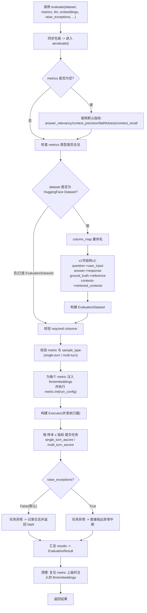

# Week03 RAGAS 工程实践指南

> 目标读者：已经有 RAG 基础，希望在 `week03` 中快速完成可复现的评估接入。

## 1. 先看结论

- 先跑通：`ragas_smoke_test.py`
- 再分层：先评答案质量，再加检索质量
- 先小样本：3-5 条检查流程，再扩到 20+ 条做稳定评估
- 重点避坑：`contexts` 格式、字段长度一致、环境变量与运行路径

---

## 3. 本仓库示例文件怎么选

| 文件 | 用途 | 适合阶段 |
| --- | --- | --- |
| `code/ragas/ragas_smoke_test.py` | 最小可跑通，验证环境和 API Key | 第一步 |
| `code/ragas/ragas_answer_quality_demo.py` | 只评答案质量 | 第二步 |
| `code/ragas/ragas_retrieval_metrics_demo.py` | 评检索质量（召回/精确） | 第三步 |
| `code/ragas/ragas_chinese_prompt_tuning.py` | 中文 prompt + 多指标组合 | 上线前离线调优 |
| `code/ragas/ragas_full_metrics_demo.py` | 全指标可运行示例（检索+生成） | 联调与回归 |
| `code/ragas/ragas_chinese_prompts.py` | 中文评估提示词模板 | 中文场景 |

---

## 4. 核心数据结构（最重要）

常见字段：

| 字段 | 类型 | 说明 |
| --- | --- | --- |
| `question` | `str` | 用户问题 |
| `answer` | `str` | 系统回答 |
| `ground_truth` | `str` | 参考答案 |
| `contexts` | `list[str]` 或 `list[list[str]]` | 检索上下文 |

实践原则：

- 所有字段长度必须一致
- 检索指标必须提供 `contexts`
- 有标准答案对比时优先提供 `ground_truth`

最小数据模板：

```python
from datasets import Dataset

samples = {
    "question": ["杭州有哪些景点？"],
    "answer": ["西湖、灵隐寺、千岛湖值得去。"],
    "ground_truth": ["杭州常见景点有西湖、灵隐寺、雷峰塔、千岛湖等。"],
    "contexts": [[
        "西湖是杭州核心景区。",
        "灵隐寺是杭州著名古刹。",
        "千岛湖适合休闲度假。",
    ]],
}

dataset = Dataset.from_dict(samples)
```

---

## 5. 评估指标（按阶段）

### 5.0 统一符号（后续公式用）

- 检索返回的上下文按顺序记为 \(c_1, c_2, \dots, c_K\)
- \(v_i \in \{0,1\}\)：第 \(i\) 个上下文是否相关（1 相关，0 不相关）
- 参考答案拆分出的关键信息单元记为 \(g_1, g_2, \dots, g_N\)
- \(a_i \in \{0,1\}\)：第 \(i\) 个信息单元是否被检索上下文覆盖（1 覆盖，0 未覆盖）
- 生成答案拆分出的陈述记为 \(s_1, s_2, \dots, s_M\)
- \(z_i \in \{0,1\}\)：第 \(i\) 个陈述是否被上下文支持（1 支持，0 不支持）

### 5.1 检索阶段指标

检索阶段关注“找到的内容是否对、是否全”，核心看两项：

1. 精准率（`context_precision`）
   检索结果中“有用上下文”的占比，越高表示噪声越少。
2. 召回率（`context_recall`）
   标准答案所需关键信息被检索覆盖的程度，越高表示漏召回越少。

典型解读：

- 精准率低、召回率高：内容找得多但噪声大，需要优化重排/过滤。
- 精准率高、召回率低：结果很“干净”但漏信息，需要放宽检索范围或改召回策略。

公式（通用 IR 口径）：

$$
\text{Precision}=\frac{\sum_{i=1}^{K} v_i}{K}
$$

$$
\text{Recall}=\frac{\sum_{i=1}^{N} a_i}{N}
$$

RAGAS 口径（`ragas-main` 与当前 `week03` 环境实现一致）：

- `context_precision` 使用 **Average Precision (AP)**，兼顾“相关文档是否排在前面”：
  $$
  P@i=\frac{\sum_{j=1}^{i} v_j}{i}
  $$
  $$
  AP=\frac{\sum_{i=1}^{K} P@i \cdot v_i}{\sum_{i=1}^{K} v_i+\varepsilon}
  $$
  其中符号含义如下：
  - \(K\)：检索返回的上下文总数（Top-K 的 K）
  - \(i\)：当前排名位置（从 1 到 K）
  - \(v_i\)：第 \(i\) 条上下文是否相关（相关=1，不相关=0）
  - \(P@i\)：截至第 \(i\) 位的精确率
  - \(\varepsilon\)：很小常数，用于防止分母为 0
- `context_recall` 是“参考答案信息单元被覆盖的比例”：
  $$
  \text{ContextRecall}=\frac{\sum_{i=1}^{N} a_i}{N}
  $$
  其中符号含义如下：
  - \(N\)：`ground_truth` 拆分后的关键信息单元总数
  - \(a_i\)：第 \(i\) 个信息单元是否被任一检索上下文覆盖（覆盖=1，未覆盖=0）

示例（检索阶段，每个指标 1 个）：

- `context_precision` 示例（强调“噪声比例”和“排序质量”）  
  
  - `question`：杭州西湖在哪个城市？  
  - 检索返回（按顺序）：  
    1) 西湖位于杭州市（相关）  
    2) 西湖十景介绍（部分相关）  
    3) 苏州园林介绍（不相关）  
    4) 杭州地铁线路（弱相关）  
  - 先按“是否直接支持问题答案”标注二值相关性（RAGAS 口径）：  
    - 对于“西湖在哪个城市”这个问题，只有 1) 直接回答了“在杭州”，其余不直接支持。  
    - 因此 \(v=[1,0,0,0]\)，\(K=4\)。
  - 按 AP 公式计算：  
    - \(P@1=\frac{1}{1}=1\)  
    - \(P@2=\frac{1}{2}=0.5\)（但 \(v_2=0\)，不计入分子）  
    - \(P@3=\frac{1}{3}=0.333\)（\(v_3=0\)，不计入）  
    - \(P@4=\frac{1}{4}=0.25\)（\(v_4=0\)，不计入）  
    - \(AP=\frac{P@1\cdot1 + P@2\cdot0 + P@3\cdot0 + P@4\cdot0}{1}=1.0\)
  - 对比“排序变差”场景（把唯一相关文档放到第 4 位）：  
    - \(v=[0,0,0,1]\)  
    - \(P@4=\frac{1}{4}=0.25\)  
    - \(AP=\frac{0.25\cdot1}{1}=0.25\)
  - 结论：在 AP 口径下，**相关文档位置越靠前，分数越高**；即使相关文档数量相同，排序不同，`context_precision` 也会差很多。
  
- `context_recall` 示例（强调“是否漏掉关键证据”）  
  - `ground_truth` 关键信息单元：  
    - g1: 西湖在杭州  
    - g2: 灵隐寺在杭州  
    - g3: 千岛湖在杭州周边旅游体系中常被提及  
  - 实际检索只覆盖 g1、g2，未覆盖 g3。  
  - 先做覆盖标注：  
    - \(a_1=1\)（g1 被覆盖）  
    - \(a_2=1\)（g2 被覆盖）  
    - \(a_3=0\)（g3 未覆盖）  
    - 因此 \(N=3\)。
  - 代入公式计算：  
    $$
    \text{ContextRecall}=\frac{a_1+a_2+a_3}{N}
    =\frac{1+1+0}{3}
    =\frac{2}{3}\approx 0.667
    $$
  - 对比“全覆盖”场景：若 \(a=[1,1,1]\)，则 `context_recall = 1.0`。  
  - 结论：`2/3` 说明有漏召回；此时应扩召回范围、补充查询词或优化召回策略。

### 5.2 生成阶段指标

生成阶段关注“答案是否真实、正确、贴题”，建议至少覆盖四项：

1. 真实性（`faithfulness`）
   答案是否忠实于 `contexts`，用于识别幻觉和脱离上下文的陈述。
2. 答案正确性（`answer_correctness`）
   答案相对 `ground_truth` 的事实准确性与完整性。
3. 语义相似度（`semantic_similarity` / `answer_similarity`）
   答案与标准答案在语义空间上的接近程度。
   注意：语义相似高不等于事实一定正确，需结合 `answer_correctness` 一起看。
4. 答案相关性（`answer_relevancy`）
   答案是否真正回应问题，避免“看起来正确但没回答核心问题”。

公式（概念与实现）：

- 真实性 `faithfulness`：
  $$
  \text{Faithfulness}=\frac{\sum_{i=1}^{M} z_i}{M}
  $$
  - 含义：答案中的陈述有多少比例能被检索上下文支持
  - 符号含义：
    - \(M\)：答案拆分后的陈述总数
    - \(z_i\)：第 \(i\) 条陈述是否被 `contexts` 支持（支持=1，不支持=0）

- 语义相似度 `semantic_similarity` / `answer_similarity`（向量余弦）：
  $$
  \text{Sim}=\frac{\mathbf{e}_{ref}\cdot \mathbf{e}_{ans}}
  {\lVert \mathbf{e}_{ref}\rVert \,\lVert \mathbf{e}_{ans}\rVert}
  $$
  - 其中 `e_ref` 是 `ground_truth` 向量，`e_ans` 是 `answer` 向量
  - 符号含义：
    - \(\mathbf{e}_{ref}\)：`ground_truth` 的向量表示
    - \(\mathbf{e}_{ans}\)：`answer` 的向量表示
    - \(\cdot\)：向量点积
    - \(\lVert \cdot \rVert\)：向量的 L2 范数（长度）
    - \(\text{Sim}\)：两段文本的余弦相似度

- 答案相关性 `answer_relevancy`（RAGAS 实现要点）：
  - 先基于答案生成 `n` 个反向问题 `q'1..q'n`（`strictness` 默认 `n=3`）
  $$
  \text{Rel}=\left(\frac{1}{n}\sum_{i=1}^{n}\cos(\mathbf{q},\mathbf{q'_i})\right)\cdot \mathbb{I}(\text{not\_noncommittal})
  $$
  - 现代 `ragas-main` 实现里使用“全部生成问题都 noncommittal 才置 0”；旧兼容实现更严格（出现 noncommittal 即可能置 0）
  - 符号含义：
    - \(n\)：反向问题数量（由 `strictness` 控制）
    - \(\mathbf{q}\)：原始问题向量
    - \(\mathbf{q'_i}\)：第 \(i\) 个反向问题向量
    - \(\cos(\mathbf{q},\mathbf{q'_i})\)：原问题与反向问题的语义相似度
    - \(\mathbb{I}(\text{not\_noncommittal})\)：指示函数，答案若被判定为“非回避”取 1，否则按实现策略降为 0 或强惩罚
    - \(\text{Rel}\)：答案相关性分数

- 答案正确性 `answer_correctness`（`ragas-main` 与当前 `week03` 环境实现一致）：
  - 先把答案与参考答案拆成陈述并分类为 `TP/FP/FN`
  $$
  P=\frac{TP}{TP+FP}, \quad R=\frac{TP}{TP+FN}
  $$
  $$
  F_{\beta}=\frac{(1+\beta^2)\cdot P\cdot R}{\beta^2\cdot P + R}
  $$
  默认 \(\beta=1\) 时即 \(F_1\)。
  $$
  \text{Correctness}=\frac{w_1\cdot F_{\beta}+w_2\cdot \text{Sim}}{w_1+w_2}
  $$
  - 默认权重 `w1=0.75`（事实性），`w2=0.25`（语义相似）
  - 符号含义：
    - \(TP\)：答案中正确且被参考答案覆盖的事实数
    - \(FP\)：答案中错误或无依据的事实数
    - \(FN\)：参考答案存在但答案缺失的事实数
    - \(P\)：精确率（正确事实占答案事实的比例）
    - \(R\)：召回率（答案覆盖参考事实的比例）
    - \(F_{\beta}\)：综合精确率与召回率的 F 分数（\(\beta=1\) 时为 \(F_1\)）
    - \(\text{Sim}\)：答案与参考答案的语义相似度
    - \(w_1, w_2\)：事实分与语义分的融合权重
    - \(\text{Correctness}\)：最终答案正确性分数

示例（5.2 生成指标，按公式可直接计算）：

- `faithfulness` 示例（手算）  
  - `contexts`：["西湖在杭州。", "灵隐寺在杭州。"]  
  - `answer`：`s1=西湖在苏州。` `s2=灵隐寺在杭州。`  
  - 支持标注：`z1=0`（不被支持），`z2=1`（被支持），所以 `M=2`。  
  - 代入公式：  
    $$
    \text{Faithfulness}=\frac{z_1+z_2}{M}=\frac{0+1}{2}=0.5
    $$
  - 结论：一半陈述可被证据支持，分数中等偏低。

- `answer_correctness` 示例（手算）  
  - `ground_truth` 事实：`g1=西湖在杭州`，`g2=灵隐寺在杭州`  
  - `answer`：`a1=西湖在杭州`（正确），`a2=雷峰塔在苏州`（错误）  
  - 统计：`TP=1`（命中 g1），`FP=1`（a2 错误），`FN=1`（g2 缺失）  
  - 先算 \(P,R,F_1\)：  
    $$
    P=\frac{1}{1+1}=0.5,\quad R=\frac{1}{1+1}=0.5,\quad F_1=0.5
    $$
  - 若语义相似度 `Sim=0.8`，默认权重 `w1=0.75,w2=0.25`：  
    $$
    \text{Correctness}=\frac{0.75\times0.5+0.25\times0.8}{0.75+0.25}
    =0.575
    $$
  - 结论：事实有错且有遗漏，即使语义相似不低，最终正确性也不会高。

- `semantic_similarity` / `answer_similarity` 示例（手算）  
  - 假设嵌入向量：\(\mathbf{e}_{ref}=(1,2)\)，\(\mathbf{e}_{ans}=(2,1)\)  
  - 代入余弦相似度：  
    $$
    \text{Sim}=\frac{1\times2+2\times1}{\sqrt{1^2+2^2}\cdot\sqrt{2^2+1^2}}
    =\frac{4}{\sqrt{5}\cdot\sqrt{5}}
    =0.8
    $$
  - 结论：语义接近度为 0.8（较高），但不代表事实一定正确。

- `answer_relevancy` 示例（手算）  
  - 原问题向量为 \(\mathbf{q}\)，从答案反向生成 3 个问题向量 \(\mathbf{q'_1},\mathbf{q'_2},\mathbf{q'_3}\)。  
  - 假设相似度分别为：`0.90, 0.80, 0.70`，且答案非回避（指示函数=1）。  
  - 代入公式：  
    $$
    \text{Rel}=\left(\frac{0.90+0.80+0.70}{3}\right)\times1=0.80
    $$
  - 若答案被判定为回避（指示函数=0），则该项会被置 0 或强惩罚（取决于实现）。

### 5.3 指标与字段映射

| 阶段 | 指标 | 主要用途 | 需要字段 |
| --- | --- | --- | --- |
| 检索 | `context_precision` | 控制噪声 | `question`, `contexts`, `ground_truth` |
| 检索 | `context_recall` | 检测漏召回 | `question`, `contexts`, `ground_truth` |
| 生成 | `faithfulness` | 检测幻觉 | `question`, `answer`, `contexts` |
| 生成 | `answer_correctness` | 检查事实正确与完整 | `question`, `answer`, `ground_truth` |
| 生成 | `semantic_similarity` / `answer_similarity` | 衡量语义接近度 | `answer`, `ground_truth` |
| 生成 | `answer_relevancy` | 判断是否答到点上 | `question`, `answer` |

补充说明：

- 在 `ragas-main` 的现代接口里主类是 `SemanticSimilarity`；在 `ragas.metrics` 兼容接口里可用 `answer_similarity`
- 分数整体通常在 `0~1` 区间；越接近 `1` 越好
- 指标间互补：`answer_similarity` 高并不代表 `faithfulness` 或 `answer_correctness` 一定高

### 5.4 推荐评估顺序

1. 先跑检索阶段：`context_precision + context_recall`
2. 再跑生成基础：`answer_relevancy + answer_similarity`
3. 最后做质量收口：`answer_correctness + faithfulness`

---

## 6. 评估模板（可直接改）

### 6.1 RAGAS 在本仓库怎么用

本仓库采用兼容接口：`ragas.evaluate + ragas.metrics`。  
完整可运行样例：`week03/code/ragas/ragas_full_metrics_demo.py`。
该样例已采用 `deepcopy` 指标实例，避免全局指标对象被污染。

流程只有 4 步：

1. 准备评估数据（`question/answer/ground_truth/contexts`）
2. 选择指标（检索阶段 + 生成阶段）
3. 调用 `evaluate(dataset=..., metrics=..., llm=..., embeddings=...)`
4. 将结果转为 DataFrame 做分析（`result.to_pandas()`）

### 6.2 `evaluate()` 参数怎么对应

```python
result = evaluate(
    dataset=dataset,           # datasets.Dataset，包含评测样本
    metrics=metrics,           # 指标列表
    llm=llm,                   # 用于 LLM 评估判断
    embeddings=embeddings,     # 用于相似度与相关性计算
)
```

- `dataset`：每行一个样本，字段名必须和指标要求匹配
- `metrics`：可混合多个指标，建议先少后多逐步加
- `llm`：例如 `Tongyi(model_name="qwen-plus", temperature=0)`
- `embeddings`：例如 `DashScopeEmbeddings(model="text-embedding-v3")`

### 6.3 指标与字段的最小映射

- `context_precision/context_recall` 需要：`question`, `contexts`, `ground_truth`
- `faithfulness` 需要：`question`, `answer`, `contexts`
- `answer_correctness` 需要：`question`, `answer`, `ground_truth`
- `answer_similarity` 需要：`answer`, `ground_truth`
- `answer_relevancy` 需要：`question`, `answer`

如果字段缺失或长度不一致，`evaluate()` 会直接报错。

### 6.4 运行命令

```bash
cd week03
source .venv/bin/activate
python code/ragas/ragas_full_metrics_demo.py
```

### 6.5 结果怎么看

- `result.to_pandas()`：看每条样本在各指标上的明细分数
- `df.mean(numeric_only=True)`：看各指标均值，用于版本对比
- 实践上建议保存成 CSV，配合 commit id 追踪趋势

`ragas-main` 的现代接口（`ragas.metrics.collections`）通常是“单指标对象 + `ascore`（异步）”模式；本仓库当前以兼容接口为主，便于和现有脚本统一。

### 6.6 `evaluate()` 的源码执行原理（基于 `ragas-main`）

参考源码：`ragas-main/src/ragas/evaluation.py`、`ragas-main/src/ragas/validation.py`、`ragas-main/src/ragas/executor.py`。



`evaluate()` 的主流程可概括为：

1. `evaluate()` 只是同步包装器  
   - 内部调用异步 `aevaluate()`（`evaluation.py`）  
   - 默认会走 `nest_asyncio` 兼容 Jupyter

2. 参数与默认指标处理  
   - 若 `metrics is None`，默认使用：`answer_relevancy/context_precision/faithfulness/context_recall`
   - 校验 `metrics` 必须是已初始化的 metric 对象列表

3. 数据集标准化  
   - 如果传入的是 HuggingFace `Dataset`，会先做列名映射（`column_map`）  
   - 再执行 v1 到 v2 字段名转换（`question -> user_input`、`answer -> response`、`ground_truth -> reference`、`contexts -> retrieved_contexts`）  
   - 转成 `EvaluationDataset`

4. 校验数据与指标兼容性  
   - `validate_required_columns()`：检查每个指标需要的字段是否齐全  
   - `validate_supported_metrics()`：检查数据类型（single-turn / multi-turn）与指标类型是否匹配

5. 给指标注入依赖并初始化  
   - 对需要 LLM 的指标注入 `llm`  
   - 对需要 embeddings 的指标注入 `embeddings`  
   - `AnswerCorrectness` 会额外处理 `answer_similarity` 依赖  
   - 调用每个指标的 `metric.init(run_config)`

6. 并发执行评分任务  
   - 构建 `Executor`，按“样本 x 指标”提交异步任务  
   - single-turn 走 `metric.single_turn_ascore(...)`  
   - multi-turn 走 `metric.multi_turn_ascore(...)`

7. 收集结果并组装 `EvaluationResult`  
   - 按原任务顺序回填每条样本的各指标分数  
   - 形成 `scores`，并最终返回 `EvaluationResult`

8. 清理现场  
   - 把自动注入到 metric 的 llm/embeddings 复位，避免污染后续调用

### 6.7 为什么会出现 `NaN`

核心原因在 `Executor`：

- `raise_exceptions=False`（默认）时，任务异常不会抛出，而是记录错误并返回 `np.nan`
- `raise_exceptions=True` 时，任一任务异常会立即抛出（例如 401 `InvalidApiKey`）

因此在工程里建议：

- 调试阶段：`raise_exceptions=True`（快速定位问题）
- 批量离线评估：可按需用 `False`，但要统计并告警 NaN 比例

### 6.8 `ragas_chinese_prompt_tuning.py` 在生产中的价值

`ragas_chinese_prompt_tuning.py` 的定位是“中文评测器调优脚本”，不是在线业务链路代码。

它主要解决两个问题：

1. 中文评测偏差  
   - RAGAS 默认很多提示词是英文  
   - 中文问答时可能出现判分偏差（特别是相关性、忠实度类指标）

2. 上线前质量门禁  
   - 同时跑检索指标 + 生成指标  
   - 用于模型切换、Prompt 改版、召回策略调整前后的离线对比

推荐使用方式：

- 开发/发布流程中做离线批评估（smoke + release）
- 保存每次评测结果和元数据（模型、数据版本、commit id）
- 低分样本回看，定位是检索问题还是生成问题

不建议方式：

- 放到在线 API 每次请求实时执行（成本高、延迟高、稳定性差）

### 6.9 中文 Prompt 的安全改法（`deepcopy`）

在同一个 Python 进程里，`ragas.metrics` 导入的很多指标是“全局对象”。  
如果直接修改它们的 prompt，会影响后续其它评测任务。

推荐做法：先 `deepcopy` 一份指标对象，再改复制品的 prompt。

```python
from copy import deepcopy
from ragas.metrics import answer_relevancy

zh_answer_relevancy = deepcopy(answer_relevancy)
zh_answer_relevancy.question_generation.instruction = "..."
zh_answer_relevancy.question_generation.examples = [...]
```

然后在 `evaluate(..., metrics=[...])` 里使用复制后的变量。  
本仓库 `week03/code/ragas/ragas_chinese_prompt_tuning.py` 与 `week03/code/ragas/ragas_full_metrics_demo.py` 都已按该方式实现。

---

## 7. 常见问题速查

### 7.1 鉴权失败

现象：`AuthenticationError` 或 401

处理：

- 检查 `week03/code/.env` 是否存在且 key 正确
- 确认环境变量已加载：`echo $DASHSCOPE_API_KEY`

### 7.2 导入失败

现象：`ModuleNotFoundError: No module named 'ragas'`

处理：

```bash
cd week03
source .venv/bin/activate
uv sync --locked
```

### 7.3 字段长度不一致

现象：`ValueError: All arrays must be of the same length`

处理：确保 `question/answer/ground_truth/contexts` 条数一致。

### 7.4 `contexts` 格式错误

现象：`TypeError: expected string or list of strings`

处理：每个问题对应一个 `contexts` 条目；单条通常是 `list[str]`。

### 7.5 `ragas_chinese_prompt_tuning.py` 运行报找不到 prompt

处理：在 `week03/code/ragas` 目录运行该脚本，或直接从 `week03` 根目录执行 `python code/ragas/ragas_chinese_prompt_tuning.py`。

---

## 8. 工程化落地建议

### 8.1 建立两层评测集

- `smoke`: 20 条左右，PR 前必跑
- `release`: 100+ 条，版本发布前跑

### 8.2 记录评测元数据

每次评估至少记录：

- 模型名
- 数据集版本
- 代码 commit id
- 指标均值 + 分位数

### 8.3 低分样本复盘

按低分样本回看：

1. 检索是否漏召回
2. 上下文是否噪声过多
3. 生成是否偏离问题或幻觉
4. `ground_truth` 是否本身不可靠

### 8.4 自动化流水线建议

- PR 流水线：只跑 `smoke` + 关键指标
- Nightly：全量数据 + 全指标
- 输出统一 CSV/JSON，便于趋势看板接入

---

## 9. 提供商配置（最简）

### 通义千问（本仓库默认）

```bash
export DASHSCOPE_API_KEY="your-key"
```

```python
from langchain_community.llms.tongyi import Tongyi
from langchain_community.embeddings import DashScopeEmbeddings

llm = Tongyi(model_name="qwen-plus")
embeddings = DashScopeEmbeddings(model="text-embedding-v3")
```


---

## 10. 最终检查清单

- [ ] 虚拟环境已激活，依赖已安装
- [ ] API Key 正确
- [ ] 先用 3-5 条样本跑通
- [ ] 字段长度一致，`contexts` 结构正确
- [ ] 指标按“先简单后完整”逐步增加
- [ ] 结果和元数据已保存，可复现

---

## 11. 参考资源

- Ragas 官方文档：https://docs.ragas.io/
- Ragas GitHub：https://github.com/explodinggradients/ragas
- 本仓库 RAGAS 代码目录：`week03/code/ragas/`
